**SFDR (Sustainable Finance Disclosure Regulation)** er EUs omfattende regelverk for [bærekraftige investeringer](/blogs/regnskap/hva-er-barekraftige-investeringer "Hva er Bærekraftige Investeringer? Guide til ESG og Ansvarlige Investeringer") og finansiell rapportering. Denne forordningen, som trådte i kraft i mars 2021, har revolusjonert hvordan finansielle tjenesteytelere må **rapportere** og **dokumentere** sine bærekraftspraksiser. For norske selskaper og investorer er SFDR blitt en kritisk faktor i [kapitalforvaltning](/blogs/regnskap/hva-er-kapital "Hva er Kapital? Komplett Guide til Kapitalformer og Kapitalforvaltning") og regnskapsrapportering.

## Seksjon 1: SFDR - Grunnleggende Oversikt

### 1.1 Hva er SFDR?

**Sustainable Finance Disclosure Regulation** (SFDR) er en EU-forordning som krever **transparens** og **standardisering** av bærekraftsinformasjon i finanssektoren. Målet er å:

* Forebygge **grønnvasking** (greenwashing) i finansmarkedene
* Øke **tillit** til bærekraftige finansprodukter  
* Standardisere [rapportering](/blogs/regnskap/hva-er-rapportering "Hva er Rapportering? Guide til Finansiell og Regulatorisk Rapportering") av bærekraftsrisiko og -påvirkning
* Fremme **kapitalallokering** til bærekraftige investeringer

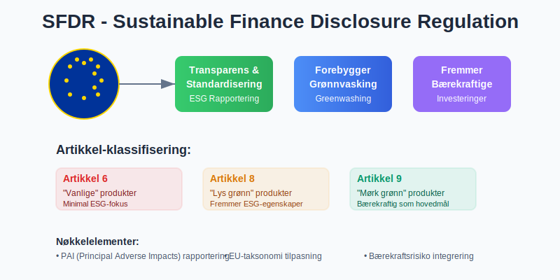

### 1.2 Hvem Påvirkes av SFDR?

SFDR gjelder for alle **finansmarkedsdeltakere** og **finansielle rådgivere** som opererer i EU eller tilbyr tjenester til EU-investorer:

| **Aktørtype** | **SFDR-krav** | **Rapporteringsansvar** |
|---------------|---------------|-------------------------|
| Forvaltningsselskaper | Produktklassifisering | Artikkel 6, 8, 9 rapportering |
| Pensjonsfond | Bærekraftsintegrasjon | [Årlig rapportering](/blogs/regnskap/hva-er-arsrapport "Hva er Årsrapport? Komplett Guide til Årsregnskapet") |
| Forsikringsselskaper | Risikotransparens | PAI (Principal Adverse Impact) |
| Investeringsbanker | Due diligence | ESG-vurderinger |
| Asset managers | Porteføljerapportering | Periodisk offenliggjøring |

### 1.3 SFDR og Norske Selskaper

Selv om Norge ikke er EU-medlem, påvirkes norske aktører gjennom:

* **EØS-avtalen** og finansmarkedsintegrasjon
* Norske fond som markedsføres i EU
* Internasjonale investeringer og [kapitalstrømmer](/blogs/regnskap/hva-er-kontantstr-m "Hva er Kontantstrøm? Komplett Guide til Kontantstrømanalyse")
* [Compliance](/blogs/regnskap/hva-er-compliance "Hva er Compliance? Guide til Regelverksoverholdelse i Regnskap")-krav fra europeiske investorer

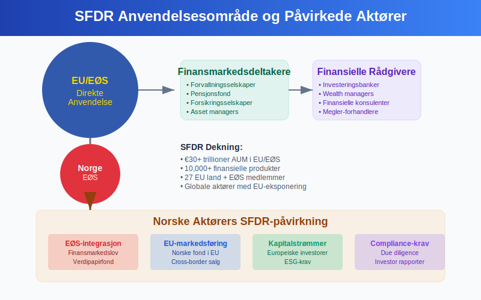

## Seksjon 2: SFDR Artikkel-klassifisering

### 2.1 Artikkel 6 - "Vanlige" Produkter

**Artikkel 6-produkter** er finansielle produkter som:
- Ikke fremmer **miljømessige** eller **sosiale egenskaper**
- Ikke har bærekraftighetsintegrering som hovedmål
- Må likevel rapportere om **PAI** (Principal Adverse Impacts)

**Kjennetegn:**
* Tradisjonell [avkastning](/blogs/regnskap/hva-er-avkastning "Hva er Avkastning på Investering? Beregning og Analyse av ROI")-fokusert strategi
* Minimal ESG-integrering
* Laveste rapporteringskrav under SFDR

### 2.2 Artikkel 8 - "Lyse grønne" Produkter  

**Artikkel 8-produkter** fremmer **miljømessige** eller **sosiale egenskaper**, men har ikke bærekraftige investeringer som primærmål.

**Rapporteringskrav:**
* Pre-contractual disclosures om ESG-karakteristika
* Periodisk rapportering om måloppnåelse
* **Do No Significant Harm** (DNSH) prinsipper
* [God forvaltningsskikk](/blogs/regnskap/god-regnskapsskikk "God Regnskapsskikk - Prinsipper og Praksis for Norsk Regnskap")-vurderinger

### 2.3 Artikkel 9 - "Mørke grønne" Produkter

**Artikkel 9-produkter** har **bærekraftige investeringer** som hovedmål og strengeste rapporteringskrav.

**Karakteristika:**
* Målbar **positiv påvirkning** på miljø eller samfunn
* Robust **due diligence**-prosess
* Kvantifiserbare bærekraftsindikatorer
* Høyeste nivå av transparens og [ansvarlighet](/blogs/regnskap/hva-er-ansvar "Hva er Ansvar i Regnskap? Guide til Forpliktelser og Ansvar")

| **Artikkel** | **Bærekraftsfokus** | **Rapporteringsomfang** | **Markedsandel** |
|-------------|---------------------|-------------------------|------------------|
| Artikkel 6 | Minimal | Grunnleggende PAI | ~60% |
| Artikkel 8 | Moderat | Utvidet ESG | ~35% |
| Artikkel 9 | Høy | Omfattende bærekraft | ~5% |

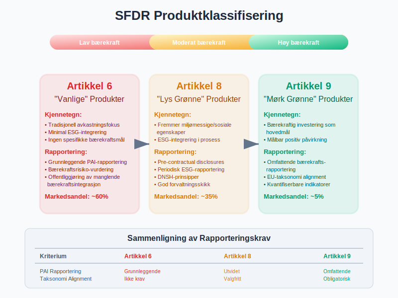

## Seksjon 3: Principal Adverse Impacts (PAI)

### 3.1 Hva er PAI?

**Principal Adverse Impacts** er negative påvirkninger på **bærekraftsfaktorer** som følge av investeringsbeslutninger. SFDR krever at finansmarkedsdeltakere identifiserer, måler og rapporterer disse påvirkningene.

### 3.2 PAI-indikatorer for Miljø

**Klimaendringer og andre miljørelaterte indikatorer:**

| **Indikator** | **Måleenhet** | **Rapporteringsfrekvens** |
|---------------|---------------|--------------------------|
| GHG-utslipp Scope 1 | tCO2eq | Årlig |
| GHG-utslipp Scope 2 | tCO2eq | Årlig |
| GHG-utslipp Scope 3 | tCO2eq | Årlig |
| Carbon footprint | tCO2eq/M‚¬ investert | Årlig |
| GHG-intensitet | tCO2eq/M‚¬ omsetning | Årlig |
| Energiforbruk | MWh | Årlig |
| Biodiversitetspåvirkning | Prosent av investeringer | Årlig |
| Vannforbruk | Kubikkmeter | Årlig |
| Avfallsgenerering | Tonn farlig avfall | Årlig |

### 3.3 PAI-indikatorer for Sosiale og Ansatte-forhold

**Sosiale og arbeidsrettsindikatorer:**

* **UNGC**-prinsipper (UN Global Compact) brudd
* **OECD-retningslinjer** for multinasjonale selskaper
* Mangel på prosesser for **UNGC** og **OECD**-overholdelse
* **Kjønnsgap** i [styrerepresentasjon](/blogs/regnskap/hva-er-styre "Hva er Styre? Guide til Styrets Rolle og Ansvar i Selskaper")
* Eksponering mot **kontroversielle våpen**

### 3.4 PAI-rapportering og [Compliance](/blogs/regnskap/hva-er-compliance "Hva er Compliance? Guide til Regelverksoverholdelse i Regnskap")

**Store finansmarkedsdeltakere** (>500 ansatte) **må** publisere PAI-uttalelser, mens mindre aktører kan velge å **opt-in**.

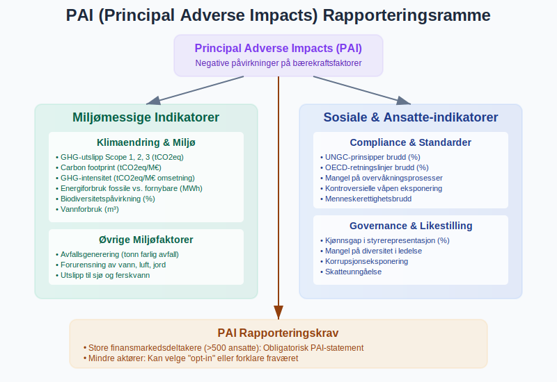

## Seksjon 4: SFDR og Regnskapsintegrasjon

### 4.1 SFDR-påvirkning på [Finansiell Rapportering](/blogs/regnskap/hva-er-rapportering "Hva er Rapportering? Guide til Finansiell og Regulatorisk Rapportering")

SFDR krever integrasjon med eksisterende regnskapsstandarder:

#### IFRS-tilpasning
* **IFRS 7** Financial Instruments: Disclosures
* **IFRS 9** Financial Instruments: ESG-faktorer i [kredittap](/blogs/regnskap/hva-er-tapsavsetning "Hva er Tapsavsetning? Guide til Nedskrivninger og Kredittap")-modeller
* **IFRS 13** Fair Value Measurement: ESG i verdsettelse

#### Norske Regnskapsstandarder (NGRS)
* [God regnskapsskikk](/blogs/regnskap/god-regnskapsskikk "God Regnskapsskikk - Prinsipper og Praksis for Norsk Regnskap") og bærekraftstransparens
* **NRS 16** Finansielle instrumenter
* **Årsregnskapslovens** §3-3c om bærekraftsrapportering

### 4.2 SFDR Data i [Balansen](/blogs/regnskap/hva-er-balanse "Hva er Balanse i Regnskap? Komplett Guide til Balansens Oppbygging og Funksjon")

**Bærekraftsjusteringer** kan påvirke:

| **Balansepost** | **SFDR-påvirkning** | **Regnskapsbehandling** |
|-----------------|-------------------|------------------------|
| [Finansielle eiendeler](/blogs/regnskap/hva-er-finansielle-eiendeler "Hva er Finansielle Eiendeler? Guide til Investeringer og Verdipapirer") | ESG-verdsettelse | Fair value justering |
| [Goodwill](/blogs/regnskap/hva-er-goodwill "Hva er Goodwill? Komplett Guide til Immaterielle Eiendeler") | Bærekraftsrisiko | Nedskrivningstesting |
| [Avsetninger](/blogs/regnskap/avsetning "Avsetning i Regnskap - Komplett Guide til Avsetninger og Estimater") | Klimarisiko | Økte miljøforpliktelser |
| [Immaterielle eiendeler](/blogs/regnskap/hva-er-immaterielle-eiendeler "Hva er Immaterielle Eiendeler? Guide til Varemerker, Patenter og Goodwill") | ESG-merker | Aktivering av bærekrafts-IP |

### 4.3 [Resultatregnskap](/blogs/regnskap/hva-er-resultatregnskap "Hva er Resultatregnskap? Komplett Guide til Driftsresultat og Årsresultat") og SFDR

**ESG-faktorer** påvirker resultatlinjer:

* **Grønne inntekter:** Separat rapportering av bærekraftige inntekter
* **Transisjonskostnader:** Kostnader knyttet til ESG-transformasjon  
* **Klimarisikojusteringer:** [Nedskrivninger](/blogs/regnskap/hva-er-nedskrivning "Hva er Nedskrivning av Eiendeler? Guide til Verdifall og Regnskapsføring") basert på klimascenarier
* **ESG-relaterte gebyr:** Rådgivning og [compliance](/blogs/regnskap/hva-er-compliance "Hva er Compliance? Guide til Regelverksoverholdelse i Regnskap")-kostnader

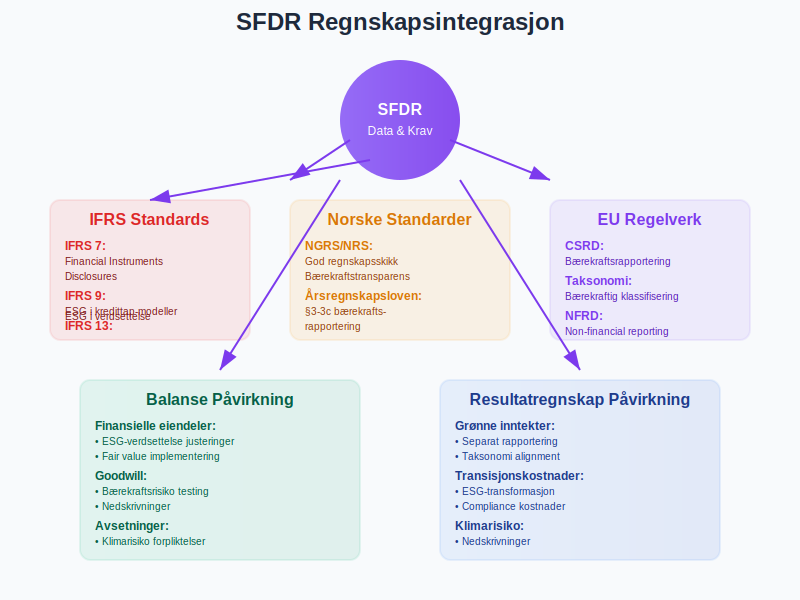

## Seksjon 5: Taksonomi-forordningen og SFDR

### 5.1 EU-taksonomi som SFDR-fundament

**[EU-taksonomien](/blogs/regnskap/hva-er-eu-taksonomien "EU-taksonomien: Klassifiseringssystem for Bærekraftige Aktiviteter")** definerer hva som kvalifiserer som **miljømessig bærekraftige** økonomiske aktiviteter. Den utgjør grunnlaget for SFDR Artikkel 9-klassifiseringer.

### 5.2 Taksonomiens Seks Miljømål

1. **Klimaendring tilpasning**
2. **Klimaendring mitigering** 
3. **Bærekraftig bruk** av vann og marine ressurser
4. **Overgang til sirkulær økonomi**
5. **Forurensningsforebygging** og kontroll
6. **Beskyttelse og restaurering** av biodiversitet og økosystemer

### 5.3 Taksonomi-tilpasning (Alignment) Rapportering

**Artikkel 9 fond** må rapportere:
* **Prosent taksonomi-tilpassede investeringer**
* **Technical screening criteria** oppfyllelse
* **DNSH** (Do No Significant Harm) vurderinger
* **Minimum social safeguards** overholdelse

| **Sektor** | **Taksonomi-andel** | **SFDR-relevans** |
|-----------|---------------------|-------------------|
| Fornybar energi | 90-100% | Høy |
| Transport | 30-60% | Moderat |
| Bygg | 40-70% | Høy |
| Industri | 20-50% | Moderat |
| IKT | 10-30% | Lav |

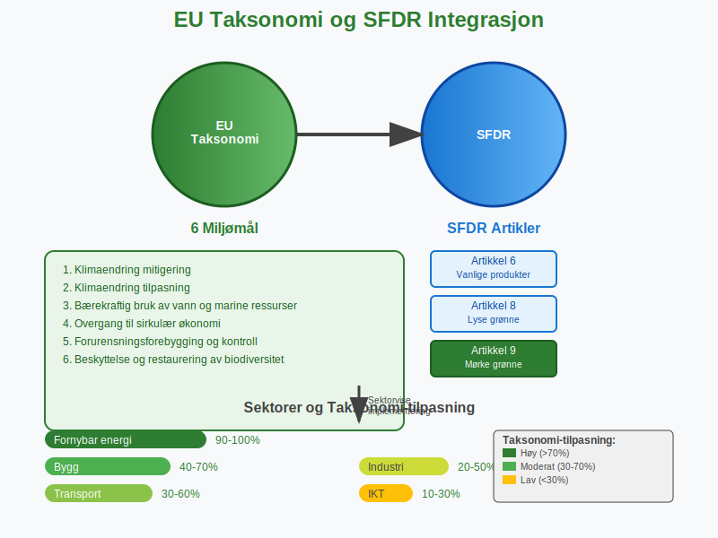

## Seksjon 6: SFDR Compliance og Implementering

### 6.1 Organisatoriske Krav

**Effektiv SFDR-implementering** krever:

#### Governance-struktur
* **ESG-komité** på [styrenivå](/blogs/regnskap/hva-er-styre "Hva er Styre? Guide til Styrets Rolle og Ansvar i Selskaper")
* **Bærekraftsansvarlig** (Chief Sustainability Officer)
* **Data og teknologi**-team for ESG-rapportering
* **[Internkontroll](/blogs/regnskap/hva-er-internkontroll "Hva er Internkontroll? Guide til Interne Kontrollsystemer")** for bærekraftsdata

#### Prosesser og Retningslinjer
* **ESG-integrasjon** i investeringsprosessen
* **Due diligence**-prosedyrer for bærekraft
* **Risikostyring** for ESG-faktorer
* **Rapporteringsrutiner** og [kvalitetssikring](/blogs/regnskap/hva-er-qa-kvalitetssikring "Hva er QA Kvalitetssikring? Guide til Kvalitetskontroll i Regnskap")

### 6.2 Teknologi og Dataløsninger

**SFDR-compliance** krever robuste IT-systemer:

* **ESG-databaser** (MSCI, Sustainalytics, Bloomberg)
* **Portfolio management**-systemer med ESG-integrering  
* **Rapporteringsverktøy** for SFDR-dokumentasjon
* **[Datavalidering](/blogs/regnskap/hva-er-datavalidering "Hva er Datavalidering? Guide til Datakvalitet i Regnskap")** og kvalitetskontroll

### 6.3 Kostnader og [Investeringer](/blogs/regnskap/hva-er-investering "Hva er Investering? Guide til Investeringstyper og Regnskapsføring")

**SFDR-implementering** medfører betydelige kostnader:

| **Kostnadskategori** | **Engangsbeløp** | **Årlige kostnader** |
|---------------------|------------------|---------------------|
| IT-systemer | ‚¬50,000-200,000 | ‚¬20,000-50,000 |
| ESG-data | ‚¬10,000-100,000 | ‚¬25,000-150,000 |
| Personell | ‚¬100,000-300,000 | ‚¬150,000-500,000 |
| Konsulenter | ‚¬25,000-100,000 | ‚¬10,000-50,000 |
| **Total** | **‚¬185,000-700,000** | **‚¬205,000-750,000** |

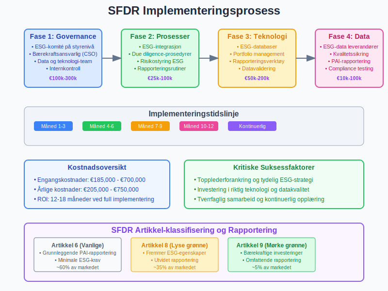

## Seksjon 7: SFDR og Risikostyring

### 7.1 Bærekraftsrisiko i [Risikostyring](/blogs/regnskap/hva-er-risikostyring "Hva er Risikostyring? Guide til Enterprise Risk Management")

SFDR krever at **bærekraftsrisiko** integreres i tradisjonelle risikostyringsprosesser:

#### Fysisk Klimarisiko
* **Akutte risiker:** Ekstremvær, naturkatastrofer
* **Kroniske risiker:** Havnivåstigning, temperaturendringer
* **Påvirkning på [eiendeler](/blogs/regnskap/hva-er-eiendel "Hva er Eiendel i Regnskap? Komplett Guide til Eiendom og Verdier")** og verdikjeder

#### Overgangsrisiko
* **Regulatorisk risiko:** Nye lover og skatter (f.eks. karbonprising)
* **Teknologirisiko:** Utfasing av fossile løsninger
* **Markedsrisiko:** Endret forbrukerpreferanser
* **Omdømmerisiko:** ESG-kontroversier og boikott

### 7.2 ESG-risiko i [Kredittvurdering](/blogs/regnskap/hva-er-kredittrisiko "Hva er Kredittrisiko? Guide til Kredittvurdering og Risikostyring")

**SFDR påvirker kredittrisiko** gjennom:

* **Miljørisiko** påvirker tilbakebetalingsevne
* **Sosial risiko** (f.eks. arbeidskonflikter) påvirker drift
* **Governance-risiko** øker sannsynlighet for [misligholdelse](/blogs/regnskap/hva-er-mislighold "Hva er Mislighold? Guide til Kreditthendelser og Konsekvenser")

### 7.3 Integrert Risiko- og [Kapitalstyring](/blogs/regnskap/hva-er-kapital "Hva er Kapital? Komplett Guide til Kapitalformer og Kapitalforvaltning")

| **Risikokomponent** | **SFDR-integrasjon** | **Kapitalallokering** |
|-------------------|---------------------|----------------------|
| [Markedsrisiko](/blogs/regnskap/hva-er-markedsrisiko "Hva er Markedsrisiko? Guide til Finansmarkedsrisiko") | ESG-faktorer i prising | Overweight bærekraftige sektorer |
| [Kredittrisiko](/blogs/regnskap/hva-er-kredittrisiko "Hva er Kredittrisiko? Guide til Kredittvurdering og Risikostyring") | ESG-scoring i rating | Underweight høyrisiko-sektorer |
| [Operasjonell risiko](/blogs/regnskap/hva-er-operasjonell-risiko "Hva er Operasjonell Risiko? Guide til Risikohåndtering") | ESG-prosess kvalitet | [Investering](/blogs/regnskap/hva-er-investering "Hva er Investering? Guide til Investeringstyper og Regnskapsføring") i ESG-teknologi |
| [Likviditetsrisiko](/blogs/regnskap/hva-er-likviditetsrisiko "Hva er Likviditetsrisiko? Guide til Likviditetsstyring") | ESG-flow volatilitet | Grønne obligasjoner som buffer |

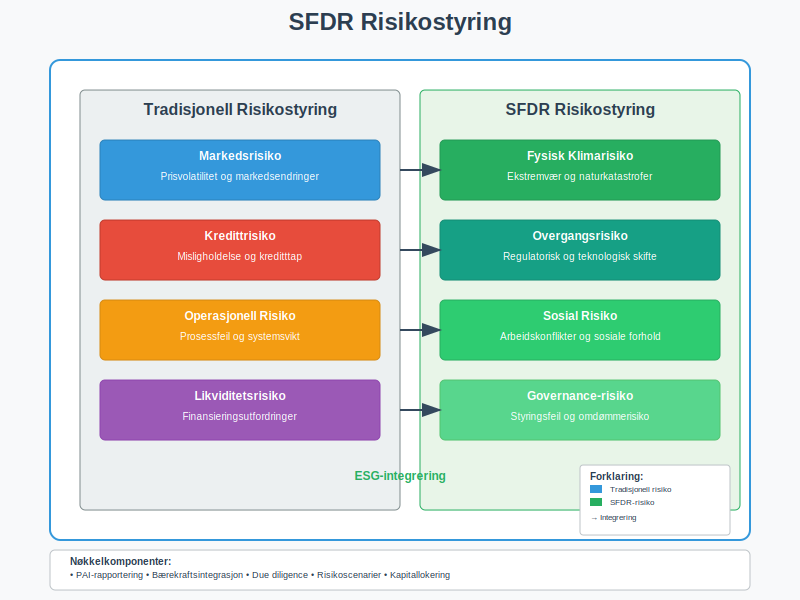

## Seksjon 8: Markedspåvirkning og Trends

### 8.1 Kapitalstrømmer og SFDR-effekt

**SFDR har drevet betydelige kapitalstrømmer:**

* **‚¬300+ milliarder** inn i Artikkel 8-produkter siden 2021
* **‚¬50+ milliarder** inn i Artikkel 9-produkter  
* **"Brown to Green" reallokering** på ‚¬100+ milliarder
* **Priseffekter:** ESG-premiums og "brown discounts"

### 8.2 Produktinnovasjon og Utvikling

**SFDR har accelerert produktutvikling:**

#### Nye Produktkategorier
* **Impact bonds** med målbare utfall
* **Transition funds** for klimaomstilling
* **Nature-positive** investeringer
* **Social outcome** produkter

#### Gebyr og Prising
* **ESG-premiums:** 10-20 basispunkter for Artikkel 8
* **Impact-fee:** 20-50 basispunkter for Artikkel 9
* **Data-kostnader:** Økte driftskostnader for ESG-rapportering

### 8.3 Konkurransedynamikk

| **Aktørtype** | **SFDR-fordel** | **Utfordringer** |
|---------------|----------------|------------------|
| Store forvaltere | Ressurser til compliance | Reputasjonsrisiko |
| Boutique ESG-forvaltere | Spesialistekspertise | Teknologi og skala |
| Tradisjonelle forvaltere | Eksisterende kundebase | ESG-transformasjon |
| Nye ESG-aktører | Ren ESG-profil | [Kapital](/blogs/regnskap/hva-er-kapital "Hva er Kapital? Komplett Guide til Kapitalformer og Kapitalforvaltning") og tillit |

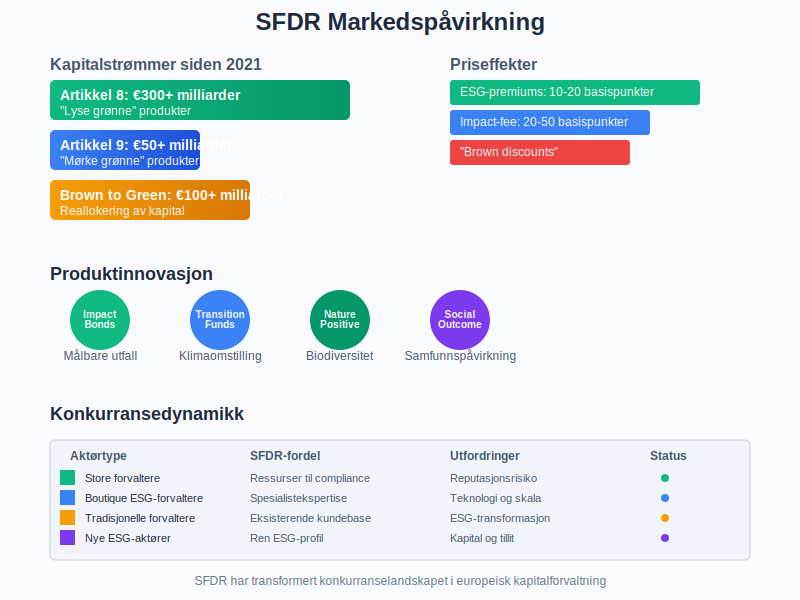

## Seksjon 9: SFDR og Digitalisering

### 9.1 RegTech for SFDR-compliance

**Regulatory Technology** løsninger for SFDR:

#### Automatiserte Rapporteringsløsninger
* **Template-generering** for SFDR-dokumenter
* **Data aggregering** fra multiple kilder
* **[Kvalitetssikring](/blogs/regnskap/hva-er-qa-kvalitetssikring "Hva er QA Kvalitetssikring? Guide til Kvalitetskontroll i Regnskap")** og validering av ESG-data
* **Versjonskontroll** og audit trails

#### AI og Machine Learning
* **ESG-scoring** algoritmer
* **Controversy detection** i media overvåkning
* **Predictive analytics** for bærekraftsutfall
* **Natural language processing** for ESG-dokumenter

### 9.2 Blockchain og Transparens

**Distributed ledger teknologi** for SFDR:

* **Sporbarhet** av bærekraftsprestasjon
* **Immutable records** for ESG-data
* **Smart contracts** for impact-baserte betalinger
* **Decentralisert verifisering** av bærekraftsutfall

### 9.3 API-økosystem for ESG-data

**Standardiserte API-er** forbedrer SFDR-effektivitet:

| **API-kategori** | **Funksjonalitet** | **Leverandører** |
|------------------|-------------------|------------------|
| ESG-data | Real-time scoring | MSCI, Bloomberg, Refinitiv |
| Carbon footprint | GHG-beregninger | Trucost, CDP |
| Taksonomi | EU-alignment scoring | ISS, Sustainalytics |
| [Rapportering](/blogs/regnskap/hva-er-rapportering "Hva er Rapportering? Guide til Finansiell og Regulatorisk Rapportering") | Template og submission | SimCorp, FundRecs |

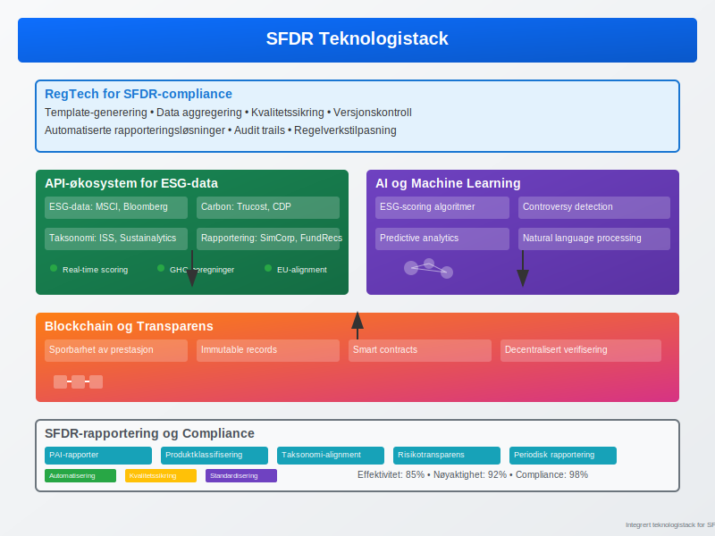

## Seksjon 10: Fremtiden for SFDR

### 10.1 Regulatorisk Utvikling

**SFDR evolusjon de neste 3-5 årene:**

#### Level 2 Regulatory Technical Standards
* **Detaljerte rapporteringsformater** for PAI-indikatorer
* **Standardiserte metodikker** for impact-måling
* **Kvantitative terskler** for Artikkel 8 og 9-klassifisering

#### Utvidelser og Revisjoner
* **Utvidede PAI-indikatorer** inkludert sosiale faktorer
* **Taksonomi-utvidelse** til sosiale og governance-dimensjoner
* **Globale standarder** gjennom ISSB og TNFD

### 10.2 Markedsutvikling og Innovation

**Fremtidige produkttrender:**

* **Personaliserte ESG-porteføljer** basert på investorpreferanser
* **Real asset ESG-produkter** (infrastruktur, eiendom)
* **Emerging markets ESG** med utvidet datagrunnlag
* **Crypto og DeFi ESG** med nye måleramme

### 10.3 Integrering med Andre Initiativ

**SFDR harmonisering med:**

* **TCFD** (Task Force on Climate-related Financial Disclosures)
* **TNFD** (Taskforce on Nature-related Financial Disclosures)  
* **ISSB** (International Sustainability Standards Board)
* **CSRD** (Corporate Sustainability Reporting Directive)

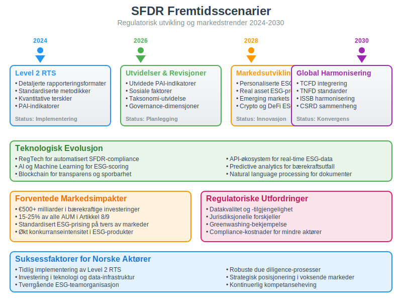

## Konklusjon

**SFDR (Sustainable Finance Disclosure Regulation)** representerer et paradigmeskifte i finansiell rapportering og [investeringsforvaltning](/blogs/regnskap/hva-er-investeringsforvaltning "Hva er Investeringsforvaltning? Guide til Kapitalforvaltning og Porteføljehåndtering"). For norske selskaper og investorer er regelverket blitt en kritisk suksessfaktor i **bærekraftig kapitalallokering** og **risikostyring**.

**Nøkkelinnsikter:**

* **Transparens og standardisering:** SFDR har skapt felles språk for bærekraftsrapportering
* **Markedstransformasjon:** Betydelige kapitalstrømmer mot bærekraftige investeringer
* **Operasjonell kompleksitet:** Krav til nye systemer, prosesser og kompetanse
* **Konkurransefordel:** Tidlig implementering gir strategiske fordeler

**Praktiske anbefalinger:**

For **finansmarkedsdeltakere:**
* Start med **Artikkel 6-compliance** og bygg gradvis mot Artikkel 8/9
* Invester i **teknologi og data**-infrastruktur tidlig
* Etabler **tverrgående ESG-teamorganisasjon**
* Utvikle **robuste due diligence**-prosesser

For **norske investorer:**
* Forstå **SFDR-klassifiseringen** av produkter før investering  
* Krev **transparent rapportering** av PAI og bærekraftsutfall
* Integrer **ESG-faktorer** i [risikostyring](/blogs/regnskap/hva-er-risikostyring "Hva er Risikostyring? Guide til Enterprise Risk Management")
* Vurder **EØS-implementering** av SFDR-krav

**Fremtidsperspektiv:**

SFDR er kun begynnelsen på en omfattende transformasjon av finansmarkedene mot **bærekraftighetsintegrering**. Ved å forstå regelverkets implikasjoner og muligheter, kan norske aktører posisjonere seg strategisk i det voksende markedet for [bærekraftige investeringer](/blogs/regnskap/hva-er-barekraftige-investeringer "Hva er Bærekraftige Investeringer? Guide til ESG og Ansvarlige Investeringer").

Regelverket vil fortsette å utvikle seg med økt **granularitet**, **digitaliseringsleveransen** og **global harmonisering**. Suksessful SFDR-implementering krever ikke bare [compliance](/blogs/regnskap/hva-er-compliance "Hva er Compliance? Guide til Regelverksoverholdelse i Regnskap"), men strategisk tenkning om hvordan bærekraft kan skape [verdi](/blogs/regnskap/hva-er-verdi "Hva er Verdi? Guide til Verdivurdering og Verdianalyse") og **konkurransefortrinn** i et raskt endrende finanslandskap.

**SFDR er mer enn et regelverk - det er en katalysator for en mer bærekraftig og transparent finanssektor** som vil definere fremtidens kapitalmarkeder.

