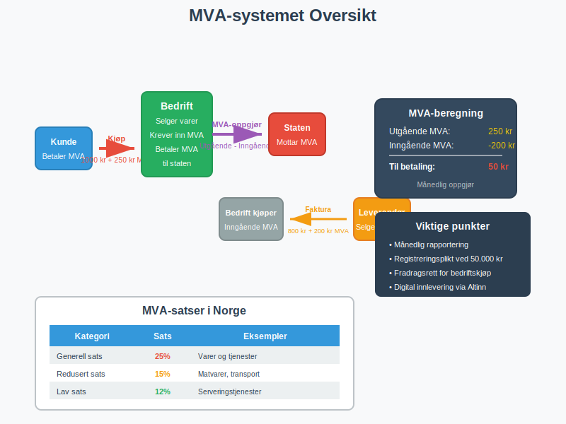
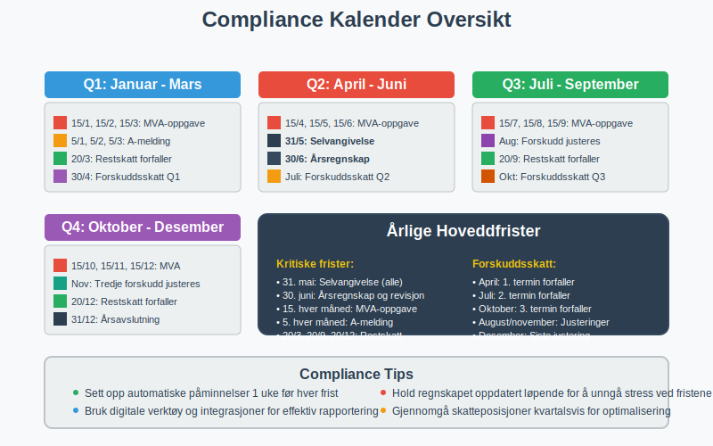

**Skatt** er en grunnleggende del av alle virksomheters økonomi og regnskap. Det er en obligatorisk avgift som pålegges av staten for å finansiere offentlige tjenester og infrastruktur. For bedrifter innebærer skatteplanlegging og -håndtering komplekse regnskaps- og juridiske prosesser som påvirker både [likviditet](/blogs/regnskap/hva-er-likviditet "Hva er Likviditet? Komplett Guide til Bedriftens Betalingsevne") og [lønnsomhet](/blogs/regnskap/hva-er-loennsomhet "Hva er Lønnsomhet? Måling og Analyse av Bedriftens Økonomiske Ytelse"). Den praktiske rapporteringen av skatteinformasjon skjer gjennom [skattemeldingen](/blogs/regnskap/skattemelding "Skattemelding - Komplett Guide til Utfylling og Innlevering"), som er det viktigste dokumentet for skatteoppgjøret.

For informasjon om **toppskatt**, se [Toppskatt](/blogs/regnskap/toppskatt "Toppskatt “ Komplett guide til toppskatt i Norge").

For en stegvis guide til **beregning** av skatt, se [Skatteberegning](/blogs/regnskap/skatteberegning "Skatteberegning - Guide til Beregning av Bedriftsskatt og Personlig Skatt").

## Seksjon 1: Grunnleggende om Skatt i Bedriftsregnskap

Skatt i bedriftssammenheng omfatter flere typer avgifter som påvirker den **regnskapsmessige behandlingen** og [kontantstrømmen](/blogs/regnskap/hva-er-kontantstrom "Hva er Kontantstrøm? Analyse og Forvaltning av Bedriftens Pengestrøm"). Forståelse av skattemessige forhold er essensielt for korrekt regnskapsføring og økonomisk planlegging.


### 1.1 Bedriftsskatt vs. Personlig Skatt

**Bedriftsskatt** (se ogsÃ¥ [Firmaskatt](/blogs/regnskap/firmaskatt "Firmaskatt “ Komplett guide til skatteregler for selskaper"), ogsÃ¥ kalt selskapsskatt) er den direkte skatten som pÃ¥legges selskapers [overskudd](/blogs/regnskap/hva-er-overskudd "Hva er Overskudd? Beregning og Betydning i Bedriftsøkonomi"):

* **Ordinær sats:** 22% på [skattepliktig inntekt](/blogs/regnskap/hva-er-skattepliktig-inntekt "Hva er Skattepliktig Inntekt? Beregning og Optimalisering") (2024)
* **Grunnlag:** [Regnskapsmessig resultat](/blogs/regnskap/hva-er-arsresultat "Hva er Ã…rsresultat? Beregning og Betydning i Regnskap") justert for skattemessige forskjeller
* **Betalingsfrister:** Forskuddsskatt og restskatt

**Personlig skatt** påvirker bedrifter gjennom:
* Forskuddstrekk for ansatte (administreres via [skattetrekkskonto](/blogs/regnskap/hva-er-skattetrekkskonto "Hva er Skattetrekkskonto? Komplett Guide til Administrasjon og Regnskapsføring") og beregnes med [tabelltrekk](/blogs/regnskap/hva-er-tabelltrekk "Hva er Tabelltrekk? Komplett Guide til Skattetrekk og Trekkberegning"))
* **Skatt på feriepenger**: Se [Skatt på feriepenger](/blogs/regnskap/skatt-pa-feriepenger "Skatt på feriepenger - Skattebehandling av feriepenger i Norge") for en detaljert guide til skattetrekk og behandling av feriepenger.
* Arbeidsgiveravgift
* [Utbytte](/blogs/regnskap/hva-er-utbytte "Hva er Utbytte? Regnskapsføring og Skattemessige Konsekvenser") med [skjermingsfradrag](/blogs/regnskap/hva-er-skjermingsfradrag "Hva er Skjermingsfradrag? Skattefradrag for Alternativkostnad ved Aksjeinvestering"). For detaljer om aksjonærbeskatning se [Aksjonærmodellen - Komplett Guide til Norsk Aksjebeskatning](/blogs/regnskap/aksjonaermodellen-guide "Aksjonærmodellen - Komplett Guide til Norsk Aksjebeskatning")
* [Skatt på uføretrygd](/blogs/regnskap/skatt-pa-uforetrygd "Skatt på Uføretrygd - Komplett Guide til Beregning og Regnskapsføring") for ansatte med gradert uføretrygd

### 1.2 Skatteplanlegging og Compliance

Effektiv **skatteplanlegging** innebærer:

| **Område** | **Hovedfokus** | **Regnskapsmessig behandling** |
|------------|----------------|-------------------------------|
| Timing | Inntekts- og kostnadsføring | [Periodisering](/blogs/regnskap/hva-er-periodisering "Hva er Periodisering? Grunnleggende Regnskapsprinsipp") vs. kontantprinsipp |
| [Avskrivninger](/blogs/regnskap/hva-er-avskrivning "Hva er Avskrivning? Beregning og Regnskapsføring av Verdireduksjon") | Skattemessige vs. regnskapsmessige | Forskjeller skaper [utsatt skatt](/blogs/regnskap/hva-er-utsatt-skatt "Hva er Utsatt Skatt? Beregning og Regnskapsføring") |
| Organisasjonsform | AS, [ANS](/blogs/regnskap/ansvarlig-selskap "Ansvarlig Selskap (ANS): Komplett Guide til Norsk Regnskap og Ansvarsstruktur"), ENK | Ulike skatteregler og rapportering |
| FoU og innovasjon   | Støtte til FoU-prosjekter gjennom Skattefunn | [Skattefunn](/blogs/regnskap/skattefunn "Skattefunn “ Skatteinsentiver for Forskning og Utvikling i Norge") |


## Seksjon 2: Typer Skatter for Bedrifter

### 2.1 Direkte Skatter

**Selskapsskatt** er den viktigste direkte skatten:

**Beregningsgrunnlag:**
1. [Regnskapsmessig resultat](/blogs/regnskap/hva-er-arsresultat "Hva er Årsresultat? Beregning og Betydning i Regnskap") før skatt
2. **Tillegg:** Ikke-fradragsberettigede kostnader
3. **Fradrag:** Skattekreditter og særfradrag
4. **Skattemessig resultat** × 22% = Betalbar skatt

**Eksempel beregning:**
```
Regnskapsmessig resultat før skatt: 1.000.000 kr
+ Ikke-fradragsberettiget representasjon: 50.000 kr
+ Bøter og overtredelsesgebyr: 20.000 kr
- Forskjell avskrivninger (skattemessig høyere): 100.000 kr
= Skattepliktig inntekt: 970.000 kr
× 22% = Betalbar skatt: 213.400 kr
```

For en detaljert gjennomgang av beregning og regnskapsføring av **betalbar skatt**, se [Betalbar skatt](/blogs/regnskap/betalbar-skatt "Betalbar skatt “ Komplett guide til beregning og hÃ¥ndtering").

### 2.2 Indirekte Skatter

**Merverdiavgift (MVA)** påvirker alle kommersielle transaksjoner:

#### Standard MVA-satser (Norge 2024):
| **Kategori** | **Sats** | **Eksempler** |
|--------------|----------|---------------|
| Generell sats | 25% | Varer og tjenester |
| Redusert sats | 15% | Matvarer, transport |
| Lav sats | 12% | Serveringstjenester |
| Fritatt | 0% | Finansielle tjenester, helsetjenester |

**MVA i regnskap:**
* **Inngående MVA:** [Fordring](/blogs/regnskap/hva-er-fordringer "Hva er Fordringer? Komplett Guide til Kundefordringer og Andre Fordringer") på staten
* **Utgående MVA:** [Gjeld](/blogs/regnskap/hva-er-gjeld "Hva er Gjeld? Typer og Regnskapsføring av Forpliktelser") til staten
* **Oppgjør:** Måntlig eller periode-basert



### 2.3 Arbeidsgiveravgift

**Arbeidsgiveravgift** beregnes av total [lønnskostnad](/blogs/regnskap/hva-er-loennskostnad "Hva er Lønnskostnad? Beregning og Regnskapsføring"):

#### Satser etter geografisk sone:
| **Sone** | **Sats** | **Geografisk område** |
|----------|----------|-----------------------|
| Sone I | 14,1% | Øst-Norge, stavanger |
| Sone II | 10,6% | Midt-Norge |
| Sone III | 6,4% | Nord-Norge, enkelte kommuner |
| Sone IV | 5,1% | Utvalgte distrikter |
| Sone V | 0% | Svalbard, visse områder |

**Regnskapsføring:**
```
Debet: Lønnskostnad (arbeidsgiveravgift)
Kredit: Skyldig offentlige avgifter
```

**Viktig:** Arbeidsgiveravgift betales ikke av [uføretrygd fra NAV](/blogs/regnskap/skatt-pa-uforetrygd "Skatt på Uføretrygd - Komplett Guide til Beregning og Regnskapsføring"), kun av lønn fra arbeidsgiver ved gradert uføretrygd. Det samme gjelder [sykepenger](/blogs/regnskap/hva-er-sykepenger "Hva er Sykepenger? Komplett Guide til Arbeidsgiverperiode og NAV-refusjon") som refunderes av NAV.

## Seksjon 3: Regnskapsmessig Behandling av Skatt

### 3.1 Periodisk Skatteberegning

**Månedsoppgjør** for MVA og arbeidsgiveravgift:

1. **Bokføring av transaksjoner** med MVA-komponenter
2. **Avstemming** av MVA-kontoer
3. **Beregning** av netto oppgjør
4. **Innlevering** av oppgave til Altinn
5. **Betaling** innen fristen

### 3.2 Årlig Skatteoppgjør

**Selvangivelse** krever sammenstilling av:
* [Resultatregnskap](/blogs/regnskap/hva-er-resultatregnskap "Hva er Resultatregnskap? Oppbygning og Analyse") data
* [Balanse](/blogs/regnskap/hva-er-balanse "Hva er Balanse? Komplett Guide til Balansens Oppbygging og Funksjon")poster som påvirker skatt
* **Skattemeldingsbilag** med spesifikke justeringer

#### Viktige frister:
| **Oppgave** | **Frist** | **Konsekvens ved forsinkelse** |
|-------------|-----------|-------------------------------|
| Selvangivelse | 31. mai | Forsinkelsesgebyr |
| [Ã…rsregnskap](/blogs/regnskap/hva-er-arsregnskap "Hva er Ã…rsregnskap? Innhold og Krav til Regnskapsrapportering") | 30. juni | Tvangsmulkt |
| Revisjonsberetning | 30. juni | Aksjelovbrudd |


### 3.3 Utsatt Skatt

**Utsatt skatt** oppstår når det er **midlertidige forskjeller** mellom regnskapsmessige og skattemessige verdier:

#### Typiske eksempler:
* **[Avskrivninger](/blogs/regnskap/hva-er-avskrivning "Hva er Avskrivning? Beregning og Regnskapsføring av Verdireduksjon"):** Skattemessige [saldoavskrivninger](/blogs/regnskap/hva-er-saldoavskrivning "Hva er Saldoavskrivning? Beregning og Anvendelse i Skatteregnskap") vs. lineære avskrivninger
* **[Kundefordringer](/blogs/regnskap/hva-er-debitor "Hva er Debitor i Regnskap? Komplett Guide til Kundefordringer og Debitorhåndtering"):** Regnskapsmessige vs. skattemessige nedskrivninger
* **[Pensjonskostnader](/blogs/regnskap/hva-er-pensjonskostnad "Hva er Pensjonskostnad? Beregning og Regnskapsføring"):** Forskjeller i periodisering

**Beregning utsatt skatt:**
```
Midlertidig forskjell × Skattesats = Utsatt skattefordel/-forpliktelse
```

**Eksempel:**
```
Regnskapsmessig avskrivning: 100.000 kr/Ã¥r
Skattemessig avskrivning: 200.000 kr/Ã¥r
Ã…rlig forskjell: 100.000 kr
Utsatt skatteforpliktelse: 100.000 × 22% = 22.000 kr
```


## Seksjon 4: MVA-systemet i Detalj

### 4.1 MVA-registrering og Plikter

**Registreringsplikt** utløses når:
* **Omsetning** overskrider 50.000 kr på 12 måneder
* **Forventet omsetning** vil overstige grensen
* **Frivillig registrering** for lavere omsetning

### 4.2 MVA-beregning og Fradragsrett

**Utgående MVA** beregnes på:
* Salg av varer og tjenester
* **Vederlagsfri overdragelse** (gaver over 1.000 kr)
* Uttak til privat bruk

**Inngående MVA** kan trekkes fra når:
* Kostnaden er **direkte relatert** til virksomheten
* **Dokumentasjon** (faktura) foreligger
* Leverandør er MVA-registrert

#### MVA-fradragsrett oversikt:
| **Kostnadskategori** | **Fradragsrett** | **Særlige bestemmelser** |
|---------------------|------------------|--------------------------|
| [Kontorrekvisita](/blogs/regnskap/hva-er-kontorrekvisita "Hva er Kontorrekvisita? Regnskapsføring og MVA-behandling") | 100% | Standard forretningsbruk |
| Representasjon | 0% | Ikke fradragsberettiget |
| [Firmabil](/blogs/regnskap/hva-er-firmabil "Hva er Firmabil? Regnskapsføring og Skattemessige Konsekvenser") | Delvis | Avhenger av privat bruk |
| Hotell/overnatting | 100% | Forretningsreiser |

### 4.3 Kompensasjonsordningen

**Ideelle organisasjoner** og offentlige virksomheter kan få **MVA-kompensasjon**:

* **Sats:** Tilsvarer standard MVA-sats
* **Vilkår:** Ikke-kommersielle aktiviteter
* **Rapportering:** Ã…rlig kompensasjonsoppgave


## Seksjon 5: Internasjonale Skatteforhold

### 5.1 Skatteavtaler og Double Taxation

**Skatteavtaler** forhindrer **dobbeltbeskatning**:

#### Viktige prinsipper:
* **Kildelandsprinsipp:** Skatt betales der inntekten oppstår
* **Bostedslandsprinsipp:** Skatt betales der selskapet er hjemmehørende
* **Credit-metoden:** Fradrag for betalt skatt i utlandet

### 5.2 Transfer Pricing

**Internprising** mellom nærstående selskaper må følge **armlengdeprinsippet**:

* **Dokumentasjonsplikt** for transaksjoner over visse beløpsgrenser
* **Sammenlignbare transaksjoner** med uavhengige parter
* **Justering** hvis prising avviker fra markedspris

#### Transfer pricing metoder:
| **Metode** | **Anvendelse** | **Fordeler** |
|------------|----------------|--------------|
| CUP (Comparable Uncontrolled Price) | Identiske produkter | Mest direkte |
| Cost Plus | Produksjon/service | Enkel implementering |
| Resale Price | Distribusjon | Markedsbasert |


### 5.3 BEPS-initiativer

**Base Erosion and Profit Shifting** (BEPS) påvirker norske selskaper:

#### Hovedtiltak:
* **Country-by-Country Reporting** for store konsern
* **Minimum skattesats** på 15% (Pilar 2)
* **Digital skatt** på teknologiselskaper
* **Begrenset rentefradrag** (EBITDA-regel)

## Seksjon 6: Skatteoptimalisering og Strategier

### 6.1 Lovlig Skatteplanlegging

**Proaktiv skatteplanlegging** kan redusere skattebelastningen:

#### Timing-strategier:
* **Forskyvning av inntekter** til lavere skatteår
* **Fremskynding av fradrag** til høyere skatteår
* **[Investeringer](/blogs/regnskap/hva-er-investering "Hva er Investering? Typer og Regnskapsføring av Kapitalplasseringer")** i skattemessig gunstige eiendeler
* **Sektorspesifikke ordninger** som [tømmerkonto](/blogs/regnskap/hva-er-tommerkonto "Hva er Tømmerkonto? Skatteoptimalisering for Skogbruk") for inntektsutjevning i skogbruk

#### Strukturelle tiltak:
* **Valg av [organisasjonsform](/blogs/regnskap/organisasjonsform "Organisasjonsform: Komplett Guide til Selskapsformer i Norge")** (AS vs. [ANS](/blogs/regnskap/ansvarlig-selskap "Ansvarlig Selskap (ANS): Komplett Guide til Norsk Regnskap og Ansvarsstruktur") vs. ENK)
* **Holdingselskap-strukturer** for [utbytte](/blogs/regnskap/hva-er-utbytte "Hva er Utbytte? Regnskapsføring og Skattemessige Konsekvenser")optimalisering
* **Geografisk plassering** for utnyttelse av regionale incentiver

### 6.2 Investeringsincentiver

**Skattemessige incentiver** for å stimulere bestemte aktiviteter:

#### Forsknings- og utviklingsfradrag:
* **SkatteFUNN:** 20% fradrag for FoU-kostnader (SMB)
* **18% fradrag** for store selskaper
* **Maksimale beløp** og kvalifikasjonskrav

#### [Avskrivningsregler](/blogs/regnskap/hva-er-avskrivning "Hva er Avskrivning? Beregning og Regnskapsføring av Verdireduksjon"):
* **Saldoavskrivning:** Degressiv avskrivning på ulike satser
* **Særavskrivning:** 100% førsteårsavskrivning på visse eiendeler
* **Miljøvennlige investeringer:** Fordelaktige avskrivningsregler


### 6.3 Risikostyring og Compliance

**Skattemessig risikostyring** innebærer:

#### Risikoområder:
* **Aggressiv skatteplanlegging** kan utløse skatteetaten kontroller
* **Skatteflyktning**: Flytting av skattemessig bosted for Ã¥ redusere skattebyrden. Se [Skatteflyktning](/blogs/regnskap/skatteflyktning "Skatteflyktning “ Definisjon, Eksempler og Juridiske Konsekvenser").
* **Manglende dokumentasjon** kan føre til tilleggsskatt
* **Feiltolkning** av skatteregler kan få alvorlige konsekvenser

#### Compliance-rammeverk:
| **Element** | **Formål** | **Implementering** |
|-------------|------------|--------------------|
| Policies og prosedyrer | Ensartet behandling | Dokumenterte retningslinjer |
| Opplæring | Kompetansebygging | Regelmessige kurs |
| Internkontroll | Kvalitetssikring | Review og godkjenning |
| Ekstern rådgivning | Spesialkompetanse | Skatteadvokater/revisorer |

## Seksjon 7: Digitalisering av Skattesystemet

### 7.1 Altinn og Digital Rapportering

**Altinn-portalen** er hovedkanalen for skattemessig rapportering:

#### Viktige systemer:
* **MVA-rapportering:** MÃ¥nedlig/periodisk innlevering
* **Årsoppgave for lønnsforhold** (A-ordningen)
* **Selvangivelse** med vedlegg
* **[CRS-rapportering](/blogs/regnskap/hva-er-crs "Hva er CRS? Automatisk Informasjonsutveksling for Skatteformål")** for internasjonale kontoforhold

### 7.2 SAF-T (Standard Audit File for Tax)

**SAF-T** er standardformat for digital overføring av regnskapsdata:

#### Hovedkomponenter:
* **Kontoplanen** med alle hovedbok-kontoer
* **Alle bokførte transaksjoner** for perioden
* **Kundefordringer** og leverandørgjeld
* **Metadata** om regnskapssystemet

**Implementering:**
```xml
<AuditFile>
  <Header>
    <AuditFileVersion>1.10</AuditFileVersion>
    <CompanyID>123456789</CompanyID>
  </Header>
  <GeneralLedgerEntries>
    <!-- Alle hovedbok-posteringer -->
  </GeneralLedgerEntries>
</AuditFile>
```


### 7.3 Kunstig Intelligens i Skattekontrollen

**AI-verktøy** brukes av skattemyndighetene for:

#### Risikoseleksjon:
* **Maskinlæring** for å identifisere avvik
* **Bransjebenchmarking** og outlier-deteksjon
* **Kryssreferering** av data fra ulike kilder

#### Automatiserte kontroller:
* **Konsistenssjekk** mellom ulike rapporter
* **Pattern recognition** for å oppdage skatteunndragelse
* **Sanntidsovervåking** av transaksjoner

## Seksjon 8: Skattemessige Konsekvenser av Ulike Transaksjoner

### 8.1 Salg og Kjøp av Virksomhet

**M&A-transaksjoner** har komplekse skattemessige konsekvenser:

#### Eiendelskjøp vs. Aksjakjøp:
| **Struktur** | **Kjøper-perspektiv** | **Selger-perspektiv** |
|--------------|----------------------|----------------------|
| Eiendelskjøp | **Trinnoppgang** i avskrivningsgrunnlag | Beskatning av [gevinst](/blogs/regnskap/hva-er-gevinst-tap "Hva er Gevinst og Tap? Regnskapsføring av Verdiendringer") |
| Aksjakjøp | **Ingen trinnoppgang** | Fritaksmetoden kan gi skattefritak |

#### Due diligence fokusområder:
* **Skattemessige posisjoner** og tvister
* **Utsatt skatt** og fremførbare underskudd
* **Transfer pricing** dokumentasjon
* **MVA-forhold** og potensielle krav

### 8.2 Omstrukturering og Fusjon

**Selskapsomdannelser** kan gjennomføres **skattefritt** under visse vilkår:

#### Skattefrie fusjoner:
* **Kontinuitetsvilkåret:** Samme eiere før og etter
* **Forretningsmessige begrunnelse:** Ikke primært skattemotivert
* **Dokumentasjonsvilkår:** Korrekt skattemessig dokumentasjon

#### Fissjon og oppsplitting:
* **Proporsjonalitetskrav:** Eiere beholder forholdsmessige andeler
* **Tidsbegrensning:** Eiere må beholde aksjer i minimum 3 år
* **Verdipapirfondsregler:** Særlige regler for finansselskaper


### 8.3 Finansielle Instrumenter

**Komplekse finansielle produkter** krever spesiell skattemessig behandling:

#### Derivater og opsjoner:
* **Realisasjonsprinsippet** vs. [mark-to-market](/blogs/regnskap/hva-er-virkelig-verdi "Hva er Virkelig Verdi? Verdsettelse og Regnskapsføring")
* **Sikringsbokføring** og skattemessig anerkjennelse
* **Valutasikring** og periodiseringsregler

#### Obligasjoner og rentebærende instrumenter:
* **Periodisering** av renter vs. kontantprinsipp
* **Premie/diskonto** avskrives over løpetiden
* **Valutaobligasjoner** og kursgevinster/-tap

## Seksjon 9: Bransje- og Sektorspesifikke Skatteregler

### 9.1 Eiendomsbransjen

**Eiendomsselskaper** har særlige skatteregler:

#### RISK-reglene (Regler for Inntektsberegning i Selskap med Karakter av lukket kreds):
* **20% skattlegging** av andeler i RISK-selskap
* **Unntaksbestemmelser** for profesjonelle eiendomsutviklere
* **Dokumentasjonskrav** for å unnslippes RISK-beskatning

#### Eiendomsskatt og kommunale avgifter:
* **Eiendomsskatt:** Kommunal skatt på fast eiendom
* **[Dokumentavgift](/blogs/regnskap/hva-er-dokumentavgift "Hva er Dokumentavgift? Beregning og Regnskapsføring"):** 2,5% på eiendomsoverdragelser
* **MVA på nybygg:** 25% MVA ved salg innen 10 år

### 9.2 Shipping og Rederinæringen

**Norsk internasjonale skipsregister** (NIS) gir **skattefordeler**:

#### Tonnasjeskatten:
* **Skattefri drift** av NIS-registrerte skip
* **Tonnasje-basert skatt** i stedet for [overskuddsskatt](/blogs/regnskap/hva-er-overskudd "Hva er Overskudd? Beregning og Betydning i Bedriftsøkonomi")
* **Geografiske begrensninger** for virksomheten

#### Sjøfolks særordninger:
* **Sjøfolksfradrag:** Spesielle fradrag for sjøfolk
* **Skattefri hyre:** For arbeid på [kontinentalsokkelen](/blogs/regnskap/hva-er-kontinentalsokkel "Hva er Kontinentalsokkel? Skattemessige Regler for Offshore-virksomhet")
* **Petroleumsskatten:** 78% kombinert skatt på petroleum


### 9.3 Teknologi og Software

**IT-selskaper** møter moderne skatteutfordringer:

#### Immaterielle eiendeler:
* **Programvare-utvikling:** Aktivering vs. kostnadføring
* **Patenter og teknologi:** Transfer pricing og verdsettelse
* **Cloud-tjenester:** Stedsbestemming og MVA-plikt

#### OECD Pilar 1 (Digital skatt):
* **Minimum omsetning:** USD 20 milliarder globalt
* **Profitabilitet:** Over 10% margin
* **Omfordeling:** 25% av overskudd over 10% til markedsland

## Seksjon 10: Fremtidige Trender og Utvikling

### 10.1 Grønn Skattepolitikk

**Bærekraftige skatteordninger** blir stadig viktigere:

#### CO₂-avgifter og miljøskatter:
* **Karbon-lekkasje** beskyttelse for eksportindustri
* **Grønne sertifikater** og skattefradrag
* **Plastikavgift** og emballasjeavgifter

#### ESG-rapportering og skatt:
* **[CSRD-direktivet](/blogs/regnskap/hva-er-csrd "Hva er CSRD? Corporate Sustainability Reporting Directive"):** Utvidet bærekraftsrapportering
* **Taksonomi-forskriften:** Klassifisering av bærekraftige aktiviteter
* **Social and governance** faktorer i skatteplanlegging

### 10.2 Blockchain og Kryptovaluta

**Digitale valutaer** skaper nye skatteutfordringer:

#### Kryptovaluta-beskatning:
* **Gevinst/tap** ved salg eller bytte
* **Mining-aktivitet:** Næringsinntekt eller hobby
* **DeFi og staking:** Kompleks inntektsklassifisering

#### NFT og digitale eiendeler:
* **Intellectual property** og royalty-beskatning
* **Cross-border** transaksjoner og jurisdiksjon
* **Verdsettelse** av unike digitale eiendeler


### 10.3 Real-time Rapportering

**Kontinuerlig skatteovervåking** blir den nye standarden:

#### Teknologiske drivere:
* **API-basert** datautveksling med myndighetene
* **Blockchain** for manipulasjonssikre skatteregistre
* **AI og maskinlæring** for automatisk compliance-sjekk

#### Implementeringsutfordringer:
* **Systemintegrasjon** mellom [ERP-systemer](/blogs/regnskap/hva-er-erp-system "Hva er ERP-system? Komplett Guide til Enterprise Resource Planning") og skattemyndigheter
* **Personvern** og databeskyttelse (GDPR)
* **Kostnader** ved system-oppgraderinger

## Seksjon 11: Praktiske Verktøy og Ressurser

### 11.1 Skatteberegningsverktøy

**Digitale hjelpemidler** for skatteplanlegging:

#### Skattekalkulator-funksjoner:
| **Verktøy** | **Hovedfunksjon** | **Målgruppe** |
|-------------|------------------|---------------|
| SkatteFUNN-kalkulator | FoU-fradrag beregning | Innovasjonsbedrifter |
| MVA-kalkulator | Oppgjør og periodisering | Alle MVA-pliktige |
| Avskrivningskalkulator | Skattemessige avskrivninger | Eiendelssintensive bedrifter |
| [Lønnskalkulator](/blogs/regnskap/hva-er-loenn "Hva er Lønn? Beregning og Regnskapsføring av Lønnskostnader") | Arbeidsgiveravgift og forskuddstrekk | Alle arbeidsgivere |

### 11.2 Compliance-sjekklister

**MÃ¥nedlige oppgaver:**
- [ ] MVA-oppgave innlevert til Altinn
- [ ] Arbeidsgiveravgift beregnet og betalt
- [ ] [Forskuddstrekk](/blogs/regnskap/hva-er-forskuddstrekk "Hva er Forskuddstrekk? Beregning og Innbetaling") innbetalt
- [ ] A-melding sendt for lønnsdata

**Kvartalsvise oppgaver:**
- [ ] [Kvartalsrapport](/blogs/regnskap/hva-er-kvartalsrapport "Hva er Kvartalsrapport? Krav og Innhold i Delårsrapportering") med skatteinformasjon
- [ ] Forskuddsskatt vurdert og justert
- [ ] Transfer pricing dokumentasjon oppdatert

**Ã…rlige oppgaver:**
- [ ] [Skattemelding](/blogs/regnskap/skattemelding "Skattemelding - Komplett Guide til Utfylling og Innlevering") med vedlegg innlevert
- [ ] [Ã…rsregnskap](/blogs/regnskap/hva-er-arsregnskap "Hva er Ã…rsregnskap? Innhold og Krav til Regnskapsrapportering") og revisjonsberetning
- [ ] SAF-T fil forberedt for potensielle kontroller
- [ ] Skatteposisjoner vurdert for [balansen](/blogs/regnskap/hva-er-balanse "Hva er Balanse? Komplett Guide til Balansens Oppbygging og Funksjon")



### 11.3 Skatterevisjons-forberedelse

**Proaktiv tilnærming** til skattemyndighetenes kontroller:

#### Dokumentasjonsmapper:
* **Kontraktsportefølje:** Alle kommersielle avtaler
* **Transfer pricing:** Sammenlignelighetsstudier og benchmarks  
* **Organisasjonsstruktur:** Eierskap og kontrollforhold
* **Skattemessige posisjoner:** Begrunnelser for tolkninger

#### Digital arkivering:
* **Strukturerte filnavn** for enkel søking
* **Metadata-tagging** av dokumenter
* **[Backup](/blogs/regnskap/hva-er-backup "Hva er Backup? Sikring av Regnskapsdata og Dokumentasjon")** og tilgjengelighetssikring
* **Tilgangskontroll** og sporbarhet

## Konklusjon

**Skatt** er en kompleks og allsidig komponent i bedrifters økonomi som krever både juridisk presisjon og strategisk tenkning. Fra grunnleggende MVA-håndtering til avanserte internasjonale skatteplanleggingsstrategier, påvirker skattemessige forhold alle aspekter av [regnskapsføringen](/blogs/regnskap/hva-er-bokforing "Hva er Bokføring? Grunnleggende Prinsipper og Prosesser") og den finansielle planleggingen.

**Nøkkelinnsikter:**

* **Compliance først:** Korrekt overholdelse av skattelovgivningen er grunnleggende
* **Proaktiv planlegging:** Skatteoptimalisering krever langsiktig strategisk tenkning  
* **Teknologisk tilpasning:** Digitalisering endrer hvordan skatt rapporteres og kontrolleres
* **Internasjonalt fokus:** Globalisering krever forståelse av grenseoverskridende skatteregler

**Praktisk anvendelse:**

For regnskapsførere, økonomi-ansvarlige og bedriftsledere er forståelse av skattesystemet essensielt for:
- **Akkurat [bokføring](/blogs/regnskap/hva-er-bokforing "Hva er Bokføring? Grunnleggende Prinsipper og Prosesser")** og rapportering
- **Effektiv [kontantstrømstyring](/blogs/regnskap/hva-er-kontantstrom "Hva er Kontantstrøm? Analyse og Forvaltning av Bedriftens Pengestrøm")** gjennom skatteoptimalisering
- **Risikominimering** gjennom korrekt compliance  
- **Strategisk beslutningstagning** ved investeringer og omstruktureringer

**Fremtidsperspektiv:**

Skattelandskapet utvikler seg raskt med digitalisering, bærekraftsfokus og internasjonale harmoniseringsinitiativer som BEPS. Bedrifter som investerer i moderne skatteforvaltningssystemer og bygger robust kompetanse innen skatteplanlegging, vil være best posisjonert for fremtidige utfordringer og muligheter.

Skattemessig etterlevelse er ikke bare en plikt - det er en strategisk mulighet for verdiskapning gjennom optimalisert [kapitalallokering](/blogs/regnskap/hva-er-kapital "Hva er Kapital? Komplett Guide til Kapitalformer og Kapitalforvaltning") og reduserte kostnader. Ved å integrere skattemessige betraktninger i alle forretningsmessige beslutninger kan bedrifter oppnå både regelverksetterlevelse og konkurransefortrinn i markedet.

## Betalbar skatt

For detaljer om **betalbar skatt** og dens beregning, se [Betalbar skatt](/blogs/regnskap/betalbar-skatt "Betalbar skatt “ Komplett guide til beregning og hÃ¥ndtering").
Skatteetaten er ansvarlig for alle disse prosessene og tilbyr veiledning, digitale tjenester og kontrollrutiner.
Se ogsÃ¥ [Skatteetaten](/blogs/regnskap/skatteetaten "Skatteetaten “ Norges Skatteadministrasjon og Skatteforvaltning") for en oversikt over skattemyndighetens roller og tjenester.


