---
title: "Hva er Skattetrekkskonto?"
seoTitle: "Hva er Skattetrekkskonto?"
description: '**Skattetrekkskonto** er en spesiell bankkonto som norske arbeidsgivere må opprette for å administrere trekk av forskuddsskatt fra lønn og andre ytelser til ...'
---

**Skattetrekkskonto** er en spesiell bankkonto som norske arbeidsgivere må opprette for å administrere trekk av forskuddsskatt fra lønn og andre ytelser til ansatte. Kontoen fungerer som et mellomledd mellom arbeidsgiver og [Skatteetaten](/blogs/regnskap/hva-er-skatt "Skatt - Komplett Guide til Bedriftsskatt, MVA og Skatteplanlegging"), og sikrer at alle skattetrekk blir korrekt innbetalt innen lovpålagte frister. Skattetrekkskontoens betydning for [regnskapet](/blogs/regnskap/hva-er-bokforing "Hva er Bokføring? Grunnleggende Regnskapsprinsipper og Praksis") og [likviditetsplanleggingen](/blogs/regnskap/hva-er-likviditet "Hva er Likviditet? Komplett Guide til Bedriftens Betalingsevne") gjør den til et sentralt element i bedriftens økonomiske drift.

## Seksjon 1: Grunnleggende om Skattetrekkskonto

**Skattetrekkskonto** er påkrevd for alle norske arbeidsgivere som trekker forskuddsskatt fra ansattes lønn. Kontoen er underlagt strenge regelverk og må administreres i henhold til skattelovgivningen for å sikre korrekt **regnskapsføring** og overholdelse av skattemessige forpliktelser.

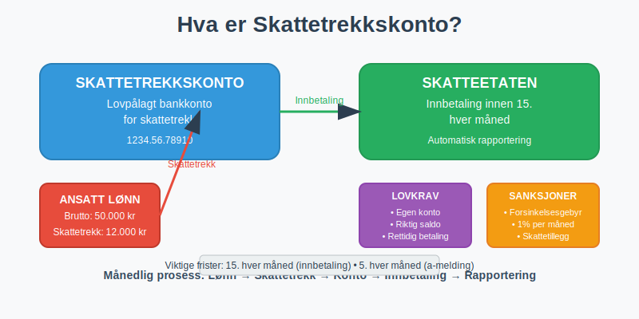

### 1.1 Juridisk Grunnlag og Krav

Skattetrekkskonto er **lovpålagt** for virksomheter som:

* Utbetaler lønn til ansatte
* Har trekkplikt for forskuddsskatt
* Foretar [arbeidsgiveravgift](/blogs/regnskap/hva-er-arbeidsgiveravgift "Hva er Arbeidsgiveravgift? Beregning og Regnskapsføring") beregninger
* Administrerer feriepenger med skattetrekk
* Håndterer pensjon og andre ytelser

**Hovedkrav til skattetrekkskonto:**

| **Krav** | **Beskrivelse** | **Konsekvens ved brudd** |
|----------|-----------------|--------------------------|
| Egen konto | Skal være separat fra driftskonto | Administrative sanksjoner |
| Riktig saldo | Må dekke alle trekk | Forsinkelsesgebyr |
| Rettidig innbetaling | Innen den 15. hver måned | Renter og gebyr |
| Korrekt rapportering | [Skattemelding](/blogs/regnskap/skattemelding "Skattemelding - Komplett Guide til Utfylling og Innlevering") og a-melding | Skattetillegg |

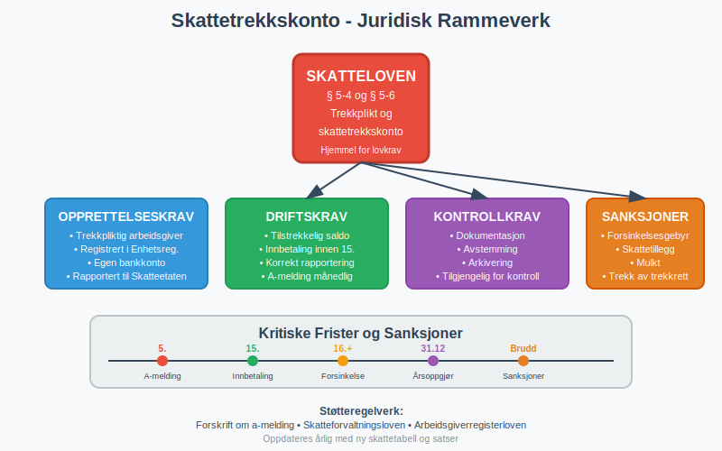

### 1.2 Forskjell fra Vanlige Bankkontoer

Skattetrekkskonto skiller seg fra **ordinære bankkontoer** på flere måter:

**Unike egenskaper:**
1. **Øremerket formål:** Kun for skattetrekk og arbeidsgiveravgift
2. **Begrenset tilgang:** Kan ikke brukes til andre forretningsformål
3. **Automatisk rapportering:** Banken rapporterer bevegelser til skattemyndighetene
4. **Strenge frister:** Innbetalinger må skje innen lovpålagte tidsfrister
5. **Relasjon til bedriftskonto:** Se [Hva er Bedriftskonto?](/blogs/regnskap/bedriftskonto "Hva er Bedriftskonto? Alt du trenger vite om bedriftens bankkontoer") for en oversikt over bedriftens generelle kontoer

**Regnskapsmessig behandling:**
* [Bokføres](/blogs/regnskap/hva-er-bokforing "Hva er Bokføring? Grunnleggende Regnskapsprinsipper og Praksis") som egen [kontantstrøm](/blogs/regnskap/hva-er-kontantstrom "Hva er Kontantstrøm? Analyse og Forvaltning av Bedriftens Pengestrøm")
* Vises som kortsiktig [gjeld](/blogs/regnskap/hva-er-gjeld "Hva er Gjeld? Typer og Regnskapsføring av Bedriftens Forpliktelser") i [balansen](/blogs/regnskap/hva-er-balanse "Hva er Balanse? Grunnleggende Regnskapsdokument Forklart")
* Påvirker [arbeidskapitalen](/blogs/regnskap/hva-er-arbeidskapital "Hva er Arbeidskapital? Beregning og Betydning for Bedrifter") direkte

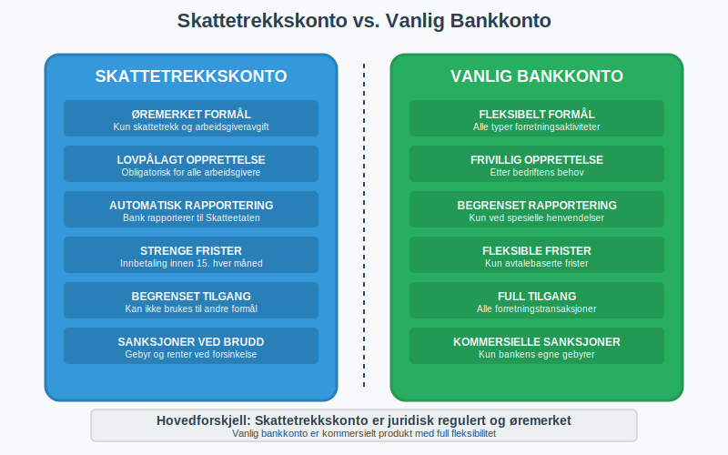

## Seksjon 2: Administrasjon og Praktisk Bruk

### 2.1 Opprettelse og Etablering

**Opprettelsesprosess** for skattetrekkskonto:

1. **Kontakt bank:** Velg bank som tilbyr skattetrekkskontoer
2. **Dokumentasjon:** Fremlegg organisasjonsbevis og registreringsbevis
3. **Avtale:** Inngå avtale om kontoføring og gebyrstruktur
4. **Registrering:** Registrer kontoen hos Skatteetaten
5. **Aktivering:** Motta kontonummer og tilgangsrettigheter

**Nødvendig dokumentasjon:**
* [Organisasjonsnummer](/blogs/regnskap/hva-er-organisasjonsnummer "Hva er Organisasjonsnummer? Registrering og Betydning") og enhetsregisterutskrift
* Signaturkort for autoriserte personer
* [Revisorbekreftelse](/blogs/regnskap/hva-er-revisor "Hva er Revisor? Roller og Ansvar i Norsk Regnskap") (ved krav)
* Fullmakter for regnskapsførere

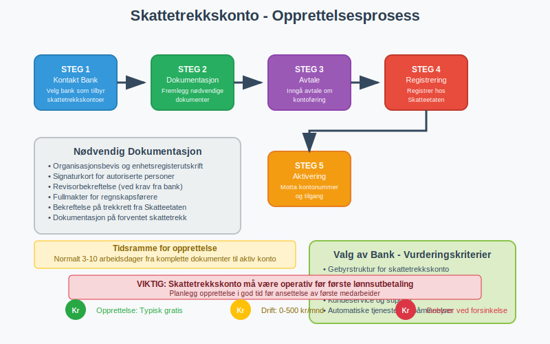

### 2.2 Daglig Drift og Transaksjoner

**Typiske transaksjoner** på skattetrekkskonto:

**Inngående:**
* Overføringer fra driftskonto for skattetrekk
* Korreksjonsinnskudd ved feil
* Renter på innskudd (sjeldent)

**Utgående:**
* Månedlige innbetalinger til Skatteetaten
* [Arbeidsgiveravgift](/blogs/regnskap/hva-er-arbeidsgiveravgift "Hva er Arbeidsgiveravgift? Beregning og Regnskapsføring")
* Eventuelle korreksjoner og tilbakebetalinger

**Månedlig syklus:**
```
Lønnskjøring †’ Beregn skattetrekk †’ Overfør til skattetrekkskonto †’ 
Innbetaling til Skatteetaten (innen 15.) †’ Rapportering i a-melding
```

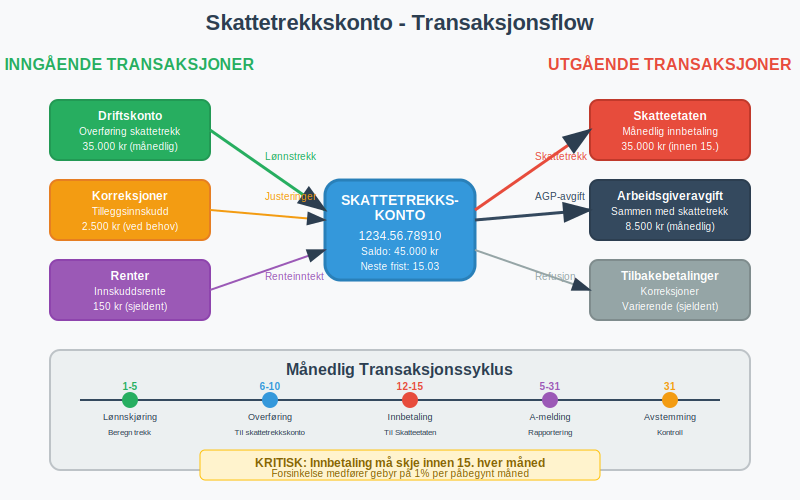

### 2.3 Regnskapsføring og Bokføring

**Regnskapsmessig behandling** av skattetrekkskonto:

Skattetrekksbeløpet beregnes ved hjelp av [tabelltrekk](/blogs/regnskap/hva-er-tabelltrekk "Hva er Tabelltrekk? Komplett Guide til Skattetrekk og Trekkberegning") basert på den ansattes skattekort og Skatteetatens offisielle tabeller.

**Ved lønnstrekk:**
```
Dr. Lønnskostnad                    100.000
    Kr. Skattetrekk skyldig              20.000
    Kr. Bankutbetaling                   80.000
```

**Ved overføring til skattetrekkskonto:**
```
Dr. Skattetrekk skyldig              20.000
    Kr. Skattetrekkskonto                20.000
```

**Ved innbetaling til Skatteetaten:**
```
Dr. Skattetrekkskonto               20.000
    Kr. Bank                             20.000
```

**Balanseoppstilling påvirkning:**
* **[Omløpsmidler](/blogs/regnskap/hva-er-omleopsmidler "Hva er Omløpsmidler? Klassifisering og Regnskapsføring"):** [Konto 1950 - Bankinnskudd for skattetrekk](/blogs/kontoplan/1950-bankinnskudd-for-skattetrekk "Konto 1950 - Bankinnskudd for skattetrekk") som egen bankinnskuddskonto for forskuddstrekk
* **Kortsiktig gjeld:** Skyldig skattetrekk før overføring
* **[Likviditet](/blogs/regnskap/hva-er-likviditet "Hva er Likviditet? Komplett Guide til Bedriftens Betalingsevne"):** Påvirker [arbeidskapitalen](/blogs/regnskap/hva-er-arbeidskapital "Hva er Arbeidskapital? Beregning og Betydning for Bedrifter") negativt

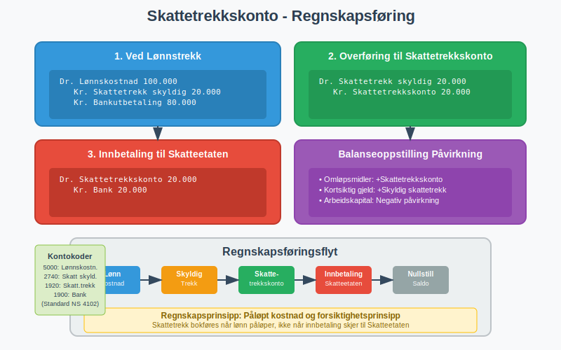

## Seksjon 3: Compliance og Risikohåndtering

### 3.1 Lovkrav og Frister

**Kritiske frister** for skattetrekkskonto:

| **Frist** | **Aktivitet** | **Konsekvens ved forsinkelse** |
|-----------|---------------|--------------------------------|
| 15. hver måned | Innbetaling skattetrekk | Forsinkelsesgebyr 1% per måned |
| 5. hver måned | A-melding | Mulkt kr 1.000-5.000 |
| [Årsskiftet](/blogs/regnskap/regnskapskvartaler-q1-q4 "Regnskapskvartaler Q1-Q4 - Guide til Kvartalsrapportering") | Årsoppgjør | Skattetillegg |
| Ved oppsigelse | Sluttoppgjør | Inndragning av trekkrett |

**Sanksjoner ved brudd:**
* **Forsinkelsesgebyr:** 1% per påbegynt måned
* **Renter:** Årets rentesats + 6%
* **Skattetillegg:** 20% av for lite betalt skattetrekk
* **Administrative sanksjoner:** Inndragning av trekkrett

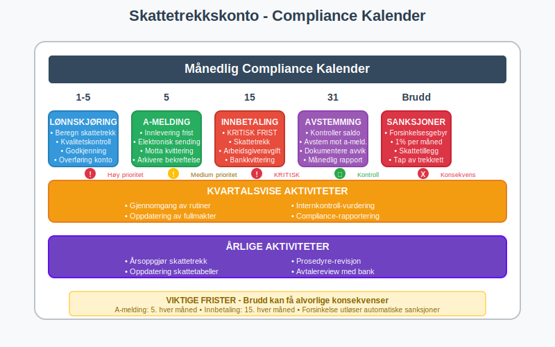

### 3.2 Risikofaktorer og Forebygging

**Hovedrisiker** ved skattetrekkskonto:

**Likviditetsrisiko:**
* Utilstrekkelige midler på kontoen
* Feil i [kontantstrømplanlegging](/blogs/regnskap/hva-er-kontantstrom "Hva er Kontantstrøm? Analyse og Forvaltning av Bedriftens Pengestrøm")
* Uventede korreksjoner eller tilbakebetalinger

**Operasjonell risiko:**
* Manglende [internkontroll](/blogs/regnskap/hva-er-internkontroll "Hva er Internkontroll? Prosesser og Rutiner for Kvalitetssikring")
* Feil i beregninger eller overføringer
* Tekniske problemer med banksystemer

**Compliance-risiko:**
* Forsinket innbetaling
* Feil rapportering i [skattemeldingen](/blogs/regnskap/skattemelding "Skattemelding - Komplett Guide til Utfylling og Innlevering")
* Manglende dokumentasjon

**Forebyggende tiltak:**
1. **Automatisering:** Elektroniske overføringer og påminnelser
2. **Dobbel kontroll:** [Revisjons](/blogs/regnskap/hva-er-revisjon "Hva er Revisjon? Prosess og Betydning for Bedrifter")prosedyrer for alle transaksjoner
3. **Reservefond:** Buffer for uventede hendelser
4. **Regelmessig [avstemming](/blogs/regnskap/hva-er-avstemming "Hva er Avstemming? Kontroll og Kvalitetssikring i Regnskap"):** Månedlig kontroll mot a-melding

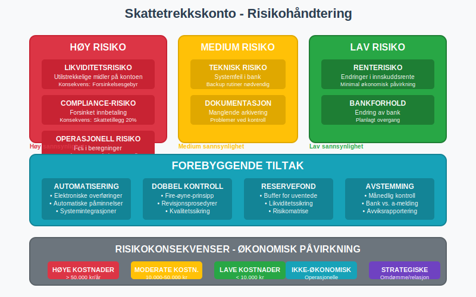

## Seksjon 4: Digital Administrasjon og Modernisering

### 4.1 Teknologiske Løsninger

**Digitale verktøy** for skattetrekkskonto:

**Lønns- og personalsystemer:**
* Automatisk beregning av skattetrekk
* Integrert rapportering til a-melding
* [Kvalitetssikring](/blogs/regnskap/hva-er-qa-kvalitetssikring "Hva er QA Kvalitetssikring? Prosesser og Implementering i Regnskap") av beregninger

**Bank- og regnskapssystemer:**
* Automatiske overføringer til skattetrekkskonto
* Elektronisk [avstemming](/blogs/regnskap/hva-er-avstemming "Hva er Avstemming? Kontroll og Kvalitetssikring i Regnskap")
* Integrert rapportering og [analyse](/blogs/regnskap/hva-er-finansiell-analyse "Hva er Finansiell Analyse? Metoder og Verktøy for Bedriftsevaluering")

**API-integrasjoner:**
* Skatteetaten: Direkte rapportering via a-melding API
* Bank: Sanntids kontoinformasjon og transaksjoner
* Regnskap: Automatisk [bokføring](/blogs/regnskap/hva-er-bokforing "Hva er Bokføring? Grunnleggende Regnskapsprinsipper og Praksis") og rapportering

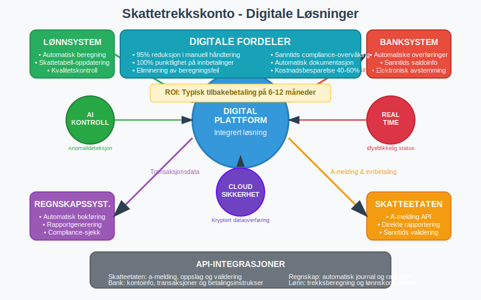

### 4.2 Automatisering og Prosessoptimalisering

**Optimaliserte prosesser:**

**Månedlig syklus:**
1. **Automatisk beregning:** Lønnsystem beregner skattetrekk
2. **Kvalitetskontroll:** System validerer beregninger mot tabeller
3. **Overføring:** Automatisk til skattetrekkskonto på forhåndsdefinert dato
4. **Rapportering:** Automatisk a-melding sendes til Skatteetaten
5. **[Avstemming](/blogs/regnskap/hva-er-avstemming "Hva er Avstemming? Kontroll og Kvalitetssikring i Regnskap"):** System avstemmer mot bankutskrift

**Nøkkelytelsesmål (KPI):**
* **Punktlighet:** 100% rettidige innbetalinger
* **Nøyaktighet:** 99%+ korrekte beregninger
* **Effektivitet:** Redusert manuell håndtering
* **Compliance:** Null sanksjoner eller gebyrer

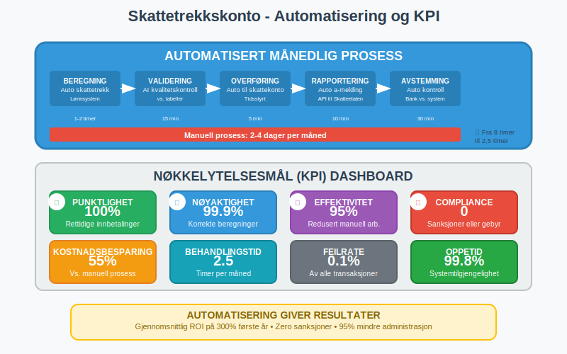

## Seksjon 5: Spesielle Situasjoner og Utfordringer

### 5.1 Sesongvariasjoner og Feriepenger

**Feriepenger** skaper særlige utfordringer for skattetrekkskonto:

**Opptjening vs. utbetaling:**
* Feriepenger [opptjenes](/blogs/regnskap/hva-er-opptjening "Hva er Opptjening? Regnskapsmessig Behandling av Inntekter") løpende
* Utbetales typisk i juni
* Skattetrekk følger utbetalingstidspunkt
* **Viktig:** [Sykepenger](/blogs/regnskap/hva-er-sykepenger "Hva er Sykepenger? Komplett Guide til Arbeidsgiverperiode og NAV-refusjon") fra NAV gir ikke feriepengeoppbokking

**Regnskapsføring feriepenger:**
```
Ved opptjening (måned for måned):
Dr. Lønnskostnad                     8.333
    Kr. Feriepenger skyldig               8.333

Ved utbetaling feriepenger (juni):
Dr. Feriepenger skyldig            100.000
    Kr. Skattetrekk skyldig               20.000
    Kr. Bankutbetaling                   80.000
```

**Likviditetsplanlegging:**
* Betydelig økning i skattetrekkskonto i juni
* Behov for ekstra [arbeidskapital](/blogs/regnskap/hva-er-arbeidskapital "Hva er Arbeidskapital? Beregning og Betydning for Bedrifter")
* Planlegging av [kontantstrøm](/blogs/regnskap/hva-er-kontantstrom "Hva er Kontantstrøm? Analyse og Forvaltning av Bedriftens Pengestrøm") på forhånd

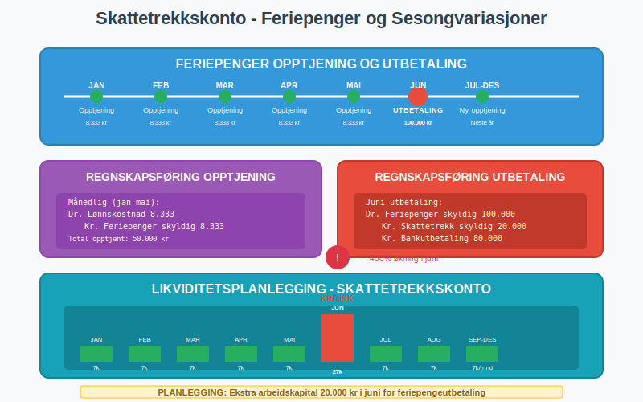

### 5.2 Oppstart og Nedleggelse av Virksomhet

**Ved oppstart av virksomhet:**

**Etablering av trekkrett:**
1. Registrering i [Enhetsregisteret](/blogs/regnskap/hva-er-enhetsregisteret "Hva er Enhetsregisteret?")
2. Søknad om trekkrett til Skatteetaten
3. Opprettelse av skattetrekkskonto
4. Implementering av lønnsrutiner

**Ved nedleggelse:**
* Sluttoppgjør for alle ansatte
* Endelig innbetaling til skattetrekkskonto
* Avslutning av trekkrett
* Lukking av skattetrekkskonto

**Overgangsperioder:**
* Virksomhetsoverdragelse
* Fusjon og [fisjon](/blogs/regnskap/hva-er-fisjon "Hva er Fisjon? Regnskapsføring av Bedriftsdelinger")
* Endring av [organisasjonsform](/blogs/regnskap/organisasjonsform "Organisasjonsform: Komplett Guide til Selskapsformer i Norge")

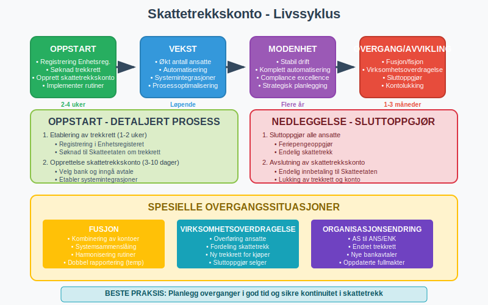

## Seksjon 6: Beste Praksis og Anbefalinger

### 6.1 Etablering av Rutiner

**Månedlige rutiner:**

| **Dag** | **Aktivitet** | **Ansvarlig** | **Kontrollpunkt** |
|---------|---------------|---------------|-------------------|
| 1.-5. | Lønnskjøring | Lønnsansvarlig | [Kvalitetskontroll](/blogs/regnskap/hva-er-qa-kvalitetssikring "Hva er QA Kvalitetssikring? Prosesser og Implementering i Regnskap") beregninger |
| 6.-10. | Overføring til skattetrekkskonto | Regnskapsansvarlig | Bankavstemming |
| 12.-15. | Innbetaling til Skatteetaten | Regnskapsansvarlig | Kvittering fra bank |
| 15.-30. | A-melding innlevering | Lønns-/regnskapsansvarlig | Statusrapport |

**Kvartalsvise oppgaver:**
* Gjennomgang av rutiner og prosedyrer
* [Avstemming](/blogs/regnskap/hva-er-avstemming "Hva er Avstemming? Kontroll og Kvalitetssikring i Regnskap") mot [kvartalsrapporter](/blogs/regnskap/regnskapskvartaler-q1-q4 "Regnskapskvartaler Q1-Q4 - Guide til Kvartalsrapportering")
* Oppdatering av fullmakter og tilganger
* [Internkontroll](/blogs/regnskap/hva-er-internkontroll "Hva er Internkontroll? Prosesser og Rutiner for Kvalitetssikring") og compliance-vurdering

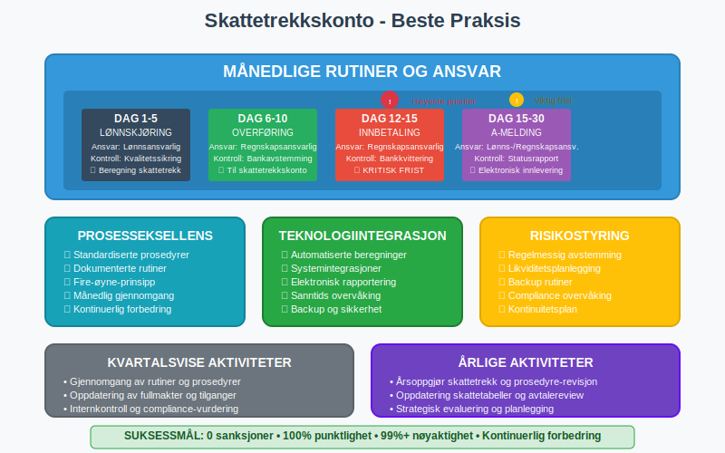

### 6.2 Framtidsperspektiver

**Utviklingstrender:**

**Teknologisk utvikling:**
* Økt automatisering av skattetrekksberegninger
* Sanntids rapportering til skattemyndighetene
* AI-basert [kvalitetssikring](/blogs/regnskap/hva-er-qa-kvalitetssikring "Hva er QA Kvalitetssikring? Prosesser og Implementering i Regnskap") og anomalideteksjon
* Integrerte [ESG-rapportering](/blogs/regnskap/hva-er-sfdr "Hva er SFDR? Bærekraftsrapportering og Regnskapsintegrasjon") systemer

**Regulatoriske endringer:**
* Strengere krav til digital rapportering
* Harmonisering med EU-regelverk
* Fokus på [bærekraft](/blogs/regnskap/hva-er-sfdr "Hva er SFDR? Bærekraftsrapportering og Regnskapsintegrasjon") og ESG
* Økt bruk av [skattefradrag for veldedighet](/blogs/regnskap/skattefradrag-gaver-veldedige-organisasjoner "Skattefradrag for Gaver til Veldedige Organisasjoner - Komplett Guide")

**Strategiske anbefalinger:**
1. **Digitalisering:** Invester i moderne lønns- og regnskapssystemer
2. **Kompetanse:** Sikre oppdatert kunnskap om [skattelovgivning](/blogs/regnskap/hva-er-skatt "Skatt - Komplett Guide til Bedriftsskatt, MVA og Skatteplanlegging")
3. **Risikostyring:** Implementer robuste [internkontroll](/blogs/regnskap/hva-er-internkontroll "Hva er Internkontroll? Prosesser og Rutiner for Kvalitetssikring")rutiner
4. **Samarbeid:** Etabler gode relasjoner med banker og rådgivere

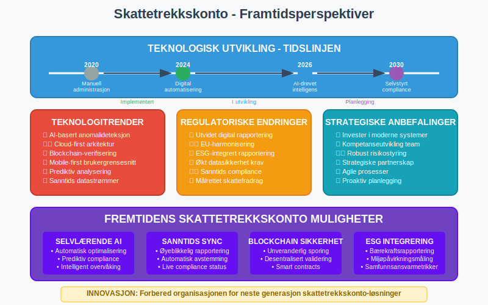

## Konklusjon

Skattetrekkskonto er et **kritisk element** i norske bedrifters regnskaps- og skatteadministrasjon. Korrekt administrasjon krever grundig forståelse av regelverket, etablering av robuste rutiner og bruk av moderne teknologiske løsninger. Ved å følge beste praksis for **regnskapsføring**, [compliance](/blogs/regnskap/hva-er-internkontroll "Hva er Internkontroll? Prosesser og Rutiner for Kvalitetssikring") og risikohåndtering kan bedrifter sikre lovlig og effektiv håndtering av skattetrekk.

Framtidens utvikling mot økt digitalisering og automatisering vil gjøre korrekt [implementering](/blogs/regnskap/hva-er-qa-kvalitetssikring "Hva er QA Kvalitetssikring? Prosesser og Implementering i Regnskap") av skattetrekkskonto-rutiner enda viktigere for bedriftens økonomiske stabilitet og [likviditet](/blogs/regnskap/hva-er-likviditet "Hva er Likviditet? Komplett Guide til Bedriftens Betalingsevne").


