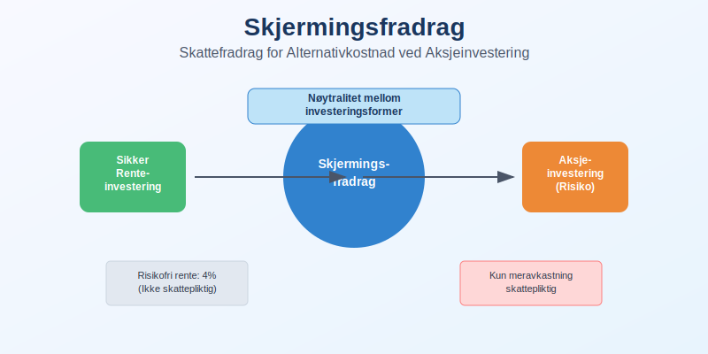
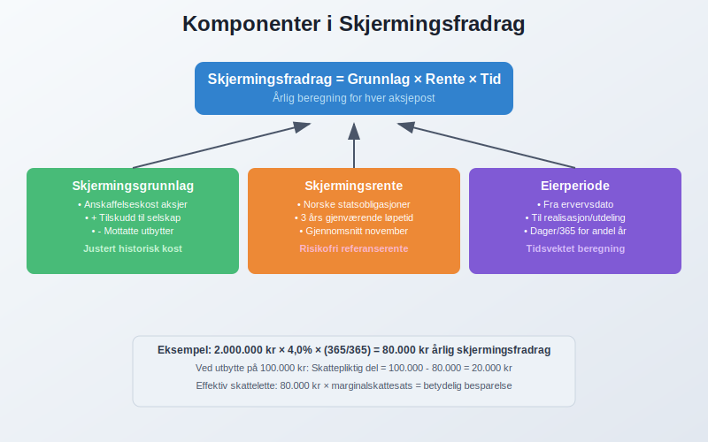
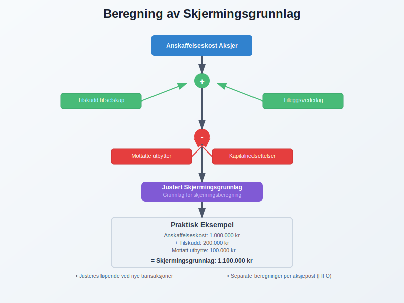
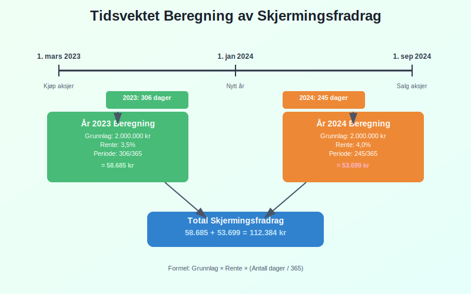
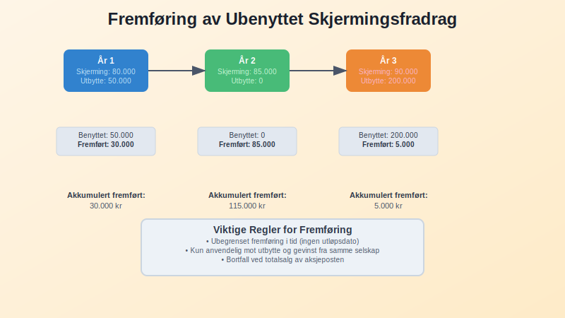
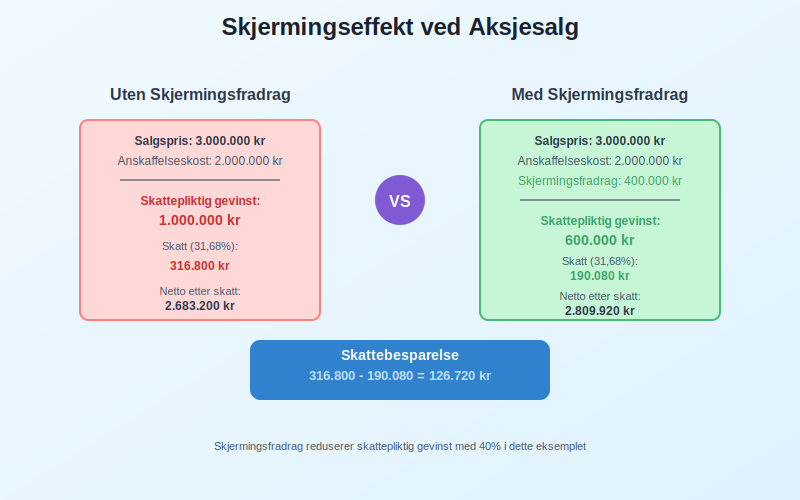
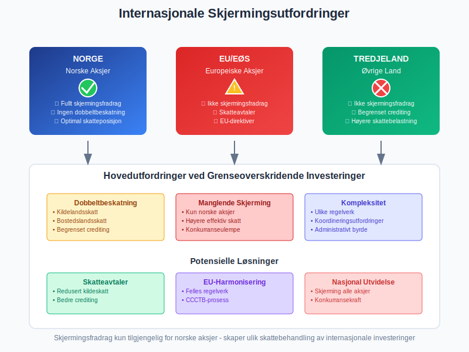
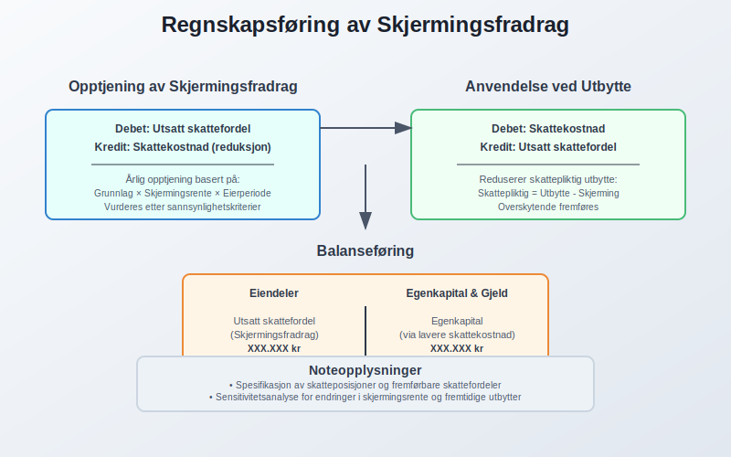
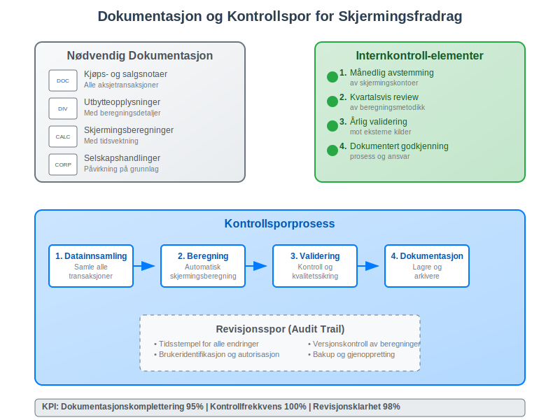
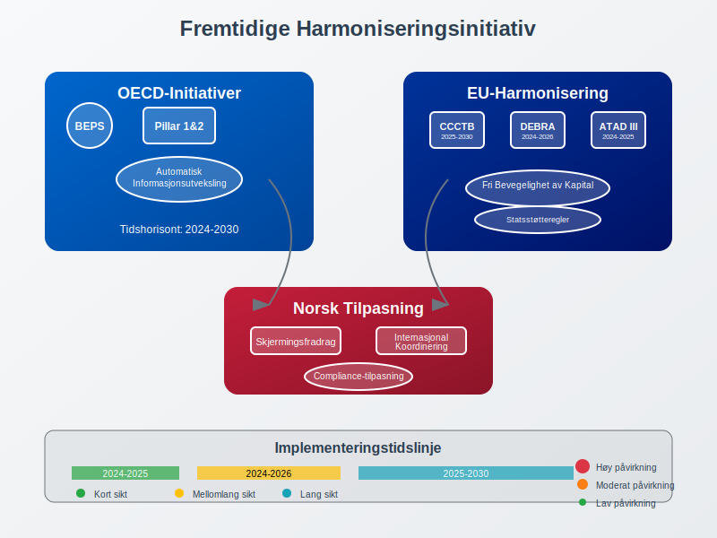

---
title: "Hva er Skjermingsfradrag?"
meta_title: "Hva er Skjermingsfradrag?"
meta_description: '**Skjermingsfradrag** er en viktig skattemessig regel som gir aksjonærer fradrag for alternativkostnaden ved å investere egenkapital i et aksjeselskap fremfor...'
slug: hva-er-skjermingsfradrag
type: blog
layout: pages/single
---

**Skjermingsfradrag** er en viktig skattemessig regel som gir aksjonærer fradrag for alternativkostnaden ved å investere egenkapital i et aksjeselskap fremfor å plassere pengene i en sikker renteinvestering. Dette fradraget sikrer at aksjonærer ikke beskattes for normalavkastning, men kun for **meravkastning** utover en risikofri rente. Skjermingsfradraget er særlig relevant for [utbytte](/blogs/regnskap/hva-er-utbytte "Hva er Utbytte? Regnskapsføring og Skattemessige Konsekvenser") og gevinster ved salg av aksjer, og påvirker både [egenkapital](/blogs/regnskap/hva-er-egenkapital "Hva er Egenkapital? Definisjon og Rolle i Selskapets Balanse") og [skatteplanlegging](/blogs/regnskap/hva-er-skatt "Skatt - Komplett Guide til Bedriftsskatt, MVA og Skatteplanlegging") på en fundamental måte.

For en komplett oversikt over hvordan skjermingsfradrag fungerer sammen med andre skatteordninger for aksjonærer, se vår [Aksjonærmodellen - Komplett Guide til Norsk Aksjebeskatning](/blogs/regnskap/aksjonaermodellen-guide "Aksjonærmodellen - Komplett Guide til Norsk Aksjebeskatning").

## Seksjon 1: Grunnleggende om Skjermingsfradrag

**Skjermingsfradrag** bygger på prinsippet om at **normalavkastning** ikke skal beskattes. Dette sikrer at skattesystemet kun beskatter **risikopremien** og unormal avkastning, hvilket fremmer investeringsvilje og [kapitalallokering](/blogs/regnskap/hva-er-kapital "Hva er Kapital? Komplett Guide til Kapitalformer og Kapitalforvaltning").



### 1.1 Teoretisk Grunnlag for Skjermingsfradrag

**Teoretisk fundament** for skjermingsfradrag er at aksjonærer skal behandles likt uavhengig av investeringsform:

* **Renteinvestering:** Renter beskattes løpende, men inflasjon og risikofri avkastning anses som kompensasjon
* **Aksjeinvestering:** Kun **meravkastning** utover risikofri rente skal beskattes  
* **Nøytralitetsprinsipp:** Skattesystemet skal ikke påvirke valg mellom låne- og egenkapitalfinansiering

**Alternativkostnadstilnærming:**
```
Skjermingsfradrag = Aksjonærens investering × Risikofri rente × Eierperiode
```

### 1.2 Skjermingsfradrag i Norsk Skattelov

**[Aksjonærmodellen](/blogs/regnskap/aksjonaermodellen "Aksjonærmodellen: Skattemodell for Utbytte og Gevinst")** (aksjonærloven) implementerer skjermingsfradrag gjennom:

#### Hovedprinsipper:
| **Element** | **Beskrivelse** | **Regnskapseffekt** |
|-------------|-----------------|---------------------|
| **Skjermingsgrunnlag** | [Aksjekapital](/blogs/regnskap/hva-er-aksjekapital "Hva er Aksjekapital? Sammensetting og Regnskapsføring") tillagt tilskudd | Registrert i [balansen](/blogs/regnskap/hva-er-balanse "Hva er Balanse? Komplett Guide til Balansens Oppbygging og Funksjon") |
| **Skjermingsrente** | Rente på statsobligasjoner med 3 års løpetid | Offentliggjøres årlig |
| **Opptjeningsperiode** | Fra erverv til realisasjon/utdeling | Tidsvektet beregning |
| **Fremføring** | Ubenyttet skjerming fremføres | [Skattefordel](/blogs/regnskap/hva-er-utsatt-skatt "Hva er Utsatt Skatt? Beregning og Regnskapsføring") bokføres |



### 1.3 Betydning for Investeringsbeslutninger

**Strategisk viktighet** av skjermingsfradrag påvirker:

#### Finansieringsvalg:
* **Egenkapital vs. gjeld:** Skjermingsfradrag reduserer egenkapitalens skatteulempe  
* **Utbyttepolitikk:** Optimalisering av utdelinger vs. tilbakekjøp
* **[Reinvestering](/blogs/regnskap/hva-er-investering "Hva er Investering? Typer og Regnskapsføring av Kapitalplasseringer"):** Sammenligning av intern vs. ekstern kapitalavkastning

#### Regnskapsmessige implikasjoner:
* **[Utsatt skatt](/blogs/regnskap/hva-er-utsatt-skatt "Hva er Utsatt Skatt? Beregning og Regnskapsføring"):** Skjermingsfradrag skaper midlertidige forskjeller
* **[Verdsettelse](/blogs/regnskap/hva-er-verdsettelse "Hva er Verdsettelse? Metoder og Anvendelse i Regnskapet"):** Påvirker [virkelig verdi](/blogs/regnskap/hva-er-virkelig-verdi "Hva er Virkelig Verdi? Verdsettelse og Regnskapsføring") av aksjeinvesteringer
* **[Rapportering](/blogs/regnskap/hva-er-rapportering "Hva er Rapportering? Krav til Finansiell Rapportering"):** Noteopplysninger om skatteposisjoner

## Seksjon 2: Beregning av Skjermingsfradrag

### 2.1 Skjermingsgrunnlag

**Skjermingsgrunnlaget** består av aksjonærens skattemessige inngangsverdi på aksjen:

#### Komponenter i skjermingsgrunnlaget:
* **Opprinnelig [anskaffelseskost](/blogs/regnskap/hva-er-anskaffelseskost "Hva er Anskaffelseskost? Beregning og Regnskapsføring")**
* **Senere tilskudd** til selskapet fra aksjonær
* **Tilleggsvederlg** ved senere aksjetegning
* **Justiert for tidligere mottatte utbytter** (som reduserer grunnlaget)

**Eksempel på skjermingsgrunnlag:**
```
Anskaffelseskost aksjer: 1.000.000 kr
+ Tilskudd til selskapet: 200.000 kr  
- Mottatt utbytte (reduserer grunnlag): 100.000 kr
= Justert skjermingsgrunnlag: 1.100.000 kr
```

#### Spesielle situasjoner:
| **Situasjon** | **Behandling** | **Regnskapsføring** |
|---------------|----------------|---------------------|
| Aksjespleis | Pro rata fordeling | Vedlikeholde historisk kost. Les mer om [aksjespleis](/blogs/regnskap/hva-er-aksjespleis "Hva er Aksjespleis? En Detaljert Guide") |
| Aksjesplitt | Pro rata fordeling | Vedlikeholde historisk kost. Les mer om [aksjesplitt](/blogs/regnskap/hva-er-aksjesplitt "Hva er en Aksjesplitt? En Komplett Guide") |
| Fondsemisjon | Ingen endring i totalt grunnlag | Økt antall aksjer |
| [Kapitalnedsettelse](/blogs/regnskap/hva-er-aksjekapital "Hva er Aksjekapital? Sammensetting og Regnskapsføring") | Reduserer grunnlaget | Regnskapsmessig tilbakebetaling |



### 2.2 Skjermingsrente

**Skjermingsrenten** fastsettes årlig og skal reflektere **risikofri avkastning**:

#### Bestemmelse av skjermingsrente:
* **Referanserente:** Rente på norske statsobligasjoner med 3 års gjenværende løpetid
* **Beregningsperiode:** Gjennomsnitt av daglige noteringer i november måned
* **Offentliggjøring:** Skattedirektoratet publiserer satsen i desember
* **Anvendelse:** Renten gjelder for påfølgende inntektsår

**Historisk utvikling av skjermingsrente:**
| **År** | **Skjermingsrente** | **Økonomisk kontekst** |
|--------|---------------------|------------------------|
| 2020 | 1,0% | Lav rente, COVID-19 |
| 2021 | 1,0% | Fortsatt ekspansiv pengepolitikk |
| 2022 | 2,0% | Inflasjon og renteøkninger |
| 2023 | 3,5% | Normalisering av renter |
| 2024 | 4,0% | Høyere rentenivå |

### 2.3 Praktisk Beregning

**Detaljert beregningsmetodikk** for skjermingsfradrag:

#### Trinn 1: Identifiser eierperiode
```
Eierperiode = Fra ervervsdato til realisasjonsdato
Tidsvektet beregning ved delvis salg
```

#### Trinn 2: Beregn årlig skjerming
```
Årlig skjermingsfradrag = Skjermingsgrunnlag × Skjermingsrente × (Eierperiode/365)
```

#### Trinn 3: Akkumuler total skjerming
```
Total skjerming = Sum av årlige skjermingsfradrag for hele eierperioden
```

**Komplekst beregnesesempel:**
```
Situasjon: Kjøp av aksjer 1. mars 2023, salg 1. september 2024
Anskaffelseskost: 2.000.000 kr
Skjermingsrenter: 2023: 3,5%, 2024: 4,0%

Beregning:
År 2023 (306 dager): 2.000.000 × 3,5% × (306/365) = 58.685 kr
År 2024 (245 dager): 2.000.000 × 4,0% × (245/365) = 53.699 kr
Total skjermingsfradrag: 112.384 kr
```



## Seksjon 3: Anvendelse ved Utbytte

### 3.1 Utbytte og Skjermingsfradrag

**Utbyttebeskatning** modifiseres av skjermingsfradrag gjennom følgende mekanisme:

#### Beregning av skattepliktig utbytte:
```
Skattepliktig utbytte = Mottatt utbytte - Anvendt skjermingsfradrag
```

**Prioritering:** Skjermingsfradrag anvendes automatisk mot utbytte før eventuell fremføring til senere år.

#### Praktisk eksempel utbytte:
```
Mottatt utbytte: 150.000 kr
Opptjent skjermingsfradrag for året: 120.000 kr
Skattepliktig utbytte: 150.000 - 120.000 = 30.000 kr
Fremførbar skjerming: 0 kr (fullt utnyttet)
```

### 3.2 Fremføring av Ubenyttet Skjerming

**Ubenyttet skjermingsfradrag** fremføres uten tidsbegrensning:

#### Regler for fremføring:
* **Ubegrenset fremføring** til senere år
* **Kun mot utbytte** og aksjegevinster fra samme selskap
* **Bortfall ved salg** av hele aksjeposten

| **Situasjon** | **Behandling av fremførbar skjerming** |
|---------------|-----------------------------------------|
| Delvis aksjesalg | Pro rata reduksjon |
| Totalt aksjesalg | Bortfall av resterende skjerming |
| Selskapsfusjon | Kan overføres til overtakende selskap |
| Likvidasjon | Anvendes mot likvidasjonsutbytte |

#### Regnskapsmessig behandling:
```
Debet: Utsatt skattefordel (skjermingsfradrag)
Kredit: Skattekostnad (reduksjon)
```



### 3.3 Utbyttepolitikk og Optimalisering

**Strategisk utbyttepolitikk** kan optimaliseres med hensyn til skjermingsfradrag:

#### Optimaliseringsstrategier:
* **Timing av utbytter:** Tilpasse til opparbeidet skjerming
* **Utbytte vs. [tilbakekjøp](/blogs/regnskap/hva-er-tilbakekjop "Hva er Tilbakekjøp? Regnskapsføring og Skattemessige Konsekvenser"):** Sammenligne skatteeffektivitet
* **Reinvesteringsalternativer:** Vurdere [selvfinansiering](/blogs/regnskap/hva-er-selvfinansiering "Hva er Selvfinansiering? Finansiering gjennom Tilbakeholdt Resultat") vs. utdeling

#### Regnskapsmessige konsekvenser:
```
Planlagt utbytte: 200.000 kr
Tilgjengelig skjerming: 180.000 kr
Optimal utbytte (skatteeffektivt): 180.000 kr
Tilleggsutbytte (full beskatning): 20.000 kr
```

**Beslutningsmartiks for utbyttepolitikk:**
| **Scenario** | **Tilgjengelig skjerming** | **Anbefalt strategi** |
|--------------|---------------------------|-----------------------|
| Høy | Større enn planlagt utbytte | Maksimer utbytte |
| Medium | Tilsvarende planlagt utbytte | Følg opprinnelig plan |
| Lav | Mindre enn planlagt utbytte | Vurder utsettelse/reduksjon |

## Seksjon 4: Skjermingsfradrag ved Aksjesalg

### 4.1 Gevinst- og Tapberegning

**Aksjegevinst** beregnes etter fradrag for skjermingsfradrag:

#### Beregningsformel:
```
Skattepliktig aksjegevinst = (Salgspris - Anskaffelseskost) - Samlet skjermingsfradrag
```

**Eksempel på gevinstrealisasjon:**
```
Salgspris: 3.000.000 kr
Anskaffelseskost: 2.000.000 kr
Brutto gevinst: 1.000.000 kr
Samlet skjermingsfradrag (5 år): 400.000 kr
Skattepliktig gevinst: 600.000 kr
```

### 4.2 Tap og Skjermingsfradrag

**Aksjetap** håndteres forskjellig avhengig av skjermingssituasjonen:

#### Scenarioer ved tap:
| **Scenario** | **Behandling** | **Regnskapseffekt** |
|--------------|----------------|---------------------|
| Tap > Opptjent skjerming | Fullt fradragsberettiget tap | Standard [tapsnedskrivning](/blogs/regnskap/hva-er-nedskrivning "Hva er Nedskrivning? Verdifall og Regnskapsføring") |
| Tap < Opptjent skjerming | Redusert tapsføringsrett | Begrenset skattefordel |
| Tap = Opptjent skjerming | Ingen skattepliktig gevinst/tap | Nøytral skatteposisjon |

**Komplekst tapseksempel:**
```
Salgspris: 1.500.000 kr
Anskaffelseskost: 2.000.000 kr
Regnskapsmessig tap: 500.000 kr
Opptjent skjermingsfradrag: 300.000 kr
Skattemessig tap: 500.000 - 300.000 = 200.000 kr
```



### 4.3 Delvis Salg og Proporsjonalitet

**Delvis aksjesalg** krever pro rata beregning av skjermingsfradrag:

#### Beregningsmetodikk:
```
Andel solgt = Antall solgte aksjer / Totalt antall aksjer
Anvendt skjerming = Total opptjent skjerming × Andel solgt
```

**Praktisk eksempel delvis salg:**
```
Total aksjepost: 1.000 aksjer
Solgt: 400 aksjer (40%)
Total opptjent skjerming: 500.000 kr
Anvendt skjerming ved salg: 500.000 × 40% = 200.000 kr
Fremførbar skjerming: 300.000 kr (for resterende 600 aksjer)
```

#### FIFO-prinsipp for eldre aksjeposter:
Ved **blandet anskaffelse** anvendes først inn, først ut-prinsippet for å identifisere hvilke aksjer som selges og tilhørende skjermingsgrunnlag.

## Seksjon 5: Selskapshandlinger og Skjermingsfradrag

### 5.1 Fusjon og Fisjon

**Selskapsomdannelser** påvirker skjermingsfradrag avhengig av struktur og kontinuitet:

#### Skattefri fusjon:
* **Kontinuitet:** Skjermingsgrunnlag videreføres i overtakende selskap
* **[Vederlagsaksjer](/blogs/regnskap/hva-er-fusion "Hva er Fusjon? Regnskapsføring og Skattemessige Konsekvenser"):** Samme skjermingsgrunnlag som opprinnelige aksjer
* **Omregningsforhold:** Justeres for fusjonsforhold

#### Fisjon (oppspaltning):
| **Fisjontype** | **Skjermingsbehandling** | **Dokumentasjonskrav** |
|----------------|--------------------------|------------------------|
| Symmetrisk fisjon | Pro rata fordeling | Verdsettelseserklæring |
| Asymmetrisk fisjon | Spesielle regler | [Skattemessig kontinuitetstest](/blogs/regnskap/skattemessig-kontinuitet "Skattemessig kontinuitet – Guide til kontinuitetsprinsippet i norsk skatt") |
| Grenseoverskridende | Nasjonale regler | EU-direktiv compliance |

### 5.2 Kapitalforhøyelse og -nedsettelse

**Endringer i aksjekapital** påvirker skjermingsgrunnlaget:

#### Kapitalforhøyelse:
```
Ny tegning: Øker skjermingsgrunnlag med tegningskurs
Fondsemisjon: Ingen endring i skjermingsgrunnlag per aksje
Fortrinnsrett: Proporsjonalt basert på tegningsandel
```

#### Kapitalnedsettelse:
```
Kontant utbetaling: Reduserer skjermingsgrunnlag kr for kr
Fondsnedsettelse: Ingen endring (kun nominell reduksjon)
Kombinasjon: Blandet behandling etter type
```


### 5.3 Likvidasjon

**Selskapsllikvidasjon** utløser **spesielle regler** for skjermingsfradrag:

#### Likvidasjonsutbytte:
* **Første trinn:** Skjermingsfradrag reduserer skattepliktig utbytte
* **Andre trinn:** Overskytende behandles som [aksjegevinst](/blogs/regnskap/hva-er-gevinst-tap "Hva er Gevinst og Tap? Regnskapsføring av Verdiendringer")
* **Tredje trinn:** Tap kan fradragsføres

**Eksempel på likvidasjonsberegning:**
```
Likvidasjonsutbytte mottatt: 2.200.000 kr
Opprinnelig skjermingsgrunnlag: 2.000.000 kr
Opptjent skjermingsfradrag: 300.000 kr

Beregning:
Likvidasjonsutbytte: 2.200.000 kr
- Skjermingsgrunnlag: 2.000.000 kr
= Brutto gevinst: 200.000 kr
- Skjermingsfradrag: 300.000 kr  
= Skattemessig tap: 100.000 kr (fradragsberettiget)
```

## Seksjon 6: Internasjonale Aspekter

### 6.1 Grenseoverskridende Investeringer

**Internasjonale investeringer** møter komplekse samspill mellom nasjonale skjermingsregler og skatteavtaler:

#### Utfordringer ved utenlandske aksjer:
* **Dobbeltbeskatning:** Kildelandsskatt vs. bostedslandsskatt
* **Skjermingsfradrag:** Kun tilgjengelig for norske aksjer
* **Crediting:** Fradrag for betalt utenlandsk skatt

| **Investeringstype** | **Skjermingsfradrag** | **Alternativ skattelindring** |
|----------------------|----------------------|-------------------------------|
| Norske aksjer | Fullt tilgjengelig | N/A |
| Nordiske aksjer | Ikke tilgjengelig | Skatteavtaler |
| EU-aksjer | Ikke tilgjengelig | EU-direktiver |
| Tredjeland | Ikke tilgjengelig | Begrenset crediting |

### 6.2 Skatteavtaler og Koordinering

**Skatteavtalenes** påvirkning på skjermingsfradrag og internasjonale strukturer:

#### OECD-modellkonvensjon:
* **Utbyttebeskatning:** Maksimal kildeskatt 5-15%
* **Kapitalgevinster:** Hovedsakelig beskatning i bostedsland
* **Transparensprinsipp:** Gjennomsyn i visse strukturer

#### Praktiske koordineringsutfordringer:
```
Norsk mor → Utenlandsk datter:
- Utbytte fra datter: Kildelandsskatt + norsk restskatt
- Skjermingsfradrag: Ikke tilgjengelig
- Løsning: Fritaksmetoden eller crediting
```



### 6.3 Transfer Pricing og Skjermingsfradrag

**Internprising** mellom nærstående selskaper påvirker skjermingsgrunnlaget:

#### Armlengdeprinsippet anvendt på skjermingsfradrag:
* **Lånerenter:** Må være markedsmessige for optimal skjerming
* **Konsernbidrag:** PÃ¥virker skjermingsgrunnlag
* **Management fees:** Reduserer grunnlag for skjerming

#### Dokumentasjonskrav:
```
- Markedsanalyse av renter
- Sammenlignbare transaksjoner
- Økonomisk substans i strukturen
- Country-by-country rapportering
```

## Seksjon 7: Regnskapsmessig Behandling

### 7.1 Bokføring av Skjermingsfradrag

**Regnskapsmessig erfassung** av skjermingsfradrag krever særlig oppmerksomhet på tidspunkt og klassifisering:

#### Opptjening av skjermingsfradrag:
```
Debet: Utsatt skattefordel (skjermingsfradrag)
Kredit: Skattekostnad (reduksjon)
```

#### Anvendelse ved utbytte:
```
Debet: Skattekostnad
Kredit: Utsatt skattefordel (skjermingsfradrag)
```

### 7.2 Verdsettelse og Balanseføring

**Verdsettelse** av skattefordeler fra skjermingsfradrag følger [IAS 12](/blogs/regnskap/hva-er-ias "Hva er IAS? International Accounting Standards") prinsipper:

#### Verdsettelseskriterier:
| **Faktor** | **Vurdering** | **Regnskapsbehandling** |
|------------|---------------|-------------------------|
| **Sannsynlighet** | Fremtidige skattepliktige inntekter | Konservativ tilnærming |
| **Tidshoriont** | Forventet realisasjon | NÃ¥verdijustering |
| **Usikkerhet** | Skattelovgivningsendringer | Sensitivitetsanalyse |

#### Noteopplysninger:
* **Samlede skatteposisjoner** med oppbygging og anvendelse
* **Sensitivitetsanalyse** for endringer i skjermingsrente
* **Forventede fremtidige utbytter** som grunnlag for verdsettvelse



### 7.3 Intern Rapportering og Styring

**Management rapportering** bør inkludere skjermingsfradrag som del av skatteplanleggingen:

#### KPI-er for skjermingsstyring:
```
Skjermingsdekning = Akkumulert skjerming / Planlagt utbytte
Effektiv skatterate = Total skatt / (Utbytte - Anvendt skjerming)
Skjermingsoptimalisering = Benyttet skjerming / Total tilgjengelig
```

#### Beslutningsstøtte:
* **Scenario-analyser** for ulike utbyttestrategier
* **NPV-beregninger** som inkluderer skjermingseffekt
* **Sensitivitetsanalyse** for renteendringer

## Seksjon 8: Strategisk Skatteplanlegging

### 8.1 Optimaliseringsstrategier

**Langsiktig skatteplanlegging** kan optimaliseres gjennom strukturelle tiltak og timing:

#### Strukturelle optimaliseringer:
* **Holdingselskap-struktur:** Konsentrer skjermingsfradrag
* **Generasjonsskifte:** Planlegg overføringer for optimal skjerming
* **Selskapstomatiske:** Tilpass organisasjonsform til skjermingsregler

#### Timingstrategier:
| **Timing-element** | **Optimalisering** | **Regnskapseffekt** |
|--------------------|-------------------|---------------------|
| Aksjekjøp | Tidlig på året for maksimal skjerming | Økt [avkastningskrav](/blogs/regnskap/hva-er-avkastning "Hva er Avkastning? Beregning og Optimalisering av Kapitalavkastning") |
| Utbyttetiming | Tilpass til opparbeidet skjerming | Optimalisert [kontantstrøm](/blogs/regnskap/hva-er-kontantstrom "Hva er Kontantstrøm? Analyse og Forvaltning av Bedriftens Pengestrøm") |
| Aksjesalg | Vurder skjerming vs. markedstiming | Realiserte gevinster |

### 8.2 Porteføljeoptimalisering

**Porteføljetilnærming** til skjermingsfradrag inkluderer:

#### Diversifiseringsstrategier:
```
Norske aksjer: Maksimal skjermingseffekt
Internasjonale aksjer: Ingen skjerming, men annen diversifikasjonsverdi
Obligasjoner: Benchmark for skjermingsrente
```

#### Allokering av kapital:
```
Optimal allokering = f(forventet avkastning, risiko, skjermingseffekt)
```


### 8.3 Teknologistøtte for Skjermingsstyring

**Digitale verktøy** for skjermingsberegning og -optimalisering:

#### Systemfunksjonalitet:
* **Automatisk beregning** av daglig skjerming
* **Scenario-modellering** for ulike strategier
* **Integrasjon** med porteføljestyringssystem
* **Rapportering** til skattemyndigheter

#### Implementering i ERP-systemer:
```
Module: Tax Management
  Submodule: Shielding Calculation
    - Real-time tracking
    - Automatic rate updates  
    - Portfolio optimization
    - Compliance reporting
```

## Seksjon 9: Endringer og Reformer

### 9.1 Historisk Utvikling

**Utviklingen** av skjermingsfradrag har vært preget av politiske og økonomiske hensyn:

#### Milepæler:
| **Ã…r** | **Endring** | **Begrunnelse** |
|--------|-------------|-----------------|
| 2006 | Innføring av aksjonærmodellen | Forenkle skattesystem |
| 2016 | Justering av RISK-regler | Redusere kompleksitet |
| 2022 | Økt skjermingsrente | Følge rentenivå |

### 9.2 Aktuelle Reformdiskusjoner

**Pågående debatt** om fremtidige endringer i skjermingsfradrag:

#### Diskuterte endringer:
* **Begrensning i tid:** Maksimal periode for opptjening
* **Tak på skjerming:** Maksimalbeløp per aksjonær
* **Utvidelse:** Skjerming for utenlandske aksjer
* **Forenkling:** Reduserte administrative byrder

#### Politiske argumenter:
```
For bevaring: Investeringsincentiver, nøytralitet, forenkling
For endring: Skatteinntekter, fordeling, internasjonale hensyn
```


### 9.3 EU-rettslige Aspekter

**EU-retten** påvirker utformingen av skjermingsfradrag:

#### Relevante prinsipper:
* **Fri bevegelighet av kapital:** Likbehandling av investeringer
* **Statsstøtteregler:** Selektive skattefordeler
* **Harmonisering:** Koordinering med andre EU-land

#### Fremtidige utfordringer:
```
CCCTB (Common Consolidated Corporate Tax Base):
- Felles skattegrunnlag
- Påvirkning på nasjonale skjermingsregler
- Koordinert implementering
```

## Seksjon 10: Praktisk Implementering

### 10.1 Systemer og Verktøy

**Praktisk implementering** av skjermingsfradragssystemet krever robuste systemer:

#### IT-systemkrav:
* **Database for aksjeposter** med historiske data
* **Automatisk oppdatering** av skjermingsrenter
* **Beregningsmotor** for komplekse scenarier
* **Rapporteringsmodul** for selvangivelse

| **Systemkomponent** | **Funksjonalitet** | **Integrasjon** |
|---------------------|-------------------|-----------------|
| Portfolio Management | Sporing av aksjeposter | Real-time data feed |
| Tax Engine | Skjermingsberegninger | Automatiske updates |
| Reporting Module | Regulatory filing | [Altinn](/blogs/regnskap/hva-er-altinn "Hva er Altinn? Digitale Tjenester for Næringsliv") interface |

### 10.2 Dokumentasjon og Kontrollspor

**Dokumentasjonskrav** for å støtte skjermingsfradrag-beregninger:

#### Nødvendig dokumentasjon:
* **Kjøps- og salgsnotaer** for alle aksjetransaksjoner
* **Utbytteopplysninger** med beregningsdetaljer
* **Skjermingsberegninger** med tidsvektning
* **Selskapshandlinger** og påvirkning på grunnlag

#### Internkontroll-elementer:
```
1. MÃ¥nedlig avstemming av skjermingskontoer
2. Kvartalsvis review av beregningsmetodikk  
3. Ã…rlig validering mot eksterne kilder
4. Dokumentert godkjenningsprosess
```



### 10.3 Compliance og Rapportering

**Etterlevelse** av skjermingsfradrag-reglene krever systematisk tilnærming:

#### Compliance-sjekkliste:
- [ ] Ã…rlig oppdatering av skjermingsrenter
- [ ] Korrekt beregning av eierperioder  
- [ ] Riktig behandling av selskapshandlinger
- [ ] Fullstendig dokumentasjon av transaksjoner
- [ ] Revisorgodkjenning av beregningsmetodikk

#### Rapporteringsfrister:
| **Rapporteringstype** | **Frist** | **Mottaker** |
|----------------------|-----------|--------------|
| [Selvangivelse](/blogs/regnskap/hva-er-selvangivelse "Hva er Selvangivelse? Utfylling og Innlevering") | 31. mai | Skatteetaten |
| RF-1167 (Skjermingsfradrag) | 31. mai | Skatteetaten |
| Kontrollrapport | På forespørsel | Skatteetaten |

## Seksjon 11: Fremtidige Utviklingstrekk

### 11.1 Digitalisering og Automatisering

**Fremtidens skjermingsfradrag** vil være preget av økt digitalisering:

#### Teknologiske trender:
* **AI-baserte** beregningssystemer
* **Blockchain** for transparente transaksjonslogger
* **Real-time rapportering** til skattemyndigheter
* **Automatisk optimalisering** av skatteposisjoner

#### Systemintegrasjon:
```
Børs → Portfolio Management → Tax Engine → Skatteetaten
Real-time data flow med automatisk compliance-sjekk
```

### 11.2 Internasjonale Harmoniseringsinitiativer

**Globale initiativer** kan påvirke fremtidig utforming:

#### OECD-initiativer:
* **BEPS** (Base Erosion and Profit Shifting) regelverket
* **Pillar 1 og 2** fra OECD/G20 prosjektet
* **Automatisk informasjonsutveksling** mellom land

#### EU-harmonisering:
| **Initiativ** | **PÃ¥virkning** | **Tidshorisont** |
|---------------|----------------|------------------|
| CCCTB | Felles skattegrunnlag | 2025-2030 |
| DEBRA | Europeisk skjermingsfradrag | 2024-2026 |
| ATAD III | Anti-mismatch rules | 2024-2025 |



### 11.3 Bærekraft og ESG-integrasjon

**Bærekraftsaspekter** kan påvirke fremtidige skjermingsregler:

#### ESG-kriterier:
* **Grønne investeringer:** Spesielle skjermingsfordeler
* **[Bærekraftsrapportering](/blogs/regnskap/hva-er-barekraftsrapportering "Hva er Bærekraftsrapportering? Krav og Implementering"):** Kobling til skjermingsfradrag
* **Social impact:** Vurdering av samfunnsansvar

#### Implementeringsutfordringer:
```
Vurderingskriterier: Hvordan definere "grønne" investeringer?
Måling: Kvantifisering av bærekraftseffekter
Kontroll: Verifisering av ESG-compliance
```

## Konklusjon

**Skjermingsfradrag** representerer en sofistikert løsning på en fundamental utfordring i skattepolitikken: hvordan sikre nøytralitet mellom ulike investeringsformer samtidig som man opprettholder et effektivt skattesystem. Dette fradraget har blitt en hjørnestein i norsk [aksjonærbeskatning](/blogs/regnskap/hva-er-aksjonaer "Hva er Aksjonær? Rettigheter og Forpliktelser i Aksjeselskap"), med betydelige implikasjoner for både [regnskapsføring](/blogs/regnskap/hva-er-bokforing "Hva er Bokføring? Grunnleggende Prinsipper og Prosesser") og strategisk [finansplanlegging](/blogs/regnskap/hva-er-finansplanlegging "Hva er Finansplanlegging? Strategisk Økonomistyring").

**Nøkkelinnsikter:**

* **Teoretisk fundament:** Skjermingsfradrag sikrer at kun meravkastning utover risikofri rente beskattes
* **Praktisk kompleksitet:** Beregninger krever detaljert sporing av aksjeposter og eierperioder
* **Strategisk verdi:** Betydelig potensial for skatteoptimalisering gjennom timing og strukturering
* **Fremtidsperspektiv:** Digitaliteting og internasjonale harmoniseringskrav vil forme videre utvikling

**Regnskapsmessige implikasjoner:**

For [regnskapsførere](/blogs/regnskap/hva-er-regnskapsforer "Hva er Regnskapsfører? Rolle og Ansvar i Regnskapsføringen") og økonomikynnsvarlige er forståelse av skjermingsfradrag kritisk for:

- **Korrekt verdsettelse** av [skatteposisjoner](/blogs/regnskap/hva-er-utsatt-skatt "Hva er Utsatt Skatt? Beregning og Regnskapsføring") i balansen
- **Strategisk rådgivning** til ledelse og aksjonærer om utbyttepolitikk
- **Compliance-sikring** gjennom robuste beregningssystemer og dokumentajon
- **Optimalisering** av samlet skattebyrde gjennom planlagt timing av transaksjoner

**Fremtidsbilde:**

Skjermingsfradrag vil sannsynligvis gjennomgå betydelige endringer i kommende år, drevet av:

- **Teknologisk utvikling** som muliggjør mer sofistikerte beregnings- og rapporteringssystemer
- **Internasjonale koordineringsinitiativ** som kan harmonisere nasjonale forskjeller
- **Bærekraftshensyn** som kan introdusere nye kriterier for skattefordeler
- **Politiske endringer** som kan justere balansen mellom skatteinngang og investeringsincentiver

For bedrifter og investorer som ønsker å maksimere verdien av sine investeringer, er det essensielt å ikke bare forstå dagens regler, men også å holde seg oppdatert på utviklingen og planlegge for fremtidige endringer. Skjermingsfradrag vil fortsette å være et viktig verktøy for å sikre at norsk aksjemarked forblir konkurransedyktig og attraktivt for både nasjonale og internasjonale investorer.

Ved å integrere skjermingsfradrag effektivt i den totale [skatteplanleggingen](/blogs/regnskap/hva-er-skatteplanlegging "Hva er Skatteplanlegging? Optimalisering av Skatteposisjon"), kan bedrifter og investorer oppnå betydelige besparelser samtidig som de bidrar til et sunt og transparent skattesystem som støtter økonomisk vekst og innovasjon.

For å få full oversikt over alle aspekter ved skjermingsfradrag og hvordan dette fungerer sammen med andre skatteordninger for aksjonærer, anbefaler vi vår [Aksjonærmodellen - Komplett Guide til Norsk Aksjebeskatning](/blogs/regnskap/aksjonaermodellen-guide "Aksjonærmodellen - Komplett Guide til Norsk Aksjebeskatning").
