---
title: "Hva er Skjermingsrente?"
meta_title: "Hva er Skjermingsrente?"
meta_description: '**Skjermingsrente** er den **risikofrie renten** som brukes til å beregne [skjermingsfradrag](/blogs/regnskap/hva-er-skjermingsfradrag "Hva er Skjermingsfradra...'
slug: hva-er-skjermingsrente
type: blog
layout: pages/single
---

**Skjermingsrente** er den **risikofrie renten** som brukes til å beregne [skjermingsfradrag](/blogs/regnskap/hva-er-skjermingsfradrag "Hva er Skjermingsfradrag? Komplett Guide til Aksjonærbeskatning") i norsk skatterett. Denne renten fungerer som et **benchmark** for å skille mellom normalavkastning og meravkastning ved aksjonærinvesteringer, og sikrer at kun avkastning utover risikofri nivå beskattes. Skjermingsrenten fastsettes årlig av **Skattedirektoratet** basert på norske statsobligasjoner, og har fundamental betydning for [aksjonærbeskatning](/blogs/regnskap/hva-er-aksjonaer "Hva er Aksjonær? Rettigheter og Forpliktelser i Aksjeselskap"), [utbytteplanlegging](/blogs/regnskap/hva-er-utbytte "Hva er Utbytte? Regnskapsføring og Skattemessige Konsekvenser") og strategisk [skatteoptimalisering](/blogs/regnskap/hva-er-skatteplanlegging "Hva er Skatteplanlegging? Optimalisering av Skatteposisjon").

## Seksjon 1: Definisjon og Grunnlag for Skjermingsrente

### 1.1 Teoretisk Fundament

**Skjermingsrenten** bygger på fundamentale finansteoretiske prinsipper om **risikofri avkastning** og **kapitalverdsettelse**:

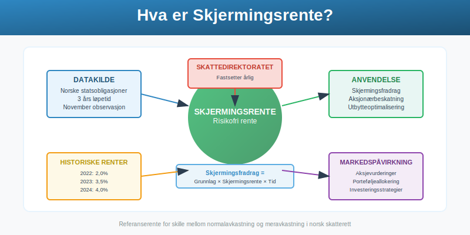

#### Økonomisk begrunnelse:
* **Tidsverdi av penger:** Kompensasjon for å utsette konsum
* **Inflasjonsjustering:** Bevaring av realverdi over tid  
* **Risikofri benchmark:** Minimumsavkastning uten kredittrisiko
* **Alternativkostnad:** Avkastning ved alternativ investering

**Teoretisk sammenheng:**
```
Skjermingsrente = Risikofri rente ≈ Statsobligasjonsrente (3 år)
```

### 1.2 Juridisk Forankring

**Skjermingsrenten** er hjemlet i **skatteloven § 10-12** og tilhørende forskrifter:

| **Regelverknivå** | **Bestemmelse** | **Innhold** |
|-------------------|-----------------|-------------|
| **Skatteloven** | § 10-12 | Grunnleggende skjermingsprinsipp |
| **FSFIN** | § 10-12 | Detaljerte beregningsregler |
| **Skattedirektoratet** | Ã…rlig vedtak | Fastsettelse av rentesats |

#### Sentrale definisjoner:
* **"Risikofri rente":** Avkastning på norske statspapirer
* **"Treårig løpetid":** Spesifisert forfallsperiode
* **"Gjennomsnittlig rente":** Beregningsmetodikk
* **"November måned":** Observasjonsperiode

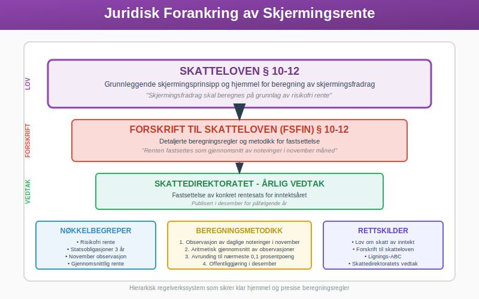

### 1.3 Sammenheng med [Aksjonærmodellen](/blogs/regnskap/aksjonaermodellen "Aksjonærmodellen: Skattemodell for Utbytte og Gevinst")

**Skjermingsrenten** er en integrert del av [**Aksjonærmodellen**](/blogs/regnskap/aksjonaermodellen "Aksjonærmodellen: Skattemodell for Utbytte og Gevinst") som ble innført i 2006:

#### Hovedprinsipper i aksjonærmodellen:
* **Fritaksmetoden:** Utbytte og gevinster behandles likt
* **Skjermingsprinsipp:** Kun meravkastning beskattes
* **Nøytralitet:** Likbehandling av finansieringsformer
* **Forenkling:** Redusert kompleksitet i skattesystemet

**Systemisk rolle:**
```
Aksjonærmodell = Fritaksmetode + Skjermingsfradrag (basert på skjermingsrente)
```

#### Interaksjon med andre skatteregler:
* **[Egenkapital](/blogs/regnskap/hva-er-egenkapital "Hva er Egenkapital? Definisjon og Rolle i Selskapets Balanse"):** Grunnlag for skjermingsberegning
* **[Balanse](/blogs/regnskap/hva-er-balanse "Hva er Balanse? Komplett Guide til Balansens Oppbygging og Funksjon"):** Bokføring av skatteposisjoner
* **[Resultatregnskap](/blogs/regnskap/hva-er-resultatregnskap "Hva er Resultatregnskap? Oppbygging og Analyse"):** Periodisering av skattekostnad

## Seksjon 2: Fastsettelse og Beregning

### 2.1 Metodikk for Fastsettelse

**Skattedirektoratet** fastsetter skjermingsrenten ved **objektiv markedsbasert metode**:

#### Beregningsprosess:
1. **Observasjonsperiode:** Hele november måned
2. **Datakilde:** Norges Bank og Oslo Børs
3. **Instrument:** Statsobligasjoner med ca. 3 års løpetid
4. **Beregning:** Aritmetisk gjennomsnitt av daglige noteringer
5. **Avrunding:** Nærmeste 0,1 prosentpoeng

**Detaljert beregningseksempel:**
```
November 2024 observasjoner:
Dag 1: 3,45%, Dag 2: 3,48%, Dag 3: 3,42% ... Dag 30: 3,51%
Gjennomsnitt: (3,45 + 3,48 + ... + 3,51) / 30 = 3,47%
Avrundet skjermingsrente: 3,5%
```

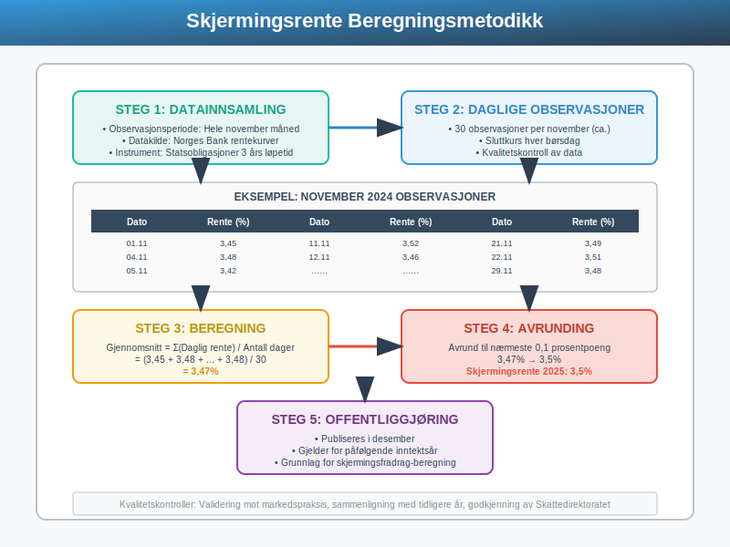

### 2.2 Historisk Utvikling

**Skjermingsrenten** har variert betydelig med **markedsforhold** og **pengepolitikk**:

| **Periode** | **Skjermingsrente** | **Økonomisk kontekst** | **Rentemiljø** |
|-------------|---------------------|------------------------|----------------|
| 2006-2008 | 4,0-5,5% | Pre-finanskrise | Normalt rentenivå |
| 2009-2011 | 2,5-3,5% | Finanskriserespons | Ekspansiv politikk |
| 2012-2019 | 1,0-2,0% | Lav inflasjon | Ultralavt rentenivå |
| 2020-2021 | 1,0% | COVID-19 pandemi | Nullrenteperiode |
| 2022-2024 | 2,0-4,0% | Inflasjon og normalisering | Renteøkninger |

#### Rentesykliske faktorer:
* **Inflasjonsmål:** Norges Bank 2% mål
* **Internasjonale renter:** Koordinering med andre sentralbanker
* **Økonomisk aktivitet:** BNP-vekst og arbeidsmarked
* **Finansiell stabilitet:** Systemrisiko-hensyn

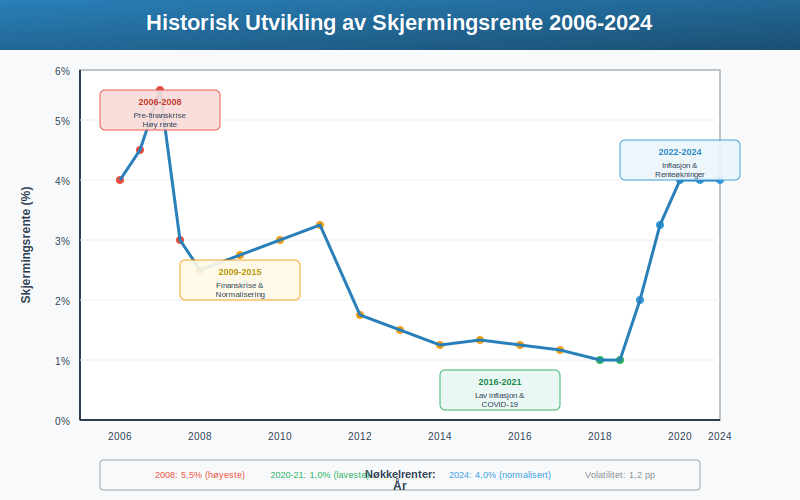

### 2.3 Sammenligning med Andre Referanserenter

**Skjermingsrenten** skiller seg fra andre **referanserenter** i det norske finanssystemet:

| **Rentetype** | **Formål** | **Løpetid** | **Typisk nivå** |
|---------------|------------|-------------|-----------------|
| **Skjermingsrente** | Skatteberegning | 3 år | Statsobligasjonsrente |
| **Styringsrente** | Pengepolitikk | N/A | Lavere enn skjermingsrente |
| **NIBOR** | Pengemarked | 3 mnd | Høyere (kredittrisiko) |
| **[Normalrente](/blogs/regnskap/hva-er-rente "Hva er Rente? Typer og Regnskapsføring")** | Transfer pricing | 1 år | Markedsbasert |

#### Spredningsanalyse:
```
Typisk spread (basis points):
Skjermingsrente - Styringsrente: +100-200 bp
NIBOR - Skjermingsrente: +50-100 bp
Selskapsobligasjoner - Skjermingsrente: +200-500 bp
```

## Seksjon 3: Anvendelse i Skjermingsfradrag-beregning

### 3.1 Grunnleggende Beregningsformel

**Skjermingsfradraget** beregnes ved å anvende skjermingsrenten på aksjonærens **skjermingsgrunnlag**:

#### Hovedformel:
```
Årlig skjermingsfradrag = Skjermingsgrunnlag × Skjermingsrente × (Eierperiode/365)
```

**Detaljert komponentanalyse:**

| **Komponent** | **Definisjon** | **Regnskapsbehandling** |
|---------------|----------------|-------------------------|
| **Skjermingsgrunnlag** | [Anskaffelseskost](/blogs/regnskap/hva-er-anskaffelseskost "Hva er Anskaffelseskost? Beregning og Regnskapsføring") + tilskudd | Historisk kost |
| **Skjermingsrente** | Ã…rlig fastsatt sats | Markedsbasert |
| **Eierperiode** | Dager fra erverv til realisasjon | Tidsvektet |

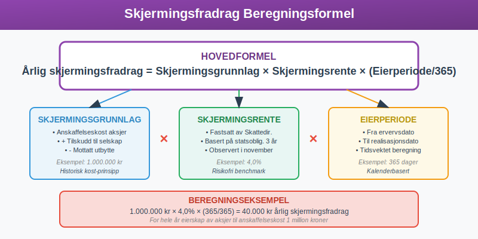

### 3.2 Komplekse Beregningsscenarier

**Praktiske situasjoner** krever tilpassede beregningsmetoder:

#### Scenario 1: Varierende skjermingsrenter
```
Situasjon: Aksje eid over flere år med ulike skjermingsrenter
Eierperiode: 1. januar 2022 - 31. desember 2024
Skjermingsgrunnlag: 1.000.000 kr

Beregning:
År 2022: 1.000.000 × 2,0% = 20.000 kr
År 2023: 1.000.000 × 3,5% = 35.000 kr  
År 2024: 1.000.000 × 4,0% = 40.000 kr
Total skjerming: 95.000 kr
```

#### Scenario 2: Delvis eierperiode
```
Situasjon: Aksje kjøpt midt i året
Kjøpsdato: 15. mai 2024
Skjermingsrente 2024: 4,0%
Skjermingsgrunnlag: 500.000 kr

Beregning:
Eierperiode: 231 dager (15. mai - 31. desember)
Skjermingsfradrag: 500.000 × 4,0% × (231/365) = 12.657 kr
```

### 3.3 Periodisering og Tidsberegning

**Nøyaktig tidsberegning** er kritisk for korrekt skjermingsberegning:

#### Tidsberegningstaprinsipper:
* **Inklusivitet:** Både kjøps- og salgsdato inkluderes
* **Kalenderår:** Skjermingsrente gjelder for hele kalenderår
* **Skuddår:** 366 dager i denominatoren
* **Delvis perioder:** Pro rata beregning

**Eksempel på kompleks tidsberegning:**
```
Transaksjonshistorikk:
- Kjøp 100 aksjer: 1. mars 2023
- Kjøp 50 aksjer: 1. september 2023  
- Salg 75 aksjer: 15. juni 2024

Beregning (FIFO-prinsipp):
Salg dekker: 75 av de første 100 aksjene
Eierperiode for solgte aksjer: 1. mars 2023 - 15. juni 2024
Ã…r 2023: 306 dager (1. mars - 31. desember)
Ã…r 2024: 166 dager (1. januar - 15. juni)
```

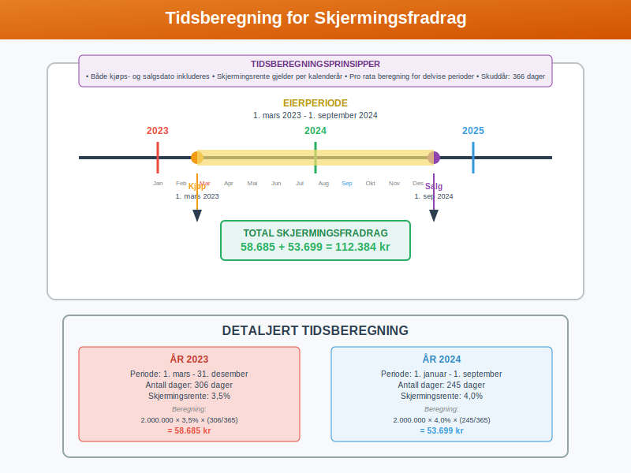

## Seksjon 4: Påvirkning på Utbyttebeskatning

### 4.1 Utbytte og Skjermingsfradrag Samspill

**Utbyttebeskatning** modifiseres direkte av skjermingsfradrag basert på skjermingsrenten:

#### Beregningssekvens:
1. **Utbytte mottas:** Brutto utbyttebeløp registreres
2. **Skjermingsfradrag anvendes:** Reduserer skattepliktig del
3. **Restskatt beregnes:** PÃ¥ utbytte utover skjerming
4. **Fremføring:** Ubenyttet skjerming til senere år

**Praktisk utbytteeksempel:**
```
Situasjon: Utbytte 150.000 kr, opparbeidet skjerming 120.000 kr

Beregning:
Brutto utbytte: 150.000 kr
- Anvendt skjermingsfradrag: 120.000 kr
= Skattepliktig utbytte: 30.000 kr
Skatt (31,68%): 9.504 kr
Netto utbytte etter skatt: 140.496 kr
```

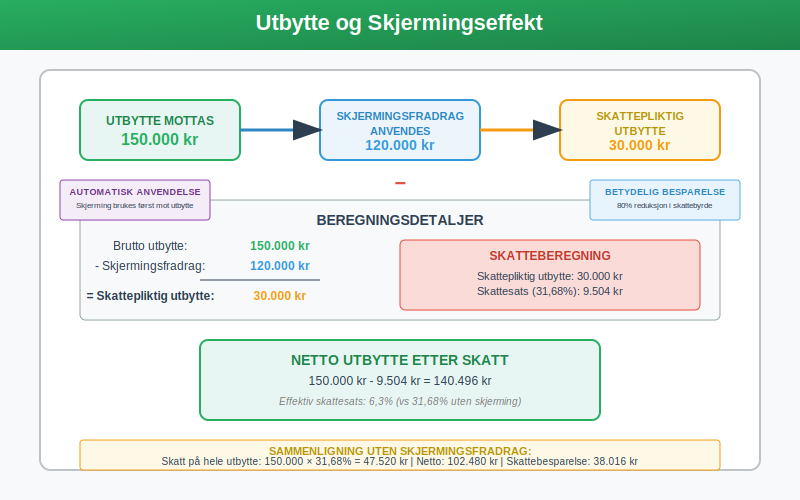

### 4.2 Strategisk Utbyttepolitikk

**Optimalisering** av utbyttepolitikk basert på skjermingsrente og opparbeidet skjerming:

#### Timingstrategier:
* **Årsslutt-utbytte:** Maksimerer skjerming for inneværende år
* **Delt utbytte:** Ordinært + ekstraordinært tilpasset skjerming
* **Tilbakekjøp vs. utbytte:** Skatteeffektivitet-sammenligning

| **Strategi** | **Skjermingseffekt** | **Likviditetseffekt** | **Optimal når** |
|--------------|----------------------|----------------------|-----------------|
| **Maksimalt utbytte** | Fullt utnytter skjerming | Høy utbetaling | Høy opparbeidet skjerming |
| **Tilbakeholdelse** | Bygger opp skjerming | Lav utbetaling | Lav skjermingsrente |
| **Tilbakekjøp** | Ingen direkte effekt | Fleksibel | Høy skjermingsrente |

#### Regnskapsmessige overveielser:
```
Optimal utbyttebeslutning = f(opparbeidet skjerming, skjermingsrente, fremtidig avkastning)
```

### 4.3 Fremføring av Ubenyttet Skjerming

**Ubenyttet skjermingsfradrag** påvirkes av **skjermingsrente-endringer**:

#### Fremføringsmekanisme:
* **Nominell fremføring:** Ingen justering for nye skjermingsrenter
* **Ubegrenset periode:** Til full utnyttelse eller aksjesalg
* **Prioritering:** Automatisk anvendelse ved fremtidige utbytter

**Verdsettelse av fremførbar skjerming:**
```
Nåverdi av skjerming = Skjermingsbeløp / (1 + Diskonteringsrente)^År til utnyttelse
```

#### Sensitivitetsanalyse:
| **Diskonteringsrente** | **Nåverdi (1 år)** | **Nåverdi (5 år)** | **Nåverdi (10 år)** |
|------------------------|---------------------|---------------------|---------------------|
| 3% | 97,1% | 86,3% | 74,4% |
| 5% | 95,2% | 78,4% | 61,4% |
| 7% | 93,5% | 71,3% | 50,8% |

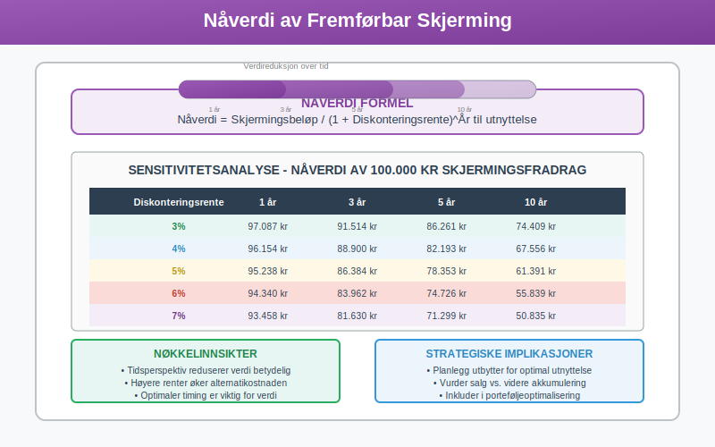

## Seksjon 5: Markedsimplikasjoner og Verdsettelse

### 5.1 Påvirkning på Aksjevurdering

**Skjermingsrenten** påvirker **fundamental verdsettelse** av norske aksjer:

#### Verdsettelseseffekter:
* **Redusert effektiv skattesats:** Øker [netto nåverdi](/blogs/regnskap/hva-er-npv "Hva er NPV? Netto Nåverdi Analyse og Beregning")
* **Risiko-justering:** Lavere systematisk risiko
* **Konkurransefordel:** Norske aksjer vs. utenlandske
* **Likviditetspremie:** Økt attraktivitet for langsiktige investorer

**DCF-modell med skjermingseffekt:**
```
Justert nåverdi = Σ [Utbytte_t - Skatt(Utbytte_t - Skjerming_t)] / (1 + r)^t
hvor Skjerming_t = Investering × Skjermingsrente_t
```

#### Empiriske markedseffekter:
| **Skjermingsrente-endring** | **Forventet aksjepris-effekt** | **Observert markedsrespons** |
|-----------------------------|--------------------------------|------------------------------|
| +1,0 prosentpoeng | -3% til -5% | Historisk: -2% til -4% |
| -1,0 prosentpoeng | +3% til +5% | Historisk: +2% til +4% |

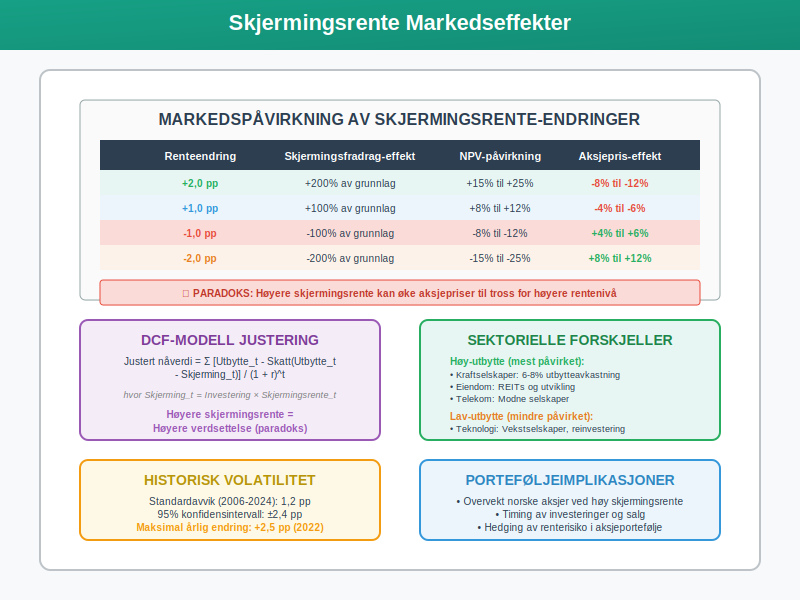

### 5.2 Sektorielle Forskjeller

**Skjermingsrentens** påvirkning varierer mellom **bransjer** og **selskapstyper**:

#### Høy-utbytte sektorer (mest påvirket):
* **Kraftselskaper:** Stabile kontantstrømmer, høye utbytter
* **[Eiendom](/blogs/regnskap/hva-er-eiendom "Hva er Eiendom? Regnskapsføring og Verdsettelse"):** REITs og utviklingsselskaper
* **Telekom:** Modne selskaper med høy utbytteavkastning
* **Finans:** Banker og forsikring med regulerte utbytter

#### Lav-utbytte sektorer (mindre påvirket):
* **Teknologi:** Vekstselskaper med lav/ingen utbytter
* **Bioteknologi:** Utviklingsstadium uten inntjening
* **[Oppstartsselskaper](/blogs/regnskap/hva-er-oppstart "Hva er Oppstartsselskap? Regnskapsføring og Finansiering"):** Reinvestering fremfor utdelinger

**Sektoranalyse:**
| **Sektor** | **Gj.snitt utbytteavkastning** | **Skjermingseffekt** | **Prissensitivitet** |
|------------|--------------------------------|----------------------|----------------------|
| Kraft | 6-8% | Høy | Høy |
| Telekom | 4-6% | Medium-høy | Medium-høy |
| Bank | 3-5% | Medium | Medium |
| Teknologi | 0-2% | Lav | Lav |

### 5.3 Institusjonelle Investorimplikasjoner

**Institusjonelle investorer** tilpasser **strategier** basert på skjermingsrente:

#### Pensjonsfondsstrategier:
* **Lange tidshorisonter:** Maksimal nytte av skjermingsoppbygging
* **Utbyttefokus:** Matching av cash flow-behov med skjermingsfradrag
* **[Diversifisering](/blogs/regnskap/hva-er-diversifisering "Hva er Diversifisering? Risikostyring og Porteføljeoptimalisering"):** Balanse mellom norske og utenlandske aksjer

#### Forsikringsselskapers tilpasning:
```
Optimal allokering = f(skjermingsrente, solvenskapitalkrav, matching av forpliktelser)
```

#### Private equity og venturekapital:
* **Holdingperioder:** Optimalisering av salgs-timing
* **Strukturering:** Maksimal utnyttelse av skjermingsfradrag
* **Exit-strategier:** Skatteeffektive realiseringsmetoder

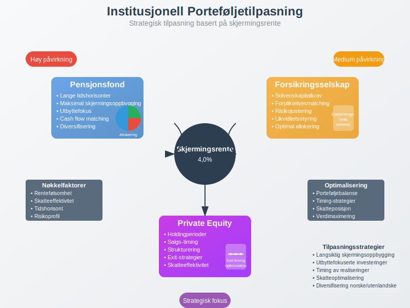

## Seksjon 6: Internasjonale Sammenligninger

### 6.1 Nordiske Systemer

**Nordiske land** har ulike tilnærminger til **aksjonærbeskatning** og risikofri rentekompensasjon:

| **Land** | **System** | **Risikofri rente** | **Sammenlignbarhet** |
|----------|------------|---------------------|----------------------|
| **Norge** | Skjermingsfradrag | 3-Ã¥rig statsrente | Direkte |
| **Sverige** | ISK-system | Statslånsränta | Begrenset |
| **Danmark** | Aktieindkomst | Obligationsrente | Indirekte |
| **Finland** | Kapitalinntekt | Ingen skjerming | Ikke sammenlignbar |

#### Norsk-svensk sammenligning:
```
Norge: Skjermingsfradrag basert på faktisk skjermingsrente
Sverige: ISK (investeringssparekonto) med fast avkastningsskatt
Resultat: Ulike incentiver for investoroppførsel
```

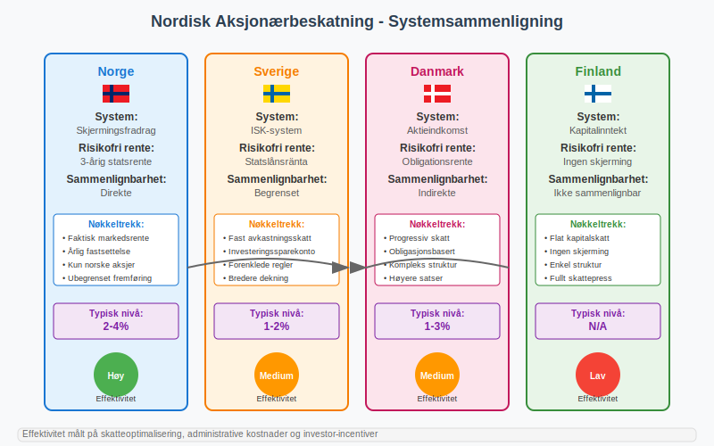

### 6.2 Europeiske Modeller

**EU-landenes** varierende systemer for aksjonærbeskatning:

#### Hovedkategorier:
* **Klassiske systemer:** Dobbeltbeskatning av utbytte
* **Integrasjonssystemer:** Delvis eller full fradrag for selskapsskatt
* **Duale systemer:** Separate satser for kapital- og arbeidsinntekt

| **Modell** | **Eksempelland** | **Risikofri kompensasjon** | **Kompleksitet** |
|------------|------------------|----------------------------|------------------|
| **Skjermingsfradrag** | Norge | Eksplisitt | Medium |
| **Notional deduction** | Belgia, Italia | Lignende prinsipp | Høy |
| **Dividend exemption** | Nederland | Ingen | Lav |
| **Credit system** | Frankrike | Indirekte | Høy |

#### CCCTB (Common Consolidated Corporate Tax Base) implikasjoner:
```
Fremtidig harmonisering kan påvirke:
- Nasjonale skjermingssystemer
- Grenseoverskridende koordinering  
- Felles referanserenter
```

### 6.3 OECD og Globale Trender

**OECD-initiativ** påvirker utformingen av skjermingsrente-systemer:

#### BEPS (Base Erosion and Profit Shifting):
* **Action 2:** Hybrid mismatch rules
* **Action 4:** Interest deduction limitation  
* **Action 11:** Data collection and analysis

#### Pillar 1 og 2 implikasjoner:
```
Global minimum tax kan påvirke:
- Nasjonale skjermingssystemer
- Effektive skattesatser
- Internasjonale investorstrømmer
```

**Fremtidige harmoniseringstrender:**
* **Automatisk informasjonsutveksling:** Skattlegging av global portefølje
* **Digital økonomi:** Nye prinsipper for beskatningsrett
* **Bærekrafts-incentiver:** ESG-integrerte skattesystemer

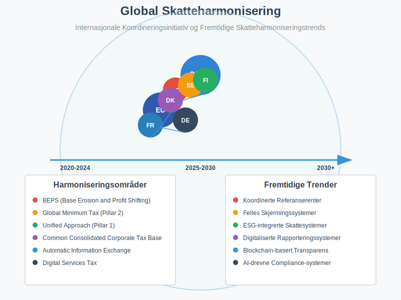

## Seksjon 7: Regnskapsmessig Behandling

### 7.1 Bokføring av Skjermingseffekter

**Regnskapsmessig erfasning** av skjermingsrente-relaterte transaksjoner følger [IFRS](/blogs/regnskap/hva-er-ifrs "Hva er IFRS? International Financial Reporting Standards") og [NGAAP](/blogs/regnskap/hva-er-ngaap "Hva er NGAAP? Norske Regnskapsstandarder") prinsipper:

#### Opptjening av skjermingsfradrag:
```
Debet: Utsatt skattefordel (skjermingsfradrag)
Kredit: Reduksjon av skattekostnad

Årlig justering basert på aktuell skjermingsrente:
Debet/Kredit: Utsatt skattefordel (justeringer)
Kredit/Debet: Skattekostnad
```

#### Verdsettelse av skattefordel:
| **Verdsettelsesparameter** | **Behandling** | **Estimat** |
|----------------------------|----------------|-------------|
| **Sannsynlighet for utnyttelse** | Konservativ tilnærming | 80-95% |
| **Tidshoriont** | Forventet realiseringsperiode | 3-10 år |
| **Diskonteringsrente** | Risikojustert avkastningskrav | Skjermingsrente + 2-4% |

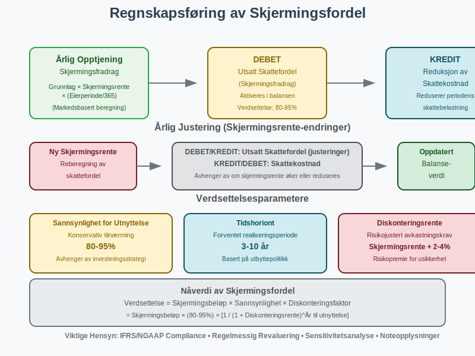

### 7.2 Noteopplysninger og Transparens

**Utvidede noteopplysninger** sikrer **transparens** om skjermingseffekter:

#### Obligatoriske notekrav:
* **Samlet skatteposisjon:** Oppbygging og anvendelse av skjermingsfradrag
* **Sensitivitetsanalyse:** PÃ¥virkning av skjermingsrente-endringer
* **Fremtidig utnyttelse:** Forventet tidsplan for realisasjon
* **Risikofaktorer:** Usikkerhet i verdsettelse

**Eksempel på notestruktur:**
```
Note X: Skatteposisjoner relatert til skjermingsfradrag

Balanse primo: X kr
Årets opptjening (basert på X% skjermingsrente): Y kr  
Ã…rets anvendelse: (Z) kr
Balanse ultimo: X kr

Sensitivitetsanalyse:
+/-1% endring i skjermingsrente: +/-A kr årlig effekt
```

### 7.3 Konsernrapportering og Konsolidering

**Konsernregnskap** krever **koordinert behandling** av skjermingseffekter:

#### Konsolideringsproblemer:
* **Elimineringer:** Intern utbytte og skjermingseffekter
* **Minority interest:** Fordeling av skattefordeler
* **Valutaomregning:** Utenlandske datterselskaper uten skjermingsfradrag

| **Konsernstruktur** | **Skjermingseffekt** | **Konsolideringsbehandling** |
|---------------------|----------------------|------------------------------|
| **Norsk mor + norske datter** | Full skjermingseffekt | Standard eliminering |
| **Norsk mor + utenlandske datter** | Begrenset til mor | Separate behandling |
| **Utenlandsk mor + norsk datter** | Kun på datternivå | Spesiell allokering |

#### Segmentrapportering:
```
Skjermingseffekter allokeres til segmenter basert på:
- Underliggende aksjeinvesteringer
- Faktisk eierskap og kontroll
- Økonomisk substans
```

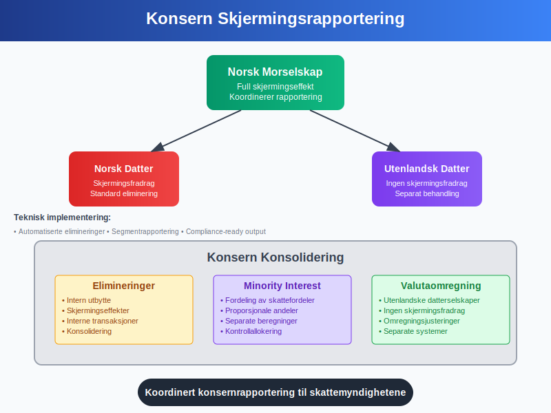

## Seksjon 8: Teknologi og Digitalisering

### 8.1 Automatiserte Beregningssystemer

**Moderne teknologi** muliggjør **automatisering** av komplekse skjermingsrente-beregninger:

#### Systemfunksjonalitet:
* **Real-time datainnhenting:** Automatisk oppdatering av skjermingsrenter
* **Porteføljesporing:** Kontinuerlig overvåkning av eierperioder
* **Scenario-modellering:** Optimalisering av utbytte- og salgs-timing
* **Compliance-automatisering:** Direkte rapportering til [Altinn](/blogs/regnskap/hva-er-altinn "Hva er Altinn? Digitale Tjenester for Næringsliv")

**Teknisk arkitektur:**
```
Data Sources → Processing Engine → Calculation Module → Reporting Interface
    ↓              ↓                  ↓                 ↓
Børsdata       Real-time          Skjermings-       Dashboard +
Rentekurver    oppdatering        beregning         Rapporter
Transaksjoner  Validering         Optimalisering    Compliance
```

#### API-integrasjoner:
| **Datakilde** | **API-type** | **Oppdateringsfrekvens** | **Anvendelse** |
|---------------|--------------|--------------------------|----------------|
| **Norges Bank** | REST | Daglig | Skjermingsrenter |
| **Oslo Børs** | WebSocket | Real-time | Aksjekurser |
| **Skatteetaten** | SOAP | Ã…rlig | Regulatory updates |

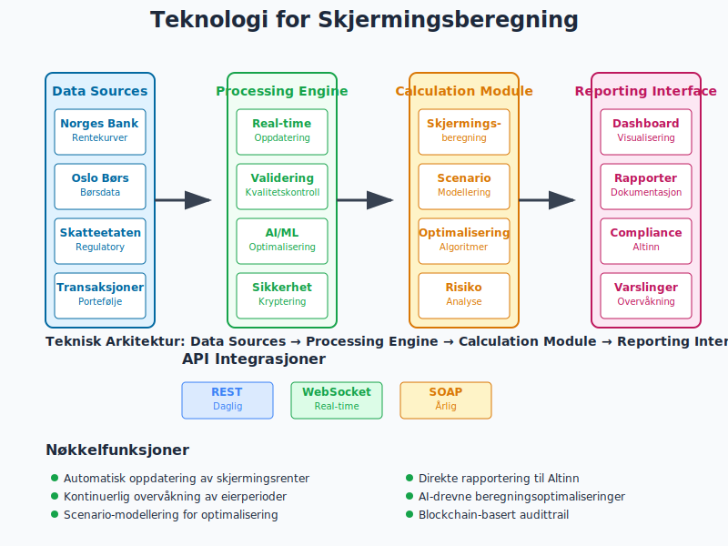

### 8.2 Blockchain og Transparent Rapportering

**Blockchain-teknologi** kan revolusjonere **transparens** og **etterprøvbarhet**:

#### Potensielle anvendelser:
* **Immutable records:** Permanent log av alle transaksjoner
* **Smart contracts:** Automatisk utførelse av skjermingsberegninger
* **Transparent audittrail:** Full sporbarhet for skattemyndigheter
* **Desentralisert validering:** Konsensus om beregningsresultater

**Implementeringsutfordringer:**
```
Tekniske: Skalbarhet, energiforbruk, integrasjon
Regulatoriske: Personvern, kontroll, ansvar
Praktiske: Kostnad, kompleksitet, brukeradopsjon
```

### 8.3 AI og Maskinlæring i Skatteoptimalisering

**Artificial Intelligence** muliggjør **sofistikert optimalisering** av skjermingsstrategier:

#### AI-applikasjoner:
* **Prediktiv modellering:** Forecasting av fremtidige skjermingsrenter
* **Portfolio optimalisering:** ML-basert allokering av investeringer
* **Pattern recognition:** Identifisering av optimale handelswindows
* **Risk management:** Automatisk risikodeteksjon og -mitigering

**Machine Learning modeller:**
| **Algoritme** | **Anvendelse** | **Nøyaktighetsnivå** |
|---------------|----------------|----------------------|
| **LSTM** | Renteprediksjon | 85-90% |
| **Random Forest** | Portfolio optimalisering | 80-85% |
| **Neural Networks** | Risk scoring | 90-95% |

#### Etiske og regulatoriske hensyn:
```
Transparency: Forklarbarhet i AI-beslutninger
Fairness: Ikke-diskriminerende algoritmer  
Accountability: Ansvar for AI-drevne beslutninger
Privacy: Beskyttelse av sensitive finansdata
```

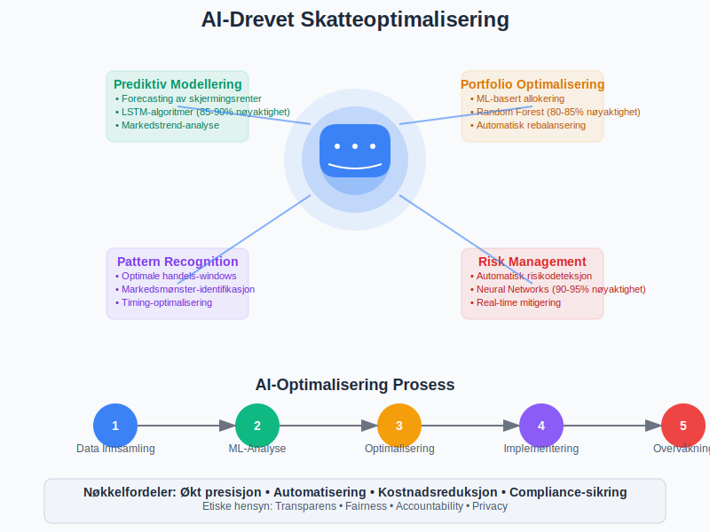

## Seksjon 9: Regulatoriske Endringer og Fremtidsutsikter

### 9.1 Pågående Reformdiskusjoner

**Norske myndigheter** vurderer **endringer** i skjermingsrente-systemet:

#### Diskuterte modifikasjoner:
* **Tidsbegrensning:** Maksimal opptjeningsperiode (f.eks. 10 år)
* **Beløpstak:** Øvre grense for akkumulert skjermingsfradrag
* **Utvidelse:** Skjerming for utenlandske aksjer (EU-compliance)
* **Forenkling:** Redusert administrativ byrde

| **Forslag** | **Forventet effekt** | **Politisk støtte** | **Implementeringsårr** |
|-------------|----------------------|---------------------|------------------------|
| **Tidsbegrensning** | Økte skatteinntekter | Medium | 2026-2027 |
| **Beløpstak** | Begrenset påvirkning | Høy | 2025-2026 |
| **EU-utvidelse** | Reduserte inntekter | Lav | Ukjent |

#### Interessentanalyse:
```
Investorer: Motstand mot begrensninger, støtte til utvidelser
Regjeringsaktører: Balanse mellom inntekter og investeringsincentiver  
EU-myndigheter: Press for non-diskriminering
Skatteeksperter: Fokus på forenkling og effektivitet
```

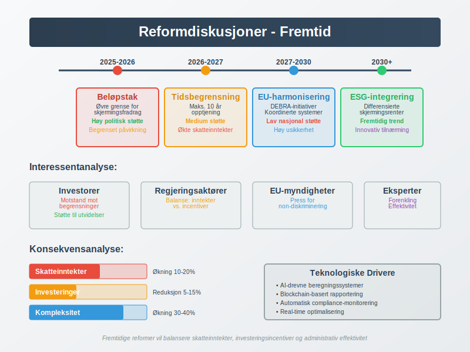

### 9.2 EU-rettslige Utfordringer

**Europeisk rett** skaper **press** for endringer i nasjonale skjermingssystemer:

#### Sentrale EU-prinsipper:
* **Fri bevegelse av kapital:** Likbehandling av grenseoverskridende investeringer
* **Statsstøtteforbudet:** Selektive skattefordeler kan være forbudte
* **Direktivharmonisering:** Koordinering av nasjonale regler

**Landmark-saker:**
| **Sak** | **Prinsipp** | **Påvirkning på skjermingsrente** |
|---------|--------------|-----------------------------------|
| **Manninen** | Non-diskriminering | Krav om utvidelse til EU-aksjer |
| **Test Claimants** | Proporsjjonalitet | Begrenset nasjonalt handlingsrom |
| **Columbus Container** | Reverse discrimination | Intern konsistens-krav |

#### Fremtidige EU-initiativer:
```
DEBRA (Debt-Equity Bias Reduction Allowance):
- Europeisk skjermingsfradrag for alle kapitalformer
- Harmoniserte beregningsmetoder
- Koordinerte referanserenter
Forventet implementering: 2025-2027
```

### 9.3 Globale Megatrender

**Makroøkonomiske trender** vil påvirke fremtidig utvikling av skjermingsrente-systemer:

#### Demografiske endringer:
* **Aldrende befolkning:** Økte pensjonskrav og sparebeho
* **Redusert arbeidsstyrke:** Behov for kapitaleffektivitet
* **Urbanisering:** Endrede investeringsmønstre

#### Klimaendringer og bærekraft:
```
Grønne skjermingsfradrag:
- Høyere skjermingsrenter for bærekraftige investeringer
- ESG-kriterier integrert i skattefordeeler
- Carbon-pricing koblet til skjermingsberegning
```

#### Digitalisering og ny økonomi:
* **Kryptovalutar:** Utfordringer for tradisjonelle skattesystemer
* **Digital assets:** Behov for nye skjermingsrente-modeller
* **Platform economy:** Endrede eierskap- og inntektsmodeller

| **Megatrend** | **Påvirkning på skjermingsrente** | **Tidshoriont** |
|---------------|-----------------------------------|-----------------|
| **Klimaendringer** | ESG-integrerte systemer | 2025-2030 |
| **Digitalisering** | Nye aktivaklasser | 2024-2026 |
| **Demografi** | Justerte spareincitamenter | 2025-2035 |

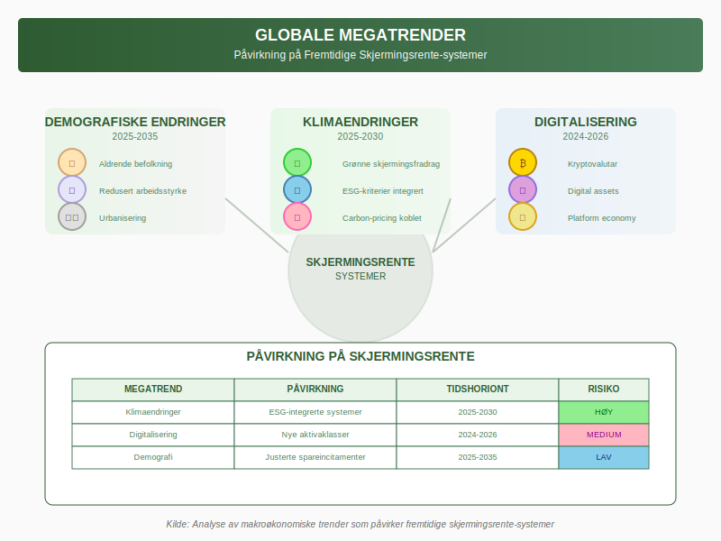

## Seksjon 10: Praktisk Implementering og Best Practices

### 10.1 Systemimplementering for Bedrifter

**Effektiv implementering** av skjermingsrente-beregninger krever **systematisk tilnærming**:

#### Implementeringsfaser:
1. **Kravspesifikasjon:** Identifisering av alle beregningsscenarier
2. **Systemdesign:** Arkitektur for datahåndtering og beregninger
3. **Utvikling:** Programmering av beregningslogikk
4. **Testing:** Validering mot kjente eksempler
5. **Produksjonssetting:** Rollout med monitorering

**Tekniske krav:**
| **Komponent** | **Spesifikasjon** | **Kritikalitet** |
|---------------|-------------------|------------------|
| **Database** | Real-time transaksjonslog | Høy |
| **Beregningsmotor** | Daglig skjermings-update | Høy |
| **API-integrasjon** | Automatisk rente-oppdatering | Medium |
| **Rapportering** | Compliance-ready output | Høy |

#### Kvalitetssikring:
```
Test scenarios:
- Grunnleggende beregninger med kjente resultater
- Edge cases: Skuddår, helger, børsferier
- Historiske data: Validering mot tidligere perioder
- Stress testing: Store porteføljer og komplekse strukturer
```

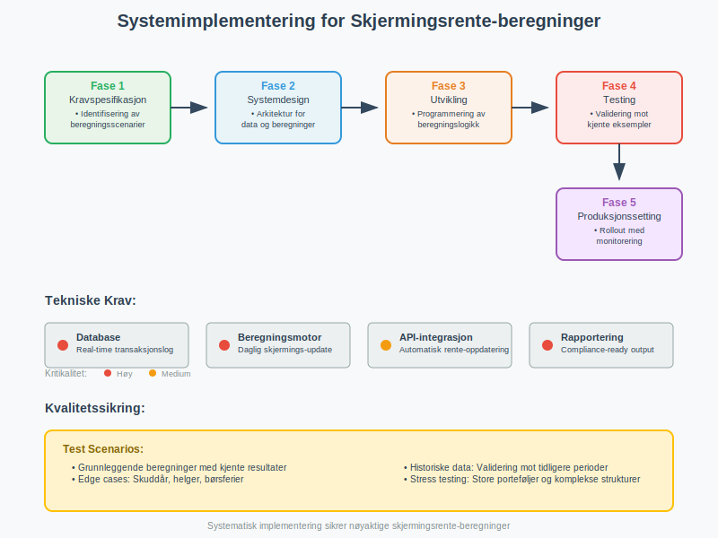

### 10.2 Organisatoriske Prosesser

**Organisatorisk implementering** krever **klare roller** og **ansvar**:

#### Roller og ansvar:
* **CFO:** Overordnet ansvar for skatteoptimalisering
* **Tax Manager:** Daglig oppfølging av skjermingsberegninger
* **Controller:** Periodisk kvalitetskontroll og rapportering
* **IT-ansvarlig:** Systemdrift og vedlikehold

**Prosessbeskrivelse:**
```
MÃ¥nedlig syklus:
Dag 1-5: Datainsamling og validering
Dag 6-10: Beregninger og kontroller
Dag 11-15: Rapportering og arkivering
Dag 16-30: Strategisk planlegging og optimalisering

Ã…rlig syklus:
Q4: Oppdatering av skjermingsrenter for neste år
Q1: Revisorbekreftelse av foregående års beregninger
Q2: Strategisk review av skatteposisjoner
Q3: Systemoppdateringer og forbedringer
```

#### Kontrollmiljø:
| **Kontrollaktivitet** | **Frekvens** | **Ansvarlig** | **Dokumentasjon** |
|----------------------|--------------|---------------|-------------------|
| **MÃ¥nedlig avstemming** | MÃ¥nedlig | Controller | Avstemmingsrapport |
| **Kvartalsvis review** | Kvartalsvis | Tax Manager | Review-notat |
| **Ã…rlig revisjon** | Ã…rlig | Ekstern revisor | Revisjonsrapport |

### 10.3 Compliance og Dokumentasjon

**Regulatorisk compliance** krever **omfattende dokumentasjon**:

#### Dokumentasjonsmatrise:
* **Transaksjonsdata:** Kjøps-/salgsnotaer, corporate actions
* **Beregningsdokumentasjon:** Metodikk, antakelser, verifikasjoner
* **Kontrolldokumentasjon:** Reviewprosesser, godkjenninger
* **Rapporteringsdokumentasjon:** Skatterapporter, noteopplysninger

**Oppbevaringskrav:**
```
Skatteloven § 10-12: Minimum 10 år
Bokføringsloven: 5 år for transaksjonsdata
Best practice: Permanent digital arkiv
```

#### Audit trail requirements:
| **Dokumenttype** | **Oppbevaringsperiode** | **Tilgangsrettigheter** | **Backup-krav** |
|------------------|-------------------------|-------------------------|-----------------|
| **Transaksjonslog** | 10 år | Tax team + revisorer | Daglig |
| **Beregningsark** | 10 år | Tax Manager + CFO | Ukentlig |
| **Kontrollnotater** | 5 år | Controller + revisor | Månedlig |

#### Digital arkivering:
```
Blockchain-basert lagring:
- Immutable transaction records
- Cryptographic proof of authenticity  
- Decentralized backup and verification
- Smart contract-triggered archiving
```

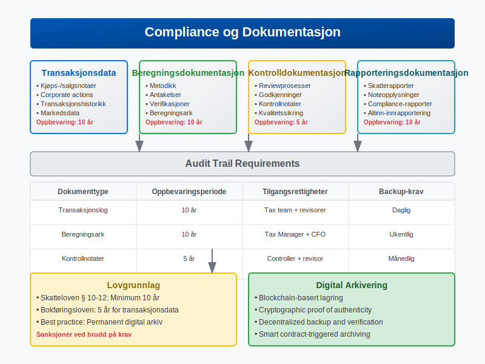

## Seksjon 11: Risikoanalyse og Sensitivitet

### 11.1 Rentefølsomhetsanalyse

**Skjermingsrente-endringer** skaper **betydelig følsomhet** i skatteposisjoner og verdsettelser:

#### Sensitivitetsmatrise:
| **Skjermingsrente-endring** | **Årlig skjermingsfradrag-effekt** | **NPV-påvirkning (10 år)** | **Aksjepris-sensitivitet** |
|-----------------------------|------------------------------------|-----------------------------|----------------------------|
| **+2,0 prosentpoeng** | +200% av grunnlag | +15% til +25% | -8% til -12% |
| **+1,0 prosentpoeng** | +100% av grunnlag | +8% til +12% | -4% til -6% |
| **-1,0 prosentpoeng** | -100% av grunnlag | -8% til -12% | +4% til +6% |
| **-2,0 prosentpoeng** | -200% av grunnlag | -15% til -25% | +8% til +12% |

**Historisk volatilitet:**
```
Skjermingsrente standardavvik (2006-2024): 1,2 prosentpoeng
95% konfidensintervall: ±2,4 prosentpoeng
Maksimal årlig endring: +2,5 prosentpoeng (2022)
```

#### Scenario-analyse:
```
Basecase (4,0%): Current market expectation
Bullcase (2,0%): Low inflation scenario  
Bearcase (6,0%): High inflation scenario
Stress test (8,0%): Crisis scenario
```

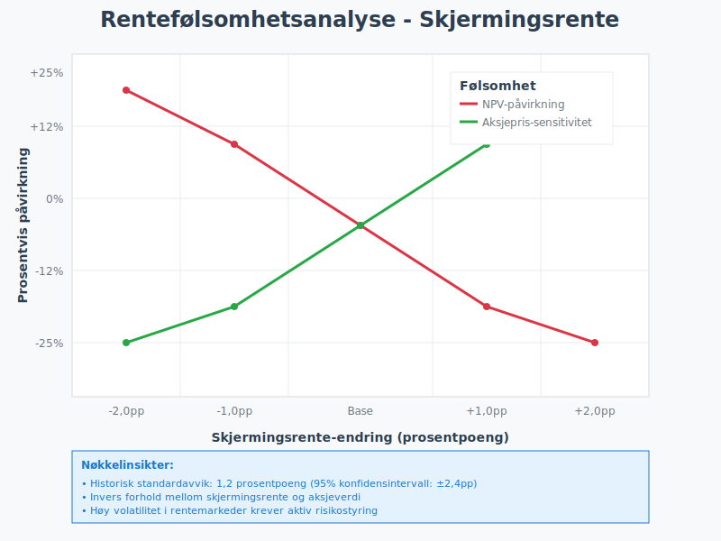

### 11.2 Politisk og Regulatorisk Risiko

**Endringer i skattelovgivning** representerer **betydelig regulatorisk risiko**:

#### Risikokategorier:
* **Prospektive endringer:** PÃ¥virker fremtidige transaksjoner
* **Retroaktive endringer:** PÃ¥virker eksisterende posisjoner
* **Tekniske justeringer:** Beregningsmetodikk og implementering
* **Systemiske reformer:** Fullstendig omlegging av modellen

| **Risikotype** | **Sannsynlighet** | **Potensiell påvirkning** | **Mitigering** |
|----------------|-------------------|---------------------------|----------------|
| **Tidsbegrensning** | 60% | Medium negativ | Fremskyndet realisering |
| **Beløpstak** | 40% | Lav negativ | Diversifisering |
| **EU-harmonisering** | 30% | Høy usikkerhet | Fleksible strukturer |
| **Modellskifte** | 10% | Svært høy negativ | Forsikring/hedging |

#### Politisk risikomonitorering:
```
Key indicators:
- Regjeringsuttalelser om skattereform
- Parliamentary tax committee meetings  
- EU court decisions affecting Norway
- OECD policy recommendations
```

### 11.3 Implementeringsrisiko

**Tekniske og operasjonelle risikoer** ved implementering av skjermingsrente-systemer:

#### Hovedrisikokategorier:
* **Datarisiko:** Feil eller manglende transaksjonsdata
* **Beregningsrisiko:** Feil i algoritmer eller implementering
* **Rapporteringsrisiko:** Manglende eller feil rapportering
* **Compliance-risiko:** Brudd på regulatoriske krav

**Risikomatriks:**
| **Risiko** | **Sannsynlighet** | **Konsekvens** | **Risikoscore** | **Mitigering** |
|------------|-------------------|----------------|-----------------|----------------|
| **Data corruption** | Lav | Høy | Medium | Backup + validation |
| **Calculation errors** | Medium | Høy | Høy | Dual control + testing |
| **Reporting failures** | Lav | Medium | Lav | Automated checks |
| **Regulatory changes** | Medium | Høy | Høy | Monitoring + flexibility |

#### Operasjonelle kontroller:
```
Daily: Automated data validation and backup
Weekly: Calculation verification and exception reporting  
Monthly: Comprehensive reconciliation and accuracy testing
Quarterly: Full system audit and compliance review
Annually: External validation and regulatory update
```

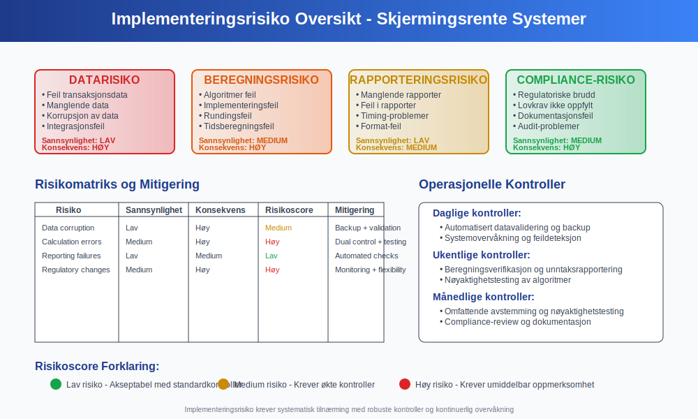

## Seksjon 12: Fremtidige Utviklingsmuligheter

### 12.1 ESG-integrerte Skjermingssystemer

**Bærekraftshensyn** kan integreres i fremtidige skjermingsrente-systemer:

#### ESG-baserte differensieringer:
* **Grønne investeringer:** Høyere skjermingsrenter for miljøvennlige prosjekter
* **Social impact:** Bonusrenter for samfunnsansvarlige investeringer
* **Governance-kvalitet:** Premium for selskaper med god selskapsstyring

**Implementeringsmodell:**
```
Modifisert skjermingsrente = Base skjermingsrente × (1 + ESG-faktor)

ESG-faktor beregning:
E-score: Environmental performance (0-30%)
S-score: Social responsibility (0-20%)  
G-score: Governance quality (0-20%)
Total ESG-bonus: 0% til 70% over base rate
```

#### MÃ¥lings- og verifikasjonsutfordringer:
| **ESG-komponent** | **MÃ¥leproblemer** | **Verifikasjonsmetoder** | **Oppdateringsfrekvens** |
|-------------------|-------------------|-------------------------|--------------------------|
| **Environment** | Scope 1-3 utslipp | Third-party certification | Ã…rlig |
| **Social** | Social impact metrics | Stakeholder surveys | Ã…rlig |
| **Governance** | Board composition | Public disclosures | Kvartalsvis |

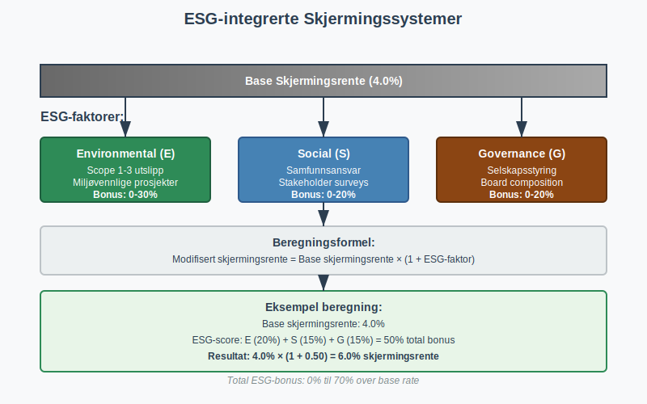

### 12.2 Teknologidrevne Innovasjoner

**Emerging technologies** vil transformere skjermingsrente-beregning og -optimalisering:

#### AI/ML-drevne optimaliseringer:
* **Predictive analytics:** Forecasting av optimale handels-windows
* **Portfolio rebalancing:** Automatisk optimalisering basert på skjermingseffekter
* **Risk management:** Real-time risikomonitoring og -mitigering
* **Regulatory compliance:** Automatisk tilpasning til regelverksendringer

**Blockchain-infrastruktur:**
```
Smart contract applications:
- Automatic tax calculation and reporting
- Transparent audit trails for regulators
- Decentralized validation of calculations  
- Cross-border tax coordination
```

#### Quantum computing applikasjoner:
| **Anvendelse** | **Beregningskompleksitet** | **Tidshoriont** | **Potensial** |
|----------------|----------------------------|-----------------|---------------|
| **Portfolio optimization** | Eksponentiell | 2027-2030 | Revolusjonerende |
| **Risk simulation** | Polynomisk | 2025-2027 | Betydelig |
| **Regulatory modeling** | Lineær | 2024-2025 | Moderate |

### 12.3 Globaliserte Skattekoordinering

**Internasjonale koordineringsinitiativ** vil påvirke fremtidige skjermingssystemer:

#### OECD Pillar 1 og 2 implikasjoner:
* **Global minimum tax:** Koordinering av nasjonale skjermingssystemer
* **Unified approach:** Harmoniserte prinsipper for risikofri kompensasjon
* **Digital services tax:** Nye aktivaklasser for skjermingsberegning

**Multilateral koordinering:**
```
Global Tax Coordination Framework:
- Harmonized risk-free rates across jurisdictions
- Automated information exchange on tax positions  
- Coordinated anti-avoidance measures
- Standardized calculation methodologies
```

#### Utviklingsscenarier:
| **Scenario** | **Sannsynlighet** | **Norge-påvirkning** | **Implementeringstidslinje** |
|--------------|-------------------|----------------------|------------------------------|
| **EU-harmonisering** | 70% | Høy | 2025-2028 |
| **Global standardisering** | 40% | Medium | 2028-2032 |
| **Bilateral avtaler** | 60% | Lav | 2024-2026 |

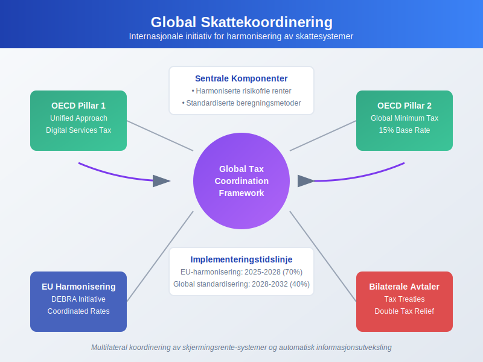

## Konklusjon

**Skjermingsrenten** står som en **sentral komponent** i det norske skattesystemets behandling av kapitalinntekter, og representerer en sofistikert løsning på fundamental utfordringen med å sikre nøytralitet mellom ulike investeringsformer. Som **referanserente for normalavkastning** påvirker skjermingsrenten ikke bare individuelle skatteberegninger, men også markedsdynamikk, investeringsstrategier og konkurranseevnen til norske aksjer.

**Nøkkelinnsikter og hovedfunn:**

* **Teoretisk eleganse:** Skjermingsrenten operasjonaliserer finansteoretiske prinsipper om risikofri avkastning i praktisk skattehåndtering
* **Markedspåvirkning:** Årlige endringer i skjermingsrenten har dokumentert effekt på aksjevurderinger og porteføljeallokering
* **Administrativ kompleksitet:** Beregninger krever sofistikerte systemer for å håndtere tidsvekting, selskapshandlinger og komplekse eierskap-strukturer
* **Strategisk verdi:** Betydelig potensial for skatteoptimalisering gjennom bevisst timing og strukturering av investeringsbeslutninger

**Regnskapsmessige og strategiske implikasjoner:**

For **regnskapsführere og finanseksperter** er forståelse av skjermingsrenten kritisk på flere nivåer:

- **Verdsettelse:** Korrekt erfasning av [utsatte skattefordeler](/blogs/regnskap/hva-er-utsatt-skatt "Hva er Utsatt Skatt? Beregning og Regnskapsføring") knyttet til skjermingsfradrag
- **Strategisk rådgivning:** Optimalisering av [utbyttepolitikk](/blogs/regnskap/hva-er-utbytte "Hva er Utbytte? Regnskapsføring og Skattemessige Konsekvenser") og timing av aksjetransaksjoner
- **Compliance-sikring:** Robuste systemer for beregning, dokumentasjon og rapportering
- **Risikostyring:** Sensitivitetsanalyse og scenario-planlegging for rente-endringer

**Fremtidsperspektiver og utviklingstrekk:**

Skjermingsrenten vil sannsynligvis gjennomgå betydelige endringer i kommende år, drevet av:

- **Teknologisk innovasjon:** AI-drevne beregningssystemer og blockchain-basert rapportering vil øke presisjonen og redusere administrative kostnader
- **Regulatorisk harmonisering:** EU-initiativer og OECD-koordinering kan skape press for internasjonale standarder og koordinerte referanserenter
- **Bærekraftsintegrasjon:** ESG-kriterier kan introdusere differensierte skjermingsrenter basert på miljø- og samfunnsansvar
- **Markedsdynamikk:** Volatilitet i rentemarkeder og endrede inflasjonsmønstre vil påvirke stabiliteten og forutsigbarheten i skjermingsrenten

**Praktiske anbefalinger:**

For organisasjoner som ønsker å maksimere verdien av sitt skattesystem gjennom optimal utnyttelse av skjermingsrente-mekanismen:

1. **Investér i teknologi:** Implementer automatiserte systemer for kontinuerlig overvåkning og optimalisering
2. **Utvikle kompetanse:** Sikre at finansteam har dybde-forståelse av komplekse beregningsscenarier
3. **Strategisk integrering:** Inkluder skjermingseffekter i alle investerings- og finansieringsbeslutninger
4. **Risikoplanlegging:** Etabler robuste systemer for å håndtere regulatoriske endringer og markedsvolatilitet
5. **Transparens:** Sikre optimal noteopplysninger og kommunikasjon med interessenter om skatteposisjoner

Ved å forstå og effektivt utnytte skjermingsrenten som et strategisk verktøy, kan bedrifter og investorer ikke bare minimere sin skattebyrde, men også bidra til et mer effektivt og transparent skattesystem som støtter langsiktig økonomisk vekst og kapitalallokering. Skjermingsrenten vil fortsette å være en hjørnestein i norsk [skatteplanlegging](/blogs/regnskap/hva-er-skatteplanlegging "Hva er Skatteplanlegging? Optimalisering av Skatteposisjon"), og profesjonell mestring av dens kompleksiteter vil forbli en kritisk konkurransefordel i det norske markedet.  

For en helhetlig gjennomgang av aksjonærbeskatning, se [Aksjonærmodellen](/blogs/regnskap/aksjonaermodellen-guide "Aksjonærmodellen - Komplett Guide til Norsk Aksjebeskatning").


