---
title: "Hva er Stiftelse?"
seoTitle: "Hva er Stiftelse?"
description: '**Stiftelse** er en juridisk selvstendig organisasjonsform som etableres for å fremme bestemte formål av allmennyttig, vitenskapelig, kulturell eller veldedig...'
summary: "Stiftelse er en selveiende juridisk person uten eiere, opprettet for et formål, med særlige regler for kapital, regnskap, skatt og styring."
---

**Stiftelse** er en juridisk selvstendig organisasjonsform som etableres for å fremme bestemte formål av allmennyttig, vitenskapelig, kulturell eller veldedig karakter. I regnskapssammenheng utgjør stiftelser en særegen kategori med spesifikke regler for [regnskapsføring](/blogs/regnskap/hva-er-bokforing "Hva er Bokføring? Grunnleggende Prinsipper for Regnskapsføring"), [eiendelsstyring](/blogs/regnskap/hva-er-eiendeler "Hva er Eiendeler? Komplett Oversikt over Eiendelstyper") og [økonomisk rapportering](/blogs/regnskap/hva-er-arsrapport "Hva er Årsrapport? Komplett Guide til Årsrapportering"). For norske stiftelser gjelder særlige bestemmelser som påvirker hvordan [egenkapital](/blogs/regnskap/hva-er-egenkapital "Hva er Egenkapital? Komplett Guide til Egenkapital i Regnskap") forvaltes, [skatter](/blogs/regnskap/hva-er-skatt "Hva er Skatt? Regnskapsføring og Skatteplanlegging") håndteres og [kontroll](/blogs/regnskap/hva-er-internkontroll "Hva er Internkontroll? Systemer for Risikostyring og Compliance") utøves.

## Seksjon 1: Stiftelsens Juridiske Grunnlag

### 1.1 Definisjon og Karakteristika

**Stiftelse** er en juridisk person uten eiere, opprettet ved at en eller flere stiftere overfører [eiendeler](/blogs/regnskap/hva-er-eiendeler "Hva er Eiendeler? Komplett Oversikt over Eiendelstyper") til et selveiende fond med et spesifikt formål.

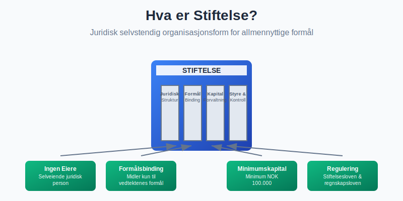

#### Kjennetegn ved Stiftelser
* **Juridisk selvstendighet:** Egen rettssubjektivitet adskilt fra stifterne
* **Formålsbinding:** Virksomheten må være i tråd med vedtektenes formål
* **Ingen eiere:** Ingen personer har eiendomsrett til stiftelsens [kapital](/blogs/regnskap/hva-er-kapital "Hva er Kapital? Komplett Guide til Kapitalformer og Kapitalforvaltning")
* **Varig karakter:** Normalt opprettet for ubegrenset tid

### 1.2 Regulatorisk Rammeverk

**Stiftelsesloven** (lov om stiftelser av 15. juni 2001 nr. 59) regulerer norske stiftelser:

| **Bestemmelse** | **Krav** | **Regnskapsmessig Konsekvens** |
|----------------|----------|------------------------------|
| Minimumskapital | NOK 100.000 | Minimum [grunnkapital](/blogs/regnskap/hva-er-aksjekapital "Hva er Aksjekapital? Betydning og Regnskapsføring") |
| Vedtekter | Skriftlige og registrerte | Formålsbinding av midlene |
| Styre | Minimum 3 medlemmer | [Styringsansvar](/blogs/regnskap/hva-er-styring "Hva er Styring? Corporate Governance og Ledelsessystemer") |
| Revisor | For store stiftelser | [Revisjonspliktige](/blogs/regnskap/hva-er-revisjon "Hva er Revisjon? Revisorens Rolle og Revisjonsberetning") enheter |
| Stiftelsesgebyr | NOK 7 571 (digital) / 10 180 (papir) | Kostnad ved registrering av stiftelse i Brønnøysundregistrene. Se [Stiftelsesgebyr](/blogs/regnskap/stiftelsesgebyr "Stiftelsesgebyr: Kostnad ved registrering av stiftelse") |

### 1.3 Stiftelsestyper

#### Allmennyttige Stiftelser
* **Formål:** Samfunnsgagn og allmenne interesser
* **Skattefordeler:** Fritak for [skatteplikt](/blogs/regnskap/hva-er-skatt "Hva er Skatt? Regnskapsføring og Skatteplanlegging") ved oppfyllelse av vilkår
* **Eksempler:** Helseforskningsstiftelser, kulturstiftelser

#### Private Stiftelser
* **Formål:** Mer avgrenset målgruppe eller spesielle interesser
* **Skattebehandling:** Ordinær skatteplikt for næringsinntekt
* **Eksempler:** Familiestiftelser, utdannelsesstiftelser

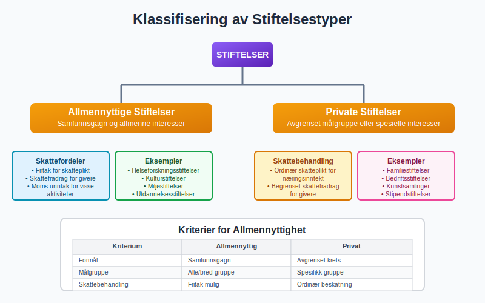

## Seksjon 2: Regnskapsregler for Stiftelser

### 2.1 Regnskapslovens Anvendelse

**Stiftelser** omfattes av [regnskapsloven](/blogs/regnskap/hva-er-regnskap "Hva er Regnskap? Grunnleggende Prinsipper og Regnskapsføring") med særlige tilpasninger:

#### Regnskapsplikt
```
Stiftelser med:
- Ordinær regnskapsplikt: Omsetning > NOK 5 mill eller 
  balansesum > NOK 20 mill
- Forenklet regnskapsplikt: Under disse terskelverdiene
- Unntaksbestemmelser: Spesielle regler for enkelte stiftelsestyper
```

### 2.2 Særlige Regnskapsprinsipper

#### Formålsbunden Kapital
**Stiftelseskapitalen** kan ikke fritt disponeres:

* **Grunnkapital:** Det opprinnelige stiftelseskapitalet
* **Formålsbundne midler:** Øremerkede [fond](/blogs/regnskap/hva-er-fond "Hva er Fond? Ulike Typer Fond og Regnskapsbehandling") og gaver
* **Frie midler:** Kan brukes innenfor stiftelsens formål

#### Balansepresentasjon
| **Egenkapitalpost** | **Beskrivelse** | **Disponibilitet** |
|--------------------|-----------------|-------------------|
| Grunnkapital | Opprinnelig stiftelseskapital | Bundet |
| Annen bunden egenkapital | Øremerkede midler | Formålsbundet |
| Fri egenkapital | Opptjente midler | Formålsinnenfor |

### 2.3 Regnskapsføring av Donasjoner og Gaver

**Donasjoner** behandles forskjellig avhengig av karakter:

#### Regnskapsføring ved Mottak
```
Ubetinget donasjon:
Debet: Bank/Kontanter          NOK 500.000
Kredit: Donasjonsinntekt           NOK 500.000

Betinget donasjon:
Debet: Bank/Kontanter          NOK 500.000
Kredit: Utsatt inntekt             NOK 500.000
```

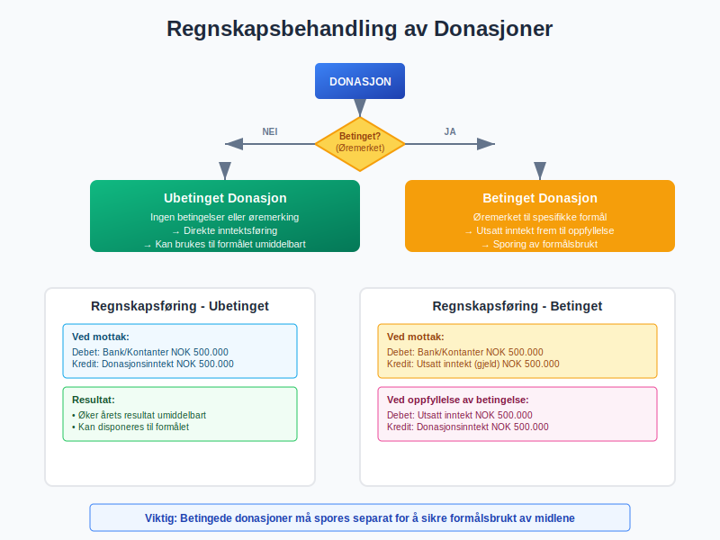

## Seksjon 3: Økonomisk Styring og Rapportering

### 3.1 Budsjett og Økonomisk Planlegging

**Stiftelser** må ha systematisk [budsjett](/blogs/regnskap/hva-er-budsjett "Hva er Budsjett? Planlegging og Styring av Bedriftens Økonomi")-ering og økonomisk planlegging:

#### Budsjettkomponenter
* **Driftsinntekter:** Donasjoner, tilskudd, [avkastning](/blogs/regnskap/hva-er-avkastning "Hva er Avkastning? Måling og Analyse av Investeringsresultater")
* **Driftskostnader:** Administrasjon, formålsretta aktiviteter
* **Investeringsbudsjett:** [Anleggsinvesteringer](/blogs/regnskap/hva-er-anleggsmidler "Hva er Anleggsmidler? Komplett Guide til Faste Eiendeler") og finansinvesteringer

### 3.2 Performance Measurement

#### Nøkkeltall for Stiftelser
| **Indikator** | **Formel** | **Tolkning** |
|--------------|-----------|-------------|
| Administrasjonsgrad | Administrasjonskostnader / Totale kostnader | Kostnadseffektivitet |
| Formålsandel | Formålskostnader / Totale kostnader | Måloppnåelse |
| [Soliditet](/blogs/regnskap/hva-er-soliditet "Hva er Soliditet? Beregning og Betydning for Bedriftens Stabilitet") | [Egenkapital](/blogs/regnskap/hva-er-egenkapital "Hva er Egenkapital? Komplett Guide til Egenkapital i Regnskap") / Sum [eiendeler](/blogs/regnskap/hva-er-eiendeler "Hva er Eiendeler? Komplett Oversikt over Eiendelstyper") | Finansiell stabilitet |

### 3.3 Rapporteringsstandard

**Stiftelser** må ofte rapportere til ulike interessenter:

#### Interne Rapporter
* **Styreportrapper:** Månedlig/kvartalsvis økonomisk status
* **Formålsrapporter:** Oppfølging av målsettinger
* **Risikostyring:** Identifisering og håndtering av risikoer

#### Eksterne Rapporter
* **[Årsrapport](/blogs/regnskap/hva-er-arsrapport "Hva er Årsrapport? Komplett Guide til Årsrapportering"):** Lovpålagt for større stiftelser
* **Tilskuddsrapporter:** Til offentlige tilskuddsgivere
* **Donorrapporter:** Til private givere

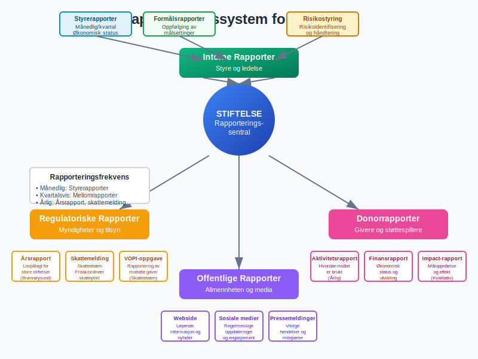

## Seksjon 4: Kapitalforvaltning og Investeringer

### 4.1 Investeringsstrategi

**Stiftelser** må forvalte [kapital](/blogs/regnskap/hva-er-kapital "Hva er Kapital? Komplett Guide til Kapitalformer og Kapitalforvaltning") i tråd med sitt formål:

#### Investeringsprinsipper
* **Risikospredning:** Diversifisert portefølje for å redusere risiko
* **Likviditetsstyring:** Balanse mellom [avkastning](/blogs/regnskap/hva-er-avkastning "Hva er Avkastning? Måling og Analyse av Investeringsresultater") og [likviditet](/blogs/regnskap/hva-er-likviditet "Hva er Likviditet? Måling og Styring av Bedriftens Likviditet")
* **Formålstilpasning:** Investeringer må være forenlige med stiftelsens verdier

#### Tillatte Investeringsformer
| **Investeringstype** | **Risiko** | **Regulering** | **Regnskapsbehandling** |
|--------------------|-----------|--------------|----------------------|
| Bankinnskudd | Lav | Innskuddsgaranti | [Finansielle eiendeler](/blogs/regnskap/hva-er-finansielle-eiendeler "Hva er Finansielle Eiendeler? Regnskapsføring og Verdivurdering") |
| Statsobligasjoner | Lav-middels | Regulerte markeder | Virkelig verdi eller kost |
| Aksjeinvesteringer | Middels-høy | Markedsregulering | Markedsverdi |
| Eiendom | Middels | Særskilte regler | [Anleggsmidler](/blogs/regnskap/hva-er-anleggsmidler "Hva er Anleggsmidler? Komplett Guide til Faste Eiendeler") |

### 4.2 Regnskapsføring av Investeringer

#### Finansielle Investeringer
```
Kjøp av aksjer:
Debet: Aksjer og andeler      NOK 1.000.000
Kredit: Bank                      NOK 1.000.000

Verdiendring (oppgang):
Debet: Aksjer og andeler      NOK 100.000
Kredit: Gevinst finansielle poster   NOK 100.000
```

### 4.3 Avkastning og Reinvestering

**Avkastningsstrategier** må balansere nåværende og fremtidige behov:

#### Utdelingsregler
* **Maksimal utdeling:** Vanligvis 4-5% av gjennomsnittlig [kapital](/blogs/regnskap/hva-er-kapital "Hva er Kapital? Komplett Guide til Kapitalformer og Kapitalforvaltning")
* **Kapitalvern:** Sikre realverdien av grunnkapitalen
* **Formålsfinansiering:** Finansiere stiftelsens aktiviteter

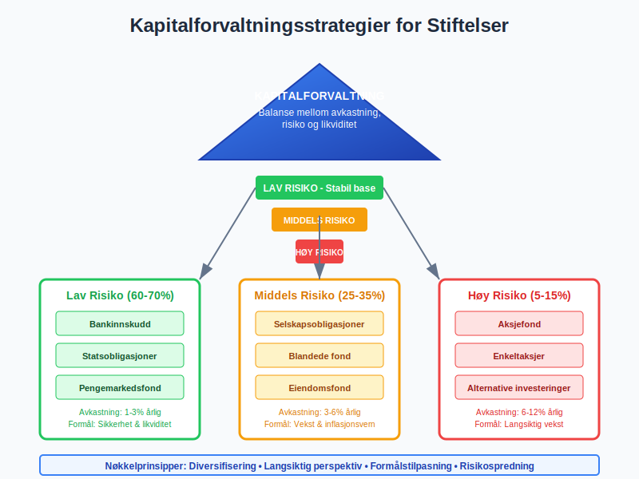

## Seksjon 5: Skattemessige Forhold

### 5.1 Skatteplikt for Stiftelser

**Skattemessig behandling** avhenger av stiftelsens status og aktiviteter:

#### Allmennyttige Stiftelser
* **Skattefritak:** For allmennyttig virksomhet
* **Vilkår:** Må oppfylle spesifikke kriterier
* **Dokumentasjon:** Krav til rapportering og etterlevelse

#### Næringsdrivende Stiftelser
* **Ordinær skatteplikt:** 22% [selskapsskatt](/blogs/regnskap/hva-er-skatt "Hva er Skatt? Regnskapsføring og Skatteplanlegging")
* **Fradragsrett:** For kostnader knyttet til næring
* **[Moms](/blogs/regnskap/hva-er-moms "Hva er Moms? Merverdiavgift og MVA-håndtering")-registrering:** Ved omsetning over terskelverdier

### 5.2 Skattefradrag for Givere

**Donorer** kan få [skattefradrag](/blogs/regnskap/skattefradrag-gaver-veldedige-organisasjoner "Skattefradrag for Gaver til Veldedige Organisasjoner") for gaver:

#### Betingelser for Fradrag
* **Godkjente mottakere:** Stiftelser med skattefritaksstatus
* **Minimumsbeløp:** NOK 500 per gave
* **Maksimumsbeløp:** Begrenset til en andel av inntekten
* **Dokumentasjon:** Kvittering og spesifikk rapportering

### 5.3 Rapportering til Skattemyndighetene

#### Årlige Rapporter
* **[Skattemelding](/blogs/regnskap/skattemelding "Skattemelding - Komplett Guide til Utfylling og Levering"):** For skattepliktige stiftelser
* **Oppgave til VOPI:** Rapportering av mottatte gaver
* **Særoppgaver:** Spesielle rapporteringskrav

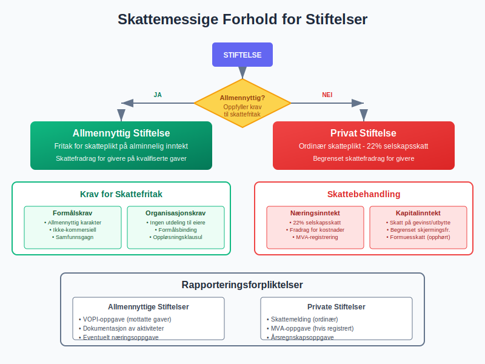

## Seksjon 6: Styring og Kontroll

### 6.1 Stiftelsesstyring

**Effective governance** er kritisk for stiftelsers legitimitet:

#### Styrets Ansvar
* **Strategisk ledelse:** Langsiktig planlegging og målsetting
* **Økonomisk kontroll:** Overvåking av økonomisk utvikling
* **Compliance:** Sikre etterlevelse av lover og vedtekter
* **Rapportering:** Ansvar for [årsrapport](/blogs/regnskap/hva-er-arsrapport "Hva er Årsrapport? Komplett Guide til Årsrapportering") og regnskaper

#### Styresammensetning
| **Rolle** | **Ansvar** | **Kompetansekrav** |
|-----------|-----------|-------------------|
| Styreleder | Overordnet ansvar og koordinering | Ledelseserfaring |
| Økonomiansvarlig | Økonomisk oppfølging | Regnskaps-/økonomikompetanse |
| Fagrepresentant | Formålsrelatert ekspertise | Relevant fagbakgrunn |

### 6.2 Internkontroll og Risikostyring

**[Internkontroll](/blogs/regnskap/hva-er-internkontroll "Hva er Internkontroll? Systemer for Risikostyring og Compliance")** sikrer effektiv drift og rapportering:

#### Kontrollområder
* **Finansiell rapportering:** Sikre korrekt [regnskapsføring](/blogs/regnskap/hva-er-bokforing "Hva er Bokføring? Grunnleggende Prinsipper for Regnskapsføring")
* **Formålsbrukt:** Kontroll med at midler brukes i tråd med vedtektene
* **Interessekonflikter:** Håndtering av potensielle konflikter
* **Datavarestyringsansvar:** Beskyttelse av sensitive data

### 6.3 Revisjonsordninger

#### Revisjonsplikt
**Store stiftelser** er omfattet av revisjonsplikt:

* **Terskelverdier:** Balancesum > NOK 20 mill eller inntekt > NOK 5 mill
* **Revisortyper:** Statsautorisert eller registrert revisor
* **Revisjonsstandard:** ISA (International Standards on Auditing)

#### Interne Revisjonsytelser
* **Prosessrevisjon:** Vurdering av internkontrollsystemer
* **Compliancegjennomgang:** Sikre etterlevelse av regelwerk
* **Formålsrevisjon:** Evaluering av måloppnåelse

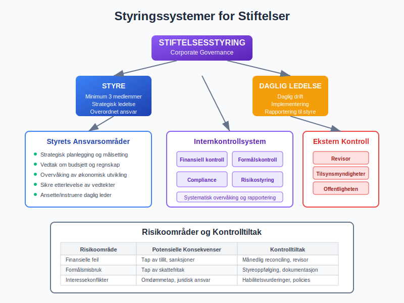

## Seksjon 7: Etablering og Opprettelse

### 7.1 Opprettelsesprosess

**Etablering** av stiftelse følger en systematisk prosess:

#### Forberedende Fase
1. **Formålsdefinisjon:** Klar beskrivelse av stiftelsens formål
2. **Vedtektsutkast:** Utarbeiding av grunnleggende regelverk
3. **Kapitalinnsamling:** Sikre minimum NOK 100.000 i grunnkapital
4. **Styrerekruttering:** Identifisering og rekruttering av styremedlemmer

#### Juridisk Etablering
* **Stifterdokument:** Formell erklæring fra stifterne
* **Vedtekter:** Detaljerte regler for drift og styring
* **Registrering:** Innmelding til Brønnøysundregistrene
* **Skatteregistrering:** Søknad om skattefritaksstatus

### 7.2 Innledende Regnskapsoppsett

#### Første Regnskapsoppgjør
```
Etablering med grunnkapital:
Debet: Bank                    NOK 100.000
Kredit: Grunnkapital               NOK 100.000

Opprettelseskostnader:
Debet: Opprettelseskostnader   NOK 25.000
Kredit: Bank                       NOK 25.000
```

### 7.3 Operasjonell Oppstart

#### Etablering av Systemer
* **Regnskapsystem:** Implementering av passende [regnskapssystem](/blogs/regnskap/hva-er-bokforing "Hva er Bokføring? Grunnleggende Prinsipper for Regnskapsføring")
* **Bankforbindelser:** Opprettelse av stiftelseskonto
* **Forsikringer:** Ansvar og operative forsikringer
* **Rapporteringsrutiner:** Etablering av rutiner for [økonomisk rapportering](/blogs/regnskap/hva-er-arsrapport "Hva er Årsrapport? Komplett Guide til Årsrapportering")

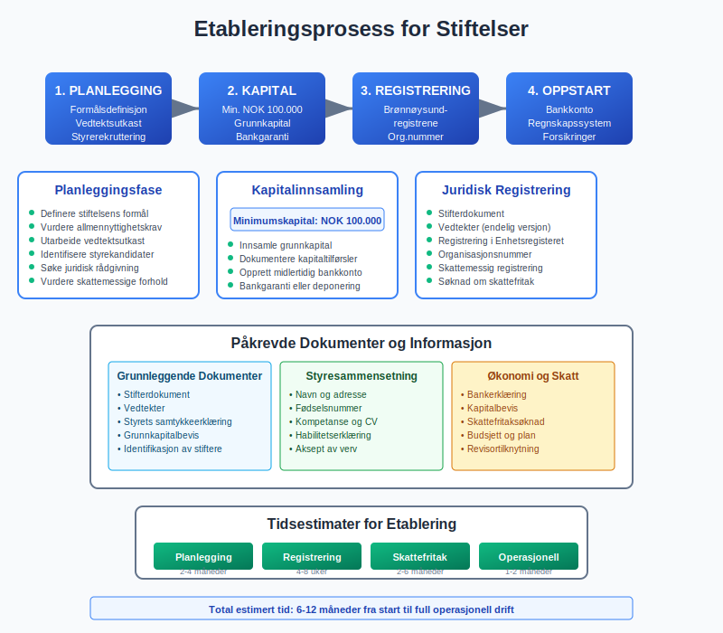

## Seksjon 8: Praktisk Regnskapsføring

### 8.1 Daglig Regnskapsføring

**Løpende regnskapsføring** følger [standard regnskapsprinsipper](/blogs/regnskap/hva-er-regnskap "Hva er Regnskap? Grunnleggende Prinsipper og Regnskapsføring"):

#### Typiske Transaksjoner
```
Mottak donasjon:
Debet: Bank                    NOK 50.000
Kredit: Donasjonsinntekt           NOK 50.000

Utbetaling tilskudd:
Debet: Tilskudd utbetalt       NOK 30.000
Kredit: Bank                       NOK 30.000

Administrasjonskostnader:
Debet: Kontorrekvisita         NOK 5.000
Kredit: Leverandørgjeld            NOK 5.000
```

### 8.2 Periodisk Rapportering

#### Månedlige Rutiner
* **Avstemminger:** Bank- og kontoavstemminger
* **[Fakturering](/blogs/regnskap/hva-er-faktura "Hva er en Faktura? Regnskapsføring og Krav til Fakturering"):** Utsendelse av fakturaer for tjenester
* **Oppfølging:** [Kundefordringer](/blogs/regnskap/hva-er-kundefordringer "Hva er Kundefordringer? Regnskapsføring og Innkreving") og [leverandørgjeld](/blogs/regnskap/hva-er-leverandorgjeld "Hva er Leverandørgjeld? Regnskapsføring og Styring av Leverandørgjeld")

#### Kvartalsvise Aktiviteter
* **Mellomrapporter:** Utarbeiding av kvartalsrapporter
* **Budsjettoppfølging:** Sammenligning med [budsjett](/blogs/regnskap/hva-er-budsjett "Hva er Budsjett? Planlegging og Styring av Bedriftens Økonomi")
* **Investeringsvurdering:** Gjennomgang av investeringsportefølje

### 8.3 Årsavslutningsprosess

#### Regnskapsmessige Justeringer
* **[Avskrivninger](/blogs/regnskap/hva-er-avskrivning "Hva er Avskrivning? Komplett Guide til Avskrivningsmetoder"):** Beregning og bokføring av årlige avskrivninger
* **[Avsetninger](/blogs/regnskap/avsetning "Avsetning i Regnskap - Komplett Guide til Avsetninger og Estimater"):** Vurdering av fremtidige forpliktelser
* **Verdiendringer:** Markedsverdiendringer på investeringer

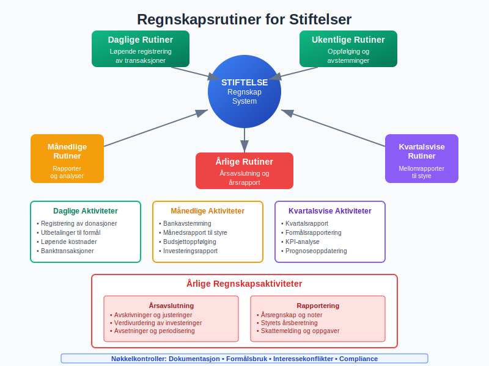

## Seksjon 9: Utfordringer og Risikoområder

### 9.1 Typiske Utfordringer

#### Finansielle Utfordringer
* **Finansieringsusikkerhet:** Avhengighet av donasjoner og tilskudd
* **Langstiktig bærekraft:** Sikre finansiering av fremtidige aktiviteter
* **Kostnadseffektivitet:** Balanse mellom administrasjon og formålsaktiviteter

#### Operative Utfordringer
| **Utfordring** | **Beskrivelse** | **Risikobegrensende tiltak** |
|---------------|----------------|----------------------------|
| Kompetansemangel | Begrenset fagkompetanse | Styrekompetanse og ekstern rådgivning |
| Regeltolkning | Komplekse regelverk | Juridisk og regnskapsmessig rådgivning |
| Målkonflikt | Motstridende interesser | Klare prioriteringsregler |

### 9.2 Compliance-risiko

#### Regulatoriske Risikoer
* **Tap av skattefritak:** Ved brudd på allmennyttighetskrav
* **Sanksjoner:** Fra tilsynsmyndigheter
* **Omdømmerisiko:** Negative medieoppslag og tillitssvikt

### 9.3 Operasjonelle Risikoer

#### Finansielle Risikoer
* **Markedsrisiko:** Svingninger i investeringsporteføljen
* **Kredittrisiko:** Mislighold fra debatorer
* **[Likviditetsrisiko](/blogs/regnskap/hva-er-likviditet "Hva er Likviditet? Måling og Styring av Bedriftens Likviditet"):** Utilstrekkelig kontantbeholdning

#### Organisasjonelle Risikoer
* **Nøkkelpersonrisiko:** Avhengighet av enkeltsper personer
* **Interessekonfliktrisiko:** Manglende håndtering av interessekonflikter
* **Informasjonssikkerhetsrisiko:** Datatap og personvernbrudd


## Seksjon 10: Digitalisering og Modernisering

### 10.1 Digitale Regnskapsløsninger

**Moderne stiftelser** drar nytte av digitale verktøy:

#### Skybaserte Systemer
* **Tilgjengelighet:** Flerstedsregnskap og hjemmekontor
* **Automatisering:** Automatisk [bilagshåndtering](/blogs/regnskap/hva-er-bilag "Hva er Bilag? Registrering og Arkivering av Regnskapsbilag") og [fakturering](/blogs/regnskap/hva-er-faktura "Hva er en Faktura? Regnskapsføring og Krav til Fakturering")
* **Integrasjon:** Kobling til banksystemer og andre tjenester

#### Rapporteringsverktøy
* **Sanntidsrapporter:** Løpende økonomisk status
* **Dashboard:** Visuell presentasjon av nøkkeltall
* **Automatisert distribusjon:** Automatisk utsendelse av rapporter

### 10.2 Digitale Donasjonsplattformer

#### Online Fundraising
* **Betalingsløsninger:** Integrasjon med [betalingstjenester](/blogs/regnskap/betalingstjeneste "Hva er betalingstjeneste? Komplett Guide til Betalingstjenester i Norge")
* **Donorsporing:** CRM-systemer for donorstyring
* **Rapportering:** Automatisk generering av kvitteringer og rapporter

### 10.3 Fremtidens Stiftelsesteknologi

#### Emerging Technologies
* **Kunstig intelligens:** Automatisert [regnskapsføring](/blogs/regnskap/hva-er-bokforing "Hva er Bokføring? Grunnleggende Prinsipper for Regnskapsføring") og analyse
* **Blockchain:** Transparente og sporbare transaksjoner
* **ESG-rapportering:** Systematisk rapportering på bærekraftsmål

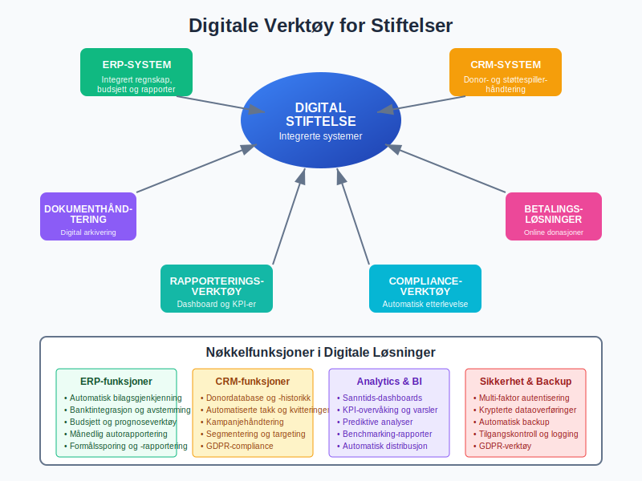

## Seksjon 11: Internasjonale Aspekter

### 11.1 Grenseoverskridende Virksomhet

**Norske stiftelser** med internasjonal virksomhet møter komplekse regelverk:

#### Skattemessige Konsekvenser
* **Dobbeltbeskatningsavtaler:** Unngå dobbel skattelegging
* **Kildeskatt:** Behandling av utenlandske inntekter
* **Transferpricing:** Prissetting av interne transaksjoner

### 11.2 Internasjonale Regnskapsstandarder

#### IFRS for Non-Profit Organizations
* **Anvendelse:** Frivillig implementering av internasjonale standarder
* **Sammenlignbarhet:** Bedre sammenligning med utenlandske organisasjoner
* **Rapportering:** Forbedret rapportering til internasjonale givere

### 11.3 Regulatorisk Kompleksitet

#### Multi-jurisdictional Compliance
* **Lokale krav:** Forskjellige krav i ulike land
* **Rapporteringsforpliktelser:** Multiple rapporteringsregimer
* **Faglig rådgivning:** Behov for spesialisert ekspertise


## Seksjon 12: Best Practices og Anbefalinger

### 12.1 Styringsbaserte Anbefalinger

#### Effektiv Stiftelsesledelse
* **Kompetent styre:** Rekrutter medlemmer med relevant kompetanse
* **Regelmessige møter:** Systematisk styrearbeid og oppfølging
* **Strategisk fokus:** Langsiktig planlegging og målsetting
* **Risikobevissthet:** Proaktiv risikoidentifisering og -håndtering

#### Transparens og Akutabilitet
| **Område** | **Anbefaling** | **Implementering** |
|-----------|---------------|------------------|
| Rapportering | Utfyllende og forståelig | Årlige rapporter og kvartalsoppdateringer |
| Kommunikasjon | Åpen dialog med interessenter | Webside og sosiale medier |
| Dokumentasjon | Systematisk dokumentasjon | Digitale arkivsystemer |

### 12.2 Finansielle Best Practices

#### Robust Økonomiforvaltning
* **Konservativ budsjetteing:** Realistiske inntekts- og kostnadsanslag
* **Likviditetsreserver:** Tilstrekkelig kontantbeholdning
* **Diversifiserte inntektskilder:** Reduser avhengighet av enkeltdonorer
* **Kostnadseffektivitet:** Kontinuerlig fokus på kostnads-nytte

#### Investeringsstrategi
* **Langsiktig perspektiv:** Investeringer tilpasset stiftelsens levetid
* **Risikobalanse:** Tilpasset risikonivå og formål
* **Professional forvaltning:** Faglig investeringsrådgivning
* **Regular gjennomgang:** Periodisk evaluering av investeringsstrategi

### 12.3 Teknologi og Innovasjon

#### Digital Transformation
* **Stegvis implementering:** Systematisk digitalisering
* **Ansattopplæring:** Kompetanseutvikling på nye systemer
* **Cybersikkerhet:** Beskyttelse av sensitive data
* **Kontinuerlig utvikling:** Følg med på teknologiske endringer

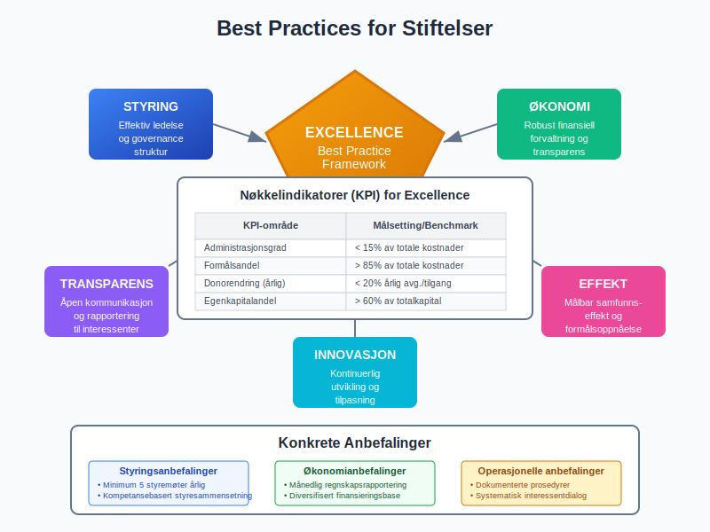

## Konklusjon

**Stiftelser** representerer en unik og viktig organisasjonsform som krever spesialisert kunnskap innen [regnskap](/blogs/regnskap/hva-er-regnskap "Hva er Regnskap? Grunnleggende Prinsipper og Regnskapsføring"), [skatt](/blogs/regnskap/hva-er-skatt "Hva er Skatt? Regnskapsføring og Skatteplanlegging") og [styring](/blogs/regnskap/hva-er-styring "Hva er Styring? Corporate Governance og Ledelsessystemer"). Den formålsbundne karakteren stiller særlige krav til hvordan [egenkapital](/blogs/regnskap/hva-er-egenkapital "Hva er Egenkapital? Komplett Guide til Egenkapital i Regnskap") forvaltes, hvordan [inntekter](/blogs/regnskap/hva-er-inntekt "Hva er Inntekt? Inntektsføring og Regnskapsbehandling") håndteres og hvordan [finansielle eiendeler](/blogs/regnskap/hva-er-finansielle-eiendeler "Hva er Finansielle Eiendeler? Regnskapsføring og Verdivurdering") investeres.

**Nøkkelinnsikter for suksessfull stiftelsesdrift:**

* **Regelverkskompleksitet:** Stiftelser navigerer i et komplekst regulatorisk landskap som krever kontinuerlig oppmerksomhet
* **Finansiell ansvarlighet:** Forvaltning av giveres midler krever høyeste grad av [transparens](/blogs/regnskap/hva-er-arsrapport "Hva er Årsrapport? Komplett Guide til Årsrapportering") og [etisk](/blogs/regnskap/hva-er-etikk "Hva er Etikk? Etiske Prinsipper i Regnskapsføring") håndtering
* **Långsiktig perspektiv:** Stiftelser må balansere dagens behov med fremtidens muligheter
* **Professional forvaltning:** Krav til høy kompetanse innen [økonomi](/blogs/regnskap/hva-er-okonomi "Hva er Økonomi? Grunnleggende Økonomiske Prinsipper"), [regnskap](/blogs/regnskap/hva-er-bokforing "Hva er Bokføring? Grunnleggende Prinsipper for Regnskapsføring") og [juss](/blogs/regnskap/hva-er-juridisk "Hva er Juridisk? Juridiske Aspekter i Regnskapsføring")

**Strategiske suksessfaktorer:**

Effektiv stiftelsesdrift bygger på sterke systemer for [internkontroll](/blogs/regnskap/hva-er-internkontroll "Hva er Internkontroll? Systemer for Risikostyring og Compliance"), systematisk [risikostyring](/blogs/regnskap/hva-er-risiko "Hva er Risiko? Risikostyring og Risikoanalyse") og kontinuerlig fokus på **formålsoppnåelse**. Kombinasjon av traditionell regnskapskunnskap med moderne teknologi og digitale verktøy gir stiftelser mulighet til å operere både effektivt og transparent.

**Fremtidsrettet forvaltning:**

Moderne stiftelser må tilpasse seg et stadig mer complex samfunn med økte krav til [bærekraftsrapportering](/blogs/regnskap/hva-er-barekraft "Hva er Bærekraft? ESG-rapportering og Bærekraftsregnskap"), digital kompetanse og cross-border compliance. Ved å etablere robuste governance-strukturer, implementere moderne teknologiske løsninger og maintainaine høy kompetanse, kan stiftelser sikre langsiktig success og måloppnåelse.

**Praktisk implementering:**

For de som etablerer eller driver stiftelser, er det avgjørende å investere i [professional regnskapsføring](/blogs/regnskap/hva-er-bokforing "Hva er Bokføring? Grunnleggende Prinsipper for Regnskapsføring"), systematiske [rapporteringsrutiner](/blogs/regnskap/hva-er-arsrapport "Hva er Årsrapport? Komplett Guide til Årsrapportering") og kontinuerlig kompetanseutvikling. Stiftelser som prioriterer transparens, professional forvaltning og fokus på formålsoppnåelse, vil være best posisjonert for å skape varig samfunnsverdi og opprettholde tillit hos givere og beneficiaries.

Stiftelser er fundamentale byggeklosser i det sivile samfunn, og deres finansielle integritet og operasjonelle excellence er avgjørende for å opprettholde tilliten som er basis for deres eksistens og virkefelt.


