---
title: "Hva er Strekkode i Regnskap?"
meta_title: "Hva er Strekkode i Regnskap?"
meta_description: '**Strekkode** i regnskapssammenheng er en maskinlesbar kode som består av parallelle linjer eller geometriske mønstre som representerer informasjon digitalt. ...'
slug: hva-er-strekkode
type: blog
layout: pages/single
---

**Strekkode** i regnskapssammenheng er en maskinlesbar kode som består av parallelle linjer eller geometriske mønstre som representerer informasjon digitalt. I moderne regnskapsførsel brukes strekkoder for å automatisere og effektivisere håndtering av [fakturaer](/blogs/regnskap/hva-er-faktura "Hva er en Faktura? En Guide til Norske Fakturakrav"), lager, og økonomiske transaksjoner gjennom rask og nøyaktig dataregistrering.

## Seksjon 1: Grunnleggende om Strekkoder i Regnskap

### 1.1 Definisjon og Funksjon

**Strekkoder** representerer en revolusjonerende teknologi for automatisk dataregistrering i regnskapsføring:

* **Automatisk identifikasjon** av produkter, tjenester og dokumenter
* **Reduserte feil** sammenlignet med manuell dataregistrering
* **Økt effektivitet** i [bokføring](/blogs/regnskap/hva-er-bokforing "Hva er Bokføring? Komplett Guide til Norsk Bokføringslovgivning") og lagerbehandling
* **Sanntidsoppdatering** av regnskapsdata
* **Integrerte løsninger** med regnskapssystemer

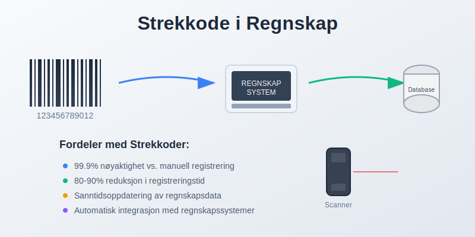

### 1.2 Tekniske Komponenter

En strekkode består av flere elementer:

* **Stille soner:** Tomme områder før og etter koden
* **Start/stopp-tegn:** Markerer begynnelse og slutt
* **Dataområde:** Selve informasjonen kodet som streker
* **Kontrollsiffer:** Sikrer dataintegritet og oppdager feil
* **Menneskelig lesbar tekst:** Backup for manuell registrering

## Seksjon 2: Typer Strekkoder i Regnskapsarbeid

### 2.1 Endimensjonale (1D) Strekkoder

Tradisjonelle lineære strekkoder med bred anvendelse:

| **Type** | **Anvendelse** | **Kapasitet** | **Fordeler** |
|----------|----------------|---------------|-------------|
| **EAN-13** | Detaljhandel, fakturering | 13 siffer | Global standard, bred støtte |
| **Code 128** | Logistikk, intern ID | Alfanumerisk | Høy datadensitet, fleksibel |
| **Code 39** | Industri, inventar | Alfanumerisk | Enkel implementering |
| **PDF417** | Dokumenter, rapporter | 1800 tegn | Høy kapasitet, feilkorreksjon |

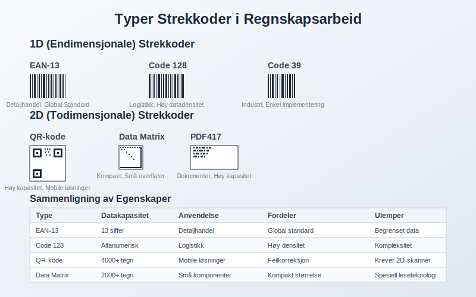

### 2.2 Todimensjonale (2D) Strekkoder

Avanserte løsninger for kompleks informasjon:

* **QR-koder:** Rask tilgang til detaljert informasjon
* **Data Matrix:** Kompakt lagring på små overflater
* **Aztec-koder:** Mobile betalingsløsninger
* **MaxiCode:** Logistikk og frakt-tracking

### 2.3 Spesialiserte Regnskapskoder

Bransjespesifikke løsninger:

* **OCR-linjer:** Betalingsformidling og [fakturaer](/blogs/regnskap/hva-er-faktura "Hva er en Faktura? En Guide til Norske Fakturakrav")
* **GTIN-koder:** Global produktidentifikasjon
* **UPC:** Nordamerikansk detaljhandel
* **ISBN:** Bøker og publikasjoner

## Seksjon 3: Implementering i Regnskapssystemer

### 3.1 Teknisk Infrastruktur

Grunnleggende komponenter for strekkodeintegrasjon:

* **Skannere og lesere:** HÃ¥ndholdte, faste eller mobile enheter
* **Software-integrasjon:** Kobling med regnskapssystemer
* **Database-tilkobling:** Automatisk oppdatering av [hovedbok](/blogs/regnskap/hva-er-hovedbok "Hva er Hovedbok? Komplett Guide til Regnskapets Grunnbok")
* **Kvalitetskontroll:** [Internkontroll](/blogs/regnskap/hva-er-internkontroll "Hva er Internkontroll? Komplett Guide til Interne Kontrollsystemer") og feilhåndtering

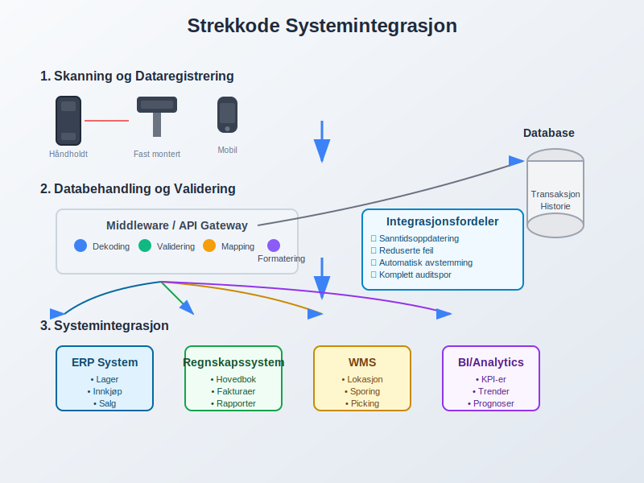

### 3.2 Automatiserte Arbeidsflyter

Strømlinjeformede prosesser gjennom strekkodeteknologi:

**Innkjøpsprosess:**
1. Strekkodeskanning ved varelevering
2. Automatisk matching mot [bestillinger](/blogs/regnskap/hva-er-bestilling "Hva er Bestilling i Regnskap? Guide til Innkjøpsprosesser")
3. Lagertilgang og verdsettelse
4. [Fakturacontrol](/blogs/regnskap/hva-er-fakturakontroll "Hva er Fakturakontroll? Guide til Fakturabehandling") og godkjenning

**Salgsprosess:**
1. Produktregistrering ved salg
2. Automatisk lagerutgang
3. [Fakturagenerering](/blogs/regnskap/hva-er-fakturering "Hva er Fakturering? Komplett Guide til Fakturahaandtering")
4. Regnskapsføring av omsetning

### 3.3 Integrasjon med ERP-systemer

Sømløs sammenkobling av forretningsprosesser:

* **Sanntidsoppdatering** av [balansen](/blogs/regnskap/hva-er-balanse "Hva er Balanse? Komplett Guide til Balansens Oppbygging og Funksjon")
* **Automatisk [avstemming](/blogs/regnskap/hva-er-avstemming "Hva er Avstemming i Regnskap? Komplett Guide til Regnskapsavstemming")** av lagerkontoer
* **Kostnadsporing** og [budsjettering](/blogs/regnskap/hva-er-budsjettering "Hva er Budsjettering? Komplett Guide til Budsjettplanlegging")
* **Rapportering** og [prognose](/blogs/regnskap/hva-er-prognose "Hva er Prognose i Regnskap? Guide til Økonomisk Prognostisering")

## Seksjon 4: Praktiske Anvendelser

### 4.1 Lagerforvaltning og Varebeholdning

Strekkoder revolusjonerer lagerstyring:

* **Sanntidsoversikt** over [varebeholdning](/blogs/regnskap/hva-er-varebeholdning "Hva er Varebeholdning? Guide til Lagerregnskapet")
* **Automatisk verdsettelse** etter FIFO, LIFO eller gjennomsnitt
* **Sporingsfunksjonalitet** for serienumre og utløpsdatoer
* **Minimum lager-varsler** og automatisk bestillingsfunksjoner

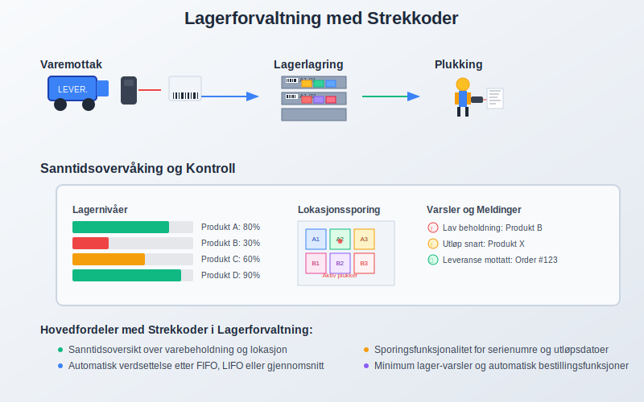

### 4.2 Faktura- og Dokumenthåndtering

Effektivisering av administrative prosesser:

* **Automatisk fakturaregistrering** fra skannede strekkoder
* **Kobling til leverandørdata** og kontoplaner
* **Digital arkivering** med søkbar metadata
* **[Attestering](/blogs/regnskap/hva-er-attestering "Hva er Attestering? Komplett Guide til Attestasjonsprosesser")** og godkjenningsflyt

### 4.3 Anleggsmidler og Inventar

Systematisk håndtering av [anleggsmidler](/blogs/regnskap/hva-er-anleggsmidler "Hva er Anleggsmidler? Komplett Guide til Fast Kapital"):

* **Unique Asset IDs** for hver gjenstand
* **[Avskrivning](/blogs/regnskap/hva-er-avskrivning "Hva er Avskrivning? Komplett Guide til Avskrivningsmetoder")-tracking** og levetidsstyring
* **Flytting og lokasjonssporing**
* **Vedlikeholdshistorikk** og kostnadssporing

## Seksjon 5: Fordeler og Gevinster

### 5.1 Operasjonelle Fordeler

Konkrete forbedringer for regnskapsarbeid:

* **Feilreduksjon:** 99.9% nøyaktighet vs. 1 feil per 300 tegn manuelt
* **Tidsbesparelse:** 80-90% reduksjon i registreringstid
* **Forbedret [arbeidskapital](/blogs/regnskap/hva-er-arbeidskapital "Hva er Arbeidskapital? Guide til Kortsiktig Kapitalforvaltning"):** Bedre lagerstyring og cash flow
* **Reduserte personalkostnader:** Automatisering av rutineoppgaver

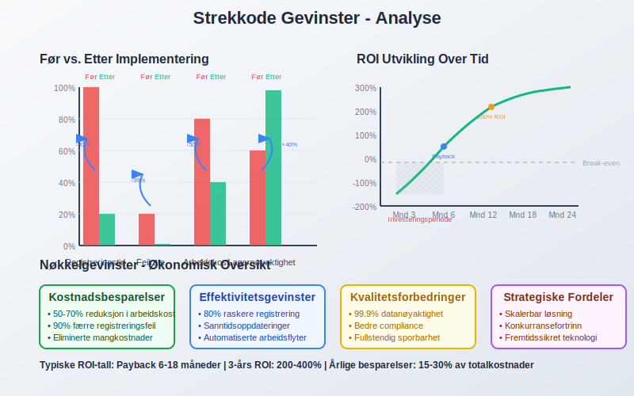

### 5.2 Kvalitetsforbedringer

Høyere standarder i regnskapsføring:

* **Konsistent dataregistrering** og standardisering
* **Sanntidsrapportering** for bedre beslutningsgrunnlag
* **Forbedret [internkontroll](/blogs/regnskap/hva-er-internkontroll "Hva er Internkontroll? Komplett Guide til Interne Kontrollsystemer")** og sporbarhet
* **Compliance** med [bokføringsloven](/blogs/regnskap/hva-er-bokforing "Hva er Bokføring? Komplett Guide til Norsk Bokføringslovgivning")

### 5.3 Strategiske Fordeler

Langsiktig verdi for organisasjonen:

* **Skalerbarhet:** Enkel ekspansjon og vekst
* **Datakvalitet:** PÃ¥litelig grunnlag for analyser
* **Kundetilfredshet:** Raskere service og levering
* **Konkurransefortrinn:** Effektive prosesser og lavere kostnader

## Seksjon 6: Kostnader og Investeringer

### 6.1 Implementeringskostnader

Budsjettmessige hensyn ved innføring:

| **Komponent** | **Kostnadsområde** | **Estimat (NOK)** |
|---------------|-------------------|------------------|
| Strekkodeskannere | Hardware | 500 - 15,000 |
| Software-lisenser | Programvare | 2,000 - 50,000 |
| Systemintegrasjon | Utvikling | 10,000 - 200,000 |
| Opplæring | Kompetanse | 5,000 - 25,000 |
| Etiketter og forbruk | Drift | 1,000 - 10,000/Ã¥r |

### 6.2 Driftskostnader

Løpende utgifter og vedlikehold:

* **Lisensavgifter** for software og oppdateringer
* **Forbruksmateriell** som etiketter og ribboner
* **Vedlikehold** av skannere og utstyr
* **Support og teknisk assistanse**

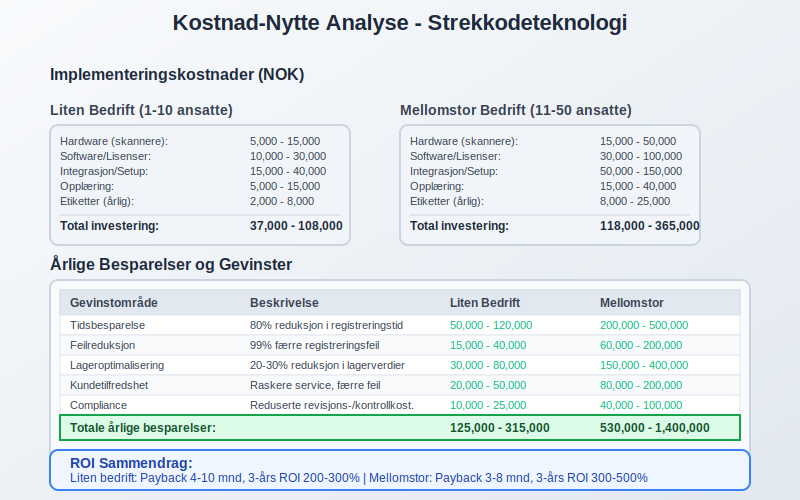

### 6.3 Return on Investment (ROI)

Beregning av lønnsomhet:

**Besparelser:**
* Redusert arbeidstid ved registrering
* Færre feil og korrigeringer
* Bedre lagerstyring og mindre svinn
* Automatiserte [avstemminger](/blogs/regnskap/hva-er-avstemming "Hva er Avstemming i Regnskap? Komplett Guide til Regnskapsavstemming")

**Payback-tid:** Typisk 6-18 måneder avhengig av størrelse og kompleksitet

## Seksjon 7: Juridiske og Regulatoriske Aspekter

### 7.1 Compliance-krav

Overholdelse av regelverk og standarder:

* **[Bokføringsloven](/blogs/regnskap/hva-er-bokforing "Hva er Bokføring? Komplett Guide til Norsk Bokføringslovgivning"):** Krav til sporbarhet og dokumentasjon
* **MVA-regelverk:** Korrekt behandling av avgifter
* **Produktansvar:** Sporbarhet ved tilbakekallingen
* **GDPR:** Personvern ved kundedata

### 7.2 Revisjonsspor og Dokumentasjon

Sikre revisjonsstan darer:

* **Komplett auditspor** fra skanning til [hovedbok](/blogs/regnskap/hva-er-hovedbok "Hva er Hovedbok? Komplett Guide til Regnskapets Grunnbok")
* **Tidsstempling** av alle transaksjoner
* **Brukerlogging** og ansvarssporing
* **Backup og gjenoppretting** av kritiske data

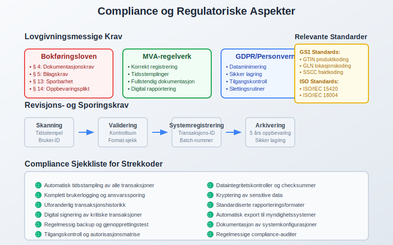

### 7.3 Standarder og Sertifiseringer

Bransjestandarder for strekkoder:

* **GS1-standarder:** Global harmonisering
* **ISO/IEC 15420:** Code 128 spesifikasjon
* **ISO/IEC 18004:** QR-kode standard
* **AIAG:** Automobilindustriens krav

## Seksjon 8: Beste Praksis og Implementering

### 8.1 Planleggingsfase

Systematisk tilnærming til innføring:

**Behovsanalyse:**
* Kartlegging av eksisterende prosesser
* Identifikasjon av forbedringspotensial
* Vurdering av tekniske krav
* Kostnad-nytte-beregninger

**Designfase:**
* Valg av strekkodeteknologi
* Systemarkitektur og integrasjon
* Arbeidsflytdesign
* Opplæringsplan

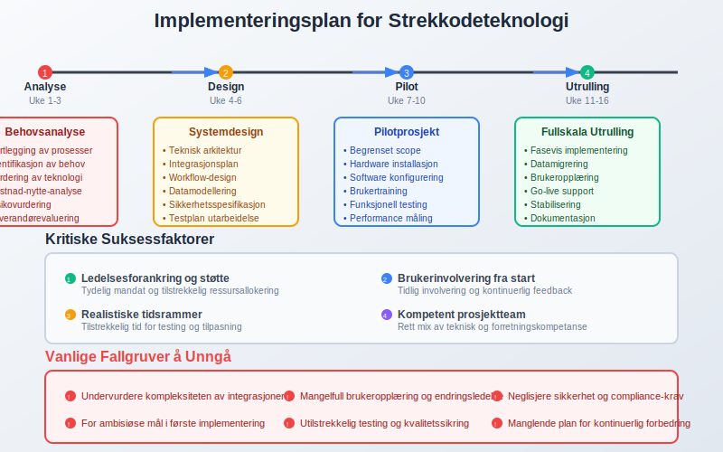

### 8.2 Pilotprosjekt

Testfase før full utrulling:

* **Begrenset scope** med 1-2 produktkategorier
* **Grundig testing** av alle funksjoner
* **Brukerfeeback** og justeringer
* **Performance-måling** og optimalisering

### 8.3 Fullskala Implementering

Systematisk utrulling:

* **Fasevis innføring** etter produktområder
* **Omfattende opplæring** av alle brukere
* **Kontinuerlig support** og feilsøking
* **Regelmessig evaluering** og forbedring

## Seksjon 9: Teknologiske Trender

### 9.1 Mobile Løsninger

Smarttelefoner som skannerverktøy:

* **App-baserte** skannerfunksioner
* **Cloud-integrasjon** for sanntidsoppdatering
* **Offline-modus** for områder uten nettverkstilgang
* **GPS-logging** for lokasjonssporing

### 9.2 AI og Maskinlæring

Intelligente forbedringer:

* **Automatisk bildegenkjenning** uten fysiske etiketter
* **Prediktiv vedlikehold** av skannerutstyr
* **Anomaldeteksjon** ved transaksjonsregistrering
* **Kvalitetsoptimalisering** av strekkodeutskrift

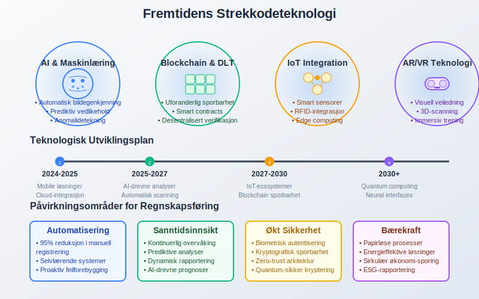

### 9.3 Internet of Things (IoT)

Tilkoblede løsninger:

* **Smart-sensorer** for automatisk registrering
* **RFID-integrasjon** for kontaktløs scanning
* **Blockchain-sporbarhet** for kritiske varer
* **Edge computing** for rask lokal prosessering

## Seksjon 10: Bransjespesifikke Anvendelser

### 10.1 Detaljhandel og E-handel

Spesialiserte løsninger for handelsbedrifter:

* **Point-of-Sale** integrasjon
* **Lagerrotasjon** og FIFO-håndtering
* **Kundelojalitetsprogrammer**
* **Retursporingen** og refusjoner

### 10.2 Produksjonsbedrifter

Manufacturing-spesifikke behov:

* **Work-in-Progress** tracking
* **Kvalitetskontroll** ved produksjonsstadier
* **RÃ¥varesporingen** og batch-logging
* **Maskinvedlikehold** og driftsmålinger

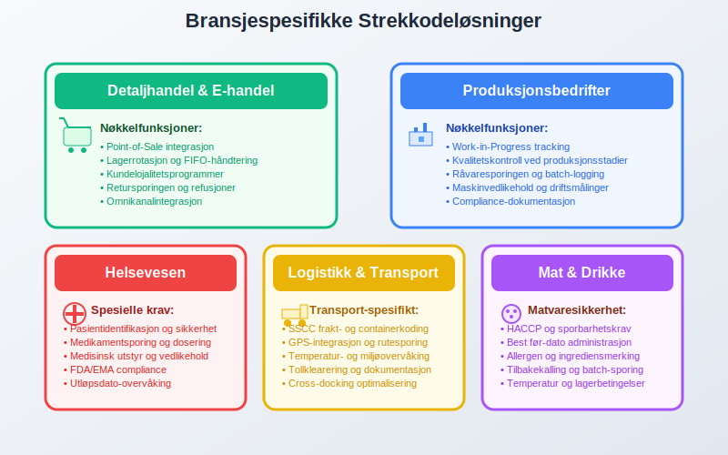

### 10.3 Servicebedrifter

Tjenesteyting med strekkoder:

* **Prosjektsporing** og tidsregistrering
* **Utstyrslån** og retur-tracking
* **Kundeservice** og support-tickets
* **Konsulentresurser** og fakturering

## Seksjon 11: Utfordringer og Risikohåndtering

### 11.1 Tekniske Utfordringer

Vanlige problemer og løsninger:

* **Skanningsproblemer:** Skitne eller skadede etiketter
* **Systemintegrasjon:** Compatibility issues
* **Nettverksproblemer:** Ustabile tilkoblinger
* **Backup-løsninger:** Manual override-funksjoner

### 11.2 Organisatoriske Utfordringer

Menneskelige faktorer:

* **Motstand mot endring** fra ansatte
* **Opplæringsbehov** og kompetanseutvikling
* **Arbeidsflytendringer** og tilpasninger
* **Kvalitetssikring** av nye prosesser

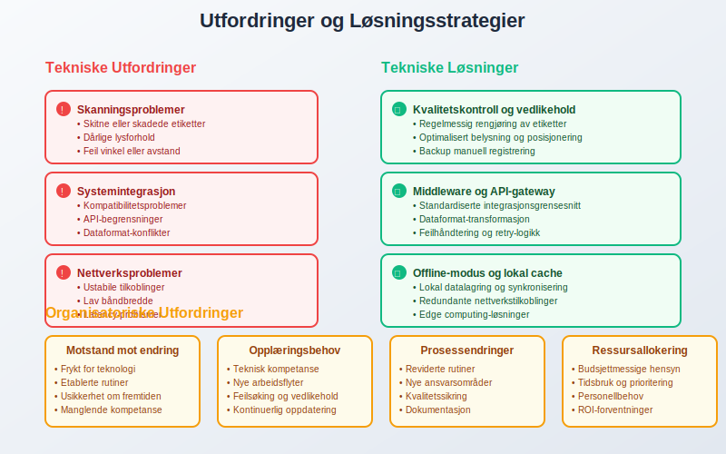

### 11.3 Sikkerhet og Risiko

Beskyttelse mot trusler:

* **Dataintegritets** og manipulation
* **Cybersikkerhet** ved nettverkstilkobling
* **Fysisk sikkerhet** av skannerutstyr
* **Business continuity** ved systemfeil

## Seksjon 12: MÃ¥ling og Optimalisering

### 12.1 Nøkkelindikatorer (KPI)

MÃ¥lbare resultater av strekkodebruk:

| **KPI** | **MÃ¥lemetode** | **MÃ¥lsetting** |
|---------|---------------|---------------|
| Skanningsnøyaktighet | Feilrate per 1000 skann | < 0.1% |
| Registreringstid | Sekunder per transaksjon | < 5 sekunder |
| Lagerrotasjon | Omsettingsgrad | Forbedring 10-20% |
| Kostnadsbesparelse | NOK per måned | ROI > 20% |

### 12.2 Kontinuerlig Forbedring

Systematisk optimalisering:

* **MÃ¥nedlige** ytelsesrapporter
* **Kvartalsvis** evaluering av prosesser
* **Ã…rlig** teknologivurdering
* **Kontinuerlig** brukertraining

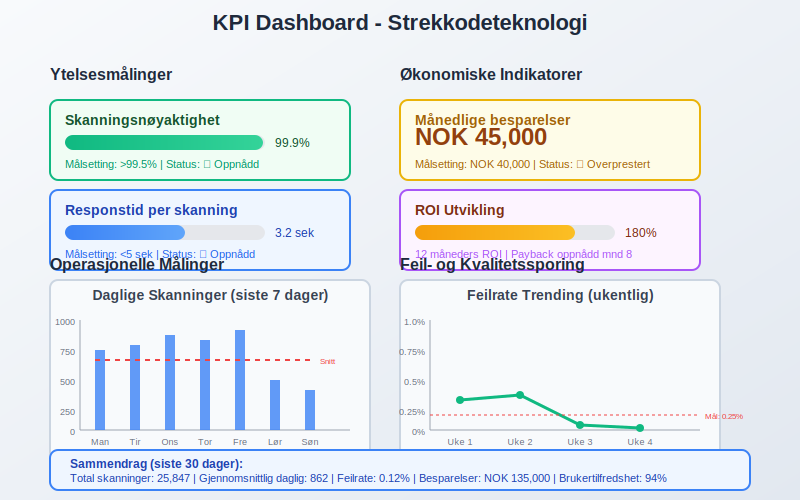

### 12.3 Benchmarking

Sammenligning med beste praksis:

* **Bransjestandarder** og benchmarks
* **Leverandørsammenligninger**
* **ROI-målinger** mot andre teknologier
* **Kundestilfredshetsmålinger**

## Seksjon 13: Fremtidige Utviklingsmuligheter

### 13.1 Teknologisk Evolusjon

Kommende innovasjoner:

* **3D-strekkoder** for økt informasjonskapasitet
* **Biometriske integrasjoner** for sikkerhet
* **Augmented Reality** for visuell veiledning
* **Voice-aktivert** scanning og kontroll

### 13.2 Markedstrender

Bransjeutvikling:

* **Økt standardisering** på tvers av bransjer
* **Miljøvennlige** etiketter og materialer
* **Global harmonisering** av koding-standarder
* **Integration** med bærekraftsrapportering

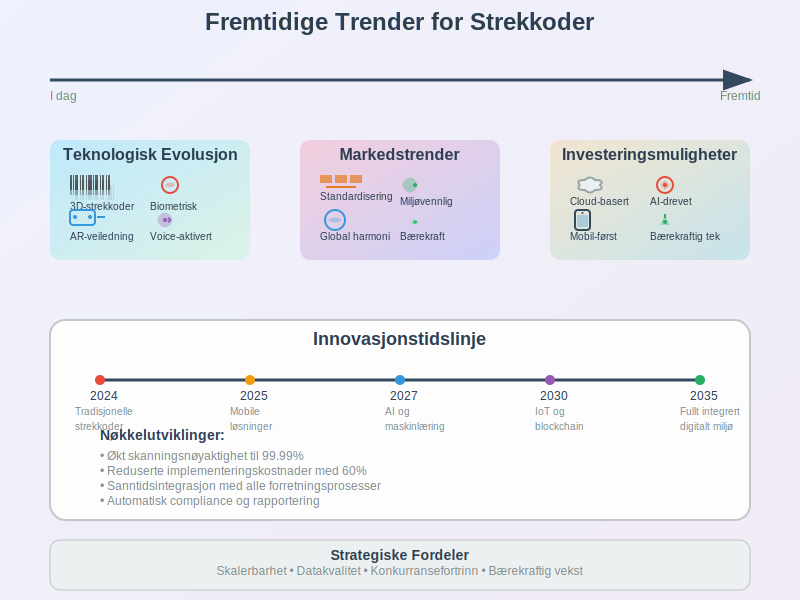

### 13.3 Investeringsmuligheter

Strategiske satsninger:

* **Cloud-baserte** løsninger for skalerbarhet
* **AI-drevne** analyser og innsikter
* **Mobil-første** tilnærminger
* **Bærekraftige** teknologier og prosesser

## Konklusjon

**Strekkoder** representerer en fundamental teknologi som har revolusjonert moderne regnskapsføring og forretningsdrift. Gjennom automatisering av dataregistrering og integrasjon med regnskapssystemer, tilbyr strekkoder:

* **Dramatisk forbedret nøyaktighet** sammenlignet med manuell registrering
* **Betydelig tidsbesparelse** i administrative prosesser
* **Bedre [internkontroll](/blogs/regnskap/hva-er-internkontroll "Hva er Internkontroll? Komplett Guide til Interne Kontrollsystemer")** og sporbarhet
* **Sanntids innsikt** i lager og økonomiske data

For organisasjoner som ønsker å:

* **Modernisere** sine regnskapsprosesser
* **Redusere feil** og øke datakvalitet
* **Forbedre effektivitet** i daglige operasjoner
* **Styrke compliance** med regelverket

Strekkodeteknologi tilbyr en kostnadseffektiv og skalerbar løsning som kan tilpasses ulike bedriftsstørrelser og bransjer.

Ved planlegging av implementering er det kritisk å:

* **Gjennomføre grundig behovsanalyse** før teknologivalg
* **Sikre proper systemintegrasjon** med eksisterende [regnskapssystemer](/blogs/regnskap/hva-er-regnskapssystem "Hva er Regnskapssystem? Guide til Digitale Regnskapsløsninger")
* **Investere i opplæring** og endringsledelse
* **Etablere klare KPI-er** for å måle suksess

I fremtiden vil strekkoder continue å evolusionere med integrasjon av AI, IoT og mobile teknologier, som vil skape enda mer intelligent og automatiserte regnskapsløsninger. Organisasjoner som investerer i disse teknologiene i dag, posisjonerer seg for fortsatt vekst og konkurransefordeler i det digitale markedet.

Strekkoder er ikke bare et verktøy for effektivisering - de er en strategisk investering i organisasjonens digitale transformasjon og fremtidige bærekraft.

