---
title: "Hva er Styre?"
meta_title: "Hva er Styre?"
meta_description: 'Et **styre** er det sentrale ledelses- og styringsorganet i et [aksjeselskap (AS)](/blogs/regnskap/hva-er-et-aksjeselskap "Hva er et Aksjeselskap? Komplett Guid...'
slug: hva-er-styre
type: blog
layout: pages/single
---

Et **styre** er det sentrale ledelses- og styringsorganet i et [aksjeselskap (AS)](/blogs/regnskap/hva-er-et-aksjeselskap "Hva er et Aksjeselskap? Komplett Guide til Selskapsformen"), valgt av og ansvarlig overfor aksjonærene. Styret fungerer som selskapets øverste beslutningstaker og har det **overordnede ansvaret** for virksomhetens strategiske retning, risikoforvaltning og overvåking av daglig ledelse. I regnskapssammenheng spiller styret en kritisk rolle i finansiell rapportering, kontroll og [internkontroll](/blogs/regnskap/hva-er-internkontroll "Hva er Internkontroll? Systemer for Risikoforvaltning og Compliance").

*Se også: [Hva er et styremedlem?](/blogs/regnskap/hva-er-et-styremedlem "Hva er et Styremedlem? En Komplett Guide til Styremedlemmets Rolle og Ansvar"), [Hva er et styremøte?](/blogs/regnskap/hva-er-et-styremote "Hva er et styremøte? Guide til Møter, Protokoller og Prosess"), [Styreverv](/blogs/regnskap/styreverv "Styreverv: Roller, Ansvar og Fordeler ved Styreverv i Norske Selskaper").*

### Styrets Lovpålagte Ansvar

Styret har omfattende juridiske forpliktelser som er nedfelt i [aksjeloven](/blogs/regnskap/hva-er-aksjeloven "Hva er Aksjeloven? Regler for Aksjeselskaper i Norge") og spesifisert i selskapets [vedtekter](/blogs/regnskap/hva-er-vedtekter-for-aksjeselskap "Hva er Vedtekter for Aksjeselskap? Krav og Innhold"). De viktigste ansvarsområdene inkluderer:

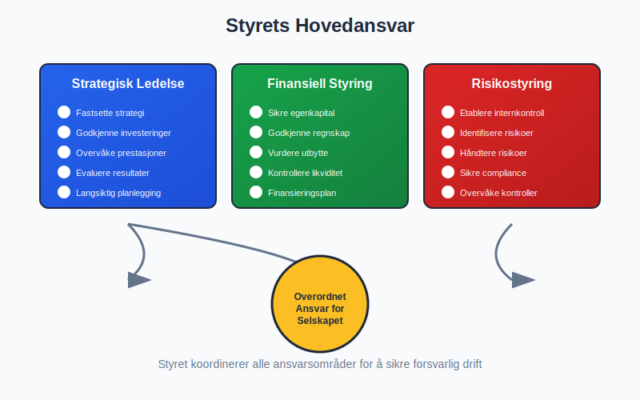

**Strategisk ledelse:**
* Fastsette selskapets overordnede strategi og forretningsplan
* Godkjenne større investeringer og finansieringsbeslutninger
* Overvåke og evaluere selskapets prestasjoner mot strategiske mål

**Finansiell styring:**
* Sikre forsvarlig [egenkapital](/blogs/regnskap/hva-er-egenkapital "Hva er Egenkapital? Komplett Guide til Egenkapital i Regnskap") og [likviditet](/blogs/regnskap/hva-er-likviditet "Hva er Likviditet? Definisjon og Betydning i Regnskap")
* Godkjenne [Ã¥rsregnskap](/blogs/regnskap/hva-er-arsregnskap "Hva er Ã…rsregnskap? Krav, Innhold og Frister") og [Ã¥rsberetning](/blogs/regnskap/hva-er-arsberetning "Hva er Ã…rsberetning? Krav til Innhold og Frister")
* Vurdere og beslutte om [utbytteforslag](/blogs/regnskap/hva-er-utbytte "Hva er Utbytte? Skattebehandling og Regnskapsføring")

**Risikostyring:**
* Etablere og overvåke effektive [internkontrollsystemer](/blogs/regnskap/hva-er-internkontroll "Hva er Internkontroll? Systemer for Risikoforvaltning og Compliance")
* Identifisere og håndtere vesentlige forretningsrisikoer
* Sikre [compliance](/blogs/regnskap/hva-er-compliance "Hva er Compliance? Betydning og Praktisk Implementering") med relevante lover og forskrifter

**Administrativt ansvar:**
*   Sørge for at selskapet fører en nøyaktig og oppdatert [aksjeeierbok](/blogs/regnskap/hva-er-en-aksjeeierbok "Hva er en Aksjeeierbok? En Komplett Guide").
*   Påse at den årlige [Aksjonærregisteroppgaven](/blogs/regnskap/aksjonaerregisteroppgave "Hva er Aksjonærregisteroppgave? Komplett Guide til Årlig Rapportering") blir korrekt levert.

### Styresammensetning og Organisering

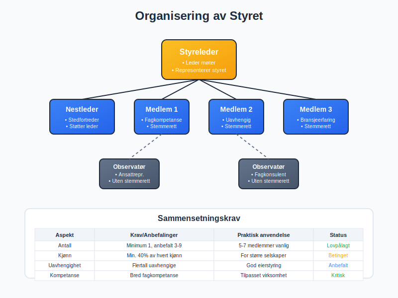

Et styre består normalt av **3-9 medlemmer**, avhengig av selskapets størrelse og kompleksitet. Sammensetningen reguleres av flere faktorer:

| Aspekt | Krav/Anbefalinger |
|--------|-------------------|
| **Minimum antall** | 1 medlem (for små AS), 3 medlemmer (anbefalt) |
| **Maksimum antall** | Ingen lovpålagt øvre grense, men 9 er praktisk maksimum |
| **Kjønnsbalanse** | Minst 40% av hvert kjønn (for større selskaper) |
| **Uavhengighet** | Flertall av uavhengige medlemmer anbefales |
| **Fagkompetanse** | Bred kompetanse innen relevante fagområder |

**Styreverv og roller:**
* [Styreleder](/blogs/regnskap/styreleder "Hva er Styreleder? Styrets Lederrolle i Norske Aksjeselskaper") “ Leder styremøter og representerer styret eksternt
* **Nestleder:** Fungerer som stedfortreder for styreleder
* **Styremedlemmer:** Deltar i beslutninger og utøver sitt [styreverv](/blogs/regnskap/styreverv "Styreverv: Roller, Ansvar og Fordeler ved Styreverv i Norske Selskaper")
* **Observatører:** Kan delta uten stemmerett (f.eks. ansatterepresentanter)

### Styrets Rolle i Regnskapsføring

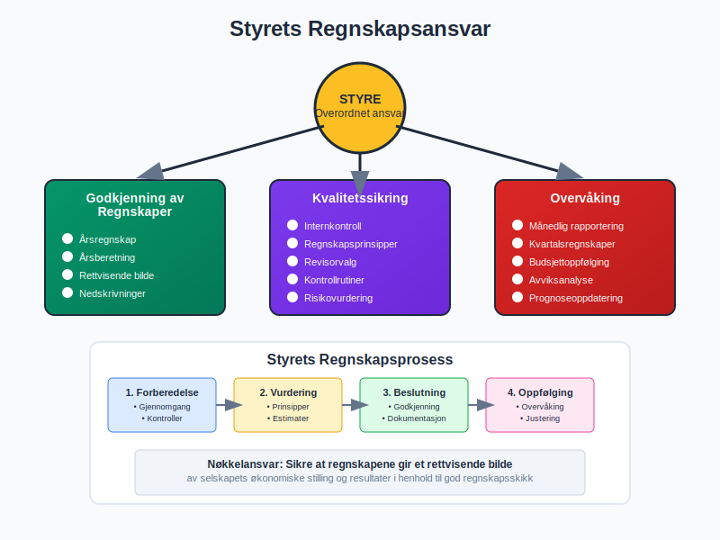

Styret har det **overordnede ansvaret** for selskapets regnskapsføring og finansielle rapportering:

**Godkjenning av regnskaper:**
* Behandle og godkjenne [årsregnskap](/blogs/regnskap/hva-er-arsregnskap "Hva er Årsregnskap? Krav, Innhold og Frister") før generalforsamling
* Sikre at regnskapet gir et rettvisende bilde av selskapets økonomiske stilling
* Vurdere behov for [nedskrivninger](/blogs/regnskap/hva-er-nedskrivning "Hva er Nedskrivning? Verdifall på Eiendeler") eller andre justeringer

Aksjonærer kan strukturere sin eierstyring og påvirkning på styrearbeidet gjennom en [aksjonæravtale](/blogs/regnskap/aksjonaeravtale "Hva er en Aksjonæravtale? En Omfattende Guide til Aksjonæravtaler i Norge") som regulerer stemmerett, styrevalg og andre styringsmekanismer.

**Kvalitetssikring:**
* Etablere rutiner for [internkontroll](/blogs/regnskap/hva-er-internkontroll "Hva er Internkontroll? Systemer for Risikoforvaltning og Compliance") av regnskapsrapportering
* Overvåke valg av [regnskapsprinsipper](/blogs/regnskap/hva-er-regnskapsprinsipper "Hva er Regnskapsprinsipper? GAAP og IFRS Forklart") og deres anvendelse
* Vurdere behov for ekstern [revisjon](/blogs/regnskap/hva-er-revisjon "Hva er Revisjon? Formål, Prosess og Krav") og velge revisor

### Styremøter og Beslutningsprosesser

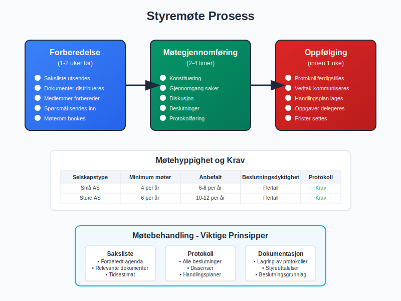

Styret må møtes regelmessig for å utføre sine oppgaver effektivt:

**Møtehyppighet:**
* Minimum 4-6 møter per år for vanlige selskaper
* Månedlige møter for større eller mer komplekse virksomheter
* Ekstraordinære møter ved behov for viktige beslutninger

**Møtebehandling:**
* **Saksliste:** Forberedt agenda med relevante saker
* **Beslutningsdyktighet:** Flertall av styremedlemmer må være til stede
* **Protokoll:** Skriftlig referat fra alle styremøter
* **Dokumentasjon:** Lagring av styreuttalelser og beslutninger

### Styrets Ansvar for Internkontroll

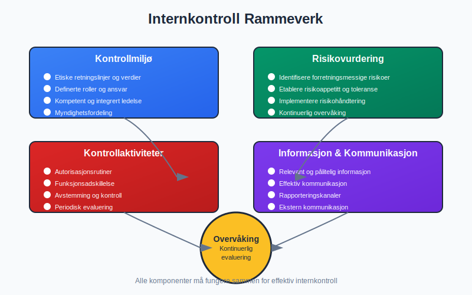

Styret må etablere og overvåke effektive [internkontrollsystemer](/blogs/regnskap/hva-er-internkontroll "Hva er Internkontroll? Systemer for Risikoforvaltning og Compliance"):

**Kontrollmiljø:**
* Fastsette etiske retningslinjer og verdier
* Definere roller, ansvar og myndighet
* Sikre kompetent og integrert ledelse

**Risikovurdering:**
* Identifisere og vurdere forretningsmessige risikoer
* Etablere risikoappetitt og toleransenivåer
* Implementere risikohåndteringstiltak

**Kontrollaktiviteter:**
* Autorisasjonsrutiner for transaksjoner
* Funksjonsadskillelse i kritiske prosesser
* Regelmessig avstemming og kontroll av regnskapsdata

### Styret og Daglig Ledelse

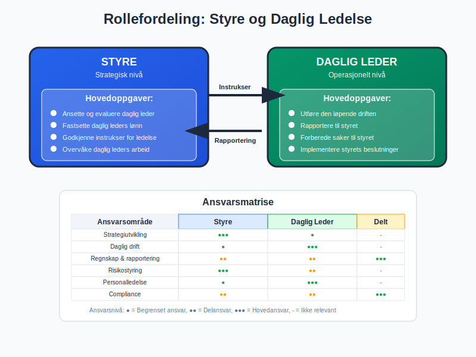

Forholdet mellom styret og [daglig leder](/blogs/regnskap/hva-er-daglig-leder "Hva er Daglig Leder? Rolle, Ansvar og Regnskapsmessige Forpliktelser") er fundamentalt for selskapets styring:

**Styrets oppgaver:**
* Ansette og evaluere daglig leder
* Fastsette daglig leders lønn og arbeidsvilkår
* Godkjenne instrukser for daglig ledelse
* Overvåke daglig leders arbeid og resultater

**Daglig leders oppgaver:**
* Utføre den løpende driften innenfor styrets rammer
* Rapportere regelmessig til styret om virksomhetens utvikling
* Forberede saker til styrebehandling
* Implementere styrets beslutninger

### Ansvarsproblematikk og Forsikring

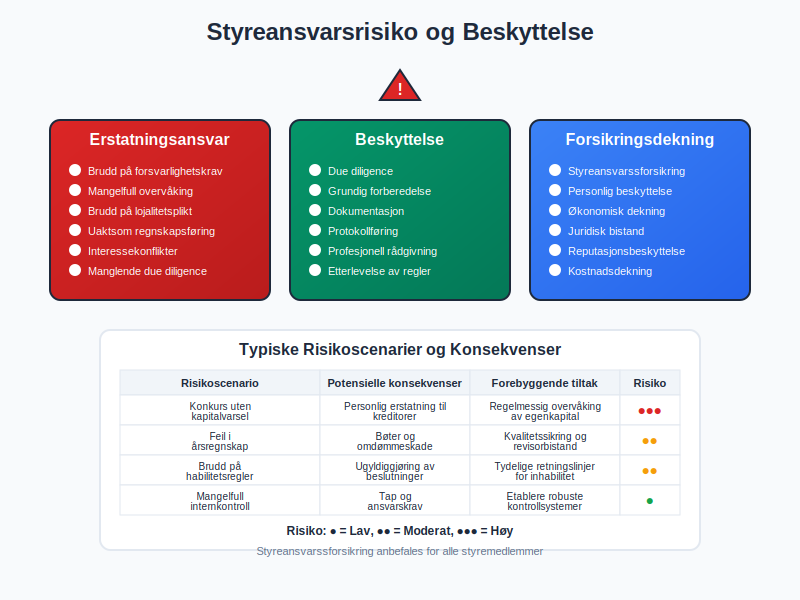

Styremedlemmer kan bli personlig ansvarlige under visse omstendigheter:

**Erstatningsansvar:**
* Brudd på [forsvarlighetskravet](/blogs/regnskap/hva-er-forsvarlighetskrav "Hva er Forsvarlighetskrav? Krav til Kapital og Likviditet") i aksjeloven
* Mangelfull overvåking av selskapets risiko og kontroll
* Brudd på lojalitetsplikt overfor selskapet

**Beskyttelse:**
* **[Styreansvarsforsikring](/blogs/regnskap/styreansvarsforsikring "Hva er Styreansvarsforsikring? En Guide til Styremedlemsforsikring i Norge")**: Dekker økonomiske tap ved erstatningskrav
* **Due diligence:** Grundig forberedelse til styremøter
* **Dokumentasjon:** Sikre at beslutninger er godt dokumentert

### Moderne Styringsutfordringer

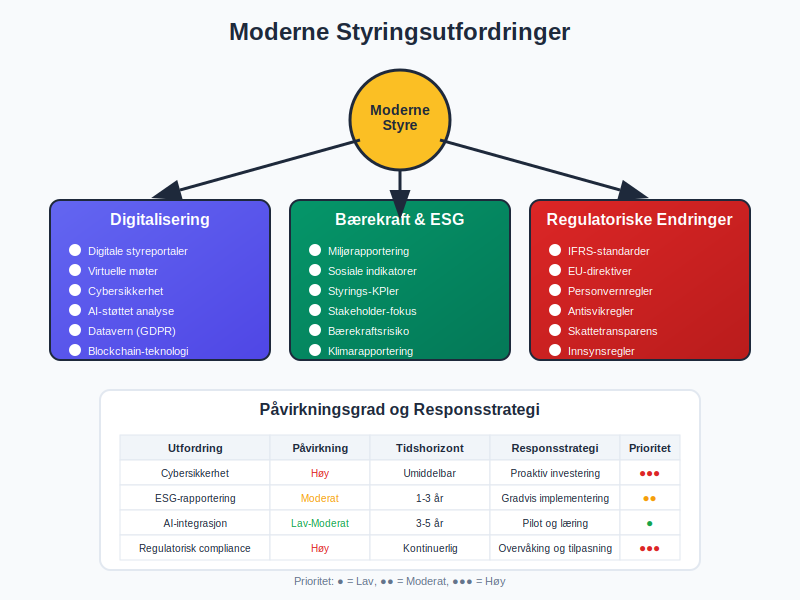

Dagens styrer møter nye utfordringer som krever tilpasning:

**Digitalisering:**
* Implementering av digitale styreportaler og møtesystemer
* Overvåking av [cybersikkerhet](/blogs/regnskap/hva-er-cybersikkerhet "Hva er Cybersikkerhet? Risikoforvaltning i Digital Økonomi") og datavern
* Vurdering av nye teknologiers påvirkning på forretningsmodellen

**Bærekraft og ESG:**
* Integrering av miljø-, sosiale og styringsmessige faktorer (ESG)
* Rapportering på [bærekraftsindikatorer](/blogs/regnskap/hva-er-barekraftsrapportering "Hva er Bærekraftsrapportering? Krav og Implementering")
* Overvåking av selskapets samfunnsansvar

**Regulatoriske endringer:**
* Tilpasning til nye regnskapsstandarder som [IFRS](/blogs/regnskap/hva-er-ifrs "Hva er IFRS? Internasjonale Regnskapsstandarder Forklart")
* Implementering av nye rapporteringskrav
* Overholdelse av [GDPR](/blogs/regnskap/hva-er-gdpr "Hva er GDPR? Personvernforordning og Regnskapskonsekvenser") og andre personvernregler

### Styreevaluering og Utvikling

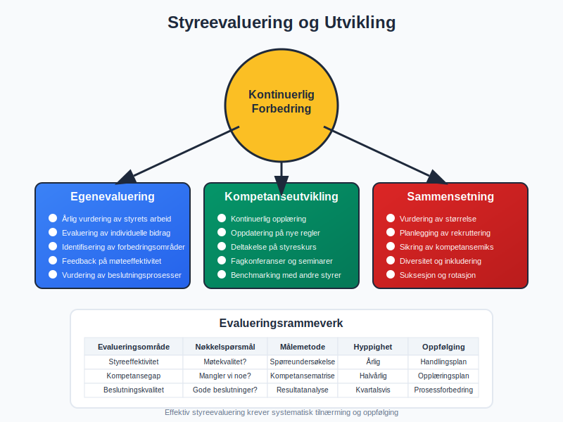

Effektive styrer gjennomfører regelmessig evaluering og utvikling:

**Egenevaluering:**
* Ã…rlig vurdering av styrets arbeid og effektivitet
* Evaluering av individuell kompetanse og bidrag
* Identifisering av forbedringsområder

**Kompetanseutvikling:**
* Kontinuerlig opplæring i relevante fagområder
* Oppdatering på regulatoriske endringer
* Deltakelse på styreskurs og fagkonferanser

**Sammensetning:**
* Regelmessig vurdering av styrets størrelse og sammensetning
* Planlegging av rekruttering av nye medlemmer
* Sikring av riktig kompetansemiks

### Best Practice for Styrearbeid

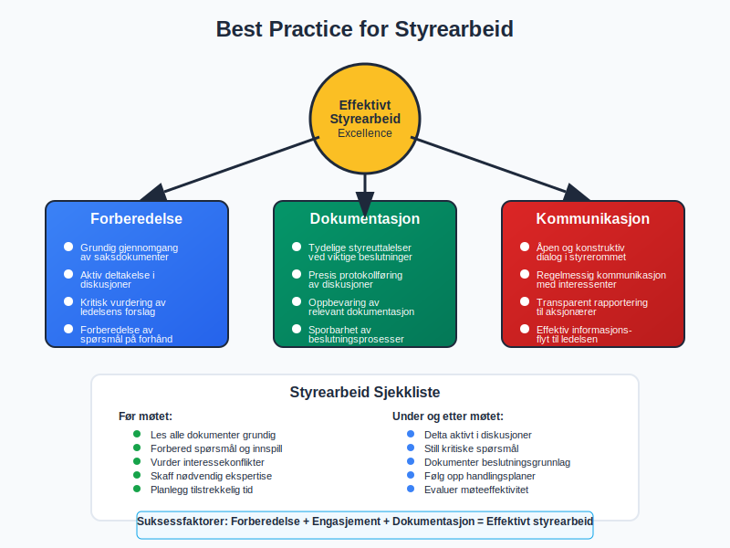

For å sikre effektivt styrearbeid bør følgende prinsipper følges:

**Forberedelse:**
* Grundig gjennomgang av saksdokumenter før møter
* Aktiv deltakelse i diskusjoner og beslutninger
* Kritisk vurdering av ledelsens forslag

**Dokumentasjon:**
* Tydelige styreutalelser ved viktige beslutninger
* Presis protokollføring av diskusjoner og vedtak
* Oppbevaring av relevant dokumentasjon

**Kommunikasjon:**
* Ã…pen og konstruktiv dialog i styrerommet
* Regelmessig kommunikasjon med interessenter
* Transparent rapportering til aksjonærer

### Fremtidens Styre

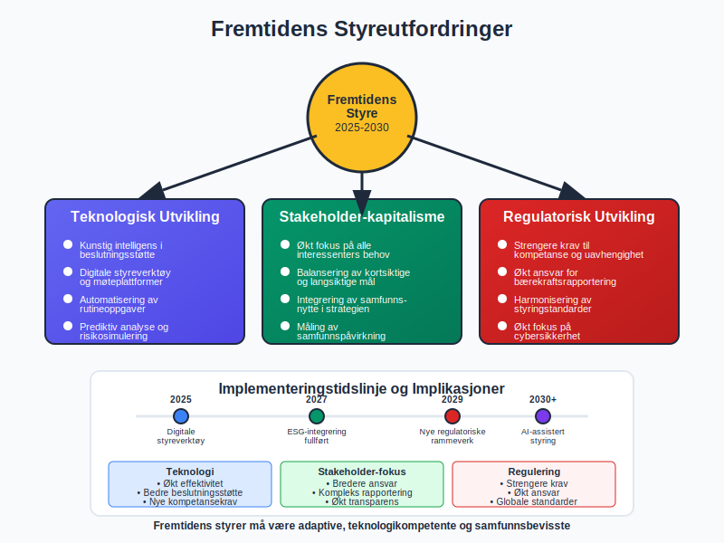

Styrearbeid vil fortsette å utvikle seg i takt med samfunnsendringer:

**Teknologisk utvikling:**
* Bruk av kunstig intelligens i beslutningsstøtte
* Digitale styreverktøy og møteplattformer
* Automatisering av rutineoppgaver

**[Stakeholder-kapitalisme](/blogs/regnskap/kapitalisme "Hva er Kapitalisme? Komplett Guide til Kapitalisme i Økonomi og Regnskap"):**
* Økt fokus på alle interessenters behov
* Balansering av kortsiktige og langsiktige mål
* Integrering av samfunnsnytte i strategien

**Regulatorisk utvikling:**
* Strengere krav til kompetanse og uavhengighet
* Økt ansvar for [bærekraftsrapportering](/blogs/regnskap/hva-er-barekraftsrapportering "Hva er Bærekraftsrapportering? Krav og Implementering")
* Harmonisering av internasjonale styringstandarder

Et effektivt styre er avgjørende for selskapets langsiktige suksess og bærekraft. Ved å forstå og oppfylle sitt ansvar bidrar styret til verdiskaping for aksjonærer samtidig som det sikrer forsvarlig drift og god [selskapsstyring](/blogs/regnskap/hva-er-selskapsstyring "Hva er Selskapsstyring? Prinsipper og Best Practice").
Et **styre** er det sentrale ledelses- og styringsorganet i et [aksjeselskap (AS)](/blogs/regnskap/hva-er-et-aksjeselskap "Hva er et Aksjeselskap? Komplett Guide til Selskapsformen"), valgt av og ansvarlig overfor aksjonærene. Styret fungerer som selskapets øverste beslutningstaker og har det **overordnede ansvaret** for virksomhetens strategiske retning, risikoforvaltning og overvåking av daglig ledelse. I regnskapssammenheng spiller styret en kritisk rolle i finansiell rapportering, kontroll og [internkontroll](/blogs/regnskap/hva-er-internkontroll "Hva er Internkontroll? Systemer for Risikoforvaltning og Compliance").

For en oversikt over ulike lederroller og deres ansvar, se også artikkelen [Leder](/blogs/regnskap/leder "Leder: Roller og Ansvar i Norske Selskaper").

