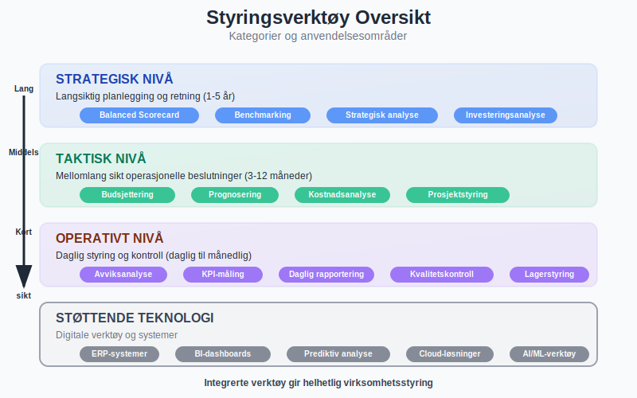
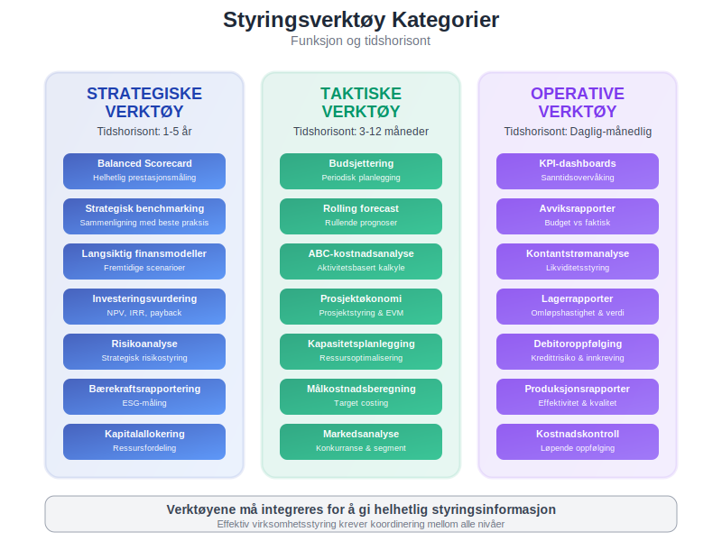
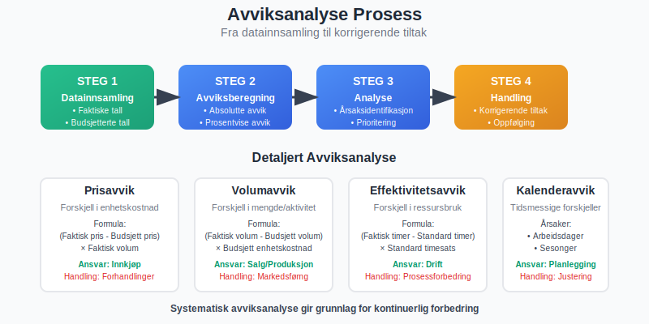
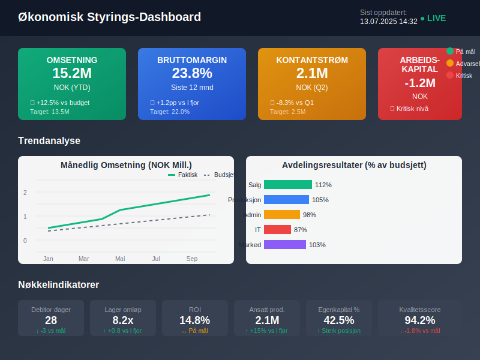
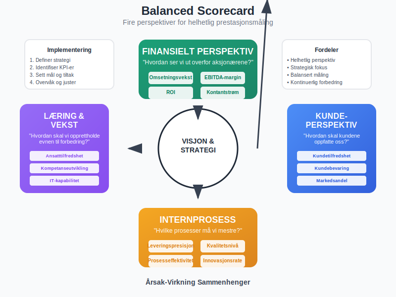
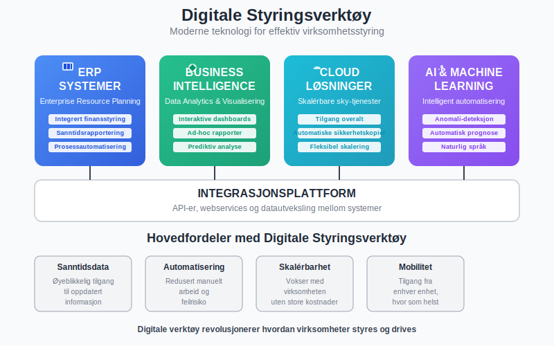
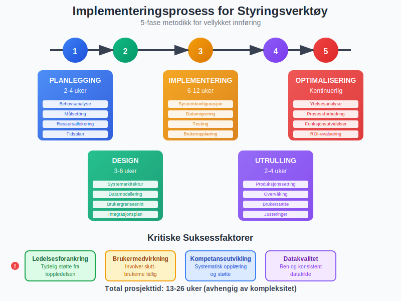
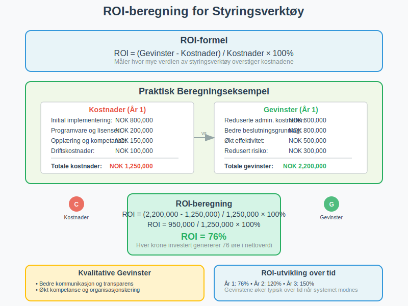
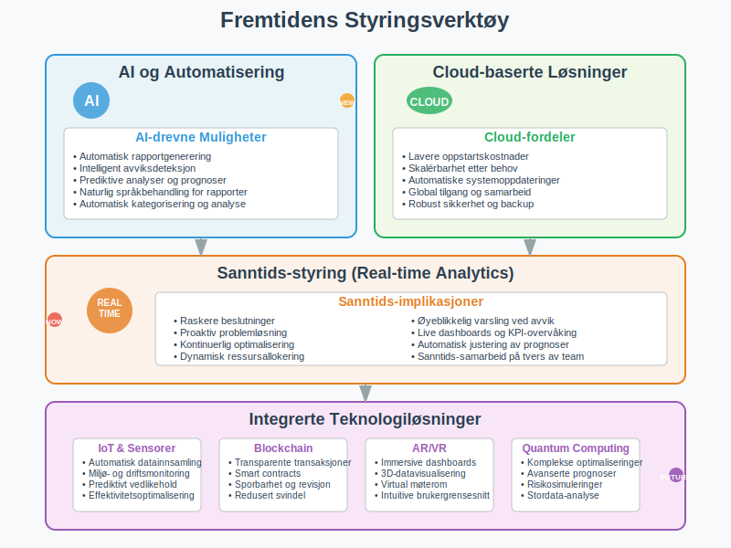
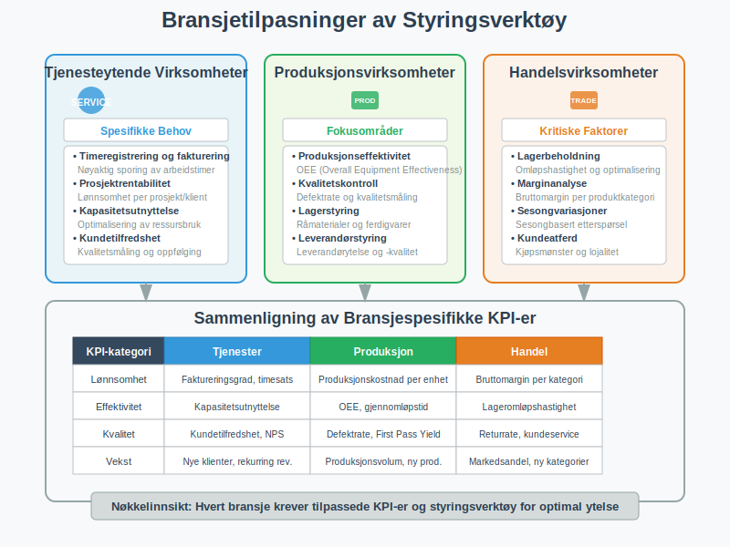

---
title: "Hva er Styringsverktøy i Regnskap?"
meta_title: "Hva er Styringsverktøy i Regnskap?"
meta_description: '**Styringsverktøy** er essensielle instrumenter som hjelper ledere og eiere med å planlegge, kontrollere og evaluere virksomhetens økonomiske prestasjoner. I...'
slug: hva-er-styringsverktoy
type: blog
layout: pages/single
---

**Styringsverktøy** er essensielle instrumenter som hjelper ledere og eiere med å planlegge, kontrollere og evaluere virksomhetens økonomiske prestasjoner. I dagens komplekse forretningslandskap er effektive styringsverktøy avgjørende for å ta informerte beslutninger, optimalisere ressursbruk og sikre langsiktig bærekraft. Denne artikkelen gir en grundig gjennomgang av ulike styringsverktøy innen regnskap og økonomi.

## Seksjon 1: Grunnleggende om Styringsverktøy

**Styringsverktøy** i regnskapssammenheng refererer til systematiske metoder og teknikker som brukes til å samle, analysere og presentere finansiell informasjon for beslutningsformål. Disse verktøyene støtter ledelsen i alle aspekter av virksomhetsstyring, fra daglig drift til strategisk planlegging.

### 1.1 Formål med Styringsverktøy

Hovedformålene med styringsverktøy inkluderer:

* **Planlegging:** Utvikle realistiske [budsjetter](/blogs/regnskap/hva-er-budsjettering "Hva er Budsjettering? Komplett Guide til Budsjettplanlegging") og [prognoser](/blogs/regnskap/hva-er-prognose "Hva er Prognose? Komplett Guide til Finansiell Prognostisering")
* **Kontroll:** Overvåke faktiske resultater mot planlagte mål
* **Evaluering:** Vurdere prestasjoner og identifisere forbedringsområder
* **Beslutningstaking:** Tilby relevante data for strategiske og operative beslutninger

### 1.2 Kategorier av Styringsverktøy

Styringsverktøy kan kategoriseres basert på deres funksjon og tidshorisont:

* **Strategiske verktøy:** Langsiktig planlegging og retning
* **Taktiske verktøy:** Mellomlang sikt operasjonelle beslutninger
* **Operative verktøy:** Daglig styring og kontroll

## Seksjon 2: Finansielle Styringsverktøy

### 2.1 Budsjett og Prognoser

[**Budsjettering**](/blogs/regnskap/hva-er-budsjettering "Hva er Budsjettering? Komplett Guide til Budsjettplanlegging") er et av de mest grunnleggende styringsverktøyene. Det innebærer å lage detaljerte planer for fremtidige inntekter og utgifter.

**Typer budsjetter:**

* **Hovedbudsjett:** Omfattende plan for hele virksomheten
* **Delbudsjetter:** Spesifikke områder som salg, produksjon, administrasjon
* **Rullende budsjetter:** Kontinuerlig oppdaterte planer
* **Nullbasert budsjett:** Bygges opp fra bunnen hver periode

**Prognoseverktøy** supplerer budsjetter ved å gi oppdaterte estimater basert på faktiske resultater og markedsendringer.

### 2.2 Avviksanalyse

**Avviksanalyse** sammenligner faktiske resultater med budsjetterte tall for å identifisere områder som krever oppmerksomhet:

| Avvikstype | Beskrivelse | Handlingsområde |
|------------|-------------|----------------|
| Prisavvik | Forskjell i kostnad per enhet | Innkjøp og forhandlinger |
| Volumavvik | Forskjell i mengde/aktivitet | Produksjon og salg |
| Effektivitetsavvik | Forskjell i ressursbruk | Operasjonelle prosesser |
| Kalenderavvik | Tidsmessige forskjeller | Planlegging og timing |

### 2.3 Nøkkeltall og KPI-er

**Key Performance Indicators (KPI-er)** er målbare verdier som viser hvor effektivt virksomheten oppnår sine mål:

**Lønnsomhetsindikatorer:**
* Bruttomarginer
* [Overskudd](/blogs/regnskap/hva-er-overskudd "Hva er Overskudd? Komplett Guide til Resultat og Lønnsomhet") per ansatt
* [Avkastning](/blogs/regnskap/hva-er-avkastning "Hva er Avkastning? Komplett Guide til Investeringsavkastning") på investert kapital (ROIC)

**Likviditetsindikatorer:**
* [Arbeidskapital](/blogs/regnskap/hva-er-arbeidskapital "Hva er Arbeidskapital? Komplett Guide til Kortsiktig Finansiering")
* Kontantstrøm fra drift
* Betalingsevne-ratio

**Effektivitetsindikatorer:**
* Omløpshastighet for [lagerbeholdning](/blogs/regnskap/hva-er-lagerbeholdning "Hva er Lagerbeholdning? Komplett Guide til Lagerstyring og Verdivurdering")
* Debitorenes gjennomsnittlige betalingstid
* Kapitalproduktivitet

## Seksjon 3: Operasjonelle Styringsverktøy

### 3.1 Kostnadsanalyse og Kalkulasjonsmodeller

**Kostnadsanalyse** hjelper virksomheter å forstå kostnadsdrivere og optimalisere ressursbruk:

**ABC-kalkulation (Activity-Based Costing):**
* Fordeler kostnader basert på aktiviteter
* Gir mer nøyaktig produktkostnad
* Identifiserer kostnadsbesparende muligheter

**Dekningsbidragsanalyse:**
* Fokuserer på variable kostnader
* Hjelper med prissetting og produktmiks-beslutninger
* Støtter kortsiktige beslutninger

### 3.2 Balansert MÃ¥lstyring (Balanced Scorecard)

**Balanced Scorecard** er et strategisk styringsverktøy som evaluerer prestasjoner fra fire perspektiver:

* **Finansielt perspektiv:** Tradisjonelle finansielle mål
* **Kundeperspektiv:** Kundetilfredshet og markedsandel
* **Internprosess-perspektiv:** Operasjonell effektivitet
* **Læring og vekst-perspektiv:** Kompetanseutvikling og innovasjon

### 3.3 Benchmarking

**Benchmarking** sammenligner virksomhetens prestasjoner med bransjestandarder eller beste praksis:

**Typer benchmarking:**
* **Intern benchmarking:** Sammenligning mellom avdelinger
* **Konkurranse-benchmarking:** Sammenligning med konkurrenter
* **Funksjonell benchmarking:** Sammenligning av prosesser på tvers av bransjer
* **Strategisk benchmarking:** Sammenligning av strategier og forretningsmodeller

## Seksjon 4: Moderne Digitale Styringsverktøy

### 4.1 Business Intelligence (BI) Systemer

**BI-systemer** samler data fra ulike kilder og presenterer dem i brukervennlige dashboards:

**Fordeler med BI:**
* Sanntidsrapportering
* Automatiserte analyser
* Visuell datarepresentasjon
* Bedre beslutningsgrunnlag

### 4.2 [ERP-systemer](/blogs/regnskap/hva-er-erp-system "Hva er ERP-system? Komplett Guide til Enterprise Resource Planning")

**Enterprise Resource Planning (ERP)** integrerer alle forretningsprosesser i ett system:

**ERP-moduler relevante for styring:**
* Finansiell rapportering
* [Budsjettplanlegging](/blogs/regnskap/hva-er-budsjettering "Hva er Budsjettering? Komplett Guide til Budsjettplanlegging")
* Prosjektstyring
* Lagerstyring

### 4.3 Prediktiv Analyse

**Prediktiv analyse** bruker historiske data og maskinlæring for å forutsi fremtidige resultater:

**Anvendelsesområder:**
* Etterspørselsprognoser
* Kredittvurderinger
* Risikohåndtering
* Kapasitetsplanlegging

## Seksjon 5: Implementering av Styringsverktøy

### 5.1 Planlegging og Forberedelse

**Suksessfaktorer for implementering:**

* **Tydelige mål:** Definer hva som skal oppnås
* **Ledelsesforankring:** Sikre støtte fra toppledelsen
* **Brukermedvirkning:** Involver de som skal bruke verktøyene
* **Kompetanseutvikling:** Tren ansatte i bruk av nye systemer

### 5.2 Kritiske Suksessfaktorer

**Faktorer som påvirker suksess:**

| Faktor | Betydning | Handlingsområde |
|--------|-----------|----------------|
| Datakvalitet | Høy | Standardisering og validering |
| Brukeradopsjon | Høy | Opplæring og støtte |
| Systemintegrasjon | Medium | Teknisk planlegging |
| Kostnads-nytte | Høy | ROI-analyse og oppfølging |

### 5.3 Utfordringer og Fallgruver

**Vanlige utfordringer:**
* **Datasiloer:** Informasjon som ikke deles mellom systemer
* **Motstand mot endring:** Ansatte som ikke ønsker nye arbeidsmetoder
* **Tekniske problemer:** Systemfeil og integrasjonsproblemer
* **Mangelfull opplæring:** Utilstrekkelig kunnskap om verktøyene

## Seksjon 6: MÃ¥ling av Effektivitet

### 6.1 ROI av Styringsverktøy

**Return on Investment (ROI)** måler hvor mye verdien av styringsverktøy overstiger kostnadene:

**Beregning:**
ROI = (Gevinster - Kostnader) / Kostnader × 100%

**Gevinster kan inkludere:**
* Reduserte administrative kostnader
* Bedre beslutningsgrunnlag
* Økt effektivitet
* Redusert risiko

### 6.2 Kvalitative Gevinster

**Ikke-monetære fordeler:**
* Bedre kommunikasjon
* Økt gjennomsiktighet
* Forbedret kompetanse
* Sterkere organisasjonskultur

## Seksjon 7: Fremtidige Trender

### 7.1 Kunstig Intelligens og Automatisering

**AI-drevne styringsverktøy** vil revolusjonere hvordan virksomheter styres:

**Muligheter:**
* Automatisk rapportgenerering
* Intelligent avviksdeteksjon
* Prediktive analyser
* Naturlig språkbehandling for rapporter

### 7.2 Cloud-baserte Løsninger

**Sky-teknologi** gjør avanserte styringsverktøy tilgjengelige for mindre virksomheter:

**Fordeler:**
* Lavere oppstartskostnader
* Skalérbarhet
* Automatiske oppdateringer
* Tilgang fra hvor som helst

### 7.3 Sanntids-styring

**Real-time analytics** gir øyeblikkelig innsikt i virksomhetens prestasjoner:

**Implikasjoner:**
* Raskere beslutninger
* Proaktiv problemløsning
* Kontinuerlig optimalisering
* Dynamisk ressursallokering

## Seksjon 8: Bransjetilpasninger

### 8.1 Tjenesteytende Virksomheter

**Spesifikke behov:**
* [Timeregistrering](/blogs/regnskap/hva-er-timeforing "Hva er Timeføring? Komplett Guide til Tidsregistrering") og fakturering
* Prosjektrentabilitet
* Kapasitetsutnyttelse
* Kundetilfredshet

### 8.2 Produksjonsvirksomheter

**Fokusområder:**
* Produksjonseffektivitet
* Kvalitetskontroll
* Lagerstyring
* Leverandørstyring

### 8.3 Handelsvirksomheter

**Kritiske faktorer:**
* [Lagerbeholdning](/blogs/regnskap/hva-er-lagerbeholdning "Hva er Lagerbeholdning? Komplett Guide til Lagerstyring og Verdivurdering") og omløpshastighet
* Marginanalyse
* Sesongvariasjoner
* Kundeatferd

## Konklusjon

**Styringsverktøy** er uunnværlige for moderne virksomhetsledelse. De gir den nødvendige innsikten og kontrollen som kreves for å navigere i et komplekst og konkurransedyktig marked. Ved å velge riktige verktøy og implementere dem effektivt, kan virksomheter oppnå bedre prestasjoner, redusert risiko og økt konkurranseevne.

Suksess med styringsverktøy krever en helhetlig tilnærming som kombinerer teknologi, prosesser og mennesker. Det er viktig Ã¥ huske at verktøyene i seg selv ikke skaper verdi “ det er hvordan de brukes og integreres i virksomhetens beslutningsprosesser som avgjør deres effektivitet.

I fremtiden vil styringsverktøy bli enda mer sofistikerte og tilgjengelige, med kunstig intelligens og automatisering som driver innovasjon. Virksomheter som investerer i moderne styringsverktøy og bygger kompetanse rundt deres bruk, vil være best posisjonert for fremtidig suksess.

