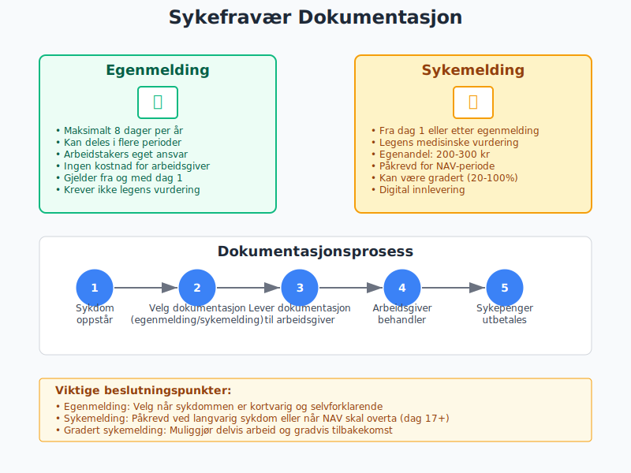
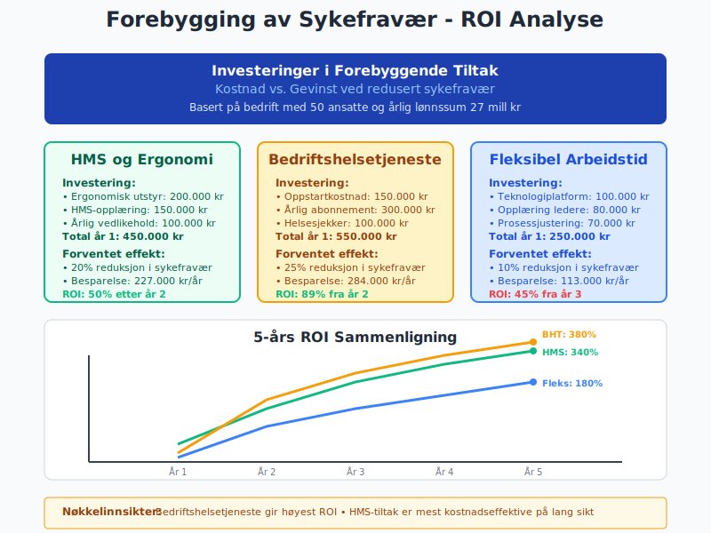
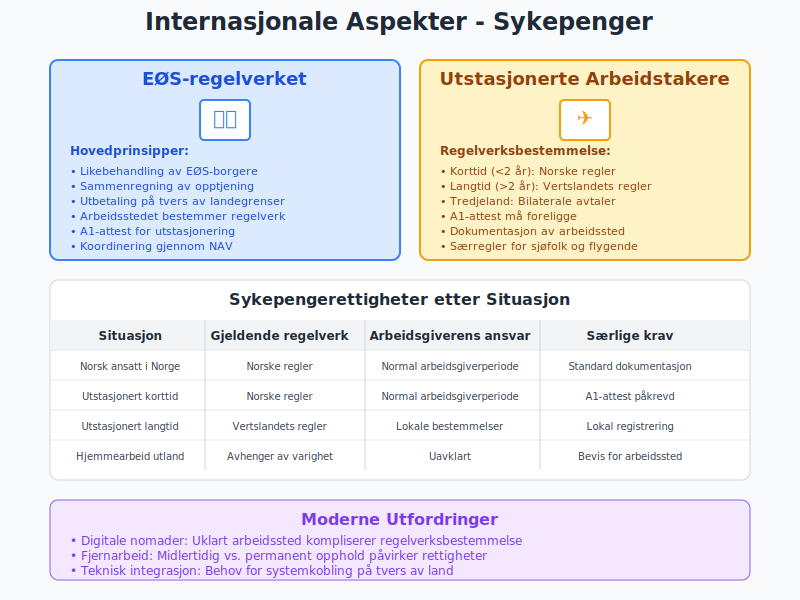

**Sykepenger** er en viktig del av det norske trygdesystemet som sikrer lønnsmottakere økonomisk trygghet ved sykdom. For arbeidsgivere innebærer sykepengeordningen betydelige administrative og økonomiske forpliktelser som påvirker [lønnskostnader](/blogs/regnskap/hva-er-loennskostnad "Hva er Lønnskostnad? Beregning og Regnskapsføring") og [kontantstrøm](/blogs/regnskap/hva-er-kontantstrom "Hva er Kontantstrøm? Analyse og Forvaltning av Bedriftens Pengestrøm"). Forståelse av sykepengeordningen er essensielt for korrekt regnskapsføring og effektiv personaladministrasjon.

## Seksjon 1: Grunnleggende om Sykepengeordningen

Sykepengeordningen er et **lovpålagt trygdeytelse** som dekker inntektsbortfall ved sykdom. Ordningen finansieres gjennom [arbeidsgiveravgift](/blogs/regnskap/hva-er-arbeidsgiveravgift "Hva er Arbeidsgiveravgift? Beregning og Regnskapsføring") og trygdeavgift, og administreres av NAV i samarbeid med arbeidsgivere.


### 1.1 Lovgrunnlag og Rettigheter

**Folketrygdloven** regulerer sykepengeordningen:

* **Rett til sykepenger:** Alle lønnsmottakere med minimum 14 dagers ansettelse
* **Opptjeningskrav:** Ingen minimum opptjeningstid for ansatte
* **Sykepengeperiode:** Maksimalt 52 uker (364 dager) innen 3 år
* **Ventetid:** 1 dag (arbeidsgiverperioden starter dag 2)

### 1.2 Arbeidsgiverens Ansvar vs. NAVs Ansvar

**Ansvarsfordeling** mellom arbeidsgiver og NAV:

| **Periode** | **Ansvarlig** | **Dekning** | **Finansiering** |
|-------------|---------------|-------------|------------------|
| Dag 1 | Ingen | Egenandel (ikke dekket) | Arbeidstaker |
| Dag 2-16 | Arbeidsgiver | 100% av lønn | Arbeidsgiver |
| Dag 17-364 | NAV | 100% av lønn (maks G-grenser) | Folketrygden |


### 1.3 Grunnlagsbeløpet (G) og Beregningsgrunnlag

**Grunnlagsbeløpet** setter øvre grense for sykepengeberegning:

* **2024:** G = 118.620 kroner
* **Maksimal årslønn for sykepenger:** 6G = 711.720 kroner
* **Beregningsgrunnlag:** Gjennomsnittlig månedslønn siste 3 måneder

**Eksempel beregning:**
```
Månedslønn: 50.000 kr
Årlønn: 600.000 kr (under 6G-grensen)
Sykepengeberegning: 50.000 kr × 100% = 50.000 kr/måned
```

## Seksjon 2: Arbeidsgiverperioden (Dag 2-16)

### 2.1 Arbeidsgiverens Forpliktelser

**Arbeidsgiverperioden** pålegger arbeidsgiver full lønnsplikt:

#### Hovedregler:
* **Varighet:** 16 kalenderdager (3 uker og 2 dager)
* **Dekningsgrad:** 100% av ordinær lønn
* **Dokumentasjon:** Legeerklæring eller egenmelding
* **Regnskapsføring:** Som ordinær lønnskostnad

### 2.2 Egenmelding vs. Sykemelding

**Dokumentasjonsalternativer** for sykefravær:

| **Type** | **Varighet** | **Vilkår** | **Kostnad** |
|----------|-------------|------------|-------------|
| Egenmelding | Maksimalt 8 dager (kan deles) | Arbeidstakers vurdering | Gratis for arbeidsgiver |
| Sykemelding | Fra dag 1 eller etter egenmelding | Legens vurdering | Egenandel: 200-300 kr |



### 2.3 Regnskapsføring av Arbeidsgiverperioden

**Bokføring** av sykepenger i arbeidsgiverperioden:

```
Debet: Lønnskostnad
Kredit: Utbetalt lønn/Skyldig lønn

MÃ¥nedlig periodisering:
Debet: Lønnskostnad (sykepenger)
Kredit: Påløpte lønnskostnader
```

**Eksempel:**
```
Ansatt med månedslønn 45.000 kr er syk i 10 dager
Daglønn: 45.000 ÷ 21,75 = 2.069 kr
Sykepengekostnad: 2.069 × 9 dager = 18.621 kr
(1 dag egenandel, 9 dager arbeidsgivertilskudd)
```


## Seksjon 3: NAV-perioden (Dag 17-364)

### 3.1 Overgang til NAV

**Overgangen** fra arbeidsgiverperiode til NAV-periode:

#### Arbeidsgiverens oppgaver:
* **Inntektsmelding:** Sendes til NAV innen 17 dager
* **Lønnsopplysninger:** Siste 3 måneders lønnsdata
* **Fraværsperiode:** Dokumentasjon av sammenhengende sykefravær
* **Refusjonskrav:** Om arbeidsgiver skal motta sykepenger

### 3.2 Refusjon vs. Direkteutbetaling

**To hovedmodeller** for utbetaling i NAV-perioden:

| **Modell** | **Utbetaling til** | **Arbeidsgiverens rolle** | **Regnskapsføring** |
|------------|-------------------|---------------------------|-------------------|
| Refusjon | Arbeidsgiver | Utbetaler lønn, mottar refusjon | [Fordring](/blogs/regnskap/hva-er-fordringer "Hva er Fordringer? Komplett Guide til Kundefordringer og Andre Fordringer") på NAV |
| Direkteutbetaling | Arbeidstaker | Minimal (kun rapportering) | Ingen lønnskostnad |

### 3.3 Inntektsmelding til NAV

**Inntektsmeldingen** inneholder kritisk informasjon:

#### Obligatoriske opplysninger:
* **Inntekt siste 3 måneder:** Grunnlag for beregning
* **Fastlønn vs. variabel lønn:** Påvirker beregningsmetode
* **Feriepenger:** Behandling av opptjente feriepenger
* **Naturalytelser:** [Firmabil](/blogs/regnskap/hva-er-firmabil "Hva er Firmabil? Regnskapsføring og Skattemessige Konsekvenser"), fri telefon, etc.


### 3.4 Regnskapsføring med Refusjon

**Refusjonsmodellen** krever spesiell regnskapsbehandling:

#### Månedlig bokføring:
```
Ved lønnsutbetaling:
Debet: Lønnskostnad
Kredit: Utbetalt lønn

Ved refusjonskrav:
Debet: Fordring NAV (sykepenger)
Kredit: Lønnskostnad

Ved mottatt refusjon:
Debet: Bank
Kredit: Fordring NAV (sykepenger)
```

## Seksjon 4: Spesielle Situasjoner og Utfordringer

### 4.1 Gradert Sykmelding

**Gradert sykmelding** tillater delvis arbeid under sykdom:

#### Beregningseksempel:
```
Månedslønn: 50.000 kr
Sykemeldingsgrad: 60%
Arbeidsgrad: 40%

Utbetaling fra arbeidsgiver: 50.000 × 40% = 20.000 kr
Sykepenger fra NAV: 50.000 × 60% = 30.000 kr
Total utbetaling: 50.000 kr (100% av lønn)
```


### 4.2 Kombinasjon med Andre Ytelser

**Sykepenger** kan kombineres med andre trygdeytelser:

| **Ytelse** | **Kombinasjonsregel** | **Regnskapsimplikasjon** |
|------------|----------------------|--------------------------|
| [Uføretrygd](/blogs/regnskap/skatt-pa-uforetrygd "Skatt på Uføretrygd - Komplett Guide til Beregning og Regnskapsføring") | Gradert kombinasjon mulig | Kompleks lønnsberegning |
| [Foreldrepenger](/blogs/regnskap/fodselspermisjon "Fødselspermisjon “ Guide til regnskapsføring av foreldrepenger") | Gjensidig utelukkende | Enten/eller situasjon |
| Arbeidsavklaringspenger | Erstatter sykepenger | Overgang mellom ordninger |

### 4.3 Feriepenger under Sykdom

**Feriepenger** opptjenes ikke under sykeperioder:

#### Regnskapsføring:
* **Arbeidsgiverperioden:** Normal feriepengeoppbokking
* **NAV-perioden:** Ingen feriepengeoppbokking på sykepengedelen
* **Avsetning:** Redusert feriepengeforpliktelse

```
Normal månedslønn: 50.000 kr
Feriepengeoppbokking: 50.000 × 12% = 6.000 kr

Sykepengemåned (NAV):
Lønn fra arbeidsgiver: 0 kr
Feriepengeoppbokking: 0 kr
```


## Seksjon 5: Administrative Systemer og Digitalisering

### 5.1 A-ordningen og Sykepengeintegrasjon

**A-ordningen** forenkler sykepengeadministrasjon:

#### Fordeler for arbeidsgivere:
* **Integrert rapportering:** Lønn og sykepenger i samme system
* **Automatisk dataoverføring:** Reduserer manuelt arbeid
* **Sanntidsoppdatering:** Raskere saksbehandling hos NAV
* **Feilreduksjon:** Mindre risiko for rapporteringsfeil

### 5.2 Digitale Verktøy og Automatisering

**Moderne lønnssystemer** automatiserer sykepengehåndtering:

| **Funksjon** | **Fordel** | **Implementering** |
|-------------|------------|-------------------|
| Automatisk inntektsmelding | Raskere NAV-behandling | API-integrasjon |
| Refusjonshåndtering | Forbedret [kontantstrøm](/blogs/regnskap/hva-er-kontantstrom "Hva er Kontantstrøm? Analyse og Forvaltning av Bedriftens Pengestrøm") | Automatisk oppfølging |
| Rapportgenerering | Bedre kontroll og oversikt | Dashboard og alerts |


### 5.3 Compliance og Kontroll

**Internkontroll** for sykepengeadministrasjon:

#### Kontrollpunkter:
* **Fristoverholdelse:** Inntektsmeldinger innen 17 dager
* **Dokumentkontroll:** Valide sykemeldinger og egenmeldinger
* **Beregningskontroll:** Korrekt grunnlag og satser
* **Refusjonskontroll:** Sporbarhet av utestående fordringer

## Seksjon 6: Kostnadsanalyse og Budsjettering

### 6.1 Totalkostnad for Arbeidsgiver

**Sykepengerkostnader** utgjør betydelig kostnadspost:

#### Direkte kostnader:
* **Arbeidsgiverperioden:** 16 dager full lønn
* **Administrasjonskostnader:** HR-tid og systemkostnader
* **Vikarieringskosotnader:** Midlertidig personale
* **Produktivitetstap:** Redusert effektivitet

#### Indirekte kostnader:
* **Opplæringskostnader:** For vikarer og nye ansatte
* **Kompetansetap:** Midlertidig tap av spesialkompetanse
* **Planleggingsutfordringer:** Prosjektforsinkelser


### 6.2 Budsjettmessige Hensyn

**Budsjettering** av sykepengerkostnader:

#### Erfaringsbasert budsjetting:
```
Gjennomsnittlig sykefravær: 4,2% (SSB 2023)
Årlig lønnssum: 10.000.000 kr
Estimert sykepengerkostnad: 420.000 kr
Arbeidsgiverperiode (ca. 30%): 126.000 kr
```

#### Bransjespesifikke variasjoner:
| **Bransje** | **Sykefravær %** | **Kostnadsfaktor** |
|-------------|------------------|-------------------|
| Helse og omsorg | 8-12% | Høy |
| IT og teknologi | 2-4% | Lav |
| Industri | 5-7% | Middels |
| Offentlig sektor | 6-8% | Middels-høy |

### 6.3 Forebyggende Tiltak og ROI

**Investeringer** i sykefraværsreduksjon:

#### Tiltak og forventet effekt:
* **Helse- og miljøarbeid (HMS):** 10-20% reduksjon
* **Fleksible arbeidsordninger:** 5-15% reduksjon
* **Bedriftshelsetjeneste:** 15-25% reduksjon
* **Fysisk tilrettelegging:** 10-30% reduksjon



## Seksjon 7: Skattemessige Aspekter

### 7.1 Skattepliktig Inntekt

**Sykepenger** er [skattepliktig inntekt](/blogs/regnskap/hva-er-skattepliktig-inntekt "Hva er Skattepliktig Inntekt? Beregning og Optimalisering"):

#### For arbeidstaker:
* **Ordinær skattesats:** Som vanlig lønnsinntekt
* **Trygdeavgift:** 8,2% (redusert sats 5,1% for pensjonister)
* **[Forskuddstrekk](/blogs/regnskap/hva-er-forskuddstrekk "Hva er Forskuddstrekk? Beregning og Innbetaling"):** Trekkes automatisk

#### For arbeidsgiver:
* **Arbeidsgiveravgift:** Påløper ikke på sykepenger fra NAV
* **Refusjon:** Ikke skattepliktig inntekt for arbeidsgiver
* **Feriepenger:** Redusert avsetning gir skattemessig gevinst

### 7.2 MVA-behandling

**Merverdiavgift** påvirkes ikke av sykepengeordningen:

* **Lønnskostnader:** Ikke MVA-pliktige transaksjoner
* **Sykepenger:** Behandles som lønnskostnader
* **Administrasjonskostnader:** Normal MVA-fradragsrett


## Seksjon 8: Internasjonale Aspekter

### 8.1 EØS-regelverket

**Trygdekoordinering** innen EØS påvirker sykepengerettigheter:

#### Hovedprinsipper:
* **Likebehandling:** EØS-borgere behandles likt
* **Sammmenregning:** Opptjening fra flere EØS-land
* **Utbetaling:** Kan skje på tvers av landegrenser
* **Arbeidsgiveransvar:** Følger arbeidsstedet

### 8.2 Utstasjonerte Arbeidstakere

**Utstasjonering** kompliserer sykepengeforhold:

| **Situasjon** | **Gjeldende regelverk** | **Arbeidsgiverens ansvar** |
|---------------|------------------------|---------------------------|
| Korttids utstasjonering (<2 år) | Norske regler | Normal arbeidsgiverperiode |
| Langtids utstasjonering (>2 år) | Vertslandets regler | Lokale bestemmelser |
| Tredjeland | Bilaterale avtaler | Avtaleavhengig |

### 8.3 Digitale Nomader og Fjernarbeid

**Moderne arbeidsformer** skaper nye utfordringer:

#### Avklaringsbehov:
* **Arbeidssted vs. bosted:** Hvilket regelverk gjelder?
* **Midlertidig vs. permanent:** Tidsaspektets betydning
* **Dokumentasjon:** Bevis for arbeidssted og opphold
* **Teknisk løsning:** Systemintegrasjon på tvers av land



## Seksjon 9: Fremtidige Utviklingstrekk

### 9.1 Digitalisering og Automatisering

**Teknologiutvikling** endrer sykepengeadministrasjon:

#### Kommende innovasjoner:
* **AI-assistert saksbehandling:** Raskere NAV-behandling
* **Blockchain-basert dokumentasjon:** Manipulasjonssikre sykemeldinger
* **Prediktiv analyse:** Forebygging basert på datamønstre
* **Integrerte helsedata:** Kobling mellom helse- og lønnssystemer

### 9.2 Politiske Reformforslag

**Politisk debatt** om sykepengeordningen:

#### Aktuelle forslag:
* **Utvidet arbeidsgiverperiode:** Fra 16 til 21-30 dager
* **Gradert egenandel:** Økende egenandel ved gjentatt sykefravær
* **Bonus/malus-system:** Belønning for lavt sykefravær
* **Regionalisering:** Tilpasning til lokale arbeidsmarkedsforhold

### 9.3 Bærekraft og Demografiske Utfordringer

**Langsiktige utfordringer** for ordningen:

#### Demografiske faktorer:
* **Aldrende befolkning:** Økt sykefravær i eldre aldersgrupper
* **Arbeidslivsutvikling:** Endrede jobber og belastninger
* **Kostnadsvekst:** Økte kostnader for folketrygden
* **Finansieringsbehov:** Behov for økte avgifter eller kutt


## Seksjon 10: Praktiske Verktøy og Ressurser

### 10.1 Systemer og Teknologi

**Anbefalte verktøy** for sykepengeadministrasjon:

| **System** | **Hovedfunksjon** | **Integrasjoner** |
|------------|------------------|-------------------|
| Visma Enterprise | Komplett lønnssystem | A-ordningen, NAV |
| Unit4 Business World | ERP med lønnsmodul | Altinn, Arbeidstilsynet |
| SAP SuccessFactors | HR og lønn | Direkte NAV-integrasjon |
| Aditro | Lønn og personalsystem | Automatisk inntektsmelding |

### 10.2 Compliance-sjekklister

**MÃ¥nedlige oppgaver:**
- [ ] Kontroller påløpte sykepenger i [lønnskjøringen](/blogs/regnskap/hva-er-loenn "Hva er Lønn? Beregning og Regnskapsføring av Lønnskostnader")
- [ ] Avstem utestående fordringer mot NAV
- [ ] Rapporter sykefraværsstatistikk til ledelsen
- [ ] Oppdater budsjetter med faktiske kostnader

**Ã…rlige oppgaver:**
- [ ] Gjennomgå sykepengerutiner og prosedyrer
- [ ] Evaluere kostnadsutviklingen og årsaker
- [ ] Vurder investeringer i forebyggende tiltak
- [ ] Oppdater systemintegrasjoner og automasjonsgrad

### 10.3 Nøkkeltall og KPIer

**Viktige styringsparametere:**

#### Sykefraværs-KPIer:
* **Samlet sykefravær:** Totale fraværsdager/totale arbeidsdager
* **Korttidsfravær:** Fravær under 16 dager (arbeidsgiverperioden)
* **Langtidsfravær:** Fravær over 16 dager (NAV-perioden)
* **Gjentakende fravær:** Samme ansatt, flere perioder

#### Kostnadsindikatorer:
* **Sykepengerkostnad per ansatt:** Årlig beløp/gjennomsnittlig antall ansatte
* **Arbeidsgiverperiode vs. total kostnad:** Andel av total sykepengerkostnad
* **Administrasjonskostnader:** Indirekte kostnader som andel av direkte
* **ROI forebyggende tiltak:** Besparelser vs. investeringskostnader


## Seksjon 11: Juridiske Aspekter og Tvister

### 11.1 Arbeidsrettslige Problemstillinger

**Vanlige konfliktsituasjoner:**

#### Oppsigelse under sykdom:
* **Verneregler:** Begrenset oppsigelsesadgang
* **Dokumentasjonskrav:** Saklig grunn utover sykdom
* **Tilretteleggingsplikt:** Arbeidsgivers forpliktelser
* **Prosessuelle krav:** Korrekt saksbehandling

#### Mistanke om misligheter:
* **Kontrollrettigheter:** Arbeidsgivers kontrollmuligheter
* **Personvernhensyn:** GDPR og personopplysningsloven
* **Bevisbyrde:** Krav til dokumentasjon
* **Sanksjoner:** Konsekvenser ved mislighold

### 11.2 NAV og Forvaltningspraksis

**Klageadgang** og rettssikkerhet:

#### Klageprosess:
1. **Klage til NAV:** Innen 6 uker
2. **Ny vurdering:** NAV gjenopptar saken
3. **Klage til NAV Klageinstans:** Hvis ikke medhold
4. **Sivilrettslig søksmål:** Siste instans

#### Vanlige klageområder:
* **Beregningsgrunnlag:** Uenighet om lønnsbasis
* **Periodeberegning:** Start- og sluttdato for ytelser
* **Refusjonskrav:** Behandling av arbeidsgiverrefusjon
* **Frister:** Konsekvenser av oversittelse


### 11.3 Forsikringsløsninger

**Tilleggsdekning** gjennom forsikring:

#### Sykepengeforsikring:
* **Utvidet arbeidsgiverperiode:** Dekning utover 16 dager
* **Vikarutgifter:** Kostnader ved vikariering
* **Lederdekning:** Særskilt dekning for nøkkelpersonell
* **Sykelønn over 6G:** Dekning for høye lønninger

#### Forsikringsbetingelser:
| **Type** | **Dekningsgrad** | **Egenandel** | **Premie** |
|----------|------------------|---------------|------------|
| Basis sykepengeforsikring | 80-100% | 0-5 dager | 0,5-1,5% av lønnssum |
| Utvidet dekning | 100% + vikar | 0 dager | 1,5-3% av lønnssum |
| Premium løsning | 100% + tillegg | Ingen | 3-5% av lønnssum |

## Konklusjon

**Sykepenger** representerer en kompleks krysning mellom trygderett, arbeidsrett og regnskapsføring som krever grundig forståelse og profesjonell administrasjon. Fra den innledende 16-dagers arbeidsgiverperioden til den langvarige NAV-perioden, påvirker sykepengeordningen alle aspekter av [personaladministrasjon](/blogs/regnskap/hva-er-personaladministrasjon "Hva er Personaladministrasjon? Komplett Guide til HR og Lønnsrutiner") og [økonomistyring](/blogs/regnskap/hva-er-okonomistyring "Hva er Økonomistyring? Planlegging og Kontroll av Bedriftens Økonomi").

**Nøkkelinnsikter:**

* **Dobbelt ansvar:** Arbeidsgivere har både juridiske og økonomiske forpliktelser
* **Teknologisk transformasjon:** Digitalisering forenkler administrasjon men krever systemintegrasjon
* **Kostnadskontroll:** Proaktiv forebygging og effektiv administrasjon reduserer totalkostnader
* **Compliance-fokus:** Korrekt håndtering minimerer juridisk risiko og sikrer ansattes rettigheter

**Praktisk anvendelse:**

For regnskapsførere, personalledere og bedriftsledere er forståelse av sykepengeordningen kritisk for:
- **Nøyaktig [kostnadsberegning](/blogs/regnskap/hva-er-kostnadsberegning "Hva er Kostnadsberegning? Metoder og Praktisk Anvendelse")** og budsjettplanlegging
- **Effektiv [kontantstrømstyring](/blogs/regnskap/hva-er-kontantstrom "Hva er Kontantstrøm? Analyse og Forvaltning av Bedriftens Pengestrøm")** gjennom forutsigbar refusjonshåndtering
- **Risikominimering** gjennom korrekt dokumentasjon og fristoverholdelse
- **Strategisk personalplanlegging** som inkluderer sykefraværskostnader

**Fremtidsrettet perspektiv:**

Sykepengeordningen utvikler seg kontinuerlig med teknologiske fremskritt, demografiske endringer og politiske reformer. Bedrifter som investerer i moderne administrasjonssystemer, forebyggende helsearbeid og robust [internkontroll](/blogs/regnskap/hva-er-internkontroll "Hva er Internkontroll? Prinsipper og Implementering i Bedriften") vil være best posisjonert for fremtidige endringer.

Den praktiske håndteringen av sykepenger er ikke bare en administrativ oppgave - det er en strategisk mulighet for å demonstrere ansvarlighet som arbeidsgiver, optimalisere [driftskostnader](/blogs/regnskap/hva-er-driftskostnader "Hva er Driftskostnader? Klassifisering og Regnskapsføring") og bygge et bærekraftig arbeidsfellesskap som prioriterer både produktivitet og ansattes velferd.


