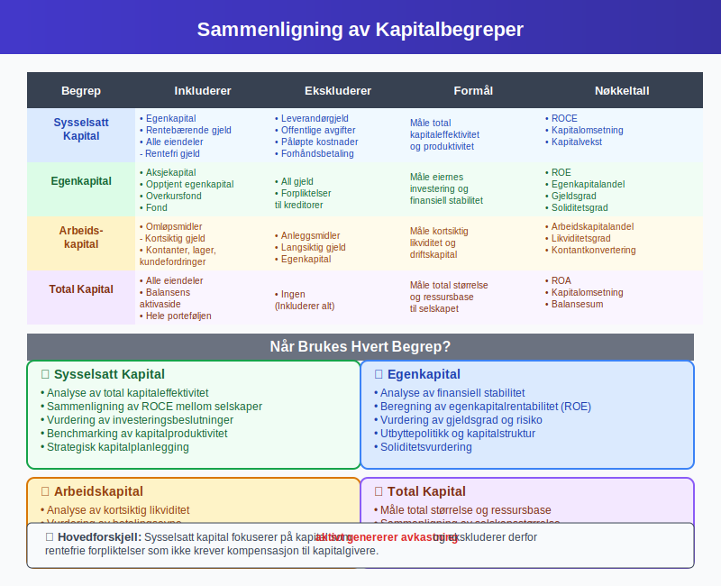

**Sysselsatt kapital** er den totale [kapitalen](/blogs/regnskap/hva-er-kapital "Hva er Kapital? Komplett Guide til Kapitaltyper i Regnskap og Økonomi") som en bedrift aktivt bruker i sin virksomhet for å generere inntekter og [overskudd](/blogs/regnskap/hva-er-overskudd "Hva er Overskudd? Definisjon, Beregning og Betydning i Regnskap"). Dette omfatter både [egenkapital](/blogs/regnskap/hva-er-egenkapital "Hva er Egenkapital? Komplett Guide til Egenkapital i Regnskap") og [fremmedkapital](/blogs/regnskap/hva-er-fremmedkapital "Hva er Fremmedkapital? Komplett Guide til Gjeld og Lånefinansiering") som aktivt benyttes i driften. Sysselsatt kapital er et sentralt begrep i finansiell analyse og brukes til å måle hvor effektivt et selskap bruker sine totale ressurser til å skape verdier.

### Definisjon og Grunnleggende Forståelse

Sysselsatt kapital kan defineres på flere måter, avhengig av perspektiv og analysemetode:

#### Balanseperspektiv
**Sysselsatt kapital = Totale eiendeler - Rentefrie gjeld**

Dette inkluderer:
- [**Egenkapital**](/blogs/regnskap/hva-er-egenkapital "Hva er Egenkapital? Komplett Guide til Egenkapital i Regnskap")
- **Rentebærende gjeld** (banklån, obligasjoner, etc.)
- Ekskluderer rentefrie forpliktelser som [leverandørgjeld](/blogs/regnskap/hva-er-leverandorgjeld "Hva er Leverandørgjeld? Komplett Guide til Kortsiktig Gjeld")

#### Finansieringsperspektiv
**Sysselsatt kapital = Egenkapital + Rentebærende gjeld**

Dette perspektivet fokuserer på kapitalkildene som krever avkastning.

### Komponenter av Sysselsatt Kapital

#### 1. Egenkapital
[Egenkapital](/blogs/regnskap/hva-er-egenkapital "Hva er Egenkapital? Komplett Guide til Egenkapital i Regnskap") representerer eiernes investering og er en hovedkomponent:
- **[Aksjekapital](/blogs/regnskap/hva-er-aksjekapital "Hva er Aksjekapital? Krav og Forklaring")**
- **Opptjent egenkapital**
- **Overkursfond**
- **Andre egenkapitalposter**

#### 2. Rentebærende Gjeld
Gjeld som krever rentebetalinger:
- **Banklån** (kortsiktige og langsiktige)
- **Obligasjoner**
- **[Konvertible lån](/blogs/kontoplan/2200-konvertible-lan "Konto 2200 - Konvertible lån i Norsk Standard Kontoplan")**
- **Leasingforpliktelser** (IFRS 16)

#### 3. Eksluderte Poster
Rentefrie forpliktelser som ikke regnes som sysselsatt kapital:
- **[Leverandørgjeld](/blogs/regnskap/hva-er-leverandorgjeld "Hva er Leverandørgjeld? Komplett Guide til Kortsiktig Gjeld")**
- **Skyldig offentlige avgifter**
- **Påløpte kostnader**
- **Forhåndsbetalinger fra kunder**

### Beregning av Sysselsatt Kapital

#### Metode 1: Fra Balansen (Top-down)

| **Balanseposter** | **Beløp (NOK)** | **Inkludert** |
|-------------------|-----------------|---------------|
| **EIENDELER** | | |
| Kontanter og bankinnskudd | 500 000 | ✓ |
| Kundefordringer | 800 000 | ✓ |
| Varelager | 600 000 | ✓ |
| Maskiner og utstyr | 2 000 000 | ✓ |
| **Sum eiendeler** | **3 900 000** | |
| | | |
| **GJELD OG EGENKAPITAL** | | |
| Leverandørgjeld | 300 000 | ✗ (Rentefri) |
| Skyldig offentlige avgifter | 150 000 | ✗ (Rentefri) |
| Banklån | 1 200 000 | ✓ |
| Egenkapital | 2 250 000 | ✓ |
| **Sum gjeld og egenkapital** | **3 900 000** | |

**Sysselsatt kapital = 3 900 000 - (300 000 + 150 000) = 3 450 000 NOK**

#### Metode 2: Fra Finansiering (Bottom-up)

**Sysselsatt kapital = Egenkapital + Rentebærende gjeld**
**= 2 250 000 + 1 200 000 = 3 450 000 NOK**

### Nøkkeltall Basert på Sysselsatt Kapital

#### 1. Avkastning på Sysselsatt Kapital (ROCE)
**ROCE = (EBIT / Sysselsatt kapital) × 100%**

Hvor EBIT = Earnings Before Interest and Taxes (Driftsresultat før renter og skatt)

#### 2. Kapitalomsetning
**Kapitalomsetning = Omsetning / Sysselsatt kapital**

Måler hvor effektivt kapitalen brukes til å generere salg.

#### 3. Kapitalvekst
**Kapitalvekst = (Sysselsatt kapital år 2 - Sysselsatt kapital år 1) / Sysselsatt kapital år 1 × 100%**

### Betydning for Finansiell Analyse

#### Effektivitetsmåling
Sysselsatt kapital brukes til å vurdere:
- **Kapitaleffektivitet** - hvor godt selskapet bruker sine ressurser
- **Investeringsavkastning** - om kapitalen genererer tilfredsstillende avkastning
- **Sammenligning** mellom selskaper i samme bransje

#### ROCE som Nøkkeltall

| **ROCE-nivå** | **Vurdering** | **Betydning** |
|---------------|---------------|---------------|
| Over 20% | Utmerket | Meget effektiv kapitalbruk |
| 15-20% | God | Solid kapitaleffektivitet |
| 10-15% | Middels | Akseptabel, men kan forbedres |
| 5-10% | Svak | Lav effektivitet, krever tiltak |
| Under 5% | Kritisk | Meget ineffektiv kapitalbruk |

### Sysselsatt Kapital vs. Andre Kapitalbegreper

#### Sammenligning med Relaterte Begreper

| **Begrep** | **Inkluderer** | **Ekskluderer** | **Formål** |
|------------|----------------|-----------------|------------|
| **Sysselsatt kapital** | Egenkapital + Rentebærende gjeld | Rentefri gjeld | Måle total kapitaleffektivitet |
| **[Egenkapital](/blogs/regnskap/hva-er-egenkapital "Hva er Egenkapital? Komplett Guide til Egenkapital i Regnskap")** | Kun eiernes kapital | All gjeld | MÃ¥le eierenes investering |
| **[Arbeidskapital](/blogs/regnskap/hva-er-arbeidskapital "Hva er Arbeidskapital? Beregning, Analyse og Optimalisering")** | Omløpsmidler - Kortsiktig gjeld | Anleggsmidler | Måle kortsiktig likviditet |
| **Total kapital** | Alle eiendeler | Ingen | Måle total størrelse |

#### NÃ¥r Brukes Hvert Begrep?

**Sysselsatt kapital:**
- Analyse av total kapitaleffektivitet
- Sammenligning av ROCE mellom selskaper
- Vurdering av investeringsbeslutninger

**[Egenkapital](/blogs/regnskap/hva-er-egenkapital "Hva er Egenkapital? Komplett Guide til Egenkapital i Regnskap"):**
- Analyse av finansiell stabilitet
- Beregning av egenkapitalrentabilitet (ROE)
- Vurdering av gjeldsgrad

### Optimalisering av Sysselsatt Kapital

#### Strategier for Forbedring

**1. Øke Inntektene**
- **Prisoptimalisering** på produkter og tjenester
- **Markedsutvidelse** til nye segmenter
- **Produktutvikling** for høyere marginer

**2. Redusere Kapitalbinding**
- **[Lageroptimalisering](/blogs/regnskap/hva-er-lagerbeholdning "Hva er Lagerbeholdning? Komplett Guide til Lagerregnskapet")** - redusere unødvendig lagerbinding
- **Bedre [kundefordringer](/blogs/regnskap/hva-er-kundefordringer "Hva er Kundefordringer? Komplett Guide til Fordringer i Regnskap")-styring** - raskere innkreving
- **Effektiv kontantstrømstyring**

**3. Kapitalstrukturoptimalisering**
- **Balansere** mellom egenkapital og gjeld
- **Refinansiering** til lavere renter
- **Utbyttepolitikk** som støtter optimal kapitalstruktur

#### Bransjespesifikke Hensyn

**Produksjonsselskaper:**
- Høy binding i maskiner og utstyr
- Fokus på kapasitetsutnyttelse
- [Avskrivninger](/blogs/regnskap/hva-er-avskrivning "Hva er Avskrivning? Komplett Guide til Avskrivningsmetoder") påvirker ROCE

**Handelsbedrifter:**
- Stor [lagerbeholdning](/blogs/regnskap/hva-er-lagerbeholdning "Hva er Lagerbeholdning? Komplett Guide til Lagerregnskapet")
- Fokus på lageromsetning
- Sesongvariasjoner i kapitalbinding

**Servicebedrifter:**
- Lavere kapitalbinding
- Høyere fokus på [arbeidskapital](/blogs/regnskap/hva-er-arbeidskapital "Hva er Arbeidskapital? Beregning, Analyse og Optimalisering")
- Kundefordringer som hovedkomponent

### Sysselsatt Kapital i Ulike Regnskapsstandarder

#### Norske Regnskapsstandarder
- **Enklere tilnærming** for små og mellomstore bedrifter
- **Fokus på praktisk anvendelse**
- **Mindre detaljert klassifisering**

#### IFRS (International Financial Reporting Standards)
- **Mer detaljerte krav** til klassifisering
- **Spesifikke regler** for finansielle instrumenter
- **Kompleks behandling** av leasingavtaler (IFRS 16)

#### US GAAP
- **Amerikanske standarder**
- **Noe ulike prinsipper** enn IFRS
- **Relevant for internasjonale konsern**

### Måling og Oppfølging

#### Månedlig Oppfølging
- **Oppdaterte balancetall**
- **Trendanalyse** av kapitalutvikling
- **Sammenligning** med budsjett og foregående år

#### Kvartalsrapportering
- **Detaljert ROCE-analyse**
- **Segmentrapportering** av kapitalbruk
- **Kommentarer** til vesentlige endringer

#### Ã…rlig Strategigjennomgang
- **Langsiktig kapitalplanlegging**
- **Benchmarking** mot konkurrenter
- **Vurdering** av kapitalallokering

### Utfordringer og Fallgruver

#### Vanlige Feil i Beregninger
1. **Inkludere rentefri gjeld** som sysselsatt kapital
2. **Glemme leasingforpliktelser** (særlig etter IFRS 16)
3. **Ikke justere for uvanlige poster** i EBIT-beregningen
4. **Bruke punkt-i-tid** i stedet for gjennomsnittlig kapital

#### Begrensninger ved ROCE
- **PÃ¥virkes av regnskapsprinsipper** og avskrivningsmetoder
- **Kan manipuleres** gjennom timing av investeringer
- **Ikke hensyn** til risiko og markedsforhold
- **Kortsiktig fokus** kan skade langsiktig verdiskapning

#### Tolkningsutfordringer
**Høy ROCE kan skyldes:**
- Utmerket drift og kapitaleffektivitet ✓
- Underinvestering i fremtidig vekst ✗
- Engangsgevinster eller uvanlige poster ✗

**Lav ROCE kan skyldes:**
- Ineffektiv kapitalbruk ✗
- Store investeringer som ikke har gitt avkastning ennå ✓
- Midlertidige markedsutfordringer ✓

### Digitale Verktøy og Automatisering

#### Moderne ERP-systemer
Moderne [ERP-systemer](/blogs/regnskap/hva-er-erp-system "Hva er ERP-system? Komplett Guide til Enterprise Resource Planning") kan automatisere:
- **Sanntidsberegning** av sysselsatt kapital
- **Automatisk klassifisering** av rentebærende vs. rentefri gjeld
- **Rapportering** og trendanalyse
- **Varsling** ved avvik fra målsetninger

#### Excel og BI-verktøy
- **Dashboards** for kontinuerlig overvåking
- **Scenarioanalyser** for planlegging
- **Benchmarking** mot bransjedata
- **Prognosemodeller** for fremtidig kapitalutvikling

### Strategisk Kapitalplanlegging

#### Langsiktig Perspektiv
**5-års kapitalplan bør inkludere:**
- **Investeringsbehov** i nye eiendeler
- **Finansieringsstrategi** for vekst
- **MÃ¥lsetninger** for ROCE-utvikling
- **Scenario-planlegging** for ulike markedsforhold

#### Kapitalallokering
**Prinsipper for optimal allokering:**
1. **Prioritere** prosjekter med høyest ROCE
2. **Balansere** kortsiktig og langsiktig verdiskapning
3. **Vurdere risiko** i alle investeringsbeslutninger
4. **Opprettholde** finansiell fleksibilitet

#### Integrering med Budsjettering
Sysselsatt kapital bør integreres i:
- **[Budsjetterings](/blogs/regnskap/hva-er-budsjettering "Hva er Budsjettering? Komplett Guide til Budsjettplanlegging")prosessen**
- **Rullende prognoser**
- **Strategisk planlegging**
- **Investeringsvurderinger**

### Sysselsatt Kapital og Bærekraft

#### ESG-faktorer (Environmental, Social, Governance)
Moderne kapitalanalyse må ta hensyn til:
- **Miljøinvesteringer** som påvirker kapitalbinding
- **Sosiale investering** som kan redusere kortsiktig ROCE
- **Styringsstrukturer** som påvirker kapitaleffektivitet

#### Langsiktig Verdiskapning
- **Bærekraftige** investeringer kan ha lavere initial ROCE
- **Fremtidige regulatoriske** krav kan kreve kapitaltilpasninger
- **Samfunnsansvar** må balanseres med kapitaleffektivitet

### Internasjonale Aspekter

#### Flernasjonale Konsern
**Særlige hensyn for internasjonale selskaper:**
- **Valutarisiko** påvirker kapitalberegninger
- **Ulike regnskapsstandarder** i forskjellige land
- **Transfer pricing** påvirker intern kapitalallokering
- **Politisk risiko** må inkluderes i kapitalvurderinger

#### Sammenligning på Tvers av Land
- **Justering for** ulike regnskapsprinsipper
- **Hensyn til** makroøkonomiske forskjeller
- **Normalisering** for valutasvingninger
- **Strukturelle forskjeller** mellom markeder

### Fremtidige Trender

#### Teknologisk Utvikling
- **Kunstig intelligens** for kapitaloptimalisering
- **Maskinlæring** for prediksjon av kapitalutvikling
- **Automatisering** av kapitalrapportering
- **Sanntidsanalyse** av kapitaleffektivitet

#### Regulatoriske Endringer
- **Nye regnskapsstandarder** som påvirker kapitalberegninger
- **Bærekraftsrapportering** som krever kapitalomklassifiseringer
- **Skatteendringer** som påvirker kapitalstruktur
- **Internasjonale harmonisering** av standarder

#### Markedsutvikling
- **Lavere renter** endrer kostnad av kapital
- **Økt volatilitet** krever mer fleksibel kapitalplanlegging
- **Nye finansieringsformer** som påvirker kapitalstruktur
- **Digitalisering** reduserer kapitalbehov i mange bransjer

### Praktiske RÃ¥d og Beste Praksis

#### For Små og Mellomstore Bedrifter
1. **Start enkelt** - fokuser på hovedkomponentene
2. **Månedlig oppfølging** av nøkkeltall
3. **Benchmark** mot bransjestandarder
4. **Involver regnskapsfører** i analysen

#### For Større Selskaper
1. **Automatiser** beregninger gjennom ERP-systemer
2. **Segmentanalyse** for bedre innsikt
3. **Integrér** med strategisk planlegging
4. **Rapportér** regelmessig til styre og investorer

#### For Investorer og Analytikere
1. **Sammenlign** med bransjegjennomsnitt
2. **Se på trender** over flere år
3. **Analyser** bak tallene - hva driver endringene?
4. **Vurder kvalitet** på underliggende eiendeler

### Relaterte Begreper og Konsepter

For å forstå sysselsatt kapital fullt ut, bør du også sette deg inn i:

- **[Egenkapital](/blogs/regnskap/hva-er-egenkapital "Hva er Egenkapital? Komplett Guide til Egenkapital i Regnskap")** - Eiernes del av kapitalen
- **[Arbeidskapital](/blogs/regnskap/hva-er-arbeidskapital "Hva er Arbeidskapital? Beregning, Analyse og Optimalisering")** - Kortsiktig kapital til drift
- **[Kapital](/blogs/regnskap/hva-er-kapital "Hva er Kapital? Komplett Guide til Kapitaltyper i Regnskap og Økonomi")** - Grunnleggende kapitalbegreper
- **[Fremmedkapital](/blogs/regnskap/hva-er-fremmedkapital "Hva er Fremmedkapital? Komplett Guide til Gjeld og LÃ¥nefinansiering")** - LÃ¥nt kapital
- **[Avkastning](/blogs/regnskap/hva-er-avkastning "Hva er Avkastning? Komplett Guide til Investeringsavkastning og Beregning")** - MÃ¥ling av kapitalens produktivitet
- **[Rentabilitet](/blogs/regnskap/hva-er-egenkapitalrentabilitet "Hva er Egenkapitalrentabilitet? Komplett Guide til ROE Beregning")** - Lønnsomhetsmåling
- **[ERP-system](/blogs/regnskap/hva-er-erp-system "Hva er ERP-system? Komplett Guide til Enterprise Resource Planning")** - Verktøy for kapitaloppfølging
- **[Budsjettering](/blogs/regnskap/hva-er-budsjettering "Hva er Budsjettering? Komplett Guide til Budsjettplanlegging")** - Planlegging av kapitalbruk

Sysselsatt kapital er et sentralt begrep for alle som ønsker å forstå og optimalisere kapitalbruken i en bedrift. Ved å måle og følge opp sysselsatt kapital systematisk, kan bedrifter forbedre sin lønnsomhet og skape mer verdi for eierne.

