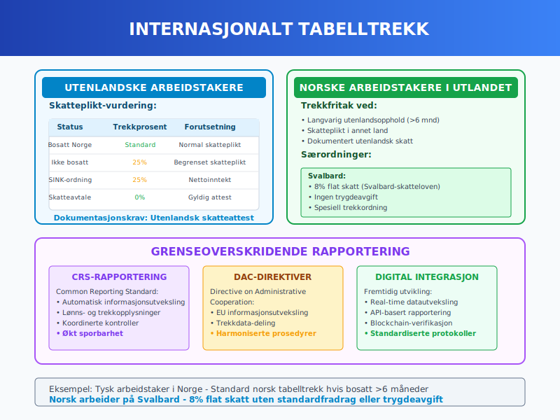

**Tabelltrekk** er et standardisert system for beregning av forskuddstrekk og andre skattemessige trekk basert på forhåndsbestemte tabeller. Dette systemet forenkler lønnskjøring og sikrer korrekt skattetrekk for både arbeidsgivere og arbeidstakere. Tabelltrekk er fundamentalt for [lønnsadministrasjon](/blogs/regnskap/hva-er-loenn "Hva er Lønn? Beregning og Regnskapsføring av Lønnskostnader") og har direkte påvirkning på [skattetrekkskontoen](/blogs/regnskap/hva-er-skattetrekkskonto "Hva er Skattetrekkskonto? Komplett Guide til Administrasjon og Regnskapsføring") og [skatteregler](/blogs/regnskap/hva-er-skatt "Skatt - Komplett Guide til Bedriftsskatt, MVA og Skatteplanlegging").

## Seksjon 1: Grunnleggende om Tabelltrekk

**Tabelltrekk** er skattemyndighetenes offisielle metode for å beregne hvor mye skatt som skal trekkes fra lønn og andre skattepliktige utbetalinger. Systemet bygger på **forhåndsberegnede tabeller** som tar hensyn til skattetrinn, fradrag og andre skattemessige forhold.


### 1.1 Historisk Utvikling

**Tabelltrekk-systemet** har utviklet seg betydelig siden innføringen:

#### Tidslinje for tabelltrekk:
| **År** | **Endring** | **Betydning** |
|--------|-------------|---------------|
| 1960-tallet | Innføring av tabellsystem | Standardisert trekkberegning |
| 1990-tallet | Digitalisering | Automatiserte beregninger |
| 2000-tallet | A-ordningen | Integrert rapportering |
| 2020-tallet | **Real-time beregning** | Økt presisjon og fleksibilitet |

### 1.2 Juridisk Grunnlag

**Tabelltrekk** er regulert gjennom:

* **Skatteforvaltningsloven** § 5-2 om forskuddstrekk
* **Forskrift om skattetrekk** med detaljerte beregningsregler
* **Årlige trekkveildninger** fra Skatteetaten
* **A-ordningen** for rapportering av lønns- og trekkopplysninger


## Seksjon 2: Trekkarten og Skattetabeller

### 2.1 Trekkarten og Registrering

**Trekkarten** er grunnlaget for korrekt skattetrekk:

#### Sentrale komponenter:
* **Trekk-prosent** basert på forventet årslønn
* **Fradragskoder** for standardfradrag og særfradrag
* **Frikort** for lavt- og ikke-skattepliktige inntekter
* **Trekkplikt** på tilleggsinntekter

**Registreringsprosess:**
1. **Arbeidstaker** sender trekkart til arbeidsgiver
2. **Arbeidsgiver** registrerer opplysningene i lønnssystem
3. **Lønnssystem** beregner trekk basert på tabeller
4. **Rapportering** til Skatteetaten via A-melding

### 2.2 Skattetabeller og Beregningsmetoder

**Skattetabellene** er organisert etter ulike inntektsnivåer og fradrag:

#### Tabellstruktur (2024):
| **Tabell** | **Anvendelse** | **Trekk-prosent** |
|------------|----------------|-------------------|
| 7300 | Ordinær inntekt, ingen særfradrag | 29-42% |
| 7350 | Ordinær inntekt med minstefradrag | 25-39% |
| 7370 | Høy inntekt, maksimalt særfradrag | 35-45% |
| [Tabell 7100](/blogs/regnskap/tabell-7100 "Tabell 7100: Skattetabell for Pensjon og Trygdeutbetalinger") | Pensjon og trygd | 20-35% |

**Beregningseksempel:**
```
Månedslønn: 50.000 kr
Trekkgrunnlag = 50.000 × 12 = 600.000 kr/år
Tabell 7300: Trekk-prosent ‰ˆ 32%
Månedlig trekk: 50.000 × 32% = 16.000 kr
```


### 2.3 Digitale Beregningsverktøy

**Moderne lønnssystemer** implementerer automatisert tabelltrekk:

#### Tekniske funksjoner:
* **Sanntids tabelloppslag** fra Skatteetatens API
* **Automatisk oppdatering** ved endringer i skattetabeller
* **Validering** av trekkart-opplysninger
* **Backup-beregninger** ved systemfeil

**Implementering i lønnssystem:**
```javascript
function beregnTabelltrekk(bruttolonnPerManed, trekkartData) {
    const arslonn = bruttolonnPerManed * 12;
    const tabell = trekkartData.tabellnummer;
    const trekkprosent = hentTrekkprosentFraTabell(tabell, arslonn);
    return bruttolonnPerManed * (trekkprosent / 100);
}
```

## Seksjon 3: Fradragskoder og Særfradrag

### 3.1 Standard Fradragskoder

**Fradragskoder** reduserer skattetrekket basert på dokumenterte kostnader:

#### Vanlige fradragskoder:
| **Kode** | **Beskrivelse** | **Maksimalt beløp** |
|----------|-----------------|---------------------|
| 132 | Reise mellom hjem og arbeid | Kr 97.610 (2024) |
| 213 | Fagforeningskontingent | Kr 6.000 |
| 301 | **Renteutgifter** på egen bolig | Ubegrenset |
| 504 | Gaver til veldedige formål | 25.000 kr |

### 3.2 Beregning av Særfradrag

**Særfradrag** påvirker tabelltrekket direkte:

**Beregningsformel:**
```
Justert trekk = Standard trekk - (Særfradrag × Marginal skattesats)
```

**Eksempel:**
```
Standard månedstrekk: 15.000 kr
Reisefradrag: 50.000 kr/år (‰ˆ 4.167 kr/måned)
Marginal skattesats: 35%
Reduksjon: 4.167 × 35% = 1.458 kr
Justert trekk: 15.000 - 1.458 = 13.542 kr/måned
```


### 3.3 Administrasjon av Fradrag

**Arbeidsgiveres ansvar** for fradragshåndtering:

#### Prosess for fradragsregistrering:
1. **Mottak** av dokumentasjon fra arbeidstaker
2. **Validering** av fradragsgrunnlag
3. **Registrering** i lønnssystem
4. **Månedlig beregning** og justering
5. **Årlig avstemming** mot skattemeldingen

**Dokumentasjonskrav:**
* **Kvitteringer** for faktiske utgifter
* **Avtaledokumenter** for løpende fradrag
* **Bekreftelser** fra tredjeparter (fagforeninger etc.)
* **Egenerklæringer** for standardfradrag

## Seksjon 4: Tabelltrekk for Ulike Inntektstyper

### 4.1 Lønnsinntekt

**Ordinær lønn** følger standard tabelltrekk-prosedyrer:

#### Komponenter som inngår:
* **Grunnlønn** og faste tillegg
* **Variable tillegg** (overtid, provisjon)
* **Naturalytelser** (firmabil, telefon)
* **Bonuser** og gratifikasjoner

**Regnskapsføring av lønnstrekk:**
```
Debet: Lønnskostnad 100.000 kr
Kredit: Skyldig lønn 68.000 kr
Kredit: Skyldig skattetrekk 25.000 kr
Kredit: Skyldig pensjon 7.000 kr
```

### 4.2 Pensjon og Trygdeutbetalinger

**Pensjonsutbetalinger** har egne trekktabeller:

#### Særlige forhold:
* **Lavere trekk-prosent** enn lønnsinntekt
* **Minstefradrag** for pensjonister
* **Standardfradrag** for alder over 67 år
* **Redusert [sykepenger](/blogs/regnskap/hva-er-sykepenger "Hva er Sykepenger? Komplett Guide til Arbeidsgiverperiode og NAV-refusjon")-trekk**


### 4.3 Honorar og Frilansing

**Freelancere** og **konsulenter** møter særlige trekkutfordringer:

#### Trekkplikt-vurdering:
| **Situasjon** | **Trekkplikt** | **Trekkprosent** |
|---------------|----------------|------------------|
| Fast oppdragsgiver (>50% av inntekt) | Ja | Standard tabeller |
| Sporadiske oppdrag | Nei | Egen forskuddsskatt |
| Kunstnerhonorar | Ja | 15% trekk |
| Foredragshonorar | Ja | 25% trekk |

**Vurdering av trekkplikt:**
```
If oppdragsverdi > kr 1.000 AND 
   relasjon > 3 måneder THEN
   trekkplikt = true
```

## Seksjon 5: Forskuddsskatt og Etterskuddsskatt

### 5.1 Forskuddsskatt-systemet

**Forskuddsskatt** sikrer jevn skatteinnbetaling gjennom året:

#### Beregningskomponenter:
* **Forventet årsinntekt** basert på lønn og andre kilder
* **Standardfradrag** og dokumenterte særfradrag
* **Formuesskatt** på netto formue over 20 millioner kr
* **Trygdeavgift** på lønn og pensjonsinntekt

**Forskuddsskatt-beregning:**
```
Årlig forskuddsskatt = (Forventet inntekt - Fradrag) × Skattesats
Månedlig forskuddsskatt = Årlig forskuddsskatt ÷ 12
```

### 5.2 Etterskuddsskatt og Justeringer

**Etterskuddsskatt** oppstår ved forskjeller mellom forskudd og faktisk skatt:

#### Vanlige årsaker:
* **Høyere inntekt** enn forventet
* **Reduserte fradrag** i forhold til trekkart
* **Variabel inntekt** (bonus, utbytte)
* **Manglende rapportering** av tilleggsinntekter

**Justeringsmekanismer:**
| **Tidspunkt** | **Metode** | **Frist** |
|---------------|------------|-----------|
| Løpende år | Endring av trekkart | Umiddelbart |
| Etter årsskifte | Skattemelding | 31. mai |
| Revisjonsperiode | Endring/tilleggsligninger | 3-6 år |


### 5.3 Rentekompensasjon og Gebyrer

**Skatteetaten** betaler renter ved **for mye forskuddsbetaling**:

#### Renteberegning:
* **Rentesats:** Norges Banks styringsrente + 1%
* **Renteperiode:** Fra forfallsdato til utbetaling
* **Minstebeløp:** Kr 200 for renteutbetaling
* **Skattlegging:** Renter er skattepliktig inntekt

**For lite forskuddsbetaling medfører:**
* **Restskatt** med forfalltid 20. august
* **Forsinkelsesrenter** ved sen betaling
* **Tilleggsgebyr** ved stor underdekning

## Seksjon 6: A-ordningen og Digital Rapportering

### 6.1 A-melding og Tabelltrekk

**A-ordningen** integrerer lønns- og trekkrapportering:

#### Måntlige rapporter inkluderer:
* **Utbetalte beløp** per arbeidstaker
* **Skattetrekk** basert på tabelltrekk-beregninger
* **Arbeidsgiveravgift** på utbetalingene
* **Pensjonspremie** og andre trekk

**A-meldingsstruktur:**
```xml
<Inntektsmottaker>
  <PersonId>01010112345</PersonId>
  <Inntekt>
    <BeloepSumBrutto>50000</BeloepSumBrutto>
    <SkattegrunnlagSumTrekkpliktig>50000</SkattegrunnlagSumTrekkpliktig>
    <SkattetrektSum>16000</SkattetrektSum>
  </Inntekt>
</Inntektsmottaker>
```

### 6.2 Systemmintegrasjon

**Moderne lønnssystemer** kommuniserer direkte med skattemyndighetene:

#### API-funksjoner:
* **Validering** av organisasjonsnummer og personnummer
* **Oppslag** i aktuelle skattetabeller
* **Automatisk innsending** av A-melding
* **Mottaksbekreftelse** og feilhåndtering

**Kvalitetssikring:**
- [ ] Kontroll av personidentifikasjon
- [ ] Validering av trekkart-opplysninger  
- [ ] Sammenligning med foregående periode
- [ ] Avstemming mot bank og skattetrekkskonto


### 6.3 Fremtidig Utvikling

**Digitalisering** av tabelltrekk-systemet:

#### Teknologiske trender:
* **Sanntids-beregning** basert på løpende inntekt
* **Maskinlæring** for optimalisert trekkprosent
* **Blockchain** for sporbarhet og transparens
* **API-økonomi** for sømløs datautveksling

**Forventet effekt:**
* **Redusert etterskuddsskatt** gjennom presise beregninger
* **Lavere administrasjonkostnader** for arbeidsgivere
* **Økt compliance** gjennom automatisering
* **Bedre brukeropplevelse** for arbeidstakere

## Seksjon 7: Bransjespesifikke Trekkordninger

### 7.1 Bygg- og Anleggsbransjen

**Byggebransjen** har særlige utfordringer med tabelltrekk:

#### Spesielle forhold:
* **Sesongvariasjoner** i arbeidsmengde og lønn
* **Skiftende arbeidsplasser** og reisekostnader
* **Korttidskontrakter** og midlertidige ansettelser
* **Utsendte arbeidstakere** fra andre land

**Trekkberegning for byggearbeidere:**
```
If arbeidssted > 50 km fra bolig THEN
   reisefradrag = faktiske_kostnader OR standard_diett
   justertTrekk = standardTrekk - (reisefradrag × 0.35)
```

### 7.2 Transport og Logistikk

**Transportbransjen** har komplekse trekkforhold:

#### Utfordringsområder:
* **Diett og losjikostnader** ved lange turer
* **Uregelmessige arbeidstider** og overtidsbetaling
* **Bilgodtgjørelse** og kjøregodtgjørelse
* **Internasjonale** turer og grenseoverskridende skatt


### 7.3 Olje- og Gassindustrien

**Petroleumssektoren** har unike trekkordninger:

#### Offshore-spesifikt:
* **14/14 rotasjonsordninger** påvirker trekkberegning
* **Skattefri hyre** på [kontinentalsokkelen](/blogs/regnskap/hva-er-kontinentalsokkel "Hva er Kontinentalsokkel? Skattemessige Regler for Offshore-virksomhet")
* **Begrenset trekkplikt** for utenlandske arbeidstakere
* **Kompleks rapportering** til både norske og utenlandske myndigheter

**Offshore trekkberegning:**
| **Aktivitet** | **Trekkstatus** | **Særbestemmelser** |
|---------------|-----------------|---------------------|
| Produksjonsvirksomhet | Skattefri hyre | Maksimalt 4 måneder |
| Leteboring | Normal trekk | Standard tabeller |
| Vedlikehold og service | Delvis fritak | Avhenger av varighet |

## Seksjon 8: Feilkilder og Korrigeringer

### 8.1 Vanlige Feil i Tabelltrekk

**Systematiske feil** som påvirker trekkberegninger:

#### Hyppige problemområder:
* **Feil trekkart-registrering** ved ansettelse
* **Manglende oppdatering** ved lønnsendringer
* **Inkorrekt koding** av naturalytelser
* **Retrospektive justeringer** som ikke fanges opp

**Feildeteksjon:**
```python
def kontrollerTabelltrekk(bruttolonnData, trekkData):
    if abs(trekkData - beregnForventetTrekk(bruttolonnData)) > 0.05 * bruttolonnData:
        return "AVVIK_DETEKTERT"
    return "OK"
```

### 8.2 Korrigering av Trekk-feil

**Rettefrist** og korrigering av feilaktig trekk:

#### Korrigeringsprosess:
1. **Identifisering** av feil i månedlig avstemming
2. **Beregning** av korrekt trekk-beløp
3. **Justering** i neste lønnskjøring
4. **Supplerende A-melding** til Skatteetaten
5. **Dokumentasjon** av korrigeringen

**Regnskapsføring av trekkjustering:**
```
Debet/Kredit: Skyldig skattetrekk (differanse)
Kredit/Debet: Skyldig lønn (motkonto)
```


### 8.3 Kvalitetssikring og Kontroller

**Systematisk kvalitetssikring** forebygger feil:

#### Kontrollrutiner:
- [ ] **Månedlig avstemming** av trekk-beløp
- [ ] **Kontroll** av trekkart-endringer  
- [ ] **Sammenligning** med bransjebenchmarks
- [ ] **Validering** av fradragsdokumentasjon
- [ ] **Review** av A-melding før innsending

**Automatiserte kontroller:**
* **Outlier-deteksjon** for unormale trekkprosenter
* **Konsistenssjekk** mellom perioder
* **Validering** mot Skatteetatens tabeller
* **Cross-reference** med HR-systemer

## Seksjon 9: Internasjonale Aspekter

### 9.1 Utenlandske Arbeidstakere

**Trekkplikt** for ikke-norske ansatte:

#### Vurderingskriterier:
* **Skatteplikt til Norge** basert på oppholdsvarighet
* **Skatteavtaler** kan påvirke trekkplikten
* **Sertifikat** for redusert trekk fra hjemland
* **Dokumentasjon** av utenlandsk skattlegging

**Trekkprosenter for utlendinger:**
| **Status** | **Trekkprosent** | **Forutsetninger** |
|------------|------------------|-------------------|
| Bosatt i Norge | Standard tabeller | Normal skatteplikt |
| Ikke bosatt, skattepliktig | 25% flat rate | Begrenset skatteplikt |
| SINK-ordningen | 25% på nettoinntekt | Særlige vilkår |
| Skatteavtale-fritak | 0% | Gyldig attest |

### 9.2 Utsendte Norske Arbeidstakere

**Norske ansatte** i utlandet har spesielle trekkordninger:

#### Utland-spesifikt:
* **Befrielse** for trekkplikt ved langvarig utenlandsopphold
* **Svalbard-ordningen** med redusert skatt
* **Diplomater** og konsulatansatte har særstatus
* **Petroleumsvirksomhet** på kontinentalsokkelen



### 9.3 Digital Rapportering på Tvers av Grenser

**Automatisk informasjonsutveksling** påvirker trekkberegninger:

#### CRS og DAC-rapportering:
* **[Common Reporting Standard](/blogs/regnskap/hva-er-crs "Hva er CRS? Automatisk Informasjonsutveksling for Skatteformål")** for finansielle kontoer
* **Automatisk utveksling** av lønns- og trekkopplysninger
* **Koordinerte kontroller** mellom skattemyndigheter
* **Økt sporbarhet** av internasjonale arbeidsforhold

## Seksjon 10: Teknologi og Automatisering

### 10.1 Moderne Lønnssystemer

**Skybaserte løsninger** transformerer tabelltrekk-håndtering:

#### Teknologiske funksjoner:
* **Real-time API-integrasjon** med Skatteetaten
* **Maskinlæring** for trekkoptimalisering  
* **Automatisk oppdatering** av skattetabeller
* **Intelligent validering** av trekkart-data

**Arkitektur for moderne tabelltrekk:**


### 10.2 Artificial Intelligence i Trekkberegning

**AI-algoritmer** optimaliserer skattetrekk:

#### Machine Learning anvendelser:
* **Prediktiv modellering** av årsinntekt
* **Automatisk justering** av trekkprosent
* **Anomali-deteksjon** for uvanlige trekkmønstre
* **Personaliserte anbefalinger** for trekkart-endringer

**AI-modell for trekkoptimalisering:**
```python
def optimerTrekk(historiskInntekt, prognosertInntekt, risikoProfile):
    model = MachineLearningModel()
    model.train(historiskInntekt)
    optimal_trekk = model.predict(prognosertInntekt, risikoProfile)
    return optimal_trekk
```


### 10.3 Blockchain og Smart Contracts

**Distribuert** teknologi for trekkadministrasjon:

#### Blockchain-fordeler:
* **Uforanderlig** dokumentasjon av trekkberegninger
* **Smart contracts** for automatisk trekkjustering
* **Transparent** rapportering til alle parter
* **Redusert** administrasjonsbehov

**Smart contract eksempel:**
```solidity
contract TabelltrekkContract {
    function beregnTrekk(uint bruttoLonn, uint trekkprosent) 
        public pure returns (uint) {
        return (bruttoLonn * trekkprosent) / 100;
    }
}
```

## Seksjon 11: Fremtiden for Tabelltrekk

### 11.1 Digitale Trekkart og Real-time Justering

**Neste generasjon** trekkart-administrasjon:

#### Innovasjoner under utvikling:
* **Digital identitet** integrert med BankID
* **Sanntids inntektsdata** fra alle arbeidsgivere
* **Automatisk trekkjustering** basert på faktisk inntekt
* **Prediktiv skatteberegning** for neste år

**Fremtidig trekkberegning:**
```
Real-time trekk = f(løpende_årslønn, prognostisert_restlønn, 
                    faktiske_fradrag, livshendelser)
```

### 11.2 Integrert Økosystem

**Helhetlig platform** for skatteadministrasjon:

#### Systemintegrasjon:
* **HR-systemer** deler data direkte med Skatteetaten
* **Bank-APIs** for automatisk trekkbetaling
* **Regnskapssystemer** får real-time oppdateringer
* **Privat-økonomi apps** viser prognose for skatteoppgjør


### 11.3 Bærekraft og Miljøperspektiv

**Grønn digitalisering** av trekkadministrasjon:

#### Miljøgevinster:
* **Papirfri** trekkart og dokumentasjon
* **Reduserte reiser** gjennom digital selvbetjening
* **Energieffektive** skybaserte beregninger
* **Mindre fysisk arkivering** av dokumenter

**Målsettinger:**
- 100% digital trekkart-håndtering innen 2030
- 50% reduksjon i administrasjonskostnader
- Nullutslipp fra tabelltrekk-administrasjon
- Real-time skatteoppgjør uten årsoppgjør

## Seksjon 12: Praktiske Verktøy og Ressurser

### 12.1 Tabelltrekk-kalkulatorer

**Digitale verktøy** for trekkberegning:

#### Offisielle kalkulatorer:
| **Verktøy** | **Bruksområde** | **Tilgang** |
|-------------|-----------------|-------------|
| Skatteetaten.no kalkulator | Personlig trekkberegning | Gratis online |
| Arbeidsgiver-portal | Bulk trekkberegning | Avgiftspliktig |
| Lønnssystem-API | Automatisk beregning | Kommersielt |
| Mobile apps | Rask sjekk | Gratis/betalt |

### 12.2 Dokumentasjon og Oppbevaring

**Systematisk arkivering** av trekkdata:

#### Oppbevaringskrav:
- [ ] **Trekkart** og endringsdokumentasjon (10 år)
- [ ] **Fradragsdokumentasjon** (5 år)
- [ ] **Lønns- og trekkspesifikasjon** (10 år)
- [ ] **A-meldinger** og mottaksbekreftelser (10 år)

**Digital arkivering:**
```
Filstruktur:
/TrekkarkDocuments/
  /2024/
    /Trekkart/
    /Fradrag/
    /A-meldinger/
    /Korrigeringer/
```

### 12.3 Compliance og Revisjonsverktøy

**Verktøy** for sikring av korrekt tabelltrekk:

#### Kvalitetssikringslister:
- [ ] Månedlig avstemming av trekk mot tabeller
- [ ] Kvartalsvis review av fradragsdokumentasjon
- [ ] Årlig validering av trekkart-database
- [ ] Kontinuerlig oppdatering av skattetabeller

**Revisjonsrapporter:**
* **Trekk-avviksrapport** med årsaker og korrigeringer
* **Fradragskontroll** med dokumentasjonsvalidering
* **A-melding status** med innsendelseshistorikk
* **Prognoser** for årsoppgjør og eventuelle justeringer


## Konklusjon

**Tabelltrekk** representerer kjernen i Norges skattetrekk-system og er essensielt for effektiv lønnsadministrasjon. Systemet har utviklet seg fra manuelle tabelloppslag til sofistikerte digitale plattformer som sikrer korrekt skattetrekk for millioner av norske arbeidstakere.

**Viktige erkjennelser:**

* **Automatisering reduserer feil:** Moderne lønnssystemer med API-integrasjon mot Skatteetaten minimerer manuelle feil
* **Compliance er kritisk:** Korrekt håndtering av tabelltrekk er avgjørende for å unngå bøter og etterbetalinger
* **Teknologi driver effektivitet:** AI og maskinlæring optimaliserer trekkberegninger og reduserer administrativt arbeid
* **Digital transformasjon fortsetter:** Fremtiden bringer real-time trekkjusteringer og helt automatiserte systemer

**Strategiske anbefalinger:**

For **arbeidsgivere** er det essensielt å investere i moderne lønnssystemer som håndterer tabelltrekk automatisk og sikrer compliance med A-ordningen. **Regnskapsførere** bør holde seg oppdatert på endringer i skattetabeller og fradragsregler, mens **HR-avdelinger** må sikre korrekt trekkart-registrering og dokumentasjon.

**Fremtidsperspektiv:**

Tabelltrekk-systemet vil fortsette å digitaliseres med mål om real-time skatteoppgjør uten tradisjonelt årsoppgjør. Integration med AI, blockchain og IoT vil skape et sømløst økosystem hvor skattetrekk justeres automatisk basert på faktisk inntekt og personlige forhold.

Korrekt forståelse og implementering av tabelltrekk er ikke bare et regnskapsteknisk krav - det er en strategisk kompetanse som påvirker [kontantstrøm](/blogs/regnskap/hva-er-kontantstrom "Hva er Kontantstrøm? Analyse og Forvaltning av Bedriftens Pengestrøm"), [arbeidsgiverkostnader](/blogs/regnskap/hva-er-loennskostnad "Hva er Lønnskostnad? Beregning og Regnskapsføring"), medarbeidertilfredsheten gjennom forutsigbar og korrekt lønnsutbetaling, samt [halv skatt](/blogs/regnskap/halv-skatt "Halv skatt “ Alt du trenger å vite om halv skatt i lønn") i ferie- og høytidssesonger.


