---
title: "Hva er Termin?"
meta_title: "Hva er Termin?"
meta_description: '**Termin** er et fundamentalt konsept i regnskap og økonomi som definerer en avgrenset tidsperiode for regnskapsføring, rapportering og økonomisk oppgjør. I...'
slug: hva-er-termin
type: blog
layout: pages/single
---

**Termin** er et fundamentalt konsept i regnskap og økonomi som definerer en avgrenset tidsperiode for regnskapsføring, rapportering og økonomisk oppgjør. I regnskapssammenheng refererer termin til spesifikke **regnskapsperioder** som brukes for å strukturere og organisere finansiell informasjon. Forstelse av terminer er essensielt for korrekt [periodisering](/blogs/regnskap/hva-er-periodisering "Hva er Periodisering? Grunnleggende Regnskapsprinsipp") og nøyaktig [årsregnskap](/blogs/regnskap/hva-er-arsregnskap "Hva er Årsregnskap? Innhold og Krav til Regnskapsrapportering"). Terminer påvirker direkte hvordan transaksjoner klassifiseres og når de påvirker [resultatregnskapet](/blogs/regnskap/hva-er-resultatregnskap "Hva er Resultatregnskap? Oppbygning og Analyse") og [balansen](/blogs/regnskap/hva-er-balanse "Hva er Balanse? Komplett Guide til Balansens Oppbygging og Funksjon").

## Seksjon 1: Grunnleggende Definisjon av Termin

### 1.1 Hva er en Termin i Regnskap?

En **termin** i regnskapssammenheng er en definert tidsperiode som brukes for å:

* **Strukturere regnskapsføring** og organisere finansielle transaksjoner
* **Fastsette rapporteringsperioder** for [delårsrapporter](/blogs/regnskap/hva-er-kvartalsrapport "Hva er Kvartalsrapport? Krav og Innhold i Delårsrapportering") og [årsregnskap](/blogs/regnskap/hva-er-arsregnskap "Hva er Årsregnskap? Innhold og Krav til Regnskapsrapportering")
* **Beregne periodisk resultat** og [avskrivninger](/blogs/regnskap/hva-er-avskrivning "Hva er Avskrivning? Beregning og Regnskapsføring av Verdireduksjon")
* **Planlegge og kontrollere** bedriftens økonomiske aktiviteter

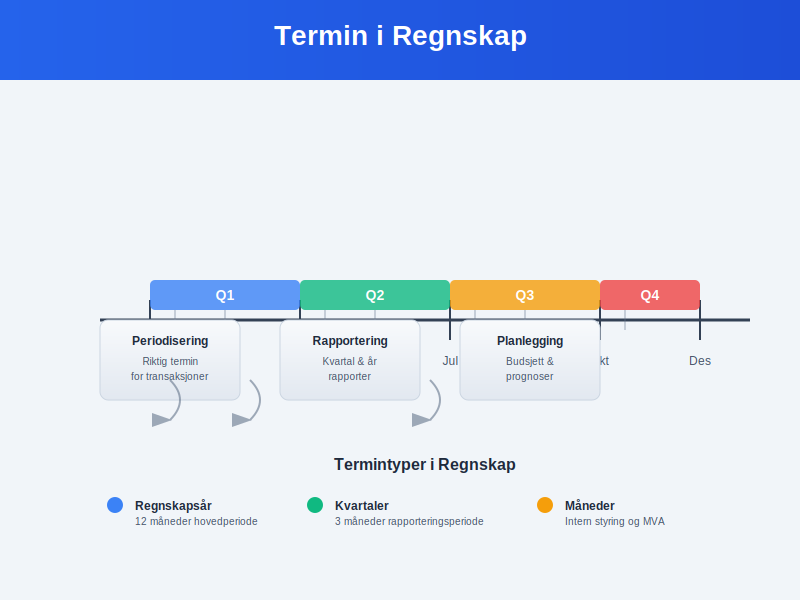

### 1.2 Terminens Rolle i Regnskapsprinsippene

**Terminavgrensning** er fundamentalt for flere regnskapsprinsipper:

#### Periodiseringsprinsippet:
* **Inntekter** føres i den terminen de er **opptjent**
* **Kostnader** føres i den terminen de er **pådratt**
* **Sammenstilling** av inntekter og tilhørende kostnader i samme termin

#### Forsiktighetsprinsippet:
* **Konservativ** terminplassering av usikre poster
* **Avsetninger** for fremtidige forpliktelser i riktig termin
* **Nedskrivninger** når verdireduksjon er sannsynlig

| **Regnskapsprinsipp** | **Terminens betydning** | **Praktisk anvendelse** |
|----------------------|-------------------------|------------------------|
| [Periodisering](/blogs/regnskap/hva-er-periodisering "Hva er Periodisering? Grunnleggende Regnskapsprinsipp") | Riktig terminplassering | [Påløpte kostnader](/blogs/regnskap/hva-er-palopte-kostnader "Hva er Påløpte Kostnader? Regnskapsføring og Periodisering") og [forhåndsbetalte utgifter](/blogs/regnskap/hva-er-forhands-betalte-utgifter "Hva er Forhåndsbetalte Utgifter? Håndtering i Regnskap") |
| Forsiktighet | Konservativ timing | Tidlig kostnadsføring, sen inntektsføring |
| Sammenlignbarhet | Konsistente perioder | Samme terminlengde år over år |

## Seksjon 2: Typer Terminer i Regnskapsføring

### 2.1 Regnskapsår og Hovedterminer

**Regnskapsåret** er den primære terminen for finansiell rapportering:

#### Standard regnskapsår:
* **Kalenderår:** 1. januar - 31. desember (mest vanlig)
* **Avvikende regnskapsår:** Kan velges av strategiske grunner
* **Første regnskapsår:** Kan være kortere eller lengre enn 12 måneder

**Eksempel på terminvalg:**
```
Detaljhandel: Regnskapsår 1. februar - 31. januar
(Unngår julerush i årsavslutning)

Skolevirksomhet: Regnskapsår 1. august - 31. juli
(Følger skoleåret for bedre sammenligning)
```

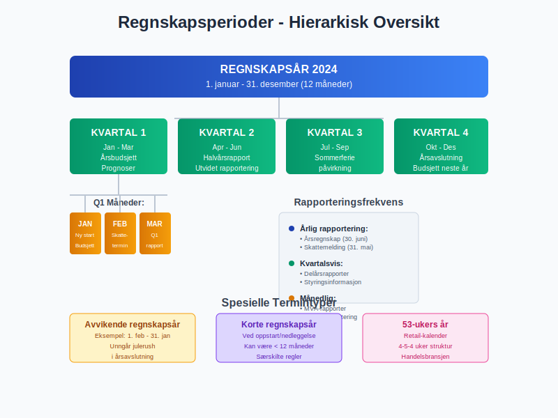

### 2.2 Delperioder og Rapporteringsterminer

**Kvartaler** er de vanligste delterminene:

#### Q1-Q4 oversikt:
| **Kvartal** | **Periode** | **Særlige forhold** | **Rapporteringskrav** |
|-------------|-------------|---------------------|----------------------|
| **Q1** | Jan-Mar | Årsbudsjett og prognoser | [Kvartalsrapport](/blogs/regnskap/regnskapskvartaler-q1-q4 "Regnskapskvartaler Q1-Q4 - Komplett Guide til Kvartalsvise Rapporter") |
| **Q2** | Apr-Jun | Halvårsrapport | Utvidet rapportering |
| **Q3** | Jul-Sep | Sommerferie-påvirkning | Standard kvartalsrapport |
| **Q4** | Okt-Des | Årsavslutning og [budsjett](/blogs/regnskap/hva-er-budsjettering "Hva er Budsjettering? Planlegging og Kontroll av Bedriftens Økonomi") | Foreløpige årstall |

**Månedlige terminer** brukes for:
* **Intern styring** og oppfølging
* **[MVA-rapportering](/blogs/regnskap/hva-er-mva "Hva er MVA? Merverdiavgift i Regnskap og Virksomhet")** og [skatteoppgjør](/blogs/regnskap/skatteoppgjor "Skatteoppgjør Guide: Prosess, Tidslinje og Viktige Frister")
* **[Lønnsbehandling](/blogs/regnskap/hva-er-loenn "Hva er Lønn? Beregning og Regnskapsføring av Lønnskostnader")** og personaladministrasjon

### 2.3 Spesialterminer og Bransjespesifikke Perioder

**Sesongterminer** for bransjer med sesongvariasjoner:

#### Eksempler på spesialterminer:
* **Landbruk:** Høst-til-høst terminer
* **Turisme:** Høy-/lavsesong periodisering
* **Skole/utdanning:** Skoleårs-baserte terminer
* **Detaljhandel:** Retail-kalender med 4-5-4 uker per kvartal

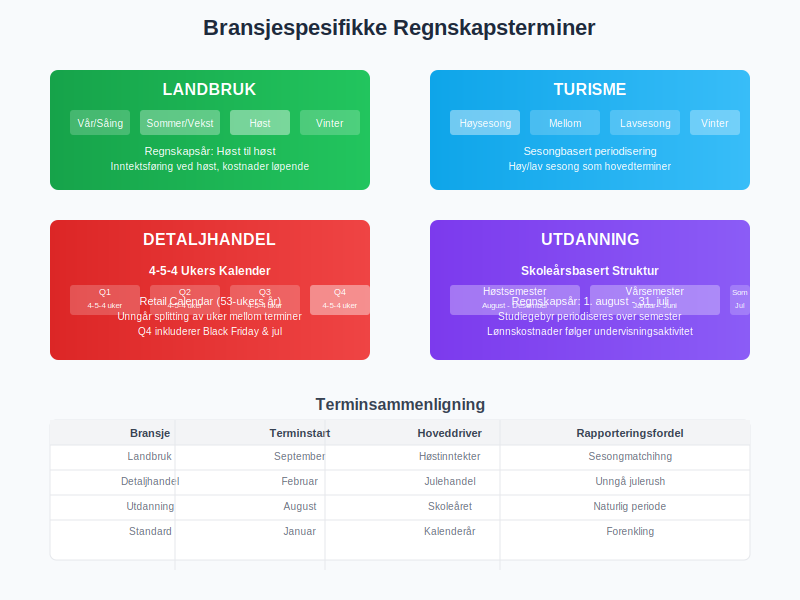

## Seksjon 3: Terminbasert Regnskapsføring

### 3.1 Periodisering og Terminplassering

**Korrekt terminplassering** av transaksjoner krever:

#### Inntektsføring:
* **Leveringsvilkår:** Når risiko og kontroll overføres
* **Tjenesteoppdrag:** Basert på fremdriftsgrad eller ferdigstillelse
* **Abonnementer:** Pro rata fordeling over kontraktsperioden

#### Kostnadsføring:
* **Direkte sammenheng:** Kostnader føres når tilhørende inntekt føres
* **Systematisk fordeling:** [Avskrivninger](/blogs/regnskap/hva-er-avskrivning "Hva er Avskrivning? Beregning og Regnskapsføring av Verdireduksjon") og amortisering
* **Immediat kostnadføring:** Kostnader uten fremtidig økonomisk nytte

**Praktisk eksempel - abonnement:**
```
Årlig softwarelisens betalt 1. januar: 120.000 kr

Månedlig kostnadsføring:
Debet: Programvarekostnad 10.000 kr
Kredit: Forhåndsbetalte utgifter 10.000 kr

(120.000 kr ÷ 12 måneder = 10.000 kr per måned)
```

### 3.2 Avstemming mellom Terminer

**Terminskifte** krever spesielle justeringer:

#### Årsavslutningsposteringer:
* **[Påløpte inntekter](/blogs/regnskap/hva-er-palopte-inntekter "Hva er Påløpte Inntekter? Regnskapsføring av Opptjente men Ikke Fakturerte Inntekter"):** Opptjent men ikke fakturert
* **[Påløpte kostnader](/blogs/regnskap/hva-er-palopte-kostnader "Hva er Påløpte Kostnader? Regnskapsføring og Periodisering"):** Pådratt men ikke betalt
* **[Forskuddsbetalinger](/blogs/regnskap/hva-er-forskuddsbetaling "Hva er Forskuddsbetaling? Behandling i Kundeforhold og Regnskap"):** Innbetalt men ikke opptjent
* **Forhåndsbetalte utgifter:** Betalt men ikke forbrukt

| **Justeringstype** | **Balansepåvirkning** | **Resultatpåvirkning** |
|-------------------|---------------------|---------------------|
| Påløpte inntekter | Øker [fordringer](/blogs/regnskap/hva-er-fordringer "Hva er Fordringer? Komplett Guide til Kundefordringer og Andre Fordringer") | Øker inntekt |
| Påløpte kostnader | Øker [gjeld](/blogs/regnskap/hva-er-gjeld "Hva er Gjeld? Typer og Regnskapsføring av Forpliktelser") | Øker kostnad |
| Forskudd fra kunder | Øker gjeld | Reduserer inntekt |
| Forhåndsbetalte utgifter | Øker eiendeler | Reduserer kostnad |

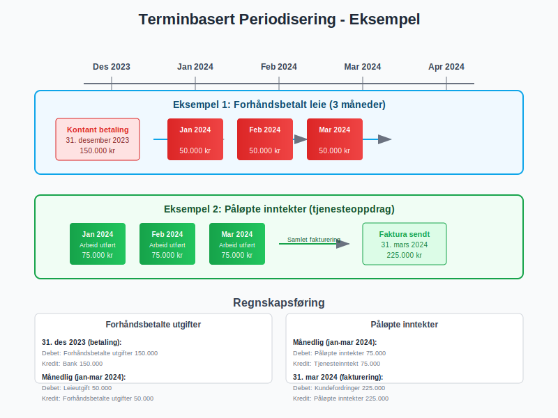

## Seksjon 4: Skattemessige Terminer og Frister

### 4.1 Skattemessige Rapporteringsperioder

**[Skatt](/blogs/regnskap/hva-er-skatt "Skatt - Komplett Guide til Bedriftsskatt, MVA og Skatteplanlegging")** og avgifter følger strenge terminfrister:

#### MVA-terminer:
* **Månedsrapportering:** Frist 10. i påfølgende måned
* **Periode-rapportering:** Hver 2. måned for mindre virksomheter
* **Årlig rapportering:** For virksomheter under MVA-grensen

#### Skattemessige frister:
| **Rapportering** | **Termin** | **Frist** | **Konsekvens ved forsinkelse** |
|------------------|------------|-----------|------------------------------|
| [Skattemelding](/blogs/regnskap/skattemelding "Skattemelding - Komplett Guide til Utfylling og Innlevering") | Årlig | 31. mai | Forsinkelsesgebyr |
| Årsregnskap | Årlig | 30. juni | Tvangsmulkt |
| A-melding | Månedlig | 5. påfølgende måned | Overtredelsesgebyr |

### 4.2 Forskuddsskatt og Terminbetalinger

**Forskuddsskatt** beregnes på terminbasis:

#### Beregningsgrunnlag:
* **Forrige års skatt** som utgangspunkt
* **Justert for forventede endringer** i inntekt
* **Termin-fordeling:** 6 terminer per år (febr-okt)

**Forskuddsskatt terminer 2024:**
```
Termin 1: 15. februar
Termin 2: 15. april  
Termin 3: 15. juni
Termin 4: 15. august
Termin 5: 15. oktober
Termin 6: 15. desember
```

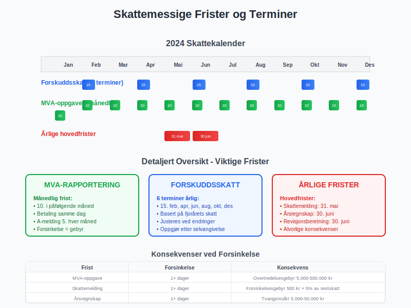

## Seksjon 5: Terminkontrakter og Finansielle Instrumenter

### 5.1 Terminkontrakter i Regnskap

**Terminkontrakter** er finansielle avtaler for fremtidig levering:

#### Karakteristika:
* **Standardiserte kontrakter** handlet på børs
* **Fast pris** og leveringsdato
* **Margin-krav** og daglig oppgjør (mark-to-market)

#### Regnskapsmessig behandling:
* **[Virkelig verdi](/blogs/regnskap/hva-er-virkelig-verdi "Hva er Virkelig Verdi? Verdsettelse og Regnskapsføring")** på balansedagen
* **Resultatføring** av verdiendringer (med mindre sikringsbokføring)
* **Sikringsbokføring** når kriteriene er oppfylt

**Eksempel terminkontrakt:**
```
Kjøp av 1000 tonn hvete for levering om 6 måneder
Kontraktspris: 2.500 kr/tonn
Total verdi: 2.500.000 kr

Ved kontraktsinngåelse: Ingen bokføring (off-balance)
Ved rapporteringsdato: Verdijustering basert på markedspris
Ved levering: Realisering av gevinst/tap
```

### 5.2 Valutaterminkontrakter

**Valutasikring** gjennom terminkontrakter:

#### Anvendelsesområder:
* **Import/eksport:** Sikring mot valutarisiko
* **Utenlandske investeringer:** Kurssikring av eierandeler
* **Låneopptak:** Sikring av utenlandsk finansiering

#### Regnskapsbehandling:
| **Sikringstype** | **Effektivitetstesting** | **Resultatføring** |
|------------------|--------------------------|-------------------|
| Virkelig verdi sikring | Kreves | Både sikringsobjekt og -instrument |
| Kontantstrøm sikring | Kreves | Effektiv del i egenkapital |
| Netto investering | Kreves | Valutadel i egenkapital |

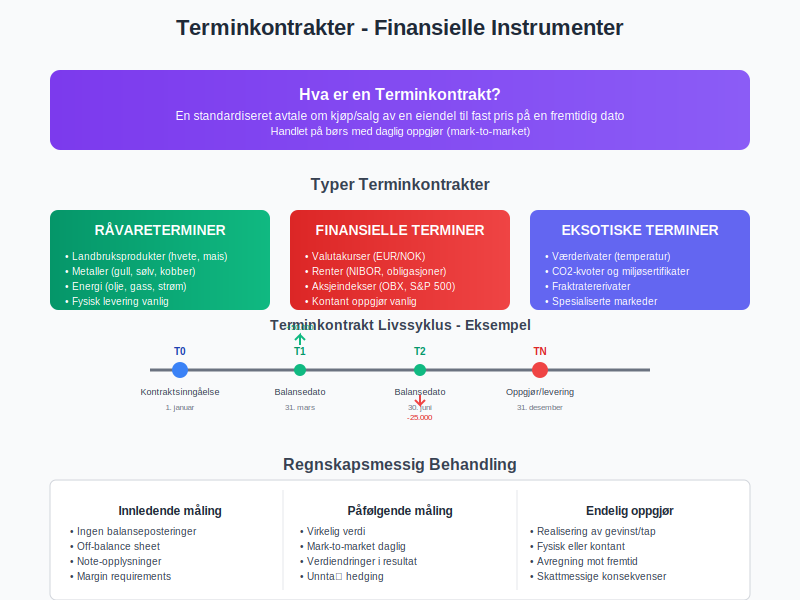

## Seksjon 6: Terminplanlegging og Budsjetteriing

### 6.1 Strategisk Terminplanlegging

**Langsiktig terminplanlegging** innebærer:

#### Flerårig perspektiv:
* **Investerigsplaner** fordelt over flere terminer
* **Finansieringsbeho** og [kapitallokering](/blogs/regnskap/hva-er-kapital "Hva er Kapital? Komplett Guide til Kapitalformer og Kapitalforvaltning")
* **Markedsekspansjon** og organisk vekst
* **[M&A-aktivitet](/blogs/regnskap/hva-er-bedriftskjop "Hva er Bedriftskjøp? Regnskapsføring og Verdsettelse")** og konsolideringer

#### Operasjonell terminplanlegging:
* **Sesongvariasjoner** og kapasitetsutnyttelse
* **[Arbeidskapital](/blogs/regnskap/hva-er-arbeidskapital "Hva er Arbeidskapital? Beregning og Optimalisering")** og [likviditetsstyring](/blogs/regnskap/hva-er-likviditet "Hva er Likviditet? Komplett Guide til Bedriftens Betalingsevne")
* **Vedlikeholdsplaner** og [avskrivningspolitikk](/blogs/regnskap/hva-er-avskrivning "Hva er Avskrivning? Beregning og Regnskapsføring av Verdireduksjon")

### 6.2 Rullende Prognoser og Terminoppdatering

**Dynamisk terminplanlegging:**

#### Rullende prognoser:
* **12+3 modell:** 12 måneder detaljert + 3 måneder ny periode
* **Kvartalsvis oppdatering** basert på faktiske resultater
* **Scenarioanalyse** for ulike markedsforhold

**Prognosemodell eksempel:**
```
Basis prognose (50% sannsynlighet):
- Omsetningsvekst: 8% årlig
- Marginutvikling: Stabil
- Investeringsnivå: 3% av omsetning

Optimistisk scenario (25% sannsynlighet):
- Omsetningsvekst: 15% årlig
- Marginutvikling: +2 prosentpoeng
- Investeringsnivå: 5% av omsetning

Pessimistisk scenario (25% sannsynlighet):
- Omsetningsvekst: 2% årlig
- Marginutvikling: -1 prosentpoeng  
- Investeringsnivå: 1% av omsetning
```

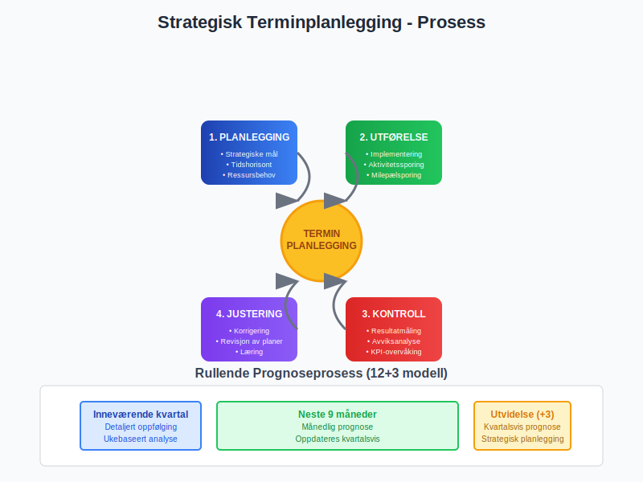

## Seksjon 7: Digitale Verktøy for Terminhåndtering

### 7.1 ERP-systemers Terminsutstyr

**Moderne ERP-systemer** tilbyr omfattende terminfunksjonalitet:

#### Kjernefunksjoner:
* **Automatisk periodeavslutning** med validering
* **Multi-periode rapportering** og sammenligning
* **Forecasting-moduler** med scenariomodellering
* **Konsolidering** av flere enheter/terminer

#### Integrasjoner:
| **System** | **Integrasjon** | **Termingevinster** |
|------------|-----------------|-------------------|
| CRM | Salgs-pipeline og inntektsprognose | Bedre terminestimater |
| HR | Lønnskostnader og bemanning | Nøyaktig kostnadsfordeling |
| Supply Chain | Innkjøp og lagerstyring | Optimalisert terminbestilling |

### 7.2 Business Intelligence og Terminanalyse

**BI-verktøy** gir dypere terminsinnsikt:

#### Analysedimensjoner:
* **Year-over-year** sammenligning på terminnivå
* **Sesongvariasjoner** og trenidentifisering
* **Terminanormalisering** for sammenlignbare resultater

#### KPI-dashboard for terminer:
* **Terminens [lønnsomhet](/blogs/regnskap/hva-er-loennsomhet "Hva er Lønnsomhet? Måling og Analyse av Bedriftens Økonomiske Ytelse")** og marginutvikling
* **[Kontantstrøm](/blogs/regnskap/hva-er-kontantstrom "Hva er Kontantstrøm? Analyse og Forvaltning av Bedriftens Pengestrøm") per termin** og likviditetsprognoser
* **Kundesegment-analyse** over terminer
* **Produktlønnsomhet** per termin

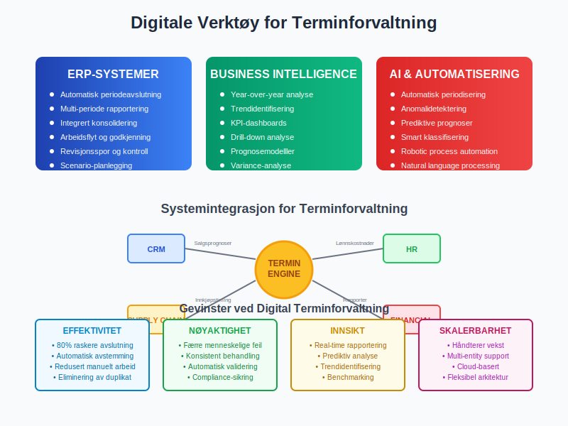

## Seksjon 8: Internasjonale Terminpraksiser

### 8.1 IFRS og Terminprinsipper

**International Financial Reporting Standards** påvirker terminbehandling:

#### Sentrale standarder:
* **IFRS 15:** Inntektsføring og terminplassering
* **IFRS 16:** Leieavtaler og terminfordeling
* **IAS 23:** Låne- og rentekostnader over terminer

#### Konseptuelle forskjeller:
| **Standard** | **Terminpåvirkning** | **Norsk praksis** |
|--------------|---------------------|------------------|
| IFRS 15 | Femtrinnsmedelll for inntekt | Mindre detaljert |
| IFRS 16 | Aktivering av leieavtaler | Operasjonelle leieavtaler |
| IAS 36 | Nedskrivningstesting | Enklere triggertester |

### 8.2 Konsernregnskap og Terminkonsolidering

**Multinasjonale konsern** møter terminutfordringer:

#### Konsolideringsutfordringer:
* **Ulike regnskapsår** i datterselskaper
* **Valutaomregning** og kurseffekter over terminer
* **Elimineringer** av intern omsetning på tvers av terminer

#### Harmoniseringsprosess:
1. **Standardisering** av regnskapsår i konsernet
2. **Felles regnskapsprinsiper** for terminbehandling
3. **Konsolideringsrutiner** og oppgjørsfrister
4. **Kvalitetskontroll** og validering av termindata

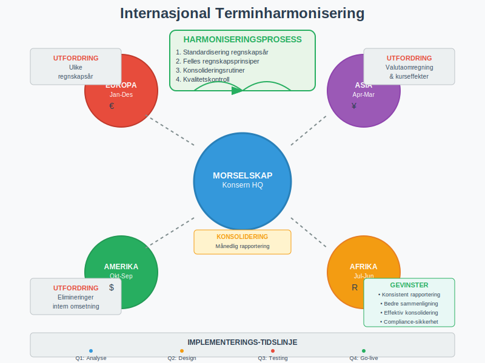

## Seksjon 9: Terminenes Påvirkning på Finansiell Analyse

### 9.1 Terminbaserte Finansielle Nøkkeltall

**Finansiell analyse** baseres på terminsammenligning:

#### Lønnsomhetsanalyse:
* **Terminens driftsresultat** som % av omsetning
* **[EBITDA](/blogs/regnskap/hva-er-ebitda "Hva er EBITDA? Beregning og Bruk i Finansiell Analyse")-utvikling** over terminer
* **Nettomargin-trender** og sesongvariasjoner

#### Likviditetsanalyse:
* **[Arbeidskapital](/blogs/regnskap/hva-er-arbeidskapital "Hva er Arbeidskapital? Beregning og Optimalisering")-endringer** mellom terminer
* **Kontantkonverteringsyclus** på terminbasis
* **Terminens frie kontantstrøm** og investeringskapasitet

**Terminanalyse eksempel:**
```
Q4 vs Q3 Analyse:
Omsetning: +15% (sesongeffekt handel)
Bruttomargin: -2pp (høyere innkjøpskostnader)
EBITDA: +8% (positiv volum delvis motvirket av margin)
Arbeidskapital: -25% (normal sesongmessig reduksjon)
```

### 9.2 Prediktiv Terminanalyse

**Fremtidig terminprestasjoner** kan estimeres gjennom:

#### Statistiske modeller:
* **Trendanalyse** over historiske terminer
* **Sesongdekomponering** for underliggende vekst
* **Regresjonsmodeller** med eksterne faktorer

#### Leading Indicators:
* **Ordrebok** og pipeline-styrke
* **Markedsindikatorer** og bransjeutvikling
* **Kompetitive posisjoner** og markedsandeler

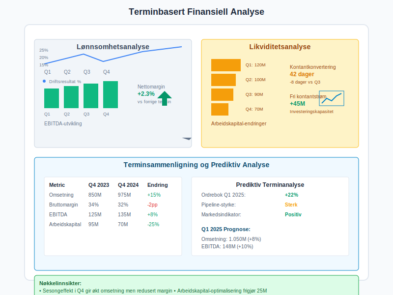

## Seksjon 10: Fremtidige Trender i Terminahatantering

### 10.1 Real-time Regnskapsføring

**Kontinuerlig regnskapsføring** endrer terminbegrepet:

#### Teknologiske drivere:
* **Cloud-baserte** regnskapssystemer
* **API-integrasjoner** for sanntidsdata
* **Kunstig intelligens** for automatisk klassifisering
* **Blockchain** for transaksjonssporing

#### Utfordringer:
* **Regulatoriske krav** til terminrapportering
* **Revisjons** og kontrollprosedyrer
* **Systemstabilitet** og datasikkerhet

### 10.2 ESG og Bærekraftsterminer

**Bærekraftsrapportering** krever nye terminmåliginger:

#### ESG-dimensjoner:
* **Karbonavtrykk** målt på terminbasis
* **Sosiale indikatorer** og medarbeidertilfredshet
* **Governance-metrics** og compliance-score

#### Integrert rapportering:
| **ESG-faktor** | **Terminmåling** | **Finansiell sammenheng** |
|----------------|------------------|--------------------------|
| COâ‚‚-utslipp | Månedlig måling | Karbonkostnad per enhet |
| Medarbeiderturnover | Kvartalsvis | Rekruttering- og opplæringskostnader |
| Compliance-score | Kontinuerlig | Risikojustert verdsettelse |

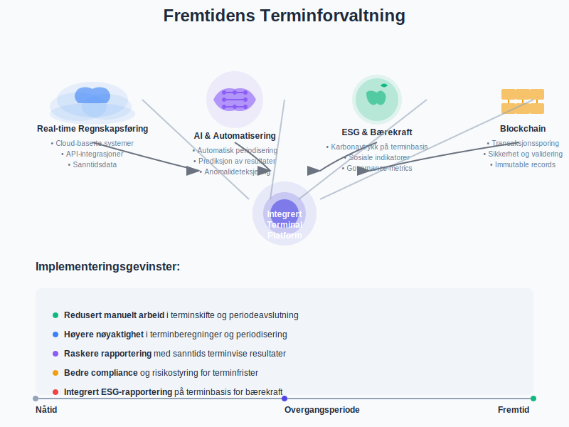

### 10.3 Automatisering og AI i Terminbehandling

**Intelligent terminoptimalisering:**

#### AI-anvendelser:
* **Automatisk periodisering** basert på kontraktstermer
* **Prediksjon** av terminresultater
* **Anomalideteksjering** i termindata
* **Optimaliseringng** av terminfrister og arbeidsflyt

#### Implementeringsgevinster:
* **Redusert manuelt arbeid** i terminskifte
* **Høyere nøyaktighet** i terminberegninger
* **Raskere** terminvise rapporter
* **Bedre** compliance og risikostyring

## Seksjon 11: Praktisk Terminimplementering

### 11.1 Oppsett av Terminstruktur

**Etablering av terminregime** krever:

#### Planleggingsfase:
1. **Definisjon** av hovedterminer og delperioder
2. **Klassifiseringssystem** for ulike transaksjontyper
3. **Kontrollrutiner** for terminskifte og avstemming
4. **Rapporteringsmatriks** og ansvarsfordeling

#### Implementeringstrinn:
| **Fase** | **Aktiviteter** | **Ansvarlig** | **Timeframe** |
|----------|-----------------|---------------|---------------|
| Design | Terminstruktur og policies | CFO/Controller | 4-6 uker |
| Konfigurasjon | ERP-oppsett og testing | IT/Regnskap | 8-12 uker |
| Migrering | Historiske data og validering | Regnskap | 2-4 uker |
| Go-live | Prod-kjøring og support | Alle | 2-4 uker |

### 11.2 Best Practices for Terminhåndtering

**Anbefalte prosedyrer:**

#### Terminskifte-rutiner:
* **Forhåndsdefinerte** avslutningsprosedyrer
* **Kvalitetskontroll** og fire-øyne-prinsipp
* **Dokumentasjon** av justeringer og antagelser
* **Tidsfrister** og milepælsrapportering

#### Kontinuerlig forbedring:
* **Post-implementation review** etter hver termin
* **Benchmarking** mot bransjepraksis
* **Prosessoptimalisering** og automatiseringsgevinster
* **Kompetanseutvikling** og opplæringsprogrammer

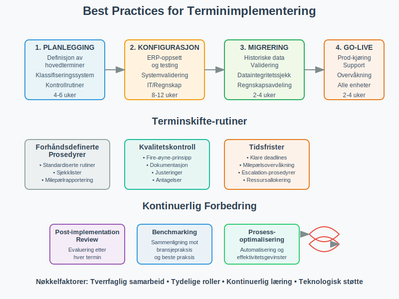

### 11.3 Terminrisiko og Mitigering

**Risikofaktorer i terminhåndtering:**

#### Operasjonelle risikier:
* **Manuelle feil** i periodisering og omkalkering
* **Systemfeil** og dataintegritetsutfordringer
* **Tidspress** ved terminskifte
* **Kompetansegap** og personavhengighet

#### Compliance-risikier:
* **Regelverk-brudd** og rapporteringsfeil
* **Revisjons-bemerkninger** og korrigeringskrav
* **Skattemessige** konsekvenser av feil terminplassering

#### Mitigeringsstrategier:
| **Risikokategori** | **Mitigering** | **Ansvarlig** |
|-------------------|----------------|---------------|
| Operasjonell | Automatisering og kontroller | IT/Prosess |
| Compliance | Regelmessig oppdatering og review | Legal/Compliance |
| Kompetanse | Training og cross-training | HR/Management |

## Konklusjon

**Termin** er et fundamentalt konsept som strukturerer hele regnskapsføringen og den finansielle rapporteringen. Fra grunnleggende periodisering til komplekse finansielle instrumenter, påvirker terminbehandling alle aspekter av [bedriftens økonomi](/blogs/regnskap/hva-er-bedriftsokonomi "Hva er Bedriftsøkonomi? Grunnleggende Prinsipper og Anvendelse") og [regnskapsføring](/blogs/regnskap/hva-er-bokforing "Hva er Bokføring? Grunnleggende Prinsipper og Prosesser").

**Nøkkelinnsikter:**

* **Strukturell betydning:** Terminer gir rammeverket for all finansiell måling og rapportering
* **Compliance-kritisk:** Korrekt terminbehandling er essensielt for regelverk-overholdelse
* **Beslutningsstøtte:** Terminanalyse gir innsikt i trender og forretningsutvikling
* **Strategisk verktøy:** Terminplanlegging muliggjør proaktiv forretningsstyring

**Praktisk anvendelse:**

For regnskapsførere, controllere og økonomiansvarlige er mestring av terminkoncepter essensielt for:
- **Nøyaktig [periodisering](/blogs/regnskap/hva-er-periodisering "Hva er Periodisering? Grunnleggende Regnskapsprinsipp")** av inntekter og kostnader
- **Effektiv** terminskifte og månedsavslutning
- **Robust** planlegging og [budsjettering](/blogs/regnskap/hva-er-budsjettering "Hva er Budsjettering? Planlegging og Kontroll av Bedriftens Økonomi")
- **Kvalitets** finansiell rapportering og analyse

**Fremtidsperspektiv:**

Digitaliseringen transformerer terminhåndtering med sanntids-regnskapsføring, AI-dreven automatisering og integrert ESG-rapportering. Bedrifter som investerer i moderne terminforvaltningssystemer og bygger robust kompetanse innen periodisering, vil være best posisjonert for fremtidens regnskaps- og rapporteringskrav.

Terminmesteing er ikke bare en teknisk regnskapsferdighet - det er et strategisk verktøy for verdiskapning gjennom bedre [økonomisk planlegging](/blogs/regnskap/hva-er-okonomisk-planlegging "Hva er Økonomisk Planlegging? Strategisk Planlegging og Analyse"), tidsriktig beslutningsfatting og optimalisert [ressursallokering](/blogs/regnskap/hva-er-ressursallokering "Hva er Ressursallokering? Optimal Fordeling av Bedriftens Ressurser"). Ved å integrere terminperspektivet i alle forretningsmessige beslutninger kan bedrifter oppnå både operasjonell eksellens og langsiktig konkurransefortinn.


