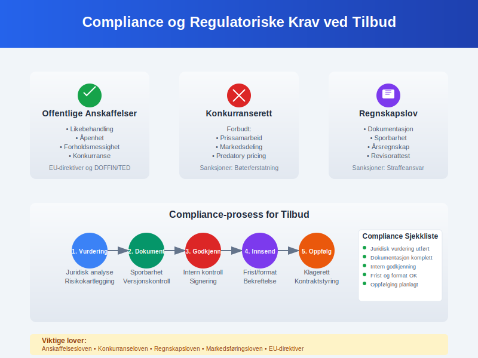

Et **tilbud** er en forretningsproposisjon hvor en leverandør presenterer sine produkter, tjenester, priser og vilkår for en potensiell kunde. I regnskapssammenheng er tilbud en viktig del av **salgsprocessen** og danner grunnlaget for kontraktsinngåelse og senere [fakturering](/blogs/regnskap/hva-er-faktura "Hva er en Faktura? En Guide til Norske Fakturakrav"). Tilbud representerer ikke bare en salgsmulighet, men også en **regnskapsmessig forpliktelse** som må håndteres i samsvar med god [regnskapsskikk](/blogs/regnskap/god-regnskapsskikk "God Regnskapsskikk - Komplett Guide til Regnskapsstandarder").
*Se også: [Ordrebekreftelse](/blogs/regnskap/ordrebekreftelse "Ordrebekreftelse i Regnskap: Komplett Guide til Ordrebekreftelser")*  

## Seksjon 1: Tilbudets Grunnleggende Konsept

Et tilbud fungerer som en **juridisk invitasjon** til å inngå en kontrakt, og har derfor både kommersielle og regnskapsmessige implikasjoner.


### 1.1 Juridisk Definisjon av Tilbud

**Tilbud** i juridisk forstand er:
- En konkret forespørsel om å inngå en bestemt avtale
- **Bindende** for tilbyderen i tilbudsperioden
- Kan aksepteres av mottakeren for å skape en gyldig kontrakt
- Må inneholde alle vesentlige avtalevilkår

### 1.2 Regnskapsmessig Betydning

Fra regnskapsperspektiv påvirker tilbud:

* **[Prognoser](/blogs/regnskap/hva-er-prognose "Hva er Prognose i Regnskap? Guide til Økonomisk Planlegging og Budsjett")** og budsjetting
* **Kontraktsvurdering** og risikoanalyse  
* **Prosjektkalkulasjon** og [kostnadsestimering](/blogs/regnskap/hva-er-kostnad "Hva er Kostnad? Komplett Guide til Kostnadstyper og Kostnadsføring")
* **Kapasitetsplanlegging** og ressursallokering

### 1.3 Tilbudsprosessens Faser

| **Fase** | **Aktiviteter** | **Regnskapsmessig Fokus** |
|----------|-----------------|---------------------------|
| **Forespørsel** | Kunde uttrykker behov | Mulighetsregistrering |
| **Behovsanalyse** | Kartlegging av krav | [Kostnadsestimering](/blogs/regnskap/hva-er-kostnad "Hva er Kostnad? Komplett Guide til Kostnadstyper og Kostnadsføring") |
| **Prisberegning** | Kalkulasjon og marging | [Prissetting](/blogs/regnskap/hva-er-pris "Hva er Pris? Regnskap og Økonomisk Analyse av Prisstrategier") |
| **Tilbudsutsendelse** | Formell proposisjon | Forpliktelsesregistrering |
| **Oppfølging** | Svar og forhandlinger | Kontraktsmodifikasjon |


## Seksjon 2: Tilbudstyper og Karakteristika

### 2.1 Forespurt vs. Uforespurt Tilbud

**Forespurte tilbud:**
- Basert på **anbudsinnbydelser** eller forespørsler
- Strukturerte krav og evalueringskriterier
- Konkurransesituasjon med andre leverandører
- Høyere sannsynlighet for gevinst

**Uforespurte tilbud:**
- **Proaktive** salgstiltak
- Krever større markedsinnsikt
- Høyere risiko, men potensielt høyere marginer
- Viktig for utvikling av nye kundeforhold

### 2.2 Bransjespesifikke Tilbudstyper

#### Bygge- og Anleggsbransjen
- **Totalentrepriser** med fast pris
- Komplekse tekniske spesifikasjoner
- Lang prosjektperiode og [periodisering](/blogs/regnskap/hva-er-periodisering "Hva er Periodisering? Guide til Regnskapsmessig Periodisering")

#### IT og Konsulentbransjer  
- **Time & Material** kontrakter
- Iterative leveranser og endringshåndtering
- Immaterielle leveranser og [avregningsmetoder](/blogs/regnskap/hva-er-avregning "Hva er Avregning i Regnskap? Komplett Guide til Avregning")

#### Produksjonsbedrifter
- **Rammeavtaler** med volumrabatter
- Standardiserte produkter med prisvariasjoner
- [Lageroptimalisering](/blogs/regnskap/hva-er-varelager "Hva er Varelager? En Komplett Guide til Lagerføring og Verdivurdering") og leveringstider

| **Bransje** | **Typisk Tilbudsperiode** | **Hovedfokus** | **Regnskapsmessige Utfordringer** |
|-------------|---------------------------|----------------|------------------------------------|
| **Bygg/Anlegg** | 3-6 måneder | Teknisk løsning | [Prosjektregnskap](/blogs/regnskap/hva-er-prosjektregnskap "Hva er Prosjektregnskap? Guide til Prosjektbasert Økonomi") |
| **IT/Konsulent** | 2-8 uker | Kompetanse/metodikk | Tidsregistrering |
| **Produksjon** | 1-4 uker | Pris/kvalitet | [Varekostnad](/blogs/regnskap/hva-er-varekostnad "Hva er Varekostnad? Komplett Guide til Kostnad av Solgte Varer") |
| **Tjenester** | 1-6 uker | Service/tilgjengelighet | [Periodisering](/blogs/regnskap/hva-er-periodisering "Hva er Periodisering? Guide til Regnskapsmessig Periodisering") |


## Seksjon 3: Tilbudskalkulation og Prissetning

### 3.1 Kostnadsbasert Prissetting

**Direkte kostnader:**
- [RÃ¥varer](/blogs/regnskap/hva-er-ravarekostnad "Hva er RÃ¥varekostnad? Komplett Guide til Material og Produksjonskostnader") og materialer
- Arbeidskraft direkte knyttet til leveransen
- **Underleverandører** og eksterne tjenester

**Indirekte kostnader:**
- [Overhead](/blogs/regnskap/hva-er-overhead "Hva er Overhead? Komplett Guide til Indirekte Kostnader") og administrative kostnader
- **Salgs- og markedsføringskostnader** 
- [Avskrivninger](/blogs/regnskap/hva-er-avskrivning "Hva er Avskrivning? Komplett Guide til Avskrivningsmetoder") på utstyr

### 3.2 Marginalberegning

**Dekningsbidragsanalyse:**

```
Salgspris
- Variable kostnader
= Dekningsbidrag I
- Produktspesifikke faste kostnader  
= Dekningsbidrag II
- Fellesfaste kostnader
= Resultat
```

### 3.3 Risikoestimering og Buffere

**Identifisering av risikoer:**
- **Teknisk risiko:** Ukjente problemstillinger
- **Kommersiell risiko:** Markedsendringer
- **Operasjonell risiko:** Ressursmangel eller forsinkelser

**Risikobuffere:**
- **Kontingency:** 5-15% for ukjente forhold
- **Eskalering:** Prisstigning i prosjektperioden
- **Valutarisiko:** For internasjonale kontrakter

| **Risikofaktor** | **Typisk Buffer** | **HÃ¥ndteringsmetode** |
|------------------|-------------------|-----------------------|
| Teknisk kompleksitet | 10-20% | Prototype/testing |
| Markedsvolatilitet | 5-15% | Prisindeksering |
| Ressursknapphet | 8-12% | Fleksible kontrakter |
| Valutaeksponering | 2-8% | [Valutasikring](/blogs/regnskap/hva-er-valutakurs "Hva er Valutakurs? Regnskap og Regnskapsføring av Valutatransaksjoner") |


## Seksjon 4: Juridiske og Kontraktsmessige Aspekter

### 4.1 Tilbudets Bindende Karakter

**Tilbyder er bundet** av:
- **Tilbudsperioden** som er oppgitt
- De tekniske og kommersielle vilkårene
- **Prisene** som er kommunisert
- Leveringsvilkår og betalingsbetingelser

**Unntak fra binding:**
- Åpenbare feil eller misforståelser
- **Vesentlige endringer** i forutsetninger
- Force majeure hendelser
- Tilbudt med forbehold

### 4.2 Kontraktsmodifikasjon

**Endringer etter tilbudsavgivelse:**
- Krever **skriftlig dokumentasjon**
- PÃ¥virker pris og leveringstid
- Kan utløse ny tilbudsprosess
- Regnskapsmessig behandling av endringer

### 4.3 Angrerett og Tilbaketrekking

**Tilbaketrekking før aksept:**
- Mulig dersom ingen bindende frist
- **Erstatningsansvar** kan oppstå
- Reputasjonsmessige konsekvenser

**Etter kontraktsinngåelse:**
- Begrenset angrerett for forbrukere
- **Erhvervskunder** har normalt ikke angrerett
- Kontraktsbruddsansvar ved ensidig heving


## Seksjon 5: Regnskapsføring av Tilbud og Kontrakter

### 5.1 Regnskapsmessig Tidspunkt

**Tilbudsstadiet:**
- **Ingen inntektsføring** (kun kostnader)
- Tilbudskostnader som [salgsomkostninger](/blogs/regnskap/hva-er-salgskostnad "Hva er Salgskostnad? Komplett Guide til Salgsrelaterte Utgifter")
- Eventualforpliktelser i noter

**Kontraktsinngåelse:**
- **Kontraktseiendel** etableres
- Inntektsføring etter [leveranseprinsipper](/blogs/regnskap/hva-er-inntektsfoering "Hva er Inntektsføring? Komplett Guide til IFRS 15 og Regnskapsstandard")
- [Periodisering](/blogs/regnskap/hva-er-periodisering "Hva er Periodisering? Guide til Regnskapsmessig Periodisering") av kostnader og inntekter

### 5.2 IFRS 15 og Kontraktsinntekter

**Femtrinnsprosessen:**
1. **Identifiser kontrakt** med kunde
2. **Identifiser ytelsesforpliktelser** i kontrakten  
3. **Bestem transaksjonsprisen** 
4. **Allokér transaksjonsprisen** til ytelsesforpliktelser
5. **Innregnіng av inntekt** når ytelsesforpliktelse oppfylles

### 5.3 Praktisk Regnskapsføring

**Ved tilbudsavgivelse:**
```
Dr. Salgsomkostninger         XX.XXX
    Kr. Bank/Leverandørgjeld      XX.XXX
(Kostnader ved tilbudsutarbeidelse)
```

**Ved kontraktsinngåelse:**
```
Dr. Kontraktseiendel          XXX.XXX  
    Kr. Kontraktsinntekter        XXX.XXX
(Inntektsføring ved ytelsesoppfyllelse)
```

**Ved fakturering:**
```
Dr. Kundefordringer          XXX.XXX
    Kr. Kontraktseiendel          XXX.XXX  
(Overføring til kundefordring)
```

| **Transaksjon** | **Debet** | **Kredit** | **Timing** |
|-----------------|-----------|------------|------------|
| Tilbudskostnader | Salgskostnad | Bank/Kreditor | Ved påløp |
| Kontraktsinngåelse | Kontraktseiendel | Inntekt | Ved leveranse |
| Fakturering | [Debitor](/blogs/regnskap/hva-er-debitor "Hva er Debitor i Regnskap? Komplett Guide til Kundefordringer og Debitorhåndtering") | Kontraktseiendel | Ved faktura |
| Betaling | Bank | [Debitor](/blogs/regnskap/hva-er-debitor "Hva er Debitor i Regnskap? Komplett Guide til Kundefordringer og Debitorhåndtering") | Ved innbetaling |


## Seksjon 6: Tilbudsstyring og Systemer

### 6.1 Tilbudsprosess og Workflow

**Digitale tilbudssystemer** støtter:
- **Standardiserte maler** og prosesser
- Automatisk kalkulering og prisberegning
- **Godkjenningsworkflows** og sporbarhet
- Integration med [ERP-systemer](/blogs/regnskap/hva-er-erp-system "Hva er ERP-system? Komplett Guide til Enterprise Resource Planning")

### 6.2 CRM-integrasjon

**Customer Relationship Management:**
- **Kundehistorikk** og tidligere tilbud
- [Pipeline-styring](/blogs/regnskap/hva-er-pipeline "Hva er Pipeline? Salgs- og Regnskapsstyring av Salgsmulighetene") og salgsprognoser
- **Oppfølging** og kundeinteraksjon
- Rapportering og analyse av tilbudsresultater

### 6.3 Dokumenthåndtering

**Versjonskontroll:**
- **Revisjonssporing** av tilbudsendringer
- Digital signering og godkjenning
- **Arkivering** i henhold til regnskapslov
- Backup og datasikkerhet

| **System** | **Hovedfunksjon** | **Integrasjoner** | **Fordeler** |
|------------|-------------------|-------------------|--------------|
| **CRM** | Kundestyring | [ERP](/blogs/regnskap/hva-er-erp-system "Hva er ERP-system? Komplett Guide til Enterprise Resource Planning"), Email | Sentralisert kundeinformasjon |
| **CPQ** | Konfigurasjon/Prising | CRM, ERP | Automatisert prissetting |
| **DMS** | Dokumenthåndtering | Alle systemer | Sikker dokumentlagring |
| **BI** | Analyse/Rapportering | CRM, ERP | Databaserte beslutninger |


## Seksjon 7: Tilbudsanalyse og KPIer

### 7.1 Sentrale Tilbudsmålinger

**Volummålinger:**
- **Antall tilbud** avgitt per periode
- Gjennomsnittlig tilbudsverdi
- **Tilbudspipeline** og verdi
- Geografisk og sektormessig fordeling

**Kvalitetsmålinger:**
- **Vinnrate** (% vunnede tilbud)
- Gjennomsnittlig tilbudstid
- **Marginal på vunnede** kontrakter
- Kundetilfredshet med tilbudsprosess

### 7.2 Lønnsomhetsanalyse

**ROI på tilbudsaktivitet:**
```
ROI = (Inntekter fra vunnede tilbud - Tilbudskostnader) / Tilbudskostnader × 100%
```

**Payback-periode:**
- Tid fra tilbudsavgivelse til **første inntekt**
- **Break-even punkt** for tilbudsinvestering
- Kapitalbinding i tilbudsprosessen

### 7.3 Benchmarking og Forbedring

| **KPI** | **Industristandard** | **Beste praksis** | **Forbedringspotensial** |
|---------|----------------------|-------------------|--------------------------|
| **Vinnrate** | 15-25% | 30-40% | Bedre kvalifisering |
| **Tilbudstid** | 2-6 uker | 1-3 uker | Standardisering |
| **Marginal** | 8-15% | 20-25% | Verdibasert prising |
| **Kostnad per tilbud** | 2-5% av verdi | 1-3% av verdi | Automatisering |


## Seksjon 8: Risikostyring i Tilbudsprosessen

### 8.1 Identifisering av Risikoer

**Kommersielle risikoer:**
- **Prispress** fra konkurrenter
- Endringer i markedsbetingelser
- **Valutavolatilitet** for internasjonale tilbud
- Kredittrisiko hos kunder

**Operasjonelle risikoer:**
- **Kapasitetsmangel** ved leveranse
- Teknologiske utfordringer
- **Leverandørrisiko** for underleveranser
- Kompetansemangel i organisasjonen

### 8.2 Risikoreduserende Tiltak

**Kontraktsmessige beskyttelser:**
- **Prisindeksering** og eskaleringsklaususler
- Force majeure bestemmelser
- **Begrensninger** i leverandøransvar
- Betalingssikkerhet og garantier

**Operasjonelle beskyttelser:**
- **Kvalitetssikring** av tilbudsprosessen
- Backup-planer for kritiske leveranser
- **Forsikringsdekning** for store prosjekter
- Partneravtaler og allianser

### 8.3 Kontinuerlig Risikostyring

| **Risikotype** | **Sannsynlighet** | **Konsekvens** | **Mitigering** |
|----------------|-------------------|----------------|----------------|
| **Prisrisiko** | Høy | Medium | Fleksible kontrakter |
| **Leveringsrisiko** | Medium | Høy | Redundante leverandører |
| **Teknisk risiko** | Medium | Høy | Prototyping/testing |
| **Kredittrisiko** | Lav | Høy | [Kredittvurdering](/blogs/regnskap/hva-er-kredittvurdering "Hva er Kredittvurdering? Risikoanalyse og Kredittbeslutninger") |


## Seksjon 9: Compliance og Regulatoriske Krav

### 9.1 Offentlige Anskaffelser

**Lov om offentlige anskaffelser:**
- **Likebehandling** og ikke-diskriminering
- Åpenhet og etterprøvbarhet
- **Forholdsmessighet** i krav og kriterier
- Konkurranse og effektivitet

**EU-direktiver:**
- **Terskelverdier** for ulike anskaffelser
- Kunngjøringsplikt i DOFFIN/TED
- **Klagerettsprosesser** og rettssikkerhet
- Miljømessige og sosiale hensyn

### 9.2 Konkurranserett

**Forbudte praksiser:**
- **Prissamarbeid** og kartelldannelse
- Markedsdeling og kundefordeling
- **Predatory pricing** og undergravende konkurransemåter
- Misbruk av markedsdominans

### 9.3 Regnskapslovgivning

**Bokføringsplikter:**
- **Dokumentasjon** av tilbudsprosessen
- Sporbarhet av kalkulasjoner og beslutninger
- **Ã…rsregnskap** og notetillegg
- Revisorattestasjon av store kontrakter

| **Regulering** | **Anvendelsesområde** | **Hovedkrav** | **Sanksjoner** |
|----------------|----------------------|---------------|----------------|
| **Anskaffelsesloven** | Offentlig sektor | Konkurranse/åpenhet | Ugyldiggjøring |
| **Konkurranseloven** | Alle aktører | Ikke samarbeid | Bøter/erstatning |
| **Regnskapsloven** | Regnskapspliktige | Dokumentasjon | Straffeansvar |
| **Markedsføringsloven** | Kommersielle aktører | Sannferdig markedsføring | Markedsföringsverbot |



## Seksjon 10: Digitalisering og Fremtidige Trender

### 10.1 Kunstig Intelligens i Tilbudsprosessen

**AI-baserte løsninger:**
- **Automatisk tilbudsgenerering** basert på historiske data
- Prediktiv analyse av vinnersannsynlighet
- **Optimal prissetting** gjennom maskinlæring
- Naturlig språkprosessering for kravanalyse

**Machine Learning applikasjoner:**
- **Mønstergjenkjenning** i kundepreferanser
- Risikoscoring av nye tilbudsmuligheter
- **Konkurranseanalyse** og benchmarking
- Kvalitetssikring av tilbudsinnhold

### 10.2 Blockchain og Smart Contracts

**Fordeler med blockchain:**
- **Uforanderlig** dokumentasjon av tilbudsprosess
- Automatisk oppfyllelse av kontraktsvilkår
- **Redusert tillitskostnad** mellom parter
- Transparent og sporbar transaksjonshåndtering

**Smart contracts:**
- **Automatisk betaling** ved leveransemilepæler
- Selvutførende sanksjoner ved kontraktsbrudd
- **Integrert escrow-funksjoner** for sikkerhet
- Reduserte administrative kostnader

### 10.3 Internet of Things (IoT) og Sanntidsdata

**IoT-aktiverte tilbud:**
- **Sanntids ytelsesdata** fra eksisterende installasjoner
- Prediktivt vedlikehold og serviceavtaler
- **Bruksbasert prissetting** og abonnementsmodeller
- Kontinuerlig optimalisering av leveranser

| **Teknologi** | **Implementeringsgrad** | **Potensial** | **Utfordringer** |
|---------------|-------------------------|---------------|------------------|
| **AI/ML** | Tidlig fase | Høyt | Datakvalitet |
| **Blockchain** | Pilotprosjekter | Høyt | Skalering/energi |
| **IoT** | Voksende bruk | Medium | Sikkerhet/integrering |
| **RPA** | Utbredt | Medium | Prosessmodning |


## Seksjon 11: Internasjonale Perspektiver

### 11.1 Kulturelle Forskjeller i Tilbudsprosesser

**Nordamerika:**
- **Direkte** og konkurransefokusert tilnærming
- Korte beslutningstider og klar kommunikasjon
- **Juridisk orientert** kontraktsutforming
- Høy grad av standardisering

**Asia-Stillehavsregionen:**
- **Relasjonsbyggende** og langsiktig tilnærming
- Betydningen av ansikt og respekt i forhandlinger
- **Hierarkiske** beslutningsprosesser
- Viktighet av personlige møter og tillit

**Europa:**
- **Regulatorisk kompleksitet** og compliance-fokus
- Sterke arbeidstakerrettigheter og miljøkrav
- **Konsensusbaserte** beslutningsprosesser
- Historisk og kulturell kontekst

### 11.2 Valutarisiko og Sikring

**Valutaeksponering:**
- **Transaksjonsrisiko:** Endringer mellom tilbud og betaling
- Translationsrisiko: Rapportering i ulike valutaer
- **Økonomisk risiko:** Langsiktig konkurranseevne

**Sikringsstrategier:**
- **Valutaterminer** for kortsiktig eksponering
- Opsjoner for usikre kontrakter
- **Naturlig sikring** gjennom matchende in- og utbetalinger
- Prisindeksering til relevant valutakurv

### 11.3 Regulatoriske Forskjeller

| **Region** | **Hovedfokus** | **Typiske Krav** | **Spesielle Hensyn** |
|------------|----------------|------------------|----------------------|
| **EU** | Ã…penhet/konkurranse | GDPR, anskaffelsesdirektiver | Digital Single Market |
| **USA** | Effektivitet/innovasjon | SEC-rapportering, antitrust | Buy American Act |
| **Asia** | Vekst/relasjoner | Lokalt innhold, JV-krav | Guanxi og nettverk |
| **Midt-Østen** | Stabilitet/sikkerhet | Islamsk finans, lokalisering | Geopolitisk risiko |


## Seksjon 12: Bærekraftige Tilbud og ESG

### 12.1 Miljømessige Hensyn

**Livssyklusanalyse:**
- **Miljøpåvirkning** fra råmaterialer til avhending
- Karbonfotavtrykk og klimagassutslipp
- **Sirkulære økonomi** prinsipper
- Biodiversitet og økosystemtjenester

**Grønne tilbudskriterier:**
- **Miljøsertifiseringer** og standarder
- Fornybar energibruk og energieffektivitet
- **Avfallsreduksjon** og gjenvinning
- Bærekraftige transport- og logistikkløsninger

### 12.2 Sosiale og Etiske Dimensjoner

**Samfunnsansvar:**
- **Arbeiderrettigheter** og sikre arbeidsforhold
- Mangfold og inkludering i verdikjeden
- **Lokalsamfunn** påvirkning og bidrag
- Korrupsjonsbekjempelse og etikk

**Supply chain responsibility:**
- **Due diligence** av leverandører
- Menneskerettigheter og barnearbeid
- **Konfliktmineraler** og etisk sourcing
- Transparent rapportering og sporarhet

### 12.3 Styringsmessige (Governance) Faktorer

**Bedriftsstyring:**
- **Uavhengighet** og mangfold i styret
- Transparent beslutningstaking
- **Risikostyring** og internkontroll
- Etiske retningslinjer og compliance

| **ESG-faktor** | **Tilbudspåvirkning** | **Målingsmetrikker** | **Rapporteringskrav** |
|----------------|----------------------|---------------------|------------------------|
| **Miljø** | Produktdesign/prosess | CO2, energi, avfall | EU-taksonomi |
| **Sosialt** | Leverandørvalg | Mangfold, sikkerhet | GRI-standarder |
| **Styring** | Beslutningsprosess | Etikk, compliance | Ã…penhetsloven |


## Konklusjon

**Tilbud** representerer et kritisk krysningspunkt mellom salg, [regnskap](/blogs/regnskap/hva-er-regnskap "Hva er Regnskap? Komplett Guide til Norsk Regnskapsføring") og juridiske forpliktelser. I en stadig mer kompleks og digitalisert forretningsverden krever effektiv tilbudsstyring en helhetlig tilnærming som integrerer kommersielle, regnskapsmessige og strategiske perspektiver.

**Nøkkelinnsikter for moderne tilbudsstyring:**

* **Strukturert prosess:** Standardiserte workflows og klare godkjenningsprosesser sikrer kvalitet og sporbarhet
* **Teknologiintegrasjon:** Digitale verktøy for CRM, kalkulasjon og dokumenthåndtering øker effektivitet
* **Risikostyring:** Proaktiv identifisering og mitigering av kommersielle og operasjonelle risikoer
* **Compliance:** Etterlevelse av regulatoriske krav innen anskaffelser, konkurranse og [regnskap](/blogs/regnskap/hva-er-regnskap "Hva er Regnskap? Komplett Guide til Norsk Regnskapsføring")

**Regnskapsmessige implikasjoner:**

For regnskapsførere og økonomiansvarlige er tilbudsprosessen kritisk for:
- **Inntektsføring** i henhold til IFRS 15 og god [regnskapsskikk](/blogs/regnskap/god-regnskapsskikk "God Regnskapsskikk - Komplett Guide til Regnskapsstandarder")
- **[Prognoser](/blogs/regnskap/hva-er-prognose "Hva er Prognose i Regnskap? Guide til Økonomisk Planlegging og Budsjett")** og budsjettering basert på tilbudspipeline
- **[Prosjektregnskap](/blogs/regnskap/hva-er-prosjektregnskap "Hva er Prosjektregnskap? Guide til Prosjektbasert Økonomi")** og [periodisering](/blogs/regnskap/hva-er-periodisering "Hva er Periodisering? Guide til Regnskapsmessig Periodisering") av leveranser
- **Dokumentasjon** og sporbarhet for revisjon og kontroll

**Fremtidige trender:**

Tilbudsprosessen vil i økende grad preges av:
- **Kunstig intelligens** for automatisering og optimalisering
- **Bærekraftskrav** som integrert del av evalueringskriterier  
- **Digitale kontrakter** og blockchain-baserte løsninger
- **Sanntidsdata** og IoT-aktiverte servicetilbud

**Strategisk betydning:**

For bedriftsledelse representerer tilbudsstyring en strategisk kapabilitet som påvirker:
- **Markedsposisjonering** og konkurranseevne
- **Lønnsomhet** og [kapitalavkastning](/blogs/regnskap/hva-er-avkastning "Hva er Avkastning på Investering? Beregning og Analyse av ROI")
- **Risikoprofil** og operasjonell stabilitet
- **Vekststrategi** og markedsekspansjon

Som en grunnleggende forretningsprosess krever tilbudsstyring kontinuerlig utvikling og tilpasning til endrede markedsforhold, teknologiske muligheter og regulatoriske krav. Ved å kombinere solid regnskapsmessig forankring med moderne teknologi og bærekraftsprinsipper, kan organisasjoner skape varige konkurransefortrinn og bidra til verdiskapning for alle interessenter.

**Tilbud** er ikke bare en salgsprosess - det er en strategisk investering i fremtidig forretningsutvikling som krever profesjonell tilnærming, robust styring og kontinuerlig forbedring for å lykkes i dagens dynamiske markedslandskap.


