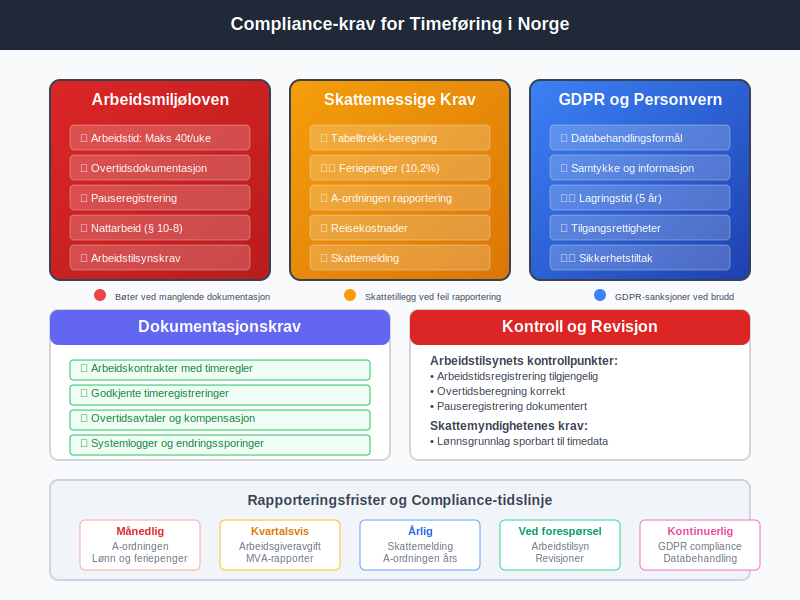

**Timeføring** er en systematisk prosess for å registrere, spore og administrere arbeidstid som ansatte bruker på ulike oppgaver, prosjekter eller kunder. I norsk forretningssammenheng omfatter timeføring ikke bare den faktiske registreringen av timer, men også den påfølgende behandlingen av disse dataene for [lønn og personaladministrasjon](/blogs/regnskap/hva-er-lonn "Lønn og Personaladministrasjon - Komplett Guide"), [fakturering](/blogs/regnskap/hva-er-en-faktura "Hva er en Faktura? En Guide til Norske Fakturakrav"), kostnadsberegning og [prosjektstyring](/blogs/regnskap/hva-er-prosjektregnskap "Prosjektregnskap - Komplett Guide til Prosjektbasert Økonomi"). Moderne timeføring er integrert med digitale systemer som automatiserer datainnsamling og gir verdifull innsikt i produktivitet, ressursbruk og lønnsomhet.

## Seksjon 1: Grunnleggende Timeføringskonsepter

### 1.1 Definisjoner og Terminologi

**Timeføring** består av flere komponenter som sammen skaper et helhetlig system for tidsadministrasjon:

* **Tidsregistrering** - Selve prosessen med å registrere start- og sluttidspunkt for arbeid
* **Timepost** - En enkelt registrering av tid brukt på en spesifikk aktivitet eller prosjekt
* **Timekoder** - Kategorisering av tid etter type arbeid, prosjekt eller kostnadssted
* **Rapporteringsperiode** - Tidsintervall for sammenstilling og rapportering av timedata
* **Fakturerbar tid** - Timer som kan belastes direkte til kunder eller prosjekter
* **Overhead-tid** - Administrativ tid som ikke kan faktureres direkte

### 1.2 Timeføringens Rolle i Regnskapet

Timeføring er tett integrert med [bokføring](/blogs/regnskap/hva-er-bokforing "Bokføring - Komplett Guide til Norsk Regnskapspraksis") og fungerer som grunnlag for:

| Regnskapsområde | Timeføringens Bidrag |
|----------------|---------------------|
| **Lønnsregnskap** | Grunnlag for lønnsbetaling og overtidskompensasjon |
| **Kostnadsfordeling** | Allokering av personalkostnader til prosjekter og kostnadssteder |
| **Fakturering** | Dokumentasjon for tidbasert fakturering til kunder |
| **Budsjettering** | Historiske data for kapasitetsplanlegging og kostnadsestimering |
| **Lønnsomhetsanalyse** | Sammenligning av tidsinnsats med inntekter per prosjekt |

## Seksjon 2: Juridiske Rammeverk og Compliance

### 2.1 Arbeidsmiljøloven og Timeføring

Norsk [arbeidsmiljølov](/blogs/regnskap/hva-er-arbeidsmiljoloven "Arbeidsmiljøloven - Guide til Arbeidsrettslige Forpliktelser") stiller spesifikke krav til dokumentasjon av arbeidstid:

* **Arbeidstidsbestemmelser** - Maksimal arbeidsuke på 40 timer i gjennomsnitt
* **Overtidsregulering** - Dokumentasjon av overtid og kompensasjon
* **Pauseregler** - Registrering av obligatoriske pauser og hvileperioder
* **Søndagsarbeid** - Spesielle krav til dokumentasjon og godkjenning

### 2.2 Skattemessige Implikasjoner

Timeføringssystemer må understøtte [skattemessige krav](/blogs/regnskap/hva-er-skatt "Skatt - Komplett Guide til Skatteforpliktelser") for:

* **Kildeskatt** - Riktig beregning av [tabelltrekk](/blogs/regnskap/hva-er-tabelltrekk "Tabelltrekk - Guide til Norsk Skattetrekk") basert på faktiske arbeidstimer
* **Overtidstillegg** - Skattemessig behandling av overtidsgodtgjørelse
* **Reisekostnader** - Dokumentasjon av arbeidstid på ulike arbeidsssteder
* **Feriepenger** - Korrekt beregning basert på opptjent arbeidstid

### 2.3 GDPR og Personvern

Timeføringssystemer behandler personopplysninger og må følge GDPR-krav:

* **Datainnsamling** - Kun nødvendige opplysninger for timeføring
* **Lagringstid** - Definerte retningslinjer for hvor lenge timedata oppbevares
* **Tilgangsrettigheter** - Ansattes rett til å se og korrigere egne timedata
* **Sikkerhet** - Kryptering og sikker lagring av sensitive timedata

## Seksjon 3: Timeføringssystemer og Teknologi

### 3.1 Tradisjonelle Timeføringssystemer

Historisk sett har timeføring utviklet seg fra manuelle til digitale systemer:

* **Stemplingsur** - Fysiske systemer for registrering av inn- og utstempling
* **Timesedler** - Papirbaserte skjemaer for manuell tidsregistrering
* **Excel-baserte systemer** - Digitaliserte regneark for timeføring
* **Dedikerte timeføringsprogrammer** - Spesialisert programvare for tidsadministrasjon

### 3.2 Moderne Digitale Løsninger

Dagens timeføringssystemer tilbyr avansert funksjonalitet:

**Sanntidsregistrering:**
* Automatisk start/stopp av tidsregistrering
* GPS-basert posisjonering for mobilt arbeid
* Integrasjon med kalendersystemer
* Automatisk kategorisering av aktiviteter

**Prosjektintegrasjon:**
* Kobling til [prosjektstyringssystemer](/blogs/regnskap/hva-er-prosjektstyring "Prosjektstyring - Guide til Effektiv Prosjektledelse")
* Automatisk allokering til kostnadssentere
* Budsjettsporing og varsling
* Rapportering per prosjektfase

**Mobilteknologi:**
* Dedikerte apper for timeregistrering
* Offline-funksjonalitet for områder uten nettdekning
* Push-notifikasjoner for timeføringspåminnelser
* Biometrisk autentisering for sikkerhet

### 3.3 Integrasjon med Andre Systemer

Moderne timeføringssystemer integreres med:

| System | Integrasjonsmuligheter |
|--------|----------------------|
| **ERP-systemer** | Automatisk overføring til [hovedbok](/blogs/regnskap/hva-er-hovedbok "Hovedbok - Guide til Regnskapets Fundament") og lønnsmodul |
| **CRM-systemer** | Kobling av timebruk til kundeprosjekter og aktiviteter |
| **Faktureringssystemer** | Automatisk generering av tidbaserte fakturaer |
| **HR-systemer** | Integrasjon med ferie- og sykefraværsregistrering |
| **Business Intelligence** | Dataoverføring til analyseverktøy og dashboards |

## Seksjon 4: Implementering og Beste Praksis

### 4.1 Planlegging av Timeføringssystem

Vellykket implementering krever grundig planlegging:

**Behovsanalyse:**
* Kartlegging av eksisterende timeføringsprosesser
* Identifisering av forbedringspotensial
* Definering av krav og målsetninger
* Evaluering av tekniske muligheter og begrensninger

**Organisatoriske Faktorer:**
* Antall ansatte og arbeidsstasjoner
* Geografisk spredning av virksomheten
* Kompleksitet i prosjektstruktur
* Integrasjonsbehov med eksisterende systemer

**Prosessdesign:**
* Standardisering av timeføringsprosedyrer
* Definering av timekoder og kategorier
* Etablering av godkjennings- og kontrollrutiner
* Utvikling av rapporteringsrutiner

### 4.2 Opplæring og Endringsledelse

Suksessful timeføring krever engasjerte medarbeidere:

* **Kommunikasjon** - Tydelig formidling av formål og fordeler
* **Opplæring** - Grundig opplæring i systembruk og prosedyrer
* **Støtte** - Kontinuerlig brukersstøtte og problemløsing
* **Insentiver** - Motivasjon gjennom positive konsekvenser av god timeføring

### 4.3 Kvalitetssikring og Kontroll

Pålitelig timeføring krever systematisk kvalitetskontroll:

**Daglige Kontroller:**
* Validering av timeregistreringer mot arbeidsplaner
* Kontroll av overtidsregistreringer
* Verifisering av prosjektallokering
* Sjekk av manglende eller ufullstendige registreringer

**Periodiske Gjennomganger:**
* Månedlig sammenligning med [lønnsdata](/blogs/regnskap/hva-er-lonnsomhet "Lønnsomhet - Guide til Finansiell Analyse")
* Kvartalsvis analyse av produktivitetstrender
* Ã…rlig evaluering av systemeffektivitet
* Benchmarking mot bransjestandard

## Seksjon 5: Rapportering og Analyse

### 5.1 Standard Timeføringsrapporter

Timeføringssystemer genererer ulike rapporter for forskjellige formål:

**Operasjonelle Rapporter:**
* Daglige timerapporter per ansatt
* Ukentlige prosjektsammendrag
* MÃ¥nedlige overtidsrapporter
* Ferieopptjenings- og feriebruksrapporter

**Analytiske Rapporter:**
* Produktivitetsanalyse per ansatt og team
* Prosjektlønnsomhet og budsjettavvik
* Kapasitetsutnyttelse og ressursplanlegging
* Historiske trender og prognoser

**Compliance-rapporter:**
* Arbeidstidsrapporter for myndighetskontroll
* Overtidsrapporter for arbeidstilsynet
* Lønnsgrunnlag for [skattemelding](/blogs/regnskap/skattemelding "Skattemelding - Guide til Innlevering og Compliance")
* Dokumentasjon for revisjonsformål

### 5.2 Key Performance Indicators (KPIs)

Viktige måltall for timeføring inkluderer:

| KPI | Beskrivelse | MÃ¥lsetning |
|-----|-------------|------------|
| **Timeføringsnøyaktighet** | Andel korrekt registrerte timer | > 95% |
| **Faktureringsgrad** | Andel fakturerbare timer av totale timer | 65-80% |
| **Registreringshastighet** | Tid fra utført arbeid til registrering | < 24 timer |
| **Systemoppetid** | Tilgjengelighet av timeføringssystem | > 99% |
| **Brukeradopsjon** | Andel ansatte som bruker systemet aktivt | 100% |

### 5.3 Prediktiv Analyse og AI

Avanserte timeføringssystemer bruker kunstig intelligens for:

* **Automatisk kategorisering** - AI lærer å klassifisere timeinnførsler
* **Anomalideteksjon** - Identifisering av unormale timeføringsmønstre
* **Prognostisering** - Forutsigelse av prosjektferdigstillelse og ressursbehov
* **Optimaliseringsforslag** - Anbefalinger for forbedret ressursallokering

## Seksjon 6: Bransjespesifikke Tilpasninger

### 6.1 Konsulentbransjen

Konsulentselskaper har spesielle krav til timeføring:

* **Klientfakturering** - Detaljert sporing av tid per klient og prosjekt
* **Reisehåndtering** - Registrering av reisetid og reisekostnader
* **Kompetansesporing** - Kobling av timebruk til spesifikke fagområder
* **Budsjettovervåking** - Kontinuerlig sammenligning med prosjektbudsjetter

### 6.2 Bygge- og Anleggsbransjen

Byggebransjen krever robuste timeføringssystemer som håndterer:

* **Værforhold** - Registrering av værpåvirkning på arbeidsproduktivitet
* **Sikkerhet** - Dokumentasjon av sikkerhetsopplæring og -prosedyrer
* **Materialhåndtering** - Integrering med [lagerstyring](/blogs/regnskap/hva-er-lagerbeholdning "Lagerbeholdning - Guide til Effektiv Lagerstyring")
* **Subkontraktører** - Timeføring for eksterne arbeidstakere

### 6.3 Helsesektoren

Helseinstitusjonene har strenge krav til timeføring på grunn av:

* **Pasientbilling** - Dokumentasjon av tid brukt per pasient
* **Personalplanlegging** - Sikring av tilstrekkelig bemanning
* **Kompetansedokumentasjon** - Sporing av kontinuerlig medisinsk utdanning
* **Akuttberedskap** - Registrering av beredskapstid og utrykningstid

## Seksjon 7: Utfordringer og Løsninger

### 7.1 Vanlige Implementeringsutfordringer

**Tekniske Utfordringer:**
* Integrasjon med legacy-systemer
* Datamigrasjon fra gamle systemer
* Skalerbarhet og ytelse
* Sikkerhet og personvern

**Organisatoriske Utfordringer:**
* Motstand mot endring blant ansatte
* Manglende ledelsesforankring
* Utilstrekkelig opplæring
* Uklare prosesser og ansvarsfordeling

### 7.2 Løsningsstrategier

**Tekniske Løsninger:**
* Gradvis migrering og parallellkjøring
* Cloud-baserte løsninger for skalerbarhet
* API-basert integrasjon med eksisterende systemer
* Robust backup- og gjenopprettingsløsninger

**Endringsledelse:**
* Tydelig kommunikasjon av fordeler og mål
* Involvering av nøkkelpersoner i implementeringen
* Kontinuerlig opplæring og støtte
* Positive insentiver for korrekt timeføring

## Seksjon 8: Fremtidens Timeføring

### 8.1 Teknologiske Trender

**Automatisering og AI:**
* Automatisk tidsregistrering basert på aktivitetsmønstre
* Prediktiv analyse for ressursplanlegging
* Intelligent prosjektallokering og kategorisering
* Chatbot-assisterte timeføringsgrensesnitt

**Internet of Things (IoT):**
* Sensorer for automatisk registrering av tilstedeværelse
* Smartwatch-integrasjon for sømløs tidsregistrering
* Beacons for posisjonssporing i større bedrifter
* Automatisk registrering basert på utstyrsbruk

### 8.2 Nye Arbeidsformer

Fremtidens timeføring må tilpasse seg nye arbeidsformer:

* **Fjernarbeid** - Timeføring for hjemmekontor og hybride arbeidsmodeller
* **Fleksible arbeidstider** - Støtte for flexitid og komprimerte arbeidsuke
* **Gig Economy** - Timeføring for freelancere og konsulenter
* **Prosjektbasert arbeid** - Agile arbeidsmetoder og kortere prosjektsykluser

### 8.3 Bærekraft og Samfunnsansvar

Timeføring blir viktigere for bærekraftsmål:

* **Miljørapportering** - Sporing av karbonavtrykk fra arbeidstransport
* **Velvære** - Overvåking av work-life-balance og stressnivåer
* **Diversitet** - Analyse av arbeidsfordeling på tvers av demografiske grupper
* **Samfunnsverdi** - MÃ¥ling av samfunnsbidrag gjennom pro bono-arbeid

## Seksjon 9: Implementeringsguide

### 9.1 Trinn-for-trinn Implementering

**Fase 1: Forberedelse (1-2 måneder)**
1. Gjennomfør behovsanalyse og krav-spesifisering
2. Evaluér og velg timeføringssystem
3. Planlegg integrasjon med eksisterende systemer
4. Utvikle implementeringsplan og tidsramme

**Fase 2: Systemoppsett (2-4 uker)**
1. Installer og konfigurer timeføringssoftware
2. Oppsett av brukere, roller og tilganger
3. Konfigurer timekoder og prosjektstrukturer
4. Test systemfunksjonalitet og integrasjoner

**Fase 3: Pilot og Testing (4-6 uker)**
1. Kjør pilot med utvalgte ansatte og prosjekter
2. Identifiser og løs tekniske problemer
3. Juster prosesser basert på pilotfeedback
4. Dokumenter endelige prosedyrer og retningslinjer

**Fase 4: Full Utrulling (2-4 uker)**
1. Gjennomfør omfattende brukeropplæring
2. Migrer alle ansatte til nytt system
3. Implementer support- og vedlikeholdsrutiner
4. Etabler kontinuerlige forbedringsprocesser

### 9.2 Kritiske Suksessfaktorer

* **Ledelsesforankring** - Tydelig støtte og prioritering fra toppledelsen
* **Brukermedvirkning** - Aktiv involvering av ansatte i planlegging og utvikling
* **Tydelig kommunikasjon** - Kontinuerlig informasjon om fremgang og fordeler
* **Fleksibilitet** - Evne til å justere løsning basert på brukerfeedback
* **Måling og oppfølging** - Systematisk evaluering av resultater og forbedringer

## Konklusjon

Timeføring er en kritisk forretningsprosess som påvirker alt fra [lønnsadministrasjon](/blogs/regnskap/hva-er-lonnsadministrasjon "Lønnsadministrasjon - Komplett Guide til Effektiv Personaløkonomi") til [prosjektlønnsomhet](/blogs/regnskap/hva-er-prosjektlonnsomhet "Prosjektlønnsomhet - Guide til Effektiv Prosjektøkonomi") og strategisk planlegging. Moderne digitale løsninger tilbyr betydelige muligheter for å automatisere rutineoppgaver, forbedre nøyaktighet og gi verdifull innsikt i organisasjonens produktivitet og ressursbruk.

Suksessful implementering av timeføringssystemer krever en helhetlig tilnærming som kombinerer teknisk ekspertise med endringsledelse og kontinuerlig forbedring. Organisasjoner som investerer i robuste timeføringssystemer vil være bedre posisjonert for å møte fremtidens krav til transparens, effektivitet og strategisk ressursplanlegging.

Gjennom integrasjon med moderne teknologier som AI, IoT og cloud computing, vil timeføring fortsette å utvikle seg fra en administrativ nødvendighet til et strategisk verktøy for organisatorisk optimalisering og konkurransefordel.

