---
title: "Hva er Timelønn? Komplett Guide til Timebasert Lønning og Regnskapsføring"
meta_title: "Hva er Timelønn? Komplett Guide til Timebasert Lønning og Regnskapsføring"
meta_description: '**Timelønn** er en lønnsform hvor ansatte betales basert på antall timer de faktisk arbeider, i motsetning til fast måneds- eller årslønn. I norsk arbeids...'
slug: hva-er-timelonn
type: blog
layout: pages/single
---

**Timelønn** er en lønnsform hvor ansatte betales basert på antall timer de faktisk arbeider, i motsetning til fast måneds- eller årslønn. I norsk arbeidsmarked er timelønn særlig vanlig innenfor deltidsarbeid, sesongarbeid, ekstrahjelp og bransjer med varierende arbeidsmengde. Timelønn gir både arbeidsgivere og arbeidstakere fleksibilitet, men krever nøyaktig [timeføring](/blogs/regnskap/hva-er-timeforing "Timeføring - Komplett Guide til Registrering og Administrasjon av Arbeidstid") og forståelse av komplekse lønns- og skatteregler. For regnskapsføring innebærer timelønn særlige utfordringer knyttet til periodisering, [feriepenger](/blogs/regnskap/hva-er-feriepenger "Feriepenger - Komplett Guide til Beregning og Regnskapsføring"), sosiale kostnader og compliance med norsk arbeidsrett.

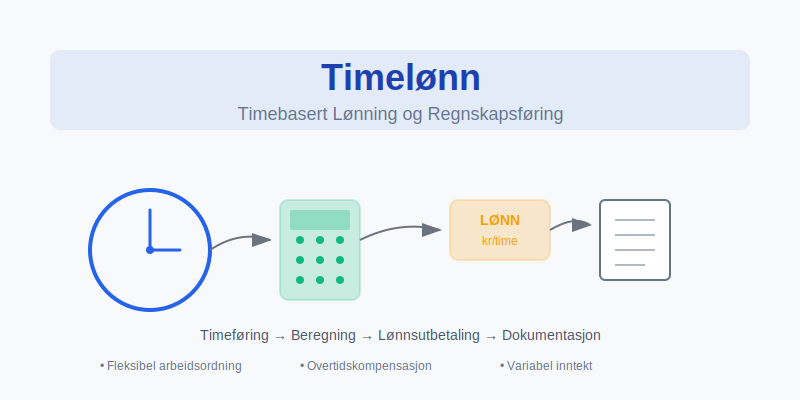

## Seksjon 1: Grunnleggende Timelønnkonsepter

### 1.1 Definisjon og Karakteristikker

**Timelønn** defineres som en lønnsordning hvor kompensasjon beregnes ved å multiplisere antall arbeidede timer med en forhåndsavtalt timesats. Denne lønnsformen skiller seg fra [fast lønn](/blogs/regnskap/hva-er-lonn "Lønn og Personaladministrasjon - Komplett Guide") gjennom flere sentrale karakteristikker:

* **Variabel inntekt** - Lønn varierer direkte med antall arbeidede timer
* **Fleksibel arbeidstid** - Tilpasning til sesong- og oppdragsvariasjonene
* **Direkte tid-lønn-kobling** - Umiddelbar sammenheng mellom innsats og kompensasjon
* **Administrativ kompleksitet** - Krever detaljert tidsregistrering og lønnsberegning

### 1.2 Juridisk Grunnlag

Timelønn reguleres av [arbeidsmiljøloven](/blogs/regnskap/hva-er-arbeidsmiljoloven "Arbeidsmiljøloven - Guide til Arbeidsrettslige Forpliktelser") og relevante tariffavtaler:

**Minimumslønn og Tariffkrav:**
* Respektering av allmenngjørings forskrifter innenfor relevante bransjer
* Overholdelse av tariffestede minste lønnssatser
* Krav til overtidstillegg og helgetillegg
* Særlige bestemmelser for lærlinger og ungdomsarbeidere

**Arbeidstidsbestemmelser:**
* Maksimal arbeidsuke på 40 timer i gjennomsnitt
* Overtidsrammer og kompensasjon
* Hviletid og pauseordninger
* Dokumentasjonskrav for arbeidstid

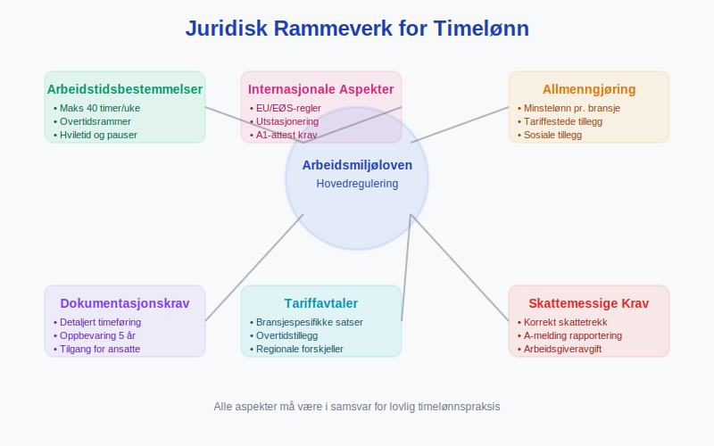

### 1.3 Timelønn vs. Andre Lønnsformer

Sammenligning med alternative lønnsstrukturer:

| Lønnsform | Forutsigbarhet | Fleksibilitet | Administrativ Kompleksitet | Vanlige Bransjer |
|-----------|----------------|---------------|---------------------------|------------------|
| **Timelønn** | Lav | Høy | Høy | Service, bygg, deltid |
| **Månedslønn** | Høy | Lav | Lav | Kontor, offentlig sektor |
| **Akkordlønn** | Middels | Middels | Middels | Produksjon, salg |
| **Provisjonslønn** | Lav | Høy | Høy | Salg, eiendom |

## Seksjon 2: Beregning og Lønnsadministrasjon

### 2.1 Grunnleggende Timelønnberegning

Beregning av timelønn følger etablerte prinsipper som sikrer rettferdig kompensasjon:

**Basisformel:**
```
Bruttolønn = Timesats × Arbeidede timer + Tillegg + Overtidscompensasjon
```

**Komponenter i Timelønnberegning:**
* **Ordinær timesats** - Avtalt grunnlønn per time
* **Overtidstillegg** - 50% eller 100% tillegg for overtid
* **Helge- og kveldstillegg** - Kompensasjon for arbeid på ugunstige tidspunkt
* **Feriepengeopptak** - 12% av brutto årslønn
* **Særlige tillegg** - Skift-, miljø- eller kompetansetillegg

### 2.2 Overtidsberegning

Overtidsregler varierer basert på tariffavtaler og arbeidsforhold:

**Overtidssatser:**
* **Hverdager (første 2 timer)** - 50% tillegg på ordinær timesats
* **Hverdager (utover 2 timer)** - 100% tillegg på ordinær timesats
* **Søndager og [helligdager](/blogs/regnskap/helligdager-regnskap-bedriftseiere "Helligdager i Regnskap for Bedriftseiere")** - 100% tillegg fra første time
* **Nattarbeid (kl. 21-06)** - Minimum 25% tillegg

**Beregningseksempel:**
```
Ordinær timesats: 200 kr
Arbeidede timer: 42 timer (2 timer overtid)
Overtidstillegg: 2 timer × (200 kr × 1,5) = 600 kr
Total bruttolønn: (40 × 200) + 600 = 8 600 kr
```

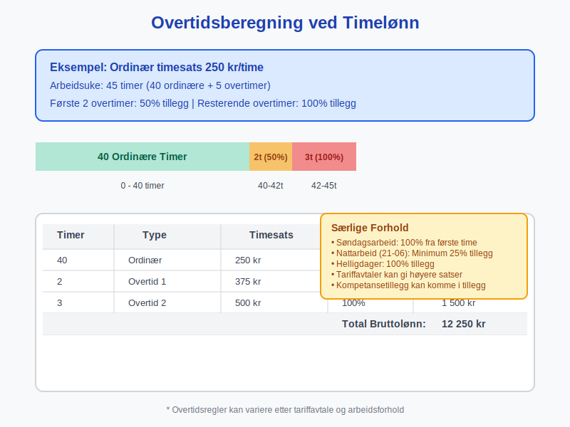

### 2.3 Feriepenger og Avsetninger

Timelønnede har særlige rettigheter knyttet til feriepenger:

**Feriepengeopptjening:**
* **Opptjeningsår** - 1. januar til 31. desember
* **Feriepengesats** - 12% av brutto årslønn (10,2% for arbeidstakere over 60 år)
* **Utbetaling** - Juni året etter opptjeningsåret
* **Dokumentasjon** - Detaljert oppføring på [lønnsslipp](/blogs/regnskap/hva-er-lonnsslipp "Lønnsslipp - Guide til Innhold og Forståelse")

**Regnskapsmessig Behandling:**
* **Avsetning** - MÃ¥nedlig avsetning av 12% til feriepengefond
* **Periodisering** - Korrekt periodisering av feriepengeforpliktelse
* **Skattemessig behandling** - Skattetrekk ved utbetaling, ikke ved opptjening

## Seksjon 3: Regnskapsføring av Timelønn

### 3.1 Periodisering og Avsetninger

Regnskapsføring av timelønn krever nøyaktig periodisering:

**Lønnsforfallsprinsippet:**
* Lønn som forfaller til betaling i perioden skal kostnadsføres
* Arbeidsutført i desember, betalt i januar neste år, skal kostnadsføres i desember
* Opparbeides det overtid som ikke er utbetalt, skal dette avsetninger

**Avsetningskontoer:**
* **Konto 2710** - Skyldig lønn
* **Konto 2730** - Skyldig feriepenger
* **Konto 2740** - Skyldige sosiale kostnader
* **Konto 2780** - Annen skyldig lønn (overtid, tillegg)

### 3.2 Sosiale Kostnader

Timelønn medfører komplekse sosiale kostnader:

| Kostnadstype | Sats | Grunnlag | Regnskapsføring |
|--------------|------|-----------|-----------------|
| **Arbeidsgiveravgift** | 7,8-14,1% | Brutto lønn | Konto 7830 |
| **Feriepenger** | 12% | Brutto årslønn | Konto 7840 |
| **[Pensjon](/blogs/regnskap/hva-er-tjenestepensjon "Hva er Tjenestepensjon? Komplett Guide til Bedriftspensjon og Regnskapsføring")** | 2-25% | Pensjonsgrunnlag | Konto 7850 |
| **Yrkesskadeforsikring** | 0,15-2,4% | Lønn eks. feriepenger | Konto 7860 |
| **AFP/LO-Nav** | Variabel | Etter tariffavtale | Konto 7870 |

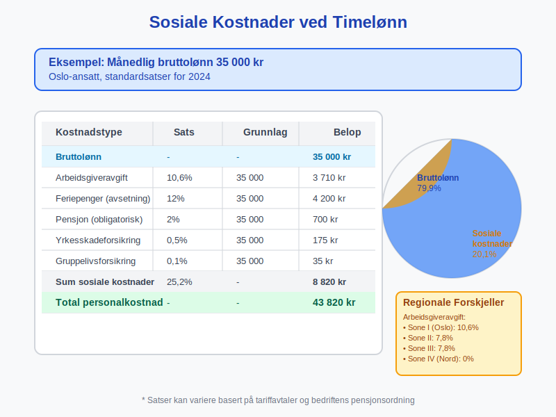

### 3.3 MÃ¥nedsavslutning og Estimering

Ved månedsavslutning må utført, men ikke fakturert arbeid estimeres:

**Estimeringsprosess:**
1. **Tidsregistrering** - Samle inn timeregistreringer frem til månedslutt
2. **Estimering** - Beregn utført arbeid som ikke er registrert (siste arbeidsdager)
3. **Avsetning** - Opprett avsetning for skyldig lønn inkludert sosiale kostnader
4. **Reversering** - Reverser avsetning når faktisk lønn utbetales neste måned

## Seksjon 4: Skattemessige Aspekter

### 4.1 Skattetrekk og A-melding

Timelønn utløser komplekse skattemessige forpliktelser:

**Skattetrekk (Tabelltrekk):**
* [Tabelltrekk](/blogs/regnskap/hva-er-tabelltrekk "Tabelltrekk - Guide til Norsk Skattetrekk") beregnes basert på estimert årslønn
* For timelønnede med variabel inntekt kan dette være utfordrende
* Justering gjennom forskuddsskatt eller restskatt ved årsoppgjør

**A-melding Rapportering:**
* Månedlig rapportering av utbetalt lønn og trukne skatter
* Spesifisering av ulike lønnselementer (ordinærlønn, overtid, tillegg)
* Korrekt fordeling på kalendermåneder for arbeid utført vs. betalt

### 4.2 Mva-fritak og Personalfordeler

Timelønn påvirker mva-behandling:

* **Lønnskostnader** - Generelt ikke mva-fradragsberettiget
* **Personalfordeler** - Kan utløse mva-plikt og skatteplikt for ansatte
* **Firmabil og telefon** - Særlige regler for timelønnet personale
* **Overtidsmåltider** - Mva-fritak under visse betingelser

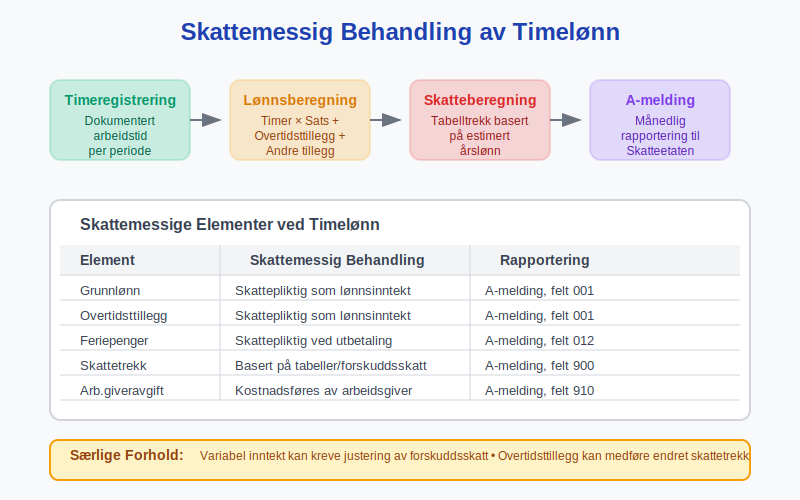

## Seksjon 5: Digitale Løsninger og Systemer

### 5.1 Integrerte Lønnssystemer

Moderne lønnssystemer automatiserer timelønnprosesser:

**Systemfunksjonalitet:**
* **Automatisk tidsregistrering** - Integrasjon med [timeføringssystemer](/blogs/regnskap/hva-er-timeforing "Timeføring - Komplett Guide til Registrering og Administrasjon av Arbeidstid")
* **Regelmotor** - Automatisk beregning av tillegg og overtid
* **Compliance-sjekk** - Validering mot arbeidsmiljølov og tariffavtaler
* **Rapporteringsfunksjonalitet** - Automatisk generering av lønnsslipper og statistikk

**Integrasjon med Andre Systemer:**
* **Regnskapssystemer** - Automatisk overføring av lønnsposteringer
* **Økonomisystemer** - Real-time oppdatering av personalkostnader
* **HR-systemer** - Kobling til fravær, ferie og personaldata
* **Banksystemer** - Elektronisk lønnsutbetaling og rapportering

### 5.2 Mobile Løsninger

Mobile apper revolutionerer timeregistrering for timelønnede:

**App-funksjonalitet:**
* **GPS-basert registrering** - Automatisk sjekk inn/ut på arbeidsplassen
* **Prosjektkodering** - Enkel allokering av timer til riktig prosjekt/kunde
* **Fotovedlegg** - Dokumentasjon av utført arbeid
* **Real-time godkjenning** - Umiddelbar godkjenning fra supervisor

**Fordeler:**
* Redusert administrativ byrde
* Økt nøyaktighet i tidsregistrering
* Raskere lønnsutbetaling
* Bedre etterlevelse av arbeidstidsbestemmelser

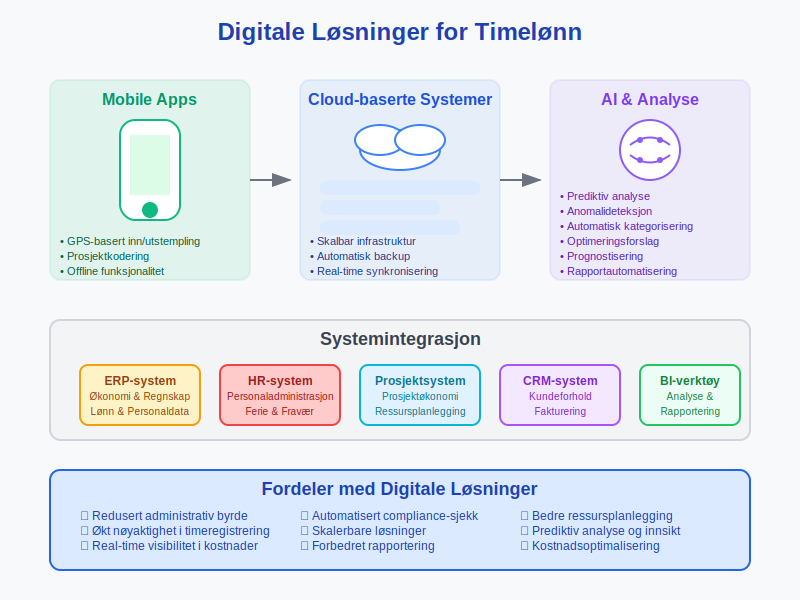

### 5.3 Kunstig Intelligens og Automatisering

AI-teknologi forbedrer timelønnprosesser:

**Prediktiv Analyse:**
* **Behovsplanlegging** - Forutsigelse av personalbehov basert på historiske data
* **Overtidsoptimalisering** - Minimerering av overtidskostnader gjennom smartere planlegging
* **Anomalideteksjon** - Identifisering av unormale timeregistreringsmønstre
* **Kostnadsoptimalisering** - Analysering av lønnskostnader på tvers av prosjekter

## Seksjon 6: Bransjespesifikke Tilpasninger

### 6.1 Byggeindustrien

Byggeindustrien har særlige krav til timelønn:

**Tariffavtaler:**
* **Fellesforbundet/NHO** - Spesifikke satser for ulike yrkesgrupper
* **Regionalt tillegg** - Geografiske lønnsforskjeller, spesielt i Nord-Norge
* **Kompetansetillegg** - Tillegg for sertifiseringer og spesialkomptanse
* **Værpenger** - Kompensasjon når arbeid ikke kan utføres på grunn av værforhold

**Praktiske Utfordringer:**
* Arbeid på ulike byggeplasser krever fleksible registreringssystemer
* Dokumentasjon av sikkerhetstrenening og HMS-opplæring
* Håndtering av underentreprenører og innleide ([Hva er en Entreprenør?](/blogs/regnskap/entreprenor "Hva er en Entreprenør?"))
* Integrering med prosjektøkonomi og [kostnadsberegning](/blogs/regnskap/hva-er-kostnadsberegning "Kostnadsberegning - Guide til Effektiv Kostnadsanalyse")

### 6.2 Hotell- og Servicenæringen

Service- og hospitalitybransjen krever fleksible løsninger:

**Uregelmessige Arbeidstider:**
* **Skiftarbeid** - Komplekse skiftplaner med varierende start- og sluttider
* **Sesongarbeid** - Kraftig variasjon i personalbehov gjennom året
* **Tilkallingshjelp** - Kort varsel og variabel lengde på arbeidstoppgaver
* **Helge- og kveldstillegg** - Høy andel arbeid på ugunstige tidspunkt

**Spesielle Forhold:**
* Tips og service charge må integreres i lønnssystemet
* Personalmat og uniformer kan påvirke [skattegrunnlaget](/blogs/regnskap/hva-er-skattegrunnlag "Skattegrunnlag - Guide til Skattepliktig Inntekt")
* Høy turnover krever effektive onboarding- og offboarding-prosesser

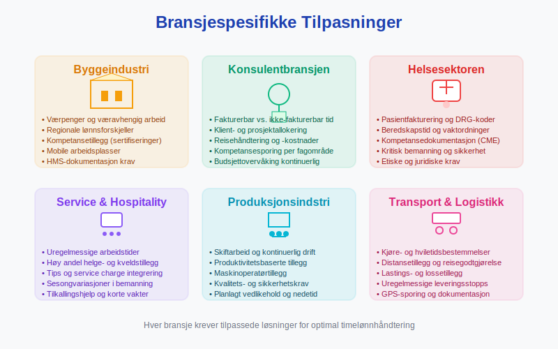

### 6.3 Konsulenttjenester

Konsulentbransjen bruker timelønn for prosjektfakturering:

**Fakturerbar vs. Ikke-fakturerbar Tid:**
* **Direkte prosjektarbeid** - Timer som kan faktureres til kunde
* **Administrativt arbeid** - Intern tid for rapportering, møter, opplæring
* **Akkvisisjon** - Tid brukt på kundeutvikling og tilbudsarbeid
* **Kompetanseutvikling** - Investering i ansattes faglige utvikling

**Prissetting og Marginer:**
* Lønnskostnad per time × Multiplikator = Salgspris per time
* Typiske multiplikatorer varierer fra 2,5 til 4,0 avhengig av bransje og spisskompetanse
* Integrering med [prosjektregnskapet](/blogs/regnskap/hva-er-prosjektregnskap "Prosjektregnskap - Komplett Guide til Prosjektbasert Økonomi") for lønnsomhetsanalyse

## Seksjon 7: Compliance og Juridiske Aspekter

### 7.1 Arbeidstilsynets Krav

Arbeidstilsynet har strenge krav til dokumentasjon:

**Arbeidstidsdokumentasjon:**
* **Detaljerte oversikter** - Start- og sluttidspunkt for hver arbeidsdag
* **Pauseregistrering** - Dokumentasjon av lovpålagte pauser
* **Overtidsvarighet** - Spesifikasjon av overtidstyper og varighet
* **Hvileperioder** - Sikring av minimumskarantene mellom arbeidsdager

**Inspeksjoner og Sanksjoner:**
* Arbeidstilsynet kan gjennomføre uanmeldte inspeksjoner
* Manglende dokumentasjon kan medføre betydelige bøter
* Systematiske brudd kan føre til virksomhetsstans
* Krav til kontinuerlig tilgang på ajourførte oversikter

### 7.2 Tariffavtaler og Allmenngjøring

Mange bransjer har allmenngjørings forskrifter:

**Allmenngjøring Innebærer:**
* **Minstelønn** - Bindende minimumssatser for alle arbeidstakere
* **Sosiale tillegg** - Obligatoriske tillegg utover grunnlønn
* **Arbeidstidsbestemmelser** - Spesifikke regler for overtid og hviletid
* **Rapporteringskrav** - Særlige dokumentasjonskrav for utenlandske arbeidstakere

**Bransjene med Allmenngjøring:**
* Bygg- og anleggsvirksomhet
* Renholdsbransjen
* Godstransport på vei
* Landbruk og gartneribransjen
* Skipsverftsindustrien

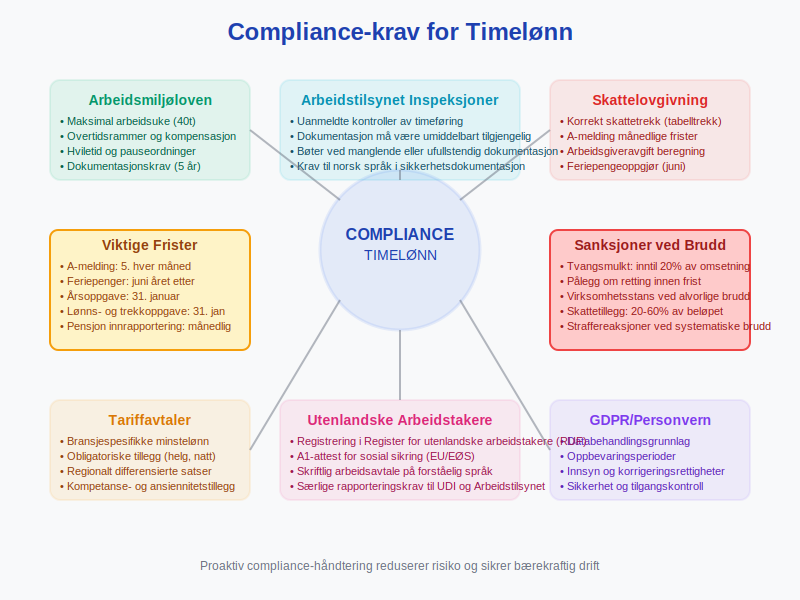

### 7.3 Internasjonale Aspekter

Timelønn for utenlandske arbeidstakere krever særlig oppmerksomhet:

**EU/EØS-borgere:**
* Samme rettigheter som norske arbeidstakere
* Krav til [skattetrekk](/blogs/regnskap/hva-er-skattetrekk "Skattetrekk - Guide til Norsk Skatteadministrasjon") og sosiale kostnader
* A1-attest for sosial sikring ved korttidsopphold
* Språkkrav til sikkerhetsdokumentasjon

**Tredjelandsborgere:**
* Arbeidstillatelse og oppholdstillatelse påkrevd
* Skjerpede dokumentasjonskrav til [lønns- og arbeidsforhold](/blogs/regnskap/hva-er-arbeidsforhold "Arbeidsforhold - Guide til Juridiske og Økonomiske Aspekter")
* Spesielle rapporteringskrav til UDI og Arbeidstilsynet

## Seksjon 8: Økonomisk Analyse og Planlegging

### 8.1 Kostnadsdrivere og Budsjettplanlegging

Timelønn krever sofistikert budsjettplanlegging:

**Kostnadselementer:**
* **Direkte lønnskostnader** - Grunnlønn og overtidstillegg
* **Sosiale kostnader** - Arbeidsgiveravgift, pensjon, forsikringer
* **Indirekte kostnader** - Administrasjon, opplæring, rekruttering
* **Fleksibilitetspremie** - Ekstra kostnader for variabel bemanning

**Budsjettmetodikk:**
```
Timebudsjett = Estimerte timer × (Timesats + Sosiale kostnader%)
+ Overtidsreserve + Administrative kostnader
```

### 8.2 Lønnsomhetsanalyse

Analyse av timelønns lønnsomhet krever detaljerte kalkulasjoner:

**Key Performance Indicators (KPIs):**
* **Produktive timer per måned** - Andel fakturerbare timer av totale timer
* **Effektiv timesats** - Reell timesats etter sosiale kostnader og overhead
* **Overtidsandel** - Prosentandel overtidstimer av totale timer
* **Sykefraværsprosent** - Påvirkning på tilgjengelighet og planlegging

**Benchmarking:**
* Sammenligning med bransjegjennomsnitt
* Analyse av sesongvariasjoner
* Evaluering av alternative bemanningsmodeller
* Kostnadseffektivitet av outsourcing vs. intern bemanning

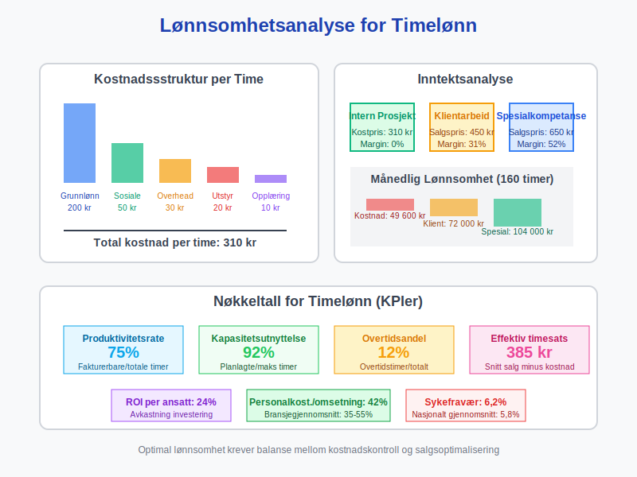

### 8.3 Risikostyring

Timelønn innebærer flere økonomiske risikoer:

**Operasjonelle Risikoer:**
* **Etterspørselssvingninger** - Uforutsigbarhet i arbeidsvolum
* **Sesongvariasjoner** - Konsentrasjon av kostnader i spesifikke perioder
* **Kompetanseavhengighet** - Risiko ved tap av nøkkelmedarbeidere
* **Teknologiendringer** - Automatisering kan redusere timelønnbehovet

**Compliance-risikoer:**
* **Arbeidsrettslige brudd** - Bøter og omdømmerisiko
* **Skattemessige feil** - Etterbetalinger og renter
* **Tariffbrudd** - Konflikter med fagforeninger
* **Dokumentasjonsmangler** - Problemer ved myndighetskontroll

## Seksjon 9: Fremtidens Timelønn

### 9.1 Teknologiske Disruptorer

Emerging teknologier vil transformere timelønn:

**Blockchain og Smarte Kontrakter:**
* Automatisk utbetaling basert på verifisert tidsregistrering
* Transparent og manipulasjonssikker dokumentasjon
* Redusert behov for mellommenn og administratører
* Real-time oppgjør av arbeid utført

**Internet of Things (IoT):**
* Sensorer for automatisk registrering av tilstedeværelse og aktivitet
* Integrering med verktøy og utstyr for nøyaktig tidsregistrering
* Predictive maintenance som påvirker arbeidsplanlegging
* Environmental monitoring som dokumenterer arbeidsforhold

### 9.2 Nye Arbeidsformer

Fremtidens arbeidsmarked vil endre timelønnsdynamikken:

**Gig Economy og Freelancing:**
* **Platform economy** - Uber, Foodora og lignende tjenester
* **Projektbasert arbeid** - Kortsiktige oppdrag og konsulentarbeid
* **Crowdsourcing** - Distribuert arbeidskraft for spesialiserte oppgaver
* **Remote work** - Geografisk uavhengig arbeid og fleksible ordninger

**Hybrid Employment Models:**
* Kombinasjon av fast ansettelse og timelønn
* Portfolio careers med multiple inntektskilder
* Skill-based matching og dynamic pricing
* Continuous learning og competence development

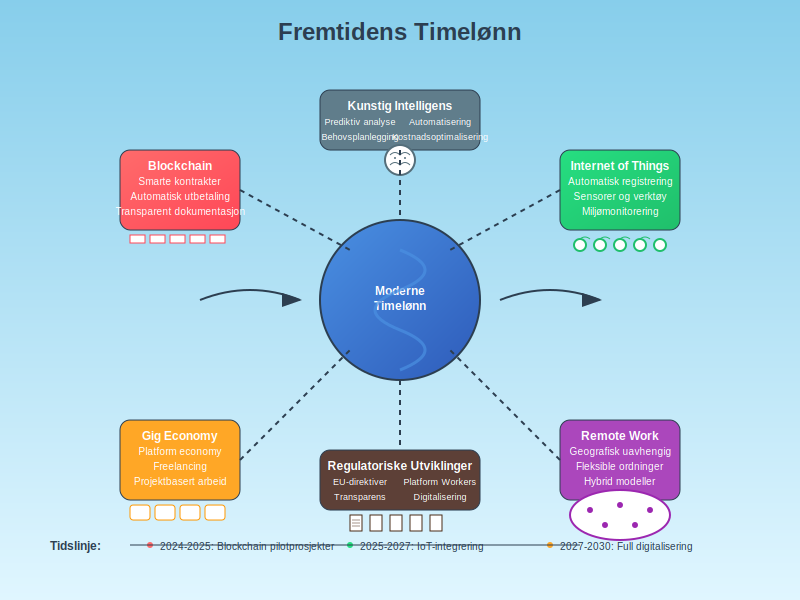

### 9.3 Regulatoriske Utviklinger

Politiske trender vil påvirke timelønn:

**EU-direktiver:**
* **Platform Workers Directive** - Klassifisering av gig workers
* **Transparent and Predictable Working Conditions** - Krav til forutsigbarhet
* **Work-Life Balance Directive** - Fleksible arbeidsordninger
* **Pay Transparency Directive** - Åpenhet om lønnsforhold

**Norske Politiske Initiativ:**
* Skjerpede krav til dokumentasjon av arbeidsforhold
* Økt kontroll med utenlandsk arbeidskraft
* Digitalisering av rapportering til offentlige myndigheter
* Automatisering av skattetrekk og sosiale avgifter

## Seksjon 10: Implementering og Beste Praksis

### 10.1 Systemimplementering

Vellykket implementering av timelønnssystemer krever strukturert tilnærming:

**Prosjektorganisering:**
* **Prosjektleder** - Ansvarlig for koordinering og fremdrift
* **HR-representant** - Sikrer compliance med arbeidsrett og lønnsrutiner
* **IT-ansvarlig** - Teknisk implementering og systemintegrasjon
* **Regnskapsansvarlig** - Korrekt økonomisk behandling og rapportering
* **Tillitsvalgte** - Representasjon av ansatteperspektiv

**Implementeringsfaser:**
1. **Behovsanalyse og kravspesifikasjon** (4-6 uker)
2. **Systemvalg og anskaffelse** (6-8 uker)
3. **Konfigurering og testing** (8-12 uker)
4. **Pilotprogram** (4-6 uker)
5. **Full utrulling og opplæring** (4-8 uker)
6. **Oppfølging og optimalisering** (løpende)

### 10.2 Change Management

Endringsledelse er kritisk for vellykket timelønnimplementering:

**Kommunikasjonsstrategi:**
* **Transparens** - Åpen kommunikasjon om årsaker og fordeler
* **Involvering** - Medvirkning fra ansatte i planlegging og utvikling
* **Opplæring** - Omfattende opplæringsprogrammer for alle brukergrupper
* **Support** - Kontinuerlig brukersstøtte og problemløsning

**Motstands håndtering:**
* Identifisering av bekymringer og utfordringer
* Tilpassede løsninger for ulike brukergrupper
* Demonstrasjon av konkrete fordeler og forbedringer
* Gradvis implementering med mulighet for tilbakemelding og justeringer

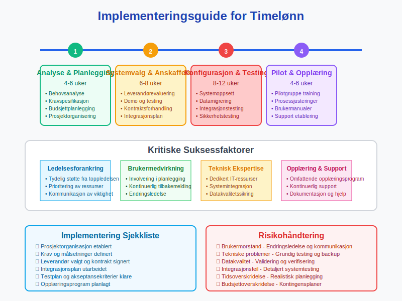

### 10.3 Kontinuerlig Forbedring

Optimalisering av timelønnprosesser krever systematisk tilnærming:

**Performance Monitoring:**
* **KPI-dashboard** - Real-time monitorering av nøkkeltall
* **Avviksanalyse** - Identifisering og utbedring av systematiske problemer
* **Brukertilfredshetsundersøkelser** - Regelmessig evaluering av systembruk
* **Benchmark studier** - Sammenligning med beste praksis i bransjen

**Innovasjon og Utvikling:**
* Evaluering av nye teknologier og verktøy
* Integrering med emerging arbeidsformer og -metoder
* Utvikling av prediktive analyser og automatisering
* Kontinuerlig kompetanseutvikling for administrative team

## Seksjon 11: Internasjonale Perspektiver

### 11.1 Nordiske Modeller

Skandinaviske land har ulike tilnærminger til timelønn:

**Sverige:**
* **Collectivavtal** - Sterk tradisjon for kollektive forhandlinger
* **Arbetsmiljöverket** - Lignende tilsynsorganisasjon som norsk Arbeidstilsyn
* **F-skatt systemet** - Særordning for freelancers og konsulenter
* **Personalkostnader** - Høyere sosiale kostnader enn Norge

**Danmark:**
* **Flexjob ordningen** - Fleksible arbeidsordninger for personer med redusert arbeidsevne
* **SU-systemet** - Kombinering av studier og deltidsarbeid
* **Feriepengesystemet** - Elektronisk feriekonti og real-time oppfølging
* **Høye minimumslønninger** - Gjennom tariffavtaler, ikke lovfestede minimumslønninger

### 11.2 Internasjonale Beste Praksis

Læring fra andre land og systemer:

**Tyskland:**
* **Kurzarbeit** - Statlig støttet arbeidsfordeling i krisetider
* **Zeitarbeit** - Regulert timelønn gjennom bemanningsforetak
* **Mindestlohn** - Nasjonal minimumslønn kombinert med tariffautonomi
* **Digitale Zeiterfassung** - Krav til elektronisk tidsregistrering

**Nederland:**
* **ZZP (Zelfstandig Zonder Personeel)** - Formalisert selvstendig næringsdrivende-kategori
* **Payrolling** - Regulerte mellommannsordninger for timelønn
* **CAO-systemet** - Bransjedekkende tariffavtaler
* **DBA-problematikk** - Skille mellom ansatt og selvstendig næringsdriving

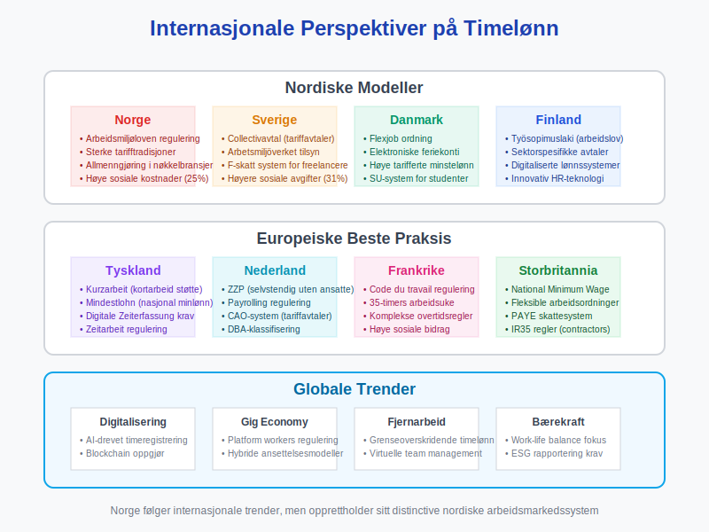

## Seksjon 12: MÃ¥ling og KPIer

### 12.1 Operasjonelle Nøkkeltall

Kritiske måltall for timelønnoperasjoner:

**Effektivitetsmetriker:**
* **Produktivitetsrate** - Fakturerbare timer / Total tilgjengelige timer
* **Kapasitetsutnyttelse** - Planlagte timer / Maksimal kapasitet
* **Administrativ overhead** - Tid brukt på administrasjon vs. produktivt arbeid
* **Systemoppetid** - Tilgjengelighet av timeregistreringssystemer

**Kvalitetsmetriker:**
* **Nøyaktighet i timeregistrering** - Avvik mellom planlagt og faktisk tid
* **Saksbehandlingstid for lønn** - Fra timeregistrering til utbetaling
* **Feilrate i lønnsberegning** - Andel korrigeringer per lønnskjøring
* **Compliance-score** - Etterlevelse av arbeidsrettslige krav

### 12.2 Finansielle Nøkkeltall

Økonomiske indikatorer for timelønnoperasjoner:

| KPI | Formel | MÃ¥lsetning | Benchmark |
|-----|--------|------------|-----------|
| **Arbeidskostnad per time** | (Lønn + Sosiale kostnader) / Timer | Minimalisering | Bransjegjennomsnitt |
| **Overtidsandel** | Overtidstimer / Total timer × 100% | < 15% | 10-20% |
| **Personalkostnad som % av omsetning** | Totale personalkostnader / Omsetning × 100% | 35-55% | Bransjeavhengig |
| **Lønnsomhet per ansatt** | (Fakturert - Personalkostnad) / Antall ansatte | Maksimering | ROI > 15% |

### 12.3 Strategiske MÃ¥ltall

Langsiktige indikatorer for timelønnstrategi:

**Menneskekapital Metriker:**
* **Employee Lifetime Value** - Totalverdien av en ansatt over karrieren
* **Kompetanseutviklingsrate** - Investering i ansattes faglige utvikling
* **Retention rate** - Andel ansatte som forblir i virksomheten
* **Internal mobility** - Karriereutvikling og avansementsmuligheter

**Innovasjon og Teknologi:**
* **Digital adoption rate** - Andel prosesser som er digitalisert
* **Automatiseringsgrad** - Automatiserte vs. manuelle prosesser
* **Technology ROI** - Avkastning på investeringer i HR-teknologi
* **Future readiness** - Beredskap for fremtidige teknologier og arbeidsformer

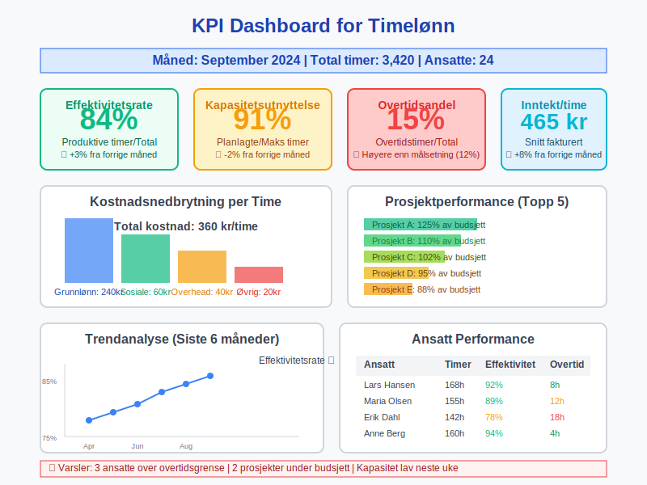

## Konklusjon

Timelønn representerer en fundamental lønnsform som krever sofistikert forvaltning for å optimalisere både ansattes rettigheter og virksomhetens operasjonelle effektivitet. Moderne timelønnoperasjoner integrerer juridisk compliance, teknologisk innovasjon og strategisk personalledelse i et helhetlig system som støtter både kortsiktige operational krav og langsiktige konkurransefordeler.

Suksessful timelønnhåndtering krever balansering av multiple hensyn: **juridisk compliance** sikrer etterlevelse av arbeidsrett og tariffavtaler, **teknologisk innovasjon** automatiserer rutineprosesser og forbedrer nøyaktighet, mens **strategisk planlegging** optimaliserer personalkostnader og organisatorisk fleksibilitet. Fremtidens timelønn vil i økende grad integrere AI-drevet analyse, blockchain-baserte oppgjørssystemer og prediktiv planlegging for å skape mer presise, effektive og rettferdige lønnssystemer.

Organisasjoner som investerer i robuste timelønnprosesser vil være bedre posisjonert for å håndtere dynamiske markedsforhold, regulatoriske endringer og evolving arbeidsformer som caracteriserer moderne økonomier. Gjennom kontinuerlig optimalisering av systemer, prosesser og kompetanse kan timelønn transformeres fra en administrativ byrde til et strategisk verktøy for organisatorisk suksess og ansattemotivering.


