---
title: "Hva er Tjenestepensjon?"
meta_title: "Hva er Tjenestepensjon?"
meta_description: '**Tjenestepensjon** er en sentral del av norsk arbeidsliv og bedriftenes personalkostnader. Det er en pensjon som arbeidsgivere tilbyr sine ansatte som en del a...'
slug: hva-er-tjenestepensjon
type: blog
layout: pages/single
---

**Tjenestepensjon** er en sentral del av norsk arbeidsliv og bedriftenes personalkostnader. Det er en pensjon som arbeidsgivere tilbyr sine ansatte som en del av lønnsvilkårene, og som er både lovpålagt og et viktig rekrutteringsverktøy. For bedrifter representerer tjenestepensjon en betydelig kostnad som må håndteres korrekt i [regnskapet](/blogs/regnskap/hva-er-bokforing "Hva er Bokføring? Grunnleggende Guide til Regnskapsføring") og som påvirker [personalkostnadene](/blogs/regnskap/hva-er-lonnskostnad "Hva er Lønnskostnad? Beregning og Regnskapsføring av Personalkostnader") og den totale [kostnadsstrukturen](/blogs/regnskap/hva-er-kostnader "Hva er Kostnader? Klassifisering og Regnskapsføring i Bedriften").

Ny ordning med [Egen pensjonskonto](/blogs/regnskap/hva-er-egen-pensjonskonto "Hva er Egen Pensjonskonto? En Guide til Egen Pensjonskonto i Norge") gir ansatte mulighet til å **samle pensjonskapital** fra flere arbeidsgivere på én konto.

Ved avslutning av en ytelsesbasert pensjonsordning kan ansatte også motta et **pensjonskapitalbevis** som representerer verdien av oppsparte pensjonsmidler. Les mer i [Pensjonskapitalbevis](/blogs/regnskap/pensjonskapitalbevis "Pensjonskapitalbevis: Hva er pensjonskapitalbevis?").

## Seksjon 1: Grunnleggende om Tjenestepensjon

**Tjenestepensjon** er en kollektiv pensjon som arbeidsgivere etablerer for sine ansatte. Den kommer i tillegg til folketrygden og skal sikre at ansatte opprettholder en rimelig levestandard etter pensjonering. For bedrifter er dette både en **juridisk forpliktelse** og en viktig del av den totale kompensasjonspakken til ansatte.

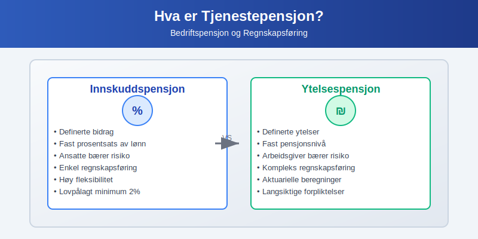

### 1.1 Lovpålagt Tjenestepensjon (LTP)

**[Lov om obligatorisk tjenestepensjon](/blogs/regnskap/obligatorisk-tjenestepensjon "Hva er obligatorisk tjenestepensjon?")** fra 2006 pålegger alle arbeidsgivere å ha tjenestepensjon:

* **Virkeområde:** Gjelder alle arbeidsgivere med ansatte
* **Unntak:** Kun for ansatte med mindre enn 20% stilling og inntekt under 1G (grunnbeløpet)
* **Minimumskrav:** Minst 2% av lønn mellom 1G og 12G (se [Hva er obligatorisk tjenestepensjon?](/blogs/regnskap/obligatorisk-tjenestepensjon "Hva er obligatorisk tjenestepensjon?") for full oversikt)
* **Opptjeningstid:** Minimum 3 års opptjening
* **Ansiennitet:** Pensjonsnivå påvirkes av [ansiennitet](/blogs/regnskap/ansiennitet "Ansiennitet - Komplett Guide til Ansiennitet i Norsk Regnskap og Arbeidsrett") og tjenestetid

**Regnskapsmessige konsekvenser:**
- Pensjonskostnaden påvirker [personalkostnadene](/blogs/regnskap/hva-er-lonnskostnad "Hva er Lønnskostnad? Beregning og Regnskapsføring av Personalkostnader") 
- Påvirker [arbeidskapitalen](/blogs/regnskap/hva-er-arbeidskapital "Hva er Arbeidskapital? Beregning og Optimalisering") gjennom løpende innbetalinger
- Kan skape [utsatte skatteposter](/blogs/regnskap/hva-er-utsatt-skatt "Hva er Utsatt Skatt? Beregning og Regnskapsføring") ved forskjeller mellom regnskaps- og skattemessig behandling

### 1.2 Typer Tjenestepensjon

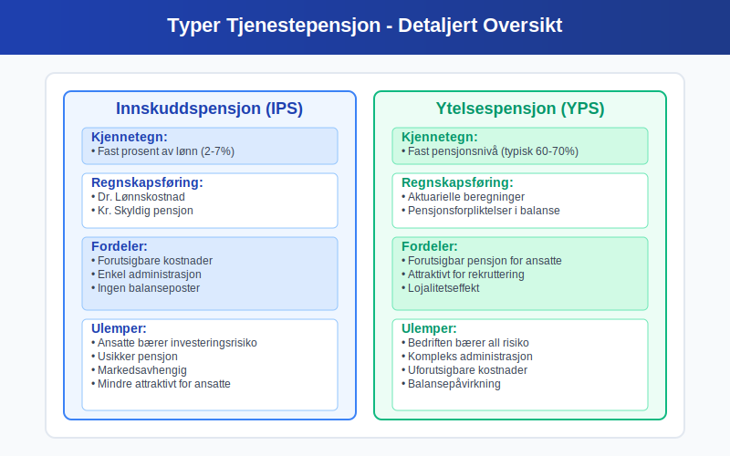

**Innskuddspensjon:**
- **Definerte bidrag:** Fast prosentsats av lønn
- **Risiko:** Ansatte bærer investeringsrisiko
- **Regnskapsføring:** Enklere, kostnaden bokføres løpende
- **Fleksibilitet:** Høy, kan tilpasses bedriftens økonomi

**Ytelsespensjon:**
- **Definerte ytelser:** Fast pensjonsnivå ved pensjonering
- **Risiko:** Arbeidsgiver bærer investeringsrisiko
- **Regnskapsføring:** Kompleks, krever aktuarielle beregninger
- **Forpliktelser:** Skaper [langsiktige forpliktelser](/blogs/regnskap/hva-er-gjeld "Hva er Gjeld? Klassifisering og Regnskapsføring av Forpliktelser") i balansen
### 1.3 Offentlig tjenestepensjon

For ordninger i offentlig sektor finnes egne regler og ytelsesgarantier. Les mer i [Offentlig tjenestepensjon](/blogs/regnskap/offentlig-tjenestepensjon "Offentlig tjenestepensjon: Guide til Offentlige Pensjonsordninger og Regnskapsføring").

## Seksjon 2: Regnskapsføring av Tjenestepensjon

### 2.1 Innskuddspensjon - Regnskapsbehandling

For **innskuddspensjon** er regnskapsføringen relativt enkel siden bedriften kun har forpliktelse til å betale de avtalte bidragene:

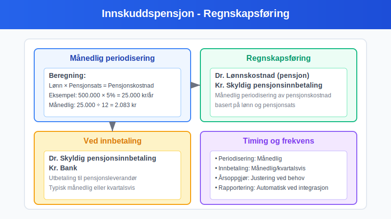

**Løpende regnskapsføring:**
```
Dr. Lønnskostnad (pensjon)        XXX
    Kr. Skyldig pensjonsinnbetaling   XXX
```

**Ved innbetaling:**
```
Dr. Skyldig pensjonsinnbetaling   XXX
    Kr. Bank                          XXX
```

**Periodisering:** Pensjonskostnaden [periodiseres](/blogs/regnskap/hva-er-periodisering "Hva er Periodisering? Grunnleggende Regnskapsprinsipp") månedlig basert på lønnsutbetalinger og avtalt pensjonsats.

### 2.2 Ytelsespensjon - Kompleks Regnskapsføring

**Ytelsespensjon** krever mer kompleks regnskapsbehandling i henhold til NRS 6 - Pensjonskostnader:

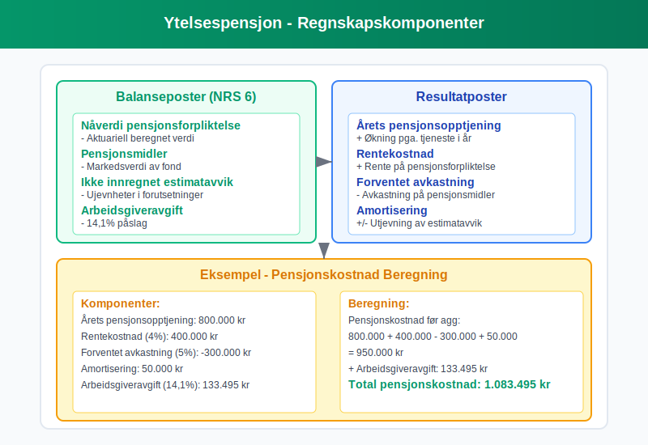

**Hovedkomponenter:**
1. **NÃ¥verdi av pensjonsforpliktelser** - beregnes aktuarielt
2. **Pensjonsmidler** - markedsverdi av pensjonsfond
3. **Ikke innregnet tap/gevinst** - ujevnheter i estimater
4. **Arbeidsgiveravgift** - påslag på pensjonsforpliktelser

**Beregning av pensjonskostnad:**
| **Komponent** | **Forklaring** | **Regnskapsmessig effekt** |
|---------------|----------------|---------------------------|
| Årets pensjonsopptjening | Økning i forpliktelse pga. tjeneste | Øker pensjonskostnad |
| Rentekostnad | Rente på pensjonsforpliktelse | Øker pensjonskostnad |
| Avkastning på pensjonsmidler | Forventet avkastning | Reduserer pensjonskostnad |
| Amortisering | Utjevning av estimatavvik | Kan øke/redusere kostnad |

### 2.3 Skattemessige Forhold

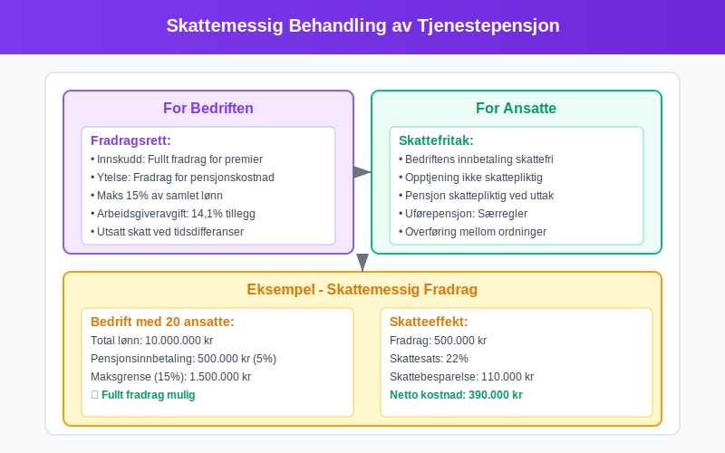

**Fradragsrett for bedrifter:**
- **Innskuddspensjon:** Fullt fradrag for innbetalte premier
- **Ytelsespensjon:** Fradrag basert på regnskapsmessig pensjonskostnad
- **Begrensninger:** Maksimalt 15% av samlet lønn til alle ansatte

**Skattemessige justeringer:**
- Forskjeller mellom regnskaps- og skattemessig kostnad skaper [utsatt skatt](/blogs/regnskap/hva-er-utsatt-skatt "Hva er Utsatt Skatt? Beregning og Regnskapsføring")
- MÃ¥ avstemmes i [skattemeldingen](/blogs/regnskap/skattemelding "Skattemelding - Komplett Guide til Utfylling og Innlevering")

## Seksjon 3: Økonomiske Aspekter og Planlegging

### 3.1 Kostnadsanalyse og Budsjetting

**Tjenestepensjon** utgjør en betydelig del av bedriftens totale personalkostnader og må planlegges nøye:

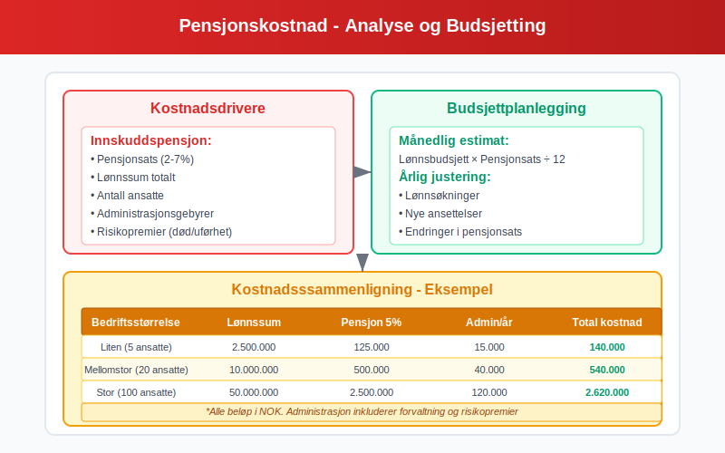

**Kostnadsfaktorer innskuddspensjon:**
- **Pensjonsats:** Typisk 2-7% av lønn
- **Lønnsnivå:** Påvirker absolutte kostnader
- **Antall ansatte:** Skalaeffekt på administrasjon
- **Alderssammensetning:** PÃ¥virker risikopremier

**Kostnadsfaktorer ytelsespensjon:**
- **Demografiske antagelser:** Levealder, turnover
- **Økonomiske antagelser:** Rente, lønnsutvikling, inflasjon
- **Aktuarielle gevinster/tap:** Kan skape store svingninger

### 3.2 Finansiell Planlegging og Likviditetseffekt

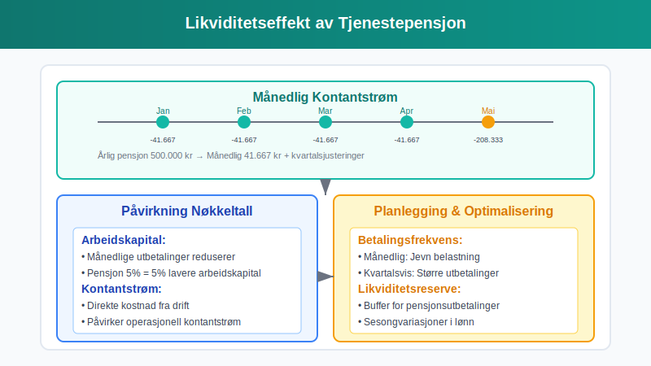

**Likviditetsplanlegging:**
- **Månedsvis utbetaling:** Påvirker [kontantstrømmen](/blogs/regnskap/hva-er-kontantstrom "Hva er Kontantstrøm? Analyse og Forvaltning av Bedriftens Pengestrøm") løpende
- **Ã…rlige justeringer:** Endringer i pensjonsavtaler
- **Forsikringspremier:** Separate kostnader for risikodekninger

**Effekt på nøkkeltall:**
| **Nøkkeltall** | **Påvirkning** | **Forklaring** |
|----------------|----------------|----------------|
| [Lønnsomhet](/blogs/regnskap/hva-er-loennsomhet "Hva er Lønnsomhet? Måling og Analyse av Bedriftens Økonomiske Ytelse") | Negativ | Øker personalkostnader |
| [Arbeidskapital](/blogs/regnskap/hva-er-arbeidskapital "Hva er Arbeidskapital? Beregning og Optimalisering") | Negativ | MÃ¥nedlige utbetalinger |
| [Soliditet](/blogs/regnskap/hva-er-soliditet "Hva er Soliditet? Beregning og Analyse av Finansiell Styrke") | Negativ (ytelse) | Pensjonsforpliktelser i balansen |

### 3.3 Strategiske Vurderinger

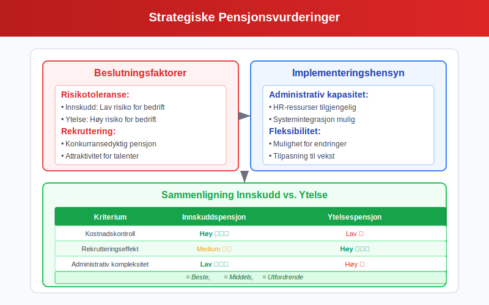

**Valg av pensjonsordning:**
- **Risikotoleranse:** Innskudd vs. ytelse
- **Administrativ kapasitet:** Kompleksitet i håndtering
- **Konkurranseforhold:** Rekrutterings- og retensjonshensyn
- **Finansiell fleksibilitet:** Mulighet for justeringer

**Leverandørvalg:**
- **Forsikringsselskaper:** Tradisjonelle leverandører
- **Pensjonskasser:** Bransjebaserte løsninger
- **Forvaltningsselskaper:** Kun fondsforvaltning
- **Kostnadseffektivitet:** Administrasjonsgebyrer og forvaltningskostnader

## Seksjon 4: Juridiske Krav og Compliance

### 4.1 Lovkrav og Forskrifter

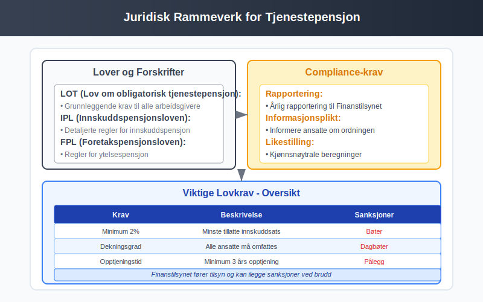

**Sentrale lover og forskrifter:**
- **Lov om obligatorisk tjenestepensjon (LOT):** Grunnleggende krav
- **Innskuddspensjonsloven (IPL):** Detaljerte regler for innskuddspensjon
- **Foretakspensjonsloven (FPL):** Regler for ytelsespensjon
- **Finanstilsynets forskrifter:** Tekniske krav og rapportering

**Compliance-krav:**
- **Ã…rlig rapportering:** Til Finanstilsynet
- **Informasjonsplikt:** Overfor ansatte
- **Likestilling:** Kjønnsnøytrale ordninger
- **Portabilitet:** Rett til å ta med opptjente rettigheter

### 4.2 Arbeidsrettslige Aspekter

**Tariffavtaler og pensjon:**
- **Bransjestandarder:** Ulike satser etter bransje
- **Forhandlingsrett:** Fagforeningers rolle
- **Overgang mellom ordninger:** Prosedyrer ved skifte
- **Konflikthåndtering:** Ved uenighet om pensjonsvilkår

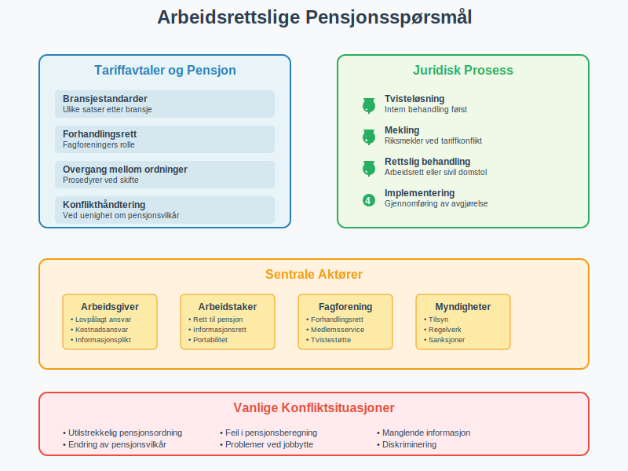

## Seksjon 5: Digitale Løsninger og Automatisering

### 5.1 Moderne Pensjonsadministrasjon

**Digitalisering** har revolusjonert pensjonsadministrasjonen:

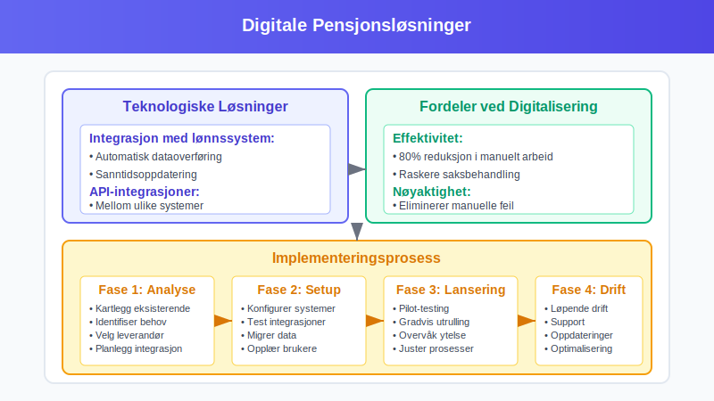

**Teknologiske løsninger:**
- **Integrasjon med lønnssystem:** Automatisk dataoverføring
- **Selvbetjeningsportaler:** For ansatte
- **Rapporteringsverktøy:** Automatisk compliance
- **API-integrasjoner:** Mellom ulike systemer

**Fordeler ved digitalisering:**
- **Effektivitet:** Redusert manuelt arbeid
- **Nøyaktighet:** Mindre feil i beregninger
- **Transparens:** Bedre oversikt for ansatte
- **Compliance:** Automatisk overholdelse av krav

### 5.2 Fremtidige Trender

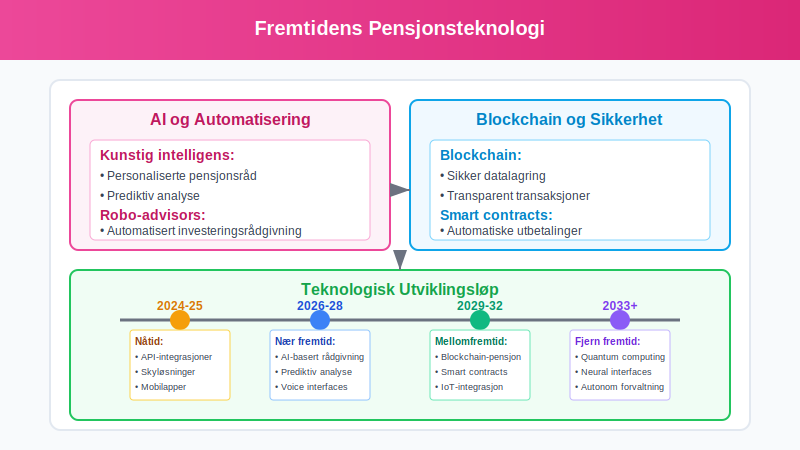

**Teknologiske utviklingstrekk:**
- **Kunstig intelligens:** Personaliserte pensjonsråd
- **Blockchain:** Sikker datalagring og -overføring
- **Robo-advisors:** Automatisert investeringsrådgivning
- **Big data:** Bedre risikoprediksjoner

**Regulatoriske endringer:**
- **EU-direktiver:** PÃ¥virker norske regler
- **Bærekraftskrav:** ESG-integrasjon i pensjon
- **Økt fleksibilitet:** Tilpassede pensjonsløsninger

## Seksjon 6: Internasjonale Perspektiver

### 6.1 Sammenligning med Andre Land

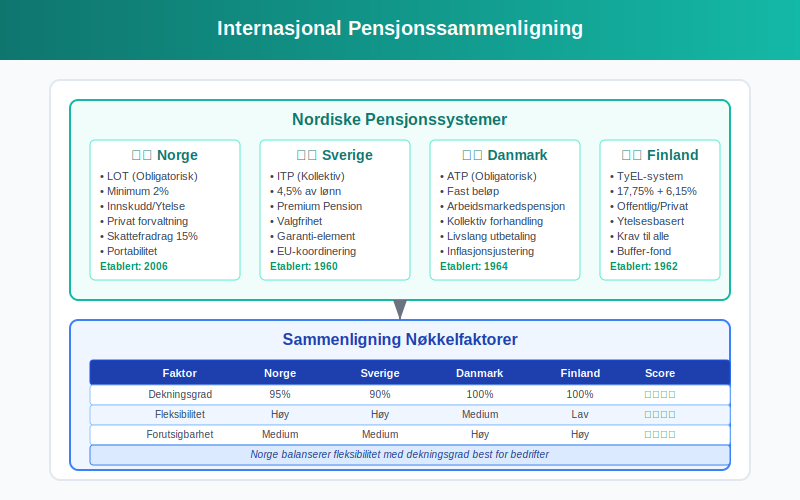

**Nordiske land:**
- **Sverige:** Premium Pension-systemet
- **Danmark:** Arbeidsmarkedspensjon (ATP)
- **Finland:** TyEL-systemet

**Implikasjoner for norske bedrifter:**
- **Utenlandske ansatte:** Koordinering av pensjonsrettigheter
- **Internasjonal mobilitet:** Portabilitet av pensjon
- **Konkurranseforhold:** Sammenligning av totale lønnskostnader

### 6.2 Multinasjonale Selskaper

**Utfordringer for globale bedrifter:**
- **Harmonisering:** Felles pensjonsstandarder på tvers av land
- **Rapportering:** Konsolidert regnskapsføring
- **Compliance:** Ulike juridiske krav per land
- **Kostnadsoptimalisering:** Effektiv ressursbruk

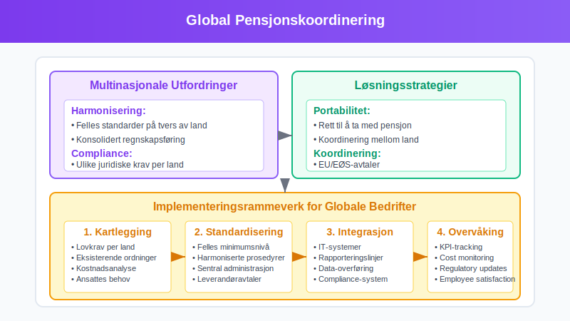

## Seksjon 7: Beste Praksis og Anbefalinger

### 7.1 Implementering av Pensjonsordning

**Strukturert tilnærming til etablering:**

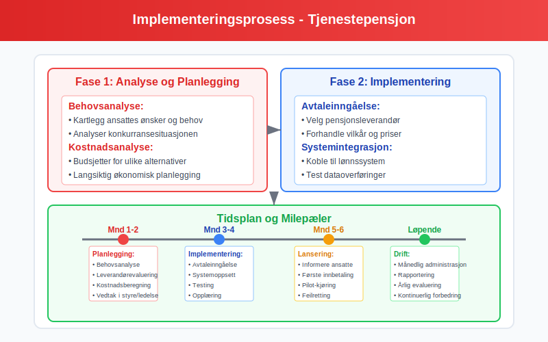

**Fase 1: Analyse og planlegging**
1. **Behovsanalyse:** Kartlegging av ansattes behov
2. **Kostnadsanalyse:** [Budsjettering](/blogs/regnskap/hva-er-budsjettering "Hva er Budsjettering? Planlegging og Kontroll av Bedriftens Økonomi") av pensjonskostnader
3. **Leverandørevaluering:** Sammenligning av tilbud
4. **Juridisk gjennomgang:** Sikre compliance

**Fase 2: Implementering**
1. **Avtaleinngåelse:** Med valgt leverandør
2. **Systemintegrasjon:** Kobling til eksisterende systemer
3. **Opplæring:** Av HR og økonomipersonell
4. **Informasjon:** Til ansatte om ny ordning

**Fase 3: Drift og oppfølging**
1. **Løpende administrasjon:** Månedlig håndtering
2. **Rapportering:** Til myndigheter og ledelse
3. **Evaluering:** Ã…rlig gjennomgang av ordning
4. **Optimalisering:** Kontinuerlig forbedring

### 7.2 Nøkkeltall og Overvåking

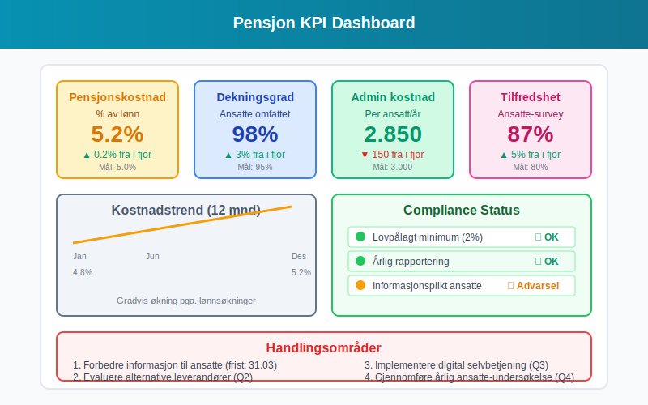

**Viktige nøkkeltall for oppfølging:**

| **KPI** | **Målområde** | **Frekvens** |
|---------|---------------|--------------|
| Pensjonskostnad % av lønn | 2-7% | Månedlig |
| Dekningsgrad ansatte | >95% | Kvartalsvis |
| Administrasjonskostnad per ansatt | Optimalisering | Ã…rlig |
| Ansattes tilfredshet | >80% | Ã…rlig |

**Rapporteringsrutiner:**
- **MÃ¥nedlig:** Kostnader og innbetalinger
- **Kvartalsvis:** Analyse av avvik og trender
- **Ã…rlig:** Omfattende evaluering og strategisk gjennomgang

### 7.3 Risikostyring


**Identifisering av hovedrisikoer:**

**Finansielle risikoer:**
- **Markedsrisiko:** Svingninger i pensjonskapital
- **Renterisiko:** Endringer i diskonteringsrente
- **Inflasjonssrisiko:** PÃ¥virker fremtidige forpliktelser
- **Longevity-risiko:** Økt levealder påvirker kostnader

**Operasjonelle risikoer:**
- **Systemfeil:** Feil i beregninger eller overføringer
- **Compliance-risiko:** Brudd på regelverket
- **Leverandørrisiko:** Problemer hos pensjonsleverandør
- **Datarisiko:** Tap eller lekkasje av persondata

**Risikohåndtering:**
- **Diversifisering:** Spredning av investeringsrisiko
- **Forsikring:** Dekking av operasjonelle risikoer
- **Overvåking:** Kontinuerlig oppfølging av nøkkeltall
- **Beredskapsplaner:** For håndtering av kritiske situasjoner

## Konklusjon

**Tjenestepensjon** er en kompleks, men viktig del av bedriftens økonomi og personaladministrasjon. Den påvirker alt fra [regnskapsføring](/blogs/regnskap/hva-er-bokforing "Hva er Bokføring? Grunnleggende Guide til Regnskapsføring") og [kostnadsstruktur](/blogs/regnskap/hva-er-kostnader "Hva er Kostnader? Klassifisering og Regnskapsføring i Bedriften") til [likviditet](/blogs/regnskap/hva-er-likviditet "Hva er Likviditet? Komplett Guide til Bedriftens Betalingsevne") og konkurranseevne. 

**Nøkkelområder for suksess:**
- **Juridisk compliance:** Overhold alle lovkrav
- **Kostnadseffektivitet:** Optimaliser kostnader vs. ytelser
- **Teknologiutnyttelse:** Bruk digitale løsninger for effektivitet
- **Strategisk tilnærming:** Integrer pensjon i total personalstrategi

For bedrifter er det avgjørende å ha god kontroll på både de regnskapsmessige og operasjonelle aspektene ved tjenestepensjon. Dette krever kompetanse innen regnskap, jus og personaladministrasjon, samt gode systemer for overvåking og rapportering.

Med riktig tilnærming kan tjenestepensjon bli et verdifullt verktøy for både å tiltrekke og beholde kompetente ansatte, samtidig som bedriften opprettholder god økonomisk kontroll og overholder alle juridiske krav.
