---
title: "Hva er Tofaktorautentisering?"
meta_title: "Hva er Tofaktorautentisering?"
meta_description: '**Tofaktorautentisering** (2FA) har blitt en kritisk sikkerhetskomponent for regnskapsførere og økonomipersonell som håndterer sensitive finansielle data. I ...'
slug: hva-er-tofaktorautentisering
type: blog
layout: pages/single
---

**Tofaktorautentisering** (2FA) har blitt en kritisk sikkerhetskomponent for regnskapsførere og økonomipersonell som håndterer sensitive finansielle data. I en tid hvor cybertrusler rettet mot regnskapssystemer øker dramatisk, fungerer 2FA som et ekstra sikkerhetslag som beskytter både [regnskapsdata](/blogs/regnskap/hva-er-bokforing "Hva er Bokføring? Grunnleggende Prinsipper og Prosesser") og [kundefordringer](/blogs/regnskap/hva-er-debitor "Hva er Debitor i Regnskap? Komplett Guide til Kundefordringer og Debitorhåndtering"). Implementering av tofaktorautentisering er ikke bare en teknisk sikkerhetstiltak, men en forretningsmessig nødvendighet for å sikre [internkontroll](/blogs/regnskap/hva-er-internkontroll "Hva er Internkontroll? Systemer og Prosesser for Risikostyring") og beskytte mot datatyveri som kan påvirke både [balansen](/blogs/regnskap/hva-er-balanse "Hva er Balanse? Komplett Guide til Balansens Oppbygging og Funksjon") og [årsregnskapet](/blogs/regnskap/hva-er-arsregnskap "Hva er Årsregnskap? Innhold og Krav til Regnskapsrapportering").

## Seksjon 1: Grunnleggende om Tofaktorautentisering i Regnskap

Tofaktorautentisering representerer en fundamental sikkerhetsstrategi som kombinerer **"noe du vet"** (passord) med **"noe du har"** (mobiltelefon eller sikkerhetsnøkkel, f.eks. [BankID](/blogs/regnskap/bankid "Hva er BankID? En komplett guide til BankID i norsk regnskap og elektronisk signering")) for å skape et robust forsvar mot uautorisert tilgang til regnskapssystemer.

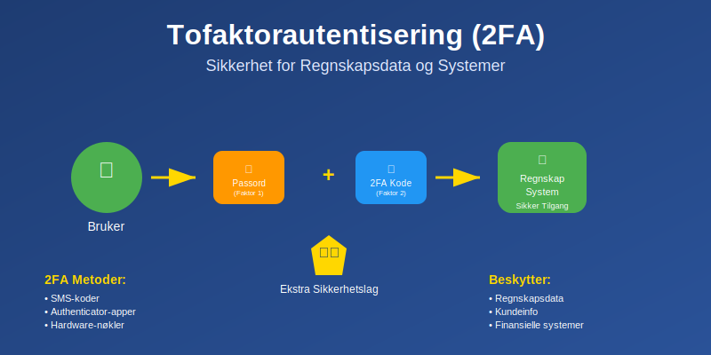

### 1.1 Hvorfor 2FA er Kritisk for Regnskapsføring

**Regnskapssystemer** inneholder ekstremt sensitiv informasjon som krever maksimal beskyttelse:

* **Finansielle transaksjoner** og [kontantstrøm](/blogs/regnskap/hva-er-kontantstrom "Hva er Kontantstrøm? Analyse og Forvaltning av Bedriftens Pengestrøm")data
* **Kundedata** og [debitorinformasjon](/blogs/regnskap/hva-er-fordringer "Hva er Fordringer? Komplett Guide til Kundefordringer og Andre Fordringer")
* **[Lønnsdata](/blogs/regnskap/hva-er-loennskostnad "Hva er Lønnskostnad? Beregning og Regnskapsføring")** og personalinformasjon
* **[Skattedata](/blogs/regnskap/hva-er-skatt "Skatt - Komplett Guide til Bedriftsskatt, MVA og Skatteplanlegging")** og MVA-rapporter
* **Banker og [likviditetsinformasjon](/blogs/regnskap/hva-er-likviditet "Hva er Likviditet? Komplett Guide til Bedriftens Betalingsevne")**

### 1.2 Regulatoriske Krav og Compliance

**GDPR og personvernforordningen** stiller strenge krav til databeskyttelse:

| **Regulering** | **Krav til sikkerhet** | **Straff ved brudd** |
|----------------|-------------------------|---------------------|
| GDPR | "Appropriate technical measures" | Opptil 4% av årlig omsetning |
| Bokføringsloven | Sikker oppbevaring av regnskapsdata | Bøter og ansvar |
| [Regnskapsloven](/blogs/regnskap/hva-er-regnskapsloven "Hva er Regnskapsloven? Krav og Bestemmelser for Norske Bedrifter") | Dokumentasjonssikkerhet | Juridisk ansvar |

**Cybersikkerhet i regnskap** påvirker direkte:
- **[Revisjons](/blogs/regnskap/hva-er-revisjon "Hva er Revisjon? Prosess og Krav til Eksterne Revisorer")prosessen** og kontroller
- **[Ã…rsregnskap](/blogs/regnskap/hva-er-arsregnskap "Hva er Ã…rsregnskap? Innhold og Krav til Regnskapsrapportering")rapportering** og troverdighet
- **Kunde tillit** og [omdømmerisiko](/blogs/regnskap/hva-er-risiko "Hva er Risiko? Identifisering og Håndtering av Forretningsmessig Risiko")

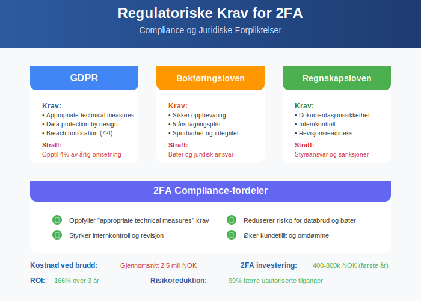

### 1.3 Kostnadene ved Sikkerhetsbrudd

**Økonomiske konsekvenser** av kompromitterte regnskapssystemer:

#### Direkte kostnader:
* **Datarecovery** og systemgjenoppretting: 500.000 - 2.000.000 kr
* **Juridiske kostnader** og compliance-bøter: 200.000 - 5.000.000 kr
* **Tapet arbeidstime** under systemnedetid: 50.000 - 500.000 kr/dag

#### Indirekte kostnader:
* **Omdømmetap** og kundeflukt
* **Tap av [konkurransefortrinn](/blogs/regnskap/hva-er-konkurransefortrinn "Hva er Konkurransefortrinn? Økonomiske og Strategiske Fordeler")**
* **Økte forsikringspremier** for cyberforsikring
* **Regulatorisk innsyn** og økt kontrollaktivitet

## Seksjon 2: Tekniske Implementeringer av 2FA

### 2.1 SMS-basert Autentisering

**SMS 2FA** er den mest utbredte formen, men har kjente sårbarheter:

#### Fordeler:
* **Enkel implementering** for brukere
* **Lav kostnad** for organisasjoner
* **Bred kompatibilitet** med alle mobiltelefoner

#### Ulemper og risikoer:
* **SIM-swapping angrep** hvor angriper overtar telefonnummer
* **SMS-intercepting** via SS7-protokoll sårbarheter  
* **Nettverksavhengighet** kan hindre tilgang

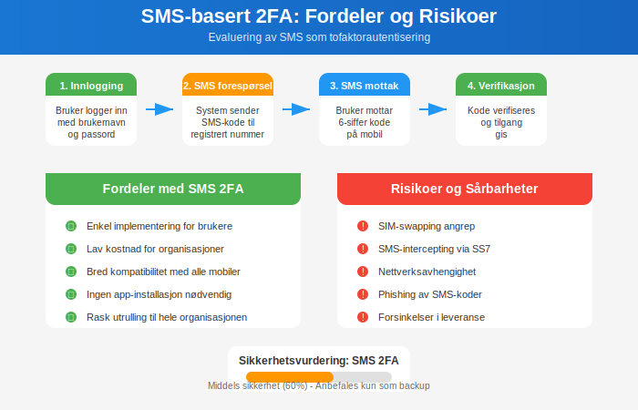

### 2.2 App-baserte TOTP (Time-based One-Time Password)

**Authenticator-apper** som Google Authenticator, Microsoft Authenticator genererer koder lokalt:

#### Teknisk funksjonalitet:
```
TOTP = HOTP(K, T)
hvor:
K = delt hemmelig nøkkel
T = tidsstempel (vanligvis 30-sekunders vinduer)
```

#### Fordeler:
* **Offline-funksjonalitet** - ikke avhengig av internett
* **Høyere sikkerhet** enn SMS
* **Standardisert** (RFC 6238) på tvers av plattformer

#### Implementering i regnskapssystemer:
| **System** | **Native støtte** | **Integrasjonskrav** |
|------------|-------------------|---------------------|
| SAP | Ja | SSO-konfigurering |
| Oracle NetSuite | Ja | Admin-aktivering |
| QuickBooks | Delvis | Tredjepartsløsning |
| Visma | Ja | Brukerinnstillinger |

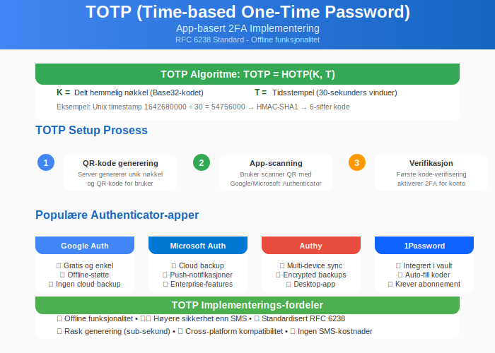

### 2.3 Hardware-baserte Sikkerhetsnøkler

**FIDO2/WebAuthn** representerer neste generasjon autentisering:

#### YubiKey og lignende enheter:
* **Kryptografisk sikkerhet** med public-key infrastructure
* **Phishing-resistent** - umulig å kopiere eller avlede
* **USB, NFC, eller Bluetooth** tilkobling

#### Fordeler for regnskapsvirksomheter:
* **Høyeste sikkerhetsnivå** for sensitive transaksjoner
* **Enkel brukeropplevelse** - bare plugge inn og trykke
* **Sentralisert administrasjon** for IT-ansvarlige
* **Compliance-ready** for strengeste reguleringer

**Kostnadsanalyse hardware-nøkler:**
```
Initial kostnad: 300-800 kr per ansatt
Ã…rlig drift: 50-150 kr per ansatt
Total kostnad over 3 år: 450-1.250 kr per ansatt

Sammenligning med kostnaden av ett sikkerhetsbrudd:
Gjennomsnittlig brudd: 2.5 millioner kr
ROI på 2FA: 2.000-5.000% over 3 år
```

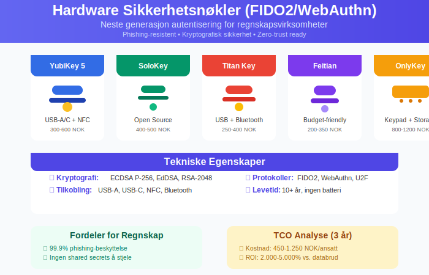

### 2.4 Biometrisk Autentisering

**Fingeravtrykk, ansiktsgjenkjenning** og **irisscanning** blir stadig mer utbredt:

#### Implementering i regnskapsmiljøer:
* **Windows Hello for Business** - integrert med Active Directory
* **TouchID/FaceID** - for Mac-baserte regnskapssystem
* **Mobilbasert biometri** - kombinert med app-2FA

#### Personvern og GDPR-betraktninger:
* **Biometriske data** klassifiseres som særlige kategorier av personopplysninger
* **Krav til samtykke** og databehandleravtaler
* **Lokal lagring** anbefales fremfor sentral database

## Seksjon 3: Integrasjon med Regnskapssystemer

### 3.1 Enterprise Resource Planning (ERP) Systemer

**Moderne ERP-systemer** har ofte innebygd 2FA-støtte:

#### SAP implementering:
```
Transaksi: SAML_CONFIG
1. Konfigurer identity provider (IdP)
2. Aktiver MFA i SAP Cloud Identity
3. Tildel brukere MFA-krav basert på rolle
4. Test med regnskapsmoduler (FI/CO)
```

#### Oracle NetSuite:
* **Role-based access** med 2FA-krav per funksjon
* **API-integrasjon** for tredjeparty autentiseringsløsninger  
* **Audit logs** for sporbarhet av sikkerhetshendelser

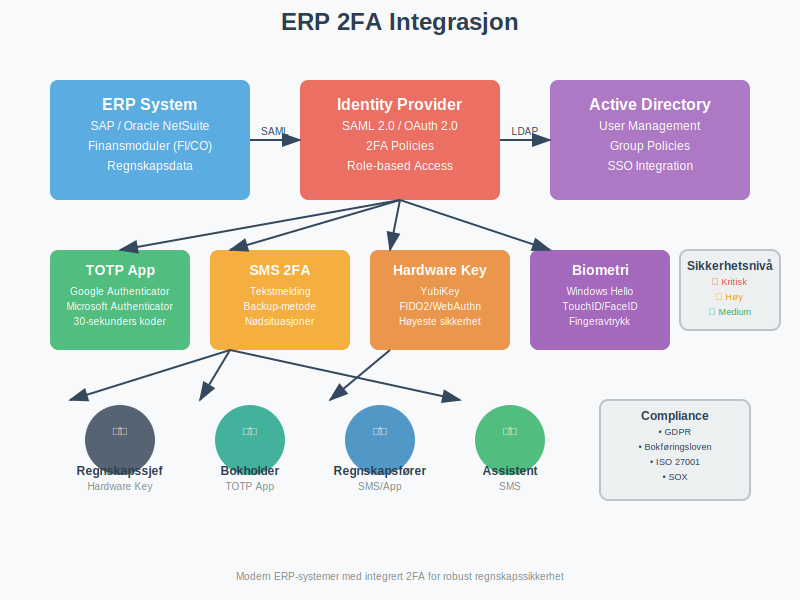

### 3.2 Skybaserte Regnskapsløsninger

**Software-as-a-Service (SaaS)** regnskapsplattformer:

#### Implementeringsstrategi:
| **Plattform** | **2FA-typer** | **Administrativ kontroll** |
|---------------|---------------|---------------------------|
| Xero | SMS, App, Email | Admin kan kreve for alle |
| QuickBooks Online | SMS, App | Per bruker-aktivering |
| FreshBooks | SMS, App | Standard for alle planer |
| Wave | SMS | Gratis funksjon |

#### Single Sign-On (SSO) integrasjon:
* **SAML 2.0** for enterprise-kunder
* **OAuth 2.0** for API-tilgang
* **Active Directory** synkronisering for intern brukerstyring

### 3.3 Banker og Finansielle Tjenester

**Open Banking** og **PSD2-direktivet** krever sterke kundeautentisering (SCA):

#### [BankID](/blogs/regnskap/bankid "Hva er BankID? En komplett guide til BankID i norsk regnskap") og Vipps integrering:
* **Automatisk avstemming** av [banktransaksjoner](/blogs/regnskap/hva-er-bankavstemming "Hva er Bankavstemming? Prosess og Betydning for Regnskapsføring")
* **Digital signering** av [faktura](/blogs/regnskap/hva-er-en-faktura "Hva er en Faktura? En Guide til Norske Fakturakrav") og [kontrakter](/blogs/regnskap/hva-er-kontrakt "Hva er Kontrakt? Juridiske og Regnskapsmessige Aspekter")
* **Compliance** med norske bankreguleringer

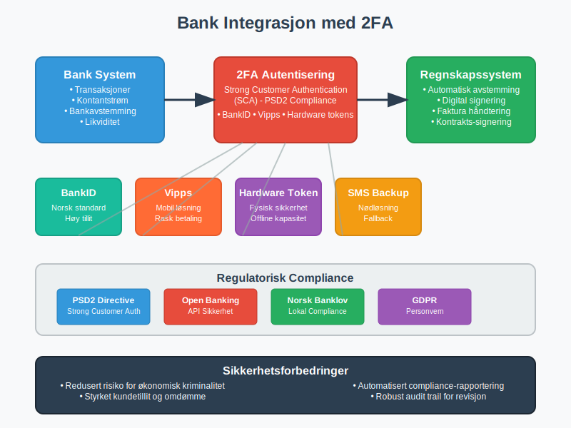

## Seksjon 4: Organisatorisk Implementering

### 4.1 Sikkerhetspolicy og Retningslinjer

**Utvikling av 2FA-policy** for regnskapsvirksomheter:

#### Minimumsstandard:
```
Alle brukere med tilgang til:
- Finansielle rapporter og [resultatregnskap](/blogs/regnskap/hva-er-resultatregnskap "Hva er Resultatregnskap? Oppbygning og Analyse")
- [Kundedata](/blogs/regnskap/hva-er-kunde "Hva er Kunde? Administrasjon og Regnskapsføring av Kunderelasjoner") og faktureringssystemer
- [Bankkontoer](/blogs/regnskap/hva-er-bankkonto "Hva er Bankkonto? Typer og Regnskapsføring av Bankkontoer") og betalingssystemer
- [Lønnssystemer](/blogs/regnskap/hva-er-loennsystem "Hva er Lønnssystem? Administrasjon og Integrering med Regnskap") og personaldata

SKAL bruke tofaktorautentisering.
```

#### Risikoklassifisering av brukere:
| **Risikokategori** | **Brukertype** | **2FA-krav** |
|-------------------|----------------|--------------|
| Kritisk | Regnskapssjef, controller | Hardware-nøkkel påkrevd |
| Høy | Regnskapsføre, [bokholder](/blogs/regnskap/hva-er-bokholder "Hva er Bokholder? Rolle og Ansvar i Regnskapsføring") | App eller SMS 2FA |
| Medium | Assistenter, konsulenter | SMS 2FA minimum |
| Lav | Lesertilgang, rapporter | Kan unntas |

### 4.2 Opplærings- og Awarenessprogrammer

**Effektiv 2FA implementering** krever omfattende brukeropplæring:

#### Opplæringsmoduler:
1. **Trusselbilde** og risiko for regnskapsbransjen
2. **Praktisk bruk** av 2FA-verktøy i daglige arbeidsflyt
3. **Troubleshooting** og support-prosedyrer
4. **Phishing recognition** og sociale ingenieuring

#### Awareness-kampanjer:
* **MÃ¥nedlige phishing-tester** med regnskapsspesifikke scenarios
* **Cybersikkerhets-workshops** for regnskapspersonell
* **Incident response** øvelser og tabletop-simuleringer

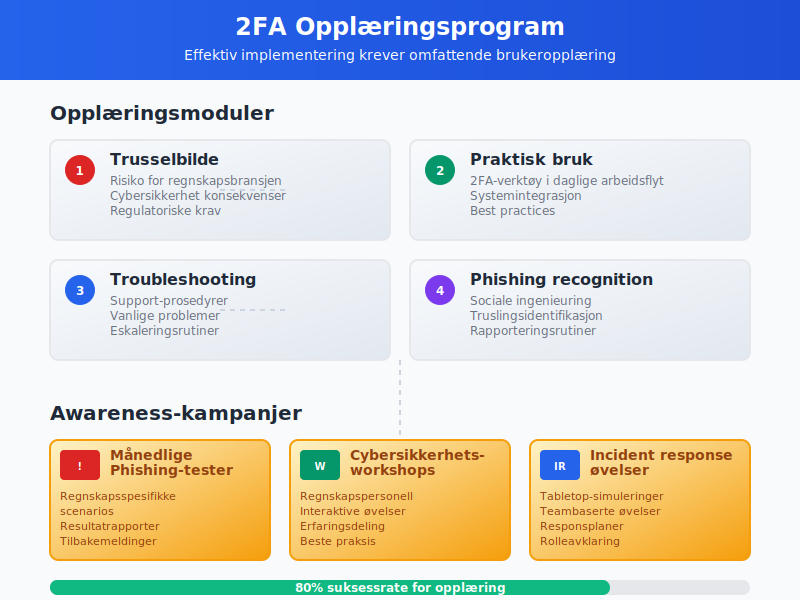

### 4.3 Change Management og Brukeradopsjon

**Overgang til 2FA** kan møte motstand fra erfarne regnskapsførere:

#### Suksessfaktorer:
* **Gradvis utrulling** - start med kritiske systemer
* **Champion-program** - identifiser teknologi-positive medarbeidere
* **Insentiver** for tidlig adopsjon og god compliance
* **Support-desk** med regnskapsspesifikk kompetanse

#### Vanlige utfordringer og løsninger:
| **Utfordring** | **Symptom** | **Løsning** |
|----------------|-------------|-------------|
| Motstand mot endring | "Dette tar for lang tid" | Demonstrer tidsbesparelse ved sikkerhet |
| Teknisk kompleksitet | "Jeg forstår ikke teknologien" | Forenklet opplæring og visuelle guider |
| Produktivitetstap | "Dette hindrer mitt arbeid" | Optimalisere arbeidsflyt og automasjon |

## Seksjon 5: Avanserte Sikkerhetsaspekter

### 5.1 Zero Trust Architecture

**Zero Trust** modellen blir stadig viktigere for regnskapsvirksomheter:

#### Prinsipper for regnskapssikkerhet:
* **Never trust, always verify** - autentiser hver transaksjon
* **Least privilege access** - minimum nødvendige tilganger
* **Microsegmentation** - isoler kritiske regnskapssystemer
* **Continuous monitoring** - sanntidsovervåking av brukeraktivitet

#### Implementering i regnskapskontekst:
```
Tradisjonell modell:
Bruker inne på nettverket → Tilgang til alle regnskapssystemer

Zero Trust modell:
Bruker autentisert → Tilgang vurdert per system
→ Kontinuerlig verifisering av aktivitet
→ Automatisk utlogging ved mistenksom atferd
```

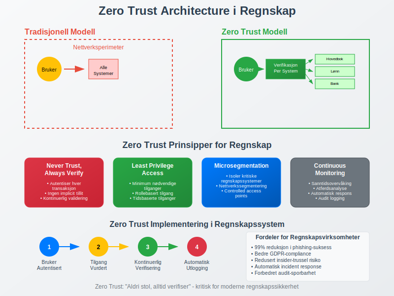

### 5.2 Adaptive Authentication

**AI-drevne sikkerhetssystemer** kan tilpasse 2FA-krav basert på risiko:

#### Risikoparametere for regnskapsbruk:
* **Geografisk lokasjon** - unormale innloggingssted
* **Enhetstilgang** - ukjente datamaskiner eller mobilenheter
* **Tidsperioder** - innlogging utenfor arbeidstid
* **Atferdsmønstre** - uvanlige transaksjonsvolum eller -typer

#### Eksempel på adaptiv regel:
```
IF (innlogging utenfor Norge 
    AND tilgang til banksystemer 
    AND utenfor arbeidstid)
THEN krev hardware-nøkkel + manager-godkjenning
```

### 5.3 Backup og Business Continuity

**2FA-systemer** kan også feile - kontinuitetsplanlegging er kritisk:

#### Backup-autentiseringsmetoder:
* **Recovery codes** - engangskoder for nødstilfeller
* **Backup hardware-nøkler** - lagret sikkert off-site
* **Administrativ override** - kun for kritiske regnskapsfrister
* **Telefonbasert verifisering** - manuell prosess for nødstilfeller

#### Business continuity scenario:
```
Scenario: Hovedkontor ødelegges av brann
- Kritisk: [Månedsavslutning](/blogs/regnskap/hva-er-manedsavslutning "Hva er Månedsavslutning? Prosess og Kontroller") må fullføres
- Løsning: Remote work med mobile 2FA-enheter
- Backup: Cloud-baserte regnskapssystem med offline backup codes
```

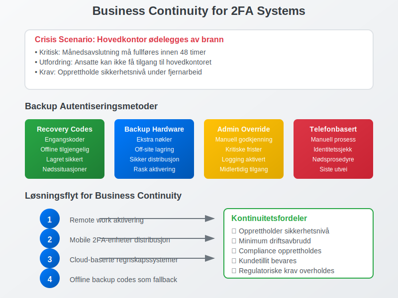

## Seksjon 6: Bransje- og Sektorspesifikke Implementeringer

### 6.1 Revisionsfirmaer og Autoriserte Regnskapsførere

**Revisionsfirmaer** håndterer flere kunders finansielle data:

#### Multitenant sikkerhetstilnærming:
* **Kundespesifikke 2FA-krav** per oppdragsnivå
* **Segregering av kundedata** med separate autentiseringsdomener
* **Audit trail** for alle tilganger på tvers av kundeporteføljer
* **Partner-tilgang** med høyere sikkerhetskrav

#### Regulatory compliance for revisorer:
| **Standard** | **2FA-krav** | **Dokumentasjonskrav** |
|--------------|--------------|-------------------------|
| ISA 315 | Risikoevaluering av IT-systemer | Dokumenter 2FA-implementering |
| ISAE 3402 | Kontroller hos tjenesteleverandører | Tester 2FA-effektivitet |
| [International Standards on Auditing](/blogs/regnskap/hva-er-isa "Hva er ISA? International Standards on Auditing") | IT-generelle kontroller | Vurder 2FA som kontrollaktivitet |

### 6.2 Offentlig Sektor og Kommunal Regnskapsføring

**Offentlige virksomheter** har særlige sikkerhetskrav:

#### Nasjonale sikkerhetsrammeverk:
* **NSM Grunnprinsipper** for informasjonssikkerhet
* **Nasjonal sikkerhetsmyndighet** klassifisering av data
* **GDPR** for persondata i kommunale systemer
* **Arkivloven** for langtidslagring av autentiseringslogger

#### Spesielle implementeringskrav:
* **Nasjonal ID-løsninger** - ID-porten integrering
* **Qualified electronic signatures** for formal documenter
* **[Compliance med offentlige anskaffelser](/blogs/regnskap/hva-er-anskaffelser "Hva er Anskaffelser? Offentlige og Private Anskaffelsesprosesser")**
* **Transparency** og offentlig innsyn i sikkerhetspraksis

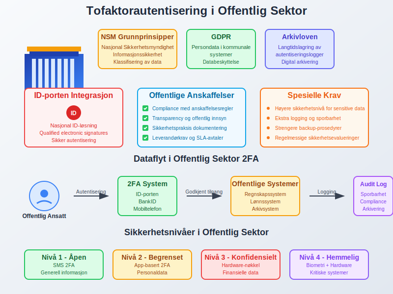

### 6.3 Internasjonale Konsern og Datterselskap

**Multinasjonale regnskapsvirksomheter** møter komplekse jurisdiksjonelle krav:

#### Cross-border datautveksling:
* **EU GDPR** vs. **California CCPA** vs. **norsk personvernlov**
* **Data residency** krav - hvor 2FA-logger kan lagres
* **Transfer impact assessments** for 2FA-systemer med tredjelandskomponenter

#### Sentralisert vs. distribuert 2FA-administrasjon:
| **Tilnærming** | **Fordeler** | **Utfordringer** |
|----------------|--------------|------------------|
| Sentralisert | Enhetlig policy, kostnadseffektivt | Lokale regulatoriske konflikter |
| Distribuert | Lokal compliance, fleksibilitet | Kompleks administrasjon, inkonsistens |
| Hybrid | Balansert tilnærming | Krever sofistikerte systemer |

## Seksjon 7: Teknologiske Trender og Fremtiden

### 7.1 Passwordless Authentication

**Eliminering av passord** representerer neste evolusjonssteg:

#### FIDO2 og WebAuthn:
* **Public key cryptography** erstatter shared secrets
* **Device-bound** autentisering forhindrer credential stuffing
* **User experience** forbedres dramatisk med biometri
* **Phishing immunity** - umulig å lure til falske sider

#### Implementering for regnskapsystem:
```
Tradisjonell: Brukernavn + Passord + 2FA-kode
Passwordless: Hardware-nøkkel eller biometri → direkte tilgang

Fordeler:
- Redusert support-overhead (ingen glemt passord)
- Høyere sikkerhet (ingen passord å stjele)
- Bedre brukeropplevelse (raskere innlogging)
```

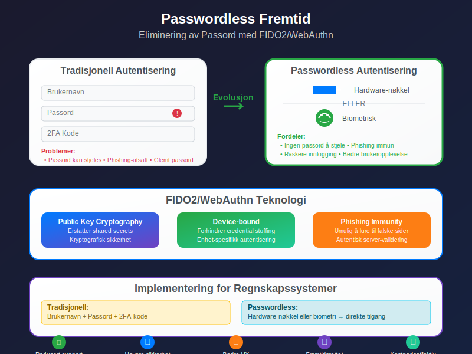

### 7.2 Blockchain og Distributed Identity

**Decentralized Identity (DID)** kan revolusjonere regnskapssikkerhet:

#### Blockchain-basert autentisering:
* **Self-sovereign identity** - brukere kontrollerer sine egne credentials
* **Verifiable credentials** - tamper-proof identity assertions
* **Interoperability** på tvers av regnskapssystemer og jurisdiksjoner
* **Privacy-preserving** - zero-knowledge proofs for sensitive data

#### Potensielle anvendelser:
* **[Revisor-credentials](/blogs/regnskap/hva-er-statsautorisert-revisor "Hva er Statsautorisert Revisor? Kvalifikasjoner og Ansvar")** verificeret via blockchain
* **Cross-border** regnskapssamarbeid med kryptografisk trust
* **Audit trails** som ikke kan manipuleres
* **Smart contracts** for automatiserte compliance-sjekker

### 7.3 Quantum Computing og Post-Quantum Cryptography

**Quantum computers** truer dagens kryptografiske metoder:

#### Tidslinje og impact:
* **2030-2035:** Første kommersielle quantum computers
* **2035-2040:** Trussel mot RSA og elliptic curve cryptography
* **2025-2030:** Overgang til quantum-safe algoritmer må starte

#### Forberedelser for regnskapsbransjen:
| **Område** | **Nåværende risiko** | **Quantum-safe migrering** |
|------------|---------------------|---------------------------|
| 2FA hardware | Moderat | FIDO2 med post-quantum algoritmer |
| PKI certificates | Høy | Hybrid classical-quantum certificates |
| [Database encryption](/blogs/regnskap/hva-er-database "Hva er Database? Regnskapsdata og Informasjonssystemer") | Høy | AES-256 + quantum-safe key exchange |

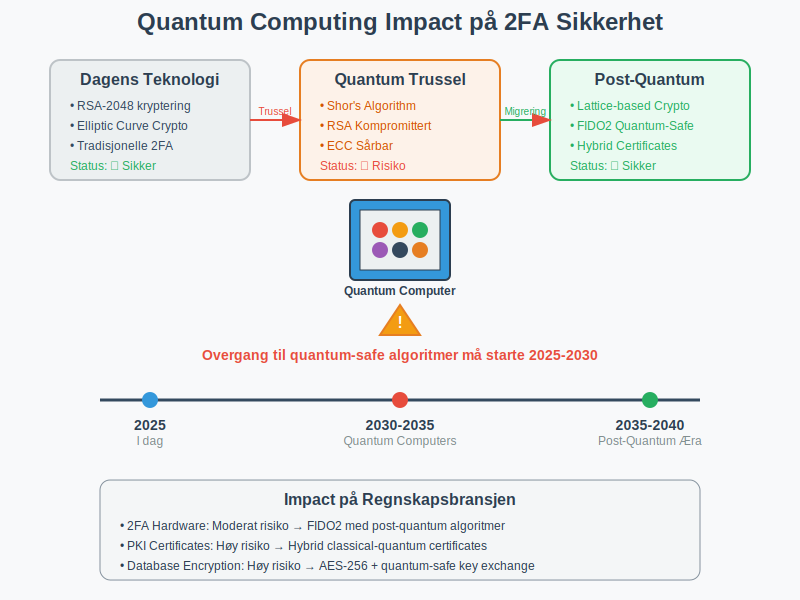

## Seksjon 8: Kostnads-Nytte Analyse

### 8.1 Total Cost of Ownership (TCO)

**Realistisk kostnadsmodell** for 2FA-implementering i regnskapsvirksomheter:

#### Initialkostnader (første år):
```
Programvare og lisenser:
- Enterprise 2FA-løsning: 200-500 kr/bruker/år
- Hardware-nøkler: 300-800 kr/bruker (engangsutgift)
- Systemintegrasjon: 50.000-200.000 kr

Implementeringskostnader:
- Konsulentbistand: 100.000-300.000 kr
- Intern arbeidstid: 200-400 timer × timelønn
- Opplæring: 50.000-150.000 kr

Total for 50 ansatte: 400.000-800.000 kr første år
```

#### Løpende årlige kostnader:
```
Drift og vedlikehold:
- Lisenser: 10.000-25.000 kr/Ã¥r
- Support: 20.000-50.000 kr/Ã¥r
- Administrativ overhead: 40.000-80.000 kr/Ã¥r

Total årlig: 70.000-155.000 kr/år
```

### 8.2 Return on Investment (ROI)

**Kvantifiserbare besparelser** fra 2FA-implementering:

#### Reduksjon i sikkerhetstrusler:
| **Trusseltype** | **Uten 2FA (sannsynlighet)** | **Med 2FA (sannsynlighet)** | **Kostnadssparing** |
|-----------------|-------------------------------|------------------------------|---------------------|
| Password stuffing | 15% årlig | 0.1% årlig | 99.3% reduksjon |
| Phishing-angrep | 8% årlig | 0.5% årlig | 93.8% reduksjon |
| Insider threats | 3% årlig | 1% årlig | 66.7% reduksjon |

#### Beregnet ROI over 3 år:
```
Investeringskostnad: 800.000 kr (første år) + 310.000 kr (år 2-3)
Total kostnad: 1.110.000 kr

Forhindrede sikkerhetsbrudd:
- Stor incident (2.5 mill kr): 99% mindre sannsynlighet = 2.475.000 kr besparelse
- Middels incident (500.000 kr): 95% mindre sannsynlighet = 475.000 kr besparelse

Total besparelse: 2.950.000 kr
ROI: (2.950.000 - 1.110.000) / 1.110.000 = 166%
```

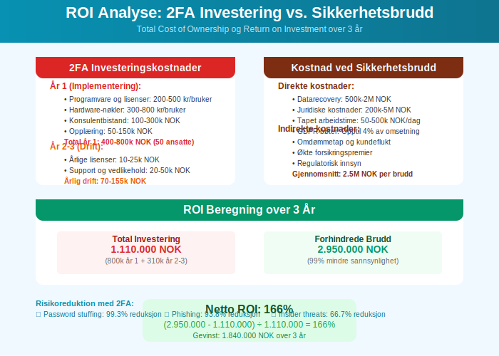

### 8.3 Produktivitetsanalyse

**Balanse mellom sikkerhet og arbeidsflyt** er kritisk:

#### Produktivitetstap (første 6 måneder):
* **Innlæringskurve:** 5-10 minutter ekstra per dag per bruker
* **Tekniske problemer:** 2-4 support-henvendelser per bruker
* **Brukerfrustrasjon:** Midlertidig reduksjon i arbeidseffektivitet

#### Produktivitetsgevinster (etter 6+ måneder):
* **Reduserte passord-reset:** 80% færre henvendelser til IT-support
* **Mindre downtime:** Færre sikkerhetsincidenter som stopper arbeid
* **Forbedret tillit:** Høyere kundetilfredshet grunnet sikkerhet

**Netto produktivitetseffekt:**
```
Ã…r 1: -5% produktivitet (implementeringsfase)
Ã…r 2: +2% produktivitet (reduserte support-kostnader)
Ã…r 3+: +3% produktivitet (optimaliserte arbeidsflyter)
```

## Seksjon 9: Implementeringsstrategi

### 9.1 Fase-basert Utrulling

**Strukturert tilnærming** minimerer risiko og maksimerer suksess:

#### Fase 1: Pilot og kritiske systemer (MÃ¥ned 1-3)
* **Velg 5-10 testbrukere** fra forskjellige avdelinger
* **Implementer på mest kritiske systemer** (bank, lønn, [hovedbok](/blogs/regnskap/hva-er-hovedbok "Hva er Hovedbok? Strukturen i Regnskapssystemet"))
* **Dokumenter utfordringer** og optimaliseringer
* **Utvikle endelige prosedyrer** basert på erfaringer

#### Fase 2: Utvidet implementering (MÃ¥ned 4-6)
* **Utrull til alle regnskapsføre** og økonomipersonell
* **Inkluder sekundære systemer** ([CRM](/blogs/regnskap/hva-er-crm "Hva er CRM? Customer Relationship Management for Regnskapsvirksomheter"), [dokumenthåndtering](/blogs/regnskap/hva-er-dokument "Hva er Dokument? Regnskapsbilag og Dokumentasjon"))
* **Opprett support-rutiner** og FAQ-ressurser
* **Monitorer compliance** og använding

#### Fase 3: Full organisasjonsdekning (MÃ¥ned 7-12)
* **Inkluder alle ansatte** med systemtilgang
* **Implementer alle systemer** inkludert mindre kritiske
* **Fininnstill policyer** og prosedyrer
* **Planlegg fremtidig oppgraderinger** og forbedringer

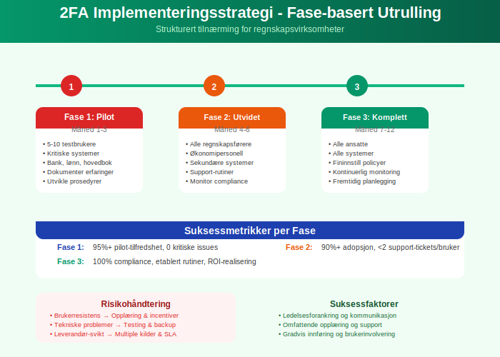

### 9.2 Prosjektledelse og Governance

**Suksessfulle 2FA-prosjekter** krever strukturert ledelse:

#### Prosjektorganisasjon:
| **Rolle** | **Ansvar** | **Tidstilskudd** |
|-----------|------------|------------------|
| Prosjektleder | Overordnet koordinering | 50% i 12 måneder |
| IT-sikkerhetsansvarlig | Teknisk implementering | 100% i 6 måneder |
| Regnskapssjef | Krav og kvalitetssikring | 20% i 12 måneder |
| Change manager | Organisasjonsendring | 30% i 12 måneder |

#### Styringsstruktur:
* **Styringsgruppe:** Ukentlige møter første 3 måneder
* **Arbeidsgruppe:** Daglig koordinering under implementering
* **Brukerrepresentanter:** Feedback og testing av løsninger
* **Leverandør-kontakt:** Teknisk support og eskalering

### 9.3 Risikohåndtering

**Proaktiv risikostyring** forhindrer implementeringsproblemer:

#### Risikoregister:
| **Risiko** | **Sannsynlighet** | **Impact** | **Mitigering** |
|------------|-------------------|------------|----------------|
| Brukerresistens | Høy | Medium | Omfattende opplæring og incentiver |
| Tekniske problemer | Medium | Høy | Grundig testing og backup-løsninger |
| Leverandør-svikt | Lav | Høy | Multiple leverandører og SLA-avtaler |
| Regulatorisk endring | Medium | Medium | Løpende monitoring av compliance-krav |

#### Contingency planning:
```
Plan A: Primær 2FA-løsning med TOTP-apper
Plan B: Fallback til SMS-basert 2FA
Plan C: Midlertidig administrativ godkjenning
Plan D: Offline-arbeid med ettersynkronisering
```

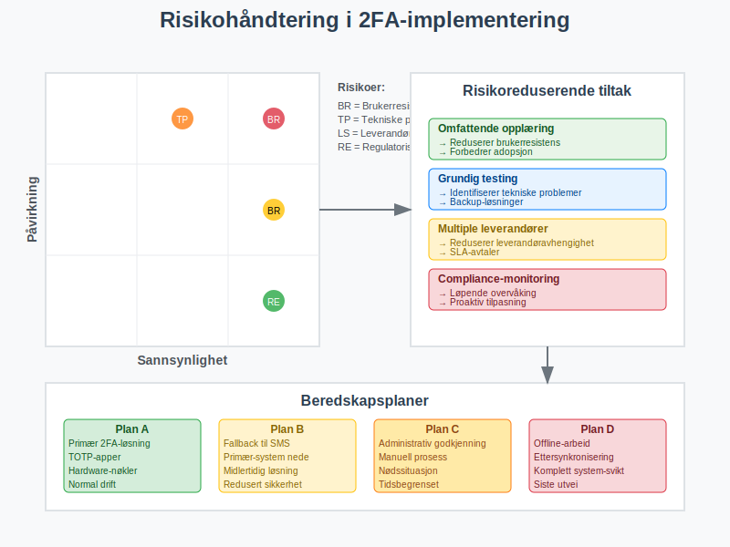

## Seksjon 10: Monitoring og Kontinuerlig Forbedring

### 10.1 Key Performance Indicators (KPIs)

**MÃ¥lbare resultater** for 2FA-suksess:

#### Sikkerhetsmålinger:
| **KPI** | **MÃ¥leverdi** | **MÃ¥lefrekvens** |
|---------|---------------|------------------|
| Suksessrate for innlogging | >98% | Daglig |
| Gjennomsnittlig innloggingstid | <30 sekunder | Ukentlig |
| Phishing-test resultater | <5% fall for falske e-poster | MÃ¥nedlig |
| Sikkerhetsincidenter | 0 major, <2 minor per kvartal | Kontinuerlig |

#### Operasjonelle målinger:
* **Support-henvendelser:** <1 per bruker per måned
* **Compliance-rate:** 100% for kritiske systemer
* **Training completion:** 95% innen 3 måneder
* **User satisfaction:** >7/10 i tilfredshetsskor

### 10.2 Kontinuerlig Monitoring

**Automated monitoring** for sikkerhetshendelser:

#### SIEM-integrasjon:
```
Log Sources:
- 2FA authentication events
- Failed login attempts
- Device enrollment/changes
- Administrative actions

Analytics:
- Pattern recognition for abnormal behavior
- Geolocation analysis
- Time-based access patterns
- Volume-based alerting
```

#### Dashboard-komponenter:
* **Real-time statusvisning** av alle autentiseringssystem
* **Trendanalyser** for brukeradopsjon og compliance
* **Incident tracking** med automatisk eskalering
* **Performance metrics** for system-responstider

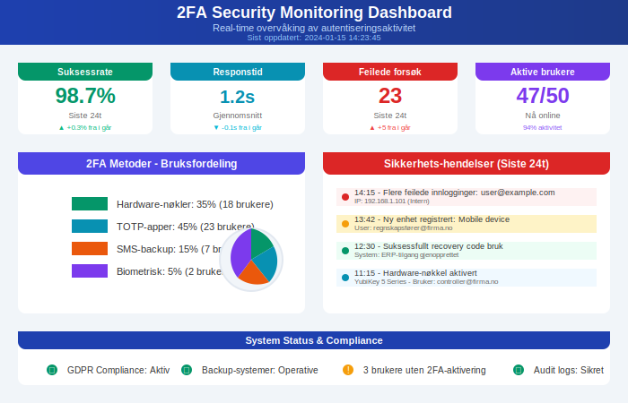

### 10.3 Ã…rlig Review og Oppdatering

**Systematisk evaluering** sikrer løpende relevans:

#### Ã…rlig sikkerhetsvurdering:
1. **Trussellandskap-analyse:** Nye angrepstyper og sårbarheter
2. **Teknologi-evaluering:** Nye 2FA-teknologier og standarder
3. **Compliance-review:** Endringer i regulatoriske krav
4. **Kostnads-nytte oppdatering:** ROI-realisering vs. prognoser

#### Oppgraderingsplan:
* **Hardware-nøkler:** 3-5 års utskiftingssyklus
* **Software-systemer:** Årlige større oppdateringer
* **Policies og prosedyrer:** Halvårlig review og justering
* **Opplæringsprogrammer:** Årlig oppdatering av innhold

## Seksjon 11: Practical Implementation Guide

### 11.1 Teknisk Sjekkliste

**Steg-for-steg implementeringsguide:**

#### Pre-implementering (4-6 uker før):
- [ ] **Inventar av systemer** som krever 2FA
- [ ] **Brukeranalyse** og rollebasert tilgangstyring
- [ ] **Leverandør-evaluering** og kontrakt-forhandling
- [ ] **Pilot-brukere identifisert** og informert
- [ ] **Backup-planer** for continuity dokumentert

#### Teknisk setup (2-4 uker):
- [ ] **Identity Provider** konfigurert og testet
- [ ] **Active Directory** integration etablert
- [ ] **SAML/OIDC** konfigurert for alle systemer
- [ ] **Mobile Device Management** (MDM) setup
- [ ] **Network segmentation** for sikre Admin-tilganger

#### Testing og Quality Assurance (1-2 uker):
- [ ] **Functional testing** av alle autentiseringsflyter
- [ ] **Performance testing** under normal belastning
- [ ] **Disaster recovery** testing av backup-prosedyrer
- [ ] **User acceptance testing** med pilot-gruppe
- [ ] **Security penetration testing** av implementering

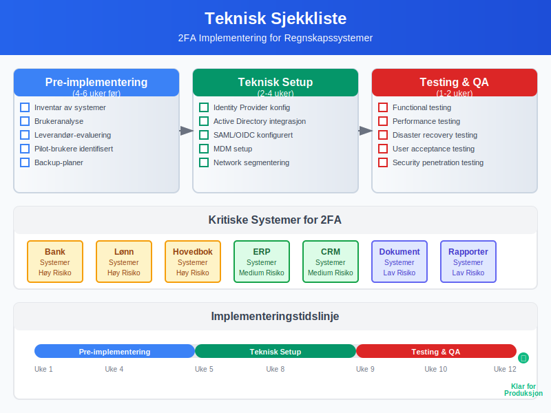

### 11.2 Organisatorisk Sjekkliste

#### Policy og prosedyre-dokumentasjon:
- [ ] **Informasjonssikkerhetspolicy** oppdatert med 2FA-krav
- [ ] **Brukerinstruksjoner** for hver 2FA-metode
- [ ] **Incident response** prosedyrer for 2FA-feil
- [ ] **Onboarding/offboarding** prosesser justert
- [ ] **Compliance-dokumentasjon** for revisorer

#### Opplæring og awareness:
- [ ] **Opplæringsmateriell** utviklet og testet
- [ ] **Workshops** planlagt og gjennomført
- [ ] **Champions** identifisert og trent
- [ ] **Support-kanaler** etablert og bemannet
- [ ] **FAQ** og self-service ressurser opprettet

#### Prosjektledelse:
- [ ] **Milepælsplan** med målbare leveranser
- [ ] **Risiko og issue tracking** system på plass
- [ ] **Stakeholder kommunikasjon** plan aktivert
- [ ] **Budget tracking** og cost control etablert
- [ ] **Post-implementation review** planlagt

### 11.3 Troubleshooting og Support

**Vanlige problemer og løsninger:**

#### Tekniske utfordringer:
| **Problem** | **Symptom** | **Løsning** |
|-------------|-------------|-------------|
| TOTP time skew | "Invalid code" feilmeldinger | Synkroniser enhet-tid med NTP-server |
| SMS-forsinkelser | Koder ankommer for sent | Implementer email backup eller switch til app |
| Hardware-nøkkel ikke gjenkjent | USB-enhet ikke detektert | Driver-oppdatering og browser-kompatibilitet |
| Nettverk-blokkering | 2FA-tjeneste ikke tilgjengelig | Firewall-konfigurasjon og proxy-setting |

#### Bruker-utfordringer:
* **Glemt enhet:** Backup codes og administrativ reset-prosedyre
* **Defekt hardware:** Replacement-nøkler og recovery-metoder
* **Reiseproblemer:** International roaming og alternative metoder
* **Teknologi-angst:** Ekstra support og forenklete instruksjoner

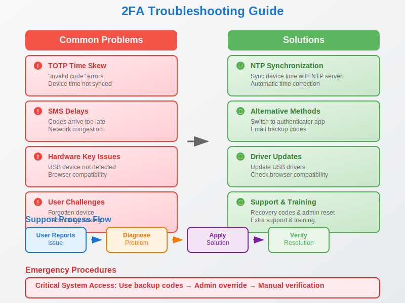

## Konklusjon

**Tofaktorautentisering** representerer en fundamental sikkerhetskontroll som ikke lenger er valgfri for moderne regnskapsvirksomheter. I en verden hvor [cybertrusler](/blogs/regnskap/hva-er-cybersikkerhet "Hva er Cybersikkerhet? Beskyttelse av Regnskapsdata og Systemer") konstant øker i sofistikering og frekvens, fungerer 2FA som en kritisk forsvarsmekanisme som beskytter både [regnskapsdataens integritet](/blogs/regnskap/hva-er-dataintegritet "Hva er Dataintegritet? Sikring av Regnskapsinformasjon") og organisasjonens omdømme.

**Nøkkelinnsikter:**

* **Regulatorisk nødvendighet:** GDPR og andre compliance-krav gjør 2FA til en praktisk obligatorisk investering
* **Økonomisk gevinst:** ROI på 166% over 3 år gjennom forhindrede sikkerhetsbrudd
* **Teknologisk modenhet:** Moderne løsninger tilbyr både høy sikkerhet og god brukeropplevelse
* **Organisatorisk transformasjon:** Vellykket implementering krever omfattende change management

**Strategiske anbefalinger:**

For regnskapsvirksomheter anbefales en **hybrid tilnærming** som kombinerer:
- **Hardware-nøkler** for kritiske brukere og systemer ([regnskapssjef](/blogs/regnskap/hva-er-regnskapssjef "Hva er Regnskapssjef? Rolle og Ansvar i Økonomisk Ledelse"), [controller](/blogs/regnskap/hva-er-controller "Hva er Controller? Økonomisk Styring og Kontroll"))
- **TOTP-apper** for standard regnskapsføre og [bokholdere](/blogs/regnskap/hva-er-bokholder "Hva er Bokholder? Rolle og Ansvar i Regnskapsføring")
- **SMS-backup** for nødssituasjoner og mobilenheter
- **Biometrisk autentisering** på personal enheter når tilgjengelig

**Fremtidsperspektiv:**

Utviklingen mot **passwordless authentication** og **zero trust architecture** vil fortsette å forme regnskapsindustriens sikkerhetstilnærming. Organisasjoner som investerer i moderne 2FA-infrastruktur nå, posisjonerer seg optimalt for fremtidens **quantum-safe** sikkerhetslandskap og **AI-drevne** trusseldeteksjon.

**Handlingsplan:**

1. **Start med risikovurdering** av eksisterende regnskapssystemer og dataflyt
2. **Implementer pilot-program** med kritiske brukere og systemer
3. **Utvikl omfattende opplæringsstrategi** for organisasjonsendring
4. **Etabler monitoring og continual improvement** prosesser
5. **Planlegg for fremtidige teknologi-oppgraderinger** og compliance-krav

Tofaktorautentisering er ikke bare en teknisk sikkerhetstiltak - det er en **strategisk investering** i regnskapsvirksomhetens langsiktige bærekraft, kundetillit og konkurranseposisjon. I en [digitalisert økonomi](/blogs/regnskap/hva-er-digitalisering "Hva er Digitalisering? Transformasjon av Regnskaps- og Økonomiprosesser") hvor datasikkerhet er synonymt med virksomhetskontinuitet, representerer robust 2FA-implementering en kritisk suksessfaktor for moderne regnskapsføring.


