---
title: "Hva er toll?"
seoTitle: "Hva er toll?"
description: '**Toll** er en avgift som ilegges varer som krysser landegrenser, primært ved import til Norge. Toll er et sentralt element i internasjonal handel og påvirker...'
---

**Toll** er en avgift som ilegges varer som krysser landegrenser, primært ved import til Norge. Toll er et sentralt element i internasjonal handel og påvirker både [regnskapsføring](/blogs/regnskap/hva-er-bokforing "Hva er Bokføring? Komplett Guide til Regnskapsføring i Norge"), [merverdiavgift](/blogs/regnskap/hva-er-avgiftsplikt-mva "Hva er Avgiftsplikt (MVA)? Komplett Guide til Merverdiavgift i Norge") og bedriftens totale [anskaffelseskostnader](/blogs/regnskap/hva-er-anskaffelser "Hva er Anskaffelser? En Komplett Guide til Offentlige og Private Innkjøp"). For bedrifter som driver med import må tollkostnader behandles korrekt i regnskapet og inkluderes i [hovedboken](/blogs/regnskap/hva-er-hovedbok "Hva er Hovedbok? Grunnlaget for Regnskapsføring og Bokføring") som en del av varekostnadene.

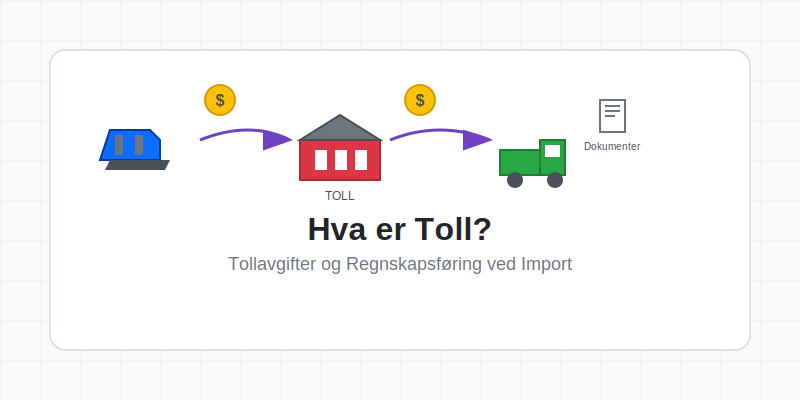

## Seksjon 1: Tollsystemets Grunnleggende Prinsipper

Tollsystemet i Norge administreres av **Tollvesenet** under Skatteetaten og følger EUs tollregelverk gjennom EØS-avtalen. Toll tjener flere formål: beskyttelse av nasjonal industri, inntektsgenerering for staten, og kontroll med vareflyten over grensene.

### Hovedtyper av Toll

Det norske tollsystemet opererer med flere kategorier av avgifter og kontroller:

* **Ordinær toll:** Prosentvis avgift basert på varens tollverdi
* **Spesifikk toll:** Fast beløp per enhet (f.eks. per kg eller liter)
* **Antidumpingtoll:** Særskilt toll for å motvirke urettferdig konkurranse
* **Utjevningstoll:** Kompensasjon for subsidier i eksportlandet

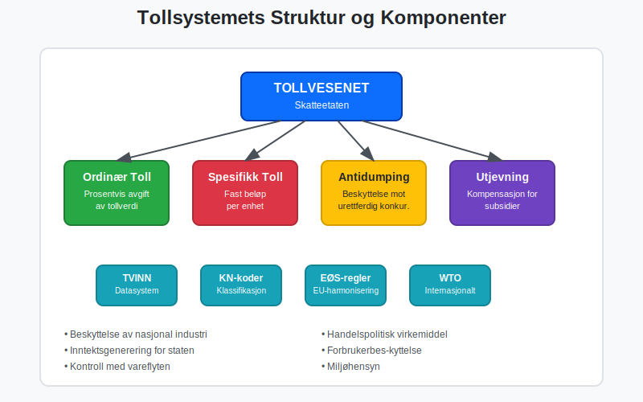

## Seksjon 2: Tollverdi og Beregningsgrunnlag

**Tollverdien** er det beløpet som toll beregnes av, og består normalt av varens **CIF-verdi** (Cost, Insurance, Freight). Dette inkluderer varens verdi, forsikring og frakt frem til norsk grense, men ekskluderer toll og MVA.

### Komponenter i Tollverdiberegning

| Komponent | Inkludert | Ekskludert |
|-----------|-----------|------------|
| Varepris | ✓ | |
| Frakt til grense | ✓ | |
| Forsikring | ✓ | |
| Toll | | ✓ |
| Import-MVA | | ✓ |
| Håndteringsgebyrer i Norge | | ✓ |

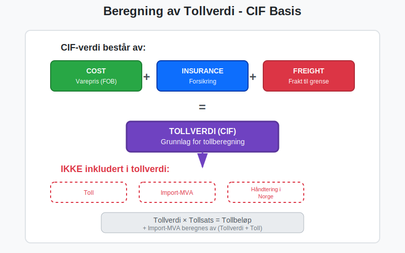

### Praktisk Eksempel på Tollberegning

```
Varepris (FOB): 100 000 NOK
Frakt: 5 000 NOK
Forsikring: 1 000 NOK
---
Tollverdi (CIF): 106 000 NOK
Tollsats: 5%
Toll: 5 300 NOK
Import-MVA grunnlag: 111 300 NOK
Import-MVA (25%): 27 825 NOK
---
Total importkostnad: 139 125 NOK
```

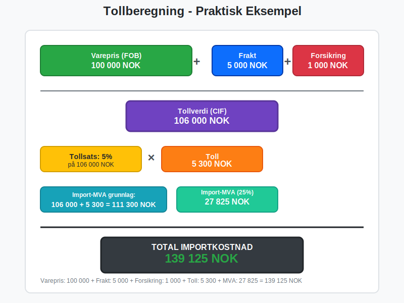

## Seksjon 3: Tollprosedyrer og Dokumentasjon

Import til Norge krever omfattende dokumentasjon og følger strenge prosedyrer. Alle importører må være registrert i **TVINN** (Tollvesenets datasystem) og følge forskriftene for [fakturabehandling](/blogs/regnskap/hva-er-en-faktura "Hva er en Faktura? En Guide til Norske Fakturakrav") ved import.

### Nødvendig Dokumentasjon for Import

* [**Tolldeklarasjon (SAD-dokument)**](/blogs/regnskap/tolldeklarasjonsoversikt "Tolldeklarasjonsoversikt: Standardisert EU-dokument for tollbehandling") “ Standardisert EU-dokument for tollbehandling
* **[Faktura](/blogs/regnskap/hva-er-en-faktura "Hva er en Faktura? En Guide til Norske Fakturakrav"):** Original salgsfaktura fra leverandør
* **Pakkseddel/Fraktseddel:** Dokumentasjon av varenes innhold
* **Opprinnelsesbevis:** Dokumenterer varens opprinnelsesland
* **Transportdokument:** Konnossement, fraktbrev eller lignende
* **Forsikringsdokument:** Ved CIF-kontrakter

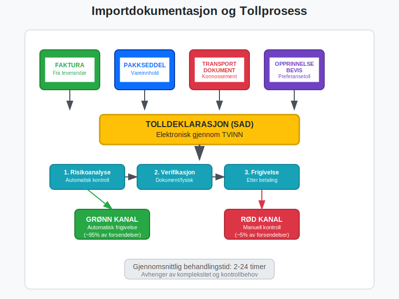

### Elektronisk Tollbehandling

Moderne tollbehandling skjer hovedsakelig elektronisk gjennom:

* **TVINN:** Tollvesenets datasystem for deklarasjoner
* **Automatisk frigivelse:** For lavrisikoforsendelser
* **Forkontrollering:** Elektronisk kontroll før varenes ankomst
* **Digital signatur:** For validering av tolldeklarasjoner

## Seksjon 4: Regnskapsføring av Toll og Importkostnader

Korrekt regnskapsføring av toll er kritisk for nøyaktig [kostnadsføring](/blogs/regnskap/hva-er-personalkostnad "Hva er Personalkostnad? Komplett Guide til Lønnskostnader og Regnskapsføring") og **varelagerverdsettelse**. Toll skal normalt [aktiveres](/blogs/regnskap/hva-er-aktivering "Hva er Aktivering i Regnskap?") som en del av varens [anskaffelseskostnad](/blogs/regnskap/hva-er-anskaffelser "Hva er Anskaffelser? En Komplett Guide til Offentlige og Private Innkjøp").

### Bokføringsregler for Toll

```
Bokføringseksempel - Import av varer:

DEBET:
Varelager (1410): 139 125 NOK
  - Varepris: 100 000 NOK
  - Frakt: 5 000 NOK  
  - Forsikring: 1 000 NOK
  - Toll: 5 300 NOK
  - Import-MVA: 27 825 NOK

KREDIT:
Leverandørgjeld (2410): 106 000 NOK
Skyldig toll (2630): 33 125 NOK
```

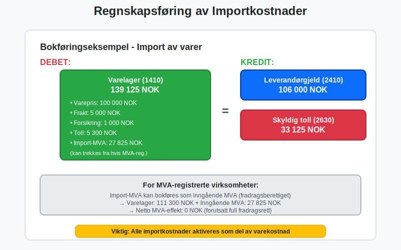

### MVA-behandling ved Import

Import-MVA behandles forskjellig fra ordinær MVA og krever spesiell oppmerksomhet:

* **Import-MVA** skal betales til Tollvesenet ved innførsel
* **Inngående MVA** kan trekkes fra på vanlig måte (hvis registrert i Merverdiavgiftsregisteret)
* **Netto effekt:** MVA-registrerte virksomheter får normalt full kompensasjon
* **Likviditetseffekt:** Midlertidig belastning på kontantstrømmen

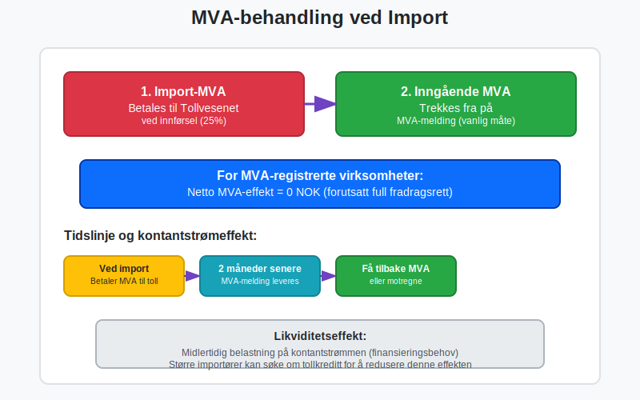

## Seksjon 5: Tollsatser og Tariffklassifikasjon

Alle varer som importeres må klassifiseres i henhold til **Kombinert Nomenklatur (KN)**, som bestemmer tollsatsen. Dette er et komplekst system med over 10 000 ulike vareklassifikasjoner.

### Viktige Tollsatskategorier

| Varegruppe | Typisk Tollsats | Særlige Forhold |
|------------|-----------------|-----------------|
| Landbruksprodukter | 0-40% | Ofte høye satser |
| Industrivarer | 0-12% | Gjennomsnittlig 4% |
| Tekstiler | 8-12% | Varierer med produksjonsland |
| Elektronikk | 0-4% | Ofte preferansetoll |
| Kjøretøy | 8-15% | Særregler for elbiler |

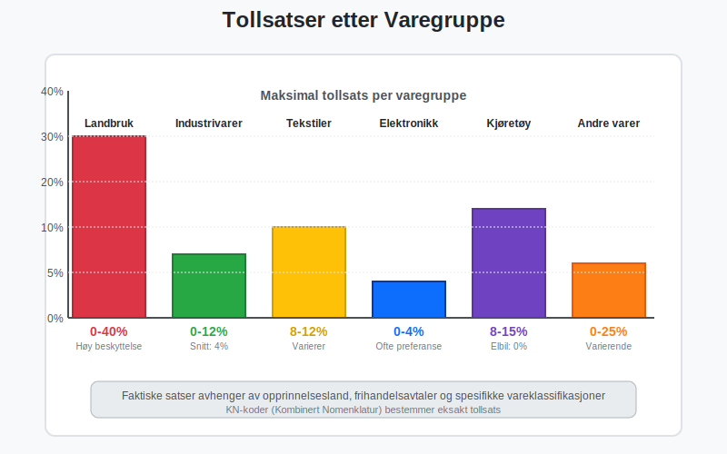

### Preferansetoll og Frihandelsavtaler

Norge har inngått mange **frihandelsavtaler** som gir redusert eller eliminert toll:

* **EU/EØS-land:** Tollfri handel for de fleste varer
* **EFTA-land:** Omfattende tollen fritak
* **Bilaterale avtaler:** Med land som Canada, Chile, Egypt
* **GSP-ordningen:** Preferansetoll for utviklingsland

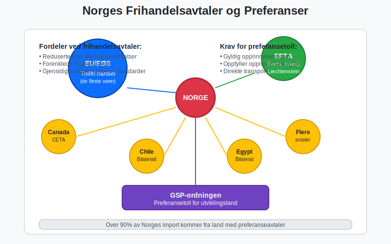

## Seksjon 6: Særlige Tollprosedyrer

For virksomheter med omfattende importaktivitet finnes det spesielle ordninger som kan redusere administrative kostnader og forbedre kontantstrømmen.

### Tollkreditt og Periodisk Oppgjør

**Tollkreditt** lar bedrifter få utlevert varer før toll og MVA er betalt:

* **Sikkerhetsstillelse:** Bankgaranti eller deposium kreves
* **Periodisk oppgjør:** Månedlig betaling av akkumulert toll
* **Forbedret likviditet:** Reduserer finansieringsbehov
* **Effektivisering:** Raskere vareflyt og reduserte lagerkostnader

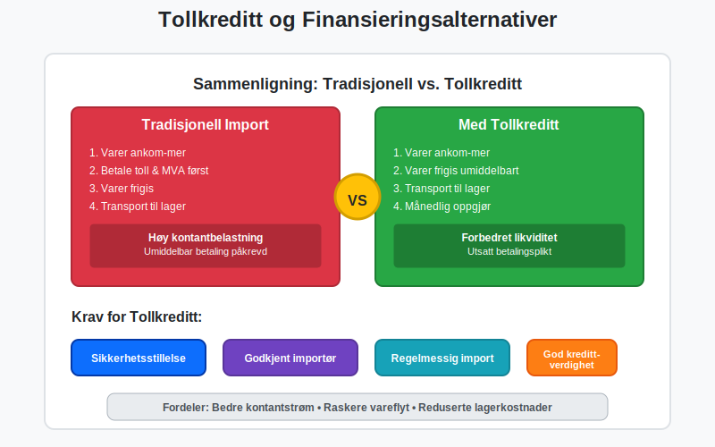

### Tollager og Frilager

**Tollager** er godkjente lagerlokaler hvor importerte varer kan lagres uten at toll og MVA er betalt:

* **Utsatt tollbehandling:** Toll betales først ved uttrekk til forbruk
* **Videreforedling:** Mulighet for bearbeiding under tollageret
* **Reeksport:** Toll-og MVA-fri utførsel til tredjeland
* **Kontantstrømfordeler:** Betydelig reduksjon i arbeidskapitalbehov

### Midlertidig Innførsel

For varer som skal gjenbrukes etter en periode i Norge:

* **Messutstyr:** Automatisk fritak i 6 måneder
* **Yrkesverktøy:** For håndverkere og teknikere
* **Vareprøver:** Fritak med ATA Carnet
* **Transportmidler:** Midlertidig bruk av utenlandske kjøretøy

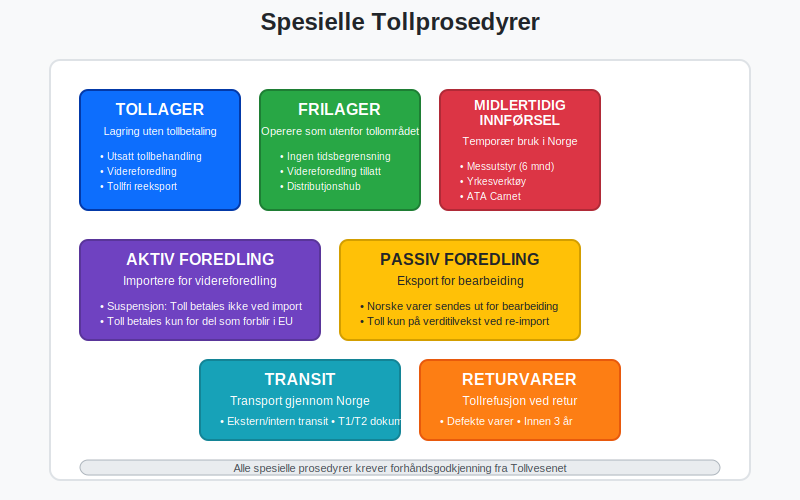

## Seksjon 7: Tollvesenets Kontroll og Revisjonsaktivitet

Tollvesenet utfører omfattende kontrollaktiviteter for å sikre regelinnsettelse og korrekt beregning av toll og avgifter.

### Typer Tollkontroll

* **Risikoverbasert kontroll:** Automatisert risikoanalyse
* **Dokumentkontroll:** Verifikasjon av papirer og deklarasjoner
* **Fysisk kontroll:** Inspeksjon av varer og containere
* **Etterkontroll:** Revisjon av bedriftens tollregnskaper

### Konsekvenser ved Feil i Tollbehandling

Feil i tolldeklarasjoner kan få alvorlige konsekvenser:

* **Etterberegning av toll:** Med renter og gebyrer
* **[Overtredelsesgebyr](/blogs/regnskap/hva-er-purring-og-purregebyr "Hva er Purring og Purregebyr? Guide til Norske Regler og Regnskapsføring"):** Basert på feilens art og omfang
* **Straff:** Bøter eller fengselsstraff ved grove overtredelser
* **Tap av tollfordeler:** Midlertidig eller permanent
* **Omdømmerisiko:** Negative konsekvenser for bedriftens rykte

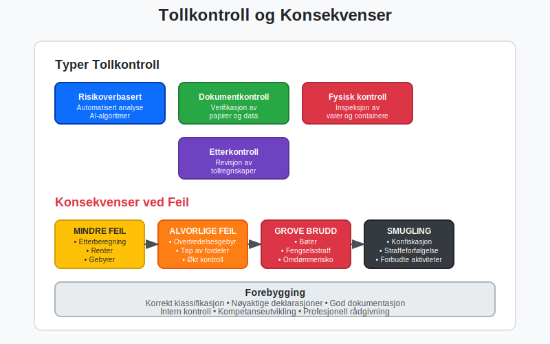

## Seksjon 8: Digital Transformasjon av Tollsektoren

Tollsektoren gjennomgår en omfattende digitalisering som påvirker alle aspekter av tollbehandlingen.

### Nye Digitale Verktøy

* **AI-basert risikoanalyse:** Automatisk identifikasjon av høyrisikoforsendelser
* **Blockchain-teknologi:** Sikker dokumentdeling og sporbarhet
* **IoT-sensorer:** Automatisk overvåkning av containere og lager
* **Digital tvilling:** Virtuelle modeller av tollprosesser

### Automatisering og Selvbetjening

Moderne tollbehandling beveger seg mot **full automatisering**:

* **Robotisert prosessautomatisering (RPA):** Automatisk behandling av standarddeklarasjoner
* **Intelligente assistenter:** Chatbots for veiledning og støtte
* **Selvbetjeningsportaler:** Bedrifter kan selv oppdatere registreringer
* **Sanntidsrapportering:** Kontinuerlig overvåkning av tollactivity

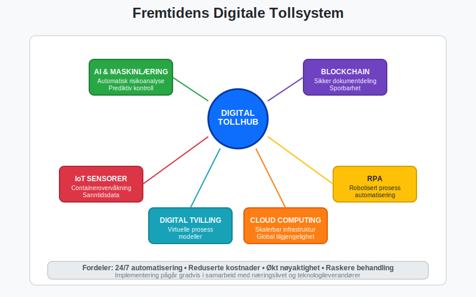

## Seksjon 9: Internasjonale Aspekter og Harmonisering

Tollsystemet påvirkes sterkt av internasjonale avtaler og standarder.

### WTO og Tollunion

* **Verdenshandelsorganisasjonen (WTO):** Fastlegger grunnregler for internasjonal handel
* **Tollunioner:** Som EU-EØS skaper felles tollområder
* **Mest favorisert nasjon:** Prinsipp om lik behandling
* **Handelshemmer:** Toll som virkemiddel i handelspolitikk

### Brexit og Handelskonsekvenser

**Brexit** har skapt nye utfordringer for norsk-britisk handel:

* **Nye tollprosedyrer:** Handel med Storbritannia er nå tredjelandshandel
* **Opprinnelsesregler:** Komplekse krav for å kvalifisere for preferansetoll
* **Økte kostnader:** Toll og administrative byrder
* **Usikkerhet:** Fortsatt utvikling av bilaterale handelsavtaler

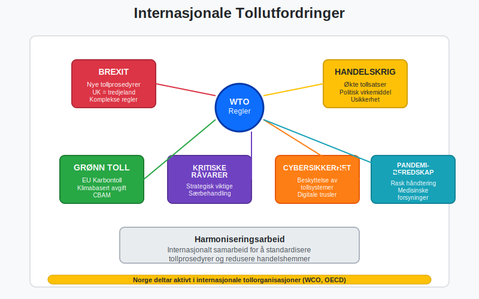

## Seksjon 10: Beste Praksis for Tollhåndtering

Effektiv tollhåndtering krever systematisk tilnærming og god planlegging.

### Organisering av Tollfunksjonene

* **Sentralisert tollansvar:** Samle ekspertise i dedikert avdeling
* **Integrerte systemløsninger:** Koble toll med [ERP-systemer](/blogs/regnskap/hva-er-erp-system "Hva er ERP-system? Komplett Guide til Enterprise Resource Planning")
* **Kompetanseutvikling:** Kontinuerlig opplæring av personale
* **Leverandørnettverk:** Samarbeid med tollspekulanter og spedittører

### Risikostyring og Compliance

* **Intern tollrevisjon:** Regelmessig gjennomgang av prosedyrer
* **Dokumentasjonssystemer:** Systematisk arkivering av tollpapirer
* **Kontrollrutiner:** Kvalitetssikring av deklarasjoner
* **Beredskapsplaner:** Håndtering av tollproblemer og forsinkelser

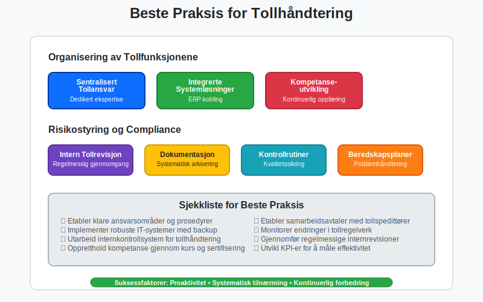

### KPI-er for Tolloperasjoner

Viktige nøkkeltall for å måle effektiviteten i tolloperasjonene:

* **Gjennomsnittlig tollbehandlingstid:** Fra ankomst til frigivelse
* **Feilrate i deklarasjoner:** Andel som krever korreksjon
* **Kostnad per tolldeklarasjon:** Total cost of ownership
* **Lagringsperiode:** Tid varer ligger på toll-/transitlager
* **Kontrollrate:** Andel forsendelser som blir fysisk kontrollert

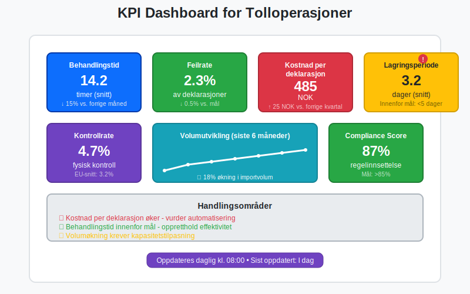

## Seksjon 11: Fremtidige Trender og Utviklingstrekk

Tollsektoren står overfor betydelige endringer drevet av teknologi, miljøhensyn og geopolitiske utviklinger.

### Grønn Toll og Bærekraft

* **Karbontoll:** EU planlegger toll basert på klimautslipp
* **Miljømerking:** Preferanser for miljøvennlige produkter
* **Sirkulærøkonomi:** Nye regler for gjenbruk og resirkulering
* **Sporbarhet:** Krav til dokumentasjon av hele verdikjeden

### Geopolitiske Utfordringer

* **Handelskrig:** Økte tollsatser som politisk virkemiddel
* **Kritiske råvarer:** Særbehandling av strategisk viktige varer
* **Cybersikkerhet:** Beskyttelse av tollsystemer mot angrep
* **Pandemiberedskap:** Rask håndtering av medisinske forsyninger

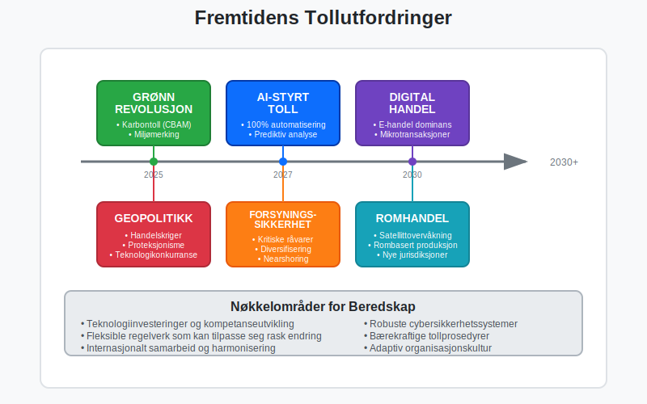

## Konklusjon

Toll er en kompleks, men kritisk komponent i internasjonal handel som krever grundig forståelse av regelverket, korrekt regnskapsbehandling og systematisk operasjonell håndtering. For bedrifter som driver med import er effektiv tollhåndtering ikke bare en kostnadspost, men en strategisk kompetanse som kan bidra til konkurransefordeler gjennom optimaliserte leverandørkjeder og reduserte totalkostnader.

Den digitale transformasjonen av tollsektoren, kombinert med endrete geopolitiske forhold og økte krav til bærekraft, skaper både utfordringer og muligheter. Bedrifter som investerer i moderne tollsystemer og -kompetanse vil være best posisjonert for å navigere i det stadig mer komplekse landskapet av internasjonal handel.

For å sikre korrekt regnskapsføring av toll og importkostnader, bør bedrifter implementere robuste systemer for [bilagsmottak](/blogs/regnskap/hva-er-bilagsmottak "Bilagsmottak - Komplett Guide til Dokumentmottak og Fakturabehandling") og [attestering](/blogs/regnskap/hva-er-attestering "Hva er Attestering? En Komplett Guide til Bilagsbehandling og Godkjenning") som sikrer at alle tollkostnader fanges opp og bokføres korrekt i samsvar med god regnskapsskikk.


