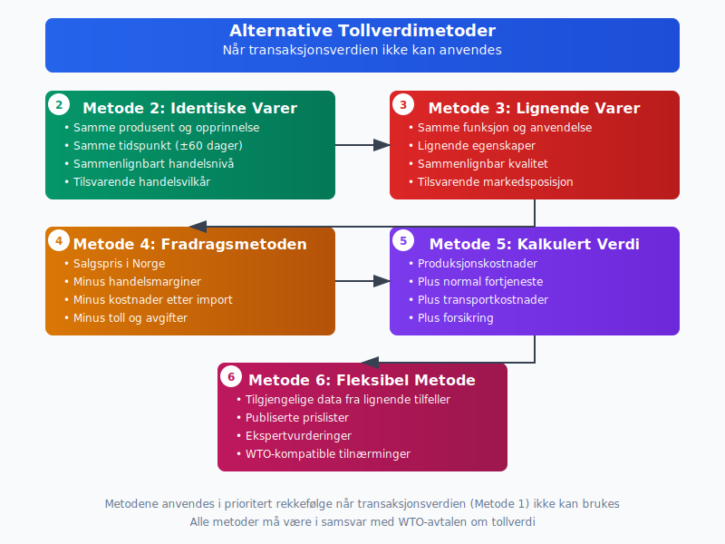

**Tollverdi** er det grunnbeløpet som [toll](/blogs/regnskap/hva-er-toll "Hva er Toll? Komplett Guide til Tollavgifter og Regnskapsføring") beregnes av når varer importeres til Norge. Tollverdien er en kritisk komponent i [regnskapsføring](/blogs/regnskap/hva-er-bokforing "Hva er Bokføring? Komplett Guide til Regnskapsføring i Norge") av importkostnader og påvirker direkte bedriftens [anskaffelseskostnader](/blogs/regnskap/hva-er-anskaffelser "Hva er Anskaffelser? En Komplett Guide til Offentlige og Private Innkjøp") og [lagerverdier](/blogs/regnskap/hva-er-lagerbeholdning "Hva er Lagerbeholdning? Guide til Lagerverdsettelse og Regnskapsføring"). For bedrifter som driver med import er korrekt beregning av tollverdi avgjørende for nøyaktig kostnadskalkyle og overholdelse av tollregelverket.


## Seksjon 1: Tollverdi-begrepets Grunnlag

**Tollverdien** defineres i Norge gjennom EUs tollregelverk som implementert i norsk rett. Den representerer den økonomiske verdien av importerte varer som danner grunnlag for beregning av [toll](/blogs/regnskap/hva-er-toll "Hva er Toll? Komplett Guide til Tollavgifter og Regnskapsføring") og [import-MVA](/blogs/regnskap/hva-er-avgiftsplikt-mva "Hva er Avgiftsplikt (MVA)? Komplett Guide til Merverdiavgift i Norge").

### Grunnleggende Prinsipper for Tollverdi

Tollverdien skal reflektere:

* **Faktisk betalt eller betalbar pris** for varene
* **Transaksjonsverdien** ved armslengdes handel
* **CIF-verdi** (Cost, Insurance, Freight) til norsk grense
* **Tilleggskostnader** som påvirker varenes verdi


### Internasjonale Rammer for Tollverdi

Tollverdiberegning følger **WTO-avtalen om tollverdi** som sikrer:

* **Ensartet anvendelse** på tvers av land
* **Transparent vurdering** av varehandel
* **Rettferdig behandling** av importører
* **Forutsigbarhet** i tollberegninger

## Seksjon 2: Metoder for Tollverdiberegning

Tollregelverket opererer med **seks forskjellige metoder** for å fastsette tollverdi, rangert etter prioritet.

### Metode 1: Transaksjonsverdien

**Transaksjonsverdien** er hovedregelen og brukes når:

* Det foreligger reell salgshandel
* Kjøper og selger er uavhengige parter
* Prisen er faktisk betalt eller betalbar
* Ingen uakseptable forhold påvirker prisen

| Inkluderte Elementer | Ekskluderte Elementer |
|----------------------|----------------------|
| Varepris (FOB) | Toll og avgifter |
| Frakt til grense | Behandling etter import |
| Forsikring | Gebyrer i Norge |
| Emballasje | Renter på kreditt |
| Royalties | Salgskommisjon |


### Metode 2: Identiske Varer

Når transaksjonsverdien ikke kan anvendes, brukes tollverdien for **identiske varer** importert under sammenlignbare forhold:

* **Samme produsent** og opprinnelsesland
* **Samme tidspunkt** for import (±60 dager)
* **Sammenlignbart handelsnivå** og kvantum
* **Tilsvarende handelsvilkår**

### Metode 3: Lignende Varer

Hvis identiske varer ikke finnes, anvendes verdien av **lignende varer**:

* **Samme funksjon** og anvendelsesområde
* **Lignende egenskaper** og materialer
* **Sammenlignbar kvalitet** og omdømme
* **Tilsvarende markedsposisjon**



### Metode 4: Fradragsmetoden

Basert på **salgspris i Norge** med fradrag for:

* **Handelsmarginer** og fortjeneste
* **Kostnader etter import** (transport, håndtering)
* **Toll og avgifter** betalt ved import
* **Verdiøkning** etter import

### Metode 5: Kalkulert Verdi

Bygger på **produksjonskostnader** pluss:

* **Materialekostnader** og produksjonsutgifter
* **Normale fortjeneste** og salgsomkostninger
* **Transportkostnader** til norsk grense
* **Forsikring** og lastehåndtering

### Metode 6: Fleksibel Metode

Anvendes når ingen andre metoder er praktisk mulige:

* **Tilgjengelige data** fra lignende tilfeller
* **Publiserte prislister** og markedspriser
* **Ekspertvurderinger** og bransjekunnskap
* **WTO-kompatible** tilnærminger


## Seksjon 3: Praktisk Beregning av Tollverdi

Korrekt beregning av tollverdi krever systematisk gjennomgang av alle kostnadskomponenter og deres påvirkning på den endelige verdien.

### CIF-verdiens Komponenter

**CIF-verdien** (Cost, Insurance, Freight) utgjør normalt tollverdigrunnlaget:

```
Eksempel: Import av maskiner fra Tyskland

Varepris (FOB Hamburg): 500 000 NOK
Transport til Oslo: 25 000 NOK
Forsikring: 5 000 NOK
Lastehåndtering: 3 000 NOK
---
Tollverdi (CIF): 533 000 NOK
```


### Tilleggselementer i Tollverdi

Visse kostnader skal **inkluderes** i tollverdien selv om de ikke er del av CIF-prisen:

* **Royalties og lisensavgifter** relatert til varene
* **Verktøy og former** levert gratis til produsent
* **Materialer levert gratis** til produksjon
* **Ingeniørtjenester** og designkostnader
* **Provisjoner** (unntatt kjøpers kommisjon)

### Kostnader som Ekskluderes

Følgende skal **ikke** inkluderes i tollverdi:

* **Renter** på handelskreditt
* **Kostnader etter import** (transport, montering)
* **Kjøpers kommisjon**
* **Rabatter** gitt etter import
* **Valutakursgevinster/-tap**


### Valutaomregning og Kursfastsettelse

Tollverdi i utenlandsk valuta omregnes til norske kroner:

* **Kursdato:** Avgangsdato fra avsendelsesland
* **Kurskilde:** Norges Banks offisielle kurser
* **Avrunding:** Til nærmeste hele krone
* **Dokumentasjon:** Kursbevis ved store transaksjoner

## Seksjon 4: Spesielle Tollverdisituasjoner

Enkelte handelsforhold krever særskilt oppmerksomhet ved fastsettelse av tollverdi.

### Konserninternt Salg

Ved **konserninternt salg** må tollverdien justeres hvis prisen avviker fra markedspris:

* **Armslengdes prinsipp** skal anvendes
* **Sammenligning** med eksterne transaksjoner
* **Kostpluss-metode** som alternativ
* **Dokumentasjon** av prisfastsettelse


### Leasingavtaler og Leie

For **leasede varer** beregnes tollverdi basert på:

* **Total leasingsum** over avtaleperioden
* **Markedsverdi** ved avtaleinngåelse
* **Kjøpsopsjonens verdi** hvis aktuell
* **Restverdi** ved avtaleendens

### Returvarer og Reklamasjoner

**Returvarer** som reimporteres:

* **Opprinnelig tollverdi** som utgangspunkt
* **Fradrag** for verdiforringelse
* **Tillegg** for forbedringer
* **Dokumentasjon** av endringer


### Deler og Tilbehør

Når varer importeres med **tilbehør** eller **reservedeler**:

* **Samlet tollverdi** når solgt sammen
* **Separat verdsettelse** ved forskjellig opprinelse
* **Proporsjonale fordeling** av felles kostnader
* **Tekniske spesifikasjoner** påvirker klassifikasjon

## Seksjon 5: Dokumentasjon og Kontroll av Tollverdi

Korrekt dokumentasjon av tollverdi er essensielt for å overholde regelverket og forsvare verdifastsettelsen overfor Tollvesenet.

### Nødvendig Dokumentasjon

**Primære dokumenter** for tollverdiberegning:

* **Salgsfaktura** med komplett prisspecifikasjon
* **Kjøpekontrakt** med vilkår og betingelser
* **Fraktdokumenter** med kostnadsspecifikasjon
* **Forsikringsdokumenter** og kostnadsberegning
* **Kreditnotaer** og justeringsdokumenter


### Tilleggsdokumentasjon

**Støttedokumenter** for komplekse tilfeller:

* **Royalty-avtaler** og beregningsgrunnlag
* **Verdikjede-analyser** for konserninternt salg
* **Markedsanalyser** og prissammenligninger
* **Tekniske spesifikasjoner** og kvalitetssertifikater
* **Valutakursberegninger** og bevis

### Elektronisk Dokumenthåndtering

Moderne tollbehandling setter krav til **digital dokumentasjon**:

* **Strukturerte data** i TVINN-systemet
* **Elektroniske vedlegg** til tolldeklarasjoner
* **Digitale signaturer** for validering
* **Backup-systemer** for dokumentbevaring

## Seksjon 6: Regnskapsføring av Tollverdi og Importkostnader

Tollverdien danner grunnlag for regnskapsføring av importkostnader og må behandles korrekt i samsvar med [god regnskapsskikk](/blogs/regnskap/god-regnskapsskikk "God Regnskapsskikk - Prinsipper og Praksis for Norsk Regnskapsføring").

### Aktivering av Tollverdi

Tollverdien skal normalt **aktiveres** som del av varekostnaden:

```
Bokføringseksempel - Maskinimport:

DEBET:
Maskiner (1650): 633 000 NOK
  - Tollverdi: 533 000 NOK
  - Toll (5%): 26 650 NOK
  - Import-MVA (25%): 73 350 NOK

KREDIT:
Leverandørgjeld (2410): 533 000 NOK
Skyldig toll/MVA (2630): 100 000 NOK
```


### Periodisering og Tidsavgrensning

Ved **månedsvis regnskapsavslutning** må tollverdi periodiseres korrekt:

* **Varer i transit:** Aktiveres når risiko overføres
* **Tollagervarer:** Aktiveres ved uttrekk til forbruk
* **Forskuddsbetalinger:** Behandles som forskuddspost
* **Valutakursendringer:** Håndteres frem til risikotidspunkt

### Revisjon og Kontroll

**Internkontroll** av tollverdiberegning bør omfatte:

* **Systematisk gjennomgang** av importdokumenter
* **Stikkprøvekontroller** av verdiberegninger
* **Avstemming** mot toll- og MVA-oppgjør
* **Kompetanseutvikling** for relevante medarbeidere

## Seksjon 7: Tollvesenets Kontroll og Verifikasjon

Tollvesenet utfører systematisk kontroll av oppgitt tollverdi for å sikre korrekt avgiftsberegning.

### Risikobasert Kontroll

**Automatiserte systemer** identifiserer risikofaktorer:

* **Prisavvik** fra historiske data
* **Uvanlige handelsmønstre** eller ruter
* **Komplekse konsernstrukturer**
* **Høyrisiko-land** og leverandører


### Verifikasjonsprosedyrer

**Metodisk gjennomgang** av tollverdi omfatter:

* **Dokumentanalyse** og krysskjekking
* **Sammenligning** med sammenlignbare import
* **Kontakt** med utenlandske myndigheter
* **Eksternvalidering** av markedspriser

### Korreksjoner og Etterberegning

Ved **feil i tollverdi** kan konsekvensene være betydelige:

* **Etterberegning** av toll og MVA
* **Renter** fra forfallstidspunkt
* **Overtredelsesgebyr** basert på feilens omfang
* **Inndraging** av tollfordeler ved grove overtredelser


## Seksjon 8: Avanserte Tollverdi-konsepter

For komplekse import-operasjoner kreves dypere forståelse av spesialiserte tollverdi-emner.

### Transfer Pricing og Tollverdi

**Konsernpriser** må harmoniseres med tollverdi-krav:

* **OECD-retningslinjer** som tolkningsramme
* **Armslengdes prinsipp** i begge regelverk
* **Dokumentasjonskrav** for prisfastsettelse
* **Samtidig koordinering** av skatte- og tollposition


### Intellektuelle Rettigheter

**Royalties** og lignende betalinger krever spesiell oppmerksomhet:

* **Inkludering** når relatert til importerte varer
* **Ekskludering** av betalinger for norske rettigheter
* **Proporsjonale beregninger** ved sammensatte avtaler
* **Tidsmessig allokering** av betalinger

### Finansielle Instrumenter

**Komplekse finansieringsordninger** påvirker tollverdi:

* **Leasingavtaler** og operasjonell leie
* **Factoring** og forfaltning
* **Konsignasjon** og kommisjonssalg
* **Bytteavtaler** og naturalier


## Seksjon 9: Digitalisering og Automatisering

Moderne tollbehandling anvender avansert teknologi for mer effektiv og nøyaktig tollverdiberegning.

### Kunstig Intelligens i Tollverdi-kontroll

**AI-systemer** forbedrer kontrolleffektiviteten:

* **Mønstergjenkjenning** i handelsdata
* **Automatisk flagging** av avvikende priser
* **Prediktive modeller** for risikoverifyering
* **Maskinlæring** fra historiske kontroller


### Blockchain og Smart Contracts

**Distribuert teknologi** kan revolusjonere tollverdi-dokumentasjon:

* **Uforanderlig** dokumenthistorikk
* **Automatisk** kontraktsgjennomføring
* **Real-time** verifikasjon av handelsdokumenter
* **Redusert** risiko for dokumentforfalskning

### Integrerte Handelsplattformer

**End-to-end digitalisering** av handelsprocesser:

* **Automatisk** tollverdi-beregning
* **Integrert** dokumenthåndtering
* **Real-time** kommunikasjon med tollmyndigheter
* **Sømløs** kobling til regnskapssystemer


## Seksjon 10: Internasjonale Perspektiver

Tollverdi-reglene påvirkes av internasjonale avtaler og harmoniseringsinitiativ.

### WTO og Global Harmonisering

**Verdenshandelsorganisasjonen** driver fram:

* **Enhetlige** tollverdi-standarder
* **Transparent** regelverksutvikling
* **Tvisteløsning** mellom medlemsland
* **Teknisk assistanse** til utviklingsland

### EU og EØS-harmonisering

**Europeisk** regulering sikrer:

* **Identiske** regler i EØS-området
* **Felles** tolkningsretningslinjer
* **Koordinert** håndhevelse
* **Kontinuerlig** regelverksutvikling


### Fremvoksende Markeder

**Nye handelspartnere** skaper utfordringer:

* **Forskjellige** handelstradisjoner
* **Manglende** prisreferanser
* **Komplekse** valutaforhold
* **Politisk** risiko og ustabilitet

## Seksjon 11: Beste Praksis og Anbefalinger

Effektiv håndtering av tollverdi krever systematisk tilnærming og kontinuerlig kompetanseutvikling.

### Organisatoriske Tiltak

**Intern struktur** for tollverdi-håndtering:

* **Sentralisert ansvar** for tollverdi-vurderinger
* **Klar rollefordeling** mellom innkjøp og toll
* **Systematisk opplæring** av relevante medarbeidere
* **Dokumenterte prosedyrer** og rutiner


### Teknologiske Løsninger

**Systemstøtte** for tollverdi-prosesser:

* **Integrerte ERP-moduler** for toll og MVA
* **Automatisk** dokumentgenerering
* **Real-time** kobling til tollsystemer
* **Historisk** database for sammenligninger

### Kontinuerlig Forbedring

**Kvalitetsutvikling** gjennom:

* **Regelmessig** gjennomgang av prosedyrer
* **Benchmarking** mot beste praksis
* **Proaktiv** kommunikasjon med tollvesen
* **Investering** i kompetanse og teknologi


### Nøkkeltall og Måling

**KPIer** for tollverdi-operasjoner:

| Måleparameter | Målsetting | Målefrekvens |
|---------------|------------|--------------|
| Korrekt tollverdi første gang | >95% | Månedlig |
| Gjennomsnittlig behandlingstid | <4 timer | Ukentlig |
| Antall korreksjoner | <2% | Kvartalsvis |
| Kostnad per tolldeklarasjon | Benchmarking | Årlig |
| Medarbeidertilfredshet | >80% | Halvårlig |

## Konklusjon

Tollverdi er et komplekst, men fundamentalt element i norsk tollregulering som krever grundig forståelse av både nasjonale og internasjonale regler. Korrekt fastsettelse av tollverdi er ikke bare en juridisk forpliktelse, men også en forretningsmessig nødvendighet for nøyaktig kostnadskalkyle og [konkurransedyktig](/blogs/regnskap/hva-er-avkastning "Hva er Avkastning? Guide til Avkastningsberegning og Lønnsomhetsanalyse") prissetting.

Den digitale transformasjonen av tollsektoren skaper nye muligheter for effektivisering og kvalitetsforbedring, men krever samtidig kontinuerlig kompetanseutvikling og systemtilpasning. Bedrifter som investerer i robuste tollverdi-prosesser og teknologiske løsninger vil være bedre posisjonert for å håndtere den økende kompleksiteten i internasjonal handel.

For å sikre korrekt håndtering av tollverdi bør bedrifter implementere systematiske rutiner for [dokumenthåndtering](/blogs/regnskap/hva-er-attestering "Hva er Attestering? En Komplett Guide til Bilagsbehandling og Godkjenning"), etablere klare ansvarslinjer og investere i både teknologiske løsninger og kompetanse. Dette vil bidra til å minimere risiko for feil, redusere administrative kostnader og sikre overholdelse av alle relevante regelverk.


