En **tømmerkonto** er en spesialisert regnskapskonto som brukes innen skogbruk for å registrere og administrere inntekter fra salg av tømmer og andre skogprodukter. Denne kontoen følger særlige regler for [skattemessig](/blogs/regnskap/hva-er-skatt "Hva er Skatt? Komplett Guide til Norsk Skattesystem") behandling og [periodisering](/blogs/regnskap/hva-er-periodisering "Hva er Periodisering? Guide til Regnskapsmessig Periodisering"), og er en viktig del av [hovedboken](/blogs/regnskap/hva-er-hovedbok "Hva er Hovedbok? Grunnleggende Guide til Regnskapets Hjerte") for virksomheter i skogbrukssektoren.


## Definisjon og Grunnleggende Prinsipper

Tømmerkonto representerer en særordning i det norske skattesystemet som gir skogeiere mulighet til å **utjevne inntektene** fra skogsdrift over tid. Kontoen fungerer som et mellomledd mellom salg av tømmer og skattlegging av gevinsten.

### Hovedkarakteristikker

* **Innskuddsmulighet**: Inntil 85% av nettoinntekten fra skogssalg
* **Rentefrihet**: Ingen renter påløper på innskudd
* **Uttaksfleksibilitet**: Kan tas ut når det passer skattemessig
* **Tidsbegrensning**: Må tas ut innen 10 år etter innskudd

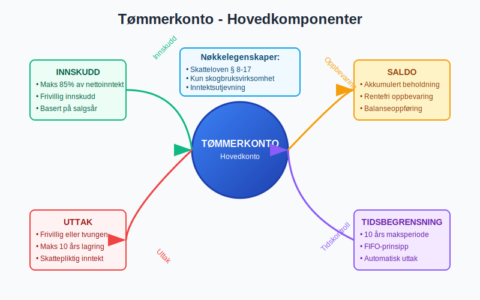

## Juridisk Rammeverk og Regulering

Tømmerkontoordningen er regulert i **skatteloven § 8-17** og tilhørende forskrifter. Ordningen ble etablert for å:

* Utjevne inntektssvingninger i skogbruk
* Kompensere for lang produksjonstid i skogsdrift
* Sikre bærekraftig skogforvaltning

### Vilkår for Bruk

| Kriterium | Krav |
|-----------|------|
| **Eierskap** | Privat skogeier eller samvirke |
| **Minimum areal** | Produktiv skogareal |
| **Driftsform** | Aktiv skogsdrift |
| **Regnskapsplikt** | Ordentlig [bokføring](/blogs/regnskap/hva-er-bokforing "Hva er Bokføring? Grunnleggende Guide til Regnskapsføring") |

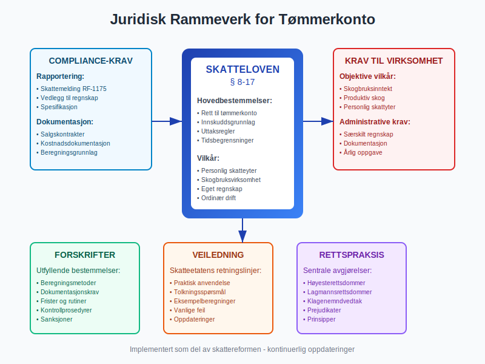

## Regnskapsføring av Tømmerkonto

### Innskudd på Tømmerkonto

Når tømmer selges og inntekt skal settes på tømmerkonto:

**Bokføringseksempel:**
```
Debet: Bank/Kundefordringer    1 000 000
Kredit: Tømmerinntekt             850 000
Kredit: Tømmerkonto              150 000
```

### Uttak fra Tømmerkonto

Ved uttak fra tømmerkonto til [skattepliktig inntekt](/blogs/regnskap/hva-er-skatt "Hva er Skatt? Komplett Guide til Norsk Skattesystem"):

**Bokføringseksempel:**
```
Debet: Tømmerkonto             150 000
Kredit: Tømmerinntekt          150 000
```

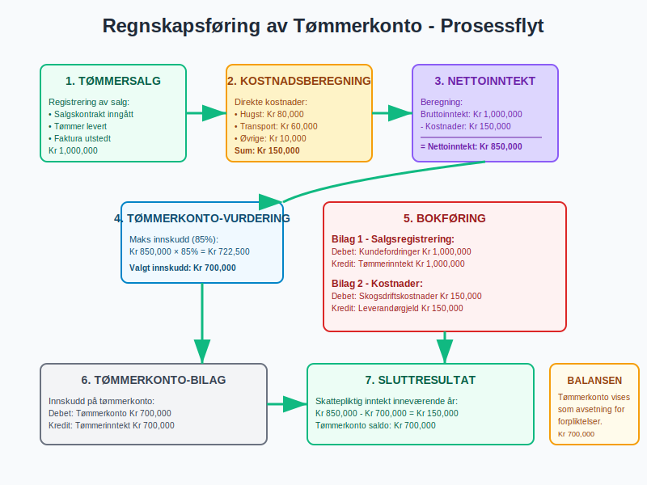

## Skattemessig Behandling

### Beregning av Innskuddsgrunnlag

Innskuddsgrunnlaget beregnes som:

**Nettoinntekt = Bruttoinntekt - Direkte kostnader**

* **Bruttoinntekt**: Salgssum for tømmer
* **Direkte kostnader**: Hugst, transport, veibygging
* **Maksimalt innskudd**: 85% av nettoinntekt

### Uttaksregler

Uttak fra tømmerkonto kan skje:

* **Frivillig**: Når skogeier ønsker det
* **Tvungen**: Etter 10 år fra innskuddstidspunkt
* **Delvis**: Gradvis uttak over flere år

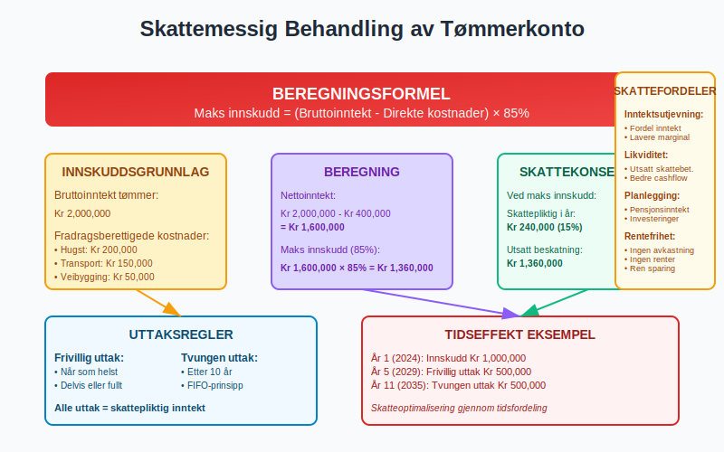

## Praktiske Anvendelsesområder

### Inntektsutjevning

Tømmerkontoordningen er særlig nyttig for:

* **Store avvirkninger**: Når hele bestand hugges
* **Markedssvingninger**: Ved høye tømmerpriser
* **Pensjonssparing**: Gradvis uttak ved pensjonering
* **Investeringsfinansiering**: Finansiering av skogstiltak

### Strategisk Planlegging

Skogeiere kan bruke tømmerkonto til:

* Optimalisere [skatteplanlegging](/blogs/regnskap/hva-er-skatt "Hva er Skatt? Komplett Guide til Norsk Skattesystem")
* Finansiere nye investeringer
* Sikre stabil inntekt over tid
* Redusere skattebelastning i toppinntektsår

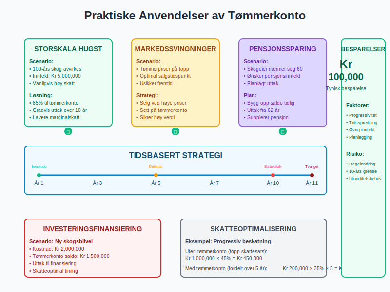

## Beregningseksempel

### Scenario: Storskala Tømmersalg

**Grunnlagsdata:**
* Salgssum tømmer: 2 000 000 kr
* Hugstskostnader: 300 000 kr
* Transportkostnader: 200 000 kr
* Øvrige kostnader: 100 000 kr

**Beregning:**
```
Nettoinntekt = 2 000 000 - (300 000 + 200 000 + 100 000)
Nettoinntekt = 1 400 000 kr

Maksimalt innskudd = 1 400 000 × 85% = 1 190 000 kr
Minimum skattepliktig = 1 400 000 × 15% = 210 000 kr
```

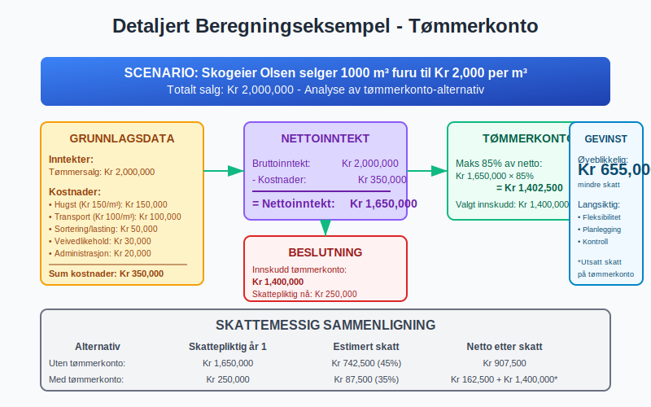

## Administrasjon og Oppfølging

### Dokumentasjonskrav

For tømmerkonto kreves:

* **Salgsdokumentasjon**: Kontrakter og fakturaer
* **Kostnadsdokumentasjon**: Bilag for alle fradrag
* **Årlig oppgave**: Spesifikasjon til skattemeldingen
* **Saldooppfølging**: Oversikt over innskudd og uttak

### Regnskapsmessig Oppfølging

Tømmerkonto skal behandles som:

* **Balansekonto**: Vises i [balansen](/blogs/regnskap/hva-er-balanse "Hva er Balanse? Guide til Regnskapets Balanse") som avsetning
* **Ikke eiendel**: Ikke tilgjengjelig for kreditorer
* **Spesialformål**: Kun til skattemessig utjevning

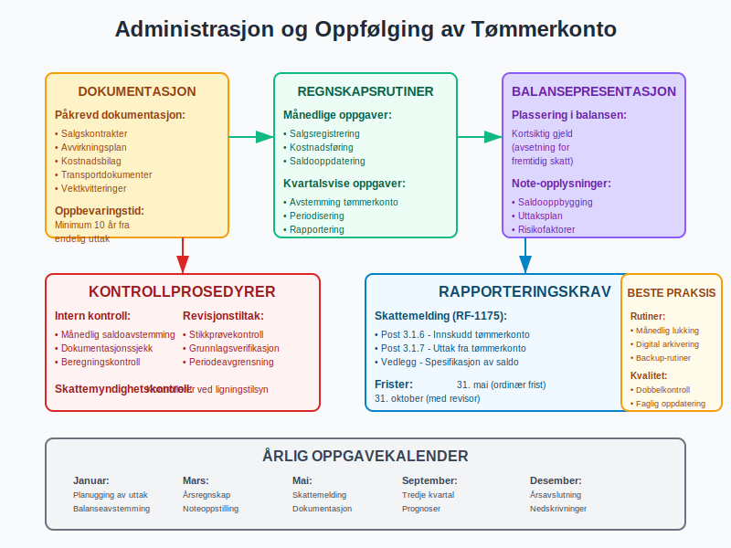

## Digitale Løsninger og Verktøy

### Moderne Skogbruksregnskap

Dagens digitale verktøy for tømmerkonto inkluderer:

* **ERP-systemer** tilpasset skogbruk
* **Automatisk beregning** av innskuddsgrunnlag
* **Integrert [rapportering](/blogs/regnskap/hva-er-kvartalsrapport "Hva er Kvartalsrapport? Guide til Kvartalsvis Regnskapsrapportering")**
* **Skatteplanleggingsverktøy**

### Integrasjon med Eksisterende Systemer

Tømmerkonto kan integreres med:

* Ordinære regnskapssystemer
* Skogbruksspesifikke systemer
* Skatteplanleggingsverktøy
* Rapporteringssystemer

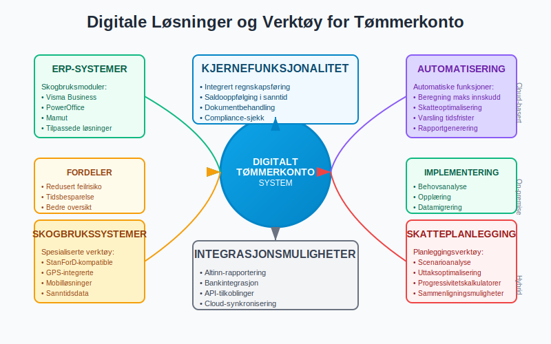

## Sammenligning med Andre Spare- og Utjevningsordninger

### Andre Regnskapsbaserte Ordninger

| Ordning | Formål | Bransje | Tidsbegrensning |
|---------|--------|---------|-----------------|
| **Tømmerkonto** | Inntektsutjevning | Skogbruk | 10 år |
| **Opptjeningskonto** | Fiskere | Fiskeri | 10 år |
| **Avsetning** | Generell | Alle | Varierer |
| **Investeringsfond** | Investering | Alle | 8 år |

### Fordeler vs. Ulemper

**Fordeler:**
* Rentefri sparing
* Fleksible uttaksmuligheter
* Skattemessig optimalisering
* Stabil økonomisk planlegging

**Ulemper:**
* Tidsbegrenset ordning
* Kun for skogbruk
* Krever god administrasjon
* Begrenset innskuddsramme

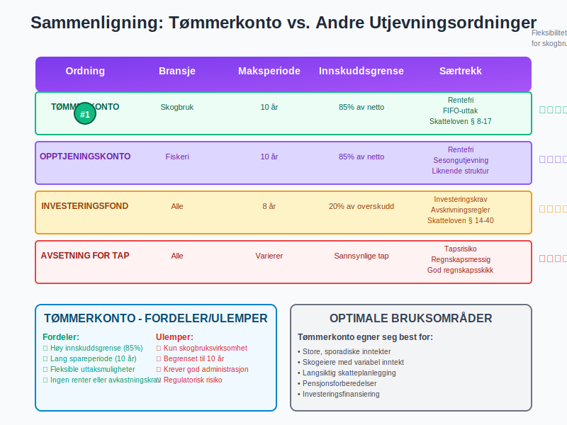

## Risikofaktorer og Utfordringer

### Økonomiske Risikofaktorer

* **Markedsrisiko**: Endringer i tømmerpriser
* **Regulatorisk risiko**: Endringer i skatteloven
* **Likviditetsrisiko**: Midler bundet i 10 år
* **Inflasjonrisiko**: Verdifall over tid

### Operasjonelle Utfordringer

* **Kompleks administrasjon**: Krever fagkunnskap
* **Dokumentasjonskrav**: Omfattende bokføring
* **Tidsfrister**: Må overholdes nøye
* **Skattemessig optimalisering**: Krever planlegging

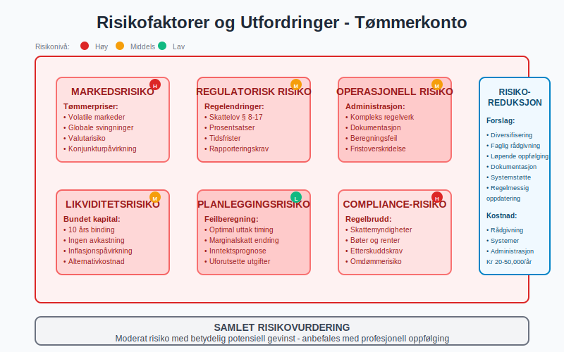

## Fremtidige Utviklingstrekk

### Modernisering av Skogbruksregnskap

Fremtidens tømmerkonto vil preges av:

* **Automatisering**: AI-baserte beregninger
* **Sanntidsrapportering**: Kontinuerlig oppfølging
* **Bærekraftsmål**: Integrert ESG-rapportering
* **Digitalisering**: Papirløse prosesser

### Regulatoriske Endringer

Potensielle endringer inkluderer:

* **Utvidede tidsrammer**: Lengre spareperioder
* **Økte innskuddsrammer**: Høyere prosentandeler
* **Nye målgrupper**: Utvidelse til andre grupper
* **Internasjonalisering**: EU-tilpasning

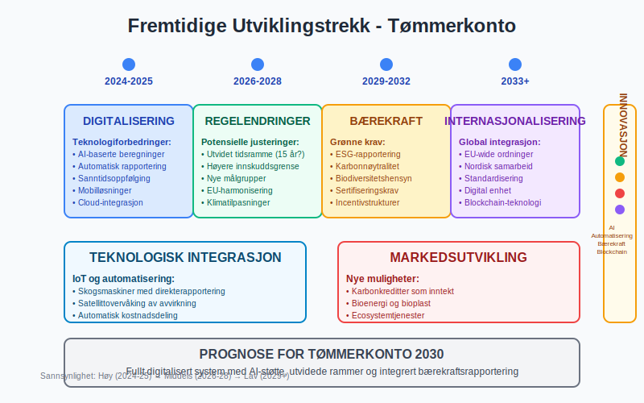

## Beste Praksis for Implementering

### Planleggingsfase

**Trinn 1: Vurdering**
* Analyser skogbruksaktivitet
* Vurder inntektspotensial
* Planlegg skattemessig strategi

**Trinn 2: Etablering**
* Sett opp regnskapssystem
* Etabler dokumentasjonsrutiner
* Utarbeid uttaksstrategi

### Operasjonell Fase

**Løpende oppgaver:**
* Månedlig [avstemming](/blogs/regnskap/hva-er-avstemming "Hva er Avstemming? Guide til Regnskapsmessig Avstemming")
* Kvartalsvis vurdering
* Årlig skatteplanlegging
* Strategisk uttaksplanlegging

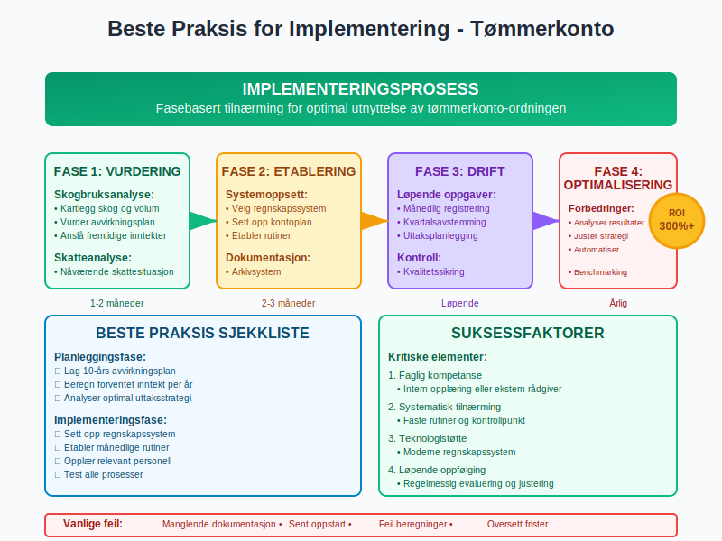

## Konklusjon

Tømmerkonto representerer en viktig mulighet for skogeiere til å **optimalisere skatteplanlegging** og sikre stabil økonomisk utvikling. Ordningen krever god forståelse av regnskaps- og skatteregler, men gir betydelige fordeler ved riktig anvendelse.

For å få maksimal nytte av tømmerkontoordningen bør skogeiere:

* Etablere solid regnskapssystem
* Planlegge langsiktig strategi
* Følge opp utviklingen løpende
* Søke faglig bistand ved behov

Med riktig anvendelse kan tømmerkonto være et kraftfullt verktøy for bærekraftig skogbruksøkonomi og optimal [skatteplanlegging](/blogs/regnskap/hva-er-skatt "Hva er Skatt? Komplett Guide til Norsk Skattesystem").