---
title: "Hva er Trygdeavgift?"
meta_title: "Hva er Trygdeavgift?"
meta_description: '**Trygdeavgift** er en fundamental del av det norske skatte- og avgiftssystemet som finansierer folketrygden og andre offentlige velferdsordninger. For bedrifte...'
slug: hva-er-trygdeavgift
type: blog
layout: pages/single
---

**Trygdeavgift** er en fundamental del av det norske skatte- og avgiftssystemet som finansierer folketrygden og andre offentlige velferdsordninger. For bedrifter innebærer trygdeavgift både direkte kostnader gjennom [arbeidsgiveravgift](/blogs/regnskap/hva-er-arbeidsgiveravgift "Hva er Arbeidsgiveravgift? Beregning og Regnskapsføring") og administrative forpliktelser knyttet til ansattes trygdeavgift. Systemet påvirker [lønnskostnader](/blogs/regnskap/lonnskostnad "Lønnskostnad - Komplett Guide til Beregning og Regnskapsføring"), [kontantstrøm](/blogs/regnskap/hva-er-kontantstrom "Hva er Kontantstrøm? Analyse og Forvaltning av Bedriftens Pengestrøm") og skattemessige forhold på en måte som krever grundig forståelse for korrekt regnskapsføring og compliance.

## Seksjon 1: Grunnleggende om Trygdeavgift

### 1.1 Definisjon og Formål

**Trygdeavgift** er en obligatorisk avgift som betales av alle som har **pensjonsgivende inntekt** i Norge. Avgiften finansierer folketrygdens ytelser, inkludert pensjon, [sykepenger](/blogs/regnskap/hva-er-sykepenger "Hva er Sykepenger? Komplett Guide til Arbeidsgiverperiode og NAV-refusjon"), uføretrygd og andre sosiale ytelser.

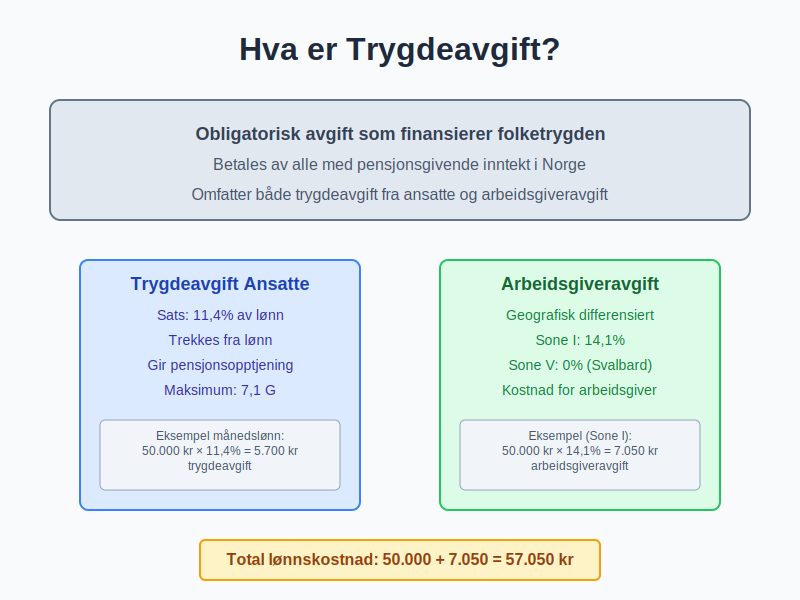

#### To hovedkomponenter:
* **Trygdeavgift fra den ansatte:** Trekkes direkte fra [lønn](/blogs/regnskap/hva-er-loenn "Hva er Lønn? Beregning og Regnskapsføring av Lønnskostnader")
* **Arbeidsgiveravgift:** Betales av arbeidsgiver som tillegg til lønnskostnaden

### 1.2 Juridisk Grunnlag

Trygdeavgiften er regulert i **folketrygdloven** og **skatteloven**, og administreres av:
* **NAV:** Beregning av trygdeytelser
* **Skatteetaten:** Innkreving og kontroll
* **Finansdepartementet:** Satsbestemmelser og regelutvikling

#### Hovedprinsipper:
| **Prinsipp** | **Beskrivelse** | **Praktisk konsekvens** |
|--------------|----------------|-------------------------|
| **Universalitet** | Alle med pensjonsgivende inntekt | Bred avgiftsbase |
| **Proporsjonalitet** | Avgift etter inntektsnivå | Progressiv struktur |
| **Øremerking** | Finansierer spesifikke formål | Direkte kobling til ytelser |

## Seksjon 2: Trygdeavgift for Ansatte

### 2.1 Beregningsgrunnlag og Satser

**Trygdeavgift** beregnes av den ansattes **pensjonsgivende inntekt** med følgende satser for 2024:

#### Trygdeavgift-satser:
| **Inntektsgruppe** | **Sats** | **Grunnlag** |
|-------------------|----------|--------------|
| **Lønnsinntekt** | 11,4% | Brutto lønn |
| **Pensjonsinntekt** | 5,1% | Brutto pensjon |
| **Næringsinntekt** | 11,4% | Overskudd fra næring |
| **Kapitalinntekt** | 0% | Fritatt for trygdeavgift |

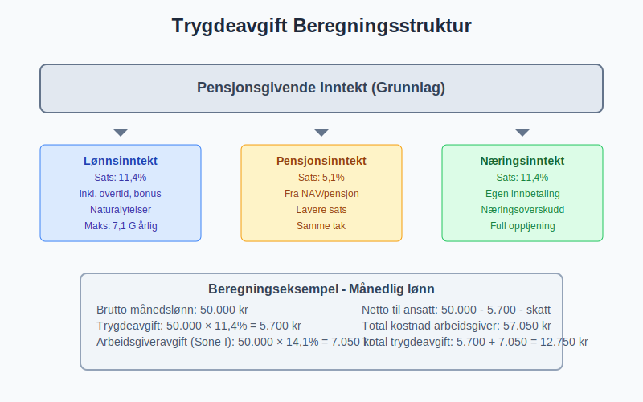

### 2.2 Praktisk Beregning og Eksempler

**Månedslønn eksempel:**
```
Brutto månedslønn: 50.000 kr
Trygdeavgift: 50.000 × 11,4% = 5.700 kr
[Tabelltrekk](/blogs/regnskap/hva-er-tabelltrekk "Hva er Tabelltrekk? Komplett Guide til Skattetrekk og Trekkberegning") (skatt): 50.000 × 25% = 12.500 kr
Netto utbetaling: 50.000 - 5.700 - 12.500 = 31.800 kr
```

#### Spesielle situasjoner:
* **Overtidsbetaling:** Samme sats som ordinær lønn
* **Bonus og tillegg:** Inkluderes i beregningsgrunnlaget
* **Naturalytelser:** Verdsettes til [markedsverdi](/blogs/regnskap/hva-er-virkelig-verdi "Hva er Virkelig Verdi? Verdsettelse og Regnskapsføring")

### 2.3 Maksimalbeløp og Frigrenser

**Trygdeavgift** har et **tak** basert på hvor mye som gir pensjonsopptjening:

#### 2024-satser:
* **Øvre grense:** 7,1 G (grunnbeløpet i folketrygden)
* **G = 118.620 kr** (2024)
* **Maksimal pensjonsgivende inntekt:** 842.804 kr
* **Maksimal årlig trygdeavgift:** 96.080 kr

**Beregning over taket:**
```
Årslønn: 1.000.000 kr
Pensjonsgivende del: 842.804 kr
Trygdeavgift: 842.804 × 11,4% = 96.080 kr
Ikke 1.000.000 × 11,4% = 114.000 kr
```

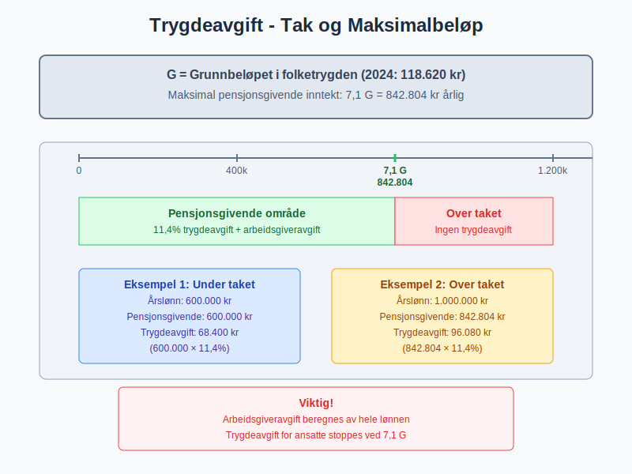

## Seksjon 3: Arbeidsgiveravgift

### 3.1 Geografiske Soner og Satser

**Arbeidsgiveravgift** varierer etter geografisk plassering for å stimulere næringsvirksomhet i distriktene:

#### Satsstruktur 2024:
| **Sone** | **Sats** | **Geografisk område** | **Eksempel kommuner** |
|----------|----------|-----------------------|-----------------------|
| **Sone I** | 14,1% | Øst-Norge hovedområder | Oslo, Bergen, Stavanger |
| **Sone Ia** | 10,6% | Nærområder til Sone I | Ski, Drammen |
| **Sone II** | 10,6% | Midt-Norge | Trondheim, Molde |
| **Sone III** | 6,4% | Nord-Norge områder | Tromsø, Bodø |
| **Sone IV** | 5,1% | Spesielle distrikter | Alta, Hammerfest |
| **Sone V** | 0% | Svalbard | Longyearbyen |

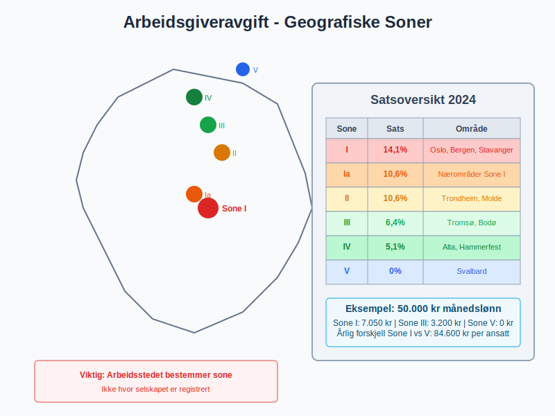

### 3.2 Beregningsgrunnlag for Arbeidsgiveravgift

**Arbeidsgiveravgift** beregnes av samme grunnlag som ansattes trygdeavgift:

#### Inkluderte elementer:
* **Grunnlønn** og faste tillegg
* **Overtidsbetaling** og variable tillegg
* **Bonus** og provisjoner
* **Naturalytelser** (firmabil, telefon, etc.)
* **[Pensjonskostnader](/blogs/regnskap/hva-er-pensjonskostnad "Hva er Pensjonskostnad? Beregning og Regnskapsføring")** (over 2 G)

#### Eksluderte elementer:
* **Refusjon av utlegg** (dokumenterte kostnader)
* **Arbeidsklær** og verktøy
* **Kost** under tjenestereiser
* **Dekning av [sykepenger](/blogs/regnskap/hva-er-sykepenger "Hva er Sykepenger? Komplett Guide til Arbeidsgiverperiode og NAV-refusjon")** fra NAV

### 3.3 Praktiske Beregningseksempler

**Total lønnskostnad for arbeidsgiver (Sone I):**
```
Brutto månedslønn: 50.000 kr
Arbeidsgiveravgift: 50.000 × 14,1% = 7.050 kr
Obligatorisk tjenestepensjon: 50.000 × 2% = 1.000 kr
Total kostnad for arbeidsgiver: 58.050 kr

Utbetaling til ansatt:
Brutto lønn: 50.000 kr
- Trygdeavgift: 5.700 kr
- Skatt: 12.500 kr
- Pensjon (egen andel): 500 kr
= Netto utbetaling: 31.300 kr
```

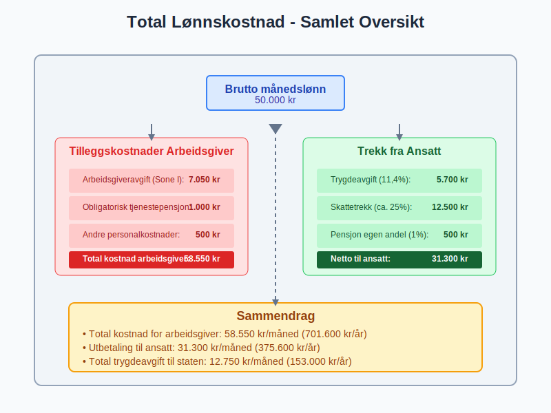

## Seksjon 4: Regnskapsføring av Trygdeavgift

### 4.1 Kontering og Bokføring

**Trygdeavgift** behandles forskjellig for arbeidsgiver og ansatt:

#### For ansattes trygdeavgift:
```
Ved lønnsutbetaling:
Debet: Lønnskostnad                50.000 kr
Kredit: Skyldige lønn til ansatte  31.300 kr
Kredit: Skyldig forskuddstrekk     12.500 kr
Kredit: Skyldig trygdeavgift        5.700 kr
Kredit: Skyldig pensjon             500 kr
```

#### For arbeidsgiveravgift:
```
Ved lønnsberegning:
Debet: Lønnskostnad (arbeidsgiveravgift)  7.050 kr
Kredit: Skyldig arbeidsgiveravgift        7.050 kr
```

### 4.2 Periodisering og Timing

**Trygdeavgift** periodiseres etter **opptjeningsprinsippet**:

#### MÃ¥nedlig rutine:
1. **Beregning:** Trygdeavgift på månedens lønn
2. **Bokføring:** Kostnadsføring og skyldig avgift
3. **Innbetaling:** Innen 15. i påfølgende måned
4. **Rapportering:** A-melding til Skatteetaten

#### Ã…rlig avstemming:
* **Kontroll** av total innbetalt trygdeavgift
* **Avstemming** mot [årsoppgaven](/blogs/regnskap/hva-er-arsoppgave "Hva er Årsoppgave? Innhold og Frister for Lønnsrapportering")
* **Korreksjon** av eventuelle avvik
* **[Skattemelding](/blogs/regnskap/skattemelding "Skattemelding - Komplett Guide til Utfylling og Innlevering")** med trygdeavgift-opplysninger

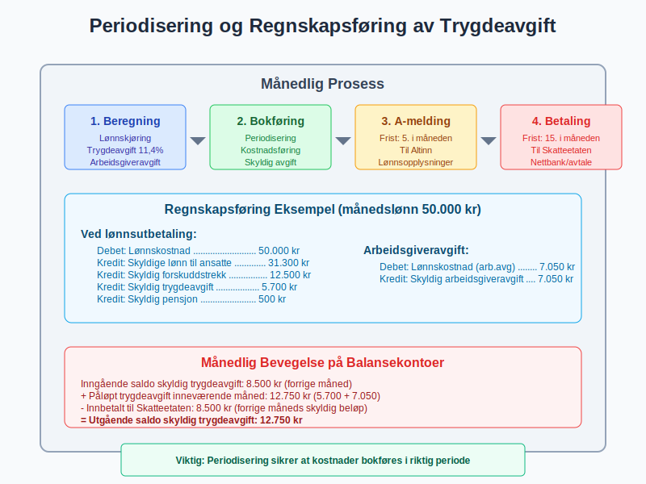

### 4.3 Balanseposter og Gjeld

**Skyldige avgifter** vises i [balansen](/blogs/regnskap/hva-er-balanse "Hva er Balanse? Komplett Guide til Balansens Oppbygging og Funksjon") som [kortsiktig gjeld](/blogs/regnskap/hva-er-gjeld "Hva er Gjeld? Typer og Regnskapsføring av Forpliktelser"):

#### Kontooversikt:
| **Konto** | **Type** | **Balanseklassifisering** |
|-----------|----------|---------------------------|
| 2740 | Skyldig trygdeavgift ansatte | Kortsiktig gjeld |
| 2750 | Skyldig arbeidsgiveravgift | Kortsiktig gjeld |
| 2770 | Skyldig forskuddstrekk | Kortsiktig gjeld |

**MÃ¥nedlig bevegelse:**
```
Inngående saldo skyldig trygdeavgift:     8.500 kr
+ Påløpt trygdeavgift inneværende måned: 12.750 kr
- Innbetalt til Skatteetaten:            8.500 kr
= Utgående saldo skyldig trygdeavgift:   12.750 kr
```

## Seksjon 5: Spesielle Situasjoner og Unntak

### 5.1 Ulike Inntektstyper

**Trygdeavgift** behandles forskjellig avhengig av inntektstype:

#### Lønnsinntekt:
* **Standard sats:** 11,4%
* **Arbeidsgiveravgift:** Etter geografisk sone
* **Pensjonsopptjening:** Ja, inntil 7,1 G

#### Pensjonsinntekt:
* **Redusert sats:** 5,1%
* **Ingen arbeidsgiveravgift:** Utbetales av NAV/pensjonsleverandør
* **Begrenset pensjonsopptjening:** Kun [tjenestepensjon](/blogs/regnskap/hva-er-tjenestepensjon "Hva er Tjenestepensjon? Typer og Regnskapsføring")

#### Næringsinntekt:
* **Standard sats:** 11,4%
* **Egen innbetaling:** Selvstendig næringsdrivende
* **Full pensjonsopptjening:** Som lønnsinntekt

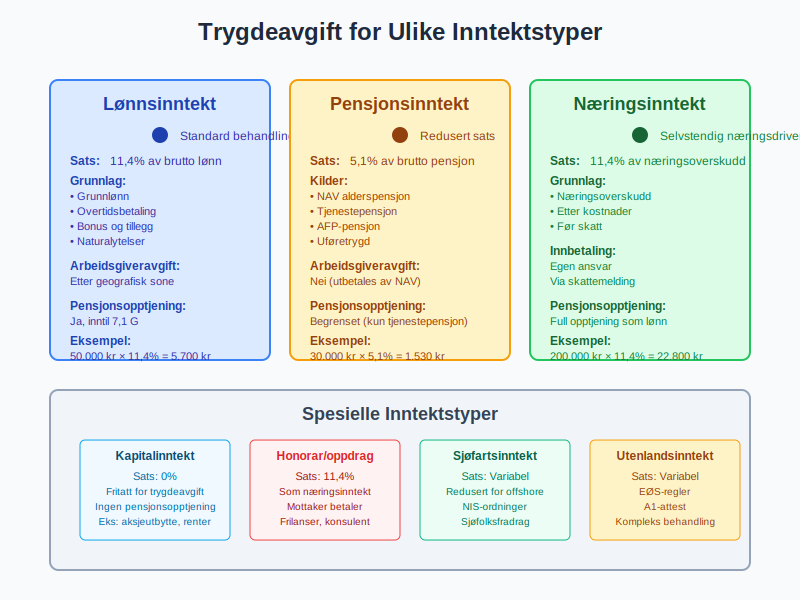

### 5.2 Internasjonale Forhold

**Grenseoverskridende ansettelser** kompliserer trygdeavgift-beregningen:

#### EØS-regler:
* **Hjemstatsregel:** Trygdeavgift betales i arbeidsland
* **Utsendingsregler:** 24 måneder i annet EØS-land
* **A1-attest:** Dokumenterer hvilket land som skal ha trygdeavgift

#### Praktiske konsekvenser:
```
Norsk arbeidstaker i Sverige (12 måneder):
- Norsk arbeidsgiver betaler svensk socialavgift
- Ingen norsk arbeidsgiveravgift
- Svensk A1-attest kreves
- Administrativ kompleksitet øker
```

### 5.3 Særordninger og Fritak

**Spesielle grupper** har egne regler:

#### Sjøfolk:
* **Redusert trygdeavgift** for arbeid på kontinentalsokkelen
* **Sjøfolksfradrag** reduserer grunnlaget
* **Særlige geografiske unntak**

#### Diplomater og internasjonale organisasjoner:
* **Fullstendig fritak** for diplomatisk personale
* **Delvis fritak** for lokalt ansatte
* **Spesielle rapporteringsrutiner**

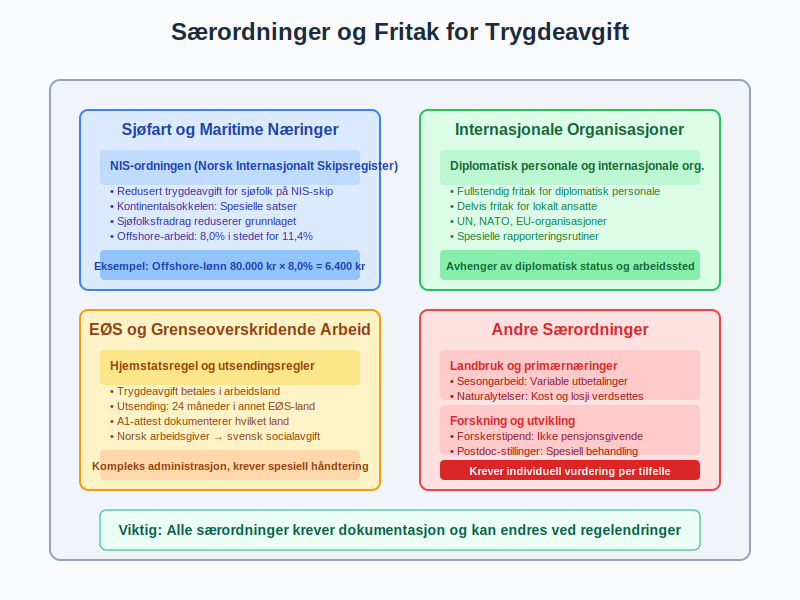

## Seksjon 6: Digital Rapportering og Compliance

### 6.1 A-ordningen og Digital Innrapportering

**A-ordningen** har forenklet rapportering av trygdeavgift:

#### MÃ¥nedlig A-melding inneholder:
* **Lønnsopplysninger** per ansatt
* **Beregnet trygdeavgift** og arbeidsgiveravgift
* **Forskuddstrekk** og andre trekk
* **Naturalytelser** og andre tillegg

#### Digital prosess:
1. **Lønnskjøring** i lønns- og personalsystem
2. **Generering** av A-melding fil
3. **Innsending** via Altinn eller system-til-system
4. **Betalingsordrer** genereres automatisk
5. **Innbetaling** via nettbank eller avtale

### 6.2 Kvalitetssikring og Kontroll

**Systemer** for å sikre korrekt rapportering:

#### Automatiske kontroller:
* **Konsistenssjekk** mellom lønn og avgifter
* **Sammenligningslogikk** mot tidligere perioder
* **Valideringsregler** for A-melding format
* **Avviksrapportering** ved uventede endringer

#### MÃ¥nedlige rutiner:
- [ ] Kontroller at alle ansatte er inkludert
- [ ] Verifiser beregning av trygdeavgift og arbeidsgiveravgift
- [ ] Avstem mot lønnsjournal og kontoer
- [ ] Send A-melding innen fristen (5. i måneden etter)
- [ ] Betal avgifter innen fristen (15. i måneden etter)

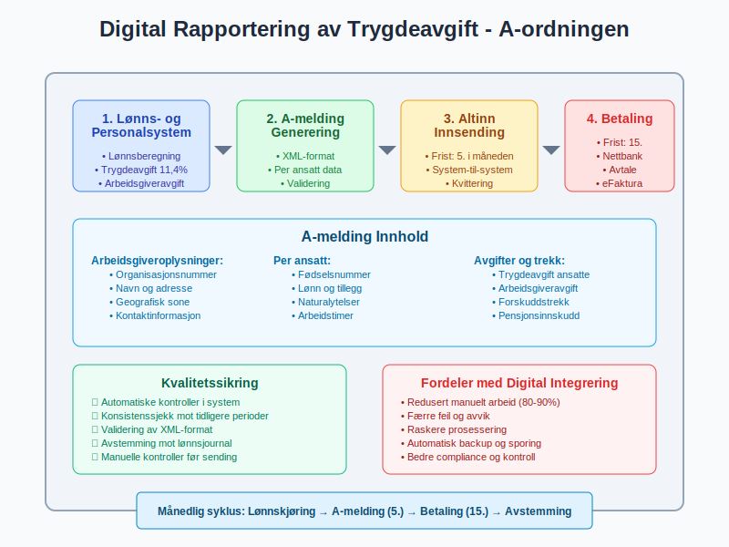

### 6.3 Revisjoner og Etterlevelse

**Skatteetaten** kontrollerer trygdeavgift gjennom:

#### Kontrollaktiviteter:
* **Dataanalyser** av A-meldinger
* **Krysssjekk** mot andre datakilder
* **Registersammenlikninger** (Folkeregisteret, Enhetsregisteret)
* **Stedlige revisjoner** ved mistanke om feil

#### Vanlige feilkilder:
| **Feiltype** | **Konsekvens** | **Forebyggende tiltak** |
|--------------|----------------|-------------------------|
| **Feil sone-klassifisering** | Feil arbeidsgiveravgift | Verifiser bedriftens geografiske tilhørighet |
| **Manglende naturalytelser** | For lav avgiftsberegning | Systematisk registrering av alle ytelser |
| **Feil pensjonsbehandling** | Avvik i grunnlag | Korrekt skille mellom ulike pensjonsordninger |

## Seksjon 7: Trygdeavgift og Pensjonssystemet

### 7.1 Sammenhengen med Pensjonsopptjening

**Trygdeavgift** gir direkte **pensjonsopptjening** i folketrygden:

#### Opptjeningsmekanisme:
* **1:1 forhold:** Hver krone trygdeavgift gir pensjonsopptjening
* **Maksimal opptjening:** 7,1 G per år
* **Minimum opptjening:** Ingen terskel for opptjening

#### Pensjonsberegning:
```
Ã…rlig pensjonsopptjening = Min(Pensjonsgivende inntekt, 7,1G)
Hvor G = grunnbeløpet (118.620 kr i 2024)

Eksempel:
Årslønn: 600.000 kr
Pensjonsopptjening: 600.000 kr (under taket)
Trygdeavgift: 600.000 × 11,4% = 68.400 kr
```

### 7.2 Koordinering med Tjenestepensjon

**[Obligatorisk tjenestepensjon](/blogs/regnskap/obligatorisk-tjenestepensjon "Obligatorisk Tjenestepensjon - Krav og Regnskapsføring")** koordineres med folketrygd:

#### Samspillseffekter:
* **Trygdeavgift** finansierer grunnpensjon
* **Tjenestepensjon** bygger på toppen
* **Samlet pensjonsnivå** beregnes koordinert

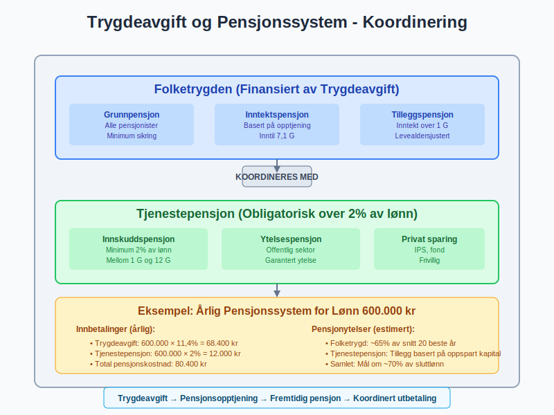

### 7.3 Utfordringer ved Pensjonsreform

**Ny pensjonsordning** (fra 2011) endret sammenhengen:

#### Hovedendringer:
* **Levealdersjustering:** Pensjon justeres for økt levealder
* **Fleksibel uttak:** Pensjon kan tas ut fra 62 år
* **Opptjening til 75 år:** Utvidet opptjeningsperiode

#### Konsekvenser for trygdeavgift:
* **Utvidet avgiftsplikt:** Trygdeavgift til 75 år
* **Økt kompleksitet:** Flere parametre påvirker samlet pensjon
* **Behov for rådgivning:** Ansatte trenger mer informasjon

## Seksjon 8: Trygdeavgift i Ulike Bransjer

### 8.1 Shipping og Maritime Næringer

**Sjøfartsnæringen** har særlige ordninger:

#### Norsk Internasjonalt Skipsregister (NIS):
* **Redusert trygdeavgift** for sjøfolk på NIS-skip
* **Geografiske unntak** for arbeid på kontinentalsokkelen
* **Spesielle satser** for offshore-virksomhet

#### Praktisk behandling:
```
Lønn offshore-arbeider:
Vanlig trygdeavgift: 11,4%
Reduksjon offshore: -3,4%
Effektiv sats: 8,0%

MÃ¥nedlig beregning:
Offshore-lønn: 80.000 kr
Trygdeavgift: 80.000 × 8,0% = 6.400 kr
```

### 8.2 Landbruk og [Primærnæringer](/blogs/regnskap/primarnaring "Hva er primærnæring? Komplett Guide til Primærnæring i Regnskap")

**Landbruksnæringen** har tilpassede ordninger:

#### Særlige forhold:
* **Sesongarbeid:** Variable lønnsutbetalinger
* **Naturalytelser:** Kost og losji verdsettes
* **Utenlandsk arbeidskraft:** Komplekse avgiftsregler

#### Regnskapsmessige utfordringer:
* **Periodisering** av sesonglønn
* **Verdsettelse** av naturalytelser
* **Koordinering** med landbruksrelaterte subsidier

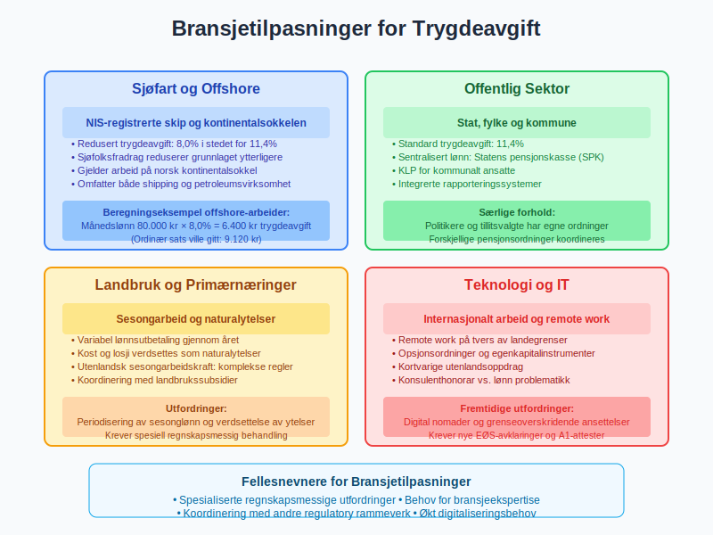

### 8.3 Offentlig Sektor

**Offentlige arbeidsgivere** har egne rutiner:

#### Statsforvaltning:
* **Sentral lønnsbehandling:** [Statens pensjonskasse](/blogs/regnskap/statens-pensjonskasse "Statens pensjonskasse")
* **Automatisk rapportering:** Integrerte systemer
* **Særlige pensjonsordninger:** Koordinering med folketrygd

#### Kommunal sektor:
* **KLP-ordninger:** Kommunal landspensjonskasse
* **Lokale systemer:** Varierende digitalisering
* **Politikere og tillitsvalgte:** Spesielle regler

## Seksjon 9: Fremtidige Endringer og Trender

### 9.1 Demografiske Utfordringer

**Befolkningsutvikling** påvirker trygdeavgift-systemet:

#### Hovedutfordringer:
* **Aldring av befolkningen:** Flere pensjonister per yrkesaktiv
* **Lavere fødselstall:** Mindre arbeidsstyrke
* **Økt levealder:** Lengre pensjonsperioder

#### Mulige tilpasninger:
* **Høyere trygdeavgift:** Økte satser for å finansiere systemet
* **Økt pensjonsalder:** Senere uttaksalder
* **Endrede ytelser:** Reduserte pensjoner relativt til lønn

### 9.2 Digitalisering og Automatisering

**Teknologisk utvikling** endrer administrasjonen:

#### Fremtidige løsninger:
* **AI-basert kontroll:** Automatisk avviksdeteksjon
* **Sanntidsrapportering:** Kontinuerlig dataoverføring
* **Blockchain-registre:** Manipulasjonssikre systemer

#### Konsekvenser for bedrifter:
* **Redusert administrativt arbeid:** Automatisering av rutiner
* **Økt transparens:** Myndighetene får bedre innsyn
* **Nye kompetansekrav:** Behov for digital kompetanse

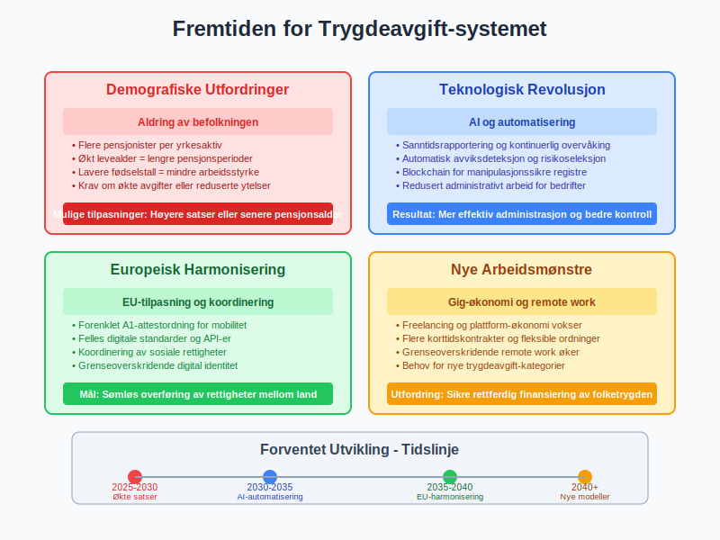

### 9.3 Europeisk Harmonisering

**EU-tilpasning** kan påvirke norsk system:

#### Pågående utvikling:
* **A1-attestordningen:** Forenklet mobilitet
* **Digitaliseringsdirektiver:** Felles standarder
* **Sosial søyle:** Koordinering av sosiale rettigheter

#### Potensielle endringer:
* **Harmoniserte satser:** Felles minimum-nivåer
* **Digital identitet:** Grenseoverskridende systemer
* **Portabilitet:** Lettere overføring av rettigheter

## Seksjon 10: Praktiske Verktøy og Ressurser

### 10.1 Beregningsverktøy

**Digitale kalkulatorer** for trygdeavgift:

#### Tilgjengelige verktøy:
| **Verktøy** | **Funksjon** | **Tilgang** |
|-------------|--------------|-------------|
| **Skatteetaten kalkulator** | Grunnleggende beregning | Gratis online |
| **NAV pensjonskalkulator** | Pensjonsopptjening | nav.no |
| **Lønnsystem-moduler** | Integrert beregning | Kommersielle systemer |

#### Egenutviklede Excel-modeller:
```
Trygdeavgift beregning:
=MIN(Lønn; 7.1*G) * 11.4%

Arbeidsgiveravgift:
=Lønn * OPPSLAG(Sone; Satstabell)
```

### 10.2 Compliance-sjekklister

**MÃ¥nedlige kontrollpunkter:**

#### A-ordningen:
- [ ] Alle ansatte inkludert i lønnskjøring
- [ ] Korrekte trygdeavgift-satser anvendt
- [ ] Naturalytelser verdsatt og inkludert
- [ ] A-melding sendt innen frist (5.)
- [ ] Avgifter betalt innen frist (15.)

#### Kvartalsvise kontroller:
- [ ] Avstemming mot skattetrekk-konto
- [ ] Kontroll av sone-klassifisering
- [ ] Gjennomgang av nye ansatte og fraträdelser
- [ ] Oppdatering av satser ved endringer

### 10.3 Feilretting og Korrigeringer

**HÃ¥ndtering av oppdagede feil:**

#### Korrigeringsprosess:
1. **Identifisering:** Avdekking av feil i beregning
2. **Kvantifisering:** Beregning av avvik
3. **Korreksjon:** Endring i neste A-melding
4. **Oppgjør:** Tilbakebetaling eller etterbetaling

#### Vanlige korrigeringsårsaker:
* **Feil geografisk sone:** Endret forretningsadresse
* **Manglende naturalytelser:** Glemt firmabil eller telefon
* **Pensjonsgrunnlag-feil:** Feil behandling av ulike pensjonsordninger

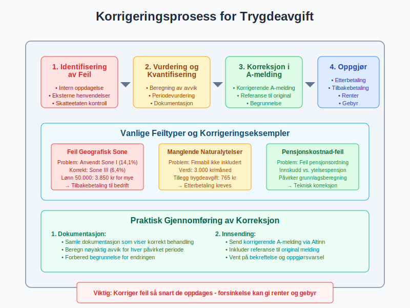

## Seksjon 11: Økonomiske Konsekvenser og Planlegging

### 11.1 Kontantstrøm-påvirkning

**Trygdeavgift** påvirker bedriftens [likviditet](/blogs/regnskap/hva-er-likviditet "Hva er Likviditet? Komplett Guide til Bedriftens Betalingsevne"):

#### Månedlig kontantstrøm:
```
Eksempel bedrift med 10 ansatte:
Gjennomsnittlig månedslønn: 45.000 kr
Total lønnskostnad: 450.000 kr

Utgifter måned 1:
- Netto lønnsutbetaling: 310.000 kr
- Forskuddstrekk til innbetaling: 112.500 kr
- Trygdeavgift til innbetaling: 51.300 kr
- Arbeidsgiveravgift til innbetaling: 63.450 kr
Total månedlig utgang: 537.250 kr

Timing:
Lønnsutbetaling: 12. i måneden
Avgiftsinnbetaling: 15. i påfølgende måned
```

### 11.2 Budgettering og Prognose

**Planlegging** av trygdeavgift-kostnader:

#### Ã…rlig budsjett-elementer:
* **Lønnsutvikling:** Forventede lønnsøkninger
* **Bemanningsendringer:** Nye ansettelser og fratredelser  
* **Satsendringer:** Regjeringens budsjett-vedtak
* **Geografiske endringer:** Flytting av virksomhet

#### Sensitivitetsanalyse:
```
Påvirkning av 1% lønnsøkning:
Ekstra trygdeavgift ansatte: +1% av lønnssum
Ekstra arbeidsgiveravgift: +1% av lønnssum × sone-sats
Samlet kostnadsgøkning: ca. 1,14% av total lønnskostnad
```

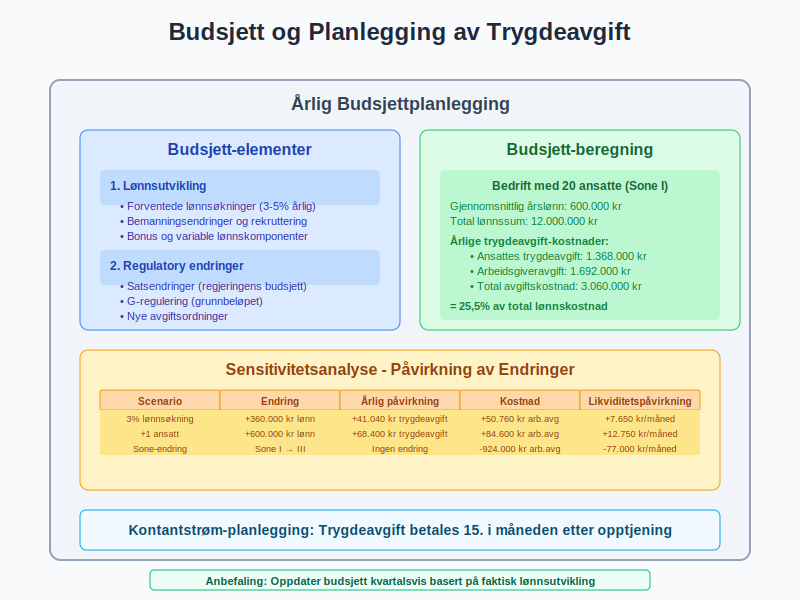

### 11.3 Optimalisering og Effektivisering

**Strategier** for å minimere administrative kostnader:

#### Automatisering:
* **Integrerte systemer:** Lønn, regnskap og rapportering
* **API-koblinger:** Direkte overføring til Altinn
* **Overvåkingssystemer:** Automatiske avviksvarslinger

#### Organisatoriske tiltak:
* **Sentralisering:** Felles lønnsbehandling for flere enheter
* **Outsourcing:** Ekstern lønns- og personaladministrasjon
* **Kompetansebygging:** Opplæring av nøkkelpersonell

## Konklusjon

**Trygdeavgift** er en fundamental del av det norske velferdssystemet som skaper både forpliktelser og rettigheter for arbeidsgivere og arbeidstakere. Systemet kombinerer finansiering av viktige samfunnsfunksjoner med komplekse administrative krav som krever nøyaktig håndtering og kontinuerlig oppfølging.

**Nøkkelinnsikter:**

* **Dobbel belastning:** BÃ¥de ansatte og arbeidsgivere bidrar til finansieringen
* **Geografisk differensiering:** Arbeidsgiveravgift varierer betydelig mellom landsdeler
* **Teknologisk utvikling:** Digitalisering forenkler rapportering men krever nye kompetanser
* **Demografiske utfordringer:** Befolkningsutvikling påvirker systemets bærekraft

**Praktisk betydning:**

For regnskapsførere og økonomisk ansvarlige innebærer trygdeavgift:
- **MÃ¥nedlige rutiner:** Korrekt beregning og rettidig innbetaling
- **Kompetansekrav:** Forståelse av komplekse regler og unntak
- **Systemkrav:** Moderne verktøy for effektiv administrasjon
- **Risikobevissthet:** Konsekvenser av feil kan være betydelige

**Fremtidsperspektiv:**

Trygdeavgift-systemet vil fortsette å utvikle seg som respons på demografiske endringer, teknologisk utvikling og europeisk harmonisering. Bedrifter som investerer i moderne administrasjonssystemer og bygger solid kompetanse innen [personaladministrasjon](/blogs/regnskap/hva-er-personaladministrasjon "Hva er Personaladministrasjon? Systemer og Prosesser for HR og Lønn") vil være best posisjonert for fremtidige krav.

**Strategisk tilnærming:**

Effektiv håndtering av trygdeavgift krever en **helhetlig tilnærming** som integrerer:
- **Regnskapsmessig presisjon** i alle beregninger og posteringer
- **Compliance-fokus** med proaktiv overholdelse av frister og krav
- **Teknologisk modernisering** for å redusere manuelle prosesser
- **Kompetanseutvikling** for å møte fremtidige utfordringer

Ved å behandle trygdeavgift som en integrert del av den overordnede [personalledelsen](/blogs/regnskap/hva-er-personalkostnad "Hva er Personalkostnad? Komponenter og Regnskapsføring") kan bedrifter sikre både regelverksetterlevelse og operasjonell effektivitet i en av de mest regulerte områdene av norsk virksomhetsdrift.


