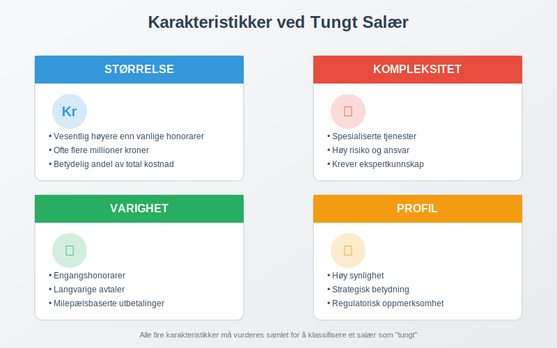
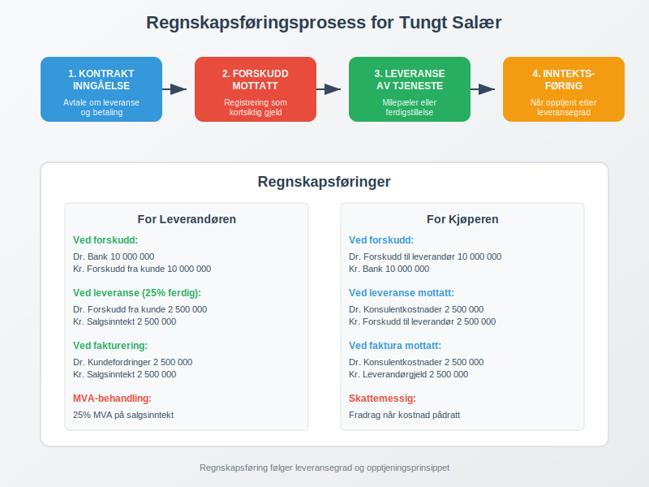
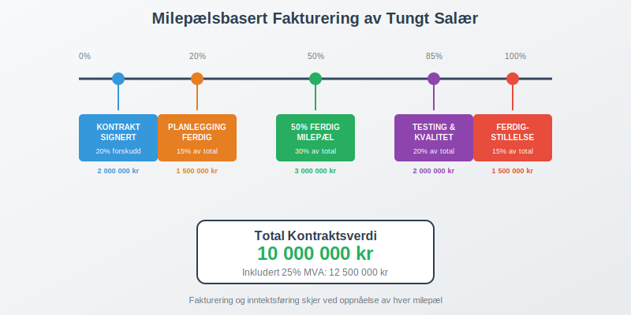
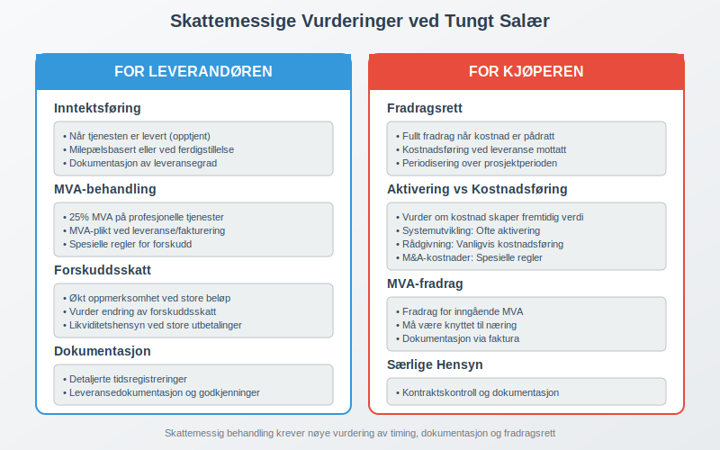
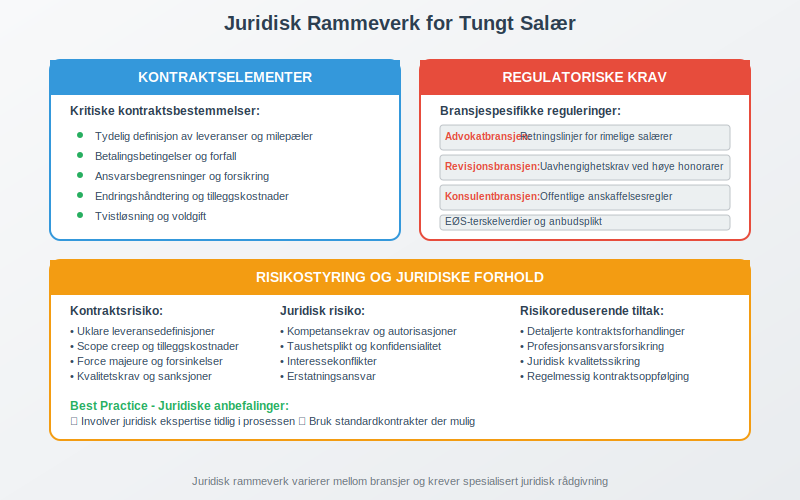
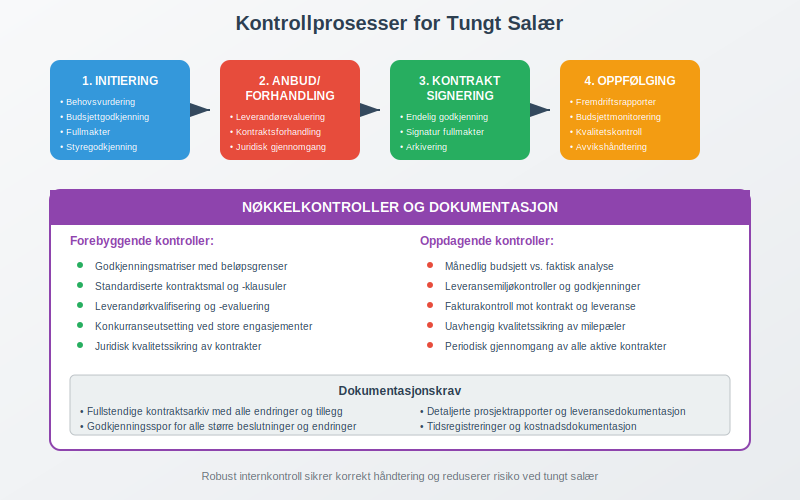
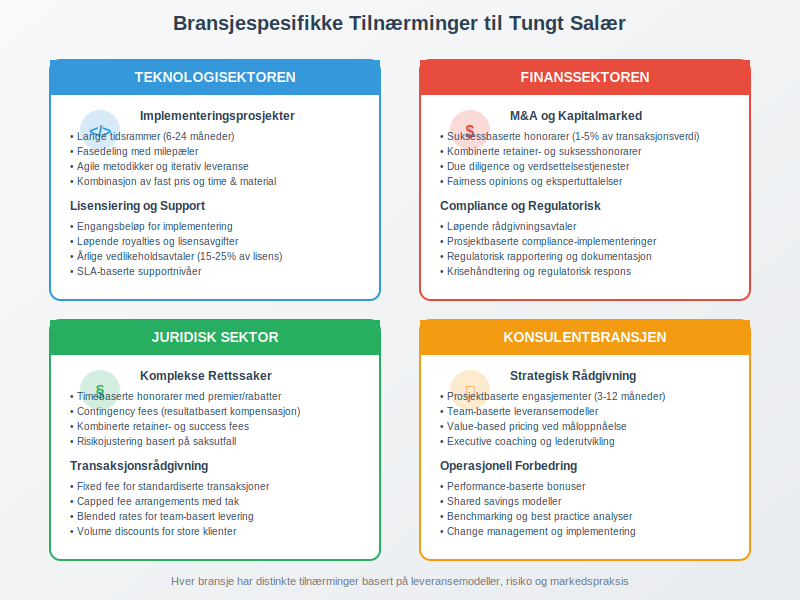
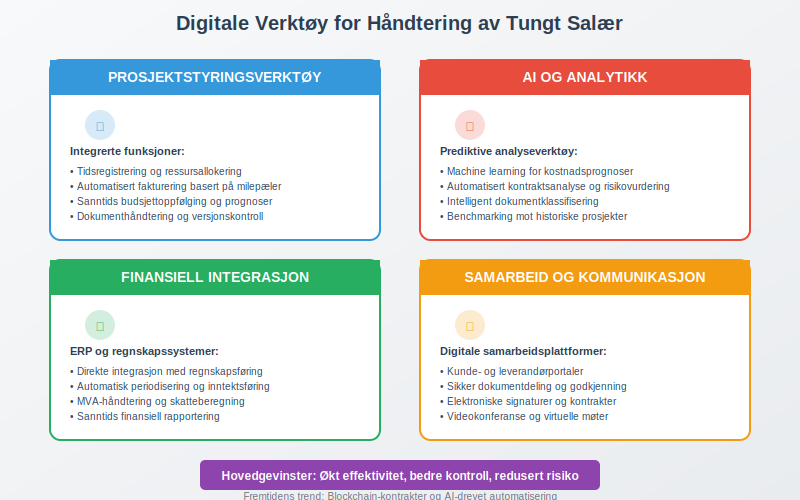
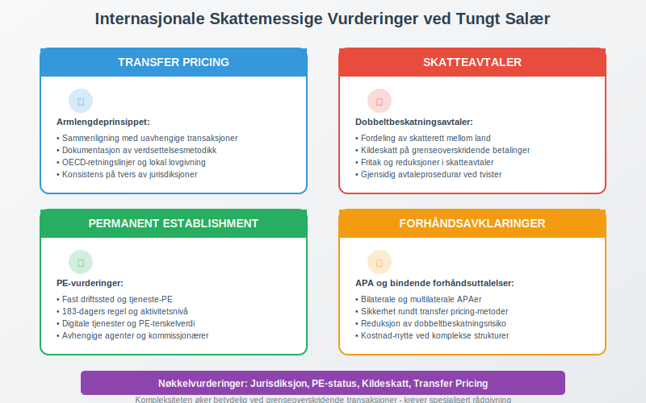
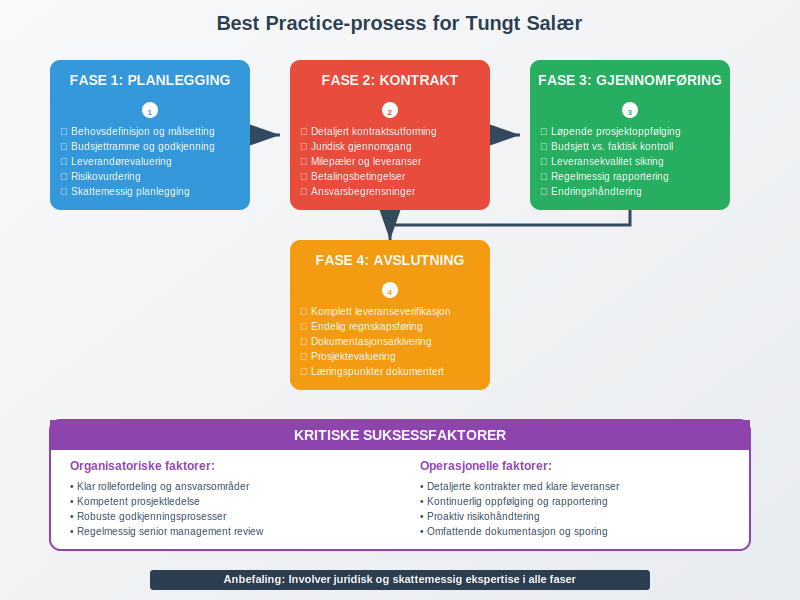

---
title: "Hva er Tungt Salær?"
seoTitle: "Hva er Tungt Salær?"
description: '**Tungt salær** er et begrep som beskriver betydelige honorarer eller [vederlag](/blogs/regnskap/hva-er-vederlag "Hva er Vederlag i Regnskap? Komplett Guide ti...'
---

**Tungt salær** er et begrep som beskriver betydelige honorarer eller [vederlag](/blogs/regnskap/hva-er-vederlag "Hva er Vederlag i Regnskap? Komplett Guide til Vederlag og Kompensasjon") som utbetales for spesielle tjenester eller oppdrag, og som krever særskilt oppmerksomhet i regnskapsføring og skattemessig behandling. Dette er særlig relevant innenfor juridiske tjenester, konsulentarbeid og andre profesjonelle serviceytelser hvor kompensasjonen kan være vesentlig.


Begrepet "tungt salær" stammer fra det juridiske miljøet, men har utvidet seg til å omfatte alle former for betydelige honorarer og vederlag i næringsvirksomhet. Forståelse av dette konseptet er kritisk for korrekt [regnskapsføring](/blogs/regnskap/hva-er-bokforing "Hva er Bokføring? Grunnleggende Guide til Regnskapsføring") og [skattemessig behandling](/blogs/regnskap/hva-er-skatt "Hva er Skatt? Komplett Guide til Norsk Skattesystem").

## Definisjon og Karakteristikker

**Tungt salær** karakteriseres av følgende egenskaper:

* **Størrelse**: Vesentlig høyere enn vanlige honorarer for tilsvarende tjenester
* **Kompleksitet**: Ofte knyttet til spesialiserte eller komplekse oppdrag
* **Varighet**: Kan være både engangshonorarer og langvarige avtaler
* **Profil**: Høy synlighet eller strategisk betydning for bedriften



### Typiske Eksempler på Tungt Salær

| Tjenestetype | Eksempel | Typisk størrelse |
|--------------|----------|------------------|
| Juridiske tjenester | M&A-transaksjoner | 5-50 millioner kr |
| Konsulentarbeid | Strategiske omorganiseringer | 2-20 millioner kr |
| Tekniske tjenester | Systemimplementeringer | 10-100 millioner kr |
| Finansielle tjenester | IPO-prosesser | 20-200 millioner kr |

## Regnskapsføring av Tungt Salær

Regnskapsføringen av tungt salær følger samme grunnprinsipper som annen [periodisering](/blogs/regnskap/hva-er-periodisering "Hva er Periodisering? Guide til Periodiseringsprinsippet"), men krever særskilt oppmerksomhet på grunn av beløpsstørrelsen og kompleksiteten.



### Grunnleggende Regnskapsføring

For leverandøren av tjenesten:

```
Dr. Kundefordringer     X kr
    Kr. Salgsinntekt         X kr
```

For kjøperen av tjenesten:

```
Dr. Driftskostnad      X kr
    Kr. Leverandørgjeld      X kr
```

### Spesielle Hensyn

**Forskuddsbetalinger** og **milepælsbetalinger** er vanlige ved tungt salær og krever spesiell behandling:

* Forskudd fra kunde registreres som kortsiktig gjeld
* Gradvis inntektsføring etter leveranse
* Dokumentasjon av leveransemilestoner



## Skattemessig Behandling

Skattemessig behandling av tungt salær følger standard prinsipper for [næringsinntekt](/blogs/regnskap/hva-er-overskudd "Hva er Overskudd? Guide til Regnskapsført Resultat"), men med særlige vurderinger rundt timing og fradragsrett.

### For Leverandøren

* **Inntektsføring**: Når tjenesten er levert (opptjent)
* **MVA-behandling**: 25% MVA på profesjonelle tjenester
* **Forskuddsskatt**: Økt oppmerksomhet på forskuddsbetalinger

### For Kjøperen

* **Fradragsrett**: Fullt fradrag når kostnad er pådratt
* **Kapitalisering**: Vurder om kostnaden skal [aktiveres](/blogs/regnskap/hva-er-anleggsmidler "Hva er Anleggsmidler? Guide til Varige Driftsmidler")
* **Dokumentasjon**: Styrket krav til dokumentasjon



## Juridiske Aspekter og Avtaleforhold

Tungt salær involverer ofte komplekse avtaleforhold som krever juridisk ekspertise og nøye dokumentasjon.

### Kontraktsutforming

**Viktige kontraktselementer**:

* Tydelig definisjon av leveranser
* Milepæler og betalingsbetingelser
* Ansvarsbegrensninger
* Tvistløsningsmekanismer

### Regulatoriske Krav

Enkelte bransjer har spesifikke reguleringer for høye honorarer:

* **Advokatbransjen**: Retningslinjer for rimelige salærer
* **Revisjonsbransjen**: Uavhengighetskrav ved høye honorarer
* **Konsulentbransjen**: Offentlige anskaffelsesregler



## Internkontroll og Risikostyring

Ved håndtering av tungt salær er det kritisk med robust [internkontroll](/blogs/regnskap/hva-er-internkontroll "Hva er Internkontroll? Guide til Kontrollsystemer") for å sikre korrekt behandling.

### Kontrollaktiviteter

**Godkjenningsprosesser**:

* Styregodkjenning for betydelige engasjementer
* Skriftlige fullmakter og budsjettgodkjenninger
* Regelmessig oppfølging av kostnadsutvikling

**Dokumentasjon**:

* Detaljerte tidsregistreringer
* Omfattende prosjektrapportering
* Ekstern verifikasjon av leveranser



### Risikoområder

| Risikoområde | Beskrivelse | Kontrolltiltak |
|--------------|-------------|----------------|
| Kostnadsoverskridelser | Uforutsette ekstrakostnader | Fastprisavtaler og budsjettoppfølging |
| Kvalitetsrisiko | Manglende leveransekvalitet | Milepælskontroller og godkjenningsprosesser |
| Juridisk risiko | Kontraktsbrudd eller tvister | Grundig juridisk gjennomgang |
| Regnskapsrisiko | Feil periodisering | Månedlig regnskapsavstemminger |

## Bransjespesifikke Særegenheter

Ulike bransjer har distinkte tilnærminger til tungt salær basert på bransjepraksis og regulatoriske krav.

### Teknologisektoren

* **Implementeringsprosjekter**: Lange tidsrammer og fasedeling
* **Lisensiering**: Kombinasjon av engangsbeløp og løpende royalties
* **Support og vedlikehold**: Langvarige serviceavtaler

### Finanssektoren

* **M&A-rådgivning**: Suksessbaserte honorarer
* **Kapitalmarkedstransaksjoner**: Kombinerte retainer- og suksesshonorar
* **Compliance-tjenester**: Løpende rådgivningsavtaler



## Digitalisering og Fremtidens Tungt Salær

Digitaliseringen endrer hvordan tungt salær håndteres og dokumenteres, med nye muligheter for effektivitet og kontroll.

### Teknologiske Løsninger

**Prosjektstyringsverktøy**:

* Integrert tidsregistrering og fakturering
* Sanntids budsjettoppfølging
* Automatiserte rapporteringsfunksjoner

**Kunstig intelligens**:

* Prediktiv analyse av prosjektkostnader
* Automatisert kontraktsanalyse
* Risikovurdering basert på historiske data



### Fremtidige Trender

* **Blockchain-baserte kontrakter**: Automatiserte betalingsmekanismer
* **AI-drevet risikostyring**: Prediktive modeller for kostnadskontroll
* **Integrerte regnskapsplattformer**: Sanntids regnskapsføring og rapportering

## Internasjonale Perspektiver

Ved internasjonale engasjementer med tungt salær oppstår ytterligere kompleksitet rundt [transfer pricing](/blogs/regnskap/hva-er-skatt "Hva er Skatt? Komplett Guide til Norsk Skattesystem") og skattemessig behandling.

### Transfer Pricing-vurderinger

**Armlengdeprinsippet**:

* Sammenligning med tilsvarende transaksjoner
* Dokumentasjon av prisfastsettelse
* Konsistens på tvers av jurisdiksjoner

### Skatteavtaler og Dobbeltbeskatning

* **Permanent establishment**: Vurdering av skatteposisjon
* **Kildeskatt**: Behandling av grenseoverskridende betalinger
* **Forhåndsavklaringer**: Sikkerhet rundt skattemessig behandling



## Best Practice og Anbefalinger

For optimal håndtering av tungt salær anbefales følgende tilnærming:

### Planleggingsfasen

* **Grundig kontraktsutforming** med tydelige leveransemilestoner
* **Skattemessig planlegging** for optimalisering av fradrag
* **Risikovurdering** og etablering av kontrollrutiner

### Gjennomføringsfasen

* **Løpende oppfølging** av kostnader og leveranser
* **Regelmessig rapportering** til relevante interessenter
* **Proaktiv risikostyring** ved avvik fra planer

### Avslutningsfasen

* **Fullstendig dokumentasjon** av alle leveranser og kostnader
* **Endelig regnskapsføring** og skattemessig avklaring
* **Læringspunkter** for fremtidige engasjementer



## Konklusjon

Tungt salær representerer en betydelig kategori av forretningsutgifter som krever spesiell oppmerksomhet på grunn av størrelse, kompleksitet og potensielle risikoer. Korrekt håndtering involverer:

* **Grundig planlegging** av kontrakts- og regnskapsmessige aspekter
* **Robust internkontroll** for å sikre korrekt behandling
* **Kontinuerlig oppfølging** av kostnader og leveranser
* **Professjonell rådgivning** ved komplekse engasjementer

Ved å følge anerkjente best practices og opprettholde høy dokumentasjonskvalitet kan organisasjoner håndtere tungt salær på en måte som både optimaliserer forretningsverdi og sikrer regulatorisk compliance.

For ytterligere veiledning om relaterte emner, se våre artikler om [personalkostnad](/blogs/regnskap/hva-er-personalkostnad "Hva er Personalkostnad? Guide til Lønnskostnader"), [attestering](/blogs/regnskap/hva-er-attestering "Hva er Attestering? Guide til Attestasjonsprosesser") og [internkontroll](/blogs/regnskap/hva-er-internkontroll "Hva er Internkontroll? Guide til Kontrollsystemer").


