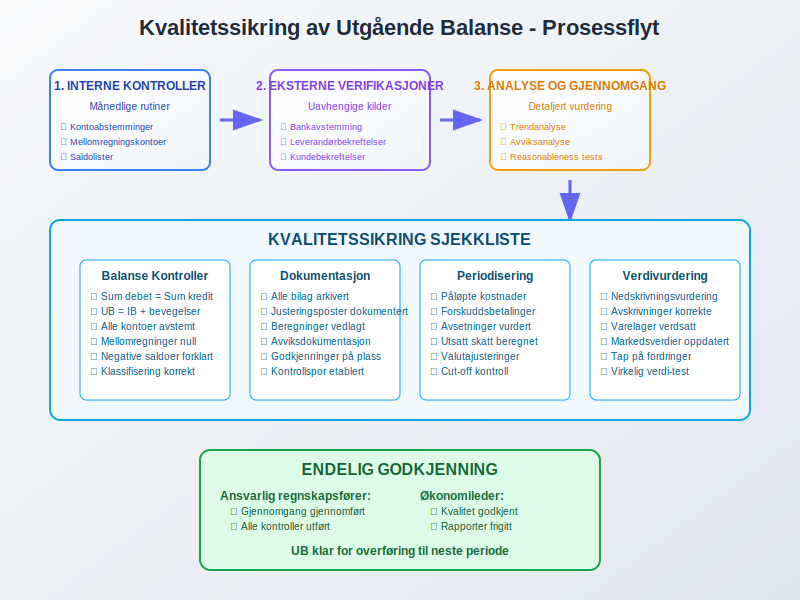

**Utgående balanse (UB)** er en fundamental komponent i regnskapsføring som representerer saldoen på en konto ved slutten av en regnskapsperiode. Denne saldoen danner grunnlaget for neste periodes [inngående balanse](/blogs/regnskap/hva-er-inngaaende-balanse "Hva er Inngående Balanse? Komplett Guide til IB og Periodens Start") og sikrer kontinuitet i den løpende regnskapsføringen. Forståelse av utgående balanse er essensielt for korrekt periodeslutt, [balanseoppsett](/blogs/regnskap/hva-er-balanse "Balanse i Regnskap - Komplett Guide til Balansens Oppbygging og Funksjon") og finansiell rapportering.

## Seksjon 1: Grunnleggende Konsept og Definisjon

### 1.1 Hva er Utgående Balanse?

**Utgående balanse (UB)** er det endelige beløpet som står på en regnskapskonto når en regnskapsperiode avsluttes. Denne verdien reflekterer alle transaksjoner og justeringer som har påvirket kontoen gjennom hele perioden, fra den [inngående balansen](/blogs/regnskap/hva-er-inngaaende-balanse "Hva er Inngående Balanse? Komplett Guide til IB og Periodens Start") ved periodens start til alle registrerte bevegelser underveis.

### 1.2 Formålet med Utgående Balanse

Utgående balanse tjener flere kritiske funksjoner i regnskapsføring:

* **Periodeslutt:** Etablerer et klart skille mellom regnskapsperioder
* **Kontinuitet:** Sikrer at verdier overføres korrekt til neste periode
* **Kontroll:** Gir grunnlag for kontroll og [avstemming](/blogs/regnskap/hva-er-avstemming "Hva er Avstemming i Regnskap? Komplett Guide til Regnskapsavstemming") av kontoer
* **Rapportering:** Danner basis for [balanse](/blogs/regnskap/hva-er-balanse "Balanse i Regnskap - Komplett Guide til Balansens Oppbygging og Funksjon") og andre finansielle rapporter

### 1.3 Sammenheng med Inngående Balanse

Den fundamentale sammenhengen mellom utgående og [inngående balanse](/blogs/regnskap/hva-er-inngaaende-balanse "Hva er Inngående Balanse? Komplett Guide til IB og Periodens Start") kan uttrykkes som:

**UB (periode n) = IB (periode n+1)**

## Seksjon 2: Utgående Balanse for Ulike Kontotyper

### 2.1 Balansekontoer (Permanente Kontoer)

For [balanse](/blogs/regnskap/hva-er-balanse "Balanse i Regnskap - Komplett Guide til Balansens Oppbygging og Funksjon")kontoer overføres utgående balanse direkte til neste periode:

#### Aktivakontoer
* **[Kassebeholdning](/blogs/regnskap/hva-er-kassebeholdning "Hva er Kassebeholdning? Komplett Guide til Kontanter og Likvide Midler"):** Kontantbeholdning ved periodens slutt
* **Kundefordringer:** Utestående fordringer fra kunder
* **[Anleggsmidler](/blogs/regnskap/hva-er-anleggsmidler "Hva er Anleggsmidler? Komplett Guide til Faste Eiendeler"):** Bokført verdi etter [avskrivninger](/blogs/regnskap/hva-er-avskrivning "Hva er Avskrivning? Komplett Guide til Avskrivningsmetoder")
* **Varelager:** Verdien av lagerbeholdning ved periodens slutt

#### Passivakontoer
* **Leverandørgjeld:** Utestående forpliktelser til leverandører
* **Banklån:** Gjenstående lånesaldo
* **[Egenkapital](/blogs/regnskap/hva-er-egenkapital "Hva er Egenkapital? Komplett Guide til Egenkapital i Regnskap"):** Akkumulert egenkapital inkludert årets resultat

### 2.2 Resultatkontoer (Midlertidige Kontoer)

Resultatkontoer har en spesiell behandling ved periodeslutt:

#### Inntektskontoer
* **Salgsinntekter:** Akkumulerte inntekter for perioden
* **Renteinntekter:** Opptjente renter i perioden
* **Andre driftsinntekter:** Øvrige inntektskilder

#### Kostnadskontoer
* **Varekostnad:** Totale varekostnader for perioden
* **Lønnskostnader:** Samlede lønnsutgifter inkludert [arbeidsgiveravgift](/blogs/regnskap/hva-er-arbeidsgiveravgift "Hva er Arbeidsgiveravgift? Komplett Guide til AGU")
* **Avskrivninger:** [Avskrivninger](/blogs/regnskap/hva-er-avskrivning "Hva er Avskrivning? Komplett Guide til Avskrivningsmetoder") på [anleggsmidler](/blogs/regnskap/hva-er-anleggsmidler "Hva er Anleggsmidler? Komplett Guide til Faste Eiendeler")

## Seksjon 3: Beregning og Fastsettelse av Utgående Balanse

### 3.1 Grunnleggende Beregningsformel

For alle kontotyper gjelder den grunnleggende formelen:

**UB = IB + Debetbevegelser - Kreditbevegelser**

For kreditsaldo kontoer:
**UB = IB + Kreditbevegelser - Debetbevegelser**

### 3.2 Praktisk Eksempel - Bankkonto

| **Element** | **Beløp** |
|-------------|-----------|
| Inngående balanse 1. januar | 250.000 |
| + Innskudd i perioden | 500.000 |
| - Uttak i perioden | 180.000 |
| **Utgående balanse 31. desember** | **570.000** |

### 3.3 Praktisk Eksempel - Kundefordringer

| **Element** | **Beløp** |
|-------------|-----------|
| Inngående balanse | 180.000 |
| + Nye salg på kredit | 850.000 |
| - Innbetalinger fra kunder | 720.000 |
| - [Tap på fordringer](/blogs/regnskap/tap-pa-fordring "Tap på Fordring - Komplett Guide til Regnskapsføring og Skattemessig Behandling") | 15.000 |
| **Utgående balanse** | **295.000** |

## Seksjon 4: Utgående Balanse i Periodesluttprosessen

### 4.1 Kronologisk Prosessflyt

Fastsettelse av utgående balanse følger en systematisk prosess:

1. **Råbalanse:** Første utkast basert på løpende [bokføring](/blogs/regnskap/hva-er-bokforing "Hva er Bokføring? Komplett Guide til Regnskapsføring og Bokføringsprinsipper")
2. **Justeringsposter:** [Periodiseringer](/blogs/regnskap/hva-er-periodisering "Hva er Periodisering i Regnskap? Komplett Guide til Periodiseringsprinsippet") og korreksjoner
3. **Justert råbalanse:** Balanse etter justeringer
4. **Avslutningsposter:** Resultatkontoer føres mot [egenkapital](/blogs/regnskap/hva-er-egenkapital "Hva er Egenkapital? Komplett Guide til Egenkapital i Regnskap")
5. **[Avslutningsbalanse](/blogs/regnskap/hva-er-avslutningsbalanse "Hva er Avslutningsbalanse? Komplett Guide til Årsavslutning"):** Endelig utgående balanse

### 4.2 Kritiske Kontrollpunkter

Ved fastsettelse av utgående balanse må følgende kontrolleres:

* **Balansering:** Sum debet = Sum kredit
* **[Avstemming](/blogs/regnskap/hva-er-avstemming "Hva er Avstemming i Regnskap? Komplett Guide til Regnskapsavstemming"):** Eksterne kilder mot regnskap
* **[Periodisering](/blogs/regnskap/hva-er-periodisering "Hva er Periodisering i Regnskap? Komplett Guide til Periodiseringsprinsippet"):** Riktig tidsperiode for transaksjoner
* **Klassifisering:** Korrekt kontobruk og postering

## Seksjon 5: Særlige Forhold og Justeringer

### 5.1 Periodiseringer og Påløpte Poster

Utgående balanse påvirkes av:

#### Periodiserte Kostnader
* **Forskuddsbetalte kostnader:** Utgifter betalt på forhånd
* **Påløpte kostnader:** Kostnader opptjent men ikke betalt
* **Avsetninger:** Estimerte fremtidige forpliktelser

#### Periodiserte Inntekter
* **Forskuddsbetalt inntekt:** Mottak av betaling på forhånd
* **Påløpte inntekter:** Opptjente inntekter ikke fakturert

### 5.2 Verdijusteringer

Utgående balanse må reflektere korrekte verdier:

* **Nedskrivninger:** Verdifall på [aktiva](/blogs/regnskap/hva-er-aktiva "Hva er Aktiva? En Komplett Guide til Eiendeler i Regnskap")
* **Oppskrivninger:** Verdistigning innenfor anskaffelseskost
* **Valutajusteringer:** Omregning av utenlandsk valuta
* **Markedsverdijusteringer:** Verdipapirer til virkelig verdi

## Seksjon 6: Utgående Balanse og Finansiell Rapportering

### 6.1 Balanserapport

Utgående balanse danner grunnlaget for [balansen](/blogs/regnskap/hva-er-balanse "Balanse i Regnskap - Komplett Guide til Balansens Oppbygging og Funksjon"):

| **AKTIVA** | **UB 31.12** | **PASSIVA** | **UB 31.12** |
|------------|--------------|-------------|--------------|
| **ANLEGGSMIDLER** | | **EGENKAPITAL** | |
| Bygninger | 2.500.000 | [Aksjekapital](/blogs/regnskap/hva-er-aksjekapital "Hva er Aksjekapital? Komplett Guide til Egenkapital i AS") | 500.000 |
| Maskiner | 800.000 | Opptjent egenkapital | 1.850.000 |
| **OMLØPSMIDLER** | | **GJELD** | |
| Varelager | 650.000 | Banklån | 1.200.000 |
| Kundefordringer | 420.000 | Leverandørgjeld | 320.000 |
| Bank | 150.000 | Annen kortsiktig gjeld | 200.000 |
| **SUM AKTIVA** | **4.520.000** | **SUM PASSIVA** | **4.070.000** |

### 6.2 Sammenligning og Trendanalyse

Utgående balanse muliggjør sammenligning over tid:

* **Ã…r-over-Ã¥r endringer:** Vekst eller nedgang i poster
* **Strukturelle endringer:** Endret sammensetning av [aktiva](/blogs/regnskap/hva-er-aktiva "Hva er Aktiva? En Komplett Guide til Eiendeler i Regnskap") og [passiva](/blogs/regnskap/hva-er-passiva "Hva er Passiva? En Guide til Gjeld og Egenkapital i Regnskap")
* **[Nøkkeltall](/blogs/regnskap/hva-er-nokkeltall "Hva er Nøkkeltall? Komplett Guide til Finansielle Nøkkeltall i Regnskap") utvikling:** Likviditet, soliditet og lønnsomhet

## Seksjon 7: Kvalitetssikring og Kontrollrutiner

### 7.1 Interne Kontroller

For å sikre korrekt utgående balanse:

#### MÃ¥nedlige Rutiner
* **Kontoabstemminger:** Systematisk gjennomgang av alle hovedkontoer
* **Mellomregninger:** Kontroll og utligning av mellomregningskontoer
* **Saldolister:** Gjennomgang og analyse av utskrevne saldolister

#### Ã…rlige Rutiner
* **Inventering:** Fysisk telling og verifikasjon
* **Vurderinger:** Gjennomgang av verdiansetttelser
* **Dokumentasjon:** Sikring av fullstendig bilagsdokumentation

### 7.2 Eksterne Verifikasjoner

* **Bankavstemming:** Sammenligning med bankkontoutskrift
* **Leverandørkonfirmasjoner:** Bekreftelse av gjeldssaldoer
* **Kundebekreftelser:** Verifikasjon av fordringssaldoer
* **Revisorkontroll:** Ekstern verifikasjon av vesentlige poster

## Seksjon 8: Digitale Systemer og Automatisering

### 8.1 Moderne Regnskapssystemer

Dagens regnskapssystemer tilbyr:

#### Automatiske Funksjoner
* **Sanntidsbalanse:** Løpende oppdatering av utgående balanse
* **Automatisk periodisering:** Systemgenererte [periodiseringer](/blogs/regnskap/hva-er-periodisering "Hva er Periodisering i Regnskap? Komplett Guide til Periodiseringsprinsippet")
* **Integrerte kontroller:** Innebygde validering og kontrollrutiner
* **Årsavslutningsverktøy:** Strukturerte prosesser for periodeslutt

#### Rapporteringsmuligheter
* **Dashboard:** Grafisk fremstilling av nøkkelbalanseposter
* **Komparative rapporter:** Sammenligning på tvers av perioder
* **Detaljerte utdrag:** Spesifikke kontoanalyser og bevegelser

### 8.2 Integrasjoner og Dataflyt

* **Bank:** Automatisk import av banktransaksjoner
* **Fakturabehandling:** Digital behandling av inn- og utgående fakturaer
* **Lønnssystem:** Integrert overføring av lønnsposter
* **Lager:** Sanntidsoppdatering av lagerverdier

## Seksjon 9: Juridiske og Regulatoriske Aspekter

### 9.1 Lovkrav til Utgående Balanse

Norsk regnskapslovgivning stiller krav til:

#### Bokføringsloven
* **Nøyaktighet:** Utgående balanse må reflektere faktiske forhold
* **Fullstendighet:** Alle transaksjoner skal være registrert
* **Dokumentasjon:** Tilstrekkelig bilagsmateriale for alle poster
* **Oppbevaring:** Krav til arkivering og tilgjengelig

#### Regnskapsloven
* **Vurderingsprinsipper:** Konsistent anvendelse av verdsettelsesregler
* **Offentliggjøring:** Krav til publisering av balanse
* **Sammenlignbarhet:** Konsistent presentasjon over tid

### 9.2 Revisjonsaspekter

Revisor fokuserer særlig på:

* **Vesentlighet:** Betydelige poster i utgående balanse
* **Risikoomrader:** Områder med høy risiko for feil
* **Kontrollmiljø:** Kvaliteten på interne kontrollerog prosesser
* **Dokumentasjon:** Tilstrekkelig bevis for balanseposter

## Seksjon 10: Praktiske Tips og Beste Praksis

### 10.1 Månedlig Oppfølging

For effektiv håndtering av utgående balanse:

#### Strukturerte Rutiner
* **Fastsatte datoer:** Faste frister for månedlig avslutning
* **Sjekklister:** Systematisk gjennomgang av alle områder
* **Ansvarsfordeling:** Klare roller og ansvar i prosessen
* **Kvalitetskontroll:** Sekundær gjennomgang av kritiske poster

#### Avviksoppfølging
* **Terskelverdier:** Definerte grenser for når avvik skal undersøkes
* **Rotårsaksanalyse:** Grundig analyse av identifiserte avvik
* **Korrigerende tiltak:** Implementering av forbedring
* **Overvåkning:** Oppfølging av at tiltak virker

### 10.2 Ã…rsavslutningsforberedelser

#### Fremskutt Planlegging
* **Årsplan:** Oversikt over kritiske datoer og milepæler
* **Ressursallokering:** Sikring av nødvendig kompetanse og kapasitet
* **Systemforberedelser:** Oppdateringer og backup av systemer
* **Dokumentorganisering:** Systematisering av bilag og dokumentasjon

#### Kvalitetssikring
* **Kontrollmatriser:** Oversikt over alle kontrollpunkter
* **Revisjonsklargjøring:** Forberedelse til ekstern revisjon
* **Rapportvalidering:** Grundig gjennomgang av alle rapporter
* **Arkivering:** Sikker oppbevaring av årsavslutningsdokumentasjon

## Seksjon 11: Vanlige Utfordringer og Løsninger

### 11.1 Typiske Problemområder

#### Tekniske Utfordringer
* **Systemfeil:** Tekniske problemer i regnskapssystemer
* **Dataintegrasjon:** Problemer med automatisk dataoverføring
* **Backup og sikkerhet:** Tap av data eller sikkerhetshull
* **Brukerfeider:** Feil bruk av systemfunksjonalitet

#### Prosessuelle Utfordringer
* **Tidspress:** Knappe frister for periodeslutt
* **Ressursmangel:** Utilstrekkelig bemanning eller kompetanse
* **Kvalitetskontroll:** Manglende rutiner for feildeteksjon
* **Kommunikasjon:** DÃ¥rlig koordinering mellom avdelinger

### 11.2 Løsningsstrategier

#### Forebyggende Tiltak
* **Systematisk opplæring:** Regelmessig kompetanseutvikling
* **Redundans:** Backup-løsninger og alternative prosesser
* **Standardisering:** Klare retningslinjer og prosedyrer
* **Kontinuerlig forbedring:** Regelmessig evaluering og optimalisering

#### Reaktive Tiltak
* **Feilhåndtering:** Klare prosedyrer for korrigering av feil
* **Eskalering:** Definerte nivåer for ansvarsoverføring
* **Dokumentasjon:** Grundig registrering av problemer og løsninger
* **Erfaringsdeling:** Læring på tvers av organisasjonen

## Seksjon 12: Fremtidens Utgående Balanse

### 12.1 Teknologiske Utviklingstrekk

#### Kunstig Intelligens og Maskinlæring
* **Prediktiv analyse:** Automatisk identifikasjon av avvik og mønstre
* **Automatisk kategorisering:** AI-drevet klassifisering av transaksjoner
* **Risikoscoring:** Intelligent vurdering av balanseposter
* **Kontinuerlig læring:** Systemer som forbedres over tid

#### Blockchain og Distributed Ledger
* **Sporbarhet:** Fullstendig transaksjonssporing fra kilde til balanse
* **Tillit:** Redusert behov for manuell verifikasjon
* **Sanntidsrapportering:** Øyeblikkelig tilgang til oppdaterte balanser
* **Automatisk avstemming:** Selvrekonsilierende systemer

### 12.2 Regulatoriske Endringer

#### Digitalisering av Rapportering
* **Sanntidsrapportering:** Kontinuerlig rapportering til myndigheter
* **Strukturerte data:** Standardiserte formater for datautveksling
* **Automatisk kontroll:** Systembasert validering av rapporter
* **Redusert administrativ byrde:** Strømlinjeformede prosesser

#### Bærekraftsrapportering
* **ESG-integrasjon:** Miljø-, sosial- og styringsinformasjon i balansen
* **Ikke-finansielle måltall:** Utvidet balanseinformasjon
* **Stakeholder-rapportering:** Bredere rapporteringsforpliktelser

## Konklusjon

Utgående balanse (UB) er en kritisk komponent i regnskapsføring som sikrer kontinuitet, nøyaktighet og tillit i finansiell rapportering. Som bindeleddet mellom regnskapsperioder, representerer UB ikke bare en teknisk sluttsaldo, men fundamentet for påfølgende periods regnskapsføring og beslutningstaking.

Korrekt håndtering av utgående balanse krever:

* **Systematiske prosesser** for beregning og kontroll
* **Grundig kvalitetssikring** gjennom interne og eksterne verifikasjoner
* **Teknologisk støtte** for effektiv behandling og rapportering
* **Kontinuerlig kompetanseutvikling** for å følge med utviklingen

For å mestre utgående balanse må organisasjoner etablere robuste rutiner som kombinerer faglig kunnskap med teknologiske verktøy. Dette sikrer ikke bare overholdelse av juridiske krav, men skaper også et solid grunnlag for strategisk beslutningstaking og finansiell styring.

Utgående balanse vil fortsette å utvikle seg med teknologiske fremskritt og endrede regulatoriske krav. Organisasjoner som investerer i moderne systemer og prosesser, samtidig som de opprettholder fokus på grunnleggende regnskapsprinsipper, vil være best posisjonert for fremtidens krav til finansiell rapportering og transparens.

Gjennom systematisk arbeid med utgående balanse legger organisasjoner grunnlaget for pålitelig regnskapsføring, effektiv økonomistyring og tillit hos alle interessenter. Dette gjør UB til mer enn bare en teknisk sluttsaldo - det er en byggestein for finansiell integritet og organisatorisk suksess.

