---
title: "Hva er Utkontraktering?"
meta_title: "Hva er Utkontraktering?"
meta_description: '**Utkontraktering** er en forretningsstrategi hvor virksomheter overlater spesifikke oppgaver, funksjoner eller prosesser til eksterne leverandører. Dette kan ...'
slug: hva-er-utkontraktering
type: blog
layout: pages/single
---

**Utkontraktering** er en forretningsstrategi hvor virksomheter overlater spesifikke oppgaver, funksjoner eller prosesser til eksterne leverandører. Dette kan omfatte alt fra [regnskapsføring](/blogs/regnskap/hva-er-regnskap "Hva er Regnskap? Komplett Guide til Regnskapsføring") og [bokføring](/blogs/regnskap/hva-er-bokforing "Hva er Bokføring? Komplett Guide til Bokføringsregler") til IT-tjenester, kundeservice og produksjon.

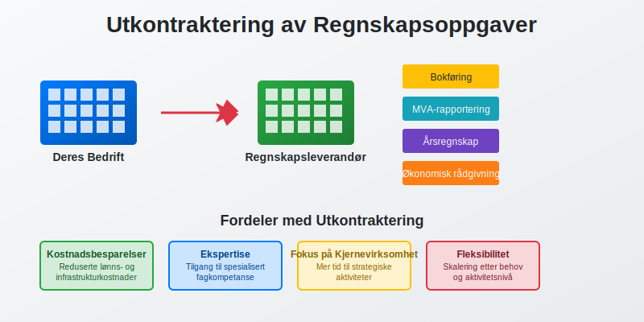

## Definisjon av Utkontraktering

Utkontraktering, også kjent som **outsourcing**, innebærer at en virksomhet inngår avtale med en ekstern leverandør for å utføre oppgaver som tidligere ble gjort internt. Dette kan være:

* **Fullstendig utkontraktering** - hele funksjoner overføres til eksterne leverandører
* **Delvis utkontraktering** - kun deler av en funksjon outsources
* **Selektiv utkontraktering** - spesifikke oppgaver eller prosesser outsources

### Forskjell mellom Utkontraktering og Innleie

Det er viktig å skille mellom utkontraktering og innleie av arbeidskraft:

| Aspekt | **Utkontraktering** | **Innleie** |
|--------|-------------------|-------------|
| **Kontroll** | Leverandør har ansvar for utførelse | Oppdragsgiver styrer arbeidet |
| **Risiko** | Overføres til leverandør | Forblir hos oppdragsgiver |
| **Resultat** | Leverandør garanterer resultat | Kun arbeidskraft leveres |
| **Juridisk ansvar** | Hos leverandør | Hos oppdragsgiver |

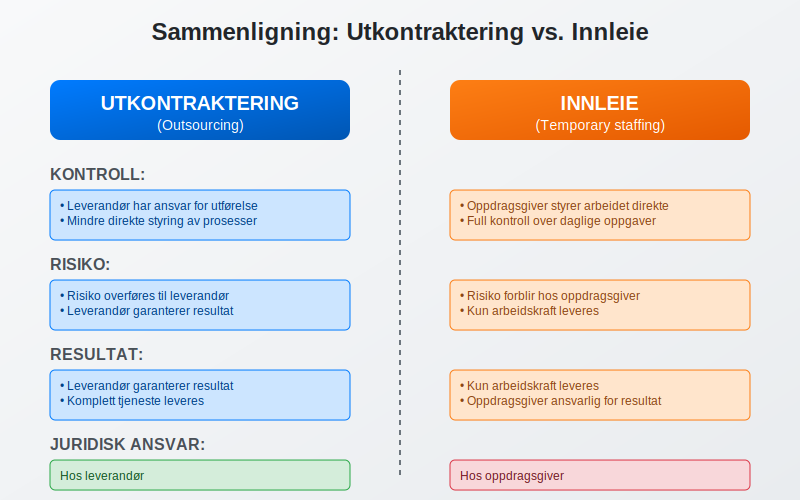

## Typer Utkontraktering

### Regnskapsmessig Utkontraktering

Dette er særlig relevant for mindre [foretak](/blogs/regnskap/hva-er-foretak "Hva er et Foretak? Komplett Guide til Foretaksformer i Norge") som ikke har ressurser til egen regnskapsavdeling:

#### Bokføringstjenester
* Løpende [bilagsføring](/blogs/regnskap/hva-er-bilagsforing "Hva er Bilagsføring? Komplett Guide til Bilagsregistrering")
* [Bankavstemming](/blogs/regnskap/hva-er-bankavstemming "Hva er Bankavstemming? Komplett Guide til Avstemming av Bankkonti")
* [Kundefordringer](/blogs/regnskap/hva-er-kundefordring "Hva er Kundefordringer? Komplett Guide til Fordringsstyring") og leverandørgjeld
* [MVA-rapportering](/blogs/regnskap/hva-er-mva-melding "Hva er MVA-melding? Komplett Guide til Merverdiavgiftsrapportering")

#### Regnskapsanalyse
* MÃ¥nedlige regnskapsrapporter
* [Budsjettoppfølging](/blogs/regnskap/hva-er-budsjettering "Hva er Budsjettering? Komplett Guide til Budsjettplanlegging")
* [Likviditetsstyring](/blogs/regnskap/hva-er-likviditetsstyring "Hva er Likviditetsstyring? Komplett Guide til Kontantstrømstyring")
* Økonomisk rådgivning

#### Årsoppgjør og Rapportering
* Utarbeidelse av [årsregnskap](/blogs/regnskap/hva-er-regnskap "Hva er Regnskap? Komplett Guide til Regnskapsføring")
* [Skatteoppgjør](/blogs/regnskap/hva-er-naeringsoppgave "Hva er Næringsoppgave? Komplett Guide til Selvangivelse for Næringsdrivende")
* Rapportering til offentlige myndigheter
* Compliance og regelverksetterlevelse

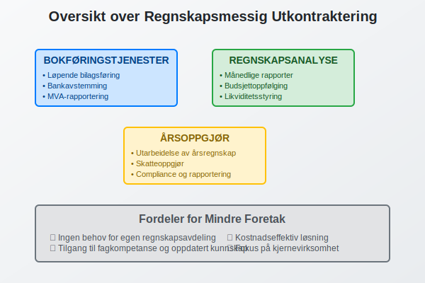

### IT-utkontraktering

Mange virksomheter velger å outsource IT-funksjoner:

* **Systemdrift** - servere, nettverk og infrastruktur
* **Applikasjonsutvikling** - utvikling av programvare og systemer
* **Brukerstøtte** - helpdesk og teknisk support
* **Sikkerhet** - cybersikkerhet og databackup

### Produksjonsutkontraktering

Spesielt vanlig i produksjonsbedrifter:

* **Komponentproduksjon** - deler av produksjonsprosessen
* **Logistikk** - lagring og distribusjon
* **Kvalitetskontroll** - testing og sertifisering
* **Emballasje** - pakking og merking

### Kundeserviceutkontraktering

* **Telefonsupport** - kundehenvendelser og support
* **Chat og e-post** - digital kundeservice
* **Teknisk support** - produktstøtte og feilsøking
* **Salgsaktiviteter** - telemarketing og oppfølging

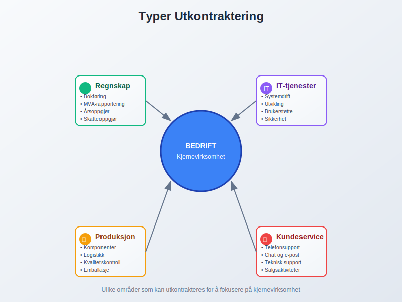

## Fordeler med Utkontraktering

### Kostnadsbesparelser

Utkontraktering kan gi betydelige **kostnadsreduksjoner**:

* **Reduserte lønnskostnader** - ingen behov for egne ansatte
* **Lavere infrastrukturkostnader** - mindre behov for lokaler og utstyr
* **Skalering av kostnader** - betaler kun for det som brukes
* **Eliminering av rekrutteringskostnader** - leverandør håndterer bemanning

#### Kostnadsammenligning

| Kostnadselement | **Intern drift** | **Utkontraktering** |
|-----------------|------------------|-------------------|
| **Lønn og sosiale kostnader** | 100% | 0% |
| **Lokaler og utstyr** | 100% | 20-30% |
| **Opplæring** | 100% | 0% |
| **Systemkostnader** | 100% | 30-50% |
| **Totale kostnader** | 100% | 40-70% |

### Tilgang til Ekspertise

Eksterne leverandører tilbyr ofte **spesialisert kompetanse**:

* **Fagekspertise** - dybdekunnskap innen spesifikke områder
* **Oppdatert kunnskap** - følger med på regelverksendringer
* **Best practices** - erfaring fra mange kunder
* **Teknologisk kompetanse** - tilgang til moderne systemer

### Fokus på Kjernevirksomhet

Utkontraktering frigjør ressurser til **strategiske aktiviteter**:

* **Mer tid til salg og markedsføring**
* **Fokus på produktutvikling**
* **Strategisk planlegging**
* **Kundeoppfølging**

### Fleksibilitet og Skalering

* **Rask oppskalering** ved økt aktivitet
* **Nedskalering** i roligere perioder
* **Tilgang til ressurser** uten langsiktige forpliktelser
* **Geografisk fleksibilitet** - leverandører kan være lokalisert hvor som helst

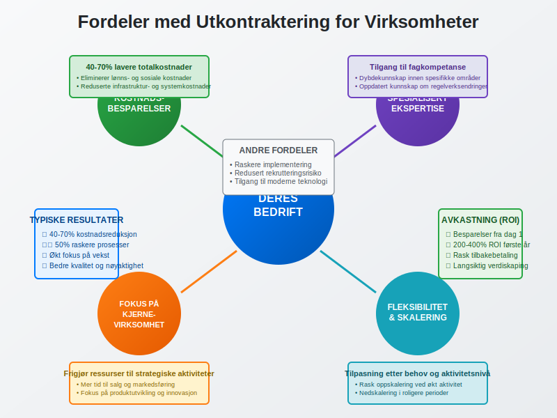

## Ulemper og Risikoer

### Tap av Kontroll

Utkontraktering kan medføre **redusert kontroll**:

* **Mindre direkte styring** av prosesser
* **Avhengighet av leverandør** for kritiske funksjoner
* **Begrenset innsikt** i daglige operasjoner
* **Vanskeligere å gjøre raske endringer**

### Kvalitetsrisiko

* **Varierende kvalitet** fra eksterne leverandører
* **Kommunikasjonsutfordringer** kan påvirke resultatet
* **Mindre forståelse** av virksomhetens spesifikke behov
* **Risiko for feil** som kan påvirke virksomheten

### Sikkerhet og Konfidensialitet

Spesielt kritisk ved utkontraktering av sensitive funksjoner:

#### Datarisiko
* **Tilgang til sensitive data** - kundeinfo, finansielle data
* **Risiko for datalekkasje** eller misbruk
* **Compliance-utfordringer** - GDPR og andre regelverk
* **Backup og gjenoppretting** av kritiske data

#### Forretningshemmeligheter
* **Tilgang til strategisk informasjon**
* **Risiko for konkurranse** fra leverandør
* **Beskyttelse av immaterielle rettigheter**
* **Konfidensialitetsavtaler** må være på plass

### Juridiske Risikoer

* **Kontraktsbrudd** fra leverandør
* **Ansvarsspørsmål** ved feil eller mangler
* **Regulatoriske krav** som må overholdes
* **Oppsigelse og overgang** til ny leverandør

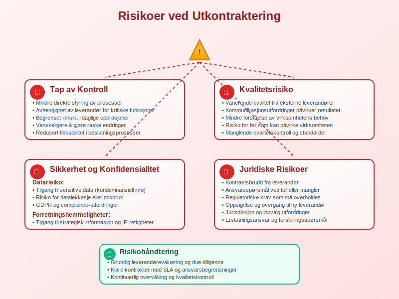

## Prosess for Utkontraktering

### 1. Behovsanalyse

Før utkontraktering må virksomheten gjøre en grundig **behovsanalyse**:

#### Kartlegging av Funksjoner
* **Identifiser** hvilke oppgaver som kan outsources
* **Vurder** kritikalitet og kompleksitet
* **Analyser** kostnader ved intern drift
* **Beregn** potensielle besparelser

#### Strategisk Vurdering
* **Kjernevirksomhet** - hva er virksomhetens hovedfokus?
* **Konkurransefortrinn** - hvilke funksjoner gir konkurransefortrinn?
* **Risikotoleranse** - hvor mye risiko kan virksomheten akseptere?
* **Langsiktige mål** - hvordan passer utkontraktering inn i strategien?

### 2. Leverandørvalg

#### Kvalifikasjonskriterier
* **Faglig kompetanse** og erfaring
* **Referanser** fra lignende oppdrag
* **Finansiell stabilitet** og soliditet
* **Sertifiseringer** og kvalitetssystemer

#### Evalueringsprosess
1. **Forespørsel om tilbud** (RFP - Request for Proposal)
2. **Vurdering av tilbud** mot fastsatte kriterier
3. **Referansesjekk** hos eksisterende kunder
4. **Forhandlinger** om pris og betingelser
5. **Endelig valg** av leverandør

### 3. Kontraktsinngåelse

#### Viktige Kontraktselementer
* **Tjenestebeskrivelse** - detaljert beskrivelse av oppgaver
* **Servicenivå** (SLA - Service Level Agreement)
* **Prising og betalingsbetingelser**
* **Konfidensialitetsklausuler**
* **Ansvar og erstatning**
* **Oppsigelsesbestemmelser**

#### Juridiske Aspekter
* **Personvern** og GDPR-compliance
* **Immaterielle rettigheter**
* **Underleverandører** og deres ansvar
* **Jurisdiksjon** og lovvalg

### 4. Implementering

#### Overgangsplan
* **Tidsplan** for overføring av oppgaver
* **Opplæring** av leverandør
* **Dataoverføring** og systemintegrasjon
* **Testperiode** før full drift

#### Kommunikasjon
* **Intern kommunikasjon** til ansatte
* **Ekstern kommunikasjon** til kunder og partnere
* **Kontaktpunkter** og ansvarsfordeling
* **Rapporteringsrutiner**

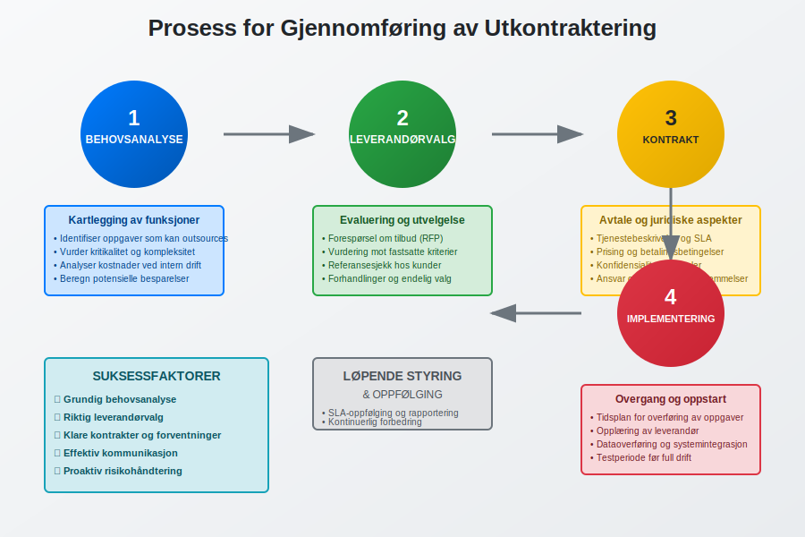

## Juridiske Aspekter

### Kontraktsrett

Utkontraktering reguleres primært av **kontraktsretten**:

#### Avtalefrihet
* **Partene** kan i utgangspunktet avtale fritt
* **Begrensninger** i avtaleloven og andre lover
* **Urimelige avtalevilkår** kan settes til side
* **Standardkontrakter** vs. individuelt tilpassede avtaler

#### Kontraktsbrudd
* **Mislighold** - når leverandør ikke oppfyller sine forpliktelser
* **Erstatning** for tap som følge av kontraktsbrudd
* **Heving** av kontrakt ved vesentlig mislighold
* **Tvangsfullbyrdelse** av kontraktuelle forpliktelser

### Arbeidsrett

Ved utkontraktering av oppgaver kan **arbeidsrettslige** spørsmål oppstå:

#### Virksomhetsoverdragelse
Hvis ansatte overføres til leverandør:
* **Arbeidsmiljøloven** kapittel 16 om virksomhetsoverdragelse
* **Rettigheter** følger med til ny arbeidsgiver
* **Informasjons- og drøftingsplikt** overfor ansatte
* **Beskyttelse** mot oppsigelse på grunn av overdragelse

#### Innleie vs. Utkontraktering
* **Innleiereglene** gjelder ikke ved ekte utkontraktering
* **Instruksjonsrett** - hvem styrer arbeidet?
* **Integrering** i oppdragsgivers virksomhet
* **Økonomisk risiko** - hvem bærer risikoen?

### Personvern (GDPR)

Ved utkontraktering av oppgaver som involverer personopplysninger:

#### Databehandleravtale
* **Behandlingsansvarlig** (oppdragsgiver) og **databehandler** (leverandør)
* **Skriftlig avtale** som regulerer behandlingen
* **Instrukser** for hvordan data skal behandles
* **Sikkerhetstiltak** for å beskytte personopplysninger

#### Overføring til Tredjeland
* **Adequacy decisions** - land med tilstrekkelig beskyttelse
* **Standard contractual clauses** (SCC)
* **Binding corporate rules** (BCR)
* **Risikovurdering** av overføring

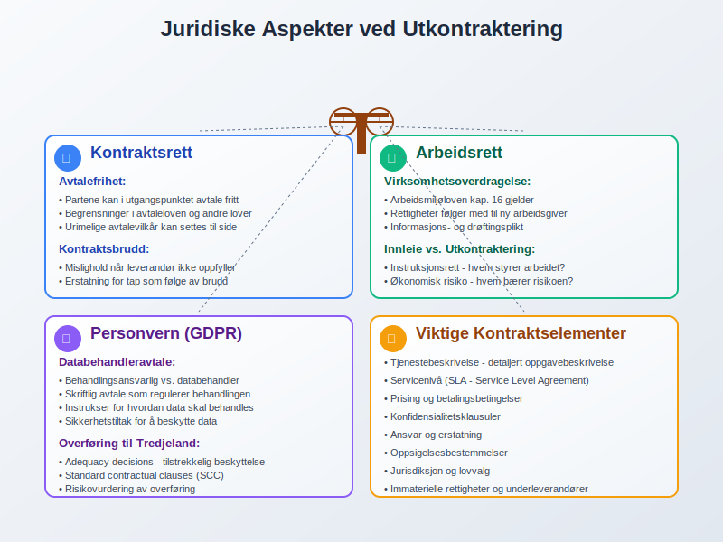

## Valg av Leverandør

### Evalueringskriterier

#### Faglig Kompetanse
* **Erfaring** innen relevant fagområde
* **Sertifiseringer** og kvalifikasjoner
* **Teamets kompetanse** og stabilitet
* **Oppdatering** av kunnskap og ferdigheter

#### Teknisk Kapasitet
* **IT-systemer** og infrastruktur
* **Integrasjonsmuligheter** med eksisterende systemer
* **Backup** og sikkerhetssystemer
* **Skalerbarhet** ved endrede behov

#### Økonomisk Soliditet
* **Finansiell stabilitet** og lønnsomhet
* **Kredittvurdering** og rating
* **Forsikringsdekning** for ansvar og tap
* **Langsiktig bærekraft** av forretningsmodellen

#### Referanser og Omdømme
* **Kundetilfredshetsundersøkelser**
* **Referansekunder** i lignende bransjer
* **Omdømme** i markedet
* **Klagehistorikk** og konflikthåndtering

### Due Diligence Prosess

#### Dokumentgjennomgang
* **Selskapsstruktur** og eierforhold
* **Finansielle rapporter** og nøkkeltall
* **Forsikringspoliser** og dekning
* **Compliance-dokumentasjon**

#### Stedlig Inspeksjon
* **Besøk** hos leverandør
* **Møte** med nøkkelpersonell
* **Gjennomgang** av arbeidsplasser og systemer
* **Vurdering** av sikkerhetstiltak

#### Referansesjekk
* **Kontakt** med eksisterende kunder
* **Spørsmål** om kvalitet, pålitelighet og service
* **Evaluering** av leverandørens styrker og svakheter
* **Vurdering** av kundetilfredshet

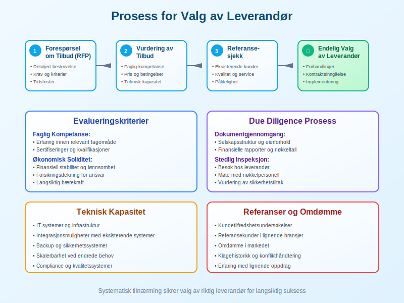

## Styring og Oppfølging

### Service Level Agreements (SLA)

**SLA** definerer forventet servicenivå og målbare kriterier:

#### Ytelsesmål
* **Responstid** - hvor raskt skal leverandør reagere?
* **Oppetid** - hvor mye nedetid er akseptabelt?
* **Kvalitetsmål** - feilrate, nøyaktighet, etc.
* **Tilgjengelighet** - når skal tjenesten være tilgjengelig?

#### MÃ¥ling og Rapportering
* **KPI-er** (Key Performance Indicators)
* **Rapporteringsfrekvens** - daglig, ukentlig, månedlig
* **Rapporteringsformat** og innhold
* **Eskalering** ved avvik fra målene

#### Konsekvenser ved Brudd
* **Service credits** - prisreduksjon ved dårlig ytelse
* **Bøter** for brudd på SLA
* **Rett til oppsigelse** ved gjentatte brudd
* **Erstatning** for tap som følge av dårlig service

### Governance-struktur

#### Styringskomité
* **Representanter** fra begge parter
* **Regelmessige møter** for oppfølging
* **Strategiske beslutninger** om tjenesten
* **Konfliktløsning** på høyt nivå

#### Operasjonell Styring
* **Daglig kontaktpunkt** hos begge parter
* **Operasjonelle møter** og rapportering
* **Problemløsning** og forbedringer
* **Endringshåndtering**

### Kontinuerlig Forbedring

* **Regelmessig evaluering** av tjenestekvalitet
* **Identifisering** av forbedringsområder
* **Implementering** av forbedringer
* **Benchmarking** mot markedsstandard

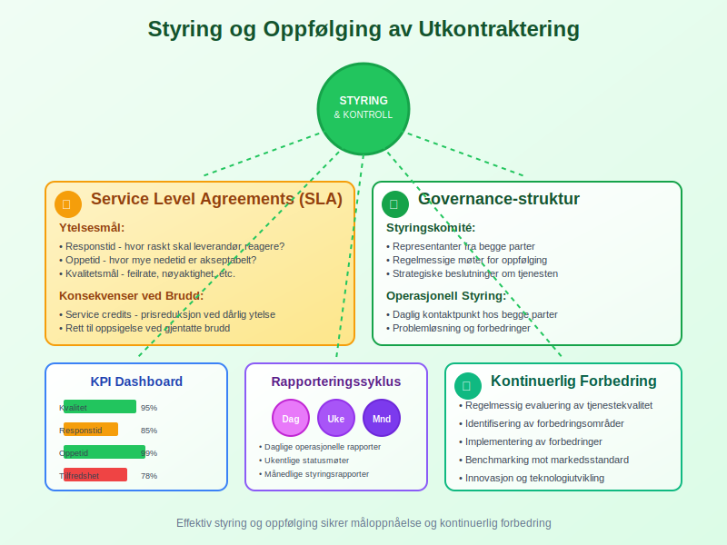

## Regnskapsmessige Konsekvenser

### Kostnadsføring

Utkontraktingskostnader skal behandles som **driftskostnader**:

#### Løpende Kostnader
* **MÃ¥nedlige** eller kvartalsvise fakturaer
* **Periodisering** av kostnader
* **Kontering** på riktige kostnadskonti
* **Budsjettoppfølging** og avviksanalyse

#### Engangskostnader
* **Implementeringskostnader** - oppsett og overgang
* **Opplæringskostnader** - intern og ekstern opplæring
* **Systemintegrasjon** - tekniske tilpasninger
* **Juridiske kostnader** - kontraktsutarbeidelse

### Balanseposter

#### Fordringer og Gjeld
* **Leverandørgjeld** for utestående fakturaer
* **Forskuddsbetalinger** til leverandør
* **Depositum** eller sikkerhetsstillelse
* **Tilgodehavender** ved overfakturering

#### Immaterielle Eiendeler
Ved overføring av systemer eller prosesser:
* **Vurdering** av overførte eiendeler
* **Avskrivning** av ikke lenger benyttede systemer
* **Goodwill** ved virksomhetsoverdragelse
* **Utviklingskostnader** for tilpasninger

### MVA-behandling

Utkontraktingstjenester er normalt **MVA-pliktige**:

#### Inngående MVA
* **Fradragsrett** for MVA på innkjøpte tjenester
* **Dokumentasjon** gjennom fakturaer
* **Periodisering** av MVA-fradrag
* **Rapportering** i [MVA-meldingen](/blogs/regnskap/hva-er-mva-melding "Hva er MVA-melding? Komplett Guide til Merverdiavgiftsrapportering")

#### Omvendt Avgiftsplikt
Ved kjøp av tjenester fra utlandet:
* **Omvendt avgiftsplikt** kan gjelde
* **Både utgående og inngående MVA**
* **Spesielle regler** for digitale tjenester
* **Registrering** i VOEC-registeret ved behov

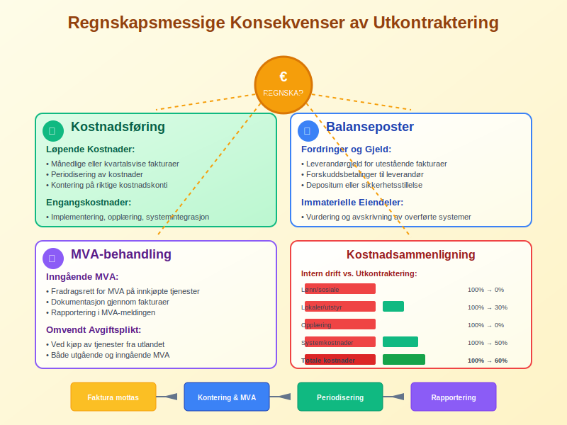

## Fremtidige Trender

### Digitalisering og Automatisering

Utkontraktingsbransjen påvirkes sterkt av **teknologisk utvikling**:

#### Robotisert Prosessautomatisering (RPA)
* **Automatisering** av repetitive oppgaver
* **Reduserte kostnader** og økt nøyaktighet
* **24/7 drift** uten menneskelig inngripen
* **Rask implementering** av endringer

#### Kunstig Intelligens (AI)
* **Maskinlæring** for forbedret tjenestekvalitet
* **Prediktiv analyse** for proaktiv problemløsning
* **Naturlig språkbehandling** for kundeservice
* **Automatisk rapportering** og analyse

#### Cloud-baserte Løsninger
* **Skalerbarhet** og fleksibilitet
* **Reduserte infrastrukturkostnader**
* **Forbedret sikkerhet** og backup
* **Global tilgjengelighet**

### Spesialisering og Nisjeområder

* **Høyt spesialiserte** tjenester innen smale fagområder
* **Bransjespesifikke** løsninger og ekspertise
* **Regulatorisk compliance** som spesialområde
* **Bærekraft og ESG-rapportering**

### Nearshoring og Reshoring

* **Nearshoring** - flytting til nærliggende land
* **Reshoring** - tilbakeføring til hjemmelandet
* **Risikohåndtering** og forsyningskjedesikkerhet
* **Geopolitiske** faktorer påvirker valg

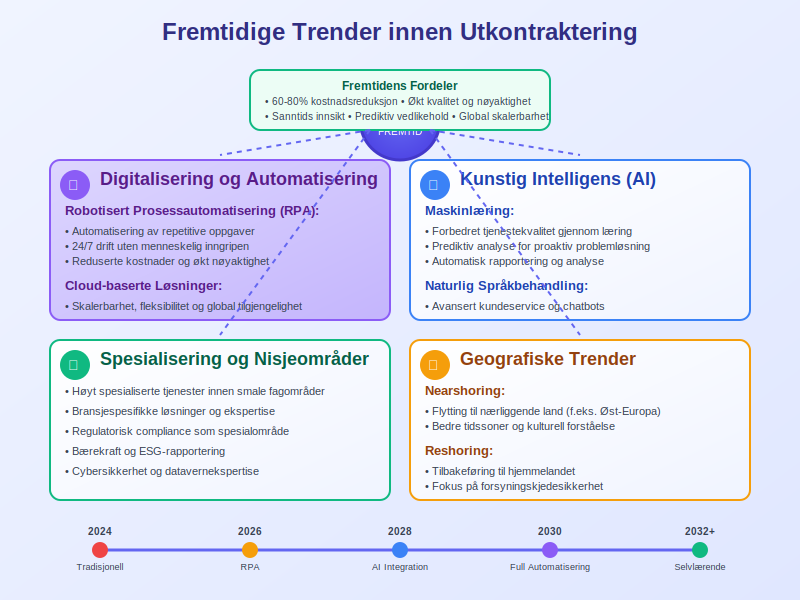

## Konklusjon

Utkontraktering kan være en **strategisk fordel** for virksomheter som ønsker å fokusere på sin kjernevirksomhet samtidig som de oppnår kostnadsbesparelser og tilgang til spesialisert kompetanse. Spesielt innen [regnskapsføring](/blogs/regnskap/hva-er-regnskap "Hva er Regnskap? Komplett Guide til Regnskapsføring") og administrative funksjoner kan utkontraktering gi betydelige fordeler for mindre og mellomstore [foretak](/blogs/regnskap/hva-er-foretak "Hva er et Foretak? Komplett Guide til Foretaksformer i Norge").

### Suksessfaktorer

For å lykkes med utkontraktering er det viktig å:

* **Gjøre grundige analyser** før beslutning
* **Velge riktig leverandør** basert på objektive kriterier
* **Inngå gode kontrakter** med klare forventninger
* **Etablere effektiv styring** og oppfølging
* **HÃ¥ndtere risiko** proaktivt

### Fremtidsperspektiv

Utkontraktering vil fortsette å utvikle seg med **teknologiske fremskritt** og endrede markedsbehov. Virksomheter som tar i bruk moderne utkontraktingsløsninger tidlig, vil kunne oppnå konkurransefortrinn gjennom økt effektivitet og reduserte kostnader.

Den viktigste faktoren for suksess er å **matche utkontraktingsstrategien** med virksomhetens overordnede mål og sikre at leverandørforholdet bygger på gjensidig tillit og forståelse.

