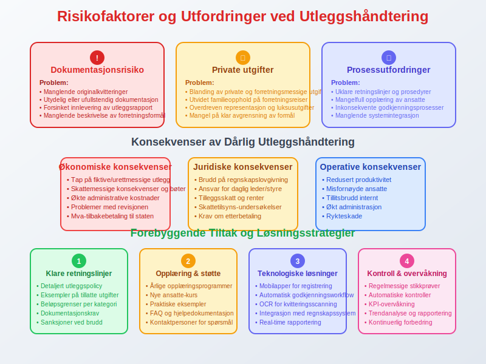

**Utlegg** er penger som ansatte eller andre forbundne parter legger ut på vegne av et selskap eller en organisasjon, som deretter refunderes av arbeidsgiver. Utlegg kan omfatte alt fra [reiseregning](/blogs/regnskap/reiseregning "Reiseregning - Guide til reiseregninger i Norsk Regnskap") for transport- og reiseutlegg (kilometergodtgjørelse dokumenteres gjennom en [kjørebok](/blogs/regnskap/hva-er-kjorebok "Hva er kjørebok? Komplett Guide til Kjørebok for Bedrifter i Norge")) og representasjonskostnader til innkjøp av kontormateriell og andre driftsrelaterte utgifter. Forståelse av utlegg er essensiell for riktig [regnskapsføring](/blogs/regnskap/hva-er-bokforing "Hva er Bokføring? En Komplett Guide til Norsk Regnskapsføring") og [internkontroll](/blogs/regnskap/hva-er-internkontroll "Hva er Internkontroll? En Guide til Effektiv Risikostyring") i bedrifter.

Les mer om spesifikke **ansattutlegg** i artikkelen [Ansattutlegg](/blogs/regnskap/ansattutlegg "Ansattutlegg - En komplett guide til utlegg fra ansatte"), og om **refunderbare utlegg for kjøpers regning** i kontoplanen på konto 3090 i artikkelen [Refunderbare utlegg for kjøpers regning, avgiftspl.](/blogs/kontoplan/3090-refunderbare-utlegg-for-kjopers-regning-avgiftspl "Konto 3090 - Refunderbare utlegg for kjøpers regning, avgiftspl."), for en detaljert gjennomgang av regnskapsføring, dokumentasjonskrav, skattemessige hensyn og beste praksis.


## Hva er Utlegg i Regnskapssammenheng?

Utlegg refererer til situasjoner hvor en person betaler utgifter på vegne av en bedrift med egne midler, med forventning om senere refusjon. Dette skiller seg fra direkte bedriftsutgifter som betales direkte fra selskapets kontoer. Utlegg krever særskilt dokumentasjon og behandling i regnskapet for å sikre korrekt rapportering og skattemessig behandling.

### Seksjon 1: Typer Utlegg

Utlegg kan kategoriseres i flere hovedtyper, hver med egne regnskapsmessige og skattemessige implikasjoner:


#### Reiseutlegg
* **Transport**: Fly, tog, buss, taxi og privatbil
* **Opphold**: Hotellutgifter, måltider og kost
* **Andre reiserelaterte kostnader**: Parkering, bomavgifter, bagasjeutgifter

#### Representasjonsutlegg
* **Kundemøter**: Måltider og underholdning med kunder
* **Konferanser**: Utgifter til faglige arrangementer
* **Gaver**: Mindre gaver til kunder eller samarbeidspartnere

#### Kontormateriell og Utstyr
* **Mindre anskaffelser**: Kontorrekvisita og programvare
* **Verktøy**: Arbeidsrelatert utstyr under bagatellgrensen

### Seksjon 2: Regnskapsføring av Utlegg

Korrekt regnskapsføring av utlegg følger spesifikke prinsipper som sikrer transparent og nøyaktig rapportering:


#### Periodisering og Timing
Utlegg skal [periodiseres](/blogs/regnskap/hva-er-periodisering "Hva er Periodisering? En Guide til Korrekt Regnskapsperioder") til den perioden hvor utgiften oppstår, ikke nødvendigvis når refusjonen skjer:

```
Debet: Relevant utgiftskonto (f.eks. 6000 Reisekostnader)
Kredit: 1940 Utlegg til ansatte
```

#### Dokumentasjonskrav
For alle utlegg kreves detaljert dokumentasjon:

* **Originalkvitteringer**: Alle utlegg må dokumenteres med original [kvittering](/blogs/regnskap/kvittering "Hva er Kvittering? En Guide til Kvitteringskrav i Norsk Regnskap") eller [faktura](/blogs/regnskap/hva-er-en-faktura "Hva er en Faktura? En Guide til Norske Fakturakrav")
* **Forretningsformål**: Klar beskrivelse av utgiftens relevans for virksomheten
* **Godkjenning**: Autorisasjon fra ansvarlig leder eller controller

### Seksjon 3: Skattemessige Aspekter

Skattemessig behandling av utlegg avhenger av utgiftens art og omfang:


#### Fradragsberettigede Utlegg
Utlegg som er **nødvendige** og **vanlige** for virksomheten er som regel fradragsberettigede:

| Utgiftstype | Fradragsrett | Dokumentasjon |
|-------------|--------------|---------------|
| Nødvendige reiseutgifter | Full fradragsrett | Kvittering + reiseregning |
| Representasjon (50% regel) | Begrenset fradrag | Kvittering + forretningsformål |
| Kontormateriell | Full fradragsrett | Kvittering + relevans |
| Privatutgifter | Ingen fradragsrett | Ikke aktuelt |

#### Merverdiskattemessige Hensyn
Utlegg kan ha forskjellige [mva](/blogs/regnskap/skattemelding "Skattemelding: En Komplett Guide til Innlevering og Frister")-konsekvenser:

* **Mva-pliktige utgifter**: Bedriften kan trekke fra **[inngående mva](/blogs/regnskap/inngaaende-mva "Inngående mva: Fradragsføres i regnskapet")**
* **Mva-fritatte utgifter**: Ingen mva-fradrag
* **Blandede utgifter**: Må fordeles mellom fradragsberettiget og ikke-fradragsberettiget del

### Seksjon 4: Digitale Løsninger for Utleggshåndtering

Moderne bedrifter benytter digitale verktøy for effektiv utleggshåndtering:


#### Automatisering og Workflow
* **Mobilapplikasjoner**: For fotografering og registrering av [kvitteringer](/blogs/regnskap/kvittering "Hva er Kvittering? En Guide til Kvitteringskrav i Norsk Regnskap")
* **Automatisk kategorisering**: AI-basert klassifisering av utgifter
* **Godkjenningsworkflow**: Digitale godkjenningsprosesser

#### Integrasjon med Regnskapssystemer
Moderne utleggsløsninger integreres direkte med [ERP-systemer](/blogs/regnskap/hva-er-erp-system "Hva er ERP-system? En Guide til Integrerte Bedriftsløsninger"):

* **Automatisk bokføring**: Direkte overføring til regnskapssystem
* **Kontrollfunksjoner**: Automatisk sjekk mot budsjetter og retningslinjer
* **Rapportering**: Real-time oversikt over utleggsstatus

### Seksjon 5: Kontroll og Compliance

Effektiv kontroll av utlegg sikrer både regnskapsmessig korrekthet og kostnadsoptimalisering:


#### Internkontrollsystemer
* **Beløpsgrenser**: Definerte grenser for ulike utleggstyper
* **Dokumentasjonskrav**: Spesifikke krav til [kvitteringer](/blogs/regnskap/kvittering "Hva er Kvittering? En Guide til Kvitteringskrav i Norsk Regnskap") og dokumentasjon
* **Godkjenningsmatriser**: Klare retningslinjer for hvem som kan godkjenne hva

#### Revisjons- og Kontrolltiltak
* **Stikkprøvekontroller**: Regelmessig gjennomgang av utleggsrapporter
* **Trendanalyser**: Identifisering av uvanlige mønstre eller utgifter
* **Leverandørvalidering**: Kontroll av ekstraordinære utgifter

### Seksjon 6: Utfordringer og Fallgruver

Utleggshåndtering kan medføre flere risikofaktorer som bedrifter må være oppmerksom på:



#### Vanlige Problemer
* **Manglende dokumentasjon**: Utgifter uten tilstrekkelig dokumentasjon
* **Privat/forretningsmessig blanding**: Utgifter som delvis er private
* **Forsinket rapportering**: Utlegg som rapporteres for sent
* **Uklare retningslinjer**: Mangel på tydelige regler for utlegg

#### Løsningsstrategier
* **Klare retningslinjer**: Detaljerte utleggspolicies for ansatte
* **Regelmessig opplæring**: Kursing i korrekt utleggshåndtering
* **Teknologiske løsninger**: Investering i moderne utleggssystemer

### Seksjon 7: Juridiske og Regulatoriske Aspekter

Utleggshåndtering må følge norsk lovgivning og regnskapsstandarder:


#### Regnskapsloven og Bokføringsforskriften
* **Dokumentasjonsplikt**: Alle utlegg må dokumenteres i henhold til [regnskapsloven](/blogs/regnskap/hva-er-bokforing "Hva er Bokføring? En Komplett Guide til Norsk Regnskapsføring")
* **Oppbevaringsplikt**: Kvitteringer og dokumentasjon må oppbevares i minst 5 år
* **Kontrollspor**: Klar sammenheng mellom utlegg og regnskapsføring

#### Arbeidsrettslige Hensyn
* **Arbeidsavtaler**: Utleggsregler bør inkluderes i [arbeidskontrakter](/blogs/regnskap/arbeidskontrakten "Arbeidskontrakten").
* **Refusjonsfrister**: Klare frister for utleggsrapportering og refusjon
* **Rimelighetsvurderinger**: Utlegg må være rimelige og nødvendige

### Seksjon 8: Beste Praksis for Utleggshåndtering

Implementering av beste praksis sikrer effektiv og compliant utleggshåndtering:


#### Retningslinjer for Ansatte
* **Forhåndsgodkjenning**: Større utlegg bør godkjennes på forhånd
* **Kvitteringsrutiner**: Umiddelbar fotografering og lagring av [kvitteringer](/blogs/regnskap/kvittering "Hva er Kvittering? En Guide til Kvitteringskrav i Norsk Regnskap")
* **Månedlig rapportering**: Regelmessig innlevering av utleggsrapporter

#### Organisatoriske Tiltak
* **Sentral koordinering**: Dedikert ansvarlig for utleggshåndtering
* **Systemer og verktøy**: Investering i passende teknologiske løsninger
* **Kontinuerlig forbedring**: Regelmessig evaluering og oppdatering av prosesser

### Seksjon 9: Fremtidige Trender og Utvikling

Utleggshåndtering utvikler seg kontinuerlig med teknologiske fremskritt:


#### Teknologiske Innovasjoner
* **Kunstig intelligens**: Automatisk kategorisering og validering av utgifter
* **Blockchain**: Sikker og transparent dokumentasjon av transaksjoner
* **Mobil teknologi**: Forbedrede mobilløsninger for real-time registrering

#### Regulatoriske Endringer
* **Digitalisering**: Økt fokus på digitale [kvitteringer](/blogs/regnskap/kvittering "Hva er Kvittering? En Guide til Kvitteringskrav i Norsk Regnskap") og dokumentasjon
* **Miljøhensyn**: Redusert papirbruk og miljøvennlige løsninger
* **Internasjonalisering**: Standardisering på tvers av landegrenser

## Konklusjon

Utlegg representerer en viktig del av bedrifters økonomiske forvaltning som krever systematisk tilnærming og grundig kontroll. Ved å implementere klare retningslinjer, moderne teknologiske løsninger og robuste kontrollsystemer kan bedrifter sikre både regnskapsmessig korrekthet og kostnadseffektivitet. Forståelse av utleggets ulike dimensjoner - fra grunnleggende definisjon til komplekse skattemessige implikasjoner - er avgjørende for å opprettholde [god regnskapsskikk](/blogs/regnskap/god-regnskapsskikk "God Regnskapsskikk: Prinsipper og Beste Praksis") og ensure compliance med norske regnskapsregler.

Effektiv utleggshåndtering bidrar ikke bare til nøyaktig [regnskapsføring](/blogs/regnskap/hva-er-bokforing "Hva er Bokføring? En Komplett Guide til Norsk Regnskapsføring"), men også til bedre kostnadskontroll og økt ansvarsstyring i organisasjonen. Gjennom kontinuerlig forbedring og tilpasning til nye teknologiske muligheter kan bedrifter optimalisere sine utleggsprosesser og skape betydelig verdi for organisasjonen.


