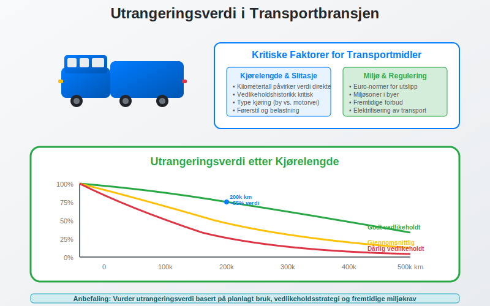
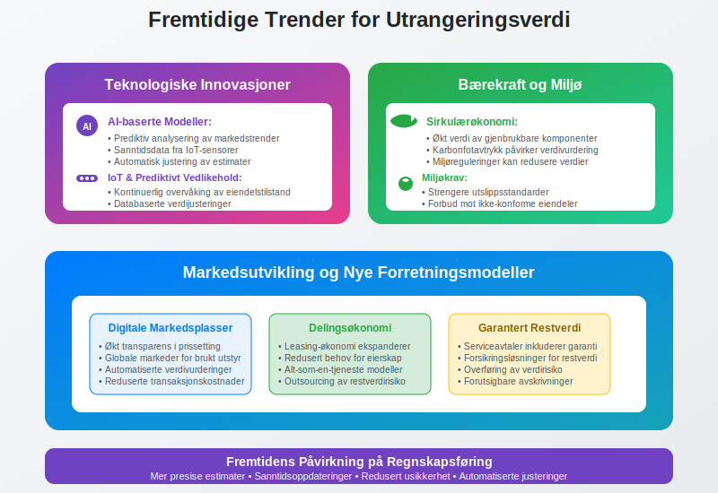

**Utrangeringsverdi** er den **estimerte salgsverdien** av et [anleggsmiddel](/blogs/regnskap/hva-er-anleggsmidler "Hva er Anleggsmidler? Materielle, Immaterielle og Finansielle Eiendeler") ved utløpet av dets **brukstid**, også kalt **restverdi** eller **sluttverdi**. Dette er en kritisk komponent i [avskrivningsberegninger](/blogs/regnskap/hva-er-avskrivning "Hva er Avskrivning i Regnskap? Metoder, Beregning og Praktiske Eksempler") og påvirker både [regnskapsføring](/blogs/regnskap/hva-er-bokforing "Hva er Bokføring? Komplett Guide til Bokføringsprinsipper") og **investeringsbeslutninger**.

Utrangeringsverdi inngår som en sentral del av [anskaffelseskostnadsvurderinger](/blogs/regnskap/hva-er-anskaffelser "Hva er Anskaffelser? Komplett Guide til Anskaffelsesprosess og Regnskapsføring") og må vurderes nøye for å sikre korrekt beregning av avskrivningsgrunnlaget.


## Hva er Utrangeringsverdi?

**Utrangeringsverdi** representerer den **forventede markedsverdien** av en eiendel når virksomheten planlegger å avhende den ved slutten av brukstiden. Dette er ikke det samme som eiendelens verdi hvis den ble solgt i dag, men en prognose for fremtidig verdi.

### Grunnleggende Prinsipper

Utrangeringsverdi baserer seg på flere faktorer:

* **Markedsforhold** på utrangeringstidspunktet
* **Eiendelens tilstand** etter brukstid
* **Teknologisk utvikling** som kan påvirke verdien
* **Etterspørsel** etter brukte eiendeler i markedet
* **[Avskrivningsmønstre](/blogs/regnskap/hva-er-avskrivning "Hva er Avskrivning i Regnskap? Metoder, Beregning og Praktiske Eksempler")** som gjenspeiler verdifall

### Forhold til Avskrivning

Utrangeringsverdi er direkte knyttet til avskrivningsberegninger:

```
Avskrivningsgrunnlag = Anskaffelseskost - Utrangeringsverdi
```

Dette betyr at en **høyere utrangeringsverdi** gir **lavere årlige avskrivninger**, mens en **lavere utrangeringsverdi** øker avskrivningskostnadene.

## Beregning av Utrangeringsverdi

### Faktorer som PÃ¥virker Utrangeringsverdi


#### Tekniske Faktorer
* **Slitasje og elde:** Fysisk tilstand ved brukstidsutløp
* **Teknologisk foreldelse:** Utviklingen av ny teknologi
* **Vedlikeholdstilstand:** Kvaliteten på vedlikehold gjennom brukstiden
* **Oppgraderinger:** Forbedringer som kan øke verdien

#### Markedsfaktorer
* **Andrehåndsmarked:** Tilgjengelighet og aktivitet
* **Etterspørsel:** Behov for brukte eiendeler av samme type
* **Konkurrerende produkter:** Nye alternativer som påvirker verdi
* **Geografisk beliggenhet:** Regional variasjon i verdier

#### Juridiske og Regulatoriske Faktorer
* **Miljøkrav:** Nye reguleringer som kan påvirke brukbarhet
* **Sikkerhetsstandarder:** Endrede krav som kan kreve oppgraderinger
* **Bransjestandarder:** Utvikling av nye krav og normer

### Estimeringsmetoder

#### 1. Sammenlignbar Salgsdata
Bruk **historiske salgsdata** for lignende eiendeler:
- Analyser tidligere salg av identiske eller sammenlignbare eiendeler
- Juster for inflasjon og markedsutvikling
- Vurder eiendelens spesifikke egenskaper

#### 2. Ekspertvurdering
**Profesjonelle takstmenn** kan gi estimater basert på:
- Bransjeerfaring og markedskunnskap
- Teknisk vurdering av eiendelens tilstand
- Analyse av markedstrender

#### 3. Teoretiske Modeller
Bruk **finansielle modeller** som tar hensyn til:
- Nåverdi av fremtidige kontantstrømmer
- Inflasjonsjusteringer
- Risikopremier for usikkerhet

## Praktiske Eksempler

### Eksempel 1: Firmabil

Et selskap kjøper en firmabil for **400.000 kr** med planlagt brukstid på **5 år**.


**Vurdering av utrangeringsverdi:**
- **Markedspris** for 5 år gamle biler av samme merke: 25-30% av nypris
- **Estimert utrangeringsverdi:** 400.000 × 28% = **112.000 kr**
- **Avskrivningsgrunnlag:** 400.000 - 112.000 = **288.000 kr**
- **Årlig avskrivning:** 288.000 ÷ 5 = **57.600 kr**

### Eksempel 2: Produksjonsutstyr

En maskin kjøpes for **800.000 kr** med forventet brukstid på **10 år**.

**Estimering av utrangeringsverdi:**
- **Skrapverdi** av metall og komponenter: 50.000 kr
- **Potensielt annenhåndsmarked:** Begrenset, spesialisert utstyr
- **Teknologisk utvikling:** Rask, kan redusere verdi betydelig
- **Estimert utrangeringsverdi:** **75.000 kr** (konservativt anslag)

**Beregning:**
- **Avskrivningsgrunnlag:** 800.000 - 75.000 = 725.000 kr
- **Årlig lineær avskrivning:** 725.000 ÷ 10 = 72.500 kr

### Eksempel 3: IT-utstyr

Servere kjøpes for **300.000 kr** med brukstid på **4 år**.

**Vurdering:**
- **Teknologisk foreldelse:** Svært rask i IT-bransjen
- **Andrehåndsmarked:** Begrenset for eldre servere
- **Sikkerhetskrav:** Kan kreve oppdateringer som ikke er mulig
- **Estimert utrangeringsverdi:** **15.000 kr** (hovedsakelig komponentverdi)

## Regnskapsføring og Utrangeringsverdi

### Påvirkning på Regnskapet


#### Resultatregnskap
* **Lavere avskrivningskostnader** med høy utrangeringsverdi
* **Høyere avskrivningskostnader** med lav utrangeringsverdi
* **Jevnere kostnadsfordeling** over brukstiden

#### Balanse
* **Bokført verdi** påvirkes av avskrivningsmønsteret
* **Realistisk verdivurdering** ved korrekt estimat
* **[Nedskrivningsvurderinger](/blogs/regnskap/hva-er-nedskrivning "Hva er Nedskrivning? Komplett Guide til Nedskrivning av Eiendeler i Norsk Regnskap")** kan bli nødvendig hvis estimat endres

### Justering av Utrangeringsverdi

Utrangeringsverdi bør **revurderes regelmessig**:

#### Ã…rsaker til Justering
* **Markedsendringer:** Vesentlige endringer i etterspørsel
* **Teknologisk utvikling:** Raskere eller langsommere enn forventet
* **Regulatoriske endringer:** Nye krav som påvirker verdien
* **Vedlikeholdsstatus:** Bedre eller dårligere enn planlagt

#### Regnskapsmessig Behandling
NÃ¥r utrangeringsverdi endres **prospektivt**:

```
Nytt avskrivningsgrunnlag = Bokført verdi - Ny utrangeringsverdi
Ny årlig avskrivning = Nytt avskrivningsgrunnlag ÷ Gjenværende brukstid
```

**Eksempel på justering:**
- Opprinnelig utrangeringsverdi: 100.000 kr
- Ny vurdering etter 3 år: 60.000 kr
- Bokført verdi: 250.000 kr
- Gjenværende brukstid: 2 år
- **Ny årlig avskrivning:** (250.000 - 60.000) ÷ 2 = 95.000 kr

## Skattemessige Konsekvenser

### Utrangeringsverdi og Skatt


#### Avskrivninger for Skatteformål
* **[Saldoavskrivning](/blogs/regnskap/hva-er-saldoavskrivning "Hva er Saldoavskrivning i Regnskap? Komplett Guide til Degressiv Avskrivning")** bruker ikke utrangeringsverdi direkte
* **Lineære avskrivninger** kan bruke utrangeringsverdi i beregningen
* **Skattemessige regler** kan avvike fra regnskapsmessige vurderinger

#### Realisasjon ved Salg
Når eiendelen faktisk selges, oppstår **gevinst eller tap**:

```
Gevinst/Tap = Faktisk salgspris - Bokført verdi ved salg
```

**Skattemessig behandling:**
* **Gevinst:** Skattepliktig inntekt (kan inngå i [saldogruppe](/blogs/regnskap/saldogruppe "Hva er Saldogruppe? Guide til Skattemessige Avskrivningsgrupper"))
* **Tap:** Fradragsberettiget kostnad
* **Timing:** Beskatning/fradrag i realiseringsåret

## Bransjespecifikke Vurderinger

### Transport og Logistikk



**Faktorer for transportmidler:**
* **Kjørelengde:** Påvirker slitasje og verdi
* **Vedlikeholdshistorikk:** Kritisk for videre brukbarhet
* **Miljøkrav:** Nye utslippsstandarder kan redusere verdi
* **Merke og modell:** Enkelte merker holder verdien bedre

### Teknologi og IT

**Spesielle hensyn for IT-utstyr:**
* **Rask teknologisk utvikling** reduserer utrangeringsverdi betydelig
* **Sikkerhetsoppdateringer** kan stoppe, noe som påvirker brukbarhet
* **Energieffektivitet** blir viktigere og påvirker verdien
* **Kompatibilitet** med nye systemer er avgjørende

### Produksjon og Industri

**Industrielt utstyr krever spesiell vurdering:**
* **Spesialisering:** Høyt spesialisert utstyr har lavere utrangeringsverdi
* **Modulær oppbygning:** Kan gi høyere verdi ved salg av deler
* **Industristandard:** Standardisert utstyr lettere å selge videre
* **Vedlikeholdskostnader:** Påvirker attraktiviteten for kjøpere

## Digitale Verktøy og Modeller

### Verdsettelsessystemer


Moderne verktøy for å estimere utrangeringsverdi:

#### Markedsdatabaser
* **Historiske salgsdata** for sammenlignbare eiendeler
* **Prisutviklingsindekser** for justeringer
* **Geografiske variasjoner** i verdier

#### Prediktive Modeller
* **Maskinlæring** for å analysere verdimønstre
* **Regresjon** basert på tekniske og markedsmessige faktorer
* **Scenarioanalyse** for ulike markedsutvikling

#### Integrasjon med Regnskapssystemer
* **Automatisk oppdatering** av avskrivningsberegninger
* **Varsler** ved behov for revurdering
* **Rapportering** av avvik mellom estimat og faktisk verdi

## Utfordringer og Risikofaktorer

### Vanlige Feil i Estimering


#### Overoptimistiske Estimater
* **For høye vurderinger** gir for lave avskrivninger
* **Undervurderer teknologisk utvikling**
* **Neglisjerer markedsendringer**

#### Underkonservative Estimater
* **For lave vurderinger** gir unødvendig høye avskrivninger
* **Overvurderer verdifall**
* **Ignorerer kvalitetsvedlikehold**

### Risikohåndtering

#### Regelmessig Revurdering
* **Ã…rlige vurderinger** av store eiendeler
* **Kontinuerlig overvåking** av markedsutvikling
* **Dokumentasjon** av endringer og begrunnelser

#### Konservative Tilnærminger
* **Forsiktighetsprinsippet:** Velg lavere verdier ved usikkerhet
* **Sensitivitetsanalyse:** Test påvirkning av ulike estimater
* **Buffere:** Inkluder margin for uforutsette endringer

## Strategiske Beslutninger

### Påvirkning på Investeringsbeslutninger


#### Investeringsevaluering
* **[Nåverdiberegninger](/blogs/regnskap/hva-er-diskontering "Hva er Diskontering? Komplett Guide til Nåverdi og Diskonterte Kontantstrømmer")** inkluderer utrangeringsverdi
* **Tilbakebetalingstid** påvirkes av estimert restverdi
* **Totalomkostnad** over eiendelens levetid

#### Leasing vs. Kjøp
* **Høy utrangeringsverdi** kan favorisere kjøp
* **Lav utrangeringsverdi** kan gjøre leasing mer attraktivt
* **Risikooverføring** ved leasing reduserer usikkerhet

### Timing av Utrangering

#### Optimal Utrangeringstidspunkt
* **Vedlikeholdskostnader** øker over tid
* **Teknologisk foreldelse** akselererer verdifall
* **Markedsmuligheter** kan variere

#### Erstatningsplanlegging
* **Koordinering** med budsjett- og investeringsplaner
* **Teknologiroadmaps** påvirker timing
* **Kapasitetsbehov** setter rammer for utrangering

## Forhold til Andre Regnskapsbegreper

### Sammenheng med [Kapitalkostnader](/blogs/regnskap/hva-er-kapital "Hva er Kapital? Komplett Guide til Egenkapital, Fremmedkapital og Arbeidskapital")

Utrangeringsverdi påvirker **totalkapitalkostnaden**:

* **Lavere utrangeringsverdi** øker kapitalkostnaden
* **Høyere utrangeringsverdi** reduserer kapitalkostnaden
* **Viktig faktor** i [avkastningsberegninger](/blogs/regnskap/hva-er-avkastning "Hva er Avkastning? Komplett Guide til Rentabilitet og Lønnsomhet")

### Relasjon til [Balanse](/blogs/regnskap/hva-er-balanse "Hva er Balanse? Komplett Guide til Balansen i Regnskap") og [Verdivurdering](/blogs/regnskap/hva-er-balansebasert-verdivurdering "Balansebasert Verdivurdering - Metoder, Prinsipper og Praktisk Anvendelse")

* **Realistisk balanseverdier** avhenger av korrekte utrangeringsverdier
* **[Nedskrivningsvurderinger](/blogs/regnskap/hva-er-nedskrivning "Hva er Nedskrivning? Komplett Guide til Nedskrivning av Eiendeler i Norsk Regnskap")** må ta hensyn til endrede utrangeringsverdier
* **Genvinnbart beløp** kan påvirkes av utrangeringsverdi

## Regulatoriske Krav og Standarder

### Norske Regnskapsstandarder


#### God Regnskapsskikk
* **[God regnskapsskikk](/blogs/regnskap/god-regnskapsskikk "God Regnskapsskikk - Prinsipper, Regler og Praktisk Anvendelse")** krever realistiske estimater
* **Dokumentasjon** av vurderingsgrunnlag
* **Konsistens** i metoder over tid

#### Regnskapslovens Krav
* **Forsiktighetsprinsippet** ved usikre estimater
* **Sammenstillingsprinsippet** i avskrivningsberegninger
* **Opplysningsplikt** om vesentlige forutsetninger

### Internasjonale Standarder

#### IFRS-krav
* **IAS 16** regulerer materielle anleggsmidler
* **Ã…rlig vurdering** av brukstid og restverdi
* **Prospektiv behandling** av endringer

#### Forskjeller mellom IFRS og Norsk GAAP
* **Hyppigere revurdering** under IFRS
* **Mer detaljerte krav** til dokumentasjon
* **Strengere krav** til testing av forutsetninger

## Fremtidige Trender og Utvikling

### Teknologisk PÃ¥virkning



#### Digitalisering og Automatisering
* **AI-baserte modeller** for verdivurdering
* **Sanntidsdata** fra IoT-sensorer på eiendeler
* **Prediktivt vedlikehold** påvirker verdiutvikling

#### Miljø- og Bærekraftskrav
* **Sirkulærøkonomi** kan øke verdien av gjenbrukbare komponenter
* **Miljøreguleringer** kan redusere verdien av ikke-konforme eiendeler
* **Karbon-footprint** blir viktigere i verdivurderinger

### Markedsendringer

#### Nye Forretningsmodeller
* **Leasing-økonomi** reduserer behov for kjøp av brukt utstyr
* **Serviceavtaler** kan inkludere garantert utrangeringsverdi
* **Digitale markedsplasser** øker transparens i prissetting

## Praktisk Implementering

### Etablering av Rutiner


#### Organisatoriske Prosesser
1. **Ansvarsfordeling:** Klargjør hvem som skal estimere og godkjenne
2. **Retningslinjer:** Utvikle interne regler for estimering
3. **Dokumentasjon:** Sikre sporbarhet i vurderinger
4. **Kvalitetssikring:** Etabler kontrollmekanismer

#### Systemstøtte
* **Integrasjon** med [anleggsmiddelregister](/blogs/regnskap/hva-er-anleggsmidler "Hva er Anleggsmidler? Materielle, Immaterielle og Finansielle Eiendeler")
* **Automatiske varsler** ved behov for revurdering
* **Rapporteringsverktøy** for oppfølging og analyse

### Beste Praksis

#### Vurderingsprinsipper
* **Konservative estimater** ved høy usikkerhet
* **Markedsbaserte metoder** når data er tilgjengelig
* **Ekspertvurderinger** for spesialiserte eiendeler
* **Regelmessige oppdateringer** basert på ny informasjon

#### Kvalitetskontroll
* **Dokumentasjon** av alle forutsetninger og metoder
* **Benchmarking** mot faktiske salgsresultater
* **Sensitivitetsanalyse** for kritiske parametere
* **Ekstern validering** ved behov

## Relaterte Begreper og Konsepter

For å forstå utrangeringsverdi fullt ut, bør du også kjenne til:

* **[Avskrivning](/blogs/regnskap/hva-er-avskrivning "Hva er Avskrivning i Regnskap? Metoder, Beregning og Praktiske Eksempler")** - Hvordan utrangeringsverdi påvirker avskrivningsberegninger
* **[Anleggsmidler](/blogs/regnskap/hva-er-anleggsmidler "Hva er Anleggsmidler? Materielle, Immaterielle og Finansielle Eiendeler")** - Eiendelene som har utrangeringsverdi
* **[Anskaffelseskost](/blogs/regnskap/hva-er-anskaffelseskost "Hva er Anskaffelseskost? Komplett Guide til Beregning og Regnskapsføring")** - Utgangspunktet for avskrivningsberegning
* **[Nedskrivning](/blogs/regnskap/hva-er-nedskrivning "Hva er Nedskrivning? Komplett Guide til Nedskrivning av Eiendeler i Norsk Regnskap")** - Når bokført verdi overstiger gjenvinnbart beløp
* **[Saldoavskrivning](/blogs/regnskap/hva-er-saldoavskrivning "Hva er Saldoavskrivning i Regnskap? Komplett Guide til Degressiv Avskrivning")** - Skattemessig avskrivningsmetode
* **[Balansebasert verdivurdering](/blogs/regnskap/hva-er-balansebasert-verdivurdering "Balansebasert Verdivurdering - Metoder, Prinsipper og Praktisk Anvendelse")** - Prinsipielle tilnærminger til verdivurdering

## Konklusjon

**Utrangeringsverdi** er en **kritisk komponent** i regnskapsføring og finansiell planlegging som krever nøye vurdering og regelmessig oppfølging. Korrekt estimering av utrangeringsverdi påvirker:

* **Avskrivningsberegninger** og kostnadsfordeling over tid
* **Investeringsbeslutninger** og [kapitalbudsjettering](/blogs/regnskap/hva-er-budsjettering "Hva er Budsjettering? Komplett Guide til Budsjettplanlegging og Budsjettkontroll")
* **Skattemessige konsekvenser** av eiendelsforvaltning
* **Balanseverdier** og [finansiell rapportering](/blogs/regnskap/hva-er-regnskap "Hva er Regnskap? En komplett guide")

Ved å etablere **robuste prosesser** for estimering, overvåking og justering av utrangeringsverdi kan virksomheter:

* **Optimalisere** sine investeringsbeslutninger
* **Forbedre** nøyaktigheten i finansiell rapportering
* **Redusere** risiko knyttet til eiendelsverdier
* **Sikre** regelverkskomplians og god regnskapsskikk

Utrangeringsverdi representerer således et **viktig bindingsledd** mellom strategisk planlegging, operasjonell drift og finansiell rapportering i moderne bedriftsstyring.


