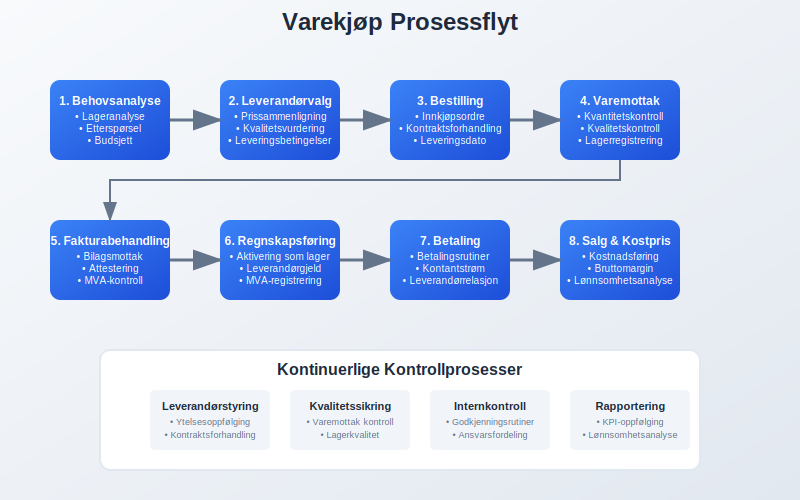
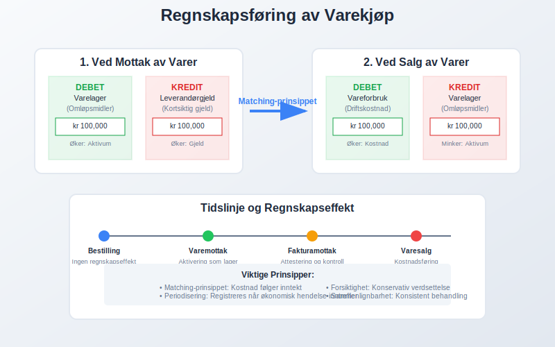
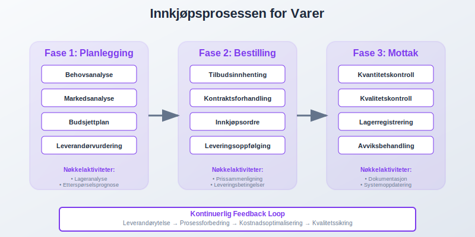
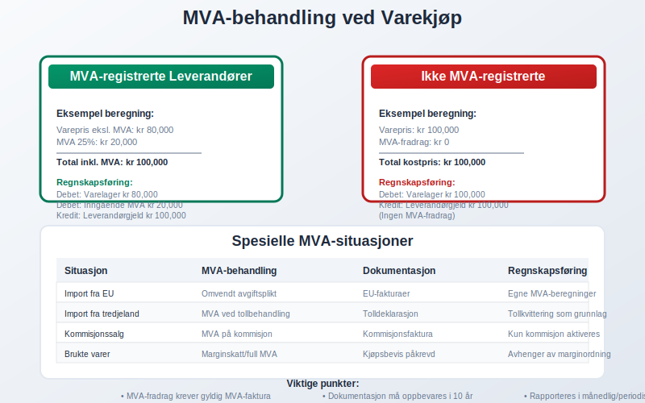
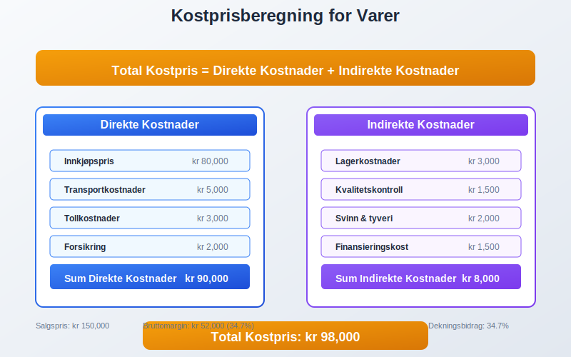
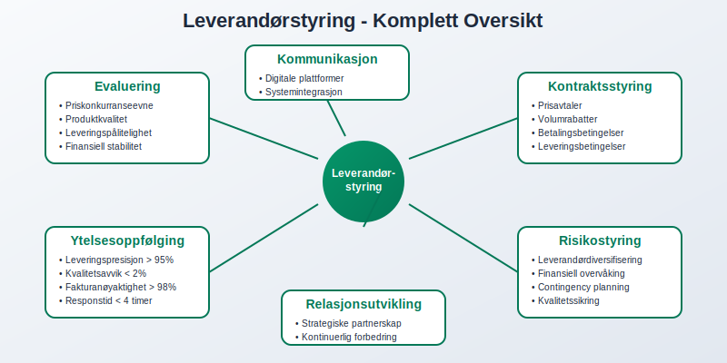
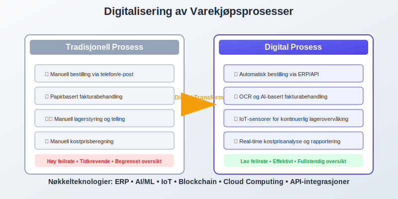
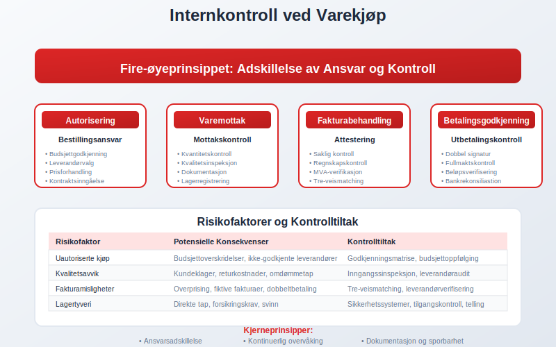
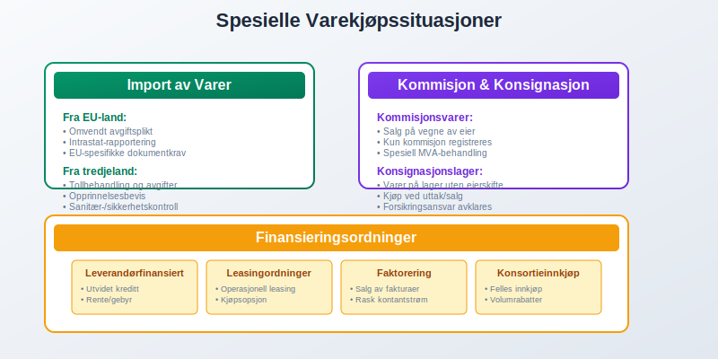
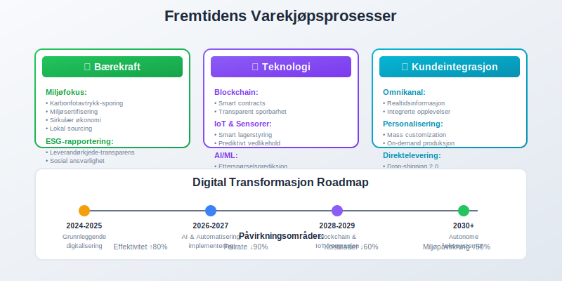

---
title: "Hva er varekjøp?"
seoTitle: "Hva er varekjøp | Regler og bokføring"
description: "Varekjøp er anskaffelse av varer for videresalg. Lær hvordan varekjøp påvirker lager, likviditet og varekostnad, og hvordan kjøp bokføres og håndteres med MVA."
summary: "Forklarer varekjøp fra A til Å: prosess, periodisering, MVA-behandling og praktisk bokføring for handelsbedrifter."
---

**Varekjøp** er anskaffelse av varer som skal selges videre til kunder, og utgjør en av de største kostnadene for handelsvirksomheter. Dette er [varelager](/blogs/regnskap/hva-er-varelager "Hva er Varelager? Komplett Guide til Lagerforvaltning og Regnskapsføring") som kjøpes inn for videresalg og representerer bedriftens [omløpsmidler](/blogs/regnskap/hva-er-omlopsmdler "Hva er Omløpsmidler? Komplett Guide til Kortsiktige Eiendeler"). Korrekt håndtering av varekjøp påvirker direkte bedriftens lønnsomhet, [arbeidskapital](/blogs/regnskap/hva-er-arbeidskapital "Hva er Arbeidskapital? Komplett Guide til Driftskapital og Likviditet") og [lagerbeholdning](/blogs/regnskap/hva-er-lagerbeholdning "Hva er Lagerbeholdning? Komplett Guide til Lagerstyring og Regnskapsføring"). For nøyaktig kostnadsstyring er det kritisk å forstå alle komponenter i [varekostnad](/blogs/regnskap/hva-er-varekostnad "Hva er Varekostnad? Komplett Guide til Kostnadsstyring og Regnskapsføring"), som inkluderer både direkte og indirekte kostnader knyttet til innkjøp. Effektiv styring av varekjøp krever systematisk [anskaffelsesstyring](/blogs/regnskap/hva-er-anskaffelser "Hva er Anskaffelser? En Komplett Guide til Offentlige og Private Innkjøp") og god forståelse av regnskapsmessige konsekvenser.

## Seksjon 1: Grunnleggende om Varekjøp

Varekjøp skiller seg fra andre innkjøp ved at varene er ment for videresalg, ikke for eget forbruk i virksomheten. Dette påvirker både regnskapsføring og skattemessig behandling. Når varer kjøpes inn, [aktiveres](/blogs/regnskap/hva-er-aktivering "Hva er Aktivering? Regnskapsføring av Eiendeler og Investeringer") de først som lagerbeholdning før de kostnadsføres når de selges videre.



### Karakteristika ved Varekjøp

**Varekjøp** har flere unike egenskaper som skiller dem fra andre typer innkjøp:

* **Videresalgshensikt:** Varene kjøpes med det formål å selge dem videre til kunder
* **Lagerpåvirkning:** Øker bedriftens lagerbeholdning når de mottas
* **Kostnadsføring:** Kostnadsføres først når varene selges (matching-prinsippet)
* **MVA-behandling:** Spesielle regler for [merverdiavgift](/blogs/regnskap/hva-er-avgiftsplikt-mva "Hva er Avgiftsplikt (MVA)? Komplett Guide til Merverdiavgift i Norge") på varekjøp

### Forskjell på Varekjøp og Andre Innkjøp

| **Innkjøpstype** | **Hensikt** | **Regnskapsføring** | **Påvirkning** |
|------------------|-------------|---------------------|----------------|
| **Varekjøp** | Videresalg | Aktiveres som lager | Øker omløpsmidler |
| **Driftsmidler** | Egen bruk | Aktiveres som [anleggsmidler](/blogs/regnskap/hva-er-anleggsmidler "Hva er Anleggsmidler? Komplett Guide til Langsiktige Eiendeler") | Øker anleggsmidler |
| **Driftskostnader** | Forbruk | Direkte kostnadsføring | Påvirker driftsresultat |
| **Råvarer** | Produksjon | Del av [produksjonskost](/blogs/regnskap/hva-er-produksjonskost "Hva er Produksjonskost? Guide til Kostnadsberegning og Regnskapsføring") | Inngår i [varelageret](/blogs/regnskap/hva-er-lager "Hva er Lager? Komplett Guide til Lagerstyring og Regnskapsføring") |

## Seksjon 2: Regnskapsføring av Varekjøp

Regnskapsføring av varekjøp følger spesifikke prinsipper som sikrer korrekt presentasjon av bedriftens økonomiske stilling. Prosessen starter med mottak av [fakturaer](/blogs/regnskap/hva-er-en-faktura "Hva er en Faktura? En Guide til Norske Fakturakrav") fra leverandører og krever nøyaktig [attestering](/blogs/regnskap/hva-er-attestering "Hva er Attestering? En Komplett Guide til Bilagsbehandling og Godkjenning") før bokføring.



### Grunnleggende Bokføringsprinsipper

Ved mottak av varer følges matching-prinsippet hvor kostnaden først aktiveres som lager og deretter kostnadsføres når varene selges:

**Ved mottak av varer:**
```
Debet: Varelager (omløpsmidler)
Kredit: Leverandørgjeld (kortsiktig gjeld)
```

**Ved salg av varer:**
```
Debet: Vareforbruk/Kostpris solgte varer
Kredit: Varelager
```

### Periodisering og Avstemming

Korrekt [periodisering](/blogs/regnskap/hva-er-periodisering "Hva er Periodisering? Komplett Guide til Regnskapsmessig Periodisering") av varekjøp krever nøyaktig timing mellom varelevering og fakturaregistrering. Dette sikres gjennom:

* **Varemottak:** Dokumentasjon av mottatte leveranser
* **Leverandørreskontro:** Systematisk oppfølging av [leverandørgjeld](/blogs/regnskap/hva-er-leverandorgjeld "Hva er Leverandørgjeld? Guide til Kreditorhåndtering og Regnskapsføring")
* **Lageropptelling:** Regelmessig kontroll av fysisk lagerbeholdning
* **[Avstemming](/blogs/regnskap/hva-er-avstemming "Hva er Avstemming? Komplett Guide til Regnskapsmessig Avstemming"):** Sammenligning av systemregistreringer med faktiske verdier

## Seksjon 3: Innkjøpsprosessen

En strukturert innkjøpsprosess sikrer optimal kostnadseffektivitet og kvalitet på varekjøp. Prosessen starter ofte med evaluering av [tilbud](/blogs/regnskap/hva-er-tilbud "Hva er Tilbud? Komplett Guide til Tilbudsprosess og Regnskapsmessig Behandling") fra ulike leverandører og ender med mottak og betaling av varer.



### Fasen 1: Planlegging og Behovsanalyse

Effektiv innkjøpsplanlegging inkluderer:

* **Behovsanalyse:** Vurdering av hvilke varer som trengs og i hvilke mengder
* **Budsjettplanlegging:** Sikring av tilstrekkelig [likviditet](/blogs/regnskap/hva-er-likviditet "Hva er Likviditet? Komplett Guide til Likviditetsanalyse og Kontantstrøm") for innkjøp
* **Leverandørevaluering:** Vurdering av pris, kvalitet og leveringsevne
* **Kontraktsforhandling:** Forhandling av priser, leveringsbetingelser og betalingstermer

### Fasen 2: Bestilling og Oppfølging

* **Bestillingsrutiner:** Formaliserte prosedyrer for innkjøpsordrer
* **Leveringsoppfølging:** Kontroll av leveringstider og produktkvalitet
* **Fakturabehandling:** [Bilagsmottak](/blogs/regnskap/hva-er-bilagsmottak "Bilagsmottak - Komplett Guide til Dokumentmottak og Fakturabehandling") og verifikasjon
* **Betalingshåndtering:** Punktlig betaling for å opprettholde gode leverandørforhold
* **Kontantkjøp:** Direkte betaling ved levering med kontanter; se [Kontantkjøp](/blogs/regnskap/kontantkjop "Kontantkjøp “ Komplett Guide til Regnskapsføring av Kontantkjøp")

### Fasen 3: Mottak og Kontroll

**Kvalitetskontroll ved mottak omfatter:**

* **Kvantitetskontroll:** Verifisering av antall mottatte varer
* **Kvalitetskontroll:** Kontroll av varestandard og spesifikasjoner
* **Dokumentasjon:** Registrering av varemottak i lagersystem
* **Avviksbehandling:** Håndtering av feil leveranser eller mangler

## Seksjon 4: MVA-behandling ved Varekjøp

**Merverdiavgift** på varekjøp behandles ulikt avhengig av leverandørens MVA-status og varetype. For MVA-registrerte virksomheter kan MVA på varekjøp normalt [fradras](/blogs/regnskap/hva-er-fradrag "Hva er Fradrag? Komplett Guide til Skattemessige og Regnskapsmessige Fradrag") som inngående merverdiavgift.



### MVA-registrerte Leverandører

Ved kjøp fra MVA-registrerte leverandører:

* **Fullt MVA-fradrag:** Inngående MVA kan trekkes fra utgående MVA
* **Dokumentasjonskrav:** Korrekt [faktura](/blogs/regnskap/hva-er-en-faktura "Hva er en Faktura? En Guide til Norske Fakturakrav") med MVA-spesifikasjon kreves
* **Rapporteringsplikt:** MVA rapporteres i [MVA-oppgaven](/blogs/regnskap/mva-oppgave "MVA-oppgave - Komplett Guide til Merverdiavgiftsrapportering")

### Ikke-MVA-registrerte Leverandører

Ved kjøp fra ikke-MVA-registrerte leverandører:

* **Ingen MVA-fradrag:** Kostprisen inkluderer eventuelle avgifter
* **Høyere innkjøpskost:** Påvirker lønnsomhetsberegninger
* **Enklere administrasjon:** Mindre administrativt arbeid

### Spesielle MVA-regler

| **Situasjon** | **MVA-behandling** | **Dokumentasjon** |
|---------------|-------------------|-------------------|
| **Import fra EU** | [Omvendt avgiftsplikt](/blogs/regnskap/hva-er-omvendt-avgiftsplikt "Hva er Omvendt Avgiftsplikt? Guide til Importavgift og MVA") | Importdokumentasjon |
| **Import fra tredjeland** | MVA ved [tollbehandling](/blogs/regnskap/hva-er-toll "Hva er Toll? Komplett Guide til Importavgift og Regnskapsføring") | Tolldeklarasjon |
| **Brukte varer** | Spesielle marginregler | Kjøpsbevis |
| **Kommisjonssalg** | MVA på kommisjon | Kommisjonsfaktura |

## Seksjon 5: Kostprisberegning og Lønnsomhetsanalyse

Korrekt kostprisberegning er fundamentalt for lønnsomhetsanalyse og prissetting av varer. Kostprisen omfatter ikke bare innkjøpsprisen, men også alle direkte og indirekte kostnader knyttet til å få varene klare for salg.



### Komponenter i Kostprisen

**Direkte kostnader:**
* **Innkjøpspris:** Grunnprisen fra leverandør
* **Transportkostnader:** Frakt og ekspedisjonsgebyrer
* **Tollkostnader:** [Toll](/blogs/regnskap/hva-er-toll "Hva er Toll? Komplett Guide til Importavgift og Regnskapsføring") og avgifter ved import
* **Forsikring:** Vareforsikring under transport

**Indirekte kostnader:**
* **Lagerkostnader:** Husleie, lagerarbeid og administrasjon
* **Kvalitetskontroll:** Kostnader for testing og inspeksjon
* **Svinn og tyveri:** Estimerte tap på lagerbeholdning
* **Finansieringskostnader:** Rentekostnader på lagerbinding

### Lønnsomhetsanalyse

Effektiv lønnsomhetsanalyse krever systematisk oppfølging av:

* **Bruttomargin:** Differanse mellom salgspris og kostpris
* **Lageromsetning:** Hvor raskt varene selges
* **[Arbeidskapitalbinding](/blogs/regnskap/hva-er-arbeidskapital "Hva er Arbeidskapital? Komplett Guide til Driftskapital og Likviditet"):** Kapital bundet i lagerbeholdning
* **Sesongvariasjoner:** Endringer i etterspørsel gjennom året

## Seksjon 6: Leverandørstyring og Forhold

Gode leverandørforhold er kritisk for successful varekjøp. Dette krever systematisk evaluering, oppfølging og utvikiling av leverandørpartnere. Effektiv [leverandørgjeld](/blogs/regnskap/hva-er-leverandorgjeld "Hva er Leverandørgjeld? Guide til Kreditorhåndtering og Regnskapsføring")-håndtering sikrer gode betalingsbetingelser og tilgang til kreditt.



### Leverandørevaluering og Utvelgelse

**Evalueringskriterier for leverandører:**

* **Priskonkurranseevne:** Sammenligning av priser og betalingsbetingelser
* **Produktkvalitet:** Konsistent leveranse av varer som oppfyller standarder
* **Leveringspålitelighet:** Evne til å levere rett vare til rett tid
* **Finansiell stabilitet:** Leverandørens økonomiske soliditet og framtidsutsikter
* **Service og support:** Tilgjengelighet og kvalitet på kundeservice
* **Geografisk beliggenhet:** Transport kostnad og leveringstid

### Kontraktsforhandling og Betingelser

Forhandling av gunstige leverandøravtaler påvirker direkte lønnsomheten:

* **Prisavtaler:** Faste priser eller prisindeksering
* **Volumrabatter:** Reduserte priser ved større innkjøpsvolum
* **Betalingsbetingelser:** Lengre [betalingsfrister](/blogs/regnskap/hva-er-betalingsfrist "Hva er Betalingsfrist? Guide til Forfall og Betalingsbetingelser") forbedrer kontantstrøm
* **Returavtaler:** Mulighet for retur av uskyldige eller defekte varer
* **Leveringsbetingelser:** Ansvar for transport og forsikring

### Leverandøroppfølging og KPI-er

**Nøkkelindikatorer for leverandørytelse:**

| **KPI** | **Måleenhet** | **Målsetting** |
|---------|---------------|----------------|
| **Leveringspresisjon** | % rett tid | > 95% |
| **Kvalitetsavvik** | % defekte varer | < 2% |
| **Fakturanøyaktighet** | % korrekte fakturaer | > 98% |
| **Responstid** | Timer på henvendelser | < 4 timer |
| **Kostnadsstabilitet** | % prisendringer | < 5% årlig |

## Seksjon 7: Digitalisering og Automatisering

Moderne varekjøpsprosesser drar nytte av digitale verktøy for å øke effektivitet, redusere feil og forbedre kontroll. [Elektronisk fakturering](/blogs/regnskap/hva-er-elektronisk-fakturering "Hva er Elektronisk Fakturering? Komplett Guide til Digitale Fakturaløsninger") og automatisert [fakturabehandling](/blogs/regnskap/hva-er-fakturatolk "Hva er Fakturatolk? Automatisk Fakturabehandling og OCR-teknologi") er sentrale elementer i digitaliseringen.



### ERP-systemer og Integrasjon

**Enterprise Resource Planning (ERP)**-systemer gir helhetlig styring av varekjøpsprosessen:

* **Integrert bestillingsmodul:** Automatisk generering av bestillinger basert på lagernivå
* **Leverandørportaler:** Elektronisk kommunikasjon med leverandører
* **Automatisk varemottak:** Skanning og registrering av mottatte varer
* **Økonomisk integrasjon:** Direkte bokføring av transaksjoner

### E-handel og Digitale Markedsplasser

* **B2B e-handelsplattformer:** Online bestilling direkte fra leverandører
* **Sammenligningstjenester:** Automatisk prissammenligning på tvers av leverandører
* **Digitale katalog:** Elektroniske produktkataloger med prisoppdateringer
* **API-integrasjoner:** Automatisk datautveksling mellom systemer

### Kunstig Intelligens og Automatisering

**AI-drevne løsninger for varekjøp:**

* **Etterspørselsprediksjon:** Machine learning for å forutsi fremtidig varebehov
* **Prisoptimalisering:** Algoritmer som optimerer innkjøpstidspunkt og -mengder
* **Leverandøranalyse:** Automatisk evaluering av leverandørytelse
* **Anomalideteksjon:** Automatisk oppdagelse av avvik i priser eller leveranser

## Seksjon 8: Internkontroll og Risikostyring

Effektiv [internkontroll](/blogs/regnskap/hva-er-internkontroll "Hva er Internkontroll? Komplett Guide til Risikostyring og Kontrollsystemer") i varekjøpsprosessen reduserer risiko for feil, misligheter og tap. Dette krever systematiske kontrollrutiner og tydelig ansvarsfordeling.



### Ansvarsfordeling og Godkjenningsrutiner

**Arbeidsdeling for å sikre kontroll:**

* **Bestillingsansvar:** Autoriserte personer med budsjettansvar
* **Varemottak:** Uavhengig kontroll av leveranser
* **Fakturabehandling:** Separat [attestering](/blogs/regnskap/hva-er-attestering "Hva er Attestering? En Komplett Guide til Bilagsbehandling og Godkjenning") av regninger
* **Betalingsautorisering:** Godkjenning av utbetalinger på hensiktsmessige nivåer

### Risikofaktorer og Kontrolltiltak

| **Risikofaktor** | **Konsekvens** | **Kontrolltiltak** |
|------------------|----------------|-------------------|
| **Uautoriserte kjøp** | Kostnadsoverskridelser | Godkjenningsrutiner og budsjettoppfølging |
| **Kvalitetsavvik** | Kundeklager og tap | Systematisk kvalitetskontroll ved mottak |
| **Leverandørmisligheter** | Overprising og svindel | Leverandørrotasjon og markedsanalyse |
| **Lagertyveri** | Direkte tap | [Lagerrutiner](/blogs/regnskap/hva-er-lager "Hva er Lager? Komplett Guide til Lagerstyring og Regnskapsføring") og sikkerhetstiltak |
| **Valutarisiko** | Kostnadsvariasjoner | Valutasikring og avtalevaluta |

### Revisjonsrutiner og Oppfølging

* **Interne revisjoner:** Regelmessig kontroll av innkjøpsprosesser
* **Leverandørrevisjoner:** Besøk og evaluering av leverandørens virksomhet
* **Systemkontroller:** Verificering av automatiske kontroller i IT-systemer
* **Benchmarking:** Sammenligning med bransjestandarder og beste praksis

## Seksjon 9: Spesielle Forhold ved Varekjøp

Enkelte typer varekjøp krever spesiell behandling på grunn av juridiske, skattemessige eller praktiske forhold. Dette inkluderer import, kommisjonsvarer og spesialfinansiering.



### Import av Varer

**Import fra EU-land:**
* **Omvendt avgiftsplikt:** Kjøper har ansvar for MVA-innbetaling
* **Intrastat-rapportering:** Rapporteringsplikt for handel over visse beløpsgrenser
* **Valutarisiko:** Eksponering mot valutasvingninger
* **Transportforsikring:** Sikring mot skade under transport

**Import fra tredjeland:**
* **Tollbehandling:** [Tollverdi](/blogs/regnskap/hva-er-tollverdi "Hva er Tollverdi? Guide til Tollverdiberegning og Import") og tollsatser
* **Importlisenser:** Spesielle tillatelser for enkelte varegrupper
* **Opprinnelsesbevis:** Dokumentasjon av varenes opprinnelse
* **Sanitærkontroll:** Kontroll av matvarer og andre regulerte produkter

### Kommisjonssalg og Konsignasjonslager

* **Kommisjonsvarer:** Varer som selges på vegne av eier mot kommisjon
* **Konsignasjonslager:** Varer som lagres uten eierskifte før salg
* **Regnskapsmessig behandling:** Spesiell bokføring av kommisjonsinntekter
* **Forsikringsansvar:** Avklaring av ansvar for skade og tap

### Finansieringsordninger

**Leverandørfinansierte innkjøp:**
* **Utvidet kreditt:** Lengre betalingsfrister mot rente eller gebyr
* **Leasingordninger:** Leasing av varer som senere kan kjøpes
* **Faktorering:** Salg av leverandørfakturaer til finansieringsselskap
* **Konsortieinnkjøp:** Felles innkjøp med andre virksomheter for bedre betingelser

## Seksjon 10: Fremtidige Trender og Utvikling

Varekjøpsprosesser er i kontinuerlig utvikling drevet av teknologiske fremskritt, endrede kundeforventninger og miljøkrav. Forståelse av fremtidige trender er viktig for strategisk planlegging.



### Bærekraft og Miljøfokus

* **Miljøsertifisering:** Krav til leverandørers miljøstandarder
* **Karbonfotavtrykk:** Vurdering av klimapåvirkning i leverandørkjeden
* **Sirkulær økonomi:** Fokus på gjenbruk og resirkulering
* **Lokal sourcing:** Reduserte transportavstander og støtte til lokalsamfunn

### Teknologiske Innovasjoner

**Blockchain og Sporbarhet:**
* **Leverandørkjede-transparens:** Fullstendig sporbarhet fra produsent til kunde
* **Autentisering:** Bekjempelse av falske varer
* **Smart contracts:** Automatisk utførelse av avtaler ved oppfyllelse av kriterier

**Internet of Things (IoT):**
* **Smart lagerstyring:** Sensorer som automatisk rapporterer lagernivå
* **Temperaturovervåking:** Kontinuerlig overvåking av temperatursensitive varer
* **Prediktivt vedlikehold:** Forutsigelse av vedlikeholdsbehov på lagerutstyr

### Omnikanal og Kundeintegrasjon

* **Realtidsinformasjon:** Kunder kan følge bestillinger fra produksjon til levering
* **Personaliserte produkter:** Mass customization og on-demand produksjon
* **Direktelevering:** Drop-shipping direkte fra leverandør til kunde
* **Integrerte kunneopplevelser:** Sømløs opplevelse på tvers av alle salgkanal


