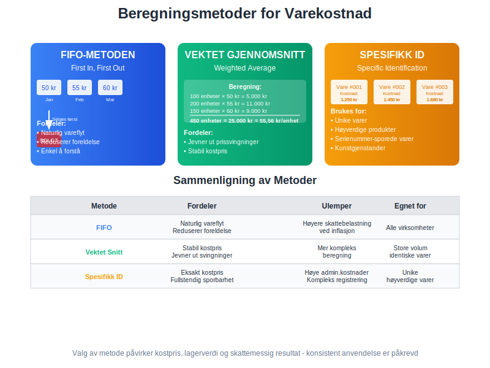

**Varekostnad** er den totale kostnaden en bedrift påløper for å anskaffe varer som skal selges videre til kunder. Dette begrepet er fundamentalt i regnskapsføring og omfatter ikke bare innkjøpsprisen, men alle direkte og indirekte kostnader som påløper for å få varene klare for salg. Varekostnad er en kritisk komponent i beregning av [kostpris](/blogs/regnskap/hva-er-kostpris "Hva er Kostpris? Komplett Guide til Kostnadsberegning") og påvirker direkte bedriftens [lønnsomhet](/blogs/regnskap/hva-er-overskudd "Hva er Overskudd? Komplett Guide til Lønnsomhet og Resultatberegning"). For handelsvirksomheter utgjør varekostnad ofte den største kostnadsposten og krever derfor nøyaktig beregning og oppfølging for å sikre korrekt [lagerbeholdning](/blogs/regnskap/hva-er-lagerbeholdning "Hva er Lagerbeholdning? Komplett Guide til Lagerstyring og Regnskapsføring") og optimal [varelager](/blogs/regnskap/hva-er-varelager "Hva er Varelager? Komplett Guide til Lagerforvaltning og Regnskapsføring")-styring som grunnlag for nøyaktig [resultatregnskap](/blogs/regnskap/hva-er-driftsregnskap "Hva er Driftsregnskap? Komplett Guide til Driftsresultat og Lønnsomhet").

## Seksjon 1: Grunnleggende om Varekostnad

Varekostnad skiller seg fra andre typer kostnader ved at den direkte knyttes til spesifikke varer som er ment for videresalg. Dette påvirker både regnskapsføring og skattemessig behandling, da varekostnader først [aktiveres](/blogs/regnskap/hva-er-aktivering "Hva er Aktivering? Regnskapsføring av Eiendeler og Investeringer") som [lagerbeholdning](/blogs/regnskap/hva-er-lagerbeholdning "Hva er Lagerbeholdning? Komplett Guide til Lagerstyring og Regnskapsføring") i [varelageret](/blogs/regnskap/hva-er-varelager "Hva er Varelager? Komplett Guide til Lagerforvaltning og Regnskapsføring") og deretter kostnadsføres når varene selges.


### Definisjon og Avgrensning

**Varekostnad** inkluderer alle kostnader som påløper for å bringe varer til det stedet og den tilstanden hvor de er klare for salg. Dette omfatter:

* **Direkte kostnader:** Innkjøpspris, transport, toll, forsikring
* **Indirekte kostnader:** Lagerkostnader, kvalitetskontroll, administrasjon
* **Tilleggskostnader:** Modifisering, montering, ferdigstillelse

### Forskjell mellom Varekostnad og Andre Kostnader

| **Kostnadstype** | **Karakteristikk** | **Regnskapsmessig behandling** | **Timing** |
|------------------|---------------------|--------------------------------|------------|
| **Varekostnad** | Knyttet til spesifikke varer | Aktiveres som lager | Kostnadsføres ved salg |
| **Driftskostnader** | Generell virksomhet | Direkte kostnadsføring | Kostnadsføres umiddelbart |
| **[Lønnskostnad](/blogs/regnskap/hva-er-lonnskostnad "Hva er Lønnskostnad? Komplett Guide til Lønnsregnskapet")** | Personalkostnader | Kostnadsføres løpende | Månedlig periodisering |
| **[Avskrivninger](/blogs/regnskap/hva-er-avskrivning "Hva er Avskrivning? Komplett Guide til Avskrivningsmetoder")** | Eiendeler over tid | Systematisk fordeling | Over eiendelens levetid |

## Seksjon 2: Komponenter i Varekostnad

Korrekt beregning av varekostnad krever forståelse av alle kostnadselementer som skal inkluderes. Dette påvirker ikke bare [kostprisen](/blogs/regnskap/hva-er-kostpris "Hva er Kostpris? Komplett Guide til Kostnadsberegning"), men også [lagerverdien](/blogs/regnskap/hva-er-lagerbeholdning "Hva er Lagerbeholdning? Komplett Guide til Lagerstyring og Regnskapsføring") og den endelige lønnsomhetsberegningen.


### Direkte Kostnadselementer

#### Innkjøpspris og Grunnkostnader

**Innkjøpsprisen** er den mest åpenbare komponenten i varekostnad og inkluderer:

* **Katalogpris:** Leverandørens listepris
* **Volumerabatter:** Reduksjoner basert på kjøpsvolum
* **Sesongjusteringer:** Pristilpasninger for sesongvarer
* **Betalingsrabatter:** Reduksjoner for rask betaling

#### Transport- og Ekspedisjonskostnader

Transport av varer fra leverandør til eget lager er en integrert del av varekostnaden:

* **Fraktkostnader:** Direkte transportutgifter
* **Forsikring under transport:** Beskyttelse mot tap og skade
* **Ekspedisjonsgebyrer:** HÃ¥ndtering og administrasjon
* **Lastehåndtering:** Lossing og lessing av varer

#### Toll- og Avgiftskostnader

For importerte varer inkluderes alle offentlige avgifter i varekostnaden:

* **[Toll](/blogs/regnskap/hva-er-toll "Hva er Toll? Komplett Guide til Importavgift og Regnskapsføring"):** Basert på [tollverdi](/blogs/regnskap/hva-er-tollverdi "Hva er Tollverdi? Guide til Tollverdiberegning og Import") og tollsats
* **Importavgifter:** Spesielle avgifter på visse varegrupper
* **Administrativa gebyrer:** Tollekspedisjon og dokumentbehandling
* **MVA ved import:** Merverdiavgift som ikke kan fradras umiddelbart

### Indirekte Kostnadselementer

#### Lagerkostnader

**Lagerkostnader** som kan henføres til spesifikke varer inkluderes i varekostnaden:

* **Lagerleie:** Andel av lagerlokaler
* **Lagervedlikehold:** [Renhold](/blogs/kontoplan/6360-renhold "Konto 6360 - Renhold") og vedlikehold av lagerfasiliteter
* **Lagerpersonell:** Direkte lønnskostnader for lagerhåndtering
* **Lagerutstyr:** Avskrivning på trucks, hyller og annet utstyr

#### Kvalitetskontroll og Inspeksjon

* **Inngangscontroll:** Testing og verifikasjon av mottatte varer
* **Kvalitetstesting:** Laboratorieutgifter og sertifisering
* **Kasserte varer:** Kostnader for varer som ikke oppfyller standard
* **Reklamasjonskostnader:** HÃ¥ndtering av defekte leveranser

### Finansieringskostnader

**Rentekostnader** knyttet til finansiering av varekjøp kan under visse omstendigheter inkluderes:

* **Lagerkreditt:** Renter på kreditt for å finansiere lagerbeholdning
* **Sesongfinansiering:** Spesielle lån for sesonginnkjøp
* **Valutakurssikring:** Kostnader for å sikre seg mot valutarisiko
* **Leverandørkreditt:** Implisitte rentekostnader i leverandørfinansiering

## Seksjon 3: Beregningsmetoder for Varekostnad

Valg av beregningsmetode for varekostnad har betydelige konsekvenser for både regnskapsmessig og skattemessig resultat. Norsk regnskapslovgivning gir visse valgmuligheter, men krever konsistent anvendelse av valgt metode.



### FIFO-metoden (First In, First Out)

**FIFO-metoden** antar at de eldste varene selges først, hvilket betyr at varekostnaden baseres på de eldste innkjøpsprisene.

#### Eksempel på FIFO-beregning:

| Dato | Transaksjon | Antall | Enhetspris | Total Kostnad |
|------|-------------|--------|------------|---------------|
| 01.01 | Ã…pningslager | 100 | 50 kr | 5.000 kr |
| 15.01 | Innkjøp | 200 | 55 kr | 11.000 kr |
| 30.01 | Innkjøp | 150 | 60 kr | 9.000 kr |
| 10.02 | **Salg** | **180** | **FIFO** | **9.500 kr** |

Ved salg av 180 enheter brukes først de 100 enhetene fra åpningslageret (50 kr) og deretter 80 enheter fra første innkjøp (55 kr):
**Varekostnad = (100 × 50) + (80 × 55) = 5.000 + 4.400 = 9.400 kr**

#### Fordeler med FIFO:
* Reflekterer naturlig vareflyt
* Enkel å forstå og implementere
* Reduserer risiko for foreldelse
* Høyere lagerverdi i inflasjonsperioder

#### Ulemper med FIFO:
* Kan gi høyere skattebelastning
* Kostpris reflekterer ikke aktuelle markedspriser
* Kompleks ved mange små innkjøp

### Vektet Gjennomsnitt-metoden

**Vektet gjennomsnitt** beregner en gjennomsnittlig kostpris basert på alle varer i lageret.

#### Beregningseksempel:

| Periode | Beskrivelse | Antall | Enhetspris | Total Verdi |
|---------|-------------|--------|------------|-------------|
| Start | Ã…pningslager | 100 | 50 kr | 5.000 kr |
| Januar | Innkjøp 1 | 200 | 55 kr | 11.000 kr |
| Januar | Innkjøp 2 | 150 | 60 kr | 9.000 kr |
| **Total** | **Lager** | **450** | **55,56 kr** | **25.000 kr** |

**Vektet gjennomsnittspris = 25.000 kr ÷ 450 enheter = 55,56 kr per enhet**

Ved salg av 180 enheter:
**Varekostnad = 180 × 55,56 = 10.000 kr**

#### Fordeler med Vektet Gjennomsnitt:
* Jevner ut prissvingninger
* Enkel administrasjon
* Stabil kostpris over tid
* Mindre påvirkning av tilfeldige prisendringer

### Spesifikk Identifikasjon

For unike eller høyverdige varer kan **spesifikk identifikasjon** anvendes:

* **Unike serienumre:** Hver vare spores individuelt
* **Faktisk kostpris:** Eksakt kostnad for hver solgte vare
* **Komplett sporbarhet:** Full oversikt over varebevegelser
* **Høy administrative kostnader:** Krever detaljert registrering

## Seksjon 4: Regnskapsføring av Varekostnad

Korrekt regnskapsføring av varekostnad følger spesifikke prinsipper som sikrer at kostnader aktiveres som [lagerbeholdning](/blogs/regnskap/hva-er-lagerbeholdning "Hva er Lagerbeholdning? Komplett Guide til Lagerstyring og Regnskapsføring") og kostnadsføres når varene selges. Dette krever nøye [periodisering](/blogs/regnskap/hva-er-periodisering "Hva er Periodisering? Komplett Guide til Regnskapsmessig Periodisering") og korrekt timing av bokføringer.


### Aktivering av Varekostnad

**Ved mottak av varer** aktiveres varekostnaden som lagerbeholdning:

```
Debet: Lagerbeholdning (omløpsmidler)
Kredit: Bank/Leverandørgjeld
```

Alle direkte og indirekte kostnader som kan knyttes til spesifikke varer inkluderes i denne aktiveringen.

### Kostnadsføring ved Salg

**Ved salg av varer** må to bokføringer gjøres:

1. **Registrering av salgsinntekt:**
```
Debet: Kundefordringer/Bank
Kredit: Salgsinntekter
```

2. **Registrering av varekostnad:**
```
Debet: Kostpris solgte varer (kostnad)
Kredit: Lagerbeholdning (omløpsmidler)
```

### Periodisering og Timing

#### Leveringsbetingelser og Risikovergang

Timing av varekostnad avhenger av når risikoen overgår til kjøper:

| **Leveringsbetingelse** | **Risikovergang** | **Kostnadstiming** |
|-------------------------|-------------------|-------------------|
| **FOB shipping point** | Ved leverandørens lager | Ved framsending |
| **FOB destination** | Ved mottak | Ved mottak |
| **CIF (Cost, Insurance, Freight)** | Ved lasting | Ved framsending |
| **DDP (Delivered Duty Paid)** | Ved levering | Ved mottak |

#### Fakturaavviker og Etterreguleringer

* **Prisdifferanser:** Justeringer for feil i opprinnelige fakturaer
* **Volumrabatter:** Etterberegning basert på årsvolum
* **Valutajusteringer:** Endringer i valutakurser
* **Kvalitetsavvik:** Fratrekk for kvalitetsmangler

### Behandling av Særlige Kostnader

#### Returvarer og Defekte Leveranser

**Når varer returneres til leverandør:**
```
Debet: Bank/Leverandørgjeld
Kredit: Lagerbeholdning
```

#### Nedskrivning av Varekostnad

**Ved verdifall på lagerbeholdning:**
```
Debet: Nedskrivning lagerbeholdning (kostnad)
Kredit: Lagerbeholdning
```

#### Svinn og Tyveri

**Ved dokumentert svinn:**
```
Debet: Svinn og tap (kostnad)
Kredit: Lagerbeholdning
```

## Seksjon 5: MVA-behandling av Varekostnad

**Merverdiavgift** på varekjøp behandles forskjellig avhengig av leverandørens MVA-status og om bedriften selv er MVA-registrert. Dette påvirker den endelige varekostnaden og krever nøyaktig dokumentasjon for å sikre korrekt [fradragsrett](/blogs/regnskap/hva-er-fradrag "Hva er Fradrag? Komplett Guide til Skattemessige og Regnskapsmessige Fradrag").


### MVA-registrerte Bedrifter

#### Innkjøp fra MVA-registrerte Leverandører

For MVA-registrerte bedrifter som kjøper fra MVA-registrerte leverandører:

**Bokføring av innkjøp med MVA:**
```
Debet: Lagerbeholdning (eks. MVA)
Debet: Inngående MVA
Kredit: Leverandørgjeld (ink. MVA)
```

**Eksempel:**
Innkjøp av varer for 10.000 kr + 2.500 kr MVA = 12.500 kr

| Konto | Debet | Kredit |
|-------|-------|--------|
| Lagerbeholdning | 10.000 kr | |
| Inngående MVA | 2.500 kr | |
| Leverandørgjeld | | 12.500 kr |

#### Dokumentasjonskrav for MVA-fradrag

* **Gyldig MVA-faktura:** Må inneholde leverandørens MVA-nummer
* **MVA-spesifikasjon:** Tydelig angivelse av MVA-beløp og MVA-sats
* **Betalingsbevis:** Dokumentasjon på at fakturaen er betalt
* **Varemottak:** Bevis på at varene faktisk er mottatt

### Ikke-MVA-registrerte Bedrifter

#### Innkjøp uten MVA-fradragsrett

Bedrifter som ikke er MVA-registrert kan ikke fradra inngående MVA:

**Bokføring uten MVA-fradrag:**
```
Debet: Lagerbeholdning (ink. MVA)
Kredit: Leverandørgjeld (ink. MVA)
```

Dette betyr at hele fakturabeløpet inkludert MVA inngår i varekostnaden.

### Spesielle MVA-situasjoner

#### Import fra EU-land

**Omvendt avgiftsplikt** gjelder for import fra EU:

```
Debet: Lagerbeholdning (varekostad eks. MVA)
Debet: Inngående MVA
Kredit: Utgående MVA
Kredit: Leverandørgjeld (eks. MVA)
```

#### Import fra Tredjeland

**MVA ved tollbehandling:**
* MVA betales til tollmyndighetene
* Kan fradras som inngående MVA (hvis bedriften er MVA-registrert)
* Inngår i varekostnaden hvis ikke fradragsberettiget

#### Brukte Varer og Kunstgjenstander

**Særlige marginregler** kan gjelde:
* Kun MVA på fortjenestemargin
* Spesielle dokumentasjonskrav
* Begrenset fradragsrett

## Seksjon 6: Kostprisberegning og Lønnsomhetsanalyse

Nøyaktig kostprisberegning basert på korrekt varekostnad er fundamentalt for lønnsomhetsanalyse og prissetting. Dette krever systematisk oppfølging av alle kostnadselementer og regelmessig analyse av lønnsomhet på produkt- og kundenivå.


### Fullt Kostnadsbegrep vs. Redusert Kostnadsbegrep

#### Fullt Kostnadsbegrep (Absorption Costing)

Inkluderer alle kostnader direkte og indirekte knyttet til varen:

**Komponenter i fullt kostnadsbegrep:**
* Direkte varekostnader (innkjøp, transport, toll)
* Direkte lagerkostnader (lagerleie, lagerpersonell)
* Indirekte kostnader (administrasjon, kvalitetskontroll)
* Andel av faste kostnader (husleie, forsikring)

#### Redusert Kostnadsbegrep (Direct Costing)

Inkluderer kun variable kostnader direkte knyttet til varen:

**Komponenter i redusert kostnadsbegrep:**
* Innkjøpspris
* Variable transportkostnader
* Variable lagerkostnader
* Variable kvalitetskostnader

### Kostnadsfordeling og Kostnadsdrivere

#### ABC-basert Kostnadsfordeling

**Activity-Based Costing** gir mer nøyaktig kostnadsfordeling:

| **Aktivitet** | **Kostnadrdriver** | **Eksempel** |
|---------------|-------------------|--------------|
| **Innkjøp** | Antall bestillinger | 500 kr per bestilling |
| **Lagerhold** | Kubikkmeter lagerplass | 100 kr per m³ måned |
| **Kvalitetskontroll** | Antall tester | 50 kr per test |
| **Transport** | Vekt og avstand | 2 kr per kg/km |

#### Tradisjonell Kostnadsfordeling

**Enklere fordelingsmetoder** basert på:
* Prosentandel av innkjøpsverdi
* Fast kronebeløp per enhet
* Vekt- eller volumbasert fordeling

### Lønnsomhetsanalyse per Produktgruppe

#### Bruttomargin-analyse

**Bruttomargin = Salgspris - Varekostnad**

| **Produktgruppe** | **Salgspris** | **Varekostnad** | **Bruttomargin** | **Margin %** |
|-------------------|---------------|-----------------|-----------------|--------------|
| **Produktgruppe A** | 1.000 kr | 600 kr | 400 kr | 40% |
| **Produktgruppe B** | 500 kr | 350 kr | 150 kr | 30% |
| **Produktgruppe C** | 200 kr | 160 kr | 40 kr | 20% |

#### Dekningsbidragsanalyse

**Dekningsbidrag = Salgspris - Variable kostnader**

For beslutninger om produktmiks og prissetting er dekningsbidrag ofte mer relevant enn bruttomargin.

### KPI-er for Varekostnadsstyring

#### Kostnadsnøkkeltall

| **KPI** | **Beregning** | **MÃ¥lsetting** |
|---------|---------------|----------------|
| **Kostprisandel** | Varekostnad ÷ Salgspris | 60-70% |
| **Transportkostnad %** | Transport ÷ Total varekostnad | < 5% |
| **Svinnprosent** | Svinn ÷ Innkjøpsverdi | < 2% |
| **Lageromsetning** | Årlig varekostnad ÷ Gj.snitt lager | > 6 ganger |

#### Trendanalyse

**Månedlig oppfølging av:**
* Utvikling i varekostnad per enhet
* Endringer i kostnadsmiks
* Avvik fra budsjetterte kostnader
* Sesongmessige variasjoner

## Seksjon 7: Digitale Verktøy og Automatisering

Moderne varekostnadsstyring drar nytte av digitale verktøy for å automatisere beregninger, forbedre nøyaktigheten og gi sanntidsinnsikt i kostnadsutvikling. Integration med [ERP-systemer](/blogs/regnskap/hva-er-erp-system "Hva er ERP-system? Komplett Guide til Enterprise Resource Planning") og automatiserte kostnadssystemer reduserer manuelt arbeid og risiko for feil.


### ERP-integrasjon og Automatisering

#### Automatisk Kostnadskalkulation

**Moderne ERP-systemer** kan automatisk beregne varekostnad basert på:
* Forhåndsdefinerte kostnadsregler
* Automatisk fordeling av indirekte kostnader
* Sanntids oppdatering av lagerverdier
* Integration med transportleverandører for fraktkostnader

#### Kostnadssporingsmoduler

**Avanserte sporingskapabiliteter:**
* Sporbarhet av kostnader per parti eller serienummer
* Automatisk registrering av tilleggskostnader
* Valutaomregning i sanntid
* Kostnadsjustering basert på faktiske utfall

### Kunstig Intelligens og Machine Learning

#### Prediktiv Kostnadsstyring

**AI-drevne systemer** kan:
* Forutsi fremtidige kostnadstrender
* Optimalisere leverandørvalg basert på total kostnad
* Identifisere kostnadsdrivere automatisk
* Varsle om unormale kostnadsavvik

#### Automatisk Kostnadskategorisering

* **OCR-teknologi:** Automatisk lesing av fakturaer
* **Maskinlæring:** Intelligent kategorisering av kostnader
* **Anomali-deteksjon:** Automatisk oppdagelse av feil
* **Prediksjon:** Forutsigelse av kostnadsentaling

### Kostnadsanalyse og Rapportering

#### Sanntids Dashboards

**Interaktive dashboards** som viser:
* Kostnadstrend per produkt og periode
* Avvik fra budsjetterte kostnader
* Lønnsomhetsanalyse per kunde og produkt
* Nøkkeltall og KPI-er

#### Automatisk Rapportering

**Systematisk rapportering** av:
* MÃ¥nedlige kostnadsoversikter
* Avviksanalyse mot budsjett
* Lønnsomhetsrapporter per segment
* Kostnadsprognose for kommende perioder

### Integration med Eksterne Systemer

#### Leverandørportaler

**Direkte integration** med leverandørsystemer:
* Automatisk mottak av fakturaer
* Sanntids prisinformasjon
* Automatisk bestillingsbekreftelse
* Sporbarhet av leveranser

#### Transport- og Logistikksystemer

* **Automatisk fraktkostnadberegning**
* **Integration med speditører**
* **Sporbarhet av forsendelser**
* **Automatisk kostnadsbokføring**

## Seksjon 8: Internkontroll og Risikostyring

Effektiv [internkontroll](/blogs/regnskap/hva-er-internkontroll "Hva er Internkontroll? Komplett Guide til Risikostyring og Kontrollsystemer") av varekostnad reduserer risiko for feil, misligheter og tap. Dette krever systematiske kontrollrutiner, tydelig ansvarsfordeling og regelmessig overvåking av kostnadsprosesser.


### Kontrollmiljø og Ansvarsfordeling

#### Ansvarsmatrise for Varekostnad

| **Rolle** | **Ansvar** | **Kontrollaktiviteter** |
|-----------|------------|------------------------|
| **Innkjøpsansvarlig** | Leverandørvalg og priser | Sammenligning av tilbud |
| **Lagersjef** | Mottak og registrering | Kvalitetskontroll ved mottak |
| **Regnskapsansvarlig** | Bokføring og rapportering | [Avstemming](/blogs/regnskap/hva-er-avstemming "Hva er Avstemming? Komplett Guide til Regnskapsmessig Avstemming") av lagerverdier |
| **Controller** | Analyse og oppfølging | Kostnadstrendanalyse |

#### Godkjenningsrutiner og Fullmakter

**Strukturerte godkjenningsnivåer:**
* Innkjøpsfullmakter basert på beløpsgrenser
* Tofaktorgodkjenning for store innkjøp
* Automatisk eskalering ved avvik
* Periodisk gjennomgang av fullmakter

### Risikofaktorer og Kontrolltiltak

#### Hovedrisikoer ved Varekostnadsstyring

| **Risikofaktor** | **Potensielle konsekvenser** | **Kontrolltiltak** |
|------------------|------------------------------|-------------------|
| **Feil kostnadskalkulation** | Feil lønnsomhetsvurdering | Systematisk kostnadskontroll |
| **Leverandørsvindel** | Overprising og korrupsjon | Rotasjon av leverandører |
| **Valutarisiko** | Uforutsette kostnadsøkninger | Valutasikring og avtaleregler |
| **Kvalitetsrisiko** | Økte kostnader og reklamasjoner | Systematisk kvalitetskontroll |
| **Lagersvinn** | Direkte tap og feil kostnadsbasis | Sikkerhetstiltak og lageropptak |

#### Preventive Kontroller

**Kontrolltiltak som forhindrer feil:**
* Systematisk leverandørevaluering
* Automatisk sammenligning av priser
* Integrerte systemer som forhindrer duplisering
* Foreskrevne dokumentasjonskrav

#### Detektive Kontroller

**Kontroller som oppdager feil:**
* Regelmessige kostnadstrendanalyser
* MÃ¥nedlig avstemming av lagerverdier
* Avviksanalyse mot budsjett og tidligere perioder
* Stikkprøvekontroller av fakturaer og leveranser

### Revisjonsrutiner og Oppfølging

#### Intern Revisjon

**Systematisk gjennomgang av:**
* Kostnadsbereningsmodeller og -metoder
* Overholdelse av internkontrollprosedyrer
* Kvalitet på kostnadsdokumentasjon
* Effektivitet av kontrollaktiviteter

#### Ekstern Revisjon

**Revisorens fokusområder:**
* Korrekt verdivurdering av lagerbeholdning
* Overholdelse av regnskapsstandarder
* Tilstrekkelighet av internkontroll
* Kvalitet på kostnadssystemer og -prosesser

#### Kontinuerlig Forbedring

**Systematisk forbedring gjennom:**
* Ã…rlig gjennomgang av kontrolleffektivitet
* Implementering av beste praksis
* Oppdatering av systemer og prosedyrer
* Opplæring og kompetanseutvikling

## Seksjon 9: Skattemessige Forhold

Varekostnad har direkte skattemessige konsekvenser da den påvirker beregning av [skattepliktig inntekt](/blogs/regnskap/hva-er-inntekter "Hva er Inntekter? Komplett Guide til Inntektsføring og Regnskapsføring"). Norske skattemyndigheter har spesifikke regler for hvordan varekostnad skal beregnes og dokumenteres.


### Skattemessig Verdivurdering

#### Lavestekriteriet

I Norge må lagerbeholdning verdsettes til **laveste verdi** av:
* **Anskaffelseskost** (inkludert alle direkte og henførbare indirekte kostnader)
* **Virkelig verdi** (salgsverdi fratrukket salgskostnader)

#### Tillatte Kostnadselementer

**Skattemessig kan følgende kostnader inkluderes:**
* Direkte innkjøpspris
* Transport- og ekspedisjonskostnader
* Toll og importavgifter (ikke fradragsberettiget MVA)
* Direkte lagerkostnader
* Nødvendige tilpasnings- og ferdigstillelseskostnader

#### Ikke-tillatte Kostnadselementer

**Følgende kostnader kan ikke inkluderes skattemessig:**
* Fradragsberettiget merverdiavgift
* Unødvendige lagerkostnader
* Finansieringskostnader (med visse unntak)
* Administrative kostnader som ikke er direkte henførbare

### Kostnadsmethoderegler

#### Valg av Vurderingsmetode

**Skattemyndighetene aksepterer:**
* FIFO-metoden (First In, First Out)
* Vektet gjennomsnitt
* Spesifikk identifikasjon (for unike varer)

**LIFO-metoden er ikke tillatt** i Norge.

#### Konsistensprinsippet

* Valgt metode må anvendes konsistent over tid
* Endring av metode krever godkjenning fra skattemyndighetene
* Metodeskifte kan utløse skattemessige konsekvenser

### Nedskrivning og Verdifall

#### NÃ¥r Nedskrivning er PÃ¥krevd

**Obligatorisk nedskrivning ved:**
* Dokumentert kvalitetsforringelse
* Teknologisk foreldelse
* Markedsverdifall under anskaffelseskost
* Fysisk skade eller ødeleggelse

#### Skattemessig Fradragsrett

**Fradrag kan kreves for:**
* Dokumentert svinn og tyveri
* Nedskrivning til virkelig verdi
* Realiserte tap ved salg
* Kostnader ved avhending av verdiløse varer

#### Dokumentasjonskrav

**Tilstrekkelig dokumentasjon inkluderer:**
* Grundige beskrivelser av årsaker til verdifall
* Markedsanalyser eller takstrapporter
* Fotografisk dokumentasjon av skade
* Uavhengige bekraflelser fra tredjeparter

### Tidspunkt for Kostnadsføring

#### Leveringsprinsipper

**Skattemessig timing avhenger av:**
* Kontraktuelle leveringsbetingelser
* Tidspunkt for risikovergang
* Faktisk mottak av varer
* Faktureringstidspunkt

#### Periodesplitt og Justeringer

**Ved årsskifte må følgende vurderes:**
* Varer i transit (underveis leveranser)
* Mottatte men ikke fakturerte varer
* Fakturerte men ikke mottatte varer
* Periodiseringsbehov for korrekt resultatmåling

## Seksjon 10: Bransjespecifikke Forhold

Ulike bransjer har spesielle utfordringer og krav knyttet til varekostnadsstyring. Forståelse av bransjespecifikke forhold er kritisk for korrekt kostnadsstyring og overholdelse av relevante reguleringer.


### Detaljhandel og Varehandel

#### Høy Volumaktivitet

**Detaljhandel karakteriseres av:**
* Store antall små transaksjoner
* Hurtig lageromsetning
* Sesongvariasjoner i etterspørsel
* Kompleks sortimentsstyring

#### Kostnadsstyring i Detaljhandel

**Spesielle fokusområder:**
* Automatiserte prissettingssystemer
* [Strekkode](/blogs/regnskap/hva-er-strekkode "Hva er Strekkode i Regnskap? Komplett Guide til Automatisert Registrering")-basert lagerstyring
* Svinnreduksjon og tyverisikring
* Effektive returhåndteringsprosesser

### Produksjonsbedrifter

#### RÃ¥varer og Produksjonskostnader

**Varekostnad i produksjon inkluderer:**
* RÃ¥varekostnader
* Direkte lønnskostnader
* Indirekte produksjonskostnader
* Kvalitetskontroll og testing

#### Work-in-Progress (WIP) Verdivurdering

**Varer under arbeid krever spesiell behandling:**
* Stadiebasert kostnadakkumulering
* Korrekt fordeling av indirekte kostnader
* Regelmessig verdsettelse av uferdige produkter
* Kompleks kostnadssporing gjennom produksjonslinjer

### Import og Grossistvirksomhet

#### Internasjonale Leverandørkjeder

**Spesielle utfordringer:**
* [Valutarisiko](/blogs/regnskap/hva-er-valutarisiko "Hva er Valutarisiko? Guide til Valutasikring") og valutakonvertering
* Komplekse [toll](/blogs/regnskap/hva-er-toll "Hva er Toll? Komplett Guide til Importavgift og Regnskapsføring")- og avgiftsberegninger
* Lange transporttider og transport forsikring
* Kreditdokumenter og finansiering

#### Internasjonale Handelsbetingelser

**Incoterms påvirker kostnadskalkulation:**

| **Incoterm** | **Leverandørens ansvar** | **Kostnadselementer for kjøper** |
|--------------|--------------------------|-----------------------------------|
| **EXW** | Minimal | Transport, forsikring, toll, alle risiko |
| **FOB** | Til skip | Sjøtransport, forsikring, toll |
| **CIF** | Til destinasjonshavn | Toll, landtransport |
| **DDP** | Komplett levering | Kun varemottak og lagerhold |

### Sesongbaserte Virksomheter

#### Sesonghandel og Modebransjen

**Spesielle kostnadshensyn:**
* Høy risiko for verdifall ved sesonslutt
* Kompleks prognostisering av etterspørsel
* Betydelige markedsføringskostnader
* Utfordrende lagerstyring med korte produktlivssykler

#### Kostnadsstyring for Sesongvarer

**Kritiske suksessfaktorer:**
* Dynamisk prissetting basert på sesongutvikling
* Effektive clearance-strategier
* Nøyaktige salgsrognoser
* Fleksible leverandøravtaler

### Teknologi og Elektronikk

#### Rask Teknologisk Utvikling

**Unike utfordringer:**
* Høy risiko for teknologisk foreldelse
* Korte produktlivssykler
* Betydelige forsknings- og utviklingskostnader
* Komplekse garanti- og servicekostnader

#### Kostnadsstyring for Teknologiprodukter

**Spesielle fokusområder:**
* Avskrivningsmodeller for verdifall
* Integration av FoU-kostnader i produktkostnad
* Garantikostnadsestimering
* Lifecycle-kostnadsstyring

## Konklusjon

Varekostnad er en kritisk komponent i regnskapsføring og kostnadsstyring som krever systematisk tilnærming og nøyaktig beregning. Fra grunnleggende innkjøpspris til komplekse indirekte kostnader, må alle relevante kostnadselementer identifiseres, klassifiseres og behandles korrekt for å sikre nøyaktig lønnsomhetsanalyse og overholdelse av regnskapsmessige og skattemessige krav.

Moderne varekostnadsstyring drar nytte av digitale verktøy og automatiserte systemer som reduserer manuelt arbeid, forbedrer nøyaktighet og gir sanntidsinnsikt i kostnadutvikling. Integration med [ERP-systemer](/blogs/regnskap/hva-er-erp-system "Hva er ERP-system? Komplett Guide til Enterprise Resource Planning") og avanserte analyseværktøy gjør det mulig å optimalisere kostnadsstyringen på måter som ikke var mulige tidligere.

Effektiv internkontroll og risikostyring er essensielt for å beskytte mot feil, misligheter og tap. Dette krever tydelig ansvarsfordeling, systematiske kontrollrutiner og regelmessig overvåking av kostnadsprosesser.

For bedrifter som ønsker å forbedre sin varekostnadsstyring, anbefales det å:

* **Etablere klare prosedyrer** for identifikasjon og klassifikasjon av alle kostnadselementer
* **Implementere konsistente metoder** for kostnadskalkulation og verdivurdering
* **Investere i teknologi** som automatiserer kostnadsprosesser og reduserer feilrisiko
* **Utvikle robuste kontrollsystemer** som sikrer nøyaktighet og overholdelse av regelverk
* **Utføre regelmessig analyse** av kostnadstrender og lønnsomhet

Korrekt varekostnadsstyring er ikke bare et regnskapsmessig krav, men et strategisk konkurransefortrinn som kan forbedre lønnsomhet, optimalisere arbeidskapital og støtte informerte forretningsbeslutninger. Med riktig tilnærming og verktøy kan varekostnadsstyring transformeres fra en administrativ oppgave til en verdiskapende aktivitet som bidrar direkte til bedriftens suksess.


