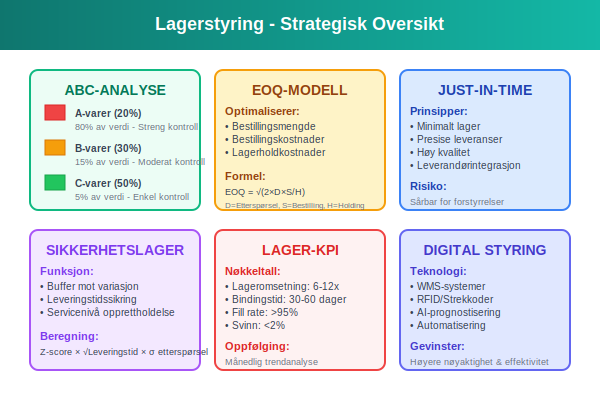

**Varelager** består av varer som en bedrift holder på lager for videresalg til kunder, og representerer en av de mest kritiske [omløpsmidlene](/blogs/regnskap/hva-er-omlopsmiddel "Hva er Omløpsmidler? Komplett Guide til Kortsiktige Eiendeler") i balansen. Varelageret er et fysisk og regnskapsmessig lager av produkter som bedriften har kjøpt eller produsert med formål om å selge dem videre i sin ordinære virksomhet. For mange bedrifter utgjør varelageret den største enkeltposten blant omløpsmidlene og krever derfor nøyaktig [verdivurdering](/blogs/regnskap/hva-er-balansebasert-verdivurdering "Hva er Balansebasert Verdivurdering? Guide til Eiendelvurdering") og systematisk styring for å optimalisere [arbeidskapitalen](/blogs/regnskap/hva-er-arbeidskapital "Hva er Arbeidskapital? Komplett Guide til Likviditetsstyring") og sikre korrekt [resultatregnskap](/blogs/regnskap/resultatregnskap "Hva er Resultatregnskap? Komplett Guide til Resultatregnskap i Norge").

For en helhetlig forståelse av hvordan varer flyter gjennom virksomheten og tilbake til kapital, se artikkelen [Varekretsløpet](/blogs/regnskap/varekretslopet "Varekretsløpet: Flyt av varer og kapital").

## Seksjon 1: Definisjon og Klassifikasjon

Varelager klassifiseres som **kortsiktige eiendeler** da varene normalt forventes å bli solgt innen ett år. Lageret er en sentral komponent i bedriftens [kontantstrøm](/blogs/regnskap/hva-er-kontantstrom "Hva er Kontantstrøm? Komplett Guide til Kontantstrømanalyse") og påvirker direkte [lønnsomheten](/blogs/regnskap/hva-er-overskudd "Hva er Overskudd? Komplett Guide til Lønnsomhet og Resultatberegning") gjennom [kostprisberegning](/blogs/regnskap/hva-er-kostpris "Hva er Kostpris? Komplett Guide til Kostnadsberegning") når varene selges.


### Hovedtyper av Varelager

#### Handelsvarer
**Handelsvarer** er varer som kjøpes ferdig produsert fra leverandører og selges videre uten vesentlig bearbeiding:

* **Detaljhandelsvarer:** Konsumvarer solgt direkte til sluttbrukere
* **Grossistlager:** Varer kjøpt i store volum for videresalg til detaljister
* **Importvarer:** Produkter innført fra utlandet for det norske markedet
* **Markedsvarer:** Spesialiserte produkter for bestemte markeder eller kundegrupper

#### Produksjonslager
**Produksjonslager** omfatter varer i ulike stadier av produksjonsprosessen:

* **Råvarer:** Materialer som skal inngå i produksjon
* **Varer under arbeid (VUA):** Delvis ferdige produkter i produksjon
* **Ferdigvarer:** Fullførte produkter klare for salg
* **Hjelpestoffer:** Materialer som støtter produksjonsprosessen

#### Reservedeler og Vedlikeholdslager
**Reservedeler** og vedlikeholdslager sikrer kontinuerlig drift:

* **Kritiske reservedeler:** Komponenter essensielle for produksjon
* **Vedlikeholdsmateriell:** Forbruksvarer for vedlikehold
* **Sikkerhetslager:** Buffer mot leveringsavbrudd
* **Sesongvarer:** Produkter med sesongbasert etterspørsel

### Lageregnskapsklassifikasjoner

#### Varekategorier i Balansen

| **Kategori** | **Karakteristikk** | **Verdivurdering** | **Omløpshastighet** |
|--------------|---------------------|-------------------|-------------------|
| **Råvarer** | Produktionsmateriell | Anskaffelseskost | Middels |
| **Varer under arbeid** | Delvis ferdig produksjon | Akkumulerte kostnader | Lav |
| **Ferdigvarer** | Salgsklare produkter | Produksjonskost | Høy |
| **Handelsvarer** | Kjøpte varer for videresalg | [Varekostnad](/blogs/regnskap/hva-er-varekostnad "Hva er Varekostnad? Komplett Guide til Kostnadsstyring") | Variabel |


## Seksjon 2: Verdivurderingsmetoder

Verdivurdering av varelager følger **laveste verdi prinsippet**, hvor lageret skal verdsettes til laveste verdi av anskaffelseskost eller netto realisasjonsverdi. Valg av verdivurderingsmetode har betydelige konsekvenser for både regnskapsmessig resultat og skatteberegning.


### FIFO-metoden

For en mer detaljert gjennomgang av **FIFO-metoden**, se egen artikkel [FIFO-metoden](/blogs/regnskap/fifo-metoden "FIFO-metoden"). Metoden antar at de eldste varene selges først, og lagerverdien baseres på de nyeste kostprisene.

### LIFO-metoden (Last In, First Out)

**LIFO-metoden** antar at de nyeste varene selges først. Metoden er **ikke tillatt** i Norge skattemessig, men kan anvendes for regnskapsformål.

#### LIFO-beregning (kun regnskapsmessig):

**Ved samme salg som over (400 stk):**
- 250 stk til 120 kr = 30.000 kr
- 150 stk til 110 kr = 16.500 kr
- **Total kostpris solgte varer:** 46.500 kr

**Gjenværende lager:**
- 200 stk til 100 kr = 20.000 kr
- 150 stk til 110 kr = 16.500 kr
- **Total lagerverdi:** 36.500 kr

### Vektet Gjennomsnitt-metoden

**Vektet gjennomsnitt** beregner en gjennomsnittlig kostpris for alle varer i lageret, oppdatert ved hver leveranse.

#### Beregningseksempel:

| **Periode** | **Beskrivelse** | **Antall** | **Enhetspris** | **Total kostnad** |
|-------------|-----------------|-----------|---------------|------------------|
| Start | Åpningslager | 200 stk | 100 kr | 20.000 kr |
| Januar | Innkjøp 1 | 300 stk | 110 kr | 33.000 kr |
| Januar | Innkjøp 2 | 250 stk | 120 kr | 30.000 kr |
| **Total** | **Samlet lager** | **750 stk** | **110,67 kr** | **83.000 kr** |

**Vektet gjennomsnittspris = 83.000 kr ÷ 750 stk = 110,67 kr**

Ved salg av 400 stk:
- **Kostpris solgte varer:** 400 × 110,67 = 44.267 kr
- **Gjenværende lager:** 350 × 110,67 = 38.733 kr

#### Fordeler med Vektet Gjennomsnitt:
* Jevner ut prissvingninger
* Enklere administrasjon
* Mindre påvirkning av prisvolatilitet
* Stabil kostpris over tid


## Seksjon 3: Regnskapsføring av Varelager

Regnskapsføring av varelager følger grunnleggende prinsipper for [aktivering](/blogs/regnskap/hva-er-aktivering "Hva er Aktivering? Regnskapsføring av Eiendeler og Investeringer") og [kostnadføring](/blogs/regnskap/hva-er-kostnadsforing "Hva er Kostnadsføring? Guide til Regnskapsmessig Kostnadsbehandling") som sikrer korrekt timing og verdimåling av lagertransaksjoner.


### Aktivering av Varekjøp

**Ved mottak av varer** aktiveres lagerverdien basert på totale anskaffelseskostnader:

```
Debet: Varelager (omløpsmidler)
Kredit: Leverandørgjeld/Bank
```

**Anskaffelseskost inkluderer:**
* Innkjøpspris (eksklusive fradragsberettiget MVA)
* Transportkostnader
* [Toll](/blogs/regnskap/hva-er-toll "Hva er Toll? Komplett Guide til Importavgift og Regnskapsføring") og importavgifter
* Andre direkte henførbare kostnader

### Kostnadføring ved Salg

**Ved salg av varer** må to parallelle bokføringer utføres:

1. **Registrering av salgsinntekt:**
```
Debet: Kundefordringer/Bank
Kredit: Salgsinntekter
```

2. **Kostnadføring av solgte varer:**
```
Debet: Kostpris solgte varer (kostnad)
Kredit: Varelager (omløpsmidler)
```

### Lagerendringer og Justeringer

#### Periodisk Lagerjustering

**Ved [avstemming](/blogs/regnskap/hva-er-avstemming "Hva er Avstemming? Komplett Guide til Regnskapsmessig Avstemming") og tellinger:**

**Lagerøkning (oppdaget merkvare):**
```
Debet: Varelager
Kredit: Andre inntekter/Justering lagerbeholdning
```

**Lagerreduksjon (svinn/tyveri):**
```
Debet: Svinn og tap (kostnad)
Kredit: Varelager
```

#### Nedskrivning av Lagerverdi

**Ved verdifall under anskaffelseskost:**
```
Debet: Nedskrivning varelager (kostnad)
Kredit: Varelager
```

#### Reversering av Nedskrivning

**Ved senere verdioppgang:**
```
Debet: Varelager
Kredit: Reversering nedskrivning (inntekt)
```

### Behandling av Returvarer

#### Vareretur fra Kunder

**Ved mottak av returnerte varer:**
```
Debet: Varelager (estimert lagerverdi)
Debet: Salgskostnader (reduksjon i salgsinntekt)
Kredit: Kundefordringer
```

#### Vareretur til Leverandører

**Ved retur av defekte/feil varer:**
```
Debet: Leverandørgjeld/Bank
Kredit: Varelager
```


## Seksjon 4: Lagerstyring og Operasjonelle Aspekter

Effektiv lagerstyring optimaliserer balansen mellom tilgjengelighet og kapitalbinding, reduserer totale lagerkostnader og forbedrer kundeservice. Modern lagerstyring integrerer prognostisering, automatisering og dataanalyse for å optimalisere lageroperasjoner.



### Lagerstyringsmetoder

#### ABC-analyse

**ABC-klassifikasjon** prioriterer varer basert på verdi og viktighet:

| **Kategori** | **Andel av varer** | **Andel av verdi** | **Styringsfokus** |
|--------------|-------------------|-------------------|-------------------|
| **A-varer** | 20% | 80% | Streng kontroll, hyppig oppfølging |
| **B-varer** | 30% | 15% | Moderat kontroll, periodisk gjennomgang |
| **C-varer** | 50% | 5% | Enkel kontroll, bulkbestillinger |

#### Economic Order Quantity (EOQ)

**EOQ-modellen** optimaliserer bestillingsmengde ved å balansere:
* **Bestillingskostnader:** Faste kostnader per bestilling
* **Lagerholdkostnader:** Variable kostnader for å holde lager
* **Etterspørselsmønstre:** Årlig forbruk og variabilitet

**EOQ-formel:**
EOQ = ˆš(2 × Årlig etterspørsel × Bestillingskostnad ÷ Årlig lagerholdkostnad per enhet)

#### Just-in-Time (JIT)

**JIT-filosofi** minimaliserer lagerbeholdning gjennom:
* Presise leveransetidspunkter
* Høy leverandørpålitelighet
* Korte produksjonssykler
* Eliminering av unødvendig lager

### Sikkerhetslager og Servicenivå

#### Beregning av Sikkerhetslager

**Sikkerhetslager** beskytter mot:
* Variasjon i etterspørsel
* Leveringstidsuforutsigbarhet
* Sesongmessige svingninger
* Leverandørforstyrrelser

**Sikkerhetslager = Z-score × ˆš(Leveringstid) × Standardavvik i etterspørsel**

#### Servicenivå-optimalisering

| **Servicenivå** | **Z-score** | **Sannsynlighet for manko** | **Sikkerhetslager-multiplikator** |
|----------------|-------------|------------------------------|-----------------------------------|
| **95%** | 1,65 | 5% | Moderat |
| **97,5%** | 1,96 | 2,5% | Høy |
| **99%** | 2,33 | 1% | Svært høy |
| **99,9%** | 3,09 | 0,1% | Ekstrem |

### Lageromsetning og Nøkkeltall

#### Lageromsetningsberegning

**Lageromsetning = Kostpris solgte varer ÷ Gjennomsnittlig lagerverdi**

**Eksempel:**
- Kostpris solgte varer: 1.200.000 kr
- Gjennomsnittlig lagerverdi: 200.000 kr
- **Lageromsetning:** 6 ganger per år

#### Lagerbindingstid

**Lagerbindingstid = 365 dager ÷ Lageromsetning**

**Fra eksemplet over:**
**Lagerbindingstid = 365 ÷ 6 = 61 dager**

#### Kritiske Lager-KPIer

| **KPI** | **Beregning** | **Målsetting** | **Betydning** |
|---------|---------------|----------------|---------------|
| **Lageromsetning** | Kostpris ÷ Gj.snitt lager | 6-12 ganger | Effektivitet |
| **Lagerbindingstid** | 365 ÷ Omsetning | 30-60 dager | Kapitaleffektivitet |
| **Fyllingsgrad** | Lagernivå ÷ Makskapasitet | 75-85% | Kapasitetsutnyttelse |
| **Svinnprosent** | Svinn ÷ Innkjøpsverdi | <2% | Kvalitetskontroll |


## Seksjon 5: Digitale Verktøy og Automatisering

Moderne lagerforvaltning utnytter avansert teknologi for å optimalisere operasjoner, redusere kostnader og forbedre nøyaktighet. Integration med [ERP-systemer](/blogs/regnskap/hva-er-erp-system "Hva er ERP-system? Komplett Guide til Enterprise Resource Planning") og automatiserte lagersystemer transformerer tradisjonell lagerstyring.


### Lagerstyringssystemer (WMS)

#### Warehouse Management System Funktionalitet

**Moderne WMS-systemer** tilbyr:
* **Sanntids lageroversikt** med presise lagernivåer
* **Automatisk replenishment** basert på forhåndsdefinerte grenser
* **Optimalisering av lagerplassering** for effektiv plukking
* **Integration med transportlogistikk** for sømløs levering

#### Barcode og RFID-teknologi

**[Strekkode](/blogs/regnskap/hva-er-strekkode "Hva er Strekkode i Regnskap? Komplett Guide til Automatisert Registrering")-systemer** forbedrer:
* Nøyaktighet ved vareregistrering
* Hastighet på inn- og utleveringer
* Sporbarhet av individuelle produkter
* Reduksjon av manuelle feil

**RFID-teknologi** gir:
* Automatisk identifikasjon uten manuell skanning
* Sanntids lokalisering av varer i lageret
* Batch-registrering av flere produkter samtidig
* Forbedret sikkerhet og tyveribeskyttelse

### Prognostisering og Planlegging

#### AI-drevet Etterspørselsprognose

**Maskinlæringsmodeller** analyserer:
* Historiske salgsmønstre
* Sesongmessige variasjoner
* Markedstrender og eksterne faktorer
* Kundeadferdsmønstre

#### Dynamisk Prognosemodeller

**Avanserte algoritmer** justerer prognoser basert på:
* Sanntids salgsdata
* Værforhold og sesongeffekter
* Markedsføringsaktiviteter
* Konkurrentanalyse

### Automatisering av Lagerprosesser

#### Robotisering og Automation

**Automatiserte lagerløsninger:**
* **Automatiske lagerkaruseller** for høyfrekvent plukking
* **Robotiserte plukksystemer** for effektiv ordrebehandling
* **Selvkjørende trucks** for transport i lageret
* **Sorteringsanlegg** for automatisk pakking og frakt

#### Integration med Regnskapssystemer

**Sanntids integration** sikrer:
* Automatisk bokføring av lagertransaksjoner
* Sanntids oppdatering av lagerverdier
* Automatisk kostprisberegning
* Konsistent rapportering på tvers av systemer


## Seksjon 6: Internkontroll og Risikostyring

Effektiv [internkontroll](/blogs/regnskap/hva-er-internkontroll "Hva er Internkontroll? Komplett Guide til Risikostyring og Kontrollsystemer") av varelager beskytter mot svinn, tyveri og feil som kan påvirke både balanseverdier og løpende resultater. Systematiske kontrollrutiner og risikoreduserende tiltak er essensielle for å sikre integritet i lageroperasjoner.


### Lageropptelling og Fysisk Kontroll

#### Permanent Inventur (Cycle Counting)

**Kontinuerlig opptelling** gjennom:
* Roterende tellingsplaner for ulike varekategorier
* Høyere frekvens for A-varer (månedlig)
* Moderat frekvens for B-varer (kvartalsvis)
* Lavere frekvens for C-varer (halvårlig)

#### Årlig Hovedinventur

**Komplett lagertelling** inkluderer:
* **Forberedelse:** Stopp av alle lagerbevegelser
* **Gjennomføring:** Systematisk telling av alle varer
* **Dokumentasjon:** Registrering av avvik og årsaker
* **Oppfølging:** Korrigering av systemer og rutiner

#### Avviksbehandling

**Ved identifiserte avvik:**

| **Avvikstype** | **Sannsynlig årsak** | **Oppfølgingstiltak** |
|----------------|----------------------|----------------------|
| **Manko** | Tyveri, svinn, feil | Forsterket sikkerhet, prosessforbedring |
| **Overskudd** | Registreringsfeil | Gjennomgang av mottaksprosedyrer |
| **Kvalitetsavvik** | Forringelse, skade | Forbedret lagring og håndtering |
| **Lokalisering** | Feilplassering | Oppdatering av lagersystem |

### Sikkerhetstiltak og Adgangskontroll

#### Fysisk Sikkerhet

**Sikring av lagerfasilitet:**
* **Adgangskontroll:** Elektroniske kort og sikkerhetskoder
* **Overvåkningssystemer:** Kameraer og alarmsystemer
* **Sikkerhetssoner:** Separate områder for høyverdivarer
* **Brannsikkerhet:** Automatiske sprinkleranlegg og røykdeteksjon

#### Personellkontroll

**Rutiner for ansatte:**
* **Autorisasjonsnivåer:** Rollebasert tilgang til lagersystemer
* **To-faktorgodkjenning:** For kritiske lagertransaksjoner
* **Regelmessige bakgrunnssjekker** for lagerpersonell
* **Rotasjon av ansvarsområder** for å redusere muligheter for misligheter

### Kvalitetssikring og Prosedyrer

#### Standardiserte Mottaksprosedyrer

**Ved mottak av varer:**
1. **Kvantitetskontroll:** Telling mot følgeseddel
2. **Kvalitetsinspeksjon:** Visuell og teknisk kontroll
3. **Dokumentasjon:** Registrering av eventuelle avvik
4. **Systemoppdatering:** Umiddelbar registrering i lagersystem

#### Behandling av Defekte Varer

**Prosess for håndtering av kvalitetsavvik:**
* **Isolering:** Fysisk separasjon av defekte varer
* **Dokumentasjon:** Detaljert beskrivelse av problemer
* **Leverandørnotifikasjon:** Umiddelbar varsling ved leverandørfeil
* **Beslutning:** Retur, reparasjon eller avhending


## Seksjon 7: Skattemessige Forhold

Skattemessig behandling av varelager følger spesifikke regler som kan avvike fra regnskapsmessige prinsipper. Norske skattemyndigheter har detaljerte bestemmelser for verdivurdering, kostnadselementer og periodisering som påvirker beregning av [skattepliktig inntekt](/blogs/regnskap/hva-er-inntekter "Hva er Inntekter? Komplett Guide til Inntektsføring og Regnskapsføring").


### Tillatte Verdivurderingsmetoder

#### Skattemessig Aksepterte Metoder

**Norske skattemyndigheter aksepterer:**
* **FIFO-metoden** (First In, First Out)
* **Vektet gjennomsnitt** over kalenderåret
* **Spesifikk identifikasjon** for unike eller høyverdige varer

**LIFO-metoden er ikke tillatt** skattemessig i Norge.

#### Konsistensprinsippet

* **Anvendelse over tid:** Valgt metode må benyttes konsistent
* **Metodeskifte:** Krever forhåndsgodkjenning fra skattemyndighetene
* **Dokumentasjon:** Grundig begrunnelse ved endring av metode

### Kostnadselementer og Delavgrensninger

#### Tillatte Kostnadselementer

**I den skattemessige lagerverdien kan inkluderes:**
* Direkte innkjøpspris (eksklusive fradragsberettiget MVA)
* Transport- og ekspedisjonskostnader
* [Toll](/blogs/regnskap/hva-er-toll "Hva er Toll? Komplett Guide til Importavgift og Regnskapsføring") og importavgifter
* Direkte henførbare produksjonskostnader
* Nødvendige ferdigstillelseskostnader

#### Ikke-Tillatte Kostnadselementer

**Følgende kostnader kan ikke inkluderes skattemessig:**
* Fradragsberettiget merverdiavgift
* Finansieringskostnader (med visse unntak)
* Ikke-henførbare indirekte kostnader
* Unødvendige lagerkostnader

### Laveste Verdi Prinsippet

#### Obligatorisk Nedskrivning

**Skattemessig påkrevd nedskrivning når:**
* Markedsverdi er lavere enn anskaffelseskost
* Varer er teknologisk foreldet
* Fysisk kvalitetsforringelse har skjedd
* Dokumentert verdifall er påvist

#### Dokumentasjonskrav for Nedskrivning

**Tilstrekkelig dokumentasjon inkluderer:**
* **Markedsanalyser:** Prisutvikling og markedstrends
* **Tekniske rapporter:** Dokumentasjon av foreldelse
* **Fysisk inspeksjon:** Fotodokumentasjon av skader
* **Tredjepartsverdsettelse:** Uavhengige takstrapporter

### Periodisering og Regnskapsårsgrenser

#### Leveringskriterier

**Skattemessig timing av lagerføring:**
* **Risikovergang:** Når kontrollen over varene overdras
* **Fysisk mottak:** Faktisk levering til bedriftens lokaler
* **Eiendomsrett:** Juridisk eierskap til varene

#### Varer i Transit

**Behandling ved årsskifte:**
* **FOB shipping point:** Lagerføres ved framsending
* **FOB destination:** Lagerføres ved mottak
* **Kontraktuelle vilkår:** Avgjørende for timing


## Seksjon 8: Bransjespecifikke Utfordringer

Ulike bransjer har spesielle krav og utfordringer knyttet til lagerforvaltning. Forståelse av bransjespecifikke faktorer er kritisk for optimal lagerstyring og overholdelse av relevante reguleringer.


### Detaljhandel og E-handel

#### Omnikanalutfordringer

**Modern detaljhandel krever:**
* **Sentralisert lageroversikt** på tvers av kanaler
* **Sanntids tilgjengelighet** for online og fysiske butikker
* **Fleksibel oppfyllelse** fra flere lagerlokasjoner
* **Sømløs returhåndtering** mellom kanaler

#### Sesongvariasjoner

**Sesongbasert lagerstyring:**
* **Prognostisering:** Avanserte modeller for sesongetterspørsel
* **Kapasitetsplanlegging:** Fleksible lagerløsninger
* **Clearance-strategier:** Effektiv avvikling av sesongvarer
* **Kontantstrømstyring:** Timing av store sesonginnkjøp

### Produksjonsindustri

#### Kompleks Kostnadssporing

**Produksjonslager krever:**
* **Råvare-sporing:** Fra mottak til ferdig produkt
* **Work-in-Progress verdsettelse:** Akkumulerte kostnader
* **Bi-produkthåndtering:** Verdivurdering av sekundære produkter
* **Kvalitetskostnader:** Integration av kontroll- og testingskostnader

#### Just-in-Time Utfordringer

**JIT-implementering innebærer:**
* **Leverandørintegrasjon:** Tett samarbeid og kommunikasjon
* **Kvalitetssikring:** Høye krav til leverandørqualitet
* **Risikostyring:** Buffer mot leveranseforstyrrelser
* **Teknologiintegrasjon:** Automatiserte bestillings- og levering

### Legemiddel og Helsevesen

#### Regulatoriske Krav

**Farmasøytisk lagerstyring følger:**
* **GMP-standarder:** Good Manufacturing Practice
* **Batch-sporing:** Komplett sporbarhet fra produksjon til pasient
* **Holdbarhetsstyring:** FEFO (First Expired, First Out) prinsipp
* **Temperaturkontroll:** Overvåkning av kjølekjede

#### Serienummersporing

**Kritisk for legemidler:**
* **Batch-registrering:** Detaljert loggføring av alle bevegelser
* **Recall-readiness:** Rask tilbaketrekking ved kvalitetsproblemer
* **Compliance-rapportering:** Dokumentasjon for myndighetene
* **Utløpsdatostyring:** Automatisk rotasjon basert på holdbarhet

### Import og Grossisthandel

#### Internasjonale Leverandørkjeder

**Kompleksiteter ved import:**
* **[Valutarisiko](/blogs/regnskap/hva-er-valutarisiko "Hva er Valutarisiko? Guide til Valutasikring"):** Svingninger i valutakurser
* **Transporttid:** Lange leveringstider og prognostiseringsutfordringer
* **Tollbehandling:** Komplekse prosedyrer og dokumentasjon
* **Kulturelle faktorer:** Ulike forretningspraksiser og kommunikasjonsutfordringer

#### Volumbasert Effektivitet

**Grossistoperasjoner optimaliseres gjennom:**
* **Bulkinnkjøp:** Forhandling av volumrabatter
* **Cross-docking:** Direkte overføring fra innleverandør til kunde
* **Konsolidering:** Sammenstilling av mindre leveranser
* **Transportoptimalisering:** Effektiv lastplanlegging


## Seksjon 9: Lageranalyse og Nøkkeltall

Systematisk analyse av lagerprestasjon gjennom relevante nøkkeltall gir ledelsen innsikt i operasjonell effektivitet, kapitalutnyttelse og forbedringspotensial. Moderne lageranalyse kombinerer finansielle og operasjonelle målinger for helhetlig prestasjonsovervåkning.


### Finansielle Nøkkeltall

#### Lageromsetning og Kapitaleffektivitet

**Lageromsetningsratio = Kostpris solgte varer ÷ Gjennomsnittlig lagerverdi**

**Bransjesammenligninger:**

| **Bransje** | **Typisk omsetning** | **Lagerbindingstid** | **Karakteristikk** |
|-------------|---------------------|---------------------|-------------------|
| **Dagligvare** | 15-25 ganger | 15-25 dager | Høy omsetning, ferskvarer |
| **Mote/Tekstil** | 4-8 ganger | 45-90 dager | Sesongpåvirkning |
| **Møbler** | 3-6 ganger | 60-120 dager | Stor fysisk størrelse |
| **Elektronikk** | 8-15 ganger | 25-45 dager | Rask teknologiutvikling |
| **Bilreservedeler** | 2-4 ganger | 90-180 dager | Lang holdbarhet |

#### Return on Inventory Investment (ROII)

**ROII = Bruttofortjeneste fra lager ÷ Gjennomsnittlig lagerinvestering**

**Beregningseksempel:**
- Bruttofortjeneste: 2.400.000 kr
- Gjennomsnittlig lagerverdi: 800.000 kr
- **ROII:** 300% (tre ganger investeringen)

### Operasjonelle Effektivitetsmål

#### Lagerprestasjons-KPIer

| **KPI** | **Formel** | **Målsetting** | **Frekvens** |
|---------|------------|----------------|--------------|
| **Fill Rate** | Leverte ordrer ÷ Totale ordrer | >95% | Daglig |
| **Order Accuracy** | Korrekte forsendelser ÷ Totale | >99% | Daglig |
| **Inventory Accuracy** | Systembalanse ÷ Fysisk beholdning | >99,5% | Månedlig |
| **Carrying Cost** | Lagerkostnader ÷ Gjennomsnittslager | 20-25% | Årlig |

#### ABC-analyse Resultater

**Verdifordeling og styringsfokus:**

| **Kategori** | **Verdandel** | **Produktandel** | **Kontrollfrekvens** | **Servicenivå** |
|-------------|---------------|------------------|---------------------|-----------------|
| **A-produkter** | 70-80% | 10-20% | Daglig | 98-99% |
| **B-produkter** | 15-25% | 20-30% | Ukentlig | 95-98% |
| **C-produkter** | 5-10% | 50-70% | Månedlig | 90-95% |

### Kostnad og Lønnsomhetsanalyse

#### Total Cost of Ownership (TCO)

**Samlede lagerkostnader omfatter:**
* **Anskaffelseskost:** Innkjøpspris og direkte kostnader
* **Lagerholdkostnader:** Lagerleie, forsikring, kapitalkost
* **Håndteringskostnader:** Mottak, plukking, pakking
* **Risikokostnader:** Svinn, foreldelse, tyveri
* **Systemkostnader:** IT-systemer og vedlikehold

#### Activity-Based Costing for Lager

**Kostnadsfordeling basert på aktiviteter:**

| **Aktivitet** | **Kostnaddriver** | **Kostnad per enhet** | **Total kostnad** |
|---------------|-------------------|----------------------|-------------------|
| **Mottak** | Antall leveranser | 450 kr/leveranse | 234.000 kr |
| **Lagring** | Lagerdager × volum | 2,5 kr/m³/dag | 456.750 kr |
| **Plukking** | Antall plukk | 15 kr/plukk | 189.000 kr |
| **Forsendelse** | Antall sendinger | 85 kr/sending | 297.500 kr |

### Prediktive Analyser og Prognoser

#### Etterspørselsprognostisering

**Avanserte prognosemetoder:**
* **Trendanalyse:** Historisk utvikling og fremtidige mønstre
* **Sesongmodeller:** Systematiske svingninger over året
* **Regression:** Sammenheng mellom ulike variabler
* **Machine Learning:** Automatisk mønstergjenkjenning

#### Lageroptimalisering

**Dynamisk optimalisering av:**
* **Bestillingsfrekvens:** Optimal timing av leveranser
* **Lagernivåer:** Balanse mellom tilgjengelighet og kostnad
* **Sikkerhetslager:** Risikobasert buffersetting
* **Leverandørmiksing:** Optimale leverandørkombinasjoner


## Seksjon 10: Fremtidens Lagerforvaltning

Lagerforvaltning er i rask utvikling drevet av teknologiske fremskritt, endrede forbrukeratferd og økt fokus på bærekraft. Forståelse av fremtidige trender og teknologier er kritisk for å forberede organisasjoner på kommende utfordringer og muligheter.


### Teknologiske Trender

#### Kunstig Intelligens og Maskinlæring

**AI-drevne lagersystemer:**
* **Autonomous Demand Planning:** Selvlærende prognosesystemer
* **Intelligent Replenishment:** Automatisk bestillingsoptimalisering
* **Predictive Maintenance:** Forebygging av systemnedetid
* **Dynamic Pricing:** Sanntids prisen optimalisering basert på lager

#### Internet of Things (IoT) og Sensorer

**Smart lagerteknologi:**
* **Connected Inventory:** Sanntids tracking av alle produkter
* **Environmental Monitoring:** Temperatur, fuktighet og luftkvalitet
* **Asset Tracking:** Lokalisering av utstyr og mennesker
* **Predictive Analytics:** Forutsi problemer før de oppstår

#### Blockchain og Sporbarhet

**Blockchain-basert lagerstyring:**
* **End-to-End Traceability:** Komplett sporbarhet fra produsent til forbruker
* **Smart Contracts:** Automatiske transaksjoner ved oppfylte betingelser
* **Supply Chain Transparency:** Økt åpenhet i leverandørkjeden
* **Counterfeit Prevention:** Beskyttelse mot forfalskede produkter

### Automatisering og Robotikk

#### Fullt Automatiserte Lagre

**Lights-Out Warehousing:**
* **Automated Storage and Retrieval Systems (AS/RS):** Robotiserte lagersystemer
* **Autonomous Mobile Robots (AMRs):** Selvkjørende lagerroboter
* **Automated Guided Vehicles (AGVs):** Programmerte transportroboter
* **Robotic Picking Systems:** Automatisk plukking og pakking

#### Collaborative Robotics

**Cobots i lagermiljø:**
* **Human-Robot Collaboration:** Samarbeid mellom mennesker og roboter
* **Flexible Automation:** Tilpasningsdyktige automatiseringsløsninger
* **Safety Integration:** Integrerte sikkerhetssystemer
* **Easy Programming:** Brukervennlig robotprogrammering

### Bærekraftig Lagerforvaltning

#### Grønn Logistikk

**Miljøfokusert lagerdrift:**
* **Carbon Footprint Reduction:** Reduksjon av klimagassutslipp
* **Renewable Energy:** Solceller og andre fornybare energikilder
* **Waste Reduction:** Minimalisering av emballasje og avfall
* **Circular Economy:** Gjenbruk og resirkulering av materialer

#### Social Impact

**Samfunnsansvarlig lagerdrift:**
* **Sustainable Sourcing:** Etisk innkjøp og leverandørvalg
* **Worker Welfare:** Forbedrede arbeidsforhold og sikkerhet
* **Community Engagement:** Lokalt samfunnsengasjement
* **Transparency Reporting:** Åpen rapportering om bærekraft

### Nye Forretningsmodeller

#### As-a-Service Løsninger

**Tjenestifisering av lager:**
* **Warehousing-as-a-Service:** Outsourcet lagerforvaltning
* **Inventory-as-a-Service:** Leverandøreid lager hos kunde
* **Analytics-as-a-Service:** Skybaserte analysetjenester
* **Fulfillment-as-a-Service:** Komplett ordrebehandling

#### Delte Lagerressurser

**Kollaborativ lagerbruk:**
* **Shared Warehousing:** Flere bedrifter deler lagerfasiliteter
* **Cross-Docking Networks:** Felles transportknutepunkter
* **Collaborative Planning:** Delt planlegging og prognostisering
* **Risk Pooling:** Redusert risiko gjennom samarbeid


## Konklusjon

Varelager representerer en av de mest kritiske eiendelene for mange bedrifter og krever sofistikert styring for å optimalisere både operasjonell effektivitet og finansiell prestasjon. Fra grunnleggende klassifikasjon og verdivurdering til avanserte digitale løsninger og fremtidige teknologier, må moderne lagerforvaltning integrere ulike perspektiver for å levere optimal verdi.

Korrekt regnskapsføring og verdivurdering av varelager sikrer not bare overholdelse av regnskapsmessige og skattemessige krav, men gir også fundamentet for informerte forretningsbeslutninger. Valg av verdivurderingsmetode, systematisk kostnadsstyring og nøyaktig [periodisering](/blogs/regnskap/hva-er-periodisering "Hva er Periodisering? Komplett Guide til Regnskapsmessig Periodisering") påvirker direkte bedriftens rapporterte lønnsomhet og finansielle stilling.

Moderne lagerstyring går langt utover tradisjonell telleing og registrering. Integration av kunstig intelligens, automatisering og dataanalyse transformerer lageroperasjoner til strategiske konkurransefortrinn. Bedrifter som mestrer denne transformasjonen vil oppnå betydelige fordeler innen kostnadskontroll, kundeservice og kapitaleffektivitet.

Effektiv internkontroll og risikostyring beskytter lagerverdier mot svinn, tyveri og operasjonelle feil. Systematiske kontrollrutiner, avanserte sikkerhetssystemer og robuste prosedyrer reduserer risiko og sikrer integritet i lageroperasjoner.

For bedrifter som ønsker å optimalisere sin lagerforvaltning, anbefales det å:

* **Implementere moderne lagerstyringssystemer** som gir sanntids oversikt og automatisert kontroll
* **Etablere systematiske prosedyrer** for lagertelling, kvalitetskontroll og avviksbehandling
* **Investere i teknologi** som forbedrer nøyaktighet og reduserer manuelle prosesser
* **Utvikle prediktive analysekapabiliteter** for optimalisert planlegging og prognostisering
* **Fokusere på bærekraftige praksis** som reduserer miljøpåvirkning og støtter sosialæt ansvar

Fremtidens lagerforvaltning vil være karakteriseret av økt automatisering, intelligente systemer og bærekraftige praksis. Bedrifter som forbereder seg på denne utviklingen, og investerer i relevant teknologi og kompetanse, vil være best posisjonert for å dra nytte av de mulighetene som nye teknologier og forretningsmodeller bringer.

Varelager er ikke lenger bare en kostnadspost som skal minimaliseres, men en strategisk ressurs som kan optimaliseres for å skape verdi på tvers av hele verdikjeden. Med riktig tilnærming kan lagerforvaltning transformeres fra en operasjonell nødvendighet til en kilde til varig konkurransefortrinn.

For å sikre at regnskapet gjenspeiler korrekt lagerbeholdning, utføres regelmessig [varetelling](/blogs/regnskap/varetelling "Varetelling: Systematisk Lageropptelling og Korreksjon"), som beskrives i detalj i denne artikkelen.


