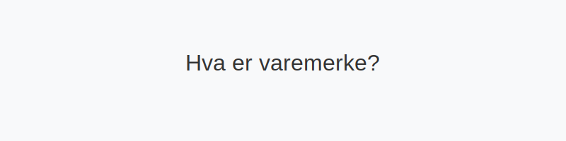

**Varemerke** er et juridisk beskyttet kjennetegn som identifiserer varer eller tjenester og gir rettighetshaver enerett til bruk. I norsk regnskap klassifiseres varemerker som **immaterielle eiendeler** og behandles etter prinsippene for aktivering, amortisering og mulige nedskrivninger.

For en bredere oversikt over immaterielle eiendeler, se [Hva er imaterielle eiendeler?](/blogs/regnskap/hva-er-imaterielle-eiendeler "Hva er Imaterielle Eiendeler? Komplett Guide til Immaterielle Verdier i Regnskap").

## 1. Definisjon og rettslig grunnlag

### 1.1 Hva er et varemerke?

Et **varemerke** kan være et ord, figur, bokstav, tall, fargekombinasjon eller en kombinasjon av disse som skiller en virksomhets varer eller tjenester fra andres. For å registreres må varemerket oppfylle krav om:

* **Særpreg:** Varemerket må kunne skilles klart fra andre kjennetegn.
* **Ikke-villedende karakter:** Det må ikke villede om produktenes art eller egenskaper.
* **Registrerbart:** Oppfylle vilkårene i [varemerkeloven](https://lovdata.no/dokument/NL/lov/2010-06-26-19) og godkjennes av Patentstyret.

### 1.2 Varemerke vs. andre immaterielle rettigheter

| Rettighetstype | Eksempler |
|----------------|----------|
| Patent         | [Hva er patent?](/blogs/regnskap/hva-er-patent "Hva er Patent? Guide til Patentbeskyttelse") |
| Varemerke      | [Hva er varemerke?](/blogs/regnskap/hva-er-varemerke "Hva er Varemerke? Guide til Immaterielle Eiendeler i Regnskap") |
| Opphavsrett    | [Hva er opphavsrett?](/blogs/regnskap/hva-er-opphavsrett "Hva er Opphavsrett? Guide til Opphavsrett i Regnskap") |

## 2. Regnskapsføring av varemerke

### 2.1 Aktivering i balansen

Varemerker kan aktiveres i balansen hvis de er anskaffet eller utviklet i virksomheten og det er sannsynlig at de vil gi fremtidige økonomiske fordeler. Aktivering følger generelt NRS og regnskapsloven.

| Konto | Beskrivelse | Type |
|-------|-------------|------|
| [1050 Varemerker](/blogs/kontoplan/1050-varemerker "Konto 1050 - Varemerker") | Immaterielt anleggsmiddel | Anleggsmiddel immateriell |

### 2.2 Amortisering og avskrivningsperiode

Varemerker amortiseres vanligvis lineært over levetiden. Typiske perioder:

| Periode | Kommentar |
|---------|-----------|
| 5 år    | Minimum, krever dokumentasjon |
| 10 år   | Vanlig praksis |
| 15 år   | Maksimum, og sjeldent valgt |

Se også [Hva er amortisering?](/blogs/regnskap/hva-er-amortisering "Hva er Amortisering? En Komplett Guide til Avskrivninger").

### 2.3 Nedskrivning

Ved indikasjoner på at et varemerke ikke lenger har forventet verdi, må virksomheten gjøre vurdering av nedskrivning. Les mer i [Hva er nedskrivning?](/blogs/regnskap/hva-er-nedskrivning "Hva er Nedskrivning? Guide til Nedskrivning i Regnskap").

## 3. Verdivurdering og vurderingsmodeller

Vanlig verdivurdering følger enten historisk kost eller virkelig verdi ved oppkjøp av varemerke. Kostprisprinsippet innebærer at anskaffelseskost med eventuelle direkte kostnader legges til grunn. Se [Hva er kostpris?](/blogs/regnskap/hva-er-kostpris "Hva er Kostpris? Komplett Guide til Anskaffelseskost").

## 4. Eksempel på amortisering

| År | Bokført verdi ved start | Årlig amortisering | Bokført verdi ved slutt |
|----|-------------------------|--------------------|-------------------------|
| 0  | 1 000 000 kr            | -                  | 1 000 000 kr            |
| 1  | 1 000 000 kr            | 100 000 kr         | 900 000 kr              |
| 2  | 900 000 kr              | 100 000 kr         | 800 000 kr              |

## 5. Oppsummering

Varemerker er en sentral **immateriell eiendel** som kan skape betydelig konkurransefortrinn. Korrekt regnskapsføring krever håndtering av aktivering, amortisering og eventuelle nedskrivninger i henhold til norske regnskapsstandarder.

