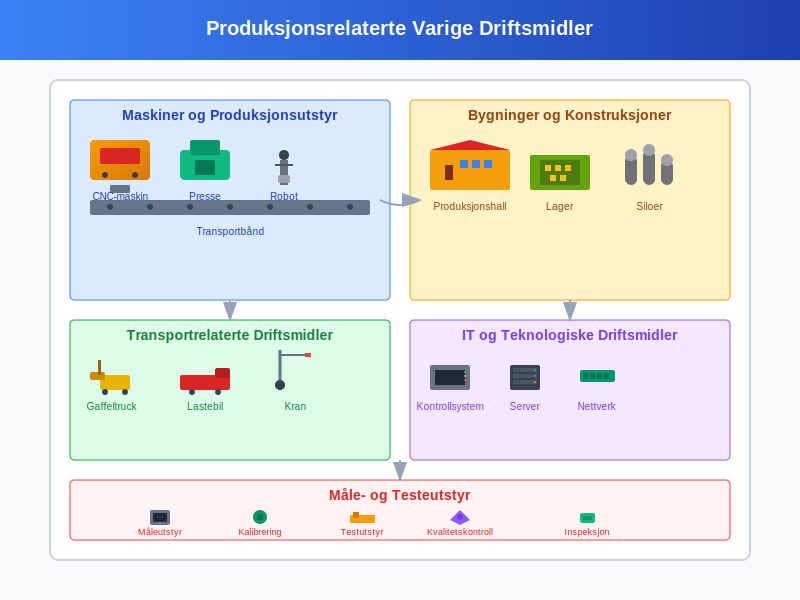
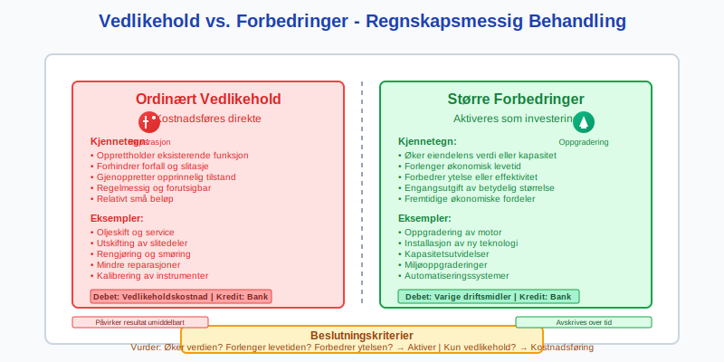

**Varige driftsmidler** er en type [driftsmidler](/blogs/regnskap/driftsmidler "Driftsmidler “ Komplett guide til betydning, klassifisering og regnskapsbehandling") og er **langsiktige materielle eiendeler** som brukes aktivt i bedriftens drift og er **avskrivbare** over tid. Disse eiendelene skiller seg fra andre [anleggsmidler](/blogs/regnskap/hva-er-anleggsmidler "Hva er Anleggsmidler? Komplett Guide til Faste Eiendeler i Regnskap") ved at de har fysisk substans og brukes direkte i produksjon eller drift. Varige driftsmidler utgjør ofte den største delen av materielle [anleggsmidler](/blogs/regnskap/hva-er-anleggsmidler "Hva er Anleggsmidler? Komplett Guide til Faste Eiendeler i Regnskap") og er kritiske for bedriftens operative kapasitet.


## Definisjon og Karakteristika

### Grunnleggende Definisjon

**Varige driftsmidler** defineres som **materielle eiendeler** som:

* **Brukes aktivt i drift** for produksjon eller levering av varer og tjenester
* **Har en forventet brukstid** på mer enn ett år
* **Har fysisk substans** - kan berøres og observeres
* **Avskrives systematisk** over sin økonomiske levetid
* **Ikke er ment for videresalg** i ordinær drift


### Avgrensning fra Andre Eiendeler

| Eiendeltype | Varige driftsmidler | Andre typer |
|:------------|:-------------------|:------------|
| **Tomter** | œ— (ikke avskrivbare) | Anleggsmidler |
| **Bygninger** | œ“ | - |
| **Maskiner** | œ“ | - |
| **Transportmidler** | œ“ | - |
| **Goodwill** | œ— (immateriell) | Immateriell anleggsmiddel |
| **Aksjer** | œ— (finansiell) | Finansiell anleggsmiddel |

## Klassifisering av Varige Driftsmidler

### Produksjonsrelaterte Driftsmidler

**Produksjonsrelaterte driftsmidler** er direkte knyttet til produksjonsprosessen:



#### Maskiner og Produksjonsutstyr

* **Produksjonsmaskiner:** CNC-maskiner, presser, dreiebenker
* **Prosessutstyr:** Ovner, kjølesystemer, renseanlegg
* **Automatiseringsustyr:** Roboter, transportbånd, sorteringsanlegg
* **Verktøymaskiner:** Boremaskiner, sveiseutstyr, skjæremaskiner
* **Måle- og testeutstyr:** Kvalitetskontrollsystemer, kalibreringsutstyr

#### Bygninger og Konstruksjoner

* **Produksjonshaller:** Fabrikker, verksteder, montagehaller
* **Lagerbygninger:** Råmateriallager, ferdigvarelager
* **Tekniske bygninger:** Kraftanlegg, vannbehandlingsanlegg
* **Spesialkonstruksjoner:** Siloer, tanker, rørledninger

### Transportrelaterte Driftsmidler

**Transport** er en sentral del av de fleste bedrifters drift:


#### Kjøretøy og Transportmidler

* **Firmabiler:** Personbiler for ansatte og salg
* **Lastebiler:** Transport av varer og materialer
* **Varebiler:** Distribusjon og service
* **Spesialkjøretøy:** Gaffeltrucks, kraner, gravemaskiner, traktorer

Flere artikler dekker transportrelaterte regnskapsaspekter:
- [Firmabil og skatt](/blogs/regnskap/hva-er-firmabil "Firmabil i Regnskap - Skattemessig Behandling og Fordelsbeskatning")
- [Transportkostnader](/blogs/regnskap/hva-er-transportkostnad "Transportkostnad i Regnskap - Typer og Regnskapsføring")

#### Maritime og Luftfart

* **Fartøy:** Båter, skip, ferger
* **Luftfartøy:** Fly, helikoptre
* **Tilhengere:** Semitrailere, tilhengere
* **Spesialutstyr:** Containere, løfteutstyr

### IT og Teknologiske Driftsmidler

Moderne bedrifter er avhengige av **teknologiske driftsmidler**:


#### Datautstyr og Servere

* **Servere:** Fysiske servere, rackutstyr
* **Nettverksutstyr:** Switcher, routere, brannmurer
* **Lagringssystemer:** SAN, NAS, backup-systemer
* **Arbeidsstasjoser:** Datamaskiner, skjermer, periferutstyr

#### Telekommunikasjon

* **Telefonsystemer:** PBX-anlegg, IP-telefoner
* **Kommunikasjonsutstyr:** Radioutstyr, intercom-systemer
* **Sikkerhetssystemer:** Overvåkningskameraer, adgangskontroll

### Kontorrelaterte Driftsmidler

**Kontordriftsmidler** støtter administrative funksjoner:


#### Kontormøbler og Utstyr

* **Møbler:** Skrivebord, stoler, møteromsmøbler
* **Oppbevaringssystemer:** Skap, arkivsystemer, skuffer
* **Kontorutstyr:** Kopimaskiner, printere, skannere
* **Kjøkkenutstyr:** Kjøleskap, mikrobølgeovner, kaffemaskiner

## Anskaffelse og Innregning

### Anskaffelseskost og Komponenter

[Anskaffelseskosten](/blogs/regnskap/hva-er-anskaffelse "Hva er Anskaffelse? Regnskapsføring og Skattemessig Behandling") for **varige driftsmidler** inkluderer alle nødvendige kostnader:


| Kostnadselement | Inkluderes | Eksempel |
|:----------------|:-----------|:---------|
| **Kjøpspris** | œ“ | Fakturaverdi ekskl. mva |
| **Transport** | œ“ | Frakt til bedriftens lokaler |
| **Installasjon** | œ“ | Montering og tilkobling |
| **Prøvekjøring** | œ“ | Testing og kalibrering |
| **Opplæring av operatører** | œ— | Føres som driftskostnad |
| **Finansieringskostnader** | œ— | Føres som rentekostnad |

### Bagatellgrense og Direkte Kostnadsføring

I Norge gjelder **bagatellgrense på 15.000 kroner**:

* **Under 15.000 kr:** Kan kostnadsføres direkte
* **Over 15.000 kr:** Må [aktiveres](/blogs/regnskap/hva-er-aktivering "Hva er Aktivering i Regnskap?") som varig driftsmiddel
* **Sammenhengende anskaffelser:** Vurderes samlet

**Eksempel:** Kjøp av 10 datamaskiner à 12.000 kr = 120.000 kr totalt. Må [aktiveres](/blogs/regnskap/hva-er-aktivering "Hva er Aktivering i Regnskap?") som varig driftsmiddel.

### Egentilvirkede Driftsmidler

For **egentilvirkede varige driftsmidler**:


**Inkluderte kostnader:**
* **Direkte materialkostnader**
* **Direkte lønn** til personer som arbeider med tilvirkingen
* **Variable indirekte kostnader** (strøm, vedlikehold)
* **Andel av faste indirekte kostnader** (forholdsmessig andel av overhead)

**Ekskluderte kostnader:**
* **Generelle administrative kostnader**
* **Finansieringskostnader**
* **Unormale kostnader** (svinn, omarbeiding)

## Avskrivningsmetoder

### Lineær Avskrivning

**Lineær avskrivning** er den mest brukte metoden for varige driftsmidler:


**Formel:** `Årlig avskrivning = (Anskaffelseskost - Restverdi) ÷ Brukstid`

**Eksempel - Produksjonsmaskin:**
* Anskaffelseskost: 800.000 kr
* Restverdi: 80.000 kr
* Brukstid: 8 år
* Årlig avskrivning: (800.000 - 80.000) ÷ 8 = 90.000 kr

### Saldoavskrivning

For skatteformål brukes ofte **[saldoavskrivning](/blogs/regnskap/hva-er-saldoavskrivning "Hva er Saldoavskrivning i Regnskap? Komplett Guide til Degressiv Avskrivning")**:


| Saldogruppe | Driftsmiddeltype | Sats |
|:------------|:-----------------|:-----|
| **a** | Bygninger, faste tekniske installasjoner | 4% |
| **b** | Personbiler, traktorer | 25% |
| **c** | Maskiner, redskap, instrumenter, inventar | 20% |
| **d** | Personbiler over 500.000 kr | 25% |

**Eksempel saldoavskrivning (20% sats):**
* År 1: 800.000 × 20% = 160.000 kr
* År 2: 640.000 × 20% = 128.000 kr  
* År 3: 512.000 × 20% = 102.400 kr

### Valg av Avskrivningsmetode


**Lineær avskrivning velges når:**
* Eiendelen brukes jevnt over tid
* Teknologisk foreldelse er begrenset
* Vedlikeholdskostnader er stabile

**Saldoavskrivning velges når:**
* Høyere produktivitet i begynnelsen
* Rask teknologisk utvikling
* Økende vedlikeholdskostnader over tid

## Verdsettelse og Nedskrivninger

### Løpende Verdsettelse

**Varige driftsmidler** verdsettes til **anskaffelseskost minus akkumulerte avskrivninger**:


**Bokført verdi = Anskaffelseskost - Akkumulerte avskrivninger - Nedskrivninger**

### Indikatorer på Verdifall

**Eksterne indikatorer:**
* **Teknologiske endringer:** Nye teknologier gjør eksisterende utstyr utdatert
* **Markedsendringer:** Redusert etterspørsel etter produkter
* **Regulatoriske endringer:** Nye miljøkrav eller sikkerhetsstandarder

**Interne indikatorer:**
* **Fysisk skade:** Ulykker, slitasje, korrosjon
* **Driftsproblemer:** Hyppige reparasjoner, redusert effektivitet
* **Endret bruk:** Omorganisering, nedleggelse av produksjonslinjer

### Nedskrivningstesting


**Steg 1:** Identifiser indikatorer på verdifall
**Steg 2:** Beregn gjenvinnbart beløp
**Steg 3:** Sammenlign med bokført verdi
**Steg 4:** Regnskapsføring av nedskrivning

**Gjenvinnbart beløp** = Høyeste av:
* **Virkelig verdi** minus salgskostnader
* **Bruksverdi** (nåverdi av fremtidige kontantstrømmer)

## Regnskapsføring av Varige Driftsmidler

### Anskaffelse

**Ved kjøp av produksjonsmaskin for 500.000 kr:**

```
Debet: Varige driftsmidler - Maskiner    500.000
Kredit: Leverandørgjeld                   500.000
```

### Månedlige Avskrivninger

**Ved lineær avskrivning på 8.333 kr per måned:**

```
Debet: Avskrivninger varige driftsmidler   8.333
Kredit: Akk. avskr. varige driftsmidler    8.333
```

### Vedlikehold og Reparasjoner



**Ordinært vedlikehold** kostnadsføres direkte:
```
Debet: Vedlikeholdskostnader              15.000
Kredit: Bank/Leverandørgjeld              15.000
```

**Større forbedringer** aktiveres:
```
Debet: Varige driftsmidler - Maskiner     50.000
Kredit: Bank/Leverandørgjeld              50.000
```

### Salg og Utrangering

**Ved salg med gevinst:**


**Eksempel:**
* Opprinnelig kostpris: 500.000 kr
* Akkumulerte avskrivninger: 300.000 kr
* Salgspris: 250.000 kr
* Gevinst: 250.000 - (500.000 - 300.000) = 50.000 kr

```
Debet: Bank                               250.000
Debet: Akk. avskr. varige driftsmidler   300.000
Kredit: Varige driftsmidler - Maskiner    500.000
Kredit: Gevinst ved salg anleggsmidler     50.000
```

## Praktiske Eksempler

### Produksjonsbedrift - MetallTech AS

**MetallTech AS** produserer metallkomponenter:


| Driftsmiddel | Anskaffelseskost | Akkum. avskr. | Bokført verdi |
|:-------------|:-----------------|:--------------|:--------------|
| **CNC-maskiner** | 2.500.000 | 800.000 | 1.700.000 |
| **Presser og stansemaskiner** | 1.800.000 | 720.000 | 1.080.000 |
| **Transportutstyr** | 600.000 | 300.000 | 300.000 |
| **Måle- og testeutstyr** | 400.000 | 240.000 | 160.000 |
| **Verkstøy og tilbehør** | 300.000 | 200.000 | 100.000 |
| **Total** | **5.600.000** | **2.260.000** | **3.340.000** |

### Transportselskap - LogiCorp AS

**LogiCorp AS** driver med varetransport:


| Driftsmiddel | Antall | Gjennomsnittlig verdi | Total verdi |
|:-------------|:-------|:---------------------|:------------|
| **Lastebiler** | 15 | 800.000 | 12.000.000 |
| **Tilhengere** | 20 | 200.000 | 4.000.000 |
| **Gaffeltrucks** | 8 | 150.000 | 1.200.000 |
| **Terminalutstyr** | - | - | 800.000 |
| **IT og administrasjon** | - | - | 500.000 |
| **Total** | | | **18.500.000** |

### Servicebedrift - TechSupport AS

**TechSupport AS** leverer IT-tjenester:

| Driftsmiddel | Verdi (NOK) | Andel | Avskrivningstid |
|:-------------|:------------|:------|:----------------|
| **Servere og nettverksutstyr** | 1.500.000 | 50% | 3-5 år |
| **Arbeidsstajoner** | 600.000 | 20% | 3 år |
| **Kontormøbler** | 400.000 | 13% | 10 år |
| **Firmabiler** | 300.000 | 10% | 5 år |
| **Verktøy og målutstyr** | 200.000 | 7% | 3-5 år |
| **Total** | **3.000.000** | **100%** | |

## Skattemessige Forhold

### Saldogrupper for Skatteformål

**Varige driftsmidler** fordeles på ulike **[saldogrupper](/blogs/regnskap/saldogruppe "Hva er Saldogruppe? Guide til Skattemessige Avskrivningsgrupper")**:


| Saldogruppe | Beskrivelse | Eksempler | Sats |
|:------------|:------------|:----------|:-----|
| **a** | Bygninger og faste installasjoner | Produksjonshaller, kjøleanlegg | 4% |
| **b** | Biler, traktorer, maskiner | Personbiler, gaffeltrucks | 25% |
| **c** | Maskiner, inventar, instrumenter | Produksjonsmaskiner, kontorutstyr | 20% |
| **d** | Personbiler over 500.000 kr | Luksusbiler | 25% |
| **e** | Skip, fly, bore-/leterigger | Maritime fartøy, luftfartøy | 14% |

### Forskjeller Regnskap vs. Skatt


**Midlertidige forskjeller** oppstår når:
* **Regnskapsmessig avskrivning** ‰  **Skattemessig avskrivning**
* **Nedskrivninger** i regnskapet ikke aksepteres skattemessig
* **Oppskrivninger** behandles forskjellig

**Eksempel midlertidig forskjell:**
* Regnskapsmessig avskrivning: 100.000 kr (lineær)
* Skattemessig avskrivning: 120.000 kr (saldo)
* Forskjell: 20.000 kr †’ Utsatt skatt

## Digitalisering og Moderne Utfordringer

### Digitale Verktøy for Forvaltning

**Moderne bedrifter** bruker digitale løsninger for å forvalte varige driftsmidler:


#### Asset Management Systemer

* **ERP-integrasjon:** Sømløs integrasjon med regnskapssystem
* **Livssyklussporing:** Fra anskaffelse til utrangering
* **Vedlikeholdsplanlegging:** Automatisert varsling og scheduling
* **Kostnadssporing:** Detaljert kostnadsoversikt per eiendel

#### IoT og Prediktivt Vedlikehold

* **Sensorer:** Kontinuerlig overvåking av driftsmidler
* **Dataanalyse:** Prediktive modeller for vedlikeholdsbehov
* **Automatisering:** Automatiske bestillinger av reservedeler
* **Optimalisering:** Maksimering av oppetid og levetid

### Utfordringer med Teknologiske Driftsmidler


**Rask teknologisk utvikling:**
* **Kortere levetid:** Raskere foreldelse av IT-utstyr
* **Oppgraderingskostnader:** Hyppige investeringer i ny teknologi
* **Kompatibilitetsproblemer:** Integrasjon mellom gamle og nye systemer

**Cybersikkerhet:**
* **Sikkerhetsinvesteringer:** Kostnader til beskyttelse
* **Compliance-krav:** Regulatoriske sikkerhetsstandarder
* **Risikohåndtering:** Forsikring mot cyberangrep

## Beste Praksis og Anbefalinger

### Strategisk Planlegging


#### Langsiktig Kapitalbudsjett

* **5-års investeringsplan:** Koordinert utskifting av driftsmidler
* **Teknologiutvikling:** Følg med på bransjestandarder
* **Kapasitetsplanlegging:** Balancer kapasitet med forventet vekst
* **Bærekraftshensyn:** Energieffektivitet og miljøpåvirkning

#### Livssyklusanalyse

* **Total Cost of Ownership (TCO):** Inkluder alle kostnader over levetiden
* **Driftskostnader:** Energi, vedlikehold, reservedeler
* **Resirkuleringsverdi:** Verdi ved utrangering
* **Alternativkostnader:** Sammenlign med leasing og outsourcing

### Operasjonell Forvaltning


#### Vedlikeholdsstrategi

* **Forebyggende vedlikehold:** Planlagte servicer og inspeksjoner
* **Prediktivt vedlikehold:** Basert på tilstandsovervåking
* **Korrektivt vedlikehold:** Reparasjoner ved feil
* **Vedlikeholdskontrakter:** Service-avtaler med leverandører

#### Risikohåndtering

* **Forsikringsdekning:** Adekvat dekning mot skader og utfall
* **Backup-løsninger:** Reserveutstyr og alternative prosesser
* **Sikkerhetsrutiner:** Beskyttelse mot tyveri og sabotasje
* **Dokumentasjon:** Komplett dokumentasjon av alle driftsmidler

### Regnskapsmessig Oppfølging

#### Månedlige Rutiner

* **Avskrivningsberegninger:** Kontroller automatiske beregninger
* **Verdifall-indikatorer:** Løpende vurdering av verdireduksjon
* **Nedskrivning:** Bokføring av nedskrivning på [Konto 6050 - Nedskrivning av varige driftsmidler](/blogs/kontoplan/6050-nedskrivning-av-varige-driftsmidler "Konto 6050 - Nedskrivning av varige driftsmidler")
* **Vedlikeholdskostnader:** Klassifisering av kostnader vs. investeringer
* **Forsikringsoppgjør:** Oppfølging av skadeerstatninger

#### Kvartalsvise Rutiner

* **Nedskrivningstesting:** Gjennomgang av verdifall-indikatorer
* **Budsjettoppfølging:** Sammenligning faktiske vs. budsjetterte investeringer
* **Effektivitetsanalyse:** Vurdering av driftsmidlenes produktivitet
* **Saldogruppeinnmelding:** Korrekt rapportering til skattemyndighetene

#### Årlige Rutiner

* **Fysisk inventering:** Telling og kontroll av alle driftsmidler
* **Verdsettelsesgjennomgang:** Full gjennomgang av alle verdsettelser
* **Avskrivningsmetode-evaluering:** Vurdering av metoder og forutsetninger
* **Strategisk gjennomgang:** Evaluering av driftsmiddelstrategien

## Sammenheng med Andre Regnskapselementer

### Påvirkning på Finansielle Rapporter

**Varige driftsmidler** påvirker alle hovedregnskapene:


#### Balansen
* **Anleggsmidler:** Bokført verdi av alle varige driftsmidler
* **Akkumulerte avskrivninger:** Motpost som reduserer bokført verdi
* **Totalkapital:** Betydelig påvirkning på bedriftens størrelse

#### Resultatregnskapet
* **Avskrivninger:** Årlig kostnad som reduserer resultat
* **Vedlikeholdskostnader:** Løpende driftskostnader
* **Gevinst/tap ved salg:** Påvirkning på årets resultat

#### Kontantstrømoppstillingen
* **Investeringsaktiviteter:** Kjøp og salg av driftsmidler
* **Avskrivninger:** Adderes tilbake da de ikke påvirker kontantstrøm

### Nøkkeltall og Analyse


| Nøkkeltall | Beregning | Tolkning |
|:-----------|:----------|:---------|
| **Kapitalintensitet** | Varige driftsmidler ÷ Omsetning | Hvor mye kapital trengs per krone omsetning |
| **Anleggsmiddelomsetning** | Omsetning ÷ Varige driftsmidler | Effektiviteten i bruk av driftsmidler |
| **Investeringsrate** | Årets investeringer ÷ Avskrivninger | Om bedriften vokser eller skrumper |
| **Gjennomsnittlig alder** | Akkumulerte avskr. ÷ Årlige avskr. | Hvor gamle driftsmidlene er |

## Fremtidige Trender og Utviklinger

### Teknologiske Trender


#### Automatisering og Robotisering
* **Industriroboter:** Økt bruk i produksjon
* **Cobots:** Samarbeid mellom mennesker og roboter
* **AI-styring:** Intelligente produksjonssystemer
* **Autonom transport:** Selvkjørende lastebiler og gaffeltrucks

#### Bærekraftige Teknologier
* **Energieffektivitet:** Krav til lavere energiforbruk
* **Fornybar energi:** Solcellepaneler, vindkraft på bedriftene
* **Sirkulærøkonomi:** Design for gjenbruk og resirkulering
* **Grønn transport:** Elektriske kjøretøy og hydrogenbiler

### Regnskapsmessige Utviklinger

#### Nye Regnskapsstandarder
* **IFRS 16 Leieavtaler:** Påvirkning på leasing av driftsmidler
* **ESG-rapportering:** Miljø-, sosial- og styringsrapportering
* **Bærekraftsregnskaper:** Integrert rapportering av bærekraft

#### Digitalisering av Regnskap
* **Automatisk gjenkjenning:** AI som klassifiserer driftsmidler
* **Sanntidsrapportering:** Kontinuerlig oppdatering av verdsettelser
* **Blockchain:** Sporbarhet og verifikasjon av eiendeler

## Konklusjon

**Varige driftsmidler** representerer ofte den største enkeltposten i bedrifters [anleggsmidler](/blogs/regnskap/hva-er-anleggsmidler "Hva er Anleggsmidler? Komplett Guide til Faste Eiendeler i Regnskap") og er kritiske for operasjonell evne og konkurransekraft. Korrekt håndtering av disse eiendelene krever:

**Strategisk perspektiv:**
* **Langsiktig planlegging:** Koordinert utskifting og oppgradering
* **Teknologiutvikling:** Følge med på bransjestandarder
* **Bærekraftsfokus:** Miljøhensyn i investeringsbeslutninger

**Operasjonell eksellens:**
* **Systematisk vedlikehold:** Maksimering av levetid og oppetid
* **Effektiv forvaltning:** Optimal bruk av tilgjengelige ressurser
* **Risikohåndtering:** Beskyttelse mot tap og skader

**Regnskapsmessig presisjon:**
* **Korrekt klassifisering:** Skille mellom kostnader og investeringer
* **Systematiske [avskrivninger](/blogs/regnskap/hva-er-avskrivning "Hva er Avskrivning i Regnskap? Metoder, Beregning og Praktiske Eksempler"):** Gjenspeile faktisk verdireduksjon
* **Løpende vurderinger:** Identifisere og håndtere verdifall

For moderne bedrifter blir digitaliseringen av driftsmiddelforvaltningen stadig viktigere, med IoT-sensorer, prediktivt vedlikehold og AI-basert optimalisering som nye standarder. Samtidig øker fokuset på bærekraft kravene til energieffektivitet og miljøpåvirkning.

Ved å følge etablerte prinsipper for **regnskapsføring**, **verdsettelse** og **forvaltning** kan bedrifter sikre at deres varige driftsmidler bidrar optimalt til verdiskaping og langsiktig suksess. For mer informasjon om relaterte emner, se våre artikler om [avskrivningsmetoder](/blogs/regnskap/hva-er-saldoavskrivning "Hva er Saldoavskrivning i Regnskap? Komplett Guide til Degressiv Avskrivning"), [anskaffelseskostnader](/blogs/regnskap/hva-er-anskaffelse "Hva er Anskaffelse? Regnskapsføring og Skattemessig Behandling") og [balansen](/blogs/regnskap/hva-er-balanse "Hva er Balanse i Regnskap? Komplett Guide til Balansen og Dens Komponenter").


