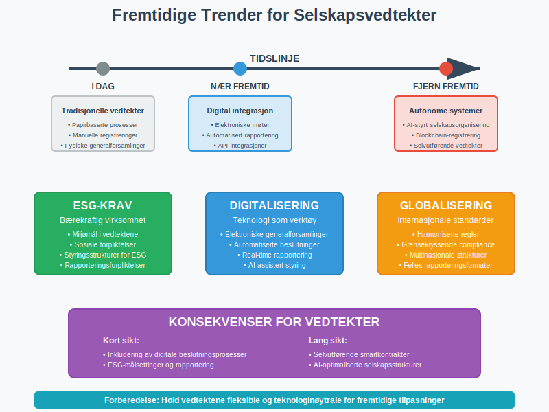

**Vedtekter for aksjeselskap** er obligatoriske juridiske bestemmelser som regulerer hvordan et [aksjeselskap (AS)](/blogs/regnskap/hva-er-et-aksjeselskap "Hva er et Aksjeselskap? Komplett Guide til Selskapsformen") skal organiseres og drives. Vedtektene fungerer som selskapets grunnlov og må utarbeides i henhold til [aksjeloven](/blogs/regnskap/hva-er-aksjeloven "Hva er Aksjeloven? Regler for Aksjeselskaper i Norge"). De definerer selskapets **formål**, **aksjekapital**, **styringsstruktur** og andre fundamentale forhold som påvirker både [regnskapsføring](/blogs/regnskap/hva-er-bokforing "Hva er Bokføring? Komplett Guide til Regnskapsføring") og daglig drift.

### Hva er Vedtekter?

Vedtekter er de grunnleggende reglene som styrer et aksjeselskap. De må være skriftlige og inneholde **obligatoriske bestemmelser** som kreves av aksjeloven, samt eventuelle **fakultative bestemmelser** som aksjonærene ønsker å inkludere.

Vedtektene har **juridisk bindende kraft** for selskapet, [styret](/blogs/regnskap/hva-er-styre "Hva er et Styre? Roller og Ansvar i Aksjeselskap"), aksjonærene og tredjeparter. De registreres i Foretaksregisteret og er offentlig tilgjengelige, noe som gir transparent informasjon om selskapets organisering.

### Lovpålagte Krav til Vedtekter

Aksjeloven § 2-2 krever at vedtektene inneholder følgende **obligatoriske bestemmelser**:

| Bestemmelse | Beskrivelse | Betydning |
|-------------|-------------|-----------|
| **Selskapets navn** | Fullstendig firmanavn med AS-betegnelse | Identifiserer selskapet juridisk |
| **Forretningsadresse** | Hvor selskapet har sitt hovedsete | Bestemmer verneting og jurisdiksjon |
| **Virksomhetens art** | Beskrivelse av selskapets formål og aktiviteter | Avgrenser hva selskapet kan drive med |
| **Aksjekapital** | Størrelse på [aksjekapital](/blogs/regnskap/hva-er-aksjekapital "Hva er Aksjekapital? Betydning og Krav") og pålydende | Grunnlag for [egenkapital](/blogs/regnskap/hva-er-egenkapital "Hva er Egenkapital? Regnskapsføring og Beregning") |
| **Aksjenes pålydende** | Verdi per aksje eller at aksjer ikke har pålydende | Påvirker aksjestruktur og rettigheter |

### Innhold i Vedtektene

#### Obligatoriske Bestemmelser

**Selskapets navn** må være unikt og inneholde "aksjeselskap" eller forkortelsen "AS". Navnet registreres i Foretaksregisteret og kan ikke forveksles med eksisterende selskaper.

**Forretningsadressen** angir hvor selskapet har sitt juridiske hovedsete. Dette påvirker hvilket tingrett som har jurisdiksjon og hvor [generalforsamling](/blogs/regnskap/hva-er-generalforsamling "Hva er Generalforsamling? Makt og Ansvar") skal avholdes.

**Virksomhetens art** beskriver hva selskapet skal drive med. En bred formulering gir fleksibilitet, mens en snever formulering kan kreve vedtektsendring ved utvidelse av virksomheten.

#### Fakultative Bestemmelser

Vedtektene kan også inneholde **valgfrie bestemmelser** som:

* **Styrets sammensetning** og valgperiode
* **Generalforsamlingens myndighet** utover lovens minimum
* **Aksjenes omsettbarhet** og [forkjøpsretter](/blogs/regnskap/forkjopsrett "Hva er en Forkjøpsrett? Retten til å kjøpe aksjer før eksterne"). Dette henger tett sammen med føringen av [aksjeeierboken](/blogs/regnskap/hva-er-en-aksjeeierbok "Hva er en Aksjeeierbok? En Komplett Guide"), og detaljerte regler for salg og overføring av aksjer reguleres ofte i en [aksjonæravtale](/blogs/regnskap/aksjonaeravtale "Hva er en Aksjonæravtale? En Omfattende Guide til Aksjonæravtaler i Norge").
* **Utbyttepolitikk** og distribusjonsbegrensninger
* **Særlige rettigheter** for ulike aksjeklasser

### Vedtektenes Rolle i Selskapsorganiseringen

#### Styringsstruktur

Vedtektene definerer hvordan selskapet skal styres og organiseres. De fastsetter [styrets](/blogs/regnskap/hva-er-styre "Hva er et Styre? Roller og Ansvar i Aksjeselskap") sammensetning, generalforsamlingens myndighet og beslutningsprosesser.

Dette påvirker direkte **regnskapsansvaret** og hvordan [internkontroll](/blogs/regnskap/hva-er-internkontroll "Hva er Internkontroll? System for Risikostyring") skal organiseres. Tydelige ansvarsforhold i vedtektene bidrar til bedre [god regnskapsskikk](/blogs/regnskap/god-regnskapsskikk "God Regnskapsskikk: Prinsipper og Praktisk Anvendelse").

#### Kapitalstruktur

Vedtektene regulerer selskapets **kapitalstruktur** gjennom bestemmelser om:

* [Aksjekapital](/blogs/regnskap/hva-er-aksjekapital "Hva er Aksjekapital? Betydning og Krav") og aksjefordeling
* Rettigheter knyttet til ulike aksjeklasser
* Prosedyrer for [kapitalforhøyelse](/blogs/regnskap/kapitalforhoyelse "Kapitalforhøyelse: Metoder og Regnskapsføring")
* Begrensninger på [utbytte](/blogs/regnskap/hva-er-utbytte "Hva er Utbytte? Utdeling fra Aksjeselskap")

### Endring av Vedtekter

#### Beslutningsprosess

Endring av vedtekter krever **kvalifisert flertall** i generalforsamlingen, normalt to tredjedeler av både avgitte stemmer og representert aksjekapital. Aksjonærer kan koordinere sin stemmegivning ved slike viktige vedtektsendringer gjennom en [aksjonæravtale](/blogs/regnskap/aksjonaeravtale "Hva er en Aksjonæravtale? En Omfattende Guide til Aksjonæravtaler i Norge") for å sikre enhetlig beslutningstagning. Prosessen omfatter:

1. **Innkalling** til generalforsamling med minst 21 dagers varsel
2. **Behandling** av vedtektsendringen i generalforsamlingen
3. **Vedtak** med kvalifisert flertall
4. **Registrering** i Foretaksregisteret innen 30 dager

#### Registrering og Ikrafttredelse

Vedtektsendringer må **registreres** i Foretaksregisteret for å få juridisk virkning. Endringen trer i kraft når den er registrert, med mindre annet er bestemt i vedtaket.

Enkelte endringer, som økning av aksjekapital, krever også at **kapitaltilskuddet** er innbetalt før registrering kan skje.

### Regnskapsmessige Konsekvenser

#### Påvirkning på Regnskapsføring

Vedtektene påvirker [regnskapsføring](/blogs/regnskap/hva-er-bokforing "Hva er Bokføring? Komplett Guide til Regnskapsføring") på flere måter:

* **Aksjekapital** føres som [egenkapital](/blogs/regnskap/hva-er-egenkapital "Hva er Egenkapital? Regnskapsføring og Beregning") i [balansen](/blogs/regnskap/hva-er-balanse "Hva er Balanse? Grunnleggende Regnskapsprinsipp")
* **Aksjepremie** føres separat ved emisjon over pålydende
* **Bunden egenkapital** påvirkes av aksjekapitalens størrelse
* **Utbyttebegrensninger** følger av vedtektenes kapitalbestemmelser

#### Rapportering og Noteopplysninger

[Årsregnskapet](/blogs/regnskap/hva-er-arsregnskap "Hva er Årsregnskap? Innhold og Krav") må inneholde opplysninger om:

* Aksjekapitalens størrelse og sammensetning
* Endringer i aksjekapital i løpet av året
* Begrensninger i utdeling av utbytte
* Særlige rettigheter knyttet til aksjeklasser

### Praktiske Råd for Etablering

#### Utforming av Vedtekter

Ved etablering av aksjeselskap bør du vurdere:

* **Bred formulering** av virksomhetens art for fremtidig fleksibilitet
* **Praktisk aksjekapital** som dekker oppstartsbehovene
* **Tydelige styringsregler** for å unngå fremtidige konflikter
* **Forkjøpsretter** for å kontrollere eiersammensetningen

#### Profesjonell Bistand

Det anbefales å bruke **advokat** eller **regnskapsfører** ved utarbeidelse av vedtekter. De kan sikre at:

* Alle lovkrav er oppfylt
* Vedtektene er tilpasset din virksomhet
* Skattemessige konsekvenser er vurdert
* Fremtidige endringsbehov er forutsett

### Digitale Verktøy og Ressurser

#### Elektronisk Registrering

**Altinn** tilbyr elektronisk innsending av vedtektsendringer til Foretaksregisteret. Dette forenkler prosessen og reduserer behandlingstiden.

Mange **regnskapssystemer** kan også generere nødvendige rapporter basert på vedtektenes kapitalbestemmelser.

#### Vedlikehold og Oppdatering

Vedtektene bør **gjennomgås jevnlig** for å sikre at de fortsatt er hensiktsmessige. Ved større endringer i virksomheten eller lovverket kan oppdatering være nødvendig.

### Fremtidige Utviklinger

#### Lovutvikling

Aksjeloven gjennomgås jevnlig, og endringer kan påvirke kravene til vedtekter. Det er viktig å **holde seg oppdatert** på lovutvikling som kan kreve vedtektsendringer.

#### Digitalisering

Økt digitalisering kan føre til **elektroniske generalforsamlinger** og digitale beslutningsprosesser, noe som kan kreve tilpasninger i vedtektene.

**ESG-krav** (Environmental, Social, Governance) kan også påvirke hvordan vedtekter utformes for å sikre bærekraftig virksomhet.

### Konklusjon

Vedtekter for aksjeselskap er **fundamentale juridiske dokumenter** som regulerer selskapets organisering og drift. De påvirker alt fra [regnskapsføring](/blogs/regnskap/hva-er-bokforing "Hva er Bokføring? Komplett Guide til Regnskapsføring") til [styringsansvar](/blogs/regnskap/hva-er-styre "Hva er et Styre? Roller og Ansvar i Aksjeselskap") og må utarbeides nøye for å sikre effektiv selskapsorganisering.

Ved å forstå vedtektenes rolle og krav kan du **sikre at ditt aksjeselskap** opererer innenfor lovens rammer og har en solid juridisk struktur for fremtidig vekst og utvikling.

