---
title: "Hva er velferdstiltak?"
seoTitle: "Hva er velferdstiltak | Skatteregler for ansatte"
description: "Velferdstiltak er ordninger og ytelser som gir ansatte velferd og trygghet. Lær om lovpålagte og frivillige tiltak, skatteregler, regnskapsføring og beste praksis for arbeidsgivere."
summary: "Oversikt over velferdstiltak: kategorier, skattemessig behandling, regnskapsføring og praktiske råd for utforming av ordninger."
---

**Velferdstiltak** er ytelser og ordninger som sikrer arbeidstakernes velferd og trygghet gjennom arbeidsforholdet. For arbeidsgivere representerer velferdstiltak både en sosial forpliktelse og en strategisk investering som påvirker [lønnskostnader](/blogs/regnskap/lonnskostnad "Lønnskostnad - Komplett Guide til Beregning og Regnskapsføring"), [personaladministrasjon](/blogs/regnskap/hva-er-personaladministrasjon "Hva er Personaladministrasjon? Komplett Guide til HR og Lønnsrutiner") og [skattepliktige fordeler](/blogs/regnskap/hva-er-skattepliktig-inntekt "Hva er Skattepliktig Inntekt? Beregning og Optimalisering"). Forståelse av velferdstiltak er kritisk for korrekt regnskapsføring og optimalisering av ansattes totale kompensasjonspakke.

For en nærmere gjennomgang av ulike velferdsgoder, se [Velferdsgoder](/blogs/regnskap/velferdsgoder "Velferdsgoder i Norsk Regnskap: Oversikt over Ansattfordeler og Regnskapsføring").

## Seksjon 1: Grunnleggende om Velferdstiltak

Velferdstiltak omfatter alle **ytelser og fordeler** som arbeidsgivere tilbyr utover den ordinære lønnen. Disse tiltakene bidrar til å skape et attraktivt arbeidssted og kan ha betydelige regnskaps- og skattemessige konsekvenser.

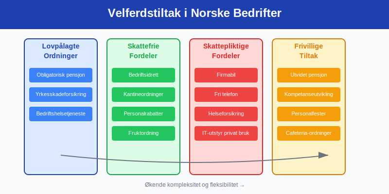

### 1.1 Definisjon og Lovgrunnlag

**Velferdstiltak** reguleres av flere lovverk og bestemmelser:

* **Skatteloven:** Definerer skattepliktige vs. skattefrie fordeler
* **Arbeidsmiljøloven:** Setter minimumsstandard for velferd på arbeidsplassen
* **Tariffavtaler:** Kan kreve spesifikke velferdstiltak
* **Folketrygdloven:** Regulerer lovpålagte trygdeordninger

### 1.2 Kategorisering av Velferdstiltak

**Hovedkategorier** av velferdstiltak:

| **Kategori** | **Beskrivelse** | **Skattemessig behandling** | **Regnskapsføring** |
|--------------|-----------------|---------------------------|-------------------|
| **Lovpålagte ordninger** | [Obligatorisk tjenestepensjon](/blogs/regnskap/obligatorisk-tjenestepensjon "Obligatorisk Tjenestepensjon - Krav og Regnskapsføring"), yrkesskadeforsikring | Fradragsberettiget | Lønnskostnad |
| **Skattefrie fordeler** | Bedriftsidrett, kantineordninger | Ikke skattepliktig for ansatt | Driftskostnad |
| **Skattepliktige fordeler** | [Firmabil](/blogs/regnskap/hva-er-firmabil "Hva er Firmabil? Regnskapsføring og Skattemessige Konsekvenser"), fri telefon | Skattepliktig for ansatt | Lønnskostnad + naturalytelse |
| **Frivillige ordninger** | Utvidet helseforsikring, bonusordninger, [Frivillig innskuddspensjon](/blogs/regnskap/frivillig-innskuddspensjon "Frivillig Innskuddspensjon: Guide til Frivillig Pensjonsordning") | Varierer | Avhenger av ordning |

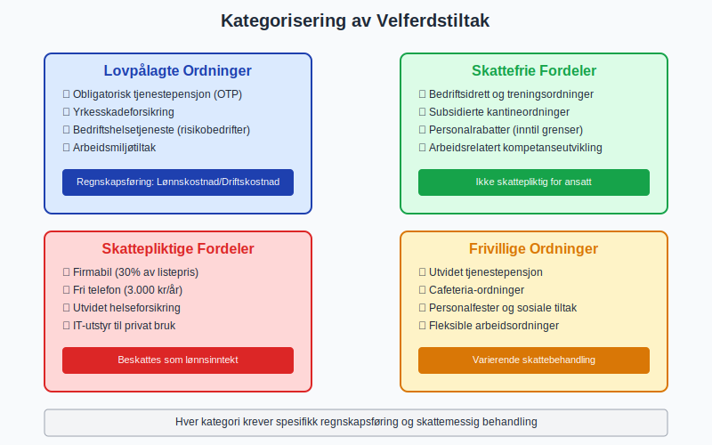

### 1.3 Strategiske Hensyn

**Velferdstiltak** som strategisk verktøy:

#### Rekrutteringsfordeler:
* **Konkurransefortrinn:** Attraktive pakker tiltrekker talenter
* **Kompensasjon for lavere lønn:** Velferdstiltak kan veie opp for lønnsgap
* **Employer branding:** Signaliserer arbeidsgiverens verdier
* **Retensjon:** Reduserer utskiftningskostnader

#### Kostnad-nytte analyse:
* **Direkte kostnader:** Premie, administrasjon, systemkostnader
* **Indirekte gevinster:** Redusert sykefravær, økt produktivitet
* **Skatteeffektivitet:** Optimalisering av skattebyrde
* **Administrativ effektivitet:** Sentraliserte innkjøp og avtaler

## Seksjon 2: Lovpålagte Velferdstiltak

### 2.1 Obligatorisk Tjenestepensjon (OTP)

**[Obligatorisk tjenestepensjon](/blogs/regnskap/obligatorisk-tjenestepensjon "Obligatorisk Tjenestepensjon - Krav og Regnskapsføring")** er det mest omfattende lovpålagte velferdstiltaket:

#### Hovedkrav:
* **Minimum innskudd:** 2% av lønn mellom 1G og 7,1G
* **Dekningsgrad:** Alle ansatte med minst 20% stilling
* **Opptjeningsperiode:** Fra første arbeidsdag
* **Administrasjon:** Gjennom godkjent pensjonsinnretning

#### Regnskapsføring:
```
Månedlig periodisering:
Debet: Pensjonskostnad
Kredit: Skyldig pensjonspremie

Ved innbetaling:
Debet: Skyldig pensjonspremie  
Kredit: Bank
```

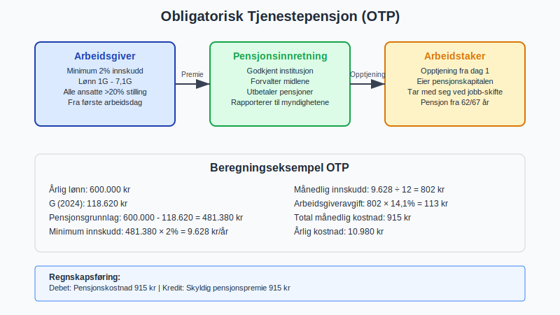

### 2.2 Yrkesskadeforsikring

**Yrkesskadeforsikring** dekker skader som oppstår i arbeidsforhold:

| **Element** | **Krav** | **Dekning** | **Kostnad** |
|-------------|----------|-------------|-------------|
| **Lovpålagt** | Alle arbeidsgivere | Yrkesrelaterte skader | 0,5-2% av lønnssum |
| **Frivillig utvidelse** | Valgfritt | Fritidsskader, høyere erstatning | 1-3% av lønnssum |
| **Behandlingsdekning** | Standard | Medisinsk behandling | Inkludert i premie |

#### Regnskapsbehandling:
* **Klassifisering:** Sosiale kostnader/personalforsikring
* **Periodisering:** Månedlig avsetning basert på lønnssum
* **MVA:** Ikke fradragsberettiget (fritatt for MVA)

### 2.3 Bedriftshelsetjeneste

**Bedriftshelsetjeneste** er lovpålagt for virksomheter med særlige risikoer:

#### Krav og omfang:
* **Risikovurdering:** Avgjør om BHT er påkrevd
* **Tjenester:** Forebygging, rådgivning, helsekontroller
* **Kompetansekrav:** Autorisert helsepersonell
* **Kostnader:** 500-5000 kr per ansatt årlig

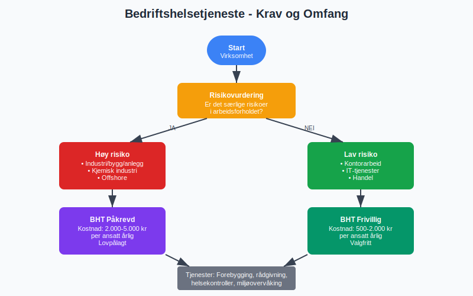

## Seksjon 3: Skattefrie Velferdstiltak

### 3.1 Bedriftsidrett og Treningsordninger

**Bedriftsidrett** er et populært skattefritt velferdstiltak:

#### Skattefrie ytelser:
* **Bedriftstreningssentre:** Egne eller eksterne treningsanlegg
* **Organisert trening:** Gruppetrening, instruktørledede økter
* **Idrettsutstyr:** Grunnleggende treningsutstyr
* **Maksimumsverdier:** Rimelighetsvurdering uten fast grense

#### Regnskapsføring:
```
Månedlige kostnader:
Debet: Velferdskostnader
Kredit: Leverandørgjeld/Bank

Årlig avskrivning utstyr:
Debet: Avskrivning treningsutstyr
Kredit: Akkumulerte avskrivninger
```

### 3.2 Kantineordninger

**Subsidierte kantiner** kan være skattefrie under visse betingelser:

| **Type ordning** | **Skattefrihet** | **Vilkår** | **Regnskapsføring** |
|------------------|------------------|-------------|-------------------|
| **Gratis kaffe/te** | Ja | Alminnelig tilgjengelig | Driftskostnad |
| **Subsidiert kantine** | Ja | Maksimalt 50% rabatt | Driftskostnad minus inntekt |
| **Gratis lunsj** | Nei | Skattepliktig fordel | Lønnskostnad |
| **Fruktordning** | Ja | Begrenset verdi | Driftskostnad |

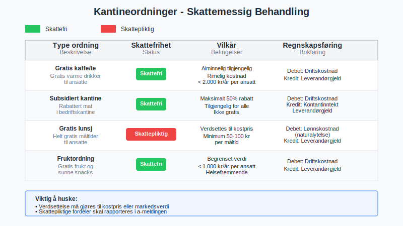

### 3.3 Personalrabatter

**Personalrabatter** på bedriftens produkter eller tjenester:

#### Skattefrie grenser:
* **Egne produkter:** Inntil 8.000 kr årlig per ansatt
* **Tjenester:** Inntil rimelig markedsverdi
* **Tredjepartsprodukter:** Må vurderes individuelt
* **Dokumentasjon:** Krav til verdsettelse og registrering

#### Administrative rutiner:
* **Registreringssystem:** Sporing av personlige rabatter
* **Rapportering:** Årlig oversikt til skattemyndighetene
* **Internkontroll:** Sikre at grenser ikke overskrides

## Seksjon 4: Skattepliktige Velferdstiltak

### 4.1 Firmabil og Transportfordeler

**[Firmabil](/blogs/regnskap/hva-er-firmabil "Hva er Firmabil? Regnskapsføring og Skattemessige Konsekvenser")** er det mest omfattende skattepliktige velferdstiltaket:

#### Beregning av fordelsverdi:
```
Beregningsformel:
Listepris × 30% × (1 - [Egenandel/Listepris])
Minimum: Listepris × 10%

Eksempel:
Listepris bil: 600.000 kr
Egenandel: 60.000 kr (10%)
Fordelsverdi: 600.000 × 30% × (1-0,1) = 162.000 kr årlig
```

#### Regnskapsføring firmabil:
```
Anskaffelse:
Debet: Firmabil (varige driftsmidler)
Kredit: Leverandørgjeld

Månedlig avskrivning:
Debet: Avskrivning firmabil
Kredit: Akkumulerte avskrivninger

Naturalytelse til ansatt:
Debet: Lønnskostnad (fordelsverdi)
Kredit: Skyldig lønn
```

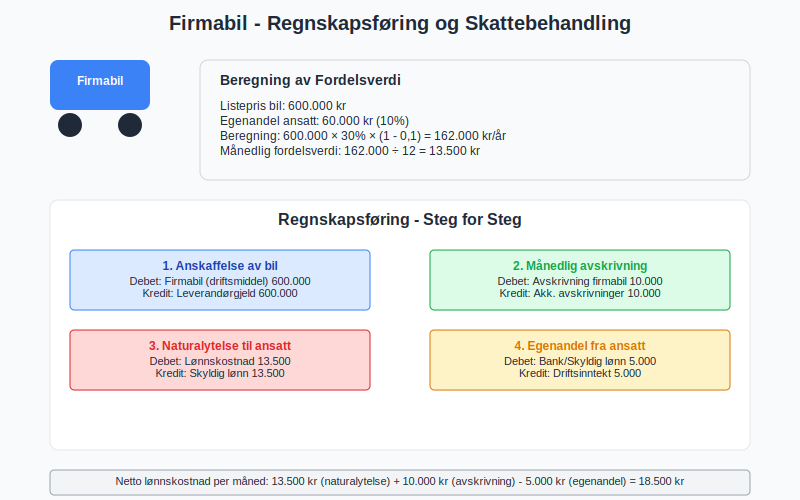

### 4.2 Teknologifordeler

**IT-utstyr og kommunikasjonsfordeler:**

| **Fordel** | **Skattepliktig verdi** | **Typisk kostnad** | **Regnskapsklassifisering** |
|------------|------------------------|-------------------|----------------------------|
| **Mobiltelefon** | Fri bruk: 3.000 kr/år | 500-1.500 kr/mnd | Driftskostnad + lønnskostnad |
| **Hjemmekontor PC** | Privat bruk: 20-30% av kostnad | 10.000-30.000 kr | Varige driftsmidler |
| **Internettforbindelse** | Privat bruk: 2.000-4.000 kr/år | 500-800 kr/mnd | Driftskostnad |
| **Programvare** | Privat lisens: Markedsverdi | Varierer | Driftskostnad + lønnskostnad |

### 4.3 Helseforsikring og Behandling

**Utvidet helseforsikring** utover lovpålagte ordninger:

#### Skattepliktige elementer:
* **Behandlingsforsikring:** Full verdi er skattepliktig
* **Familiedekning:** Verdi for familiemedlemmer
* **Alternativ behandling:** Kiropraktor, fysioterapi utover offentlig dekning
* **Tannbehandling:** Utover akutt behandling

#### Regnskapsføring:
```
Premieinnbetaling:
Debet: Helseforsikringskostnad
Kredit: Bank

Fordelsverdi til ansatt:
Debet: Lønnskostnad (naturalytelse)
Kredit: Skyldig lønn
```

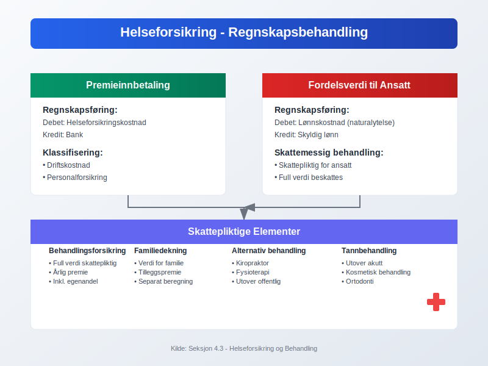

## Seksjon 5: Pensjonsordninger og Langsiktige Fordeler

### 5.1 Utvidet Tjenestepensjon

**[Tjenestepensjon](/blogs/regnskap/hva-er-tjenestepensjon "Hva er Tjenestepensjon? Regnskapsføring og Skattemessige Konsekvenser")** utover obligatorisk minimum:

#### Innskuddsbaserte ordninger:
* **Økt innskuddssats:** Fra 2% til 5-15% av lønn
* **Utvidet lønnsgrunnlag:** Inkludere lønn over 7,1G
* **Fleksible innskudd:** Varierende innskudd basert på alder/posisjon
* **Investeringsvalg:** Ansattes valgmuligheter

#### Ytelsesbaserte ordninger:
* **Sluttlønnsordninger:** Pensjon basert på sluttlønn
* **Karrierelønnordninger:** Pensjon basert på gjennomsnittslønn
* **Hybrid-ordninger:** Kombinasjon av innskudd og ytelse

#### Regnskapsføring innskuddsordning:
```
Månedlig kostnad:
Debet: Pensjonskostnad
Kredit: Skyldig pensjonspremie

Arbeidsgiveravgift:
Debet: Arbeidsgiveravgift
Kredit: Skyldig arbeidsgiveravgift
```

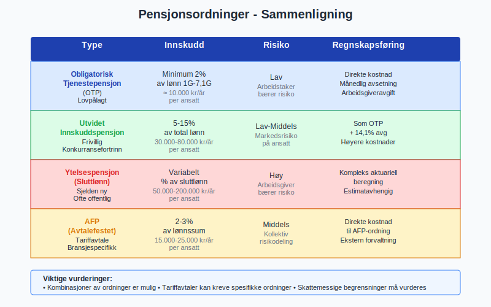

### 5.2 AFP og Særlige Pensjonsordninger

**Avtalefestet pensjon (AFP)** og andre særordninger:

| **Ordning** | **Hovedkjennetegn** | **Kostnadsnivå** | **Regnskapsbehandling** |
|-------------|-------------------|------------------|----------------------|
| **AFP (privat)** | Tidligpensjon fra 62 år | 2-3% av lønnssum | Kompleks aktuariell beregning |
| **AFP (offentlig)** | Livsvarig tillegg til alderspensjon | 2% av lønnssum | Direkte kostnad |
| **Topplønnspensjon** | Pensjon for lønn over 7,1G | 1-5% av høy lønn | Egne pensjonsavtaler |

### 5.3 Livsforsikring og Uførependel

**Personforsikringer** knyttet til pensjonsordninger:

#### Livsforsikring:
* **Gruppelivsforsikring:** 4-10 ganger årlig lønn
* **Kostnad:** 1-3 promille av forsikringssum
* **Skattebehandling:** Premie fradragsberettiget, utbetaling skattepliktig

#### Uførepensjon:
* **Dekning:** 60-70% av lønn ved uførhet
* **Karenstid:** 3-12 måneder etter [sykepenger](/blogs/regnskap/hva-er-sykepenger "Sykepenger - Komplett Guide til Arbeidsgiverperiode, NAV-refusjon og Regnskapsføring")
* **Integrasjon:** Koordinert med offentlig uføretrygd

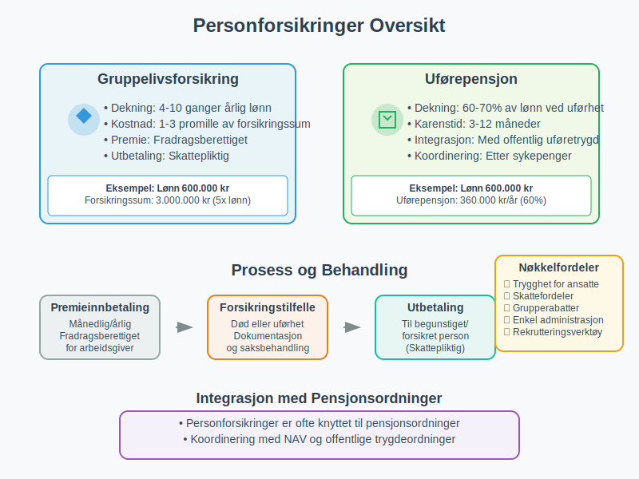

## Seksjon 6: Fleksible Fordelsordninger (Cafeteria-ordninger)

### 6.1 Konsept og Struktur

**Cafeteria-ordninger** gir ansatte valgfrihet i fordelssammensetning:

#### Grunnprinsipper:
* **Fordelspott:** Fast beløp per ansatt til fordeling
* **Valgmeny:** Forhåndsdefinerte alternativer
* **Fleksibilitet:** Individuelle prioriteringer
* **Administrativ løsning:** Digital platform for valg og administrasjon

#### Typiske valgmuligheter:
```
Fordelspott: 50.000 kr årlig

Valgalternativer:
- Ekstra ferieuker: 15.000 kr/uke
- Utvidet helseforsikring: 25.000 kr
- Ekstra pensjonsinnskudd: 1:1 matching
- Kontantutbetaling: Skattepliktig lønn
- Kursvirksomhet: 30.000 kr
```

### 6.2 Skattemessige Vurderinger

**Kompleks skattebehandling** i cafeteria-ordninger:

| **Fordeltype** | **Skattebehandling** | **Arbeidsgiverens fradrag** | **Administrasjon** |
|----------------|---------------------|---------------------------|-------------------|
| **Skattefrie fordeler** | Ikke skattepliktig for ansatt | Fullt fradragsberettiget | Enkel |
| **Skattepliktige fordeler** | Beskattes som lønn | Fullt fradragsberettiget | Kompleks verdsettelse |
| **Kontantutbetaling** | Skattepliktig lønn | Lønnskostnadsfradrag | Standard lønn |
| **Pensjonsinnskudd** | Ikke skattepliktig | Fradragsberettiget | Pensjonsadministrasjon |

### 6.3 Implementering og Administrasjon

**Praktisk gjennomføring** av cafeteria-ordninger:

#### Systemkrav:
* **Digital platform:** For ansattes valg og endringer
* **Lønnssystemintegrasjon:** Automatisk behandling av valg
* **Regnskapsintegrasjon:** Korrekt bokføring av forskjellige fordeler
* **Rapportering:** Skattemessig rapportering til myndighetene

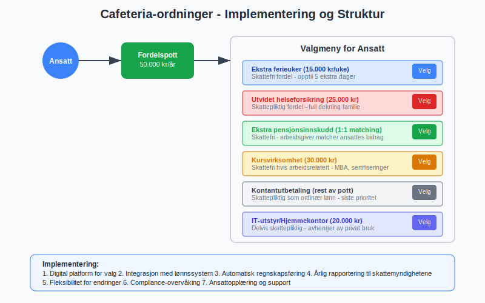

## Seksjon 7: Kompetanseutvikling og Kursvirksomhet

### 7.1 Arbeidsrelatert Kompetanseutvikling

**Kurs og utdanning** finansiert av arbeidsgiver:

#### Skattefrie kategorier:
* **Arbeidsrelaterte kurs:** Direkte knyttet til arbeidsoppgaver
* **Sikkerhetsopplæring:** HMS og obligatorisk opplæring
* **IT-opplæring:** Systemer brukt i arbeidsforhold
* **Språkkurs:** Nødvendig for arbeidsutførelse

#### Skattepliktige kategorier:
* **Generell utdanning:** Ikke arbeidsrelatert
* **Personlig utvikling:** Livsstilskurs, coaching
* **Fritidsinteresser:** Hobbykurs og fritidsaktiviteter

### 7.2 Regnskapsføring av Kompetanseutvikling

**Bokføring** av utdanningskostnader:

```
Arbeidsrelaterte kurs:
Debet: Kompetanseutvikling/Kursvirksomhet
Kredit: Leverandørgjeld/Bank

Ikke-arbeidsrelaterte kurs:
Debet: Lønnskostnad (naturalytelse)
Kredit: Leverandørgjeld/Bank

MVA-behandling:
- Innenlandske kurs: 25% MVA, fradragsberettiget
- Utenlandske kurs: Ingen MVA
```

### 7.3 Langsiktige Utdanningsavtaler

**Studietillatelse og utdanningsstøtte:**

| **Type avtale** | **Skattebehandling** | **Tilbakebetalingsplikt** | **Regnskapsføring** |
|-----------------|---------------------|--------------------------|-------------------|
| **Mastergrad (arbeidsrelatert)** | Skattefri | Ofte 2-5 år binding | Driftskostnad |
| **Doktorgrad** | Skattefri hvis forskning | Akademisk binding | Investering/kostnad |
| **MBA** | Delvis skattepliktig | Kommersiell binding | Blandet behandling |
| **Språkutdanning** | Avhenger av relevans | Kort binding | Driftskostnad |

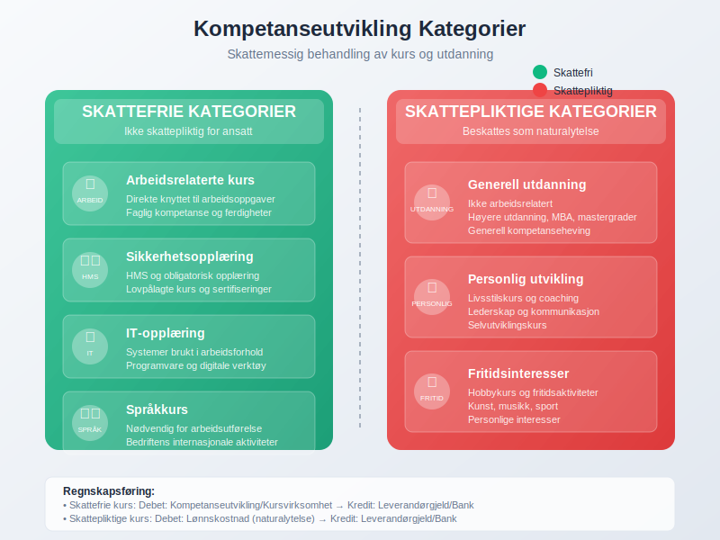

## Seksjon 8: Trivsel og Sosiale Arrangements

### 8.1 Personalfester og Sosiale Aktiviteter

**Arrangement** for ansatte og deres trivsel:

#### Skattefrie arrangementer:
* **Julefest:** Rimelig kostnad per person (ca. 2.000 kr)
* **Sommerfest:** Tilsvarende julefestgrense
* **Avdelingsfester:** Mindre arrangementer
* **Teambuilding:** Arbeidsrelaterte aktiviteter

#### Skattepliktige arrangementer:
* **Familiearrangementer:** Inkludere familie øker skatteplikt
* **Luksuriøse arrangementer:** Over rimelighetsnormen
* **Reisearrangementer:** Ferie/reise-lignende aktiviteter
* **Gaveutdeling:** Personlige gaver til ansatte

### 8.2 Bedriftshytter og Rekreasjonsanlegg

**Ferieboliger** og rekreasjonsordninger:

#### Skattefri bruk:
* **Arbeidsrelatert bruk:** Seminarer, bedriftsarrangementer
* **Korttidsutlån:** Enkelte helger uten betaling
* **Familiesammenkomster:** Bedriftsrelaterte family days

#### Skattepliktig bruk:
* **Privat ferieutleie:** Betalt bruk under markedsverdi
* **Langvarig utlån:** Utstrakt privat bruk
* **Eksklusiv tilgang:** Kun for utvalgte ansatte

### 8.3 Regnskapsføring av Sosiale Kostnader

**Bokføring** av trivselstiltak:

```
Personalfest (skattefri):
Debet: Sosiale kostnader/Personalfest
Kredit: Leverandørgjeld/Bank

Gaver til ansatte (skattepliktig):
Debet: Lønnskostnad (naturalytelse)
Kredit: Leverandørgjeld/Bank

Drift av bedriftshytte:
Debet: Driftskostnader eiendom
Kredit: Diverse kostnader (vedlikehold, forsikring, etc.)
```

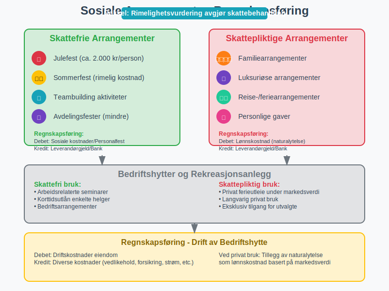

## Seksjon 9: Digitalisering og Fremtidige Trender

### 9.1 Teknologiske Løsninger

**Digitale verktøy** for administrasjon av velferdstiltak:

#### HR-systemer og integrasjon:
* **Selvbetjeningsportaler:** Ansatte administrerer egne fordeler
* **Automatisk regnskapsføring:** Direkte integrasjon med økonomisystemer
* **Compliance-overvåking:** Automatisk sjekk av skattemessige grenser
* **Rapporteringsautomatisering:** A-ordningen og årsrapportering

#### Mobile løsninger:
* **App-baserte valg:** Enkel administrasjon av cafeteria-ordninger
* **Digitale legitimasjoner:** Medlemskap i treningssentre, forsikringskort
* **Real-time tracking:** Oversikt over forbruk av fordeler
* **Push-notifikasjoner:** Påminnelser om frister og muligheter

### 9.2 Kunstig Intelligens og Personalisering

**AI-drevne verktøy** for optimalisering:

#### Personaliserte anbefalinger:
* **Data-drevne forslag:** Basert på ansattes bruksmønstre
* **Prediktiv analyse:** Forutsi hvilke fordeler som verdsettes
* **Optimalisering:** Maksimer verdi innenfor budsjett
* **Segmentering:** Tilpassede pakker for ulike ansattgrupper

#### Automatisert compliance:
* **Skatteoptimalisering:** AI foreslår skatteeffektive sammensetninger
* **Risikovurdering:** Identifiser potensielle compliance-problemer
* **Dokumentasjonsautomatisering:** Generere nødvendig dokumentasjon
* **Regelverksoppdateringer:** Automatisk tilpasning til nye regler

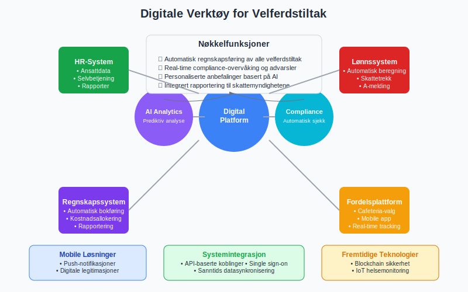

### 9.3 Fremtidige Utviklingstrekk

**Trender** som påvirker velferdstiltak:

#### Demografiske endringer:
* **Flergenerasjons-arbeidsplasser:** Ulike behov og preferanser
* **Økt forventet levetid:** Fokus på langsiktige pensjonsordninger
* **Endrede familiestrukturer:** Tilpassede fordeler for moderne familier
* **Geografisk spredning:** Fordeler for fjernarbeidere

#### Samfunnsmessige trender:
* **Bærekraftsfokus:** Miljøvennlige fordeler og initiativer
* **Mental helse:** Økt fokus på psykisk velvære
* **Work-life balance:** Fleksibilitet som velferdstiltak
* **Individualisering:** Mer personaliserte pakker

## Seksjon 10: Internasjonale Perspektiver

### 10.1 Sammenligning med Andre Land

**Velferdstiltak** i internasjonalt perspektiv:

| **Land** | **Typiske fordeler** | **Skattebehandling** | **Arbeidsgiveransvar** |
|----------|---------------------|---------------------|----------------------|
| **USA** | Helseforsikring, 401k | Kompleks, mange skattefrie | Høyt (helseforsikring) |
| **Tyskland** | Bedriftspensjon, firmabil | Sosialavgifter påløper | Moderat |
| **UK** | Private healthcare, pension | Benefit-in-kind skatt | Lavt |
| **Danmark** | Firmabil, feriehus | Høy beskatning | Moderat |

### 10.2 Utsendte Arbeidstakere

**Spesielle hensyn** for internasjonale ansatte:

#### Utlendinger i Norge:
* **Begrenset skatteplikt:** Særregler for utsendte
* **Boligtillegg:** Ofte nødvendig og skattefritt
* **Hjemreiser:** Arbeidsrelaterte vs. private reiser
* **Forsikringsdekning:** Internasjonal helse- og reiseforsikring

#### Nordmenn i utlandet:
* **Norske pensjonsordninger:** Videreføring under utstasjonering
* **Sosiale kostnader:** Koordinering med lokale ordninger
* **Hjemreiser:** Skattemessig behandling
* **Valutarisiko:** Sikring av fordeler i norske kroner

### 10.3 Grenseoverskridende Utfordringer

**Kompleksitet** i internasjonale velferdstiltak:

#### Juridiske utfordringer:
* **Dobbeltbeskatning:** Avtaler mellom land
* **Sosialtrygdkoordinering:** EU/EØS-regelverk
* **Rapporteringsplikt:** Flere jurisdiksjoner
* **Compliance:** Forskjellige lovkrav

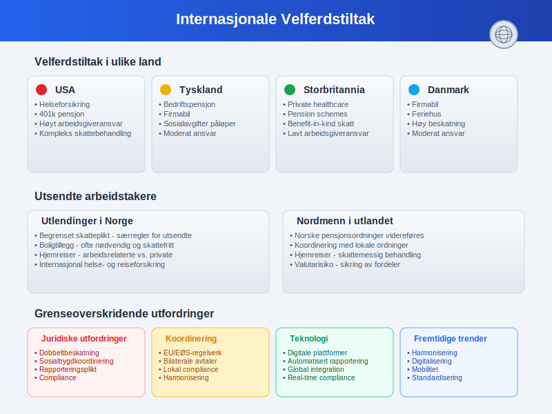

## Seksjon 11: Måling og Evaluering av Velferdstiltak

### 11.1 Nøkkelindikatorer (KPIer)

**Måling av effektivitet** i velferdsprogrammer:

#### Økonomiske indikatorer:
* **Kostnad per ansatt:** Totale velferdskostnader/antall ansatte
* **ROI på velferdstiltak:** Produktivitetsgevinst vs. kostnad
* **Skatteeffektivitet:** Skattebesparelse vs. direktekostnad
* **Benchmark mot bransje:** Sammenligning med konkurrenter

#### HR-relaterte indikatorer:
* **Ansattilfredshet:** Målt gjennom regelmessige undersøkelser
* **Turnover-rate:** Effekt på ansattretensjon
* **Rekrutteringseffektivitet:** Tid til besetting og kvalitet på søkere
* **Sykefravær:** Påvirkning på helse og velvære

#### Bruksstatistikk:
* **Utnyttelsesgrad:** Hvor mange som bruker ulike fordeler
* **Fordelspreferanser:** Populære vs. upopulære ordninger
* **Demografiske mønstre:** Aldersbaserte og generasjonsmessige forskjeller
* **Sesongvariasjoner:** Tidsbaserte bruksmønstre

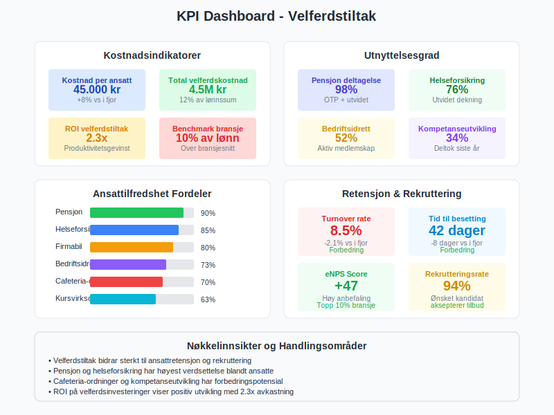

### 11.2 Ansattes Evaluering og Feedback

**Systematisk innhenting** av ansattes tilbakemeldinger:

#### Evalueringsmetoder:
* **Årlige fordelsundersøkelser:** Omfattende gjennomgang av alle ordninger
* **Kontinuerlige pulse-surveys:** Korte, hyppige målinger
* **Focus groups:** Dybdeinnsikt fra representerte grupper
* **Exit-intervjuer:** Avgang som læringsmulighet

#### Viktige spørsmålsområder:
```
Verdsettelse:
- Hvilke fordeler verdsetter du mest?
- Hva savner du i dagens pakke?
- Hvordan påvirker fordelene din arbeidsglede?

Bruk og tilgjengelighet:
- Hvor ofte bruker du de ulike fordelene?
- Er informasjonen om fordeler lett tilgjengelig?
- Opplever du administrative hindringer?

Fremtidige behov:
- Hvordan har dine behov endret seg?
- Hvilke nye fordeler ville du prioritert?
- Hvordan bør vi tilpasse oss fremtidige behov?
```

### 11.3 Benchmarking og Markedsanalyse

**Sammenligning** med arbeidsmarkedet:

#### Benchmarking-kilder:
* **Bransjeundersøkelser:** KS, NHO, fagforbund
* **Konsulentrapporter:** Willis Towers Watson, Mercer
* **Offentlige statistikker:** SSB, NAV
* **Peer-to-peer utveksling:** Direkte samarbeid med andre bedrifter

| **Benchmark-område** | **Sammenligning** | **Handlingsområde** |
|---------------------|------------------|-------------------|
| **Totalkostnad** | Velferdskostnad som % av lønn | Budsjettoptimalisering |
| **Fordelsmiks** | Andel av ulike fordelstyper | Porteføljebalansering |
| **Innovasjon** | Nye og fremvoksende fordeler | Konkurransefortrinn |
| **Administrativ effektivitet** | Kostnader og digitalisering | Prosessforbedring |

## Seksjon 12: Juridiske og Compliance-aspekter

### 12.1 Skattemessige Fallgruver

**Vanlige feil** og deres konsekvenser:

#### Typiske feilkilder:
* **Feilklassifisering:** Skattepliktige fordeler behandlet som skattefrie
* **Verdsettelse:** Feil beregning av fordelsverdi
* **Periodisering:** Feil timing av skattemessig behandling
* **Rapportering:** Manglende eller feil rapportering til myndighetene

#### Konsekvenser:
* **Etterbetaling:** Skatt og renter for arbeidstaker
* **Sanksjoner:** Bøter for arbeidsgiver
* **Revisjonsrisiko:** Økt oppmerksomhet fra skattemyndighetene
* **Omdømmerisiko:** Negative medieoppslag

### 12.2 Arbeidsrettslige Aspekter

**Juridiske forpliktelser** knyttet til velferdstiltak:

#### Likestilling og diskriminering:
* **Likebehandling:** Fordeler må tilbys på lik basis
* **Indirekte diskriminering:** Fordeler som favoriserer visse grupper
* **Tilpasningsplikt:** Særlige behov og funksjonsnedsettelser
* **Dokumentasjon:** Begrunnelse for eventuelle forskjeller

#### Tariffavtaler og forhandlinger:
* **Forhandlingsplikt:** Visse fordeler må forhandles med tillitsvalgte
* **Implementering:** Prosedyrer for innføring av nye ordninger
* **Endringer:** Prosess for modifikasjon av eksisterende fordeler
* **Oppsigelse:** Vilkår for fjerning av fordeler

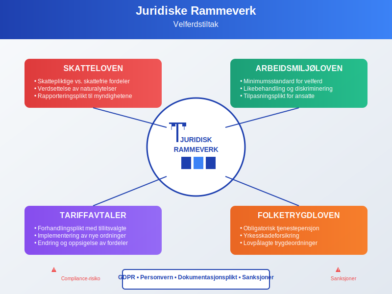

### 12.3 GDPR og Personvern

**Personvernhensyn** i administrasjon av velferdstiltak:

#### Databehandling:
* **Behandlingsgrunnlag:** Samtykke eller berettiget interesse
* **Datatyper:** Helseopplysninger, familieforhold, preferanser
* **Oppbevaringstid:** Sletting etter opphør av arbeidsforhold
* **Tredjepartstilgang:** Forsikringsselskaper, pensjonsinnretninger

#### Sikkerhetstiltak:
* **Tekniske sikkerhetstiltak:** Kryptering, tilgangskontroll
* **Organisatoriske tiltak:** Opplæring, rutiner, kontroller
* **Dataoverføring:** Sikker overføring til samarbeidspartnere
* **Brudd-håndtering:** Prosedyrer ved datainnbrudd

## Seksjon 13: Implementering og Endringsledelse

### 13.1 Planlegging av Nye Velferdstiltak

**Systematisk tilnærming** til innføring av nye fordeler:

#### Analysefase:
1. **Behovsanalyse:** Kartlegg ansattes ønsker og behov
2. **Kostnadsanalyse:** Beregn direkte og indirekte kostnader
3. **Juridisk vurdering:** Sikre compliance og korrekt behandling
4. **Leverandørevaluering:** Velg riktige samarbeidspartnere

#### Implementeringsfase:
1. **Pilottest:** Test med utvalgte grupper
2. **Systemintegrasjon:** Koble til eksisterende HR/økonomi-systemer
3. **Kommunikasjon:** Informere alle ansatte om nye muligheter
4. **Opplæring:** Skoler HR og ansatte i bruk av nye ordninger

#### Oppfølgingsfase:
1. **Monitering:** Følg bruk og tilfredshet
2. **Justering:** Tilpass basert på erfaringer
3. **Evaluering:** Vurder effekt mot målsettinger
4. **Skalering:** Utvid eller modifiser ordningen

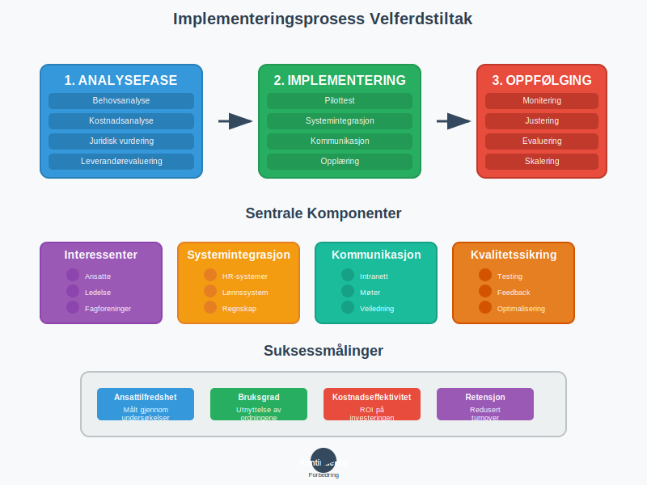

### 13.2 Kommunikasjon og Involvering

**Effektiv kommunikasjon** om velferdstiltak:

#### Kommunikasjonskanaler:
* **Intranett og digitale plattformer:** Sentral informasjonsbank
* **Ansattemøter:** Direkte dialog og spørsmål
* **E-post og nyhetsbrev:** Regelmessige oppdateringer
* **Individuell rådgivning:** Personlig veiledning ved behov

#### Meldings-strategi:
```
Før innføring:
- Bakgrunn og begrunnelse for nye tiltak
- Forventede fordeler for ansatte og organisasjon
- Tidsplan for implementering
- Kontaktinformasjon for spørsmål

Under implementering:
- Praktisk informasjon om bruk
- Teknisk support og hjelpemidler
- Status på utrulling
- Foreløpige erfaringer

Etter implementering:
- Bruksstatistikk og tilbakemeldinger
- Eventuelle justeringer
- Suksesshistorier
- Planer for videreutvikling
```

### 13.3 Endringsledelse og Kulturutvikling

**Kulturell integrasjon** av velferdstiltak:

#### Endringsledelse:
* **Visjon og strategi:** Koble velferdstiltak til organisasjonens verdier
* **Lederforankring:** Sikre støtte fra alle ledernivåer
* **Change agents:** Identifiser ambassadører i organisasjonen
* **Motstanshåndtering:** Adresser skepsis og bekymringer proaktivt

#### Kulturutvikling:
* **Verdiintegrasjon:** La velferdstiltak reflektere bedriftens verdier
* **Atferdsendring:** Oppmuntre til bruk av helsefremmende tiltak
* **Samfunnsansvar:** Koble velferdstiltak til bærekraftsmål
* **Kontinuerlig forbedring:** Etabler kultur for tilbakemelding og utvikling

## Seksjon 14: Fremtidige Utfordringer og Muligheter

### 14.1 Demografiske Endringer

**Påvirkning** av samfunnsmessige trender:

#### Aldrende arbeidsstyrke:
* **Utfordringer:** Økte helsekostnader, behov for fleksibilitet
* **Muligheter:** Erfaring og kompetanse, mentorordninger
* **Tilpasninger:** Seniortiltak, gradvis avtrapping
* **Innovasjon:** Ny teknologi for helse og velvære

#### Flergenerasjonsarbeidsplasser:
* **Generasjon Z (f. 1997-2012):** Digital natives, verdidrevne
* **Millennials (f. 1981-1996):** Work-life balance, fleksibilitet
* **Generasjon X (f. 1965-1980):** Karrierefokus, sikkerhet
* **Baby boomers (f. 1946-1964):** Pensjon, helse

### 14.2 Teknologiske Muligheter

**Nye teknologier** som transformerer velferdstiltak:

#### Kunstig intelligens:
* **Personalisering:** AI-drevne anbefalinger for fordeler
* **Prediksjonsmodeller:** Forutsi ansattes behov og ønsker
* **Automatisering:** Reduser administrativt arbeid
* **Dataanalyse:** Identifiser mønstre og trender

#### Blockchain:
* **Sikkerhet:** Manipulasjonssikre registre
* **Interoperabilitet:** Samhandling mellom systemer
* **Smart contracts:** Automatisere utbetalinger og vilkår
* **Transparens:** Innsyn i fordeler og rettigheter

#### Internet of Things (IoT):
* **Helsemonitoring:** Wearables for fitness og helse
* **Smart workplaces:** Sensorer for miljø og trivsel
* **Automatisering:** Intelligente bygninger og fasiliteter
* **Data-drevet innsikt:** Real-time informasjon om bruk

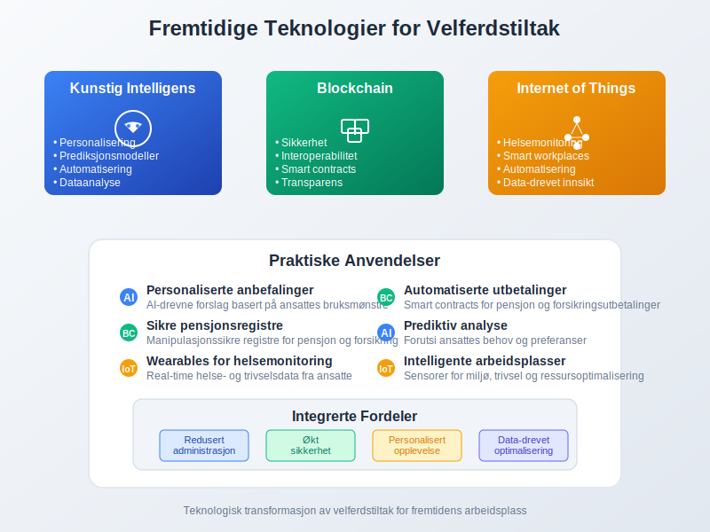

### 14.3 Bærekraft og Samfunnsansvar

**Integrasjon** av bærekraftsprinsipper:

#### Miljømessig bærekraft:
* **Grønne fordeler:** Sykkel-til-jobb, offentlig transport
* **Energieffektivitet:** Miljøvennlige firmabiler
* **Sirkulær økonomi:** Gjenbruk og deling av ressurser
* **Karbonnøytralitet:** Kompensasjon for utslipp

#### Sosial bærekraft:
* **Inkludering:** Tilgjengelige fordeler for alle
* **Likestilling:** Kjønns- og aldersbalanserte tiltak
* **Mental helse:** Fokus på psykisk velvære
* **Samfunnsengasjement:** Frivillig arbeid som velferdstiltak

#### Økonomisk bærekraft:
* **Kostnadseffektivitet:** Optimalisering uten kvalitetsreduksjon
* **Langsiktighet:** Bærekraftige finansieringsmodeller
* **Verdibaserte innkjøp:** Etiske leverandører og partnere
* **Transparens:** Åpen rapportering om velferdsinvesteringer

## Konklusjon

**Velferdstiltak** har utviklet seg fra enkle personalfordeler til strategiske verktøy for talentakquisjon, retensjon og organisasjonsutvikling. I dagens komplekse arbeidsmarked representerer velferdstiltak en kritisk komponent i totalmedarbeideropplevelsen som påvirker alle aspekter av [personaladministrasjon](/blogs/regnskap/hva-er-personaladministrasjon "Hva er Personaladministrasjon? Komplett Guide til HR og Lønnsrutiner") og [økonomistyring](/blogs/regnskap/hva-er-okonomistyring "Hva er Økonomistyring? Planlegging og Kontroll av Bedriftens Økonomi").

**Strategiske implikasjoner:**

* **Konkurransedifferensiering:** Godt utformede velferdspakker gir betydelige rekrutteringsfordeler
* **Kostnadsoptimalisering:** Skatteeffektive ordninger maksimerer verdi for både arbeidsgiver og ansatt
* **Kulturell verdiskaping:** Velferdstiltak signaliserer organisasjonens verdier og prioriteringer
* **Fremtidsposisjonering:** Fleksible og tilpasningsdyktige ordninger sikrer relevans over tid

**Operasjonelle suksessfaktorer:**

For regnskapsførere, HR-ledere og finansdirektører er effektiv håndtering av velferdstiltak avhengig av:
- **Juridisk compliance:** Korrekt skattemessig behandling og arbeidsrettslig overholdelse
- **Systemintegrasjon:** Sømløs kobling mellom HR-, lønn- og regnskapssystemer
- **Datadreven beslutningsstøtte:** Bruk av analytics for kontinuerlig optimalisering
- **Endringsledelse:** Proaktiv tilpasning til nye behov og markedstrender

**Fremtidsrettet perspektiv:**

Velferdstiltak vil fortsette å evolve med teknologiske fremskritt, demografiske endringer og samfunnsmessige forventninger. Organisasjoner som adopterer digitale løsninger, prioriterer bærekraft og fokuserer på personalisering vil skape konkurransefortrinn i kampen om talent.

**Teknologisk transformasjon** gjennom AI, blockchain og IoT vil revolusjonere både administrasjon og leveranse av velferdstiltak, mens **samfunnsmessige trender** som miljøbevissthet, mental helse og work-life balance vil forme innholdet i fremtidens velferdspakker.

**Praktisk anvendelse:**

Den vellykkede implementeringen av velferdstiltak krever balansering av ansattes behov, organisasjonens mål og regulatoriske krav. Gjennom systematisk planlegging, kontinuerlig evaluering og strategisk tilpasning kan velferdstiltak transformeres fra kostnadspost til verdiskaper som bidrar til både [ansattes trivsel](/blogs/regnskap/hva-er-arbeidsglede "Hva er Arbeidsglede? Betydning for Produktivitet og Lønnsomhet") og [organisasjonens lønnsomhet](/blogs/regnskap/hva-er-lonnsomhet "Hva er Lønnsomhet? Beregning og Analyse av Bedriftens Lønnsomhet").

Suksess måles ikke bare i kostnadseffektivitet, men i evnen til å skape en attraktiv, støttende og produktiv arbeidsplass som tiltrekker, utvikler og beholder de beste talentene i en stadig mer konkurrerende global økonomi.


