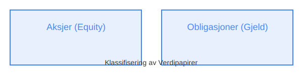

---
title: "Hva er verdipapir?"
seoTitle: "Hva er verdipapir?"
description: 'En **verdipapir** er et omsettelig finansielt instrument som gir innehaveren rettigheter eller krav som kan omsettes på et regulert marked eller utenom børs. ...'
---

En **verdipapir** er et omsettelig finansielt instrument som gir innehaveren rettigheter eller krav som kan omsettes på et regulert marked eller utenom børs. Verdipapirer omfatter aksjer, obligasjoner, sertifikater, fondsenheter og derivater, og er sentrale byggesteiner i norsk kapitalforvaltning.

*Se også: [VPS-konto](/blogs/regnskap/vps-konto "VPS-konto - Oppbevaring av aksjer og verdipapirer i VPS")*

## Klassifisering av Verdipapirer

Verdipapirer kan klassifiseres etter underliggende instrument og risikoprofil:

| **Type verdipapir**   | **Beskrivelse**                                                     | **Eksempel**                                                         |
|-----------------------|---------------------------------------------------------------------|----------------------------------------------------------------------|
| **Aksjer**            | Egenkapitalinstrument som representerer eierandeler i et selskap.   | Se [Hva er en aksje?](/blogs/regnskap/hva-er-en-aksje "Hva er en Aksje? En komplett guide").            |
| **Obligasjoner**      | Gjeldsinstrument med fast eller flytende rente over en bestemt periode. | Se [Hva er obligasjon?](/blogs/regnskap/hva-er-obligasjon "Hva er Obligasjon? En komplett guide").       |
| **Sertifikater**      | Kortsiktige rentebærende verdipapirer, ofte utstedt av banker eller stater. | Se [Hva er sertifikater?](/blogs/kontoplan/1860-andre-sertifikater "Konto 1860 - Andre sertifikater").     |
| **Fondsenheter**      | Andeler i et verdipapirfond som eier en portefølje av verdipapirer. | Se [Hva er fond?](/blogs/regnskap/hva-er-fond "Hva er Fond? En komplett guide").                         |
| **Derivater**         | Finansielle instrumenter basert på underliggende verdipapirer eller andre eiendeler. | Se [Hva er derivater?](/blogs/regnskap/derivater "Derivater - En guide til opsjoner og futures").          |

## Hvorfor Investere i Verdipapirer?

Investering i verdipapirer gir flere fordeler, men innebærer også risiko:

* **Potensiell avkastning:** Verdipapirer kan gi **utbytte**, **renteinntekter** eller **kursgevinster**.
* **Diversifisering:** Spredning av investeringer over ulike verdipapiryper og sektorer reduserer risiko.
* **Likviditet:** Mange verdipapirer omsettes på regulerte markeder med høy **likviditet**.
* **Risikoprofil:** Ulike verdipapirer har forskjellig risikonivå og tidshorisont.

## Regnskapsføring av Verdipapirer

I regnskapet skilles det ofte mellom **omløpsmidler** og **anleggsmidler** basert på holdetid:

* **Omløpsmidler:** Verdipapirer som forventes å selges innen ett år. Se [Hva er omløpsmidler?](/blogs/regnskap/hva-er-omlopsmiddel "Hva er Omløpsmidler? Komplett Guide til Kortsiktige Eiendeler i Regnskap").
* **Anleggsmidler:** Verdipapirer som forventes holdt over lengre tid enn ett år. Se [Hva er anleggsmidler?](/blogs/regnskap/hva-er-anleggsmidler "Hva er Anleggsmidler? En komplett guide til faste eiendeler").

Regnskapsprinsipper for verdipapirer kan variere avhengig av regnskapsstandard (NRS vs. IFRS) og formål med investeringen, inkludert vurderingsprinsipper som **anskaffelseskost**, **virkelig verdi** eller **nedskrevet verdi**. For mer informasjon, se [Hva er virkelig verdi?](/blogs/regnskap/hva-er-virkelig-verdi "Hva er Virkelig Verdi? Verdsettelse og Regnskapsføring").

## Oppsummering

Verdipapirer er grunnpilarer i moderne finans og regnskap. Ved å forstå **definisjon**, **klassifisering** og **regnskapsprinsipper** knyttet til verdipapirer kan både privatpersoner og bedrifter ta bedre investeringsbeslutninger og sikre korrekt bokføring.

