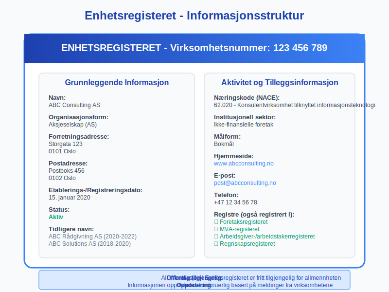

Et **virksomhetsnummer** er en unik ni-sifret identifikator som tildeles alle virksomheter og organisasjoner som skal drives aktivt i Norge. Dette nummeret fungerer som virksomhetens "personnummer" og er grunnlaget for all offentlig registrering, [regnskapsføring](/blogs/regnskap/hva-er-bokforing "Hva er Bokføring? Komplett Guide til Grunnleggende Regnskapsprinsipper"), skatteinnbetaling og kommunikasjon med offentlige myndigheter. Virksomhetsnummeret er obligatorisk for alle [juridiske personer](/blogs/regnskap/hva-er-juridisk-person "Hva er Juridisk Person? Komplett Guide til Selskapsformer og Rettigheter") som skal operere i det norske markedet, og det spiller en kritisk rolle i bedriftens daglige drift og forretningsaktiviteter.

## Seksjon 1: Hva er et Virksomhetsnummer?

**Virksomhetsnummeret** er definert som et unikt identifikasjonsnummer som tildeles av Brønnøysundregistrene til alle virksomheter og organisasjoner som registreres i Norge. Dette nummeret består av **ni siffer** og følger et spesifikt format som sikrer unikhet på tvers av alle registrerte enheter.

### Struktur og Format

Virksomhetsnummeret består av ni siffer organisert i tre grupper:
- **Første gruppe:** 3 siffer (100-999)
- **Andre gruppe:** 3 siffer (000-999) 
- **Tredje gruppe:** 3 siffer (000-999)

Eksempel: **123 456 789**

### Kontrollsiffer-algoritme

Det niende sifferet fungerer som et **kontrollsiffer** som beregnes ved hjelp av en spesiell algoritme. Dette kontrollsifferet sikrer at nummeret er gyldig og reduserer risikoen for feilregistrering ved manuell inntasting.

## Seksjon 2: Registrering og Tildeling

Alle virksomheter som skal drive økonomisk aktivitet i Norge må **registrere seg** i [Enhetsregisteret](/blogs/regnskap/hva-er-enhetsregisteret "Hva er Enhetsregisteret?") hos Brønnøysundregistrene. Dette gjelder både norske og utenlandske virksomheter som etablerer datterselskap eller filial i Norge.

### Hvem MÃ¥ Registrere Seg?

| Virksomhetstype | Registreringsplikt | Beskrivelse |
|---|---|---|
| [Aksjeselskap (AS)](/blogs/regnskap/hva-er-aksjeselskap "Hva er Aksjeselskap? Komplett Guide til AS og Aksjekapital") | **Obligatorisk** | Må registreres før oppstart |
| [Ansvarlig selskap (ANS)](/blogs/regnskap/hva-er-ansvarlig-selskap "Hva er Ansvarlig Selskap? Guide til ANS og Deltakerliabilitet") | **Obligatorisk** | Registrering ved etablering |
| [Kommandittselskap (KS)](/blogs/regnskap/hva-er-kommandittselskap "Hva er Kommandittselskap? Komplett Guide til KS") | **Obligatorisk** | MÃ¥ registreres i Foretaksregisteret |
| [Enkeltpersonforetak](/blogs/regnskap/hva-er-enkeltpersonforetak "Hva er Enkeltpersonforetak? Guide til ENK") | **Frivillig/Obligatorisk** | Avhenger av omsetning og aktivitet |
| [Stiftelser](/blogs/regnskap/hva-er-stiftelse "Hva er Stiftelse? Komplett Guide til Stiftelser og Kapitalforvaltning") | **Obligatorisk** | Registrering ved etablering |
| Foreninger | **Frivillig** | Kun hvis ønsket |

### Registreringsprosessen

1. **Samordnet registermelding:** De fleste virksomheter bruker en samordnet registermelding som samtidig registrerer virksomheten i flere registre
2. **Dokumentasjon:** Vedlegg av nødvendige dokumenter som [vedtekter](/blogs/regnskap/hva-er-vedtekter-for-aksjeselskap "Hva er Vedtekter for Aksjeselskap? Komplett Guide til Selskapsvedtekter"), stiftelsesdokument eller fullmakter
3. **Betaling av gebyr:** Registreringsgebyr som varierer avhengig av virksomhetstype
4. **Behandlingstid:** Normalt 1-3 virkedager for komplette søknader

## Seksjon 3: Virksomhetsnummer i Regnskapssammenheng

Virksomhetsnummeret er fundamentalt for all regnskapsmessig aktivitet og må brukes konsekvent i alle forretningsdokumenter og transaksjoner.

### Obligatorisk Bruk i Regnskapsdokumenter

Virksomhetsnummeret må fremgå tydelig på alle følgende dokumenter:

* **[Fakturaer](/blogs/regnskap/hva-er-en-faktura "Hva er en Faktura? En Guide til Norske Fakturakrav"):** Obligatorisk påkrav iht. bokføringsforskriften
* **[Tilbud](/blogs/regnskap/hva-er-tilbud "Hva er Tilbud? Komplett Guide til Tilbudsprosess og Regnskapsmessig Behandling"):** MÃ¥ inneholde virksomhetsnummer for identifikasjon
* **Kontrakter:** Juridisk identifikasjon av kontraktspartene
* **[Ã…rsregnskap](/blogs/regnskap/hva-er-arsregnskap "Hva er Ã…rsregnskap? Komplett Guide til Regnskapsavleggelse"):** Obligatorisk i alle offentlige regnskaper
* **MVA-oppgaver:** Nødvendig for [merverdiavgift](/blogs/regnskap/hva-er-avgiftsplikt-mva "Hva er Avgiftsplikt (MVA)? Komplett Guide til Merverdiavgift i Norge") håndtering

### MVA-registrering og Virksomhetsnummer

For virksomheter som er **[MVA-registrert](/blogs/regnskap/hva-er-mva-registrering "Hva er MVA-registrering? Komplett Guide til Merverdiavgiftregistrering")**, skal teksten "MVA" stå etter virksomhetsnummeret på alle [fakturaer](/blogs/regnskap/hva-er-en-faktura "Hva er en Faktura? En Guide til Norske Fakturakrav") og andre salgsdokumenter. Dette signaliserer at virksomheten er registrert for merverdiavgift og kan kreve inn MVA fra sine kunder.

**Eksempel:**
- **Med MVA:** 123 456 789 MVA
- **Uten MVA:** 123 456 789

## Seksjon 4: Organisasjonsnummer vs. Virksomhetsnummer

Det er viktig å forstå forskjellen mellom **organisasjonsnummer** og **virksomhetsnummer**, da disse termene ofte brukes om hverandre selv om de teknisk sett kan være forskjellige.

### Definisjon og Sammenheng

| Term | Definisjon | Bruksområde |
|---|---|---|
| **Organisasjonsnummer** | Hovedidentifikator for den juridiske enheten | Juridiske dokumenter, skatt, hovedregistrering |
| **Virksomhetsnummer** | Identifikator for spesifikk virksomhetsaktivitet | Daglig drift, fakturering, MVA-oppgaver |

For de fleste små og mellomstore bedrifter er organisasjonsnummer og virksomhetsnummer **identiske**. Forskjellen oppstår hovedsakelig for store konserner som kan ha:

* **Ett organisasjonsnummer** for morselskapet
* **Flere virksomhetsnummer** for ulike forretningsområder eller lokasjoner

### Praktisk Bruk

I daglig forretningsdrift brukes virksomhetsnummeret for:
- **Kunderegistrering** i [kundekartotek](/blogs/regnskap/hva-er-kundekartotek "Hva er Kundekartotek? Komplett Guide til Kundedatabase og Kunderegistrering")
- **Leverandørregistrering** i innkjøpssystemer
- **Banktransaksjoner** og betalingsreferanser
- **Offentlige innrapporteringer** som skatt og MVA

## Seksjon 5: Virksomhetsnummer i Forskjellige Forretningsprosesser

Virksomhetsnummeret integreres i praktisk talt alle forretningsprosesser og er spesielt kritisk i følgende områder:

### Faktureringsprosesser

Ved utstedelse av [fakturaer](/blogs/regnskap/hva-er-en-faktura "Hva er en Faktura? En Guide til Norske Fakturakrav") må virksomhetsnummeret inkluderes for å oppfylle bokføringsforskriftens krav. Dette gjelder både for tradisjonelle papirfakturaer og moderne [elektronisk fakturering](/blogs/regnskap/hva-er-elektronisk-fakturering "Hva er Elektronisk Fakturering? Komplett Guide til Digitale Fakturaløsninger").

### Leverandørbetalinger

Ved [leverandørbetalinger](/blogs/regnskap/hva-er-leverandorgjeld "Hva er Leverandørgjeld? Komplett Guide til Kortfristig Gjeld og Kreditorstyring") brukes virksomhetsnummeret for å identifisere riktig mottaker og sikre korrekt kontering i regnskapet. Dette er spesielt viktig for automatiserte betalingssystemer.

### Banktransaksjoner

Banker bruker virksomhetsnummeret for å:
- **Identifisere** kontoinnehavere ved bedriftstransaksjoner
- **Validere** [betalingsmottakere](/blogs/regnskap/hva-er-betalingsmidler "Hva er Betalingsmidler? Tvungne, Elektroniske og Tradisjonelle Metoder")
- **Rapportere** til finansmyndighetene i henhold til hvitvaskingsregelverket

## Seksjon 6: Offentlige Registre og Informasjon

Virksomhetsnummeret gir tilgang til omfattende offentlig informasjon om virksomheten gjennom ulike registre administrert av Brønnøysundregistrene.

### Enhetsregisteret

**Enhetsregisteret** inneholder grunnleggende informasjon om alle registrerte virksomheter:

* **Virksomhetsnavn** og eventuelle tidligere navn
* **Organisasjonsform** og [organisasjonsform](/blogs/regnskap/organisasjonsform "Organisasjonsform: Komplett Guide til Selskapsformer i Norge")
* **Registreringsadresse** og postadresse  
* **Etablerings- og eventuelle opphørsdatoer**
* **Næringskoder** (NACE-koder) som beskriver virksomhetens aktivitet

### Foretaksregisteret

For **registreringspliktire virksomheter** inneholder Foretaksregisteret utvidet informasjon:

* **Daglig leder** og styresammensetning
* **[Aksjekapital](/blogs/regnskap/hva-er-aksjekapital "Hva er Aksjekapital? Komplett Guide til Egenkapital og Aksjer")** og eierforhold
* **Fullmaktsforhold** og underskriftsrett
* **Vedtekter** og andre grunnlagsdokumenter

### Regnskapsregisteret

**Regnskapsregisteret** inneholder [Ã¥rsregnskap](/blogs/regnskap/hva-er-arsregnskap "Hva er Ã…rsregnskap? Komplett Guide til Regnskapsavleggelse") og [revisorer](/blogs/regnskap/hva-er-revisor "Hva er Revisor? Guide til Revisorplikt og Regnskapsrevisjon") for regnskapspliktire virksomheter, tilgjengelig for offentlig innsyn.

## Seksjon 7: Digitale Tjenester og Integrasjon

I dagens digitale forretningsverden er virksomhetsnummeret grunnlaget for en rekke automatiserte prosesser og integrasjoner.

### API-integrasjoner

Virksomhetsnummeret brukes som primærnøkkel i:
- **Regnskapsystemer** for [automatisering](/blogs/regnskap/api-integrasjon-automatisering-regnskap "API-integrasjon og Automatisering i Regnskap - Komplett Guide") av fakturabehandling
- **CRM-systemer** for kundehåndtering og oppfølging
- **ERP-systemer** for fullstendig forretningsintegrasjon
- **Offentlige API-er** for validering og oppdatering av virksomhetsinformasjon

### Validering og Verifikasjon

Moderne systemer bruker virksomhetsnummeret for **sanntidsvalidering**:

- **Kontrollsiffer-sjekk** sikrer at nummeret er matematisk korrekt
- **Register-oppslag** bekrefter at virksomheten eksisterer og er aktiv
- **MVA-status** verifiseres for korrekt fakturabehandling
- **Kredittvurdering** basert på offentlig tilgjengelig regnskapsinformasjon

### Automatisert Fakturabehandling

Ved bruk av [fakturatolk-teknologi](/blogs/regnskap/hva-er-fakturatolk "Hva er Fakturatolk? Automatisk Fakturabehandling og OCR-teknologi") gjenkjennes virksomhetsnummeret automatisk og brukes til:
- **Leverandøridentifikasjon** i systemet
- **Automatisk kontering** basert på historiske transaksjoner
- **Duplettsjekk** for å unngå dobbeltregistrering
- **Compliance-sjekk** mot interne retningslinjer

## Seksjon 8: Internasjonalt Perspektiv

Selv om virksomhetsnummeret er spesifikt for Norge, finnes tilsvarende systemer i andre land for identifikasjon av virksomheter.

### Tilsvarende Systemer Internasjonalt

| Land/Region | Identifikator | Beskrivelse |
|---|---|---|
| **Danmark** | CVR-nummer | Central Virksomhedsregister |
| **Sverige** | Organisationsnummer | 10-sifret nummer |
| **Finland** | Y-tunnus | Yritys- ja yhteisötunnus |
| **EU** | VAT-nummer | Merverdiavgiftsnummer |
| **USA** | EIN/FEIN | Federal Tax ID |
| **Storbritannia** | Company Number | Registrert hos Companies House |

### Grenseoverskridende Handel

Ved internasjonal handel brukes virksomhetsnummeret sammen med andre identifikatorer:
- **EORI-nummer** for tollhåndtering i EU
- **DUNS-nummer** for global forretningsidentifikasjon
- **LEI-kode** for finansielle transaksjoner

## Seksjon 9: Endringer og Oppdateringer

Virksomhetsinformasjon kan endres over tid, og det er viktig å holde informasjonen oppdatert i de relevante registrene.

### Hvilke Endringer Krever Melding?

**Obligatoriske meldinger** til Brønnøysundregistrene:

* **Navneendring:** Må meldes innen 1 måned
* **Adresseendring:** Oppdatering av forretnings- eller postadresse
* **Aktivitetsendring:** Nye eller endrede [næringskoder](/blogs/regnskap/hva-er-naringskode "Hva er Næringskode? Komplett Guide til NACE-koder og Klassifisering")
* **Organisasjonsendring:** Endring av selskapsform eller struktur
* **Daglig leder:** Skifte av [daglig leder](/blogs/regnskap/hva-er-daglig-leder "Hva er Daglig Leder? Rolle, Ansvar og Regnskapsmessige Forpliktelser") eller prokurister

### Konsekvenser av Manglende Oppdatering

**Juridiske konsekvenser:**
- Gebyr for forsinket melding
- Ugyldig [forkynning](/blogs/regnskap/hva-er-forkynning "Hva er Forkynning? Juridiske Prosesser og Regnskapsmessige Implikasjoner") ved feil adresse
- Problemer med offentlige myndigheter

**Praktiske konsekvenser:**
- Feilaktig korrespondanse fra kunder og leverandører
- Forsinkelser i betalinger og fakturabehandling
- Utfordringer med bankforbindelser og kredittillatelser

## Seksjon 10: Sikkerhet og Misbruk

Virksomhetsnummeret er offentlig informasjon, men det er viktig å være oppmerksom på potensielt misbruk.

### Beskyttelse mot Misbruk

**Anbefalte sikkerhetstiltak:**
- **Overvåk** bruken av virksomhetsnummeret i offentlige registre
- **Varsle** ved mistanke om uautorisert bruk
- **Implementer** [tofaktorautentisering](/blogs/regnskap/hva-er-tofaktorautentisering "Hva er Tofaktorautentisering? Komplett Guide til 2FA og Sikkerhet") i digitale systemer
- **Regelmessig** kontroller offentlige registre for endringer

### Vanlige Misbruksformer

* **Identitetstyveri:** Bruk av virksomhetsnummer for å opprette falske fakturaer
* **Svindel:** Utgiring for å være en etablert virksomhet
* **Kredittsvindel:** Søke kreditt i andres navn

## Seksjon 11: Fremtidige Utviklinger

Digitalisering og teknologisk utvikling påvirker hvordan virksomhetsnummer brukes og administreres.

### Planlagte Forbedringer

**Teknologiske innovasjoner:**
- **Blockchain-basert** verifikasjon for økt sikkerhet
- **API-første** tilnærming for bedre integrasjon
- **Kunstig intelligens** for automatisk oppdatering av virksomhetsinformasjon
- **Mobile løsninger** for enklere administrasjon

### EU-standardisering

Norge arbeider med **EU-harmonisering** av virksomhetsidentifikatorer for å lette:
- Grenseoverskridende handel
- Digital dokumentutveksling
- Automatisert compliance-sjekking
- Effektiv tollhåndtering

## Seksjon 12: Praktiske Tips og Beste Praksis

For å maksimere nytten av virksomhetsnummeret og unngå vanlige fallgruver, er her noen praktiske anbefalinger:

### Daglig Bruk

**Rutiner for korrekt bruk:**
- **Kontroller** alltid virksomhetsnummer ved nye leverandører
- **Lagre** viktige virksomhetsnummer i [kundekartotek](/blogs/regnskap/hva-er-kundekartotek "Hva er Kundekartotek? Komplett Guide til Kundedatabase og Kunderegistrering")
- **Inkluder** virksomhetsnummer i alle forretningsdokumenter
- **Verifiser** MVA-status ved større transaksjoner

### Systemintegrasjon

**Tekniske anbefalinger:**
- Implementer automatisk validering av virksomhetsnummer
- Integrer med Brønnøysundregistrenes API-er for sanntidsoppdateringer
- Opprett backup-rutiner for kritisk virksomhetsinformasjon
- Etabler overvåkning av endringer i leverandør- og kundedatabaser

---

**Virksomhetsnummeret** er fundamentet for all forretningsaktivitet i Norge og spiller en kritisk rolle i moderne regnskapsføring og virksomhetsdrift. Ved å forstå dets rolle, krav og best practices, kan virksomheter sikre korrekt compliance, effektiv drift og robust risikostyring. Korrekt bruk av virksomhetsnummeret legger grunnlaget for pålitelige forretningsrelasjoner og smidig integrasjon med Norges digitale forretningsinfrastruktur.
