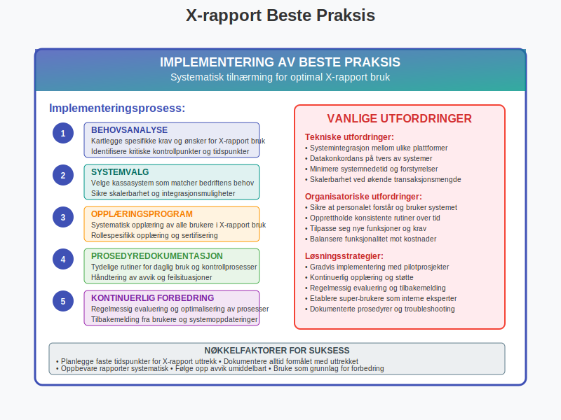

En **X-rapport** er en mellomrapport som genereres fra et [kassasystem (datakasse)](/blogs/regnskap/hva-er-datakasse "Hva er Datakasse? Komplett Guide til Kassasystem, Krav og Regnskapsføring") for å vise salgstransaksjoner og kontantbeholdning på et gitt tidspunkt uten å avslutte kassedagen. Denne rapporten gir bedriften kontinuerlig oversikt over [omsetning](/blogs/regnskap/hva-er-omsetning "Hva er Omsetning? Komplett Guide til Omsetning i Regnskap og Skatt"), betalingsmetoder og kontantstrøm i løpet av en arbeidsdag. X-rapporten er et viktig verktøy for daglig driftskontroll og [internkontroll](/blogs/regnskap/hva-er-internkontroll "Hva er Internkontroll? Komplett Guide til Risikostyring og Compliance") i detaljhandel og servicevirksomheter.

## Seksjon 1: Grunnleggende om X-rapport

X-rapporten er en **ikke-avsluttende rapport** som kan trekkes flere ganger i løpet av en dag uten å påvirke kassasystemets funksjonalitet eller tellere. Dette skiller den fra [Z-rapporten](/blogs/regnskap/hva-er-z-rapport "Hva er Z-rapport? Komplett Guide til Kassesystemets Avslutningsrapport"), som avslutter kassedagen og nullstiller tellerne.

### Hovedfunksjoner ved X-rapport

* **Mellomrapportering:** Viser status på salg og kontanter uten å avslutte kassedagen
* **Kontinuerlig overvåking:** Gir løpende kontroll over kassens tilstand
* **Fleksibel uttrekking:** Kan genereres når som helst i løpet av kassedagen
* **Ikke-destruktiv:** Påvirker ikke kassesystemets tellere eller funksjonalitet

X-rapporten brukes primært for **daglig driftskontroll**, mens detaljerte regnskapsopplysninger som [merverdiavgift](/blogs/regnskap/hva-er-avgiftsplikt-mva "Hva er Avgiftsplikt (MVA)? Komplett Guide til Merverdiavgift i Norge") og [periodisering](/blogs/regnskap/hva-er-periodisering "Hva er Periodisering? Komplett Guide til Periodisering i Regnskap") behandles gjennom andre regnskapsprosesser.

## Seksjon 2: Innhold og Struktur i X-rapport

En X-rapport inneholder normalt følgende hovedelementer organisert i en strukturert oversikt:

### Transaksjonsdata

| Kategori | Innhold | Formål |
|----------|---------|--------|
| **Salgsdata** | Antall transaksjoner, totalsalg, gjennomsnittskjøp | Salgsoversikt |
| **Betalingsmetoder** | Kontant, kort, mobil, gavekort | Betalingsfordeling |
| **MVA-informasjon** | Salg ex. MVA, MVA-beløp per sats | Avgiftsrapportering |
| **Refusjoner** | Antall og beløp for returer/kreditnotaer | Kvalitetskontroll |

### Kassebeholdning

X-rapporten viser også **kontantbeholdning** basert på:

* **Startbeløp:** Kontanter i kassen ved dagens start
* **Kontantsalg:** Alle kontantinnbetalinger i løpet av dagen
* **Uttak:** Eventuell kontantuttak (mellomoppgjør)
* **Beregnet beholdning:** Teoretisk kontantbeholdning basert på transaksjoner

Dette gir grunnlag for [kontanttelling](/blogs/regnskap/hva-er-kontanttelling "Hva er Kontanttelling? Komplett Guide til Kasseoppgjør og Kontantrapportering") og identifisering av eventuelle avvik.

## Seksjon 3: Praktisk Bruk av X-rapport

X-rapporter brukes i flere praktiske situasjoner for å sikre god [kassestyring](/blogs/regnskap/hva-er-kassestyring "Hva er Kassestyring? Komplett Guide til Kasseforvaltning og Internkontroll") og oversikt over daglige operasjoner.

### Daglig Driftskontroll

**Mellomkontroller i løpet av dagen:**

* **Skiftveksling:** Kontroll av kasse ved personalskift
* **Mellomoppgjør:** Sikring av kontanter ved høy omsetning
* **Driftssituasjon:** Overvåking av salgsutvikling i sanntid
* **Problemløsning:** Identifisering av avvik eller systemfeil

### Sikkerhet og Internkontroll

X-rapporten bidrar til bedriftens [sikkerhetssystem](/blogs/regnskap/hva-er-sikkerhetssystem "Hva er Sikkerhetssystem? Komplett Guide til Bedriftssikkerhet og Risikostyring"):

* **Kontantbegrensning:** Overvåking av kontantbeholdning for sikkerhet
* **Avviksdeteksjon:** Tidlig identifisering av uregelmessigheter
* **Personalansvar:** Tydelig ansvarsfordeling ved skiftveksling
* **Revisjonssti:** Dokumentasjon av alle kontrollpunkter

## Seksjon 4: Forskjell mellom X-rapport og Z-rapport

Forståelsen av forskjellen mellom X-rapport og **[Z-rapport](/blogs/regnskap/hva-er-z-rapport "Hva er Z-rapport? Komplett Guide til Kassesystemets Avslutningsrapport")** er kritisk for korrekt kassehåndtering og regnskapsbehandling.

### Hovedforskjeller

| Aspekt | X-rapport | Z-rapport |
|--------|-----------|-----------|
| **Funksjon** | Mellomrapport | Avslutningsrapport |
| **Tidspunkt** | Når som helst | Kun ved dagsslutt |
| **Tellere** | Påvirkes ikke | Nullstilles |
| **Hyppighet** | Flere ganger daglig | Én gang per dag |
| **Regnskapseffekt** | Ingen direkte effekt | Grunnlag for bokføring |

### Regnskapsmessig Behandling

**X-rapport:**
* Brukes kun til **intern kontroll** og overvåking
* Har **ingen direkte regnskapseffekt**
* Dokumenterer mellomstatus, ikke endelige transaksjoner

**Z-rapport:**
* Danner grunnlag for **daglig bokføring**
* Registreres som [bilag](/blogs/regnskap/hva-er-bilag "Hva er Bilag? Komplett Guide til Regnskapsbilag og Dokumentasjon") i regnskapet
* Påkrevd for [merverdiavgiftsrapportering](/blogs/regnskap/mva-rapportering "MVA-rapportering: Komplett Guide til Merverdiavgiftsrapportering i Norge")

## Seksjon 5: Lovkrav og Compliance

I Norge er bruken av kassasystemer og tilhørende rapporter regulert av [**bokføringsloven**](/blogs/regnskap/hva-er-bokforingsloven "Hva er Bokføringsloven? Komplett Guide til Norsk Bokføringslovgivning") og **bokføringsforskriften**. X-rapporter må oppfylle visse krav selv om de ikke er direkte regnskapsbilag.

### Bokføringslovens Krav

**Generelle krav til kassasystemer:**

* **Sporbarhet:** Alle transaksjoner må kunne spores
* **Ikke-manipulerbarhet:** Systemet må hindre uautoriserte endringer
* **Oppbevaring:** Rapporter må oppbevares i henhold til [oppbevaringsplikten](/blogs/regnskap/hva-er-oppbevaringsplikt "Hva er Oppbevaringsplikt? Komplett Guide til Regnskapsoppbevaring")
* **Tilgjengelighet:** Rapporter må være tilgjengelige for kontroll

### Spesifikke Krav til X-rapport

Selv om X-rapporten ikke er et formelt regnskapsbilag, må den:

* **Være nøyaktig:** Reflektere faktiske transaksjoner korrekt
* **Være dokumentert:** Oppbevares som del av kassedokumentasjonen
* **Være konsistent:** Følge samme format og struktur
* **Være tilgjengelig:** For interne og eksterne kontroller

## Seksjon 6: Digitale Kassasystemer og Moderne X-rapporter

Moderne [digitale kassasystemer](/blogs/regnskap/hva-er-digitalt-kassasystem "Hva er Digitalt Kassasystem? Komplett Guide til Moderne Kasseteknologi") har utviklet X-rapportfunksjonaliteten betydelig utover tradisjonelle kassaapper.

### Avanserte Funksjoner

**Sanntidsdata:**
* **Live Dashboard:** Kontinuerlig oppdatering av salgsdata
* **Grafisk Fremstilling:** Visuelle trender og mønstre
* **Sammenligning:** Mot tidligere dager/perioder
* **Prognoser:** Forventet totalsalg basert på current trend

**Integration med andre systemer:**
* **[ERP-systemer](/blogs/regnskap/hva-er-erp-system "Hva er ERP-system? Komplett Guide til Enterprise Resource Planning"):** Automatisk dataoverføring
* **[Regnskapssystemer](/blogs/regnskap/hva-er-regnskapssystem "Hva er Regnskapssystem? Komplett Guide til Digital Bokføring"):** Direkte integrasjon
* **[Lagersystemer](/blogs/regnskap/hva-er-lagersystem "Hva er Lagersystem? Komplett Guide til Lagerforvaltning og Varestyring"):** Sanntids lagerstatus
* **Analyseverktøy:** Avanserte rapporter og innsikt

## Seksjon 7: Automatisering og Teknologiske Trender

Den teknologiske utviklingen har revolusjonert hvordan X-rapporter genereres, distribueres og brukes i moderne forretningsdrift.

### Automatiske Genereringsprosesser

**Tidsbasert automatisering:**
* **Planlagte uttrekk:** Automatisk generering på bestemte tidspunkter
* **Hendelsesbasert:** Triggere basert på salgsvolum eller andre kriterier
* **Personaliserte rapporter:** Tilpasset forskjellige roller og behov
* **Distribusjonsautomatisering:** Automatisk utsendelse til relevante personer

### Kunstig Intelligens og Maskinlæring

Moderne kassasystemer integrerer **AI-teknologi** for å forbedre X-rapportenes verdi:

* **Anomalideteksjon:** Automatisk identifisering av uvanlige mønstre
* **Prediktiv analyse:** Prognoser basert på historiske data
* **Personalisering:** Tilpassede innsikter basert på brukerrollen
* **Optimalisering:** Forslag til forbedringer basert på dataanalyse

## Seksjon 8: Bransjespecifikke Tilpasninger

Forskjellige bransjer har spesifikke behov som påvirker hvordan X-rapporter utformes og brukes.

### Detaljhandel

**Spesielle behov i detaljhandel:**
* **[Varelager](/blogs/regnskap/hva-er-varelager "Hva er Varelager? Komplett Guide til Lagerføring og Verdivurdering") tracking:** Sanntids oversikt over lagerstatus
* **Rabatter og kampanjer:** Detaljert oppfølging av markedsaktiviteter
* **Kundegrupper:** Segmentert salgsanalyse
* **Sesongvariasjoner:** Sammenligning med historiske mønstre

### Servicevirksomheter

**Tilpassinger for tjenestesektoren:**
* **[Timefakturering](/blogs/regnskap/hva-er-timeforing "Hva er Timeføring? Komplett Guide til Timeregistrering og Fakturering"):** Integrering med timeføringssystemer
* **Abonnementstjenester:** Håndtering av løpende servicekontrakter
* **Kompetanserapportering:** Kobling til medarbeiderkompetanse
* **Prosjektoppfølging:** Integrering med prosjektadministrasjon

### Hospitality og Restaurant

**Spesialtilpassinger for serveringsbransjen:**
* **Bordadministrasjon:** Oversikt over bordstatus og servering
* **Menyanalyse:** Detaljert oppfølging av populære retter
* **Personalkostnader:** Integrering med [lønnskostnader](/blogs/regnskap/lonnskostnad "Lønnskostnad: Komplett Guide til Lønnskostnader i Regnskap") per time
* **Sesongmønstre:** Analyse av trafikkmønstre og kapasitetsutnyttelse

## Seksjon 9: Kvalitets og sikkerhetskontroll

X-rapporter spiller en sentral rolle i bedriftens kvalitets- og sikkerhetssystemer, og krever systematisk oppfølging for å sikre nøyaktighet og pålitelighet.

### Valideringsprosesser

**Daglig validering:**
* **Kontantelling:** Sammenligning med rapportert beholdning
* **Transaksjonskontroll:** Verifikasjon av kundekvitteringer
* **Systemkonsistens:** Kontroll av systemintegritet
* **Historisk sammenligning:** Analyse mot normale mønstre

### Sikkerhetstiltak

**Beskyttelse av rapportdata:**
* **Tilgangskontroll:** Begrenset tilgang basert på roller og ansvar
* **Audit trail:** Komplett sporbarhet av alle handlinger
* **Backup og gjenoppretting:** Sikker oppbevaring av rapportdata
* **Kryptering:** Beskyttelse av sensitive opplysninger

### Compliance og Revision

X-rapporter må kunne dokumentere:

* **Transaksjonsnøyaktighet:** Korrekt registrering av alle salg
* **Systemintegritet:** Bevis for at systemet ikke er manipulert
* **Prosessetterlevelse:** Følge av etablerte rutiner og prosedyrer
* **Dokumentasjonskomplethet:** Fullstendig sporbarhet av alle handlinger

## Seksjon 10: Utfordringer og Beste Praksis

Implementering og bruk av X-rapport systemer kan by på utfordringer som krever systematisk tilnærming og beste praksis.

### Vanlige Utfordringer

**Tekniske utfordringer:**
* **Systemintegrasjon:** Kobling mellom forskjellige systemer
* **Datakonkordans:** Sikre samsvar mellom forskjellige rapporter
* **Oppetid:** Minimere systemnedetid og driftsforstyrrelser
* **Skalerbarhet:** Håndtere økende transaksjonsmengder

**Organisatoriske utfordringer:**
* **Opplæring:** Sikre at personalet forstår og bruker systemet korrekt
* **Prosessdisiplin:** Opprettholde konsistente rutiner
* **Endringshåndtering:** Tilpasse seg nye funksjoner og krav
* **Kostnadskontroll:** Balansere funksjonalitet mot kostnader

### Implementering av Beste Praksis

**Systematisk tilnærming:**

1. **Behovsanalyse:** Kartlegge spesifikke krav og ønsker
2. **Systemvalg:** Velge løsning som matcher bedriftens behov
3. **Opplæringsprogram:** Systematisk opplæring av alle brukere
4. **Prosedyredokumentasjon:** Tydelige rutiner for daglig bruk
5. **Kontinuerlig forbedring:** Regelmessig evaluering og optimalisering

## Seksjon 11: Fremtidens X-rapport Teknologi

Teknologisk utvikling skaper nye muligheter for hvordan X-rapporter kan utvikles og brukes i fremtiden.

### Emerging Technologies

**Blockchain og Distributed Ledger:**
* **Uforanderlighet:** Garantert integritet av rapportdata
* **Transparent sporbarhet:** Komplett transaksjonsoversikt
* **Desentralisert lagring:** Økt pålitelighet og tilgjengelighet
* **Smart contracts:** Automatisering av rapportgenerering og distribusjon

**Internet of Things (IoT) Integrasjon:**
* **Sensordata:** Integrering av data fra fysiske sensorer
* **Miljøovervåking:** Kobling til temperatur, luftfuktighet, bevegelse
* **Energiforbruk:** Optimalisering basert på driftsdata
* **Prediktivt vedlikehold:** Forebyggende tiltak basert på systemhelse

### Avansert Dataanalyse

**Machine Learning og AI:**
* **Mønstergjenkjenning:** Automatisk identifisering av trender
* **Anomalideteksjon:** Prediktiv identifisering av problemer
* **Optimalisering:** AI-drevne forbedringsforslag
* **Naturlig språkbehandling:** Rapporter i vanlig språk

**Sanntids Business Intelligence:**
* **Live dashboards:** Kontinuerlig oppdatering av nøkkeltall
* **Interaktive visualiseringer:** Dyp-dykking i data
* **Mobile applikasjoner:** Tilgang til rapporter på alle enheter
* **Collaboration tools:** Deling og diskusjon av innsikter

## Konklusjon

X-rapporten er et **fundamentalt verktøy** for daglig driftskontroll i detaljhandel og servicevirksomheter. Som mellomrapport fra kassasystemet gir den kontinuerlig oversikt over salg, betalingsmetoder og kontantbeholdning uten å avslutte kassedagen. Dette skiller den fra den daglige Z-rapporten som har direkte regnskapseffekt.

Moderne digitale kassasystemer har utviklet X-rapport funksjonaliteten betydelig, med integrasjon til [ERP-systemer](/blogs/regnskap/hva-er-erp-system "Hva er ERP-system? Komplett Guide til Enterprise Resource Planning"), sanntidsanalyse og automatiserte kontrollprosesser. For bedrifter som ønsker optimal kontroll over sine daglige operasjoner er forståelse og korrekt bruk av X-rapporter essensielt.

Den teknologiske utviklingen med AI, blockchain og IoT vil fortsette å forbedre X-rapportenes verdi og anvendelsesområde, samtidig som grunnleggende prinsipper om nøyaktighet, sporbarhet og compliance forblir kritiske for success.

