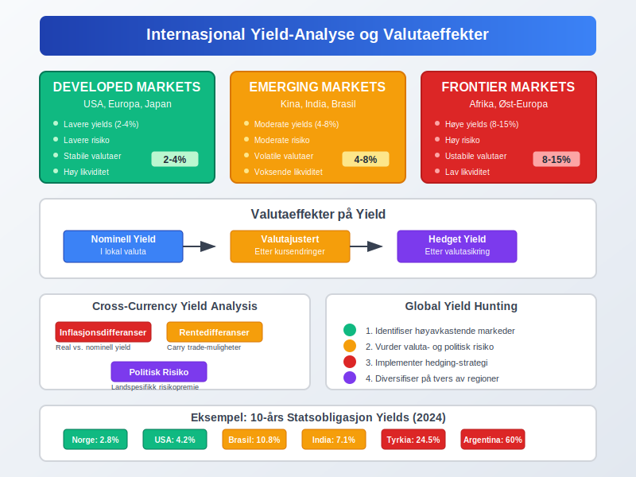

**Yield** er et finansielt nøkkeltall som måler den **årlige avkastningen** på en investering uttrykt som en prosentandel av investeringens markedsverdi. Dette konseptet er sentralt innen regnskapsføring, finansanalyse og investeringsevaluering, og brukes til å sammenligne [avkastning](/blogs/regnskap/hva-er-avkastning "Hva er Avkastning? Komplett Guide til Investeringsavkastning og Beregning") på ulike investeringsalternativer.

## Hva er Yield?

Yield representerer den **årlige inntekten** fra en investering som en prosentandel av dens nåværende markedspris eller bokførte verdi. Dette gjør det mulig å sammenligne lønnsomheten til ulike investeringer på en standardisert måte, uavhengig av investeringens størrelse eller opprinnelige kostnad.

### Grunnleggende Yield-Formel

Den grunnleggende formelen for yield er:

**Yield (%) = (Årlig inntekt / Markedsverdi) × 100**

## Typer Yield i Regnskap og Investering

### 1. Dividend Yield (Utbytteavkastning)

**Dividend yield** måler årlig utbytte som en prosentandel av aksjekursen:

**Dividend Yield = (Årlig utbytte per aksje / Aksjekurs) × 100**

Dette er særlig relevant for [aksjeselskap](/blogs/regnskap/hva-er-et-aksjeselskap "Hva er et Aksjeselskap? Komplett Guide til Selskapsformen") som regelmessig utbetaler utbytte til sine aksjonærer.

### 2. Bond Yield (Obligasjonsavkastning)

**Bond yield** omfatter flere varianter:

* **Current Yield:** Årlig kupongrente / Obligasjonspris
* **Yield to Maturity (YTM):** Total avkastning ved å holde obligasjonen til forfall
* **Yield to Call (YTC):** Avkastning dersom obligasjonen innløses tidlig

### 3. Earnings Yield (Inntjeningsavkastning)

**Earnings yield** er omvendt av P/E-forholdet og beregnes som:

**Earnings Yield = (Resultat per aksje / Aksjekurs) × 100**

Dette målet brukes ofte i [inntjeningsbasert verdivurdering](/blogs/regnskap/hva-er-inntjeningsbasert-verdivurdering "Inntjeningsbasert Verdivurdering - DCF, P/E og Verdsettelsesmetoder").

### 4. Book Yield (Bokført Avkastning)

**Book yield** beregnes basert på bokført verdi i stedet for markedsverdi:

**Book Yield = (Årlig inntekt / Bokført verdi) × 100**

## Yield-Beregning for Ulike Investeringstyper

### Aksjeinvesteringer

For [aksjer](/blogs/regnskap/hva-er-en-aksje "Hva er en Aksje? En Enkel Forklaring") kan yield beregnes på flere måter:

| Yield-Type | Formel | Anvendelse |
|---|---|---|
| **Dividend Yield** | Utbytte / Aksjekurs | Inntektsfokuserte investorer |
| **Earnings Yield** | EPS / Aksjekurs | Verdivurdering og sammenligning |
| **Free Cash Flow Yield** | FCF per aksje / Aksjekurs | Kontantstrømanalyse |

### Obligasjonsinvesteringer

Obligasjoner har komplekse yield-beregninger som tar hensyn til:

* **Kupongrente:** Fast eller variabel rentebetaling
* **Markedspris:** Kan variere fra pålydende verdi
* **Forfallstid:** Tid til obligasjonen forfaller
* **Kredittkvalitet:** Risiko for mislighold

### Eiendomsinvesteringer

For eiendom brukes ofte **kapitalisering rate** (cap rate):

**Cap Rate = (Netto driftsinntekt / Eiendomsverdi) × 100**

## Praktiske Eksempler på Yield-Beregning

### Eksempel 1: Dividend Yield

Et [aksjeselskap](/blogs/regnskap/hva-er-et-aksjeselskap "Hva er et Aksjeselskap? Komplett Guide til Selskapsformen") med:
* Aksjekurs: 100 kr
* Årlig utbytte: 4 kr per aksje

**Dividend Yield = (4 / 100) × 100 = 4%**

### Eksempel 2: Bond Yield

En obligasjon med:
* Pålydende: 1000 kr
* Kupongrente: 5% (50 kr årlig)
* Markedspris: 950 kr

**Current Yield = (50 / 950) × 100 = 5,26%**

### Eksempel 3: Earnings Yield

Et selskap med:
* Aksjekurs: 200 kr
* Resultat per aksje: 15 kr

**Earnings Yield = (15 / 200) × 100 = 7,5%**

Dette tilsvarer en P/E-ratio på 13,33 (200/15).

## Yield og Regnskapsføring

### Regnskapsbehandling av Yield

I regnskapsføring er yield-konseptet viktig for:

* **Verdivurdering av investeringer:** Brukes i [verdivurdering](/blogs/regnskap/hva-er-verdivurdering "Hva er Verdivurdering? Komplett Guide til Ulike Verdsettelsesmetoder") av finansielle instrumenter
* **Nedskrivningstesting:** Yield brukes som [diskonteringsrente](/blogs/regnskap/hva-er-diskontering "Hva er Diskontering? Komplett Guide til Nåverdi og Diskonterte Kontantstrømmer")
* **Leasing-beregninger:** Implisitt rente i leieavtaler
* **Pensjonsmidler:** Forventet avkastning på pensjonsmidler

### IFRS og Yield

Under **International Financial Reporting Standards (IFRS)** er yield relevant for:

* **IFRS 9:** Finansielle instrumenter og forventet kredittap
* **IFRS 16:** Leieavtaler og diskonteringsrenter
* **IAS 19:** Personalytelser og aktuarielle beregninger
* **IAS 36:** Nedskrivning av eiendeler

### Norske Regnskapsstandarder

I Norge følger mange selskaper **God Regnskapsskikk** hvor yield brukes i:

* [Avskrivning](/blogs/regnskap/hva-er-avskrivning "Hva er Avskrivning? Komplett Guide til Avskrivningsmetoder") av [varige driftsmidler](/blogs/regnskap/hva-er-varige-driftsmidler "Hva er Varige Driftsmidler? Komplett Guide til Aktivering og Avskrivning")
* Verdivurdering av [investeringer](/blogs/regnskap/hva-er-investere "Hva er å Investere? Komplett Guide til Investeringer i Regnskap")
* Beregning av [nåverdi](/blogs/regnskap/hva-er-diskontering "Hva er Diskontering? Komplett Guide til Nåverdi og Diskonterte Kontantstrømmer")

## Yield-Kurver og Rentestruktur

### Hva er en Yield-Kurve?

En **yield-kurve** viser forholdet mellom renter (yield) og forfallstider for obligasjoner med lik kredittkvalitet. Kurven brukes til å:

* **Forutsi økonomiske trender:** Normal, flat eller invertert kurve
* **Prissette obligasjoner:** Benchmark for nye utstedelser
* **Risikohåndtering:** Porteføljediversifisering

### Typer Yield-Kurver

| Kurve-Type | Beskrivelse | Økonomisk Signal |
|---|---|---|
| **Normal** | Lange renter høyere enn korte | Sunn økonomisk vekst |
| **Flat** | Like renter på alle forfallstider | Økonomisk usikkerhet |
| **Invertert** | Korte renter høyere enn lange | Potensielt resesjon |

### Yield Spread

**Yield spread** er forskjellen mellom yields på ulike obligasjoner og brukes til å måle:

* **Kredittrisiko:** Forskjell mellom selskaps- og statsobligasjoner
* **Likviditetsrisiko:** Forskjell mellom likvide og mindre likvide obligasjoner
* **Løpetidsrisiko:** Forskjell mellom korte og lange obligasjoner

## Faktorer som Påvirker Yield

### Makroøkonomiske Faktorer

* **Sentralbankens styringsrente:** Påvirker hele rentekurven
* **Inflasjon:** Reell vs. nominell yield
* **Økonomisk vekst:** Påvirker kredittrisiko og etterspørsel
* **Valutapolitikk:** Internasjonale kapitalstrømmer

### Selskapsspesifikke Faktorer

For [aksjeselskap](/blogs/regnskap/hva-er-et-aksjeselskap "Hva er et Aksjeselskap? Komplett Guide til Selskapsformen") påvirkes yield av:

* **[Lønnsomhet](/blogs/regnskap/hva-er-profitt "Hva er Profitt? Komplett Guide til Profitt og Lønnsomhet"):** Høyere [profitt](/blogs/regnskap/hva-er-profitt "Hva er Profitt? Komplett Guide til Profitt og Lønnsomhet") gir høyere earnings yield
* **Utbyttepolitikk:** Påvirker dividend yield direkte
* **Vekstforventninger:** Høy vekst kan gi lavere current yield
* **Finansiell risiko:** Høy [gjeldsgrad](/blogs/regnskap/hva-er-gjeld "Hva er Gjeld? Kort- og Langsiktig Gjeld i Regnskap") påvirker kredittrisiko

### Markedsfaktorer

* **Tilbud og etterspørsel:** Påvirker priser og dermed yield
* **Likviditet:** Likvide markeder gir lavere yields
* **Volatilitet:** Høy volatilitet krever høyere yield
* **Investorsentiment:** Risikoapeptitt påvirker yield-premie

## Yield og Skattemessige Konsekvenser

### Skatt på Yield i Norge

Ulike typer yield beskattes forskjellig:

| Yield-Type | Skattesats | Kommentarer |
|---|---|---|
| **Utbytte** | 22% + skjerming | [Fritaksmetoden](/blogs/regnskap/hva-er-fritaksmetoden "Hva er Fritaksmetoden? Komplett Guide til Skattefritak for Utbytte") for selskaper |
| **Renter** | 22% | Alminnelig inntekt |
| **Kapitalgevinst** | 22% | Ved realisering |

### Skjermingsfradrag

For private investorer gir [skjermingsfradrag](/blogs/regnskap/hva-er-skjermingsfradrag "Hva er Skjermingsfradrag? Komplett Guide til Beregning og Anvendelse") skattefordeler:

**Skjermingsfradrag = Aksjekapital × Skjermingsrente**

Dette reduserer skattepliktig utbytte og påvirker effektiv yield.

### Skatteoptimalisering

Strategier for å optimalisere yield etter skatt:

* **Timing av realisering:** Utsett skattepliktige gevinster
* **Skatteeffektive investeringer:** ISK-konto eller pensjonssparing
* **Tap-/gevinst-modregning:** Realiser tap mot gevinster

## Yield-Analyse og Verdsettelse

### Relative Yield-Analyse

Sammenligning av yields brukes til å identifisere:

* **Undervurderte aksjer:** Høy earnings yield vs. markedet
* **Attraktive obligasjoner:** Høy yield justert for risiko
* **Sektorrotasjon:** Identifiser attraktive bransjer

### Yield-basert Verdsettelse

**Dividend Discount Model (DDM)** bruker dividend yield til verdsettelse:

**Aksjeverdi = Forventet utbytte / (Avkastningskrav - Vekstrate)**

For [investeringsselskap](/blogs/regnskap/hva-er-investeringsselskap "Hva er et Investeringsselskap? Komplett Guide til Investeringsselskaper i Norge") er yield-analyse spesielt viktig for porteføljesammensetning.

### Yield Gap-Analyse

**Yield gap** sammenligner earnings yield med obligasjonsrenter:

**Yield Gap = Earnings Yield - 10-års statsrente**

Positiv gap indikerer potensielt undervurderte aksjer.

### [Q-ratio](/blogs/regnskap/hva-er-q-ratio "Hva er Q-ratio (Tobin's Q)? Komplett Guide til Verdivurdering og Markedsanalyse") og Yield

Q-ratio kan kombineres med yield-analyse for å vurdere:

* **Markedsverdi vs. gjenopprettingskost** i forhold til yield
* **Investeringsmuligheter** basert på yield-attraktivitet
* **Markedstiming** ved å sammenligne historiske yield-nivåer

## Yield og Porteføljeforvaltning

### Asset Allocation basert på Yield

Strategisk aktivaallokering bruker yield til å:

* **Balansere risiko og avkastning:** Høyere yield for høyere risiko
* **Rebalansering:** Justere basert på relative yields
* **Taktisk allokering:** Kortsiktige yield-muligheter

### Yield-baserte Investeringsstrategier

#### Dividend Growth Investing
Fokus på selskaper med:
* **Konsistent utbyttevekst:** Årlig økning i dividend yield
* **Bærekraftig utbytterate:** Utbytte dekket av [kontantstrøm](/blogs/regnskap/hva-er-kontantstrommer "Hva er Kontantstrømmer? En Guide til Beregning og Analyse")
* **Stabile forretningsmodeller:** Forutsigbare inntekter

#### High Yield Strategies
Investering i:
* **Høyavkastende obligasjoner:** Høyere risiko for høyere yield
* **REITs:** Eiendomsinvesteringstrust med høy dividend yield
* **Master Limited Partnerships (MLPs):** Energi- og infrastrukturselskaper

#### Quality Yield Approach
Kombinerer yield med kvalitetskriterier:
* **Finansiell styrke:** Lav [gjeldsgrad](/blogs/regnskap/hva-er-gjeld "Hva er Gjeld? Kort- og Langsiktig Gjeld i Regnskap") og høy [likviditet](/blogs/regnskap/hva-er-likviditet "Hva er Likviditet? Komplett Guide til Bedriftens Betalingsevne")
* **Konsistent lønnsomhet:** Stabile [fortjenestemarginer](/blogs/regnskap/hva-er-bruttofortjeneste "Hva er Bruttofortjeneste? Beregning, Analyse og Betydning for Bedriften")
* **Konkurransefortrinn:** Varige konkurransefordeler

## Yield og Risikohåndtering

### Yield-Risk Trade-off

Høyere yield kommer generelt med høyere risiko:

* **Kredittrisiko:** Høyere yield på selskapsobligasjoner
* **Likviditetsrisiko:** Illlikvide investeringer krever yield-premie
* **Volatilitetsrisiko:** Høyvolatile aksjer har høyere earnings yield

### Duration Risk

For obligasjoner måler **duration** prissfølsomhet for renteendringer:

**Modifisert Duration = Duration / (1 + Yield)**

Høyere duration gir større prisvolatilitet for gitte renteendringer.

### Credit Spread Risk

Endringer i kredittspread påvirker obligasjonsyields:

* **Kredittforverring:** Økte spreads reduserer obligasjonspriser
* **Kredittforbedring:** Reduserte spreads øker obligasjonspriser
* **Flightto-quality:** Kapitalflukt til sikre havner

### Yield-based Risk Metrics

| Risikometrikk | Formål | Anvendelse |
|---|---|---|
| **Value at Risk (VaR)** | Maksimalt tap | Porteføljerisiko |
| **Conditional VaR** | Forventet tap utover VaR | Ekstremrisiko |
| **Maximum Drawdown** | Største tap fra topp | Historisk risiko |

## Sektorspesifikk Yield-Analyse

### Finanssektoren

For [banker](/blogs/regnskap/hva-er-bank "Hva er en Bank? Forretningsmodell og Regnskapsføring") og finansinstitusjoner:

* **Net Interest Margin (NIM):** Netto rentemargin som yield-indikator
* **Return on Assets (ROA):** Avkastning på totale eiendeler
* **Return on Equity (ROE):** Avkastning på [egenkapital](/blogs/regnskap/hva-er-egenkapital "Hva er Egenkapital? Komplett Guide til Bedriftens Egenkapital")

### REITs og Eiendom

Eiendomsinvesteringstrust fokuserer på:

* **Funds From Operations (FFO) Yield:** Driftsbasert yield
* **Net Asset Value (NAV) Yield:** Yield basert på eiendelsverdi
* **Distribution Yield:** Faktisk utbetalt yield til investorer

### Energisektoren

Energiselskaper har spesielle yield-karakteristikker:

* **Dividend Coverage Ratio:** Utbytte dekket av kontantstrøm
* **Free Cash Flow Yield:** Kontantstrøm disponibel for utbytter
* **Reserve-baserte målinger:** Yield relatert til energireserver

### Teknologisektoren

Teknologiselskaper har ofte:

* **Lav dividend yield:** Fokus på reinvestering for vekst
* **Høy earnings yield:** Høy lønnsomhet relativt til markedsverdi
* **Vekstjustert yield:** Yield i forhold til vekstrate (PEG-ratio)

## Internasjonal Yield-Sammenligning

### Valutarisiko og Yield

Ved internasjonale investeringer må man vurdere:

* **Nominell yield:** I lokal valuta
* **Valutajustert yield:** Etter valutakursendringer
* **Hedget yield:** Etter valutasikring

### Cross-Currency Yield Analysis

Sammenligning på tvers av valutaer krever justering for:

* **Inflasjonsdifferanser:** Real yield vs. nominell yield
* **Rentedifferanser:** Carry trade-muligheter
* **Politisk risiko:** Landspesifikk risikopremie

### Global Yield-Jakt

**Yield hunting** i globale markeder:

* **Emerging Markets:** Høyere yields, høyere risiko
* **Developed Markets:** Lavere yields, lavere risiko
* **Frontier Markets:** Høyest yields, høyest risiko

## Digitale Verktøy for Yield-Analyse

### Regneark og Modeller

**Excel-baserte verktøy** for yield-beregning:

* **Dividend yield-kalkulator:** Automatiserte beregninger
* **Bond yield-modeller:** YTM og duration-beregninger
* **Portefølje yield-analyse:** Vektet gjennomsnittlig yield

### Finansielle Databaser

**Bloomberg, Reuters, FactSet** tilbyr:

* **Real-time yield data:** Oppdaterte kurser og yields
* **Historiske yield-kurver:** Trendanalyse over tid
* **Sammenligningsverktøy:** Peer-analyse og benchmarking

### Algorithmic Yield Strategies

**Kvantitative strategier** basert på yield:

* **Mean reversion:** Yield tilbakevending til historisk gjennomsnitt
* **Momentum strategies:** Følg yield-trender
* **Arbitrage:** Utnytt yield-forskjeller mellom relaterte instrumenter

### AI og Machine Learning

**Kunstig intelligens** i yield-analyse:

* **Prediksjon av yield-endringer:** Maskinlæringsmodeller
* **Pattern recognition:** Identifiser yield-mønstre
* **Risk modeling:** Avanserte risikomodeller

## Fremtidige Trender for Yield

### Klimarisiko og ESG

**Miljømessige, sosiale og styringsmessige (ESG)** faktorer påvirker yields:

* **Green bonds:** Lavere yields for miljøvennlige obligasjoner
* **Brown discount:** Høyere yields for miljøskadelige investeringer
* **ESG integration:** Bærekraft som yield-faktor

### Demografiske Endringer

**Aldrende befolkning** påvirker yield-preferanser:

* **Økt efterspørsel etter yield:** Inntektsfokuserte pensjonister
* **Lavere vekstforventninger:** Påvirker earnings yields
* **Pensjonsutfordringer:** Økt fokus på yield-generering

### Teknologisk Disrupsjon

**Ny teknologi** endrer yield-landskapet:

* **Fintech:** Lavere kostnader og bedre tilgang
* **Blockchain:** Nye yield-genererende instrumenter
* **Robo-advisors:** Automatisert yield-optimalisering

### Pengepolitiske Endringer

**Sentralbankpolitikk** påvirker yield-miljøet:

* **Ultra-lave renter:** "Reach for yield" fenomenet
* **Kvantitative lettelser:** Påvirker yield-kurver
* **Central Bank Digital Currencies (CBDCs):** Nye referanserenter

## Yield og Bedriftsverdsettelse

### Enterprise Value og Yield

**Enterprise Value (EV)** brukes sammen med yield-målinger:

* **EV/EBITDA yield:** Operasjonell yield-indikator
* **Free Cash Flow to Enterprise Value:** Kontantstrøm-yield
* **EBIT yield:** Operasjonell inntjening som yield

### Dividend Discount Models

**Utbyttemodeller** for verdsettelse:

#### Gordon Growth Model
**P = D‚ / (r - g)**

Hvor:
* P = Aksjepris
* D‚ = Forventet utbytte neste år
* r = Avkastningskrav
* g = Vekstrate

#### Multi-stage DDM
For selskaper med varierende vekstfaser:

* **Stadium 1:** Høy vekst, lavt utbytte
* **Stadium 2:** Moderat vekst, økende utbytte
* **Stadium 3:** Stabil vekst, høyt utbytte

### Relative Valuation og Yield

**Komparativ analyse** bruker yield-multipler:

* **P/E vs. Earnings Yield:** Direkte sammenligning
* **EV/EBITDA vs. EBITDA Yield:** Operasjonell sammenligning
* **P/B vs. ROE:** Bokført yield-sammenligning

## Yield-Optimalisering for Bedrifter

### Kapitalstruktur og Yield

**Optimal kapitalstruktur** påvirker forskellige yields:

* **Debt-to-Equity:** Balanse mellom kostnad og risiko
* **Cost of Capital:** WACC-optimalisering
* **Financial Leverage:** Påvirkning på ROE og earnings yield

### Utbyttepolitikk

**Utbyttestrategi** optimaliserer dividend yield:

* **Steady dividend:** Forutsigbar yield for investorer
* **Progressive dividend:** Årlig økning i utbyttet
* **Special dividends:** Engangsutbetalinger basert på [overskudd](/blogs/regnskap/hva-er-overskudd "Hva er Overskudd? Beregning og Betydning i Bedriften")

### Buyback Programs

**Tilbakekjøp av aksjer** påvirker yield:

* **Earnings per share økning:** Høyere earnings yield
* **Redusert share count:** Konsentrerer eierskap
* **Alternative til utbytte:** Skatteeffektiv kapitalretur

### Working Capital Management

Effektiv [arbeidskapital](/blogs/regnskap/hva-er-arbeidskapital "Hva er Arbeidskapital? Beregning og Optimalisering") påvirker yields:

* **Cash conversion cycle:** Raskere kontantgenerering
* **Inventory turnover:** Økt effektivitet og yield
* **Receivables management:** Forbedret kontantstrøm

## Yield-basert Performance Measurement

### Risikojusterte Yield-Målinger

**Sharpe Ratio for Yield:**
**Sharpe = (Yield - Risk-free rate) / Standard deviation**

**Information Ratio:**
**IR = (Yield - Benchmark yield) / Tracking error**

### Attribution Analysis

**Yield attribution** identifiserer kilder til meravkastning:

* **Security selection:** Valg av individuelle verdipapirer
* **Sector allocation:** Allokering mellom sektorer
* **Timing effects:** Timing av investeringsbeslutninger

### Benchmark Comparison

**Yield-benchmarking** bruker:

* **Sector averages:** Bransjegjennomsnitt for dividend yields
* **Market indices:** Brede markedsindekser som referanse
* **Peer groups:** Sammenligning med lignende selskaper

### Performance Attribution

**Decomposition av yield-performance:**

| Komponent | Bidrag | Forklaring |
|---|---|---|
| **Market timing** | +/- % | Timing av inn- og utgang |
| **Security selection** | +/- % | Valg av individuelle navn |
| **Sector allocation** | +/- % | Vekting mellom sektorer |
| **Interaction effect** | +/- % | Kombinerte effekter |

## Vanlige Feil i Yield-Analyse

### Feil 1: Yield-Chasing uten Risikohensyn

**Problem:** Fokusere kun på høy yield uten å vurdere underliggende risiko.

**Løsning:** 
* Analyser kredittrisiko og bærekraft
* Vurder yield i forhold til historiske nivåer
* Diversifiser på tvers av yield-kilder

### Feil 2: Ignorere Skattkonsekvenser

**Problem:** Sammenligne yields uten å justere for skatt.

**Løsning:**
* Beregn yield etter skatt
* Vurder skatteeffektivitet av ulike yield-typer
* Konsider skattetiming og -planlegging

### Feil 3: Static Yield Analysis

**Problem:** Anta at current yield fortsetter uendret.

**Løsning:**
* Analyser yield-bærekraft og vekstpotensial
* Vurder fremtidige kontantstrømmer
* Stress-test yields under ulike scenarioer

### Feil 4: Currency Impact Ignorering

**Problem:** Overse valutaeffekter på internasjonale yields.

**Løsning:**
* Beregn valutajusterte yields
* Vurder hedging-kostnader
* Analyser valutakorrelasjoner

### Feil 5: Benchmark Mismatch

**Problem:** Sammenligne yields med irrelevante benchmarks.

**Løsning:**
* Velg passende sammenligningsgrunnlag
* Justér for risiko og sektor
* Brug multiple benchmarks for robusthet

## Regulatoriske Aspekter av Yield

### Solvens II og Yield

For forsikringsselskaper påvirker **Solvens II** yield-vurderinger:

* **Solvency Capital Requirement (SCR):** Basert på yield-volatilitet
* **Technical provisions:** Diskontering med relevant yield-kurve
* **Own Risk and Solvency Assessment (ORSA):** Yield-scenarioanalyse

### Basel III og Banking Yield

**Basel III-regelverket** påvirker bankers yield-strategier:

* **Liquidity Coverage Ratio (LCR):** Påvirker kortsiktige yield-preferanser
* **Net Stable Funding Ratio (NSFR):** Langsiktig funding og yield-matching
* **Interest Rate Risk in Banking Book (IRRBB):** Yield-risikostyring

### MiFID II og Yield Disclosure

**MiFID II** krever transparens om yields:

* **Cost and charges disclosure:** Total cost impact på yields
* **Research costs:** Påvirkning på net yields for investorer
* **Best execution:** Optimalisering av post-cost yields

### IFRS og Yield Recognition

**IFRS-standarder** påvirker yield-regnskapsføring:

* **IFRS 9:** Expected credit losses påvirker effective yields
* **IFRS 15:** Revenue recognition timing påvirker earnings yields
* **IFRS 16:** Lease accounting påvirker leverage og yields

## Konklusjon

**Yield** er et fundamentalt konsept som knytter sammen regnskapsføring, finans og investeringsanalyse. For å effektivt bruke yield-analyse er det viktig å:

* **Forstå ulike yield-typer:** Dividend, earnings, bond og book yields
* **Vurdere risiko-yield trade-offs:** Høyere yield medfører generelt høyere risiko
* **Inkludere skattekonsekvenser:** Yield etter skatt er den relevante målingen
* **Bruke yield i verdsettelse:** Integrere med [verdivurdering](/blogs/regnskap/hva-er-verdivurdering "Hva er Verdivurdering? Komplett Guide til Ulike Verdsettelsesmetoder") og [inntjeningsbasert verdivurdering](/blogs/regnskap/hva-er-inntjeningsbasert-verdivurdering "Inntjeningsbasert Verdivurdering - DCF, P/E og Verdsettelsesmetoder")
* **Optimalisere porteføljer:** Bruke yield som et kriterium blant mange

### For Investorer

Yield-analyse hjelper med å:

* **Identifisere inntektsgenererende investeringer:** Balansere vekst og inntekt
* **Sammenligne investeringsalternativer:** Standardisert sammenligningsgrunnlag
* **Håndtere porteføljerisiko:** Diversifisering basert på yield-karakteristikker
* **Optimalisere skatteeffektivitet:** Maksimere yield etter skatt

### For Bedrifter

Yield-konsepter er viktige for:

* **Kapitalstrukturoptimalisering:** Balansere kostnad og risiko
* **Utbyttepolitikk:** Optimalisere avkastning til aksjonærer
* **Investeringsbeslutninger:** Evaluere [avkastningskrav](/blogs/regnskap/hva-er-avkastning "Hva er Avkastning? Komplett Guide til Investeringsavkastning og Beregning") på prosjekter
* **Performance measurement:** Måle og sammenligne lønnsomhet

### Fremtidige Utfordringer

Yield-analysens fremtid vil preges av:

* **Lavere rentemiljø:** Utfordrer tradisjonelle yield-strategier
* **ESG-integrasjon:** Bærekraft som yield-faktor
* **Teknologisk utvikling:** AI og automatisering i yield-optimalisering
* **Regulatoriske endringer:** Nye krav til transparens og rapportering

Enten du arbeider med [investeringsselskap](/blogs/regnskap/hva-er-investeringsselskap "Hva er et Investeringsselskap? Komplett Guide til Investeringsselskaper i Norge"), driver et [aksjeselskap](/blogs/regnskap/hva-er-et-aksjeselskap "Hva er et Aksjeselskap? Komplett Guide til Selskapsformen"), eller evaluerer [kapitalforvaltning](/blogs/regnskap/hva-er-sysselsatt-kapital "Hva er Sysselsatt Kapital? Komplett Guide til ROCE og Kapitaleffektivitet"), er forståelse av yield essensielt for å ta informerte finansielle beslutninger og maksimere verdiskapning for alle interessenter.

Husk at **høye yields ikke alltid er bedre** - de må alltid vurderes i kontekst av risiko, bærekraft og alternative investeringsmuligheter. En helhetlig tilnærming til yield-analyse, kombinert med grundig due diligence og risikohåndtering, er nøkkelen til suksess i dagens komplekse finansmarkeder.

