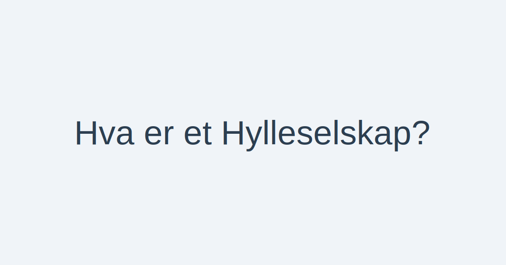

---
title: "Hva er et Hylleselskap? En Komplett Guide til Hylleselskap i Norge"
meta_title: "Hva er et Hylleselskap? En Komplett Guide til Hylleselskap i Norge"
meta_description: 'Et **hylleselskap** (ofte kalt *shelf company* på engelsk) er et ferdigregistrert aksjeselskap (AS) uten drift eller virksomhet.'
slug: hylleselskap
type: blog
layout: pages/single
---

Et **hylleselskap** (ofte kalt *shelf company* på engelsk) er et ferdigregistrert aksjeselskap (AS) uten drift eller virksomhet.
Det er et selskap som tidligere er stiftet og registrert hos [Brønnøysundregistrene](/blogs/regnskap/hva-er-bronnoysundregistrene "Hva er Brønnøysundregistrene? Guide til Norske Registreringsmyndigheter"), men som aldri har vært i aktiv bruk.

Å kjøpe et hylleselskap kan være et effektivt alternativ for **rask oppstart** av virksomhet, men det medfører også spesielle **risikoer** og krav til **due diligence**.

## Hvorfor bruke Hylleselskap?

Ferdigregistrerte selskaper kan tilbys til salg av spesialiserte leverandører, og gir umiddelbar tilgang til et registrert AS uten ventetid på ny registrering.

**Fordeler:**

* **Umiddelbar oppstart:** Ingen ventetid på registreringsprosesser.
* **Profesjonell fremtoning:** Et etablert registreringsdato kan gi inntrykk av erfaring.
* **Unngå administrativ kompleksitet:** Leverandøren håndterer initial registrering.

**Ulemper og risikoer:**

* **Skjulte forpliktelser:** Risiko for uoppdagede gjeldsposter eller manglende dokumentasjon.
* **Høyere kostnad:** Sterk pris for ferdigregistrering sammenlignet med å stifte nytt selskap selv.
* **Begrenset historikk:** Manglende transaksjonshistorikk kan påvirke troverdighet hos banker.

## Hvordan kjøpe et Hylleselskap?

Prosessen for kjøp av hylleselskap inkluderer som regel:

1. **Velge leverandør:** Finn en pålitelig leverandør som tilbyr transparent oversikt over selskapene.
2. **Gjennomføre due diligence:** Utfør grundig [due diligence](/blogs/regnskap/due-diligence "Due diligence i Norske Oppkjøp: En Komplett Guide") for å avdekke eventuelle hemmelige forpliktelser.
3. **Signere kjøpeavtale:** Avtale for overdragelse av aksjer og eventuelle garantier.
4. **Endre styre og eierstruktur:** Registrer nye styremedlemmer, daglig leder og eiere i [Enhetsregisteret](/blogs/regnskap/hva-er-enhetsregisteret "Hva er Enhetsregisteret? Guide til Norsk Enhetsregister").
5. **Oppdatere vedtekter og selskapspapirer:** Tilpass vedtekter og styreprotokoller til din virksomhet.

## Sammenligning: Hylleselskap vs. Nystiftet Selskap

| Egenskap               | Nystiftet Selskap        | Hylleselskap                      |
| :---------------------- | :----------------------- | :-------------------------------- |
| **Registreringstid**    | 2“4 uker                 | **Umiddelbar** oppstart           |
| **Historikk**           | Ren historikk            | Kan ha **ingen eller begrenset** historikk |
| **Kostnad**             | Lavere (registreringsgebyr) | Høyere salgspris                  |
| **Risiko**              | Lav (ingen skjulte forpliktelser) | Risiko for uoppdaget gjeld        |
| **Personvern**          | Åpen dato for stiftelse  | Ulønnet registreringsdato         |

## Viktige hensyn ved kjøp

* **Gjennomgå regnskap og dokumenter nøye** “ be om bekreftelse på at selskapet er inaktivt.
* **Bekreft aksjekapitalens status** “ sørg for at aksjekapitalen er fullt innbetalt og tilgjengelig.
* **Undersøk tinglyste panter og kreditorer** “ sjekk for pant i eiendeler eller ubetalte skatter.
* **Bruk profesjonell rådgivning** “ benytt advokat eller revisor til juridisk og regnskapsmessig kontroll.

## Relaterte artikler

* Se også [Hva er et Aksjeselskap?](/blogs/regnskap/hva-er-et-aksjeselskap "Hva er et Aksjeselskap (AS)?") for en grundig gjennomgang av AS som selskapsform.
* Les mer om [due diligence](/blogs/regnskap/due-diligence "Due diligence i Norske Oppkjøp: En Komplett Guide") for prosess og metodikk ved kjøp av selskaper.

