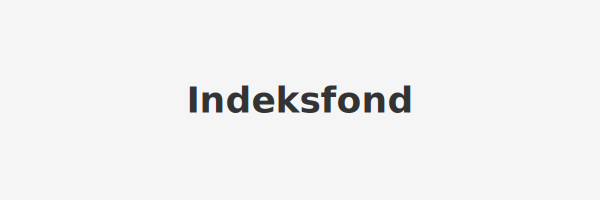

**Indeksfond** er en type [fond](/blogs/regnskap/hva-er-fond "Hva er Fond? Ulike Typer Fond og Regnskapsbehandling") som følger et **benchmark-indeks**, som for eksempel [børs](/blogs/regnskap/bors "Børs i Norge - Alt om Oslo Børs, handel og nøkkelbegreper"). Ved **passiv forvaltning** har indeksfond ofte **lavere kostnader** og sikter på å oppnå samme avkastning som det underliggende markedet.

## Hva er et Indeksfond?

Et indeksfond er et **passivt forvaltet fond** som investerer i alle, eller et representativt utvalg av, de aksjene som inngår i en bestemt indeks. Dette gir:

* **Diversifisering** med én transaksjon.
* Redusert behov for aktiv porteføljeforvaltning.
* Kostnadsbesparelser sammenlignet med aktivt forvaltede fond.

### Eksempel på indekser

| Indeks                      | Beskrivelse                                    |
|-----------------------------|------------------------------------------------|
| OSEBX (Oslo Børs Benchmark)  | Hovedindeksen for aksjer notert på Oslo Børs   |
| MSCI World                  | Verdensindeks som dekker utviklede markeder    |
| S&P 500                     | De 500 største selskapene på New York Stock Exchange |

## Fordeler og ulemper med Indeksfond

### Fordeler

* **Lave kostnader** sammenlignet med aktiv forvaltning.
* **Transparens**, da investeringene gjenspeiler indeksen.
* **Bred diversifisering** som reduserer enkeltaksjerisiko.

### Ulemper

* Ingen mulighet til å slå markedet.
* Eksponering mot hele markedets nedgang.
* Kan ha mindre fleksibilitet ved spesielle markedsforhold.

## Kostnadssammenligning

| Fondtype           | Forvaltningshonorar (est.) | Totale kostnader (TER) |
|--------------------|-----------------------------|------------------------|
| Indeksfond         | 0,10 %                      | 0,12 %                 |
| Aktivt forvaltede  | 1,50 %                      | 1,75 %                 |

## Hvordan investere i Indeksfond?

For norske investorer er en **Aksjesparekonto (ASK)** en populær løsning for å investere i indeksfond uten umiddelbar realisasjon av gevinstbeskatning. Les mer om [Hva er Aksjesparekonto?](/blogs/regnskap/hva-er-aksjesparekonto "Hva er Aksjesparekonto? Guide til skattefordeler og investering") for detaljer.

## Oppsummering

Indeksfond gir en enkel, **kostnadseffektiv** og **transparent** måte å investere bredt i markedet. Med lave gebyrer og automatisk rebalansering passer indeksfond godt for langsiktige investorer som ønsker markedsavkastning uten aktiv forvaltning.

