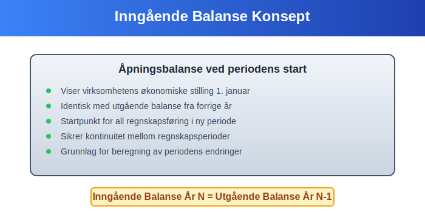
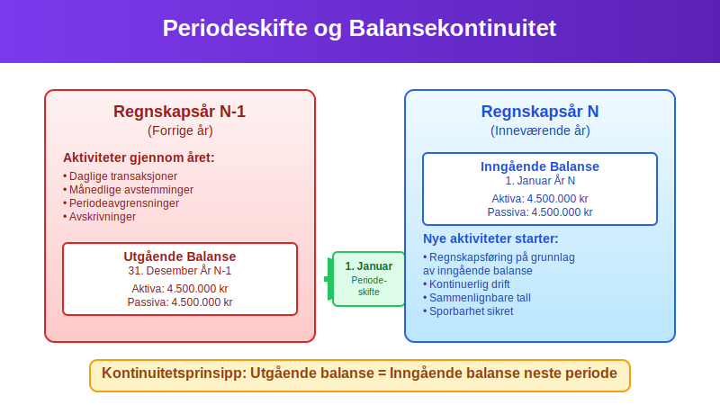
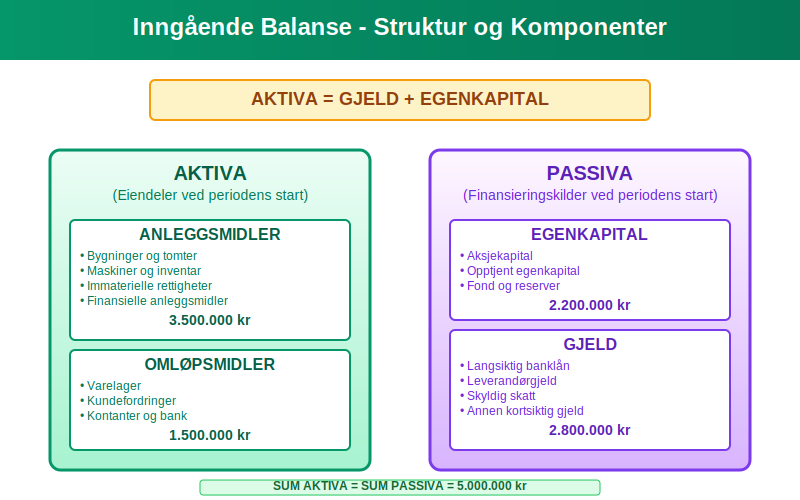
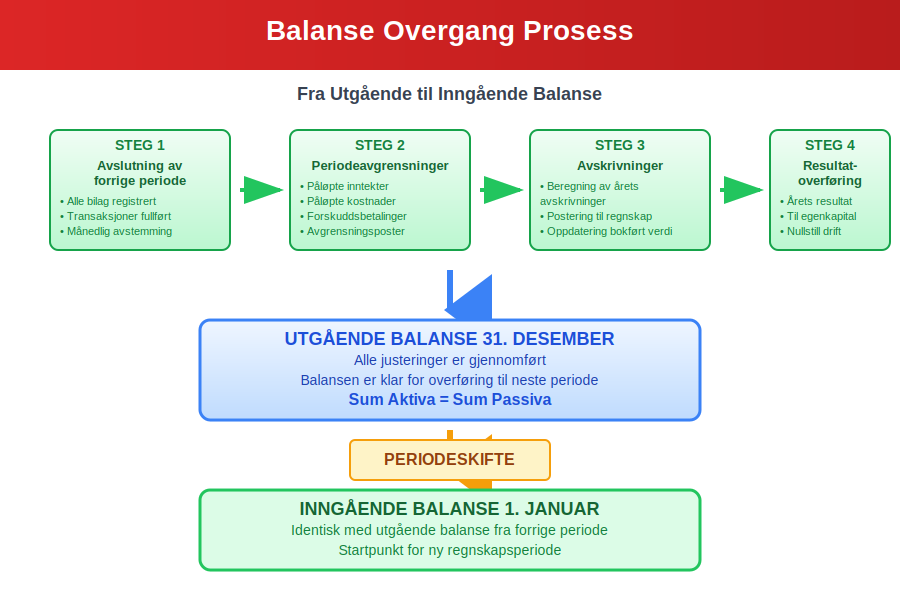
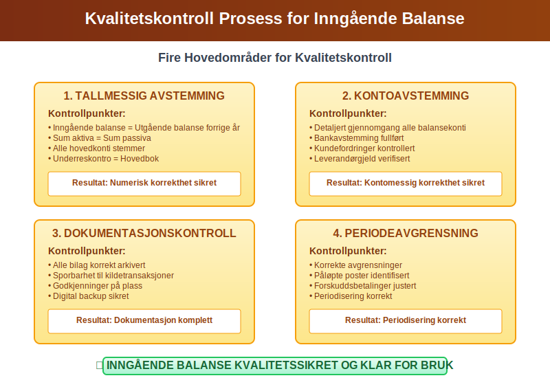
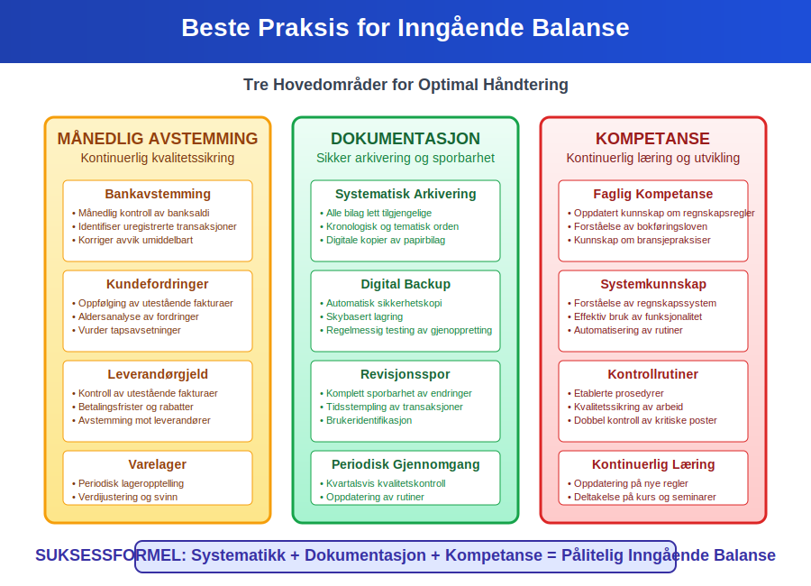

---
title: "Hva er Inngående Balanse i Regnskap?"
seoTitle: "Hva er Inngående Balanse i Regnskap?"
meta_description: '**Inngående balanse** er et fundamentalt begrep i regnskapsføring som refererer til åpningsbalansen ved begynnelsen av en ny regnskapsperiode. Den represente...'
slug: inngaaende-balanse
type: blog
layout: pages/single
---

**Inngående balanse** er et fundamentalt begrep i regnskapsføring som refererer til åpningsbalansen ved begynnelsen av en ny regnskapsperiode. Den representerer virksomhetens økonomiske stilling på det tidspunktet den nye perioden starter, og er identisk med [utgående balanse](/blogs/regnskap/hva-er-avslutningsbalanse "Hva er Avslutningsbalanse? Komplett Guide til Periodens Slutt") fra forrige periode. Denne artikkelen gir en omfattende gjennomgang av inngående balanse, dens rolle i regnskapsføring og praktiske anvendelse.

## Seksjon 1: Definisjon og Grunnleggende Konsept

**Inngående balanse** er [balansen](/blogs/regnskap/hva-er-balanse "Hva er Balanse i Regnskap? Komplett Guide til Balansens Oppbygging og Funksjon") som viser en virksomhets finansielle stilling ved begynnelsen av en regnskapsperiode. Den fungerer som startpunktet for all regnskapsføring i den nye perioden og sikrer kontinuitet mellom regnskapsperioder.

### 1.1 Forholdet til Utgående Balanse

Den **inngående balansen** for år N er alltid identisk med utgående balanse for år N-1. Dette prinsippet sikrer:

* **Kontinuitet** i regnskapsføringen
* **Sporbarhet** mellom perioder  
* **Konsistens** i finansiell rapportering
* **Integritet** i regnskapssystemet

### 1.2 Tidsperspektiv og Periodisering

Inngående balanse markerer overgangen mellom to regnskapsperioder og er kritisk for:

* Etablering av åpningsposter
* Videreføring av [eiendeler](/blogs/regnskap/hva-er-eiendel "Hva er Eiendel i Regnskap? Komplett Guide til Eiendom og Verdier") og [gjeld](/blogs/regnskap/hva-er-gjeld "Hva er Gjeld i Regnskap? Komplett Guide til Forpliktelser og Gjeldstyper")
* Beregning av periodens endringer
* [Avstemming](/blogs/regnskap/hva-er-avstemming "Hva er Avstemming i Regnskap? Komplett Guide til Regnskapsavstemming") og kontroll

## Seksjon 2: Komponenter i Inngående Balanse

Den inngående balansen består av samme komponenter som enhver [balanse](/blogs/regnskap/hva-er-balanse "Hva er Balanse i Regnskap? Komplett Guide til Balansens Oppbygging og Funksjon"), men representerer startverdiene for den nye perioden.

### 2.1 Aktiva i Inngående Balanse

**[Aktiva](/blogs/regnskap/hva-er-aktiva "Hva er Aktiva? En Komplett Guide til Eiendeler i Regnskap")** i inngående balanse omfatter alle eiendeler virksomheten kontrollerer ved periodens start:

#### Anleggsmidler
* **Materielle anleggsmidler:** Bygninger, maskiner, inventar med bokført verdi
* **Immaterielle eiendeler:** Patenter, varemerker, [goodwill](/blogs/regnskap/hva-er-goodwill "Hva er Goodwill i Regnskap? Komplett Guide til Immaterielle Verdier")
* **Finansielle anleggsmidler:** Langsiktige investeringer og aksjer

For detaljert informasjon om anleggsmidler, se [Hva er anleggsmidler?](/blogs/regnskap/hva-er-anleggsmidler "Hva er Anleggsmidler? Komplett Guide til Faste Eiendeler").

#### Omløpsmidler
* **Varelager:** Råvarer, halvfabrikata, ferdigvarer
* **Fordringer:** [Kundefordringer](/blogs/regnskap/hva-er-debitor "Hva er Debitor i Regnskap? Komplett Guide til Kundefordringer og Debitorhåndtering"), andre fordringer
* **Kontanter og [bankinnskudd](/blogs/regnskap/hva-er-bankinnskudd "Hva er Bankinnskudd? Typer, Renter og Regnskapsføring")

### 2.2 Passiva i Inngående Balanse

**Passiva** viser hvordan aktivaene er finansiert ved periodens start:

#### Egenkapital
* **[Aksjekapital](/blogs/regnskap/hva-er-aksjekapital "Hva er Aksjekapital? Komplett Guide til Egenkapital i AS"):** Innbetalt kapital
* **Opptjent egenkapital:** Akkumulert overskudd fra tidligere perioder
* **Fond og reserver:** Spesielle egenkapitalkomponenter

#### Gjeld
* **Langsiktig gjeld:** Lån og forpliktelser med løpetid over ett år
* **Kortsiktig gjeld:** Leverandørgjeld, påløpte kostnader, kortsiktige lån

## Seksjon 3: Praktisk Oppbygging og Eksempel

### 3.1 Eksempel på Inngående Balanse

Her er et praktisk eksempel på hvordan en inngående balanse kan se ut:

| **AKTIVA** | **Inngående Balanse** | **PASSIVA** | **Inngående Balanse** |
|------------|----------------------|-------------|----------------------|
| **ANLEGGSMIDLER** | | **EGENKAPITAL** | |
| Bygninger og tomter | 3.500.000 | Aksjekapital | 1.000.000 |
| Maskiner og inventar | 1.200.000 | Opptjent egenkapital | 2.800.000 |
| Immaterielle rettigheter | 300.000 | **Sum egenkapital** | **3.800.000** |
| **Sum anleggsmidler** | **5.000.000** | | |
| | | **GJELD** | |
| **OMLØPSMIDLER** | | Langsiktig banklån | 2.500.000 |
| Varelager | 800.000 | Leverandørgjeld | 400.000 |
| Kundefordringer | 600.000 | Skyldig skatt | 150.000 |
| Kontanter og bank | 450.000 | Annen kortsiktig gjeld | 200.000 |
| **Sum omløpsmidler** | **1.850.000** | **Sum gjeld** | **3.250.000** |
| | | | |
| **SUM AKTIVA** | **6.850.000** | **SUM PASSIVA** | **6.850.000** |

### 3.2 Overgang fra Utgående til Inngående Balanse

Prosessen for å etablere inngående balanse involverer flere kritiske steg:

* **Avslutning av forrige periode:** Fullføring av alle [bilagsposteringer](/blogs/regnskap/hva-er-bilagsforing "Hva er Bilagsføring? Komplett Guide til Registrering og Dokumentasjon")
* **Periodeavgrensninger:** Justering for påløpte inntekter og kostnader
* **Avskrivninger:** Beregning og postering av årets [avskrivninger](/blogs/regnskap/hva-er-avskrivning "Hva er Avskrivning i Regnskap? Metoder, Beregning og Praktisk Anvendelse")
* **Resultatoverføring:** Overføring av årets resultat til [egenkapital](/blogs/regnskap/hva-er-egenkapital "Hva er Egenkapital? Komplett Guide til Egenkapital i Regnskap")

## Seksjon 4: Inngående Balanse i Ulike Virksomhetstyper

### 4.1 Aksjeselskap (AS)

For [aksjeselskap](/blogs/regnskap/hva-er-et-aksjeselskap "Hva er et Aksjeselskap? Komplett Guide til AS-formen") er inngående balanse spesielt viktig for:

* **Aksjekapitalforvaltning:** Sikring av at [aksjekapital](/blogs/regnskap/hva-er-aksjekapital "Hva er Aksjekapital? Komplett Guide til Egenkapital i AS") er korrekt registrert
* **Utbyttehåndtering:** Beregning av tilgjengelig egenkapital for utbytte
* **Soliditetsvurdering:** Analyse av egenkapitalandel og finansiell styrke

### 4.2 Enkeltpersonforetak

For [enkeltpersonforetak](/blogs/regnskap/hva-er-enkeltpersonforetak "Hva er Enkeltpersonforetak? Komplett Guide til ENK-formen") fokuserer inngående balanse på:

* **Eierens kapitalinnskudd:** Registrering av eierens investeringer
* **Privat bruk:** Håndtering av private uttak og innskudd
* **Forretnings- vs. privatøkonomi:** Klar skille mellom virksomhet og privat

### 4.3 Nyetablerte Virksomheter

For nyetablerte virksomheter representerer inngående balanse:

* **Startkapital:** Eierens innledende investering
* **Oppstartskostnader:** [Anskaffelseskostnader](/blogs/regnskap/hva-er-anskaffelseskost "Hva er Anskaffelseskost? Beregning, Komponenter og Regnskapsføring") for etablering
* **Innledende eiendeler:** Første innkjøp av [anleggsmidler](/blogs/regnskap/hva-er-anleggsmidler "Hva er Anleggsmidler? Komplett Guide til Faste Eiendeler") og omløpsmidler

## Seksjon 5: Kvalitetskontroll og Avstemming

### 5.1 Kontrollrutiner for Inngående Balanse

Sikring av korrekt inngående balanse krever systematiske kontrollrutiner:

* **Tallmessig avstemming:** Kontroll av at inngående balanse = utgående balanse forrige år
* **Kontoavstemming:** Detaljert gjennomgang av alle balansekonti
* **Dokumentasjonskontroll:** Sikring av at alle [bilag](/blogs/regnskap/hva-er-bilag "Hva er Bilag i Regnskap? Komplett Guide til Regnskapsbilag og Dokumentasjon") er korrekt arkivert
* **Periodeavgrensningskontroll:** Verifikasjon av korrekte avgrensninger

### 5.2 Vanlige Feilkilder og Løsninger

| **Feiltype** | **Årsak** | **Løsning** | **Forebygging** |
|--------------|-----------|-------------|-----------------|
| Tallmessige avvik | Regnefeil, overføringsfeil | Detaljert avstemming | Dobbel kontroll |
| Konteringsfeill | Feil kontobruk | Gjennomgang av kontoplanen | Opplæring |
| Periodeavgrensning | Manglende avgrensninger | Systematisk gjennomgang | Rutiner |
| Dokumentasjon | Manglende bilag | Komplettering av arkiv | [Bilagskontroll](/blogs/regnskap/hva-er-bilag "Hva er Bilag i Regnskap? Komplett Guide til Regnskapsbilag og Dokumentasjon") |

## Seksjon 6: Digitale Systemer og Automatisering

### 6.1 ERP-systemer og Inngående Balanse

Moderne [ERP-systemer](/blogs/regnskap/hva-er-erp-system "Hva er ERP-system? Komplett Guide til Enterprise Resource Planning") automatiserer mange aspekter ved håndtering av inngående balanse:

* **Automatisk overføring:** Direkte overføring fra utgående til inngående balanse
* **Integrasjon:** Sammenheng mellom [hovedbok](/blogs/regnskap/hva-er-hovedbok "Hva er Hovedbok i Regnskap? Struktur, Funksjon og Praktisk Bruk") og underreskontro
* **Kontrollrapporter:** Automatiske avstemmingsrapporter
* **Revisjonsspor:** Komplett sporbarhet av alle endringer

### 6.2 Skybaserte Regnskapsløsninger

Skybaserte systemer tilbyr ytterligere fordeler:

* **Sanntidsoppdatering:** Kontinuerlig oppdatering av balanseposter
* **Automatisk backup:** Sikring av data og kontinuitet
* **Tilgangskontroll:** Sikker håndtering av sensitive finansielle data
* **Integrasjoner:** Kobling til [banktransaksjoner](/blogs/regnskap/hva-er-banktransaksjoner "Hva er Banktransaksjoner? Typer, Registrering og Regnskapsføring") og andre systemer

## Seksjon 7: Regulatoriske Krav og Standarder

### 7.1 Norske Regnskapsstandarder

[Bokføringsloven](/blogs/regnskap/hva-er-bokforingsloven "Hva er Bokføringsloven? Komplett Guide til Norske Regnskapsregler") og [regnskapsstandarden](/blogs/regnskap/hva-er-regnskap "Hva er Regnskap? Komplett Guide til Regnskapsføring og Finansiell Rapportering") stiller spesifikke krav til inngående balanse:

* **Dokumentasjonskrav:** Alle poster må være dokumentert
* **Oppbevaringskrav:** Regnskapsdata må oppbevares i minimum 5 år
* **Revisjonskrav:** Større virksomheter må ha ekstern revisjon
* **Rapporteringskrav:** Årlig innlevering til Regnskapsregisteret

### 7.2 Internasjonale Standarder (IFRS)

For virksomheter som følger [IFRS](/blogs/regnskap/hva-er-ifrs "Hva er IFRS? Komplett Guide til Internasjonale Regnskapsstandarder"), gjelder ytterligere krav:

* **Sammenlignbarhet:** Konsistent presentasjon mellom perioder
* **Transparens:** Utfyllende noteopplysninger
* **Virkelig verdi:** Markedsbasert verdivurdering hvor relevant
* **Konsolidering:** Spesielle regler for konsernregnskap

## Seksjon 8: Praktiske Tips og Beste Praksis

### 8.1 Månedlig Avstemming

For å sikre korrekt inngående balanse ved årsskiftet, anbefales månedlig avstemming:

* **Bankavstemming:** Månedlig [bankavstemming](/blogs/regnskap/hva-er-bankavstemming "Hva er Bankavstemming? Prosess, Metoder og Praktisk Gjennomføring") sikrer korrekte kontantsaldi
* **Kundefordringer:** Regelmessig oppfølging av [debitor](/blogs/regnskap/hva-er-debitor "Hva er Debitor i Regnskap? Komplett Guide til Kundefordringer og Debitorhåndtering")saldi
* **Leverandørgjeld:** Kontroll av utestående [leverandørfakturaer](/blogs/regnskap/hva-er-en-faktura "Hva er en Faktura? Komplett Guide til Fakturering og Regnskapsføring")
* **Varelager:** Periodisk lageropptelling og verdijustering

### 8.2 Dokumentasjon og Arkivering

God dokumentasjonspraksis er kritisk:

* **Systematisk arkivering:** Alle [bilag](/blogs/regnskap/hva-er-bilag "Hva er Bilag i Regnskap? Komplett Guide til Regnskapsbilag og Dokumentasjon") må være lett tilgjengelige
* **Digital backup:** Sikring av elektroniske regnskapsdata
* **Revisjonsspor:** Komplett sporbarhet av alle transaksjoner
* **Periodisk gjennomgang:** Regelmessig kvalitetskontroll

### 8.3 Kompetanse og Opplæring

Sikring av korrekt håndtering krever:

* **Faglig kompetanse:** Oppdatert kunnskap om regnskapsregler
* **Systemkunnskap:** Forståelse av regnskapssystemets funksjonalitet
* **Kontrollrutiner:** Etablerte prosedyrer for kvalitetssikring
* **Kontinuerlig læring:** Oppdatering på nye regler og praksis

## Seksjon 9: Sammenheng med Andre Regnskapsbegreper

### 9.1 Relasjon til Resultatregnskap

Inngående balanse har direkte sammenheng med [resultatregnskapet](/blogs/regnskap/hva-er-driftsregnskap "Hva er Driftsregnskap? Komplett Guide til Driftsresultat og Lønnsomhet"):

* **Årets resultat:** Påvirker egenkapitalen i utgående/inngående balanse
* **Avskrivninger:** Reduserer bokført verdi av anleggsmidler
* **Periodeavgrensninger:** Sikrer korrekt periodisering av inntekter og kostnader

### 9.2 Sammenheng med Kontantstrømoppstilling

Inngående balanse er også viktig for kontantstrømanalyse:

* **Arbeidskapitalendringer:** Beregnes basert på balansendringer
* **Investeringsaktivitet:** Endringer i anleggsmidler
* **Finansieringsaktivitet:** Endringer i gjeld og egenkapital

### 9.3 Betydning for Finansiell Analyse

Inngående balanse danner grunnlag for viktige finansielle nøkkeltall:

* **Soliditet:** [Egenkapital](/blogs/regnskap/hva-er-egenkapital "Hva er Egenkapital? Komplett Guide til Egenkapital i Regnskap") i forhold til totalkapital
* **Likviditet:** [Arbeidskapital](/blogs/regnskap/hva-er-arbeidskapital "Hva er Arbeidskapital? Beregning, Analyse og Optimalisering") og likviditetsgrad
* **Rentabilitet:** [Egenkapitalrentabilitet](/blogs/regnskap/hva-er-egenkapitalrentabilitet "Hva er Egenkapitalrentabilitet? Beregning, Analyse og Benchmarking") og totalkapitalrentabilitet

## Konklusjon

**Inngående balanse** er et fundamentalt element i regnskapsføring som sikrer kontinuitet og integritet mellom regnskapsperioder. Den representerer ikke bare et øyeblikksbilde av virksomhetens økonomiske stilling ved periodens start, men fungerer også som grunnlaget for all regnskapsføring i den nye perioden.

Korrekt håndtering av inngående balanse krever:

* **Systematisk tilnærming:** Etablerte rutiner for overgang mellom perioder
* **Kvalitetskontroll:** Grundig avstemming og dokumentasjon
* **Teknisk kompetanse:** Forståelse av regnskapsregler og -systemer
* **Kontinuerlig oppfølging:** Regelmessig overvåking og justering

Ved å følge beste praksis for inngående balanse sikrer virksomheter ikke bare regelverksetterlevelse, men også grunnlaget for pålitelig finansiell rapportering og beslutningsgrunnlag. Dette er essensielt for både interne styringsformål og eksterne rapporteringskrav.

For virksomheter som ønsker å optimalisere sin regnskapspraksis, er forståelse og korrekt håndtering av inngående balanse en kritisk suksessfaktor som påvirker hele regnskapsåret.

