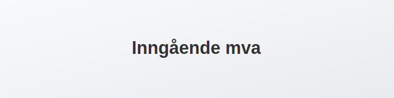

**Inngående mva** er den merverdiavgiften en virksomhet betaler på kjøp av varer og tjenester, som senere kan **fradragsføres** i regnskapet dersom visse krav er oppfylt.



## Hva er inngående mva?

*Inngående mva* er den avgiften virksomheter betaler til leverandører ved kjøp av varer og tjenester. Dette beløpet kan trekkes fra mot utgående merverdiavgift ved rapportering i [MVA-meldingen](/blogs/regnskap/hva-er-mva-melding "Hva er MVA-melding? Komplett Guide til Merverdiavgiftsrapportering i Norge").

## Beregning av inngående mva

Inngående mva beregnes som en andel av kjøpsprisen inklusiv mva:

```text
Inngående MVA = Kjøpspris inkl. MVA × MVA-sats / (100 + MVA-sats)
```

**Eksempel:**
- Kjøpspris inkl. MVA: 625 kr
- MVA-sats: 25%
- Inngående MVA: 625 × 25 / 125 = 125 kr

## Krav til dokumentasjon

For å kreve fradrag for inngående mva må bilaget oppfylle dokumentasjonskravene i [bokføringsforskriften](/blogs/regnskap/hva-er-bokforingsforskriften "Hva er Bokføringsforskriften? Regler for bokføringsplikt i Norge"):

* Gyldig faktura eller kvittering fra leverandør
* Følgende minstekrav:
  * Leverandørens navn, adresse og organisasjonsnummer
  * Fakturanummer og dato
  * Beskrivelse av vare eller tjeneste
  * Beløp eksklusiv mva, mva-sats og beløp for mva
  * Kundeopplysninger

## Bokføring av inngående mva

For å bokføre inngående mva brukes kontoer i standard kontoplan. Et eksempel på kontoer:

| Konto | Beskrivelse                                                                                                            |
|-------|------------------------------------------------------------------------------------------------------------------------|
| [1610](/blogs/kontoplan/1610-inngaaende-merverdiavgift "Konto 1610 - Inngående merverdiavgift")                           | Sammenskillet inngående mva                                                                                             |
| [1611](/blogs/kontoplan/1611-inngaaende-merverdiavgift-hoy-sats "Konto 1611 - Inngående merverdiavgift høy sats")           | Inngående mva høy sats (25%)                                                                                              |
| [1612](/blogs/kontoplan/1612-inngaaende-merverdiavgift-kjop-tjen-fra-utlandet "Konto 1612 - Inngående merverdiavgift kjøp tjenester fra utlandet") | Inngående mva kjøp av tjenester fra utlandet (reverse charge)                                                               |
| [1613](/blogs/kontoplan/1613-inngaaende-merverdiavgift-middels-sats "Konto 1613 - Inngående merverdiavgift middels sats") | Inngående mva middels sats (15%)                                                                                           |
| [1614](/blogs/kontoplan/1614-inngaaende-merverdiavgift-lav-sats "Konto 1614 - Inngående merverdiavgift lav sats")         | Inngående mva lav sats (12%)                                                                                              |


## Begrensninger og unntak

Det finnes situasjoner hvor inngående mva ikke kan fradragsføres fullt ut:

* **Representasjon**: Mva på mat og drikke til forretningsformål er kun 50% fradragsberettiget  
* **Personbiler**: Begrenset fradrag med mindre de brukes i virksomheten  
* **Fritatte aktiviteter**: Ingen fradragsrett ved kjøp til fritatte virksomheter (for eksempel helse, undervisning og finans)  
* **Privat bruk**: Delvis eller ingen fradragsrett ved blandet bruk for privat og næring  

## Videre lesning

* Se mer om [Merverdiavgift (MVA)](/blogs/regnskap/hva-er-moms-mva "Hva er Merverdiavgift (MVA)? Beregning og Regnskapsføring")  
* Les om [Avgiftsplikt (MVA)](/blogs/regnskap/hva-er-avgiftsplikt-mva "Hva er Avgiftsplikt (MVA)? Komplett Guide til Merverdiavgift i Norge")  
* For krav til regnskapsføring, se [Hva er Bokføringsforskriften?](/blogs/regnskap/hva-er-bokforingsforskriften "Hva er Bokføringsforskriften? Regler for bokføringsplikt i Norge")


