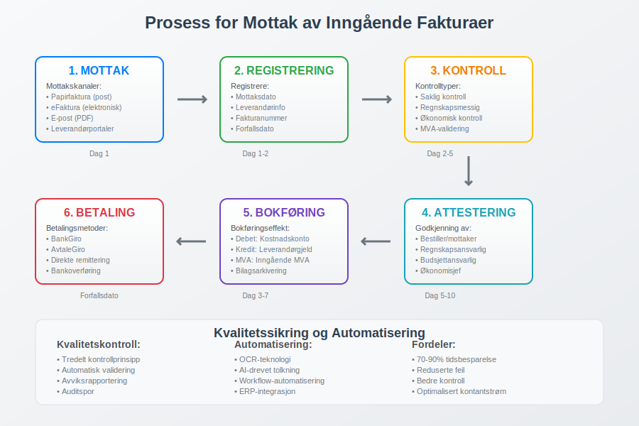
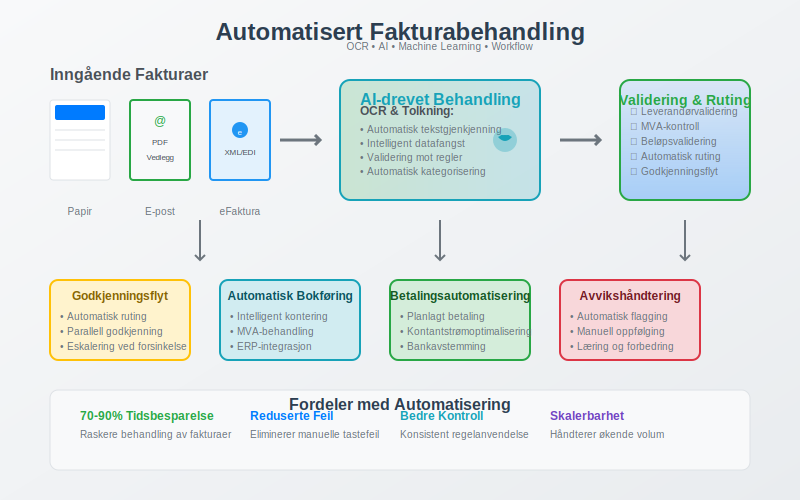

---
title: "Inngående Faktura"
seoTitle: "Inngående Faktura"
meta_description: 'En **inngående faktura** er en [faktura](/blogs/regnskap/hva-er-en-faktura "Hva er en Faktura? En Guide til Norske Fakturakrav") som bedriften mottar fra lever...'
slug: innganende-faktura
type: blog
layout: pages/single
---

En **inngående faktura** er en [faktura](/blogs/regnskap/hva-er-en-faktura "Hva er en Faktura? En Guide til Norske Fakturakrav") som bedriften mottar fra leverandører for kjøp av varer eller tjenester. Dette er motsatsen til utgående fakturaer som bedriften sender til sine kunder. Inngående fakturaer representerer bedriftens kostnader og gjeld, og må behandles systematisk for å sikre korrekt [bokføring](/blogs/regnskap/hva-er-bokforing "Hva er Bokføring? Komplett Guide til Regnskapsføring i Norge") og kontroll med bedriftens utgifter.

Behandling av inngående fakturaer er en kritisk del av bedriftens [internkontroll](/blogs/regnskap/hva-er-attestering "Hva er Attestering? En Komplett Guide til Bilagsbehandling og Godkjenning") og påvirker direkte [arbeidskapitalen](/blogs/regnskap/hva-er-arbeidskapital "Hva er Arbeidskapital? Beregning og Analyse av Driftskapital") gjennom leverandørgjeld og kontantstrøm.

## Seksjon 1: Mottak og Registrering av Inngående Fakturaer

Første steg i behandlingen av inngående fakturaer er systematisk mottak og registrering. Moderne bedrifter har etablert strukturerte [bilagsmottak](/blogs/regnskap/hva-er-bilagsmottak "Bilagsmottak - Komplett Guide til Dokumentmottak og Fakturabehandling") for å sikre at alle fakturaer blir fanget opp og behandlet korrekt.

### Mottakskanaler for Inngående Fakturaer

Inngående fakturaer kan mottas gjennom flere kanaler:

* **Papirfakturaer:** Tradisjonelle fakturaer mottatt per post
* **[eFaktura](/blogs/regnskap/hva-er-efaktura "Hva er eFaktura? Komplett Guide til Elektronisk Fakturering i Norge"):** Elektroniske fakturaer mottatt direkte i bedriftens system
* **E-post:** Fakturaer sendt som PDF-vedlegg
* **Leverandørportaler:** Fakturaer lastet ned fra leverandørenes nettsider
* **[ERP-integrasjoner](/blogs/regnskap/hva-er-erp-system "Hva er ERP-system? Komplett Guide til Enterprise Resource Planning"):** Automatisk mottak gjennom systemintegrasjoner

### Registrering og Nummerering

Alle inngående fakturaer må registreres systematisk med:

* **Mottaksdato:** Når fakturaen ble mottatt av bedriften
* **Leverandørinformasjon:** Navn, organisasjonsnummer og kontaktinformasjon
* **Fakturanummer:** Leverandørens [fakturanummer](/blogs/regnskap/hva-er-fakturanummer "Hva er Fakturanummer? Komplett Guide til Nummerering og Lovkrav")
* **Internt referansenummer:** Bedriftens eget sporingsnummer
* **Forfallsdato:** Når fakturaen må betales

## Seksjon 2: Kontroll og Validering

Etter mottak må alle inngående fakturaer gjennom en grundig kontrollprosess før de kan godkjennes for betaling. Denne kontrollen er en del av bedriftens [attestering](/blogs/regnskap/hva-er-attestering "Hva er Attestering? En Komplett Guide til Bilagsbehandling og Godkjenning") og sikrer at bedriften kun betaler for varer og tjenester som faktisk er mottatt.

### Tredelt Kontrollprosess

| Kontrolltype | Ansvarlig | Kontrollpunkter |
|--------------|-----------|-----------------|
| **Saklig kontroll** | Bestiller/Mottaker | –¢ Er varen/tjenesten levert som avtalt? –¢ Stemmer kvalitet og kvantitet? –¢ Er prisen i henhold til avtale? |
| **Regnskapsmessig kontroll** | Regnskapsansvarlig | –¢ Er fakturaen korrekt kontert? –¢ Er [MVA](/blogs/regnskap/hva-er-avgiftsplikt-mva "Hva er Avgiftsplikt (MVA)? Komplett Guide til Merverdiavgift i Norge") beregnet riktig? –¢ Er alle obligatoriske opplysninger til stede? |
| **Økonomisk kontroll** | Budsjettansvarlig | –¢ Er kjøpet innenfor budsjett? –¢ Er det gitt nødvendig fullmakt? –¢ Er betalingstidspunkt optimalt? |

### Validering av Fakturainnhold

Inngående fakturaer må valideres mot følgende krav:

* **Leverandørvalidering:** Kontroll av at leverandøren er registrert i [Enhetsregisteret](/blogs/regnskap/hva-er-enhetsregisteret "Hva er Enhetsregisteret?")
* **MVA-validering:** Kontroll av [MVA-nummer](/blogs/regnskap/hva-er-avgiftsplikt-mva "Hva er Avgiftsplikt (MVA)? Komplett Guide til Merverdiavgift i Norge") og korrekt MVA-beregning
* **Beløpsvalidering:** Kontroll av at totalbeløp stemmer med delbeløp og MVA
* **Datovalidering:** Kontroll av at fakturadato og forfallsdato er rimelige

## Seksjon 3: Automatisering av Fakturabehandling

Moderne bedrifter implementerer i økende grad automatiserte løsninger for behandling av inngående fakturaer. **[Fakturatolk-teknologi](/blogs/regnskap/hva-er-fakturatolk "Hva er Fakturatolk? Automatisk Fakturabehandling og OCR-teknologi")** kan dramatisk redusere manuelt arbeid og forbedre nøyaktigheten i fakturabehandlingen.

### Fordeler med Automatisering

* **Tidsbesparelse:** Reduserer behandlingstid med 70-90%
* **Reduserte feil:** Eliminerer manuelle tastefeil og tolkningsfeil
* **Bedre kontroll:** Automatisk validering mot forretningsregler
* **Raskere godkjenning:** Automatisk ruting til riktig godkjenner
* **Forbedret sporbarhet:** Komplett auditspor for alle transaksjoner

### Teknologier for Automatisering

* **OCR (Optical Character Recognition):** Automatisk lesing av papir- og PDF-fakturaer
* **AI og maskinlæring:** Intelligent tolkning og kategorisering
* **Workflow-automatisering:** Automatisk ruting basert på forretningsregler
* **Integrasjoner:** Kobling mot [ERP-systemer](/blogs/regnskap/hva-er-erp-system "Hva er ERP-system? Komplett Guide til Enterprise Resource Planning") og regnskapsprogrammer

## Seksjon 4: Bokføring av Inngående Fakturaer

Etter godkjenning må inngående fakturaer bokføres korrekt i bedriftens regnskap. Dette påvirker både [balansen](/blogs/regnskap/hva-er-balanse "Hva er Balanse? Komplett Guide til Balanseregnskap og Finansiell Stilling") og [resultatregnskapet](/blogs/regnskap/hva-er-driftsregnskap "Hva er Driftsregnskap? Komplett Guide til Driftsresultat og Lønnsomhetsanalyse").

### Bokføringseffekter

Når en inngående faktura bokføres, skjer følgende:

* **Debet:** Relevant kostnadskonto eller [anleggsmiddel](/blogs/regnskap/hva-er-anleggsmidler "Hva er Anleggsmidler? Komplett Guide til Varige Driftsmidler")
* **Kredit:** Leverandørgjeld (kortsiktig [gjeld](/blogs/regnskap/hva-er-gjeld "Hva er Gjeld? Komplett Guide til Forpliktelser i Regnskap"))
* **MVA-behandling:** Registrering av inngående MVA som fradragsberettiget

### Konteringseksempler

| Fakturatype | Debet-konto | Kredit-konto | MVA-behandling |
|-------------|-------------|--------------|----------------|
| Kontorrekvisita | Kontorkostnader | Leverandørgjeld | 25% inngående MVA |
| Maskinkjøp | Anleggsmidler | Leverandørgjeld | 25% inngående MVA |
| Konsulenthonorar | Konsulentkostnader | Leverandørgjeld | 25% inngående MVA |
| Forsikring | Forsikringskostnader | Leverandørgjeld | MVA-fritatt |

## Seksjon 5: Betalingshåndtering

Etter bokføring må inngående fakturaer betales innen forfallsdato for å unngå [forsinkelsesrenter](/blogs/regnskap/hva-er-forsinkelsesrente "Hva er Forsinkelsesrente? Komplett Guide til Morarenter og Beregning") og opprettholde gode leverandørforhold.

### Betalingsmetoder for Bedrifter

* **[BankGiro](/blogs/regnskap/hva-er-bankgiro "Hva er BankGiro? Komplett Guide til Norsk Betalingssystem"):** Tradisjonell betaling via nettbank
* **[AvtaleGiro](/blogs/regnskap/hva-er-avtalegiro "Hva er AvtaleGiro? Komplett Guide til Automatisk Betaling"):** Automatisk trekk for faste leverandører
* **[Direkte remittering](/blogs/regnskap/hva-er-direkte-remittering "Hva er Direkte Remittering? Komplett Guide til Automatisk Betaling"):** Bedriftens eget automatiske betalingssystem
* **Bankoverføring:** For internasjonale betalinger

### Optimalisering av Betalingstidspunkt

Smart håndtering av betalingstidspunkt kan forbedre bedriftens [arbeidskapital](/blogs/regnskap/hva-er-arbeidskapital "Hva er Arbeidskapital? Beregning og Analyse av Driftskapital"):

* **Utnytt betalingsfrister:** Betal på forfallsdato, ikke tidligere
* **Forhandle betalingsbetingelser:** Lengre kredittid forbedrer kontantstrøm
* **Kontantrabatter:** Vurder om tidlig betaling gir lønnsomme rabatter
* **Sesongmessige hensyn:** Tilpass betalinger til bedriftens kontantstrøm

## Seksjon 6: Leverandørstyring og Oppfølging

Systematisk håndtering av inngående fakturaer er en del av bredere **leverandørstyring** som påvirker bedriftens [anskaffelsesprosesser](/blogs/regnskap/hva-er-anskaffelser "Hva er Anskaffelser? En Komplett Guide til Offentlige og Private Innkjøp") og leverandørforhold.

### Leverandørregister og -oppfølging

* **Leverandørvalidering:** Kontroll av leverandørers legitimitet og kapasitet
* **Betalingshistorikk:** Sporing av betalingsmønstre og -ytelse
* **Kontraktsoppfølging:** Sikre at fakturaer stemmer med avtaler
* **Ytelsesmåling:** Evaluering av leverandørers service og kvalitet

### Risikostyring

Inngående fakturaer representerer flere risikoområder:

* **Svindel:** Falske fakturaer eller leverandører
* **Dobbeltbetaling:** Betaling av samme faktura flere ganger
* **Overbetaling:** Betaling av feil beløp eller ikke-leverte tjenester
* **Compliance:** Sikre overholdelse av regnskapsregler og skattelovgivning

## Seksjon 7: Digitalisering og Fremtidige Trender

Behandling av inngående fakturaer er i rask utvikling mot full digitalisering. **[Elektronisk fakturering](/blogs/regnskap/hva-er-elektronisk-fakturering "Hva er Elektronisk Fakturering? Komplett Guide til Digitale Fakturaløsninger")** blir stadig mer utbredt og vil på sikt erstatte papirbaserte prosesser.

### Fremtidige Utviklingstrender

* **AI-drevet automatisering:** Mer intelligent behandling og kategorisering
* **Blockchain-teknologi:** Sikker og sporbar fakturabehandling
* **Sanntidsintegrasjoner:** Direkte kobling mellom leverandør- og kundesystemer
* **Prediktiv analyse:** Automatisk oppdagelse av avvik og potensielle problemer

### Regulatoriske Endringer

Norske myndigheter jobber mot økt digitalisering:

* **Krav til elektronisk fakturering:** Særlig for offentlige anskaffelser
* **Standardisering:** Felles formater og protokoller
* **Rapporteringskrav:** Økt krav til sporbarhet og dokumentasjon

## Seksjon 8: Beste Praksis og Anbefalinger

For å optimalisere behandlingen av inngående fakturaer anbefales følgende:

### Organisatoriske Tiltak

* **Tydelige rutiner:** Dokumenterte prosedyrer for alle steg
* **Ansvarsfordeling:** Klar fordeling av roller og ansvar
* **Kompetanseutvikling:** Opplæring i fakturabehandling og systemer
* **Regelmessig evaluering:** Kontinuerlig forbedring av prosesser

### Tekniske Løsninger

* **Integrerte systemer:** Kobling mellom fakturabehandling og [ERP](/blogs/regnskap/hva-er-erp-system "Hva er ERP-system? Komplett Guide til Enterprise Resource Planning")
* **Automatisering:** Reduser manuelt arbeid der det er mulig
* **Backup og sikkerhet:** Sikre oppbevaring av fakturaer og data
* **Mobilløsninger:** Mulighet for godkjenning på farten

### Økonomiske Hensyn

* **Kostnad-nytte-analyse:** Vurder investeringer i automatisering
* **Leverandørforhandlinger:** Optimaliser betalingsbetingelser
* **Kontantstrømstyring:** Koordiner betalinger med inntekter
* **Budsjettoppfølging:** Bruk fakturaer til løpende budsjettkontroll

Effektiv behandling av inngående fakturaer er grunnleggende for god økonomistyring og bidrar til bedre [arbeidskapital](/blogs/regnskap/hva-er-arbeidskapital "Hva er Arbeidskapital? Beregning og Analyse av Driftskapital"), reduserte kostnader og forbedret leverandørsamarbeid.

