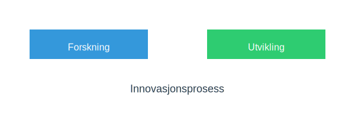

---
title: "Innovasjon"
seoTitle: "Innovasjon"
description: '**Innovasjon** er en kritisk driver for langsiktig vekst og konkurranseevne i norske virksomheter. I regnskapssammenheng innebærer innovasjon både behandling ...'
---

**Innovasjon** er en kritisk driver for langsiktig vekst og konkurranseevne i norske virksomheter. I regnskapssammenheng innebærer innovasjon både behandling av **utviklingskostnader** som immaterielle eiendeler og strategisk rapportering av FoU-investeringer.

## Typer innovasjon

Innovasjon kan deles inn i flere hovedkategorier:

* **Produktinnovasjon:** Nye eller forbedrede produkter eller tjenester.
* **Prosessinnovasjon:** Effektivisering eller automatisering av arbeidsprosesser.
* **Forretningsmodellinnovasjon:** Nye måter å skape og fange verdi på gjennom endret forretningsmodell.
* **Organisatorisk innovasjon:** Nye styrings- eller organisasjonsformer som fremmer kreativitet.

For mer om forretningsmodell, se [Hva er forretningsmodell?](/blogs/regnskap/hva-er-forretningsmodell "Hva er forretningsmodell? Komplett guide til utforming og evaluering av forretningsmodell for regnskap og virksomhetsstyring").

## Innovasjonsprosess

Tabellen nedenfor viser en forenklet oversikt over regnskapsmessig behandling av ulike faser i innovasjonsprosessen:

| Fase               | Regnskapsbehandling                                                       |
|--------------------|----------------------------------------------------------------------------|
| Forskning          | Kostnadsføres løpende (ingen aktivering)                                   |
| Utvikling          | Kan aktiveres som [immaterielle eiendeler](/blogs/regnskap/hva-er-imaterielle-eiendeler "Hva er Imaterielle Eiendeler? Komplett Guide til Immaterielle Verdier i Regnskap") etter spesifikke kriterier |
| Kommersialisering  | Avskrives over forventet levetid via [avskrivning](/blogs/regnskap/hva-er-avskrivning "Hva er Avskrivning i Regnskap? Metoder, Beregning og Praktiske Eksempler")           |

## Regnskapsmessig behandling og krav

For å kunne **aktivere** utviklingskostnader må følgende kriterier være oppfylt:

| Kriterium                             | Beskrivelse                                                        |
|---------------------------------------|--------------------------------------------------------------------|
| Teknisk gjennomførbarhet              | Prosjektet kan fullføres og benyttes eller selges                   |
| Intensjon om fullføring               | Virksomheten har intensjon om å fullføre og bruke eller selge       |
| Evne til bruk eller salg              | Produktet eller tjenesten vil generere fremtidige økonomiske fordeler |
| Tilgjengelige ressurser               | Nødvendige tekniske, finansielle og driftsmessige ressurser er til stede |
| Pålitelig måling av kostnad           | Kostnader kan måles pålitelig fra start til slutt                  |

Det er viktig å sikre god [internkontroll](/blogs/regnskap/hva-er-internkontroll "Hva er Internkontroll? En Komplett Guide til Internkontroll i Norge") for å dokumentere og kvalitetssikre måling av utviklingskostnader.

## Regelverk i Norge

Norsk regnskapslov og NRS har klare krav for behandling av FoU:

* Regnskapsloven §–¯5‘10 og §–¯5‘11 “ definisjon og aktivering av immaterielle eiendeler.
* Norsk Regnskapsstandard NRS 15 “ spesifikke regler for innregning og måling av immaterielle eiendeler.
* Skatteloven §–¯6‘1 “ skattemessig fradrag for forsknings- og utviklingskostnader.

Ved rapportering av innovasjonsaktiviteter er det fordelaktig å integrere relevante nøkkeltall og indikatorer i virksomhetens [internkontroll](/blogs/regnskap/hva-er-internkontroll "Hva er Internkontroll? En Komplett Guide til Internkontroll i Norge") og årsrapport.

## Oppsummering

Innovasjon er mer enn et strategisk buzzword “ det er en regnskapsmessig realitet. Ved å forstå kriteriene for aktivering, sikre god internkontroll og følge gjeldende regelverk, kan virksomheter måle og rapportere innovasjonsinvesteringer på en riktig og verdiskapende måte.

*Artikkelen ble sist oppdatert for å gi en omfattende oversikt over innovasjon i regnskapssammenheng.*

