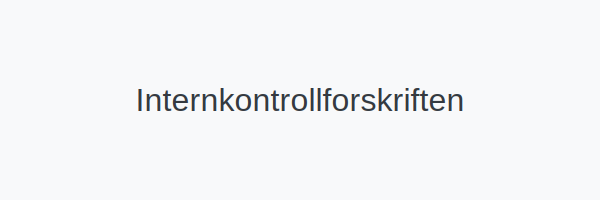

---
title: "Internkontrollforskriften"
seoTitle: "Internkontrollforskriften"
meta_description: '**Internkontrollforskriften** (FOR-2016-12-06-1721) fastsetter krav til internkontroll i virksomheter som faller inn under arbeidsmiljøloven §–¯3-1. Denne fo...'
slug: internkontrollforskriften
type: blog
layout: pages/single
---

**Internkontrollforskriften** (FOR-2016-12-06-1721) fastsetter krav til internkontroll i virksomheter som faller inn under arbeidsmiljøloven §–¯3-1. Denne forskriften utdyper de generelle kravene til [internkontroll](/blogs/regnskap/hva-er-internkontroll "Hva er internkontroll? En Komplett Guide til Internkontroll i Norge") og beskriver struktur, *risikovurdering*, dokumentasjon og oppfølging.

## Lovgrunnlag og Formål

Internkontrollforskriften har som formål å sikre systematisk **internkontroll** i virksomheter på en måte som forebygger skader, sikrer godt arbeidsmiljø og etterlevelse av gjeldende krav. Forskriften er hjemlet i Arbeidsmiljøloven §–¯3-1 og gjelder for alle virksomheter som omfattes av denne bestemmelsen.

| Kapittel | Tema                              | Relevante Paragrafer |
|----------|-----------------------------------|----------------------|
| 1        | Formål og virkeområde             | §–¯1“2               |
| 2        | Definisjoner                      | §–¯3                 |
| 3        | Krav til internkontrollsystemet   | §–¯4                 |
| 4        | Risikovurdering                   | §–¯5                 |
| 5        | Dokumentasjon og oppfølging       | §–¯6“7               |

## Hovedkomponenter i internkontrollsystemet

Internkontrollforskriften definerer flere **kjernekomponenter** som virksomheter må etablere:

* **Organisering og ansvar:** Klare ansvarsfordelinger for planlegging, gjennomføring og oppfølging.
* **Kartlegging av risiko:** Identifisering av farer og risikovurdering i arbeidsmiljøet.
* **Tiltak og oppfølging:** Planlagte tiltak for å redusere risiko og regelmessig gjennomgang.
* **Dokumentasjon:** Løpende oppdaterte prosedyrer, rapporter og oversikter som viser at kravene er oppfylt.

## Risikovurdering

Forskriften krever at virksomheten gjennomfører systematisk **risikovurdering**:

1. Kartlegg farer i arbeidsmiljøet.
2. Vurder konsekvenser og sannsynlighet.
3. Prioriter tiltak basert på risikonivå.
4. Dokumenter prosessen i en risikovurderingsrapport.

## Dokumentasjonskrav

All internkontrollaktivitet skal dokumenteres skriftlig. Dette omfatter:

* Årlige revisjoner av internkontrollsystemet.
* Protokoller fra risikovurderingsmøter.
* Sjekklister og kontrollplaner.
* Rapportering av avvik og oppfølging.

## Roller og Ansvar

**Virksomhetens ledelse** har det overordnede ansvaret for at internkontrollforskriften følges. Det operative arbeidet kan delegeres, men endelig ansvar ligger alltid hos ledelsen.

### Ansvarsfordeling

* **Daglig leder:** Sikre at prosedyrer er implementert.
* **Verneombud:** Følge opp arbeidsmiljø og melde avvik.
* **Arbeidsmiljøutvalg (AMU):** Bidra i risikovurdering, se [AMU (Arbeidsmiljøutvalg)](/blogs/regnskap/amu "AMU (Arbeidsmiljøutvalg) “ Komplett Guide til Arbeidsmiljøutvalg i Norge").

## Oppsummering

Internkontrollforskriften er en sentral del av et virksomhets **kontrollsystem**. Ved å følge kravene i forskriften, kan norske bedrifter sikre et trygt arbeidsmiljø, etterleve lovkrav og styrke tilliten til organisasjonens styringsprosesser.

