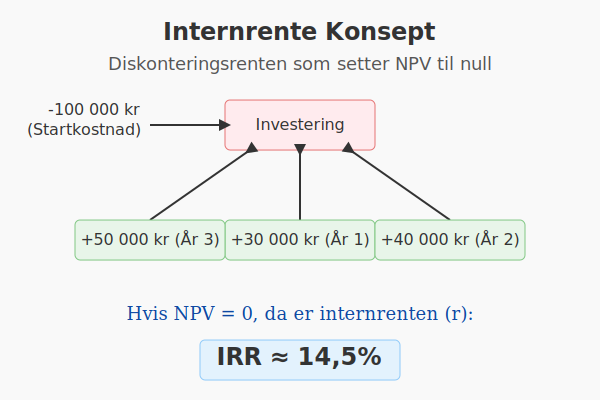

---
title: "Hva er Internrente?"
seoTitle: "Hva er Internrente?"
description: '**Internrente** (IRR, Internal Rate of Return) er den diskonteringsrenten som setter netto nåverdi (NPV) av en investering til null. Internrenten gir et mål p...'
summary: "Definisjon av internrente (IRR), beregning, fordeler, begrensninger og sammenligning med NPV."
---

**Internrente** (IRR, Internal Rate of Return) er den diskonteringsrenten som setter netto nåverdi (NPV) av en investering til null. Internrenten gir et mål på den årlige **avkastningen** som et prosjekt eller en investering forventes å generere.



## Hva er Internrente?

Internrente er den renten, ofte betegnet som _r_, som tilfredsstiller likningen for netto nåverdi:

```math
0 = \sum_{t=0}^{n} \frac{CF_t}{(1 + r)^t} - I_0
```

Hvor:
* _CF<sub>t</sub>_ = Kontantstrøm i periode _t_
* _r_ = Internrente
* _n_ = Antall perioder
* _I<sub>0</sub>_ = Opprinnelig investering

## Hvorfor bruke Internrente?

Bruk av internrente i investeringsanalyse hjelper med å:

* Sammenligne ulike prosjekter basert på avkastningskrav
* Vurdere lønnsomhet uten å måtte velge en diskonteringsrente på forhånd
* Kommunisere forventet avkastning i prosent

## Eksempel på beregning av Internrente

Anta en opprinnelig investering på 100 000 kr som gir følgende kontantstrømmer:

| År | Kontantstrøm |
|----|--------------|
| 0  | -100 000 kr  |
| 1  | 30 000 kr    |
| 2  | 40 000 kr    |
| 3  | 50 000 kr    |

Ved å løse likningen for internrenten (_r_) finner vi:

```text
0 = -100000 + 30000/(1+r) + 40000/(1+r)^2 + 50000/(1+r)^3
```

Resultatet blir omtrent **14,5 %**.

## Internrente vs. Netto Nåverdi (NPV)

| Aspekt                  | Internrente                      | NPV (Netto Nåverdi)                         |
|-------------------------|----------------------------------|----------------------------------------------|
| Måleparameter           | Rente (_%_)                      | Verdi (kr)                                   |
| Beslutningsregel        | _r_ > avkastningskrav †’ Godkjenn | NPV > 0 †’ Godkjenn                           |
| Forutsetning om reinvestering | Samme rate (_r_)               | Diskonteringsrenten (_r_ eller alternativer) |


## Begrensninger med Internrente

* **Multiple IRR-problemer**: Kan oppstå når kontantstrømmer skifter fortegn flere ganger
* **Reinvesteringsantagelser**: Antar at mellomliggende kontantstrømmer reinvesteres til internrenten
* **Ingen absolutt verdi**: To prosjekter med høy IRR kan ha svært forskjellig absolutt NPV

## Internrente i Regnskaps- og Investeringsanalyse

Internrente brukes ofte i kombinert vurdering med NPV under internregnskapsanalyse og budsjettplanlegging. For mer om diskontering og NPV, se [Hva er Diskontering?](/blogs/regnskap/hva-er-diskontering "Hva er Diskontering? En Guide til Nåverdi, NPV og Diskonteringsrente").

For en grundig gjennomgang av avkastningsbegrepet, se også [Hva er Avkastning?](/blogs/regnskap/hva-er-avkastning "Hva er Avkastning? Komplett Guide til Investeringsavkastning og Beregning").


