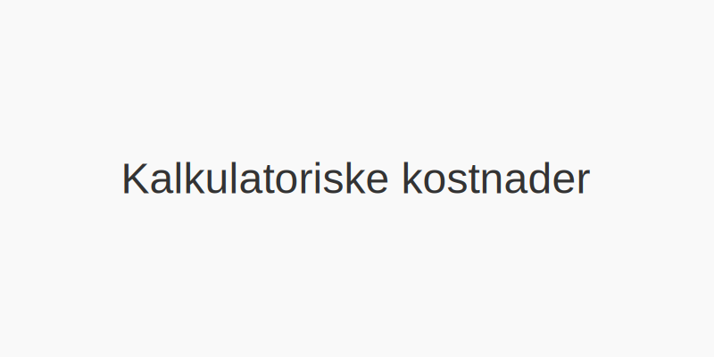

**Kalkulatoriske kostnader** er en type **implisitte kostnader** som representerer verdien av interne ressurser i regnskapsføringen når det ikke forekommer faktiske utbetalinger. Ved å inkludere kalkulatoriske kostnader får virksomheter et mer komplett bilde av alle forbrukte ressurser.

For en komplett oversikt over kostnadstyper og kostnadskonsepter i regnskap, se [Hva er kostnader?](/blogs/regnskap/hva-er-kostnader "Hva er Kostnader i Regnskap? Komplett Guide til Kostnadstyper og Regnskapsføring").

## Definisjon av kalkulatoriske kostnader

*Kalkulatoriske kostnader* omfatter kostnader som ikke innebærer kontantutbetaling, men likevel reflekterer et forbruk av ressurser ved bruk av egne eiendeler eller arbeidskraft.

## Typer kalkulatoriske kostnader

| Type kostnad                       | Beskrivelse                                                                      | Eksempel                                  |
|------------------------------------|----------------------------------------------------------------------------------|-------------------------------------------|
| Kalkulatorisk rente               | Kostnaden ved bundet egenkapital, beregnet som alternativ avkastning             | Rente på egenkapital på 5 %               |
| Kalkulatorisk lønn                | Verdien av eget arbeid eller arbeidsinnsats som ikke er utbetalt                 | Eierlønn for daglig leder i et AS         |
| Kalkulatorisk avskrivning         | Kostnaden knyttet til forbruk av varige driftsmidler                             | Avskrivning basert på gjenanskaffelsesverdi|
| Alternative kalkulatoriske kostnader | Verdi av nest beste bruk av interne ressurser                                   | Bruk av lokaler til eksternt kurs        |

For en helhetlig forståelse av kostnadsbegrepet, se også [Alternativkostnad](/blogs/regnskap/alternativkostnad "Hva er Alternativkostnad? Komplett Guide til Alternativkostnad og Beslutningsanalyse"), [Indirekte kostnader](/blogs/regnskap/hva-er-indirekte-kostnader "Hva er Indirekte kostnader? Definisjon, Eksempler og Regnskapsføring"), [Direkte kostnader](/blogs/regnskap/hva-er-direkte-kostnader "Hva er Direkte kostnader? Definisjon, Eksempler og Regnskapsføring") og [Kapitalkostnad](/blogs/regnskap/kapitalkostnad "Kapitalkostnad “ Grunnleggende konsept for norsk regnskap og investering").

## Hvorfor bruke kalkulatoriske kostnader?

- Gir et **fullstendig bilde** av alle kostnader, også når ingen kontantstrømmer forekommer.
- Understøtter mer presise **resultat- og lønnsomhetsanalyser**.
- Viktig ved **prissetting**, intern rapportering og beslutningsgrunnlag.
- Sikrer at bruk av egne ressurser blir **inkludert** i regnskapet.

## Praktiske eksempler

1. **Kalkulatorisk rente:** Bedriften binder 1 000 000 kr i egenkapital, med en kalkulatorisk rente på 4 %, tilsvarer dette en kalkulatorisk kostnad på 40 000 kr per år.
2. **Kalkulatorisk lønn:** En daglig leder tar ikke ut markedslønn på 800 000 kr, som likevel regnes som en kalkulatorisk kostnad.

| Scenario                          | Kalkulatorisk kostnad    |
|-----------------------------------|--------------------------|
| Egenkapital på 1 000 000 kr       | 40 000–¯kr per år (4–¯%)   |
| Eierens arbeidsinnsats            | 800 000–¯kr per år        |

## Hvordan beregne kalkulatoriske kostnader?

1. Identifiser interne ressurser som ikke medfører kontantutbetaling.
2. Bestem en hensiktsmessig beregningsbasis (markedsrente, markedslønn, restverdi).
3. Kalkuler den kalkulatoriske kostnaden for hver ressurs.
4. Summer alle kalkulatoriske kostnader for total kostnadspåvirkning.

## Oppsummering

**Kalkulatoriske kostnader** sørger for at alle ressurser, selv uten kontantstrøm, inkluderes i regnskapet. Ved å anvende kalkulatoriske kostnader oppnår virksomheter et mer komplett og realistisk regnskapsbilde, som er essensielt for god intern styring og beslutningsanalyse.

