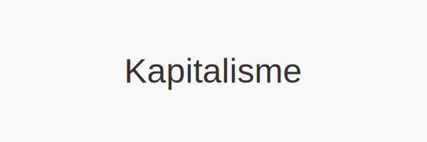

---
title: "Hva er Kapitalisme?"
seoTitle: "Kapitalisme | Hva det er og hvordan det påvirker økonomi"
description: "Kapitalisme er et økonomisk system basert på privat eierskap, fri konkurranse og markedspriser. Systemet danner rammene for verdiskaping, investeringer og ressursfordeling."
summary: "Lær hva kapitalisme er, historien, hovedprinsipper, varianter og hvordan systemet påvirker regnskap, økonomi og samfunn i Norge."
---

**Kapitalisme** er et *økonomisk system* basert på privat eierskap til produksjonsmidler, fri konkurranse og markedsbaserte priser. Som grunnlag for moderne [regnskap](/blogs/regnskap/hva-er-regnskap "Hva er Regnskap? En komplett guide") og økonomisk analyse, legger kapitalisme rammene for hvordan verdiskaping, investeringer og distribusjon av ressurser organiseres.

## Historisk bakgrunn

Kapitalismens røtter kan spores tilbake til tidlig moderne tid, med utviklingen av handel, kommersielle selskaper og pengeøkonomi i Europa. Over tid har systemet utviklet seg gjennom flere faser:

* **Kammeraltilværelse** og tidlig merkantilisme
* **Industrikapitalisme** fra 1700- og 1800-tallet
* **Monopolkapitalisme** i det 19. århundre
* **Moderne markedsøkonomi** med globalisering og finansmarkeder

## Grunnprinsipper

Kapitalismen hviler på nøkkelprinsipper som underbygger markedsdynamikk og økonomisk frihet:

1. Privat eierskap og individuelt initiativ
2. Fri prisdannelse gjennom tilbud og etterspørsel
3. Konkurranse som drivkraft for effektivitet og innovasjon
4. Beskyttelse av kontraktsrettigheter og rettssikkerhet

## Varianter av kapitalisme

Ulike former for kapitalisme har oppstått, tilpasset tid, samfunnskrav og målsetninger:

| **Variant**                | **Beskrivelse**                                              |
|----------------------------|-------------------------------------------------------------|
| **Fri markedskapitalisme** | Minimal statlig innblanding, fullstendig prisdannelse i markedet |
| **Stakeholder-kapitalisme**| Fokus på alle interessenter (ansatte, samfunn, miljø) i tillegg til aksjonærer |
| **Kvartalskapitalisme**    | Vektlegging av kortsiktige kvartalsresultater fremfor langsiktig verdiskaping |

For en dypere gjennomgang av disse variantene, se [Hva er Kapitalisme?](/blogs/regnskap/kapitalisme "Hva er Kapitalisme? Komplett Guide til Kapitalisme i Økonomi og Regnskap").

## Kapitalisme og regnskap

Kapitalisme setter rammene for moderne regnskap ved å definere hvilke transaksjoner, investeringer og eierskapsformer som skal rapporteres. Viktige koblinger inkluderer:

* [Hva er Kapital?](/blogs/regnskap/hva-er-kapital "Hva er Kapital? En komplett guide til Kapital")  
* [Hva er Egenkapital?](/blogs/regnskap/hva-er-egenkapital "Hva er Egenkapital? Komplett Guide til Egenkapital i Regnskap")  
* [Hva er Fremmedkapital?](/blogs/regnskap/hva-er-fremmedkapital "Hva er Fremmedkapital? Komplett Guide til Gjeld og Lånefinansiering")  

## Kapitalisme vs. andre økonomiske systemer

| **System**      | **Hovedtrekk**                             | **Rolle i økonomien**         |
|-----------------|---------------------------------------------|-------------------------------|
| Kapitalisme     | Privat eierskap, markedspriser, konkurranse | Effektiv verdiskaping         |
| Sosialisme      | Statlig eller kollektivt eierskap           | Omfordeling og samfunnsansvar |
| Kommunisme      | Felles eierskap uten markedsmekanismer      | Klassefri økonomi             |
| Blandingsøkonomi| Kombinasjon av privat og offentlig eierskap  | Balanserte sosiale mål        |

## Fordeler og ulemper

### Fordeler
* Økt innovasjon og produktivitetsvekst
* Dynamisk kapitalallokering gjennom markedet
* Individuell frihet og entreprenørskap

### Ulemper
* Sosial ulikhet og konsentrasjon av rikdom
* Risiko for økonomiske kriser og spekulasjon
* Underprioritering av miljø og langsiktig bærekraft

## Kapitalisme i Norge

I norsk kontekst kombineres frie markeder med en sterk velferdsstat og regulert arbeidsliv. Dette reflekteres i:

* Høy grad av transparens i [regnskapsføring](/blogs/regnskap/hva-er-bokforing "Hva er Bokføring? Grunnleggende prinsipper og krav")
* Regulatoriske rammeverk for finansmarkeder og selskapsstyring
* Balansegang mellom markedsfrihet og samfunnsmål som bærekraft og likhet (se [Hva er Bærekraftsrapportering?](/blogs/regnskap/hva-er-barekraftsrapportering "Hva er Bærekraftsrapportering? Krav og Implementering"))

## Fremtidens kapitalisme

Med økende fokus på **ESG**, **grønn finansiering** og **digitalisering**, vil kapitalismen utvikle seg videre. Nye trender inkluderer:

* Grønn finansiering og bærekraftige investeringer  
* Teknologidrevet kapitalallokering via **fintech** og **blockchain**  
* Kombinasjon av markedsmekanismer med samfunnsansvar (**impact investing**)

## Oppsummering

Kapitalisme som økonomisk system har formet moderne næringsliv og regnskap ved å fremme **privat eierskap**, **markedsbaserte priser** og **konkurranse**. Samtidig krever samfunnsutfordringer som ulikhet og klimaendringer at systemet tilpasses for å sikre langsiktig bærekraft og rettferdighet.

