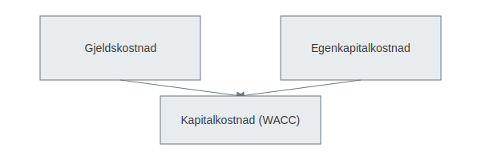

---
title: "Kapitalkostnad"
meta_title: "Kapitalkostnad"
meta_description: '**Kapitalkostnad** er den veide gjennomsnittlige kostnaden virksomheten har for kapital, både gjeld og egenkapital. Dette konseptet er sentralt for investering...'
slug: kapitalkostnad
type: blog
layout: pages/single
---

**Kapitalkostnad** er den veide gjennomsnittlige kostnaden virksomheten har for kapital, både gjeld og egenkapital. Dette konseptet er sentralt for investeringsbeslutninger, finansiering og verdsettelse, da kapitalkostnaden representerer avkastningskravet for å bære risiko.

## Hva er kapitalkostnad?

*Kapitalkostnad* viser til den minimale avkastningen virksomheten må oppnå for å dekke kostnadene ved å skaffe kapital. Den brukes for å:

* Vurdere lønnsomheten for prosjekter og investeringer
* Bestemme hvilken finansieringsstruktur som er optimal
* Beregne verdien av en virksomhet (diskonteringsrente)

Les også om [Hva er avkastning?](/blogs/regnskap/hva-er-avkastning "Hva er Avkastning? Komplett Guide til Investeringsavkastning og Beregning") og [Hva er internrente?](/blogs/regnskap/internrente "Hva er Internrente? Guide til IRR og Investeringsanalyse") for flere beregningsmetoder.

## Komponenter i kapitalkostnad

Kapitalkostnaden består primært av to komponenter:

| Komponent             | Forklaring                                                                                               |
|-----------------------|----------------------------------------------------------------------------------------------------------|
| **Gjeldskostnad**     | Rentevirkningen av lån og kreditter, etter skatt                                                        |
| **Egenkapitalkostnad** | Avkastningskrav til eierne for å bære selskapets risiko (ofte beregnet med Capital Asset Pricing Model) |

## Formler og beregning

Den vanligste formelen for kapitalkostnad er **WACC** (Weighted Average Cost of Capital):

$$
\text{WACC} = \frac{E}{V} \times k_e + \frac{D}{V} \times k_d \times (1 - T)
$$

Der:

* $E$ = Markedsverdi egenkapital  
* $D$ = Markedsverdi gjeld  
* $V$ = $E + D$ (totalt kapitalbeløp)  
* $k_e$ = Egenkapitalkostnad  
* $k_d$ = Før-skatte gjeldskostnad  
* $T$ = Selskaps skattesats (per i dag **22 %**)

For mer om beregning av **egenkapitalkostnad**, se [Egenkapitalmetoden](/blogs/regnskap/egenkapitalmetoden "Egenkapitalmetoden “ Avkastningskrav pÃ¥ egenkapital i regnskap"), og for **gjeldskostnad**, les [Hva er gjeld?](/blogs/regnskap/hva-er-gjeld "Hva er Gjeld? Guide til Gjeldstyper og Regnskapsføring").

## Praktisk eksempel

| Post                            | Verdi            |
|---------------------------------|------------------|
| Markedsverdi egenkapital (E)    | 2 000 000 NOK    |
| Markedsverdi gjeld (D)          | 1 000 000 NOK    |
| Egenkapitalkostnad ($k_e$)      | 8 %              |
| Gjeldskostnad før skatt ($k_d$) | 5 %              |
| Skattesats (T)                  | 22 %             |
| **WACC**                        | **6,5 %**        |

## Betydning for investeringsbeslutninger

En investering må typisk gi en forventet avkastning som overstiger kapitalkostnaden for å være verdiskapende. Bruk kapitalkostnaden i:

* **Nåverdiberegning (NPV):** Diskonter fremtidige kontantstrømmer med WACC  
* **Internrente (IRR):** Sammenlign IRR med WACC som akseptkriterium  
* **Kostnads- og lønnsomhetsanalyse:** Vurder prosjekter basert på avkastning over kapitalkostnad  

## Vanlige spørsmål

### Hvordan påvirker kapitalkostnad selskapsverdi?

En høyere WACC fører til lavere nåverdi av fremtidige kontantstrømmer, og dermed lavere verdi på selskapet.

### Hva er forskjellen mellom kapitalkostnad og avkastningskrav?

Kapitalkostnaden er et uttrykk for avkastningskravet på selskapets samlede kapital, mens avkastningskrav kan referere til krav for enkeltinvesteringer eller eiendeler.

## Videre lesning

* [Hva er alternativkostnad?](/blogs/regnskap/alternativkostnad "Hva er Alternativkostnad? Komplett Guide til Alternativkostnad og Beslutningsanalyse")  
* [Hva er kalkulatoriske kostnader?](/blogs/regnskap/kalkulatoriske-kostnader "Hva er Kalkulatoriske kostnader? Guide til kalkulatoriske kostnader og Regnskapsanalyse")  
* [Hva er faste kostnader?](/blogs/regnskap/faste-kostnader "Hva er Faste kostnader? Definisjon og Eksempler")  
* [Hva er indirekte kostnader?](/blogs/regnskap/hva-er-indirekte-kostnader "Hva er Indirekte kostnader? Definisjon, Eksempler og Regnskapsføring")

