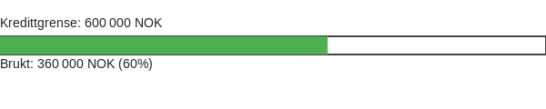

Kassekreditt er en fleksibel, kortsiktig finansieringsløsning som gir bedrifter tilgang til likvide midler ved å opprette en kredittramme på bedriftskontoen. Denne **overdraft-fasiliteten** brukes ofte for å håndtere svingninger i [likviditet](/blogs/regnskap/hva-er-likviditet "Hva er Likviditet? Komplett Guide til Likviditet og Likviditetsstyring"), dekke uforutsette utgifter eller finansiere sesongbaserte behov.

## Hvordan fungerer kassekreditt?

En kassekreditt er definert ved følgende hovedelementer:

* **Kredittramme:** Maksimalt beløp banken tillater at bedriften kan overtrekke.
* **Rente:** Flytende rente, ofte basert på NIBOR pluss en margin.
* **Termingebyr:** Årlig eller månedlig gebyr for å opprettholde kredittrammen.
* **Sikkerhet:** Pant i kundefordringer, varelager eller andre eiendeler.
* **Disponeringstid:** Kredittrammen er tilgjengelig fortløpende innenfor avtalte vilkår.

## Kostnader og gebyrer

Under ser du en oversikt over typiske kostnadselementer for **kassekreditt**:

| **Faktor**          | **Beskrivelse**                                                |
|---------------------|----------------------------------------------------------------|
| Kredittramme        | 100 000 – 5 000 000 NOK, avhengig av selskapets behov og sikkerhet |
| Rente               | NIBOR + 1–3 % margin                                            |
| Opprettelsesgebyr   | 0 – 20 000 NOK ved innvilgelse                                  |
| Termingebyr         | 0 – 2 000 NOK per måned                                        |

## Regnskapsføring av kassekreditt

Kassekreditt føres som **kortsiktig gjeld** i balansen. Når bedriften bruker kredittrammen, skjer følgende bokføring:

| **Konto**                 | **Debet** | **Kredit** | **Beskrivelse**                           |
|---------------------------|-----------|------------|-------------------------------------------|
| 1920 Bankinnskudd         | X         |            | Innsatte midler fra utnyttet kassekreditt |
| 2240 Kassekreditt         |           | X          | Opptak av kassekreditt                    |

Se også [Hva er kortsiktig gjeld?](/blogs/regnskap/kortsiktig-gjeld "Hva er Kortsiktig Gjeld? Komplett Guide til Gjeldskategorier") og [Hva er bokføring?](/blogs/regnskap/hva-er-bokforing "Hva er Bokføring? Komplett Guide til Regnskapsføring og Bokføringsregler").

## Fordeler og ulemper

**Fordeler:**

* **Fleksibilitet:** Betaler kun rente av det beløpet som faktisk er trukket.
* **Umiddelbar tilgang:** Midlene er tilgjengelige uten ny søknadsrunde.
* **Likviditetssikring:** Bidrar til å opprettholde god [likviditetsstyring](/blogs/regnskap/hva-er-likviditetsstyring "Hva er Likviditetsstyring? Komplett Guide til Likviditetsstyring").

**Ulemper:**

* **Renteutgifter:** Høyere rente enn vanlige bankinnskudd.
* **Gebyrer:** Etablerings- og termingebyr kan øke kostnaden.
* **Sikkerhetskrav:** Banken krever ofte pant eller garantier, for eksempel [bankgaranti](/blogs/regnskap/bankgaranti "Bankgaranti - Guide til Sikkerhetsstillelse").

## Når bør du bruke kassekreditt?

Kassekreditt er spesielt nyttig i situasjoner som:

* Sesongvariasjoner i ordre og innbetalinger.
* Uforutsette likviditetstopper, for eksempel ved store investeringer.
* Midlertidige finansieringsbehov mens langsiktige lån behandles.
* Støtte likviditetsbudsjettet i perioder med midlertidig betalingsforsinkelser.

For mer detaljert planlegging, se [likviditetsbudsjett](/blogs/regnskap/likviditetsbudsjett "Likviditetsbudsjett - Slik lager du et nøyaktig likviditetsregnskap").

## Relaterte Konsepter

* [Hva er likviditet?](/blogs/regnskap/hva-er-likviditet "Hva er Likviditet? Komplett Guide til Likviditet og Likviditetsstyring")
* [Rammelån](/blogs/regnskap/rammelan "Rammelån: Fleksibelt rammefinansiering for Norske Bedrifter")
* [Hva er kortsiktig gjeld?](/blogs/regnskap/kortsiktig-gjeld "Hva er Kortsiktig Gjeld? Komplett Guide til Gjeldskategorier")
* [Hva er bankgaranti?](/blogs/regnskap/bankgaranti "Bankgaranti - Guide til Sikkerhetsstillelse")
* [Hva er bokføring?](/blogs/regnskap/hva-er-bokforing "Hva er Bokføring? Komplett Guide til Regnskapsføring og Bokføringsregler")
* [Hva er likviditetsbudsjett?](/blogs/regnskap/likviditetsbudsjett "Likviditetsbudsjett - Slik lager du et nøyaktig likviditetsregnskap")
